# Code Indexing Architecture Diagrams

**Version:** 1.0
**Author:** Architect Agent (Task #35)
**Date:** 2026-01-31
**Related:** CODE_INDEXING_DESIGN.md

---

## 1. System Overview

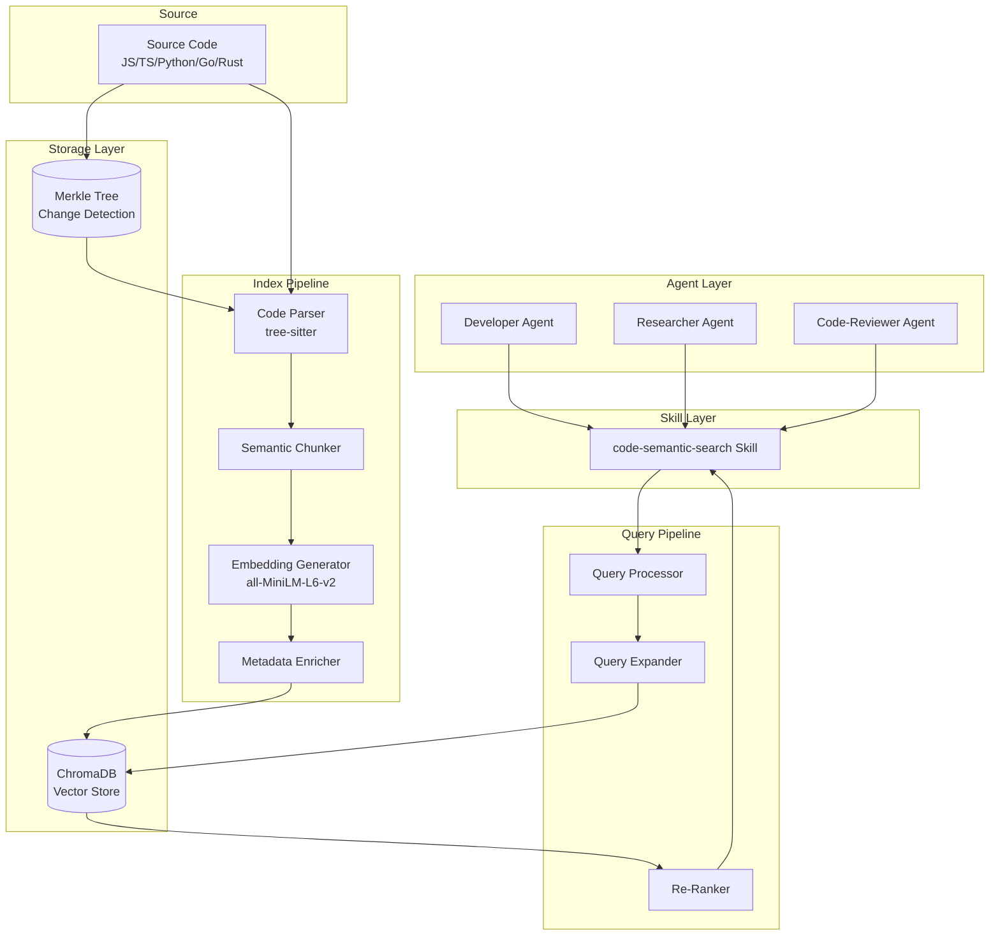

---

## 2. Indexing Pipeline (7-Step)

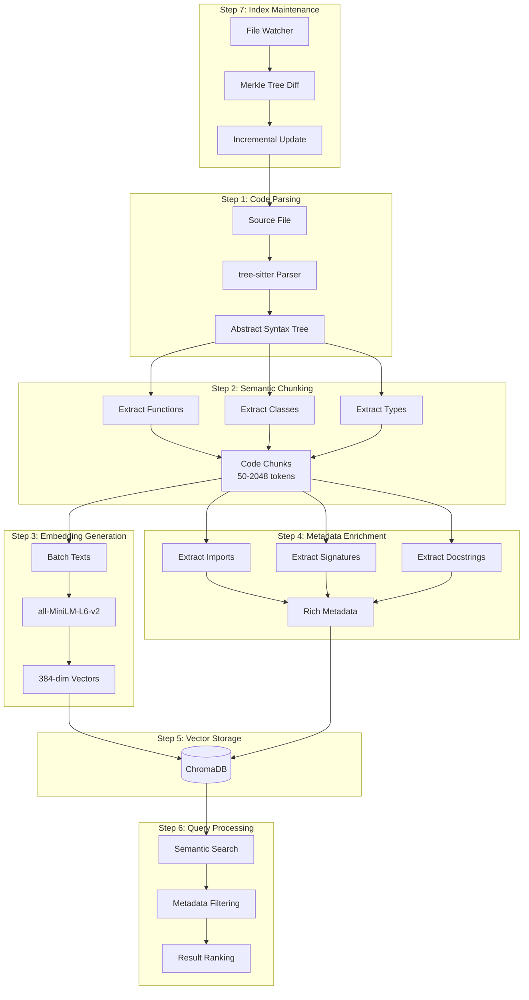

---

## 3. Query Flow

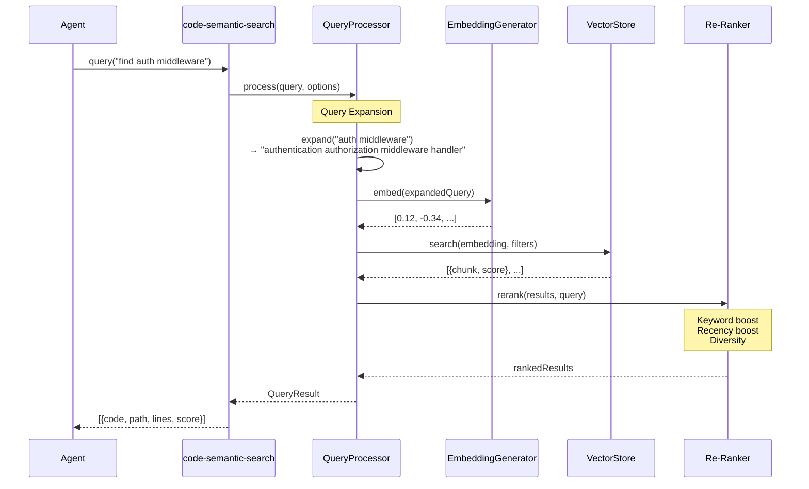

---

## 4. Merkle Tree Change Detection

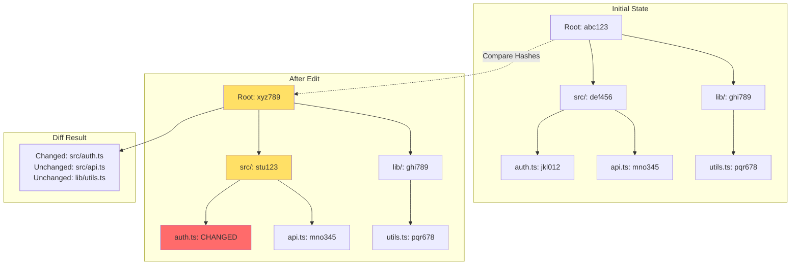

---

## 5. Component Architecture

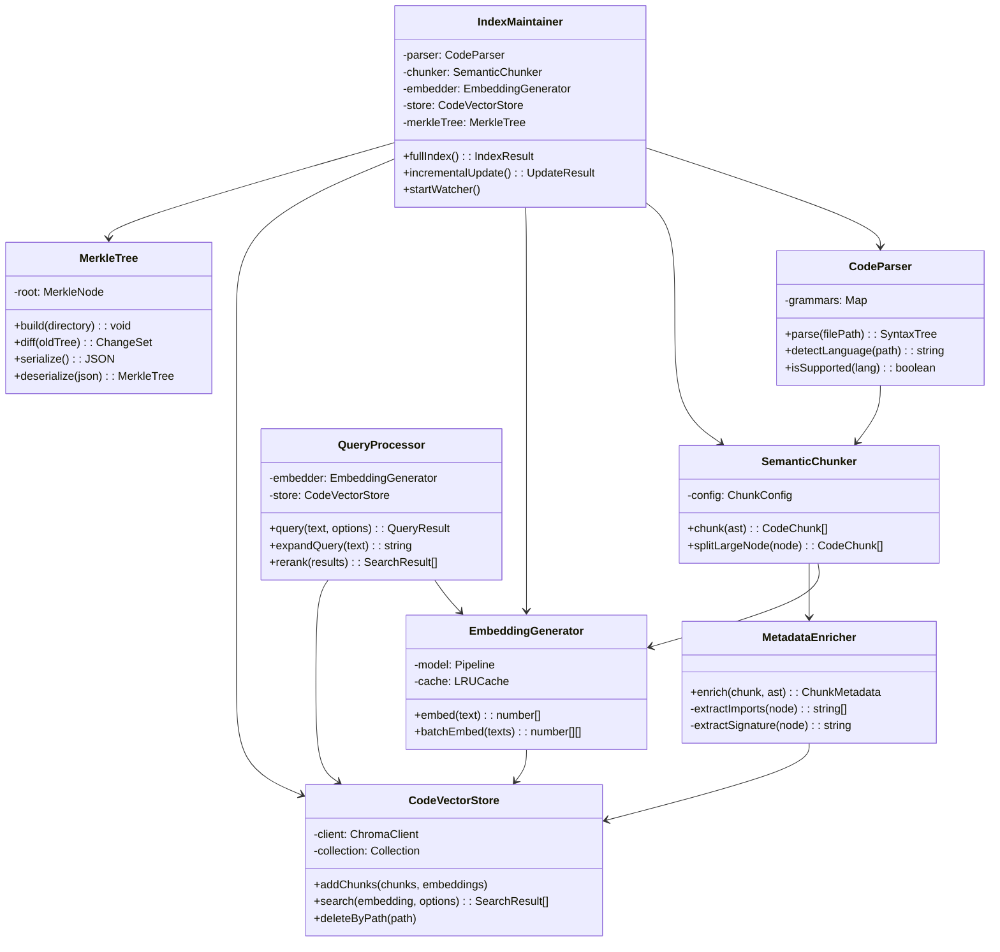

---

## 6. Data Flow

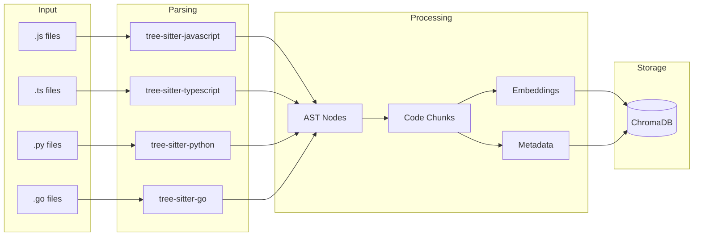

---

## 7. Skill Integration

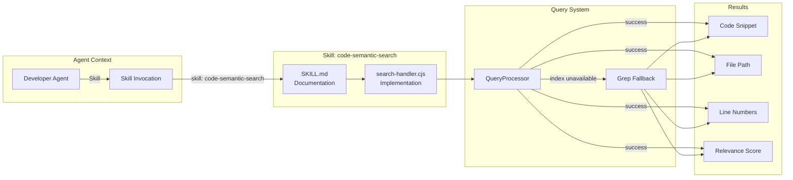

---

## 8. File Structure

```
.claude/
├── lib/
│   └── code-indexing/
│       ├── code-parser.cjs          # tree-sitter wrapper
│       ├── semantic-chunker.cjs     # AST → chunks
│       ├── embedding-generator.cjs  # local embeddings
│       ├── metadata-enricher.cjs    # metadata extraction
│       ├── vector-store.cjs         # ChromaDB wrapper
│       ├── query-processor.cjs      # search pipeline
│       ├── index-maintainer.cjs     # sync + updates
│       ├── merkle-tree.cjs          # change detection
│       └── index.cjs                # exports
│
├── skills/
│   └── code-semantic-search/
│       ├── SKILL.md                 # agent docs
│       └── search-handler.cjs       # skill impl
│
├── tools/cli/
│   ├── index-codebase.cjs           # CLI: index
│   └── search-code.cjs              # CLI: search
│
├── data/
│   └── code-index/
│       ├── chromadb/                # vector storage
│       ├── merkle-tree.json         # tree state
│       └── index-metadata.json      # statistics
│
└── config/
    └── code-index-config.json       # configuration
```

---

## 9. Performance Targets

```mermaid
gantt
    title Query Latency Breakdown (Target: <500ms)
    dateFormat X
    axisFormat %L ms

    section Query Processing
    Query Expansion           :0, 20
    Query Embedding          :20, 50

    section Vector Search
    ChromaDB HNSW Search     :50, 100

    section Post-Processing
    Metadata Filtering       :100, 120
    Re-ranking               :120, 150
    Context Assembly         :150, 200

    section Buffer
    Safety Margin            :200, 500
```

---

## 10. Comparison: Before vs After

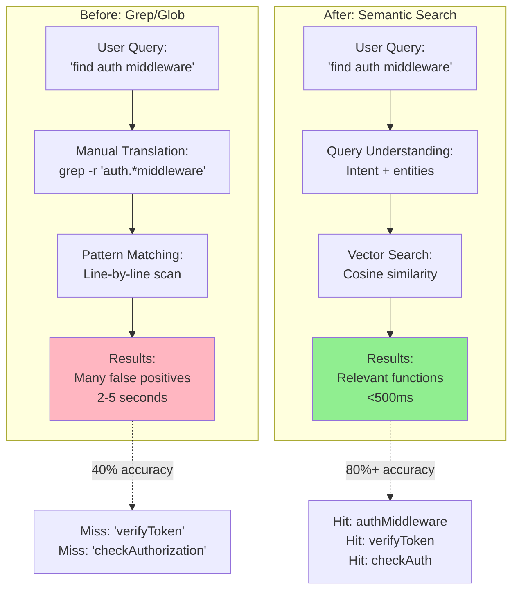

---

## 11. Incremental Update Flow

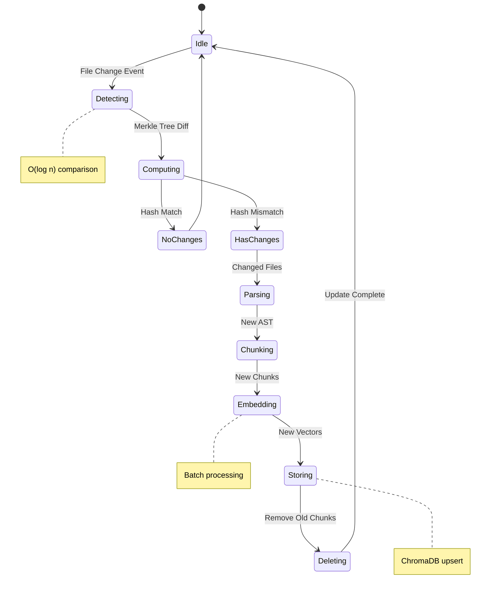

---

## 12. Error Handling

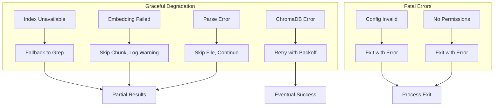

---

## Summary

These diagrams illustrate:

1. **System Overview:** High-level architecture showing all components
2. **Indexing Pipeline:** The 7-step process from source to storage
3. **Query Flow:** Sequence diagram of search request handling
4. **Merkle Tree:** Change detection mechanism
5. **Component Architecture:** Class relationships
6. **Data Flow:** How code transforms through the pipeline
7. **Skill Integration:** Agent-to-skill communication
8. **File Structure:** Directory organization
9. **Performance Targets:** Latency breakdown
10. **Comparison:** Before/after semantic search
11. **Incremental Updates:** State machine for change handling
12. **Error Handling:** Graceful degradation paths
