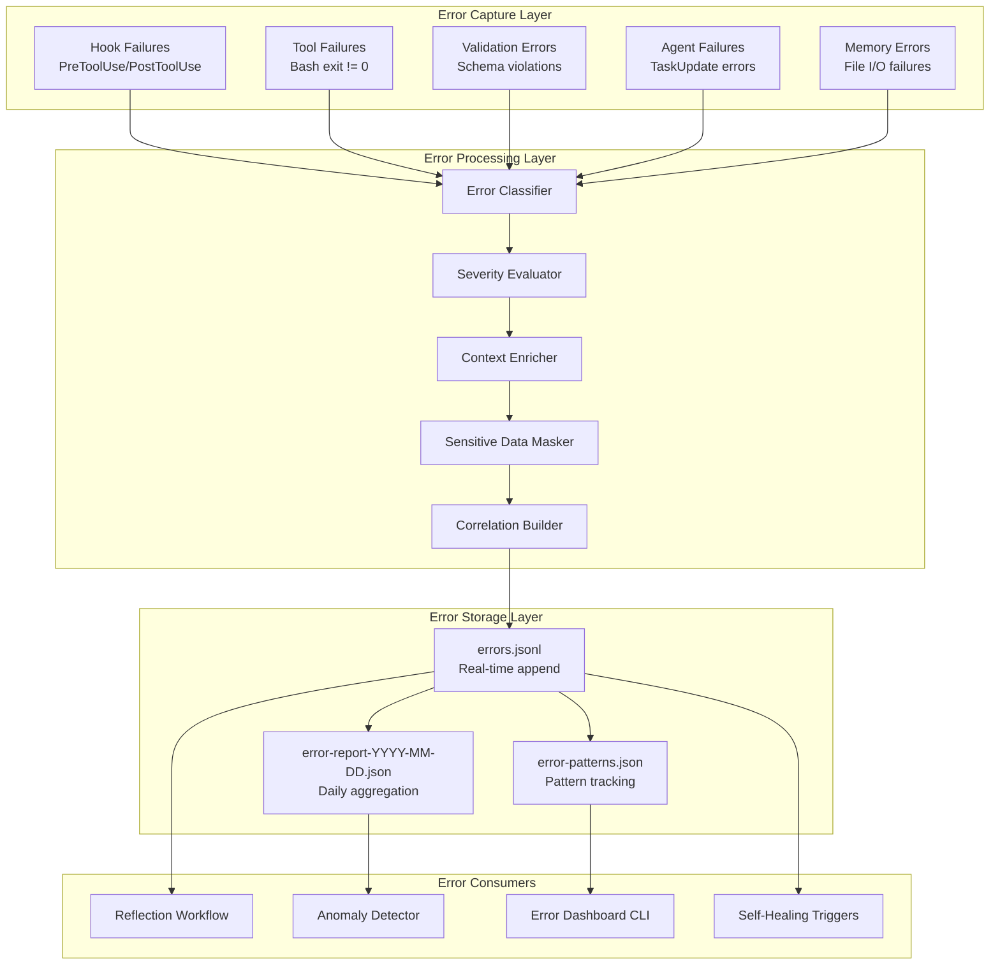
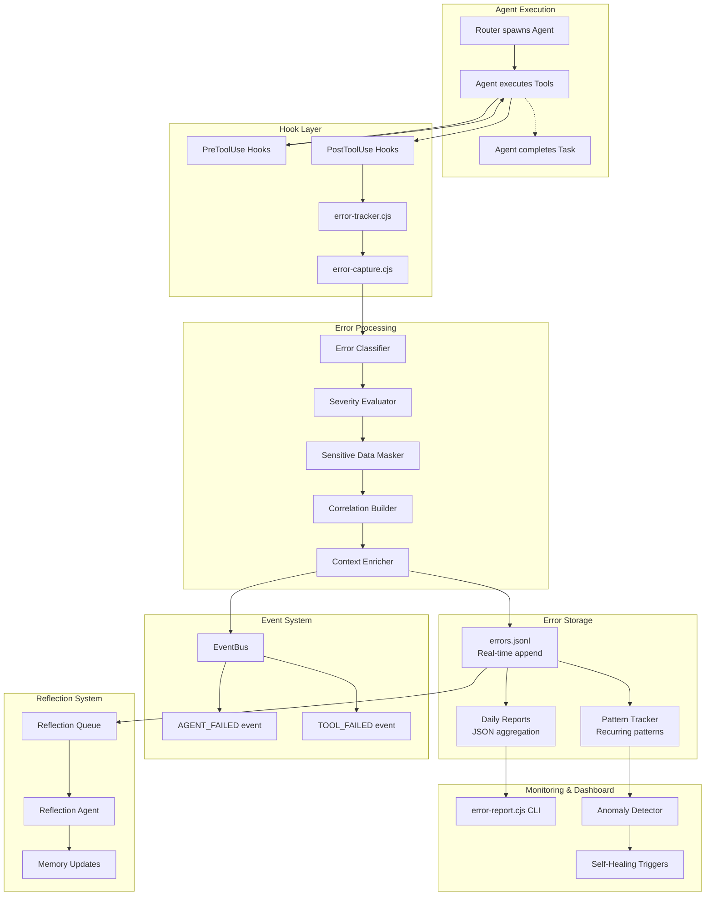
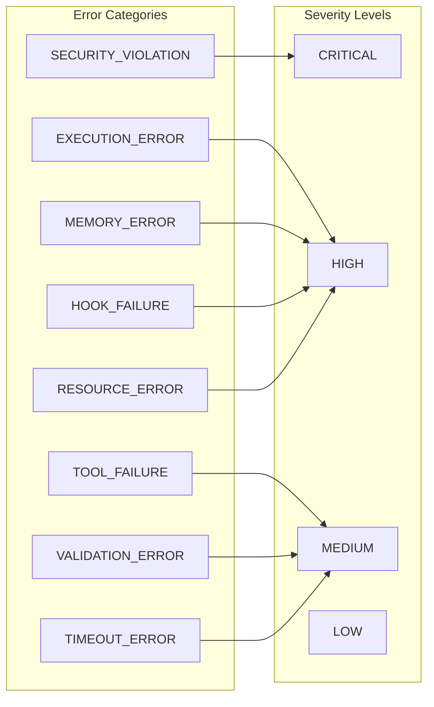
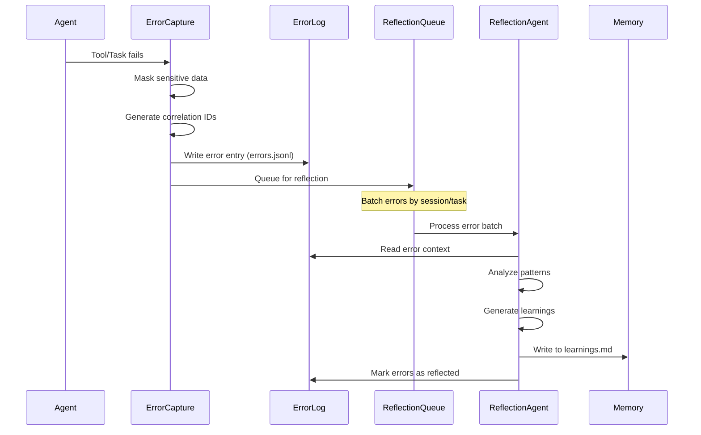
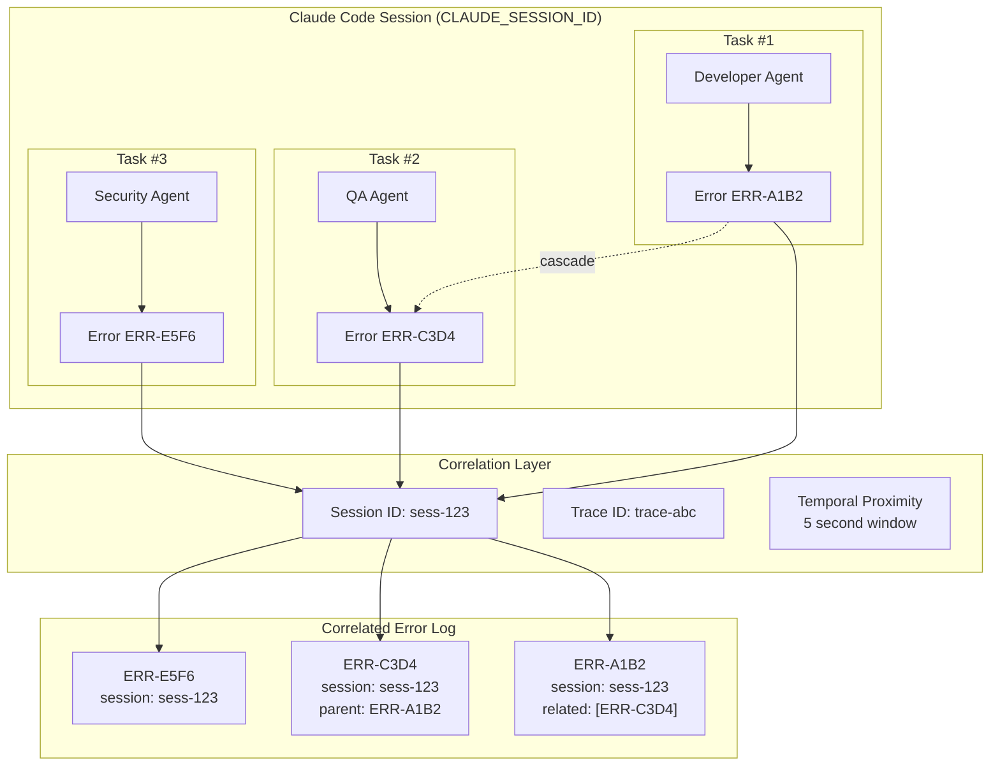
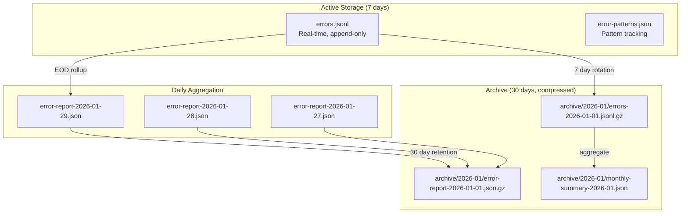
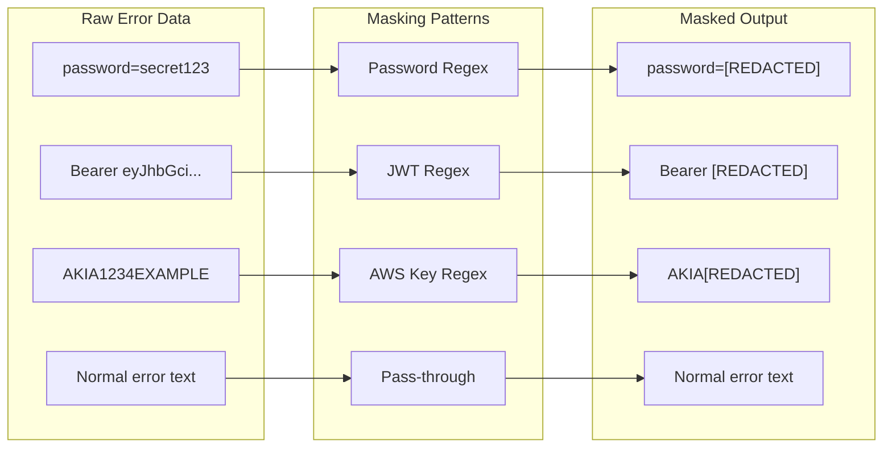
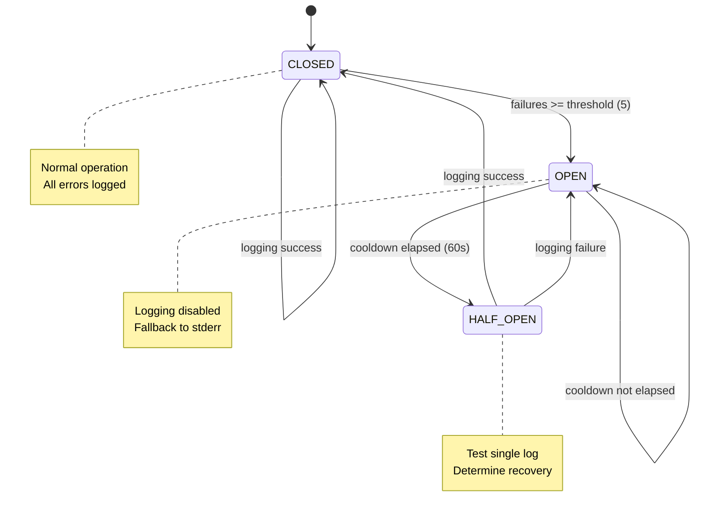
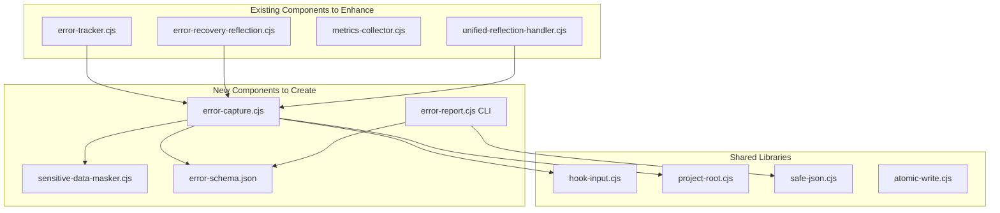

# Error Logging System Architecture Diagrams

**Document:** Error Logging System Architecture
**Date:** 2026-01-29
**Related Design:** `.claude/context/artifacts/error-logging-system-design.md`

---

## 1. High-Level System Architecture



---

## 2. Detailed Error Flow



---

## 3. Error Categories and Severity Matrix



---

## 4. Reflection Workflow Integration



---

## 5. Correlation Across Parallel Agents



---

## 6. Error Storage Hierarchy



---

## 7. Sensitive Data Masking Flow



---

## 8. Circuit Breaker for Error Logging



---

## 9. File Structure

```
.claude/context/artifacts/error-reports/
|
+-- errors.jsonl                    # Real-time append-only log
+-- error-report-2026-01-29.json    # Daily aggregated report
+-- error-report-2026-01-28.json
+-- error-patterns.json             # Recurring pattern tracking
|
+-- archive/
    +-- 2026-01/
        +-- errors-2026-01-01.jsonl.gz
        +-- error-report-2026-01-01.json.gz
        +-- monthly-summary-2026-01.json
```

---

## 10. Component Dependencies



---

## Viewing Instructions

These diagrams use Mermaid syntax. To view them:

1. **GitHub/GitLab:** Renders Mermaid automatically in markdown preview
2. **VS Code:** Install "Markdown Preview Mermaid Support" extension
3. **Online:** Paste code at https://mermaid.live/
4. **CLI:** Use `mmdc` (Mermaid CLI) to generate PNG/SVG

---

_Generated by Architect Agent | 2026-01-29_
