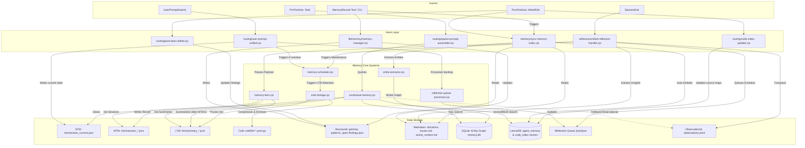

# Memory System Architecture Flow

This diagram illustrates the lifecycle of memory across events, hook handlers, the core systems, and data storage.

```mermaid
graph TD
    %% Events
    subgraph Events
        UPS[UserPromptSubmit]
        PT[PreToolUse: Task]
        PTW[PostToolUse: Write/Edit]
        SE[SessionEnd]
        MR[MemoryRecord Tool / CLI]
    end

    %% Hooks / Handlers
    subgraph Hooks [Hook Layer]
        UPU[routing/user-prompt-unified.cjs]
        SPA[routing/spawn-prompt-assembler.cjs]
        SMI[memory/sync-memory-index.cjs]
        CIU[routing/code-index-updater.cjs]
        PTU[routing/post-task-unified.cjs]
        URH[reflection/unified-reflection-handler.cjs]
        MM[lib/memory/memory-manager.cjs]
    end

    %% Memory Lib / Systems
    subgraph Core [Memory Core Systems]
        MT[memory-tiers.cjs]
        CM[contextual-memory.cjs]
        MS[memory-scheduler.cjs]
        CS[cold-storage.cjs]
        EE[entity-extractor.cjs]
        LQ[reflection-queue-processor.cjs]
    end

    %% Storage
    subgraph Storage [Data Storage]
        STM[STM: stm/session_current.json]
        MTM[MTM: mtm/session_*.json]
        LTM[LTM: ltm/summary_*.json]
        COLD[Cold: cold/ltm-*.jsonl.gz]

        SJSON[Structured: gotchas, patterns, open-findings.json]
        MD[Markdown: decisions, issues.md, active_context.md]

        SQL[(SQLite: Entity Graph memory.db)]
        LDB[(LanceDB: agent_memory \n & code_index vectors)]
        RQ[Reflection Queue jsonl/json]
        OBS[Observational: observations.jsonl]
    end

    %% Event Wiring
    UPS --> UPU
    PT --> SPA
    PTW --> SMI
    PTW --> CIU
    PTW --> PTU
    SE --> URH
    MR --> MM
    MR -->|Triggers| SMI

    %% UserPromptSubmit Hook
    UPU -->|Writes current state| STM
    UPU -->|Processes backlog| LQ
    LQ -->|Updates| RQ
    UPU -->|Triggers if overdue| MS

    %% Spawn Prompt Assembler
    SPA -->|Queries| CM
    CM -->|SQL Search| SQL
    CM -->|Vector/BM25 Search| LDB
    CM -->|Hot Sessions| MTM
    CM -->|Hot Summaries| LTM
    CM -.->|Fallback/Observational| OBS

    %% Memory Record / Manager
    MM -->|Writes| SJSON
    MM -->|Updates| MD

    %% Sync Memory Index (PostToolUse)
    PTU -->|Updates findings| SJSON
    SMI -->|Reads| SJSON
    SMI -->|Reads| MD
    SMI -->|Extracts Entities| EE
    EE -->|Writes Graph| SQL
    SMI -->|Auto-embeds| LDB
    CIU -->|Updates source maps| LDB

    %% Unified Reflection (SessionEnd)
    URH -->|Extracts Insights| MD
    URH -->|Compacts| OBS
    URH -->|Passes Payload| MT
    URH -->|Queues Evolution| RQ
    URH -->|Triggers Maintenance| MS

    %% Tiers & Scheduling
    MT -->|Clears| STM
    MT -->|Writes Recent| MTM
    MT -->|Summarizes older MTM to| LTM

    MS -->|Triggers LTM Retention| CS
    CS -->|Compresses & Archives| COLD
    CS -->|Prunes Hot| LTM
```
