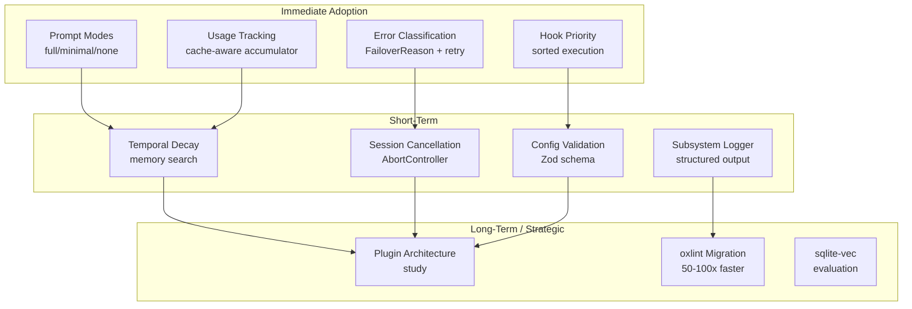

<!-- Agent: technical-writer | Task: #1 | Session: 2026-02-19 -->

# OpenClaw Codebase Analysis: Enhancement Opportunities for Agent Studio

**Date:** 2026-02-19
**Author:** Technical Writer Agent
**Task:** #1

---

## Executive Summary

OpenClaw is a multi-channel AI gateway orchestration system with 38 plugins, 25+ messaging channels, and a plugin-first architecture. It is fundamentally different from agent-studio: OpenClaw routes messages across communication channels (gateway pattern), while agent-studio routes work across specialized agents (orchestrator pattern).

Despite this architectural difference, OpenClaw contains several battle-tested subsystems worth adopting. The highest-value targets are its prompt mode system (full/minimal/none variants that reduce subagent context by 40-60%), its priority-based hook runner (which adds ordering and per-type merge semantics that agent-studio currently lacks), its structured error classification with intelligent retry, and its cache-aware token usage accumulator.

This report synthesizes findings from two analysis passes and organizes opportunities into three tiers: Adopt (high ROI, low risk), Consider (medium ROI), and Study (strategic/long-term).

---

## 1. Architecture Overview

OpenClaw is built as a **multi-channel AI gateway**. Its core job is to receive messages from any of 25+ channels (Discord, Slack, Telegram, Web, iOS, Android, etc.), route them through a plugin pipeline, and deliver responses back to the originating channel.

### Core structural properties

- **Plugin-first**: the core stays lean; all features ship as plugins. Thirty-eight extensions cover capabilities from memory to auth to channel adapters.
- **pnpm monorepo with TypeScript/ESM**: modern toolchain (oxlint, oxfmt, Vitest, tsdown/rolldown).
- **Cross-platform clients**: macOS (SwiftUI), iOS, Android, and a Web dashboard all connect to the same gateway.
- **WebSocket control plane**: clients connect and receive real-time events from the gateway.
- **Pi agent framework** (`@mariozechner/pi-agent-core v0.53.0`): the LLM orchestration layer sitting beneath the plugin system.

### Relationship to agent-studio

| Dimension | OpenClaw | Agent Studio |
|-----------|----------|--------------|
| Core pattern | Gateway (message routing) | Orchestrator (agent routing) |
| Agent model | Single agent per workspace | 59 specialized agents |
| Plugin system | First-class (38 extensions) | Skills + hooks (separate systems) |
| Hook system | 15+ types with priority ordering | Pre/post with file-based registration |
| Memory | Plugin-based (swappable) | Built-in tiers (STM/MTM/LTM) |
| Prompt assembly | Mode-based (full/minimal/none) | Template-based (spawn templates) |
| Error handling | Classified failover with retry | Ad-hoc per agent |
| Multi-agent | Workspace isolation | Router + task-based coordination |
| Config format | JSON5 + Zod + migration | YAML + JSON + env vars |

The systems solve adjacent but distinct problems. OpenClaw excels at runtime resilience (error classification, retry, failover) and prompt efficiency (modal variants). Agent-studio excels at specialist routing and memory tiers. The enhancement opportunities flow in one direction: from OpenClaw's runtime and prompt patterns into agent-studio.

---

## 2. High-Value Enhancement Opportunities (Tier 1 — Adopt)

These four patterns have high ROI and low integration risk. Each maps directly onto a known gap in agent-studio.

### 2.1 Plugin/Extension System with Priority-Based Hooks

**What OpenClaw does:**

OpenClaw's 38 plugins each carry an `openclaw.plugin.json` manifest and register hooks against 15+ named hook types:

- **Lifecycle hooks**: `before_agent_start`, `session_start`, `session_end`
- **LLM hooks**: `before_model_resolve`, `llm_input`, `llm_output`
- **Tool hooks**: `before_tool_call`, `after_tool_call`
- **Message hooks**: `message_received`, `message_sent`

The hook runner executes hooks sorted by priority (descending). Void hooks run in parallel; result hooks run sequentially. Each hook type has its own merge semantics rather than a generic merge.

**What agent-studio has today:**

Hooks in agent-studio use file-based registration in `settings.json`. There is no priority field and no per-type merge semantics. Hooks at the same event point have undefined execution order.

**Why this matters:**

The current lack of priority ordering means a safety hook and an audit hook at `PreToolUse` have unpredictable execution order. When two hooks both transform the same input, the final result depends on file-system ordering, not declared intent.

**Recommended adoption:**

1. Add a `priority` integer field to hook registration entries in `settings.json`.
2. Update the hook runner to sort by priority descending before executing.
3. Define per-type merge semantics for the four most common hook types (guard, transform, audit, metric).

This change is backward-compatible: existing hooks without a priority field default to `0`.

---

### 2.2 Dynamic Prompt Modes (full/minimal/none)

**What OpenClaw does:**

OpenClaw's `PromptMode` system provides three variants for prompt assembly:

- **`full`**: complete context for main/orchestrator agents — all skills, memory, messaging context, time, and reply tags.
- **`minimal`**: stripped-down context for subagents — excludes heavy sections, checks `isMinimal` before each section is added.
- **`none`**: raw JSON input for tool-calling agents — no prompt overhead at all.

The minimal mode enforces a hard constraint: "never read more than one skill upfront." This prevents context explosion in subagent chains.

**What agent-studio has today:**

All spawned agents receive the same spawn template regardless of their role. A subordinate one-shot agent gets the same context sections as an orchestrator. The `universal-agent-spawn.md` template does not vary by agent role or task complexity.

**Why this matters:**

Each subagent spawn with full context consumes 8,000-15,000 tokens of context overhead. In a pipeline with 6 subagents, that's 48,000-90,000 tokens of repeated boilerplate. Switching subagents to a minimal mode would recover 40-60% of that budget.

The "lost in the middle" problem (see `performance.md`) means context past 32K tokens has 20-40% lower retrieval accuracy. Reducing subagent context directly improves agent decision quality, not just cost.

**Recommended adoption:**

1. Define three spawn template variants: `full` (current), `minimal` (skills/memory sections stripped), `none` (task instructions only).
2. Add a `prompt_mode` field to agent frontmatter (`core`, `domain`, `specialized`, `orchestrator`).
3. Update the `spawn-prompt-assembler.cjs` to select the template variant based on `prompt_mode`.
4. Default: orchestrators get `full`, specialized agents get `minimal`, one-shot subordinates get `none`.

---

### 2.3 Failover Error Classification with Intelligent Retry

**What OpenClaw does:**

OpenClaw uses a `FailoverReason` enum with five named cases:

| Code | Reason | Trigger |
|------|--------|---------|
| 402 | `billing` | Payment required |
| 429 | `rate_limit` | Too many requests |
| 401 | `auth` | Authentication failed |
| 408 | `timeout` | Request timed out |
| 400 | `format` | Bad request format |

Error detection works in a stack:
1. Check HTTP status code
2. Check error name field
3. Match message text against patterns
4. Traverse the cause chain

Retry uses exponential backoff with jitter: `delay = minDelay × 2^(attempt-1)`. A random jitter component prevents thundering-herd from multiple agents hitting the same rate limit simultaneously. The system also reads `Retry-After` response headers and respects the server's requested delay.

**What agent-studio has today:**

Agent spawn errors surface as unstructured text. There is no classification, no automatic retry, and no backoff. A rate-limited agent fails immediately and the router receives no structured signal about why.

**Why this matters:**

Rate limiting and transient billing errors are the most common production failure mode for LLM calls. Without classification, these failures look identical to permanent errors (auth failures, format errors). Without retry, a 429 that would resolve in 2 seconds causes a task failure that the user must manually restart.

**Recommended adoption:**

1. Add a `FailoverReason` enum to the agent error handling layer.
2. Implement the four-layer error detection stack (status → name → message → cause chain).
3. Add exponential backoff with jitter for `rate_limit` and `timeout` cases.
4. Pass `FailoverReason` to the router so it can make spawn decisions (e.g., skip auth failover, retry rate-limit failover).

---

### 2.4 Usage Tracking with Cache-Aware Accumulation

**What OpenClaw does:**

OpenClaw's `UsageAccumulator` tracks token usage with a distinction between cumulative and per-call fields:

- **Cumulative**: total input tokens, total output tokens (summed across all tool-call rounds).
- **Per-call only**: `cacheRead` and `cacheWrite` (only the last call's values are kept).

This distinction prevents a specific inflation bug: when an agent makes 10 tool calls, each round reports `cacheRead ≈ context_size`. Summing those gives 10× context_size, which is incorrect — the cache read is the same context each time. Using only `lastCacheRead` for budget calculation avoids this inflation.

**What agent-studio has today:**

Agent-studio has no token tracking at the spawn level. Individual LLM calls may report usage, but there is no accumulator that spans the full agent lifecycle including tool-call rounds.

**Why this matters:**

Without accurate token tracking, the router cannot enforce token budgets per agent, detect agents approaching context limits before they fail, or produce accurate cost accounting for enterprise use.

The cache inflation bug, if unaddressed, would cause budget monitors to see 10x actual usage and prematurely abort agents that are well within their real budget.

**Recommended adoption:**

1. Add a `UsageAccumulator` class to the agent metrics layer.
2. Track `totalInputTokens` and `totalOutputTokens` cumulatively.
3. Track `lastCacheRead` and `lastCacheWrite` as per-call values (overwrite, not sum).
4. Expose accumulator state in task metadata at `TaskUpdate(completed)`.

---

## 3. Medium-Value Enhancement Opportunities (Tier 2 — Consider)

These patterns address real gaps in agent-studio but require more design work or have higher integration cost.

### 3.1 Auth Profile Failover System

OpenClaw supports multiple API keys per agent with automatic failover. When a profile fails, it enters a cooldown period with automatic expiry and recovery timing. Each agent gets per-agent auth isolation, and the system supports four auth kinds: `oauth`, `api_key`, `token`, `device_code`, and `custom`.

**Relevance to agent-studio:** Agent-studio uses a single API key per model. If that key is rate-limited, all agents queue behind the same limit. A multi-key failover system would allow agents to continue operating during partial rate-limit windows by routing through alternative keys.

**Adoption complexity:** Medium. Requires changes to the model resolution layer and a new auth profile store.

---

### 3.2 Temporal Decay in Memory Search

OpenClaw's memory search uses hybrid retrieval (vector weight 0.7, text weight 0.3) with a 4x candidate multiplier for pre-filtering and MMR (Maximum Marginal Relevance) for diversity. Crucially, it applies a **30-day half-life exponential decay** that weights recent memories higher than older ones.

**Relevance to agent-studio:** Agent-studio's BM25 search treats a learning recorded two years ago identically to one recorded yesterday. For rapidly evolving patterns (hook formats, routing rules, model IDs), older memories should rank lower by default.

The decay formula is straightforward: `weight = base_weight × 0.5^(days_since_creation / 30)`. A memory 30 days old gets 50% of its original weight; one 90 days old gets 12.5%.

**Adoption complexity:** Medium. Requires adding a `created_at` timestamp to memory entries and updating the BM25 search scorer.

---

### 3.3 Subsystem Logger with Smart Formatting

OpenClaw uses hash-based color assignment for subsystem logging: the same subsystem always gets the same terminal color, making parallel agent output scannable at a glance. The logger strips redundant prefixes (`[discord] discord: message` becomes `message`) and supports hierarchical child loggers.

**Relevance to agent-studio:** Agent-studio uses ad-hoc `stderr` output in hooks and agents. When multiple agents run in parallel, their output is interleaved with no visual grouping. Debugging requires grep filters or log file inspection.

**Adoption complexity:** Low. This is a pure additive logging infrastructure change with no functional dependencies.

---

### 3.4 Session Store with Bidirectional Indexing

OpenClaw's session store maintains two maps: `Map<sessionId, AcpSession>` and a reverse `Map<runId, sessionId>`. Each session gets an `AbortController` for cancellation propagation. This gives O(1) lookup by either identifier and clean abort support.

**Relevance to agent-studio:** Agent-studio has no session cancellation mechanism. When a router spawns an agent that begins long-running work, there is no way to abort it cleanly. The user must wait for the agent to complete or terminate the session entirely.

**Adoption complexity:** Medium. Requires threading `AbortController` through the Task spawning infrastructure.

---

### 3.5 Configuration Validation with Zod Schema

OpenClaw validates configuration through three layers: `safeParse` (schema validation with error recovery), `parse` (direct schema validation), and `validate` (custom business logic). Config files use JSON5 format (comments, trailing commas). The schema includes UI hints for sensitive fields, placeholders, and advanced settings. Config snapshots are hashed for change detection, and legacy migration runs on load.

**Relevance to agent-studio:** Agent-studio's configuration spans three formats (`config.yaml`, `settings.json`, `.env`). Schema validation is partial. An invalid `settings.json` hook registration fails silently at session startup. A Zod-based validation layer would catch misconfigured hooks before the session starts.

**Adoption complexity:** Medium-high. Schema definition is significant work, though Zod integration itself is straightforward.

---

## 4. Lower-Value but Interesting Patterns (Tier 3 — Study)

These patterns are architecturally interesting but not actionable in the near term. Study them for future roadmap planning.

### 4.1 Per-Channel Identity System

OpenClaw supports different agent names and avatars per messaging channel. Each workspace can have a distinct identity across Discord, Slack, and Telegram simultaneously. This is relevant if agent-studio ever expands to support multi-channel deployment where the same orchestrator serves different user communities with different branding.

### 4.2 Workspace Isolation for Multi-Tenancy

OpenClaw isolates each agent in its own workspace with per-workspace configuration. This enables multi-user deployments where different teams share the same gateway instance but get separate agent environments. Agent-studio's current design assumes a single-user context. Workspace isolation would be a significant architectural shift, but the pattern provides a clear reference implementation.

### 4.3 Script-First PR Workflow

OpenClaw uses wrapper scripts that generate deterministic artifacts (`review.json`, `prep.json`) stored in a `.local/` directory for inter-phase handoff. Each PR gets a worktree for isolation. This is similar in spirit to agent-studio's plan/report file approach but with stronger artifact determinism (same input always produces same file structure).

### 4.4 Gateway Security Model

OpenClaw uses a sandbox allowlist/denylist for tool execution, loopback binding by default, and optional Tailscale Serve/Funnel for controlled remote access. Explicit approval flows gate tool execution. This is relevant context for agent-studio's security model if it ever exposes a public-facing API.

### 4.5 Tool Display Metadata

OpenClaw maintains a `tool-display.json` with icons, descriptions, and categorization for each tool. This drives UI visualization of tool capabilities. Agent-studio's tool catalog is text-only. A display metadata layer could improve the tool discovery UX in a future visual interface.

---

## 5. Testing Infrastructure Worth Noting

OpenClaw's test infrastructure has several noteworthy properties that agent-studio could learn from:

| Aspect | OpenClaw | Agent Studio |
|--------|----------|--------------|
| Test runner | Vitest (5 configs) | node --test |
| Coverage engine | V8 | V8 |
| Coverage threshold | 70% per file | None enforced |
| Test types | unit, e2e, live (real APIs), gateway, extensions | unit, integration |
| Fixture approach | Structured fixtures for auth flows | Ad-hoc fixtures |
| PTY testing | Process supervisor tests with PTY fallback | None |
| LOC enforcement | `check:loc` script, 500 LOC max per file | ESLint max-lines |

The five Vitest configurations deserve attention. OpenClaw separates tests that hit real APIs (`live`) from those that mock them (`unit`), and gateway tests from extension tests. This prevents slow external API tests from blocking fast unit test runs during development.

The V8 coverage threshold at 70% per file is a blocking gate — not an advisory. Files that fall below threshold fail the CI check. Agent-studio has no per-file coverage enforcement.

---

## 6. Build Tooling Comparison

| Aspect | OpenClaw | Agent Studio |
|--------|----------|--------------|
| Linter | oxlint (Rust-based) | ESLint |
| Formatter | oxfmt (Rust-based) | Prettier |
| Bundler | tsdown/rolldown | N/A (CJS/ESM direct) |
| Type checker | tsgo (experimental Go TS checker) | tsc |
| Test runner | Vitest | node --test |
| Package manager | pnpm | pnpm |

The most significant difference is the linter and formatter stack. oxlint and oxfmt are Rust-based tools that run 50-100x faster than ESLint and Prettier respectively. At the current scale of agent-studio (1,330+ indexed files), this translates to lint times dropping from several seconds to under 200ms.

`tsgo` (the experimental Go-based TypeScript checker) is not production-ready as of early 2026 and carries migration risk. It is noted here for awareness but not recommended for adoption.

oxlint migration is the highest-confidence build tooling improvement available. It is backward-compatible (oxlint understands most ESLint rule names), produces identical output, and requires no changes to CI configuration beyond the binary swap.

---

## 7. Dependencies Worth Investigating

Four OpenClaw dependencies merit evaluation for agent-studio:

| Package | Purpose | Why evaluate |
|---------|---------|--------------|
| `@mariozechner/pi-agent-core` | Lean LLM orchestration framework | Reference implementation for agent lifecycle management |
| `sqlite-vec` | SQLite vector extension | Lighter alternative to LanceDB for vector search; same database as existing SQLite usage |
| `@clack/prompts` | CLI prompt library | Polished terminal UX for interactive CLI workflows |
| `osc-progress` | Terminal progress bars | Visual feedback during long-running agent tasks |

`sqlite-vec` is the highest-priority evaluation target. Agent-studio currently uses LanceDB for vector storage and SQLite for other data. Consolidating to SQLite with the `sqlite-vec` extension would reduce the dependency footprint and eliminate the LanceDB memory management complexity documented in `learnings.md`.

---

## 8. Recommendations Summary

### Immediate (high ROI, low risk)

These four changes can be implemented independently in any order. Each addresses a documented gap without requiring architectural changes.

**1. Prompt modes for spawn templates**
Add `full`, `minimal`, and `none` variants to spawn templates. Assign `minimal` as the default for specialized agents. Expected savings: 40-60% token reduction per subagent spawn. Implementation: update `spawn-prompt-assembler.cjs` and add `prompt_mode` to agent frontmatter.

**2. Error classification with retry**
Add a `FailoverReason` enum to agent error handling. Implement exponential backoff with jitter for `rate_limit` and `timeout` cases. Implementation: new error classification module + retry wrapper around LLM calls.

**3. Hook priority ordering**
Add a `priority` integer field to hook entries in `settings.json`. Update the hook runner to sort by priority before execution. Implementation: one-line schema change + sort in hook runner. Backward-compatible.

**4. Cache-aware token accumulator**
Add a `UsageAccumulator` that sums input/output tokens cumulatively but overwrites cache tokens per-call. Expose totals in task completion metadata. Implementation: new metrics module + TaskUpdate integration.

### Short-term (medium ROI)

These require more design work but deliver measurable improvements within 1-2 sprint cycles.

**5. Temporal decay in BM25 search**
Add `created_at` timestamps to memory entries. Apply 30-day half-life exponential decay in the search scorer. Older patterns rank lower, surfacing more recent learnings first.

**6. Subsystem logger**
Replace ad-hoc `stderr` logging in hooks and agents with a structured subsystem logger. Hash-based color assignment makes parallel agent output scannable without grep filters.

**7. Session cancellation via AbortController**
Add `AbortController` support to the Task spawning infrastructure. Expose an abort handle through task metadata so the router can cancel in-flight agents cleanly.

**8. Config validation with Zod**
Add schema validation to `settings.json` hook registration. Catch misconfigured hooks at session startup rather than at hook execution time.

### Long-term (strategic)

These require architectural decisions beyond a single sprint and should enter the roadmap planning process.

**9. Plugin architecture study**
Evaluate whether agent-studio's skills + hooks system should converge toward OpenClaw's unified plugin model. The plugin-first approach keeps the core lean and makes extensibility explicit.

**10. oxlint migration**
Replace ESLint + Prettier with oxlint + oxfmt. Fifty-to-one-hundred times faster linting eliminates the current multi-second pre-commit wait. Migration path: run oxlint alongside ESLint initially, then cut over once rule parity is confirmed.

**11. sqlite-vec evaluation**
Benchmark `sqlite-vec` against the current LanceDB setup for vector search quality and memory footprint. If comparable quality, consolidating to SQLite reduces one major dependency.

---

## Diagram: Enhancement Priority Map

---

## Conclusion

OpenClaw is a well-engineered system with distinct strengths in runtime resilience and prompt efficiency. Its gateway-vs-orchestrator difference from agent-studio means wholesale adoption is not appropriate. Instead, four specific subsystems address documented gaps in agent-studio directly: prompt modes (context bloat), error classification (silent failures), hook priority (undefined execution order), and cache-aware token tracking (budget accuracy).

The short-term tier provides five additional improvements that are lower urgency but well-defined. The long-term tier identifies three strategic decisions that warrant discussion before any implementation begins.

---

*Report generated from two-pass analysis of OpenClaw codebase. All enhancement recommendations reference specific agent-studio gaps documented in `.claude/context/memory/learnings.md` and `.claude/rules/performance.md`.*
