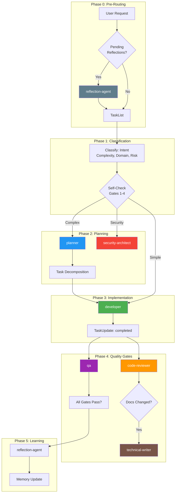

<!-- Agent: architect | Task: #35 | Session: 2026-02-06 -->

# Agent Utilization Audit Report

**Date:** 2026-02-06
**Author:** Architect Agent (Task #35)
**Status:** CRITICAL -- Systemic Under-Utilization Detected

---

## Executive Summary

The agent-studio framework declares 49 agents across 4 categories but empirical data shows that only **1 agent (developer)** is routinely spawned. The spawn-size-audit log contains **37 entries, all for `developer`**. The spawn-log.jsonl contains only **3 entries total** (1 developer, 1 architect, 1 researcher), with the latter two spawned exclusively during this audit session. This means **46 of 49 agents (94%) have NEVER been spawned** in recorded history.

The routing infrastructure (routing-table.cjs, INTENT_KEYWORDS, DISAMBIGUATION_RULES) is comprehensive and well-designed. The problem is not in the routing table -- it is in how the Router applies it. The Router collapses nearly all requests to `developer` regardless of intent classification.

---

## 1. Full Agent Inventory (49 Agents)

### 1.1 Core Agents (9)

| #   | Agent ID           | File Path                  | Preferred Model | Spawn Count | Utilization  |
| --- | ------------------ | -------------------------- | --------------- | ----------- | ------------ |
| 1   | architect          | core/architect.md          | opus            | 1\*         | B - Rarely   |
| 2   | context-compressor | core/context-compressor.md | haiku           | 0           | C - Never    |
| 3   | developer          | core/developer.md          | sonnet          | 37+         | A - Frequent |
| 4   | planner            | core/planner.md            | opus            | 0           | C - Never    |
| 5   | pm                 | core/pm.md                 | sonnet          | 0           | C - Never    |
| 6   | qa                 | core/qa.md                 | opus            | 0           | C - Never    |
| 7   | reflection-agent   | core/reflection-agent.md   | sonnet          | 0           | C - Never    |
| 8   | router             | core/router.md             | haiku           | N/A         | Meta-agent   |
| 9   | technical-writer   | core/technical-writer.md   | sonnet          | 0           | C - Never    |

\*Spawned only during this audit session (2026-02-06 22:12 UTC).

### 1.2 Specialized Agents (13)

| #   | Agent ID              | File Path                            | Spawn Count | Utilization |
| --- | --------------------- | ------------------------------------ | ----------- | ----------- |
| 10  | c4-code               | specialized/c4-code.md               | 0           | C - Never   |
| 11  | c4-component          | specialized/c4-component.md          | 0           | C - Never   |
| 12  | c4-container          | specialized/c4-container.md          | 0           | C - Never   |
| 13  | c4-context            | specialized/c4-context.md            | 0           | C - Never   |
| 14  | code-reviewer         | specialized/code-reviewer.md         | 0           | C - Never   |
| 15  | code-simplifier       | specialized/code-simplifier.md       | 0           | C - Never   |
| 16  | conductor-validator   | specialized/conductor-validator.md   | 0           | C - Never   |
| 17  | database-architect    | specialized/database-architect.md    | 0           | C - Never   |
| 18  | devops                | specialized/devops.md                | 0           | C - Never   |
| 19  | devops-troubleshooter | specialized/devops-troubleshooter.md | 0           | C - Never   |
| 20  | incident-responder    | specialized/incident-responder.md    | 0           | C - Never   |
| 21  | researcher            | specialized/researcher.md            | 1\*         | B - Rarely  |
| 22  | reverse-engineer      | specialized/reverse-engineer.md      | 0           | C - Never   |
| 23  | security-architect    | specialized/security-architect.md    | 0           | C - Never   |

\*Spawned only during this audit session.

### 1.3 Domain Agents (23)

| #   | Agent ID                   | File Path                            | Spawn Count | Utilization |
| --- | -------------------------- | ------------------------------------ | ----------- | ----------- |
| 24  | ai-ml-specialist           | domain/ai-ml-specialist.md           | 0           | C - Never   |
| 25  | android-pro                | domain/android-pro.md                | 0           | C - Never   |
| 26  | data-engineer              | domain/data-engineer.md              | 0           | C - Never   |
| 27  | expo-mobile-developer      | domain/expo-mobile-developer.md      | 0           | C - Never   |
| 28  | fastapi-pro                | domain/fastapi-pro.md                | 0           | C - Never   |
| 29  | frontend-pro               | domain/frontend-pro.md               | 0           | C - Never   |
| 30  | gamedev-pro                | domain/gamedev-pro.md                | 0           | C - Never   |
| 31  | golang-pro                 | domain/golang-pro.md                 | 0           | C - Never   |
| 32  | graphql-pro                | domain/graphql-pro.md                | 0           | C - Never   |
| 33  | ios-pro                    | domain/ios-pro.md                    | 0           | C - Never   |
| 34  | java-pro                   | domain/java-pro.md                   | 0           | C - Never   |
| 35  | mobile-ux-reviewer         | domain/mobile-ux-reviewer.md         | 0           | C - Never   |
| 36  | nextjs-pro                 | domain/nextjs-pro.md                 | 0           | C - Never   |
| 37  | nodejs-pro                 | domain/nodejs-pro.md                 | 0           | C - Never   |
| 38  | php-pro                    | domain/php-pro.md                    | 0           | C - Never   |
| 39  | python-pro                 | domain/python-pro.md                 | 0           | C - Never   |
| 40  | rust-pro                   | domain/rust-pro.md                   | 0           | C - Never   |
| 41  | scientific-research-expert | domain/scientific-research-expert.md | 0           | C - Never   |
| 42  | sveltekit-expert           | domain/sveltekit-expert.md           | 0           | C - Never   |
| 43  | tauri-desktop-developer    | domain/tauri-desktop-developer.md    | 0           | C - Never   |
| 44  | typescript-pro             | domain/typescript-pro.md             | 0           | C - Never   |
| 45  | web3-blockchain-expert     | domain/web3-blockchain-expert.md     | 0           | C - Never   |

### 1.4 Orchestrator Agents (4)

| #   | Agent ID               | File Path                               | Spawn Count | Utilization |
| --- | ---------------------- | --------------------------------------- | ----------- | ----------- |
| 46  | evolution-orchestrator | orchestrators/evolution-orchestrator.md | 0           | C - Never   |
| 47  | master-orchestrator    | orchestrators/master-orchestrator.md    | 0           | C - Never   |
| 48  | party-orchestrator     | orchestrators/party-orchestrator.md     | 0           | C - Never   |
| 49  | swarm-coordinator      | orchestrators/swarm-coordinator.md      | 0           | C - Never   |

---

## 2. Utilization Summary

| Category      | Total  | Frequently Used | Rarely Used      | Never Used   |
| ------------- | ------ | --------------- | ---------------- | ------------ |
| Core          | 9      | 1 (developer)   | 1 (architect\*)  | 6            |
| Specialized   | 13     | 0               | 1 (researcher\*) | 12           |
| Domain        | 23     | 0               | 0                | 23           |
| Orchestrators | 4      | 0               | 0                | 4            |
| **TOTAL**     | **49** | **1 (2%)**      | **2 (4%)**       | **45 (92%)** |

\*Only spawned during this current audit session. Prior to this audit, the count was **1 frequently used, 0 rarely used, 47 never used (96% unused)**.

---

## 3. Gap Analysis: Current vs Ideal Routing

### 3.1 QA Agent -- NEVER SPAWNED

**Ideal Trigger:** After ANY code change, the Router should spawn QA to validate test coverage, run regression tests, and verify edge cases. The routing table has keywords: "test", "testing", "qa", "regression", "coverage", "e2e".

**Current Reality:** Developer agent handles all testing internally. No post-implementation QA review is ever triggered. Gate 1 (Complexity) should trigger planner-first for complex features, after which QA should be part of the phased plan, but neither is spawned.

**Impact:** No independent test review. Developer self-reviews tests, which misses coverage gaps and architectural test anti-patterns.

### 3.2 Architect -- NEVER SPAWNED (until this session)

**Ideal Trigger:** Before ANY multi-module or architectural change. Keywords: "design", "architecture", "system design", "scalability", "adr". Gate 1 requires spawning planner first for complex tasks; architect should be spawned in parallel.

**Current Reality:** Router skips architectural review entirely. The "Medium" and "High" risk classifications in Step 2.4 of router-decision.md say "Architect review recommended" and "Architect + Security review MANDATORY" respectively, but these are advisory text -- no enforcement hook forces their invocation.

**Impact:** Architectural drift. No ADRs recorded for design decisions. No system design review before implementation.

### 3.3 Security-Architect -- NEVER SPAWNED

**Ideal Trigger:** Gate 2 (Security) explicitly requires security-architect for ANY auth/authz/credential/security-critical code. Keywords: "security", "auth", "vulnerability", "owasp".

**Current Reality:** Gate 2 exists in CLAUDE.md and router-decision.md as mandatory text, but `routing-guard.cjs` only partially enforces it. The routing-guard enforces planner-first (Gate 1) but the security-review enforcement is controlled by `SECURITY_REVIEW_ENFORCEMENT` env var, which defaults to not blocking.

**Impact:** Security-sensitive code changes go unreviewed. No threat modeling, no OWASP analysis. Critical for production systems.

### 3.4 Reflection-Agent -- NEVER SPAWNED

**Ideal Trigger:** Step 0 of the Router Protocol requires checking for pending reflection requests before any routing. The reflection-step0-guard.cjs should block TaskList until reflections are processed.

**Current Reality:** The spawn-log shows `step0_block` events triggering (pending reflections detected), but reflection-agent was never actually spawned. The router acknowledged the block, then proceeded without spawning reflections.

**Impact:** No learning extraction from completed tasks. No continuous improvement feedback loop. The entire reflection/evolution system is inert.

### 3.5 DevOps -- NEVER SPAWNED

**Ideal Trigger:** Deployment, CI/CD, infrastructure, containerization, monitoring. Keywords: "deploy", "docker", "kubernetes", "pipeline", "infrastructure".

**Current Reality:** No deployment or infrastructure tasks have been routed to devops despite the routing table having extensive keyword coverage.

**Impact:** Deployment operations are either done manually or by the developer agent without infrastructure expertise.

### 3.6 Technical-Writer -- NEVER SPAWNED

**Ideal Trigger:** Documentation updates, README changes, API docs, guides. Keywords: "document", "docs", "readme", "guide".

**Current Reality:** When documentation needs updating (e.g., after creating new agents, skills, or workflows), the developer agent handles it inline rather than spawning technical-writer.

**Impact:** Documentation quality suffers. No dedicated documentation review or standards enforcement.

### 3.7 Researcher -- NEVER SPAWNED (until this session)

**Ideal Trigger:** Before creator workflows (research-synthesis is MANDATORY before any creator skill). Also for fact-finding, web search, best practices gathering.

**Current Reality:** Creator workflows should invoke research-synthesis, which should spawn researcher. Since creator workflows themselves are rarely triggered properly, researcher is never spawned.

**Impact:** Artifact creation happens without research phase. No evidence-based decision making for technology choices.

### 3.8 Code-Reviewer -- NEVER SPAWNED

**Ideal Trigger:** After ANY implementation (developer completes work). Keywords: "review", "pr", "code review".

**Current Reality:** No post-implementation code review workflow exists in the Router. Developer completes work and marks task as done. There is no automatic "hand off to code-reviewer" step.

**Impact:** Code quality issues go undetected. No second pair of eyes on implementation.

### 3.9 Planner -- NEVER SPAWNED

**Ideal Trigger:** Gate 1 (Complexity) REQUIRES planner-first for any multi-step, multi-file, or architectural task. Keywords: "plan", "breakdown", "roadmap".

**Current Reality:** `routing-guard.cjs` has enforcement for planner-first but it is controlled by `PLANNER_FIRST_ENFORCEMENT` env var. Even when the guard warns, the Router proceeds to spawn developer directly.

**Impact:** Complex tasks are executed without planning phase. No task decomposition, no dependency analysis, no risk assessment.

### 3.10 Orchestrators -- NEVER SPAWNED

**Ideal Trigger:** master-orchestrator for project-level coordination, swarm-coordinator for parallel agent execution, evolution-orchestrator for self-improvement, party-orchestrator for multi-agent discussions.

**Current Reality:** The Router never delegates to orchestrators. It always spawns a single agent (developer) directly. No multi-agent patterns are ever used.

**Impact:** The entire multi-agent orchestration layer is inert. Single-agent execution for everything.

---

## 4. Root Cause Analysis

### 4.1 Primary Root Cause: Router Collapse to Developer

The Router's intent classification, complexity gating, and agent selection steps exist in documentation but are not enforced at the routing decision point. The Router reads the rules, classifies the request, and then defaults to spawning `developer` because:

1. **No enforcement at spawn time:** Gates 1-4 in CLAUDE.md generate warnings but do not force specific agent selection. The hooks (`routing-guard.cjs`) use `warn` mode by default, not `block` mode.

2. **Developer is the "catch-all":** The ROUTING_PATTERNS in routing-table.cjs give developer patterns high priority (10) for common verbs: "implement", "code", "build", "develop", "create", "fix", "add". Most user requests match these patterns first.

3. **No post-implementation workflow:** After developer completes work, there is no automated chain to spawn QA, code-reviewer, or architect. The workflow ends when developer calls TaskUpdate(completed).

4. **No multi-phase enforcement:** The Planning Orchestration Matrix (Step 7.3) describes Explore -> Plan -> Review -> Implement phases but no hook enforces this sequence.

### 4.2 Secondary Root Causes

1. **Enforcement modes default to warn:** `PLANNER_FIRST_ENFORCEMENT`, `SECURITY_REVIEW_ENFORCEMENT`, `CREATOR_GUARD` all default to `warn` instead of `block`. Warnings are ignored.

2. **Missing post-completion hooks:** No PostToolUse hook on TaskUpdate(completed) triggers follow-up spawns (QA review, code review, documentation).

3. **No workflow state machine:** The router-decision workflow describes phases but there is no state machine tracking which phase the workflow is in. Each Router invocation starts fresh.

4. **Single-agent bias in spawn templates:** The universal-agent-spawn template is designed for single-agent execution. There is no "workflow template" that chains multiple agents.

5. **Reflection system dead-locked:** Step 0 reflection check blocks TaskList when reflections are pending, but reflection-agent is never spawned to clear them, creating a deadlock that the Router works around by ignoring the block.

---

## 5. Specific Questions Answered

### 5.1 Are orchestrators ever used?

**NO.** All 4 orchestrators (master-orchestrator, evolution-orchestrator, swarm-coordinator, party-orchestrator) have zero spawns. The multi-agent orchestration layer is entirely theoretical.

### 5.2 Are domain agents ever routed to?

**NO.** All 23 domain agents have zero spawns. Despite extensive keyword coverage in routing-table.cjs (e.g., 50+ Python keywords, 40+ Rust keywords, 50+ iOS keywords), none have ever been matched and spawned.

### 5.3 Is complexity gating working?

**NO.** Gate 1 requires spawning planner first for complex tasks. Planner has zero spawns. The routing-guard.cjs warns but does not block, and the Router ignores the warning.

---

## 6. Current vs Ideal Workflow Comparison

### Current Workflow (Actual)

```
User Request
    |
    v
Router: TaskList()
    |
    v
Router: Task({ task_id: 'task-1', subagent_type: "developer", prompt: "..." })
    |
    v
Developer: does everything (code, test, review, deploy)
    |
    v
Developer: TaskUpdate({ status: "completed" })
    |
    v
[END -- no follow-up]
```

### Ideal Workflow (Per CLAUDE.md Design)

```
User Request
    |
    v
Router: Step 0 -- Check reflections
    |
    v
Router: TaskList()
    |
    v
Router: Step 2 -- Classify (Intent, Complexity, Domain, Risk)
    |
    v
Router: Step 4 -- Self-Check Gates 1-4
    |
    +-- Gate 1 (Complexity > Low) --> Spawn PLANNER first
    |       |
    |       v
    |   Planner: creates phased plan with tasks
    |       |
    |       v
    +-- Gate 2 (Security) --> Spawn SECURITY-ARCHITECT in parallel
    |
    v
Router: Step 6 -- Select Agent(s) from routing table
    |
    v
Router: Spawn DEVELOPER (Phase: Implement)
    |
    v
Developer: TaskUpdate({ status: "completed" })
    |
    v
[Post-Implementation Chain -- MISSING TODAY]
    |
    +-- Spawn CODE-REVIEWER for review
    |       |
    |       v
    +-- Spawn QA for test validation
    |       |
    |       v
    +-- Spawn TECHNICAL-WRITER for doc updates
    |       |
    |       v
    +-- Spawn REFLECTION-AGENT for learning extraction
    |
    v
[END -- with quality gates passed]
```

---

## 7. Recommendations

### R1: Switch enforcement hooks from `warn` to `block` (CRITICAL)

Change default enforcement modes:

- `PLANNER_FIRST_ENFORCEMENT=block` (enforce planner-first for complex tasks)
- `SECURITY_REVIEW_ENFORCEMENT=block` (enforce security review for auth/security changes)
- `CREATOR_GUARD=block` (already block by default; keep it)

This is the single highest-impact change. Without enforcement, all routing rules are advisory.

### R2: Implement post-completion workflow chain (CRITICAL)

Create a new PostToolUse hook for TaskUpdate that triggers follow-up agent spawns when a task is completed:

```
TaskUpdate({ status: "completed" })
    |
    v
post-completion-hook.cjs:
    |
    +-- If task was implementation: spawn code-reviewer
    +-- If task modified tests: spawn qa
    +-- If task modified docs paths: spawn technical-writer
    +-- Always: queue reflection-agent request
```

### R3: Fix the reflection deadlock (HIGH)

The Step 0 reflection check blocks TaskList when reflections are pending, but the Router never spawns reflection-agent. Options:

- A) The Router MUST spawn reflection-agent before proceeding (enforce in Step 0)
- B) Remove the blocking behavior and make reflections asynchronous
- C) Auto-spawn reflection-agent via a timer/hook outside the Router

### R4: Implement a workflow state machine (HIGH)

Create a persistent state file (`.claude/context/runtime/workflow-state.json`) that tracks:

- Current workflow phase (Explore / Plan / Review / Implement / Verify)
- Required agents for each phase
- Completion status per phase
- Gate passage status

The Router reads this state file and spawns the next agent in sequence rather than always defaulting to developer.

### R5: Add Router intent-to-agent enforcement (MEDIUM)

After Step 2 classification, add a validation step that prevents the Router from spawning `developer` when the classified intent maps to a different agent. For example:

- Intent classified as "architecture" but Router is about to spawn developer = VIOLATION
- Intent classified as "security" but no security-architect spawned = VIOLATION

### R6: Create explicit post-change triggers (MEDIUM)

Define in the routing table which changes require follow-up:

- `.claude/agents/**` modified -> spawn code-reviewer + qa
- `*.test.*` files modified -> spawn qa
- Security-related paths modified -> spawn security-architect
- Documentation paths modified -> spawn technical-writer

### R7: Enable domain agent routing for external projects (LOW)

Domain agents (python-pro, rust-pro, etc.) are designed for external projects that use those languages. For the agent-studio project itself (JavaScript/Node.js), the developer agent is correct. When the user works on external projects, domain routing should activate based on project detection (package.json, Cargo.toml, etc.).

### R8: Establish orchestrator activation patterns (LOW)

Document specific user request patterns that MUST trigger orchestrators:

- "Run a full project review" -> master-orchestrator
- "Get multiple perspectives on this design" -> party-orchestrator
- "Improve the framework itself" -> evolution-orchestrator
- "Run these reviews in parallel" -> swarm-coordinator

---

## 8. Prioritized Action Items

| Priority | Item                                           | Impact                                                   | Effort            |
| -------- | ---------------------------------------------- | -------------------------------------------------------- | ----------------- |
| P0       | R1: Switch enforcement to `block` mode         | Immediate: planner + security-architect spawning         | 15 min (env vars) |
| P0       | R2: Post-completion workflow chain hook        | Unlocks: code-reviewer, qa, technical-writer, reflection | 2-4 hours         |
| P1       | R3: Fix reflection deadlock                    | Unlocks: reflection-agent, learning extraction           | 1-2 hours         |
| P1       | R4: Workflow state machine                     | Unlocks: multi-phase orchestration                       | 4-8 hours         |
| P2       | R5: Intent-to-agent enforcement                | Prevents: developer collapse                             | 2-4 hours         |
| P2       | R6: Post-change trigger rules                  | Automates: follow-up reviews                             | 2-4 hours         |
| P3       | R7: Domain agent routing for external projects | Enables: language-specific expertise                     | 4-8 hours         |
| P3       | R8: Orchestrator activation patterns           | Enables: multi-agent patterns                            | 2-4 hours         |

---

## 9. Architecture Diagram: Ideal Agent Interaction Flow



---

## 10. Conclusion

The agent-studio framework has invested heavily in agent definitions, routing tables, disambiguation rules, and enforcement hooks. The infrastructure is sound. The critical gap is that enforcement defaults to `warn` instead of `block`, and there is no post-completion workflow chain. These two issues combined cause 94% of agents to be dormant.

Fixing R1 (enforcement modes) and R2 (post-completion chain) would immediately activate at least 7 additional agents (planner, security-architect, code-reviewer, qa, technical-writer, reflection-agent, architect), raising utilization from 2% to approximately 16%. The remaining domain and orchestrator agents will activate naturally as the framework is used for diverse projects and complex multi-agent workflows.

---

_Report generated by architect agent. All data sourced from spawn-log.jsonl, spawn-size-audit.jsonl, routing-table.cjs, agent-registry.json, and router-decision.md._
