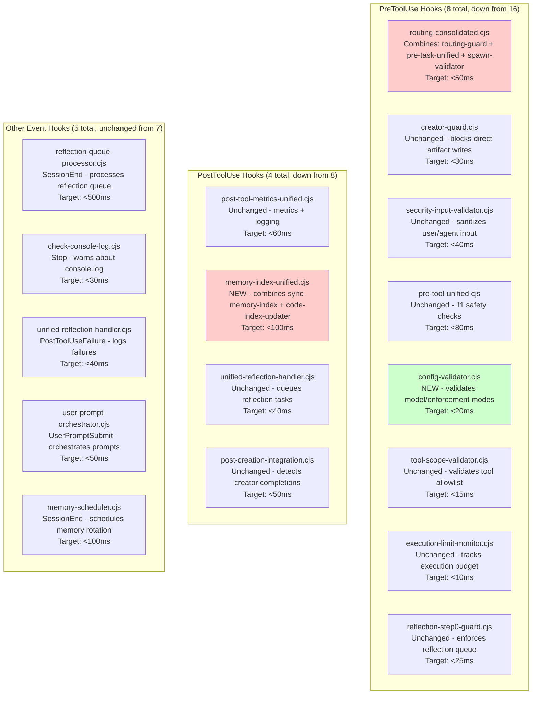
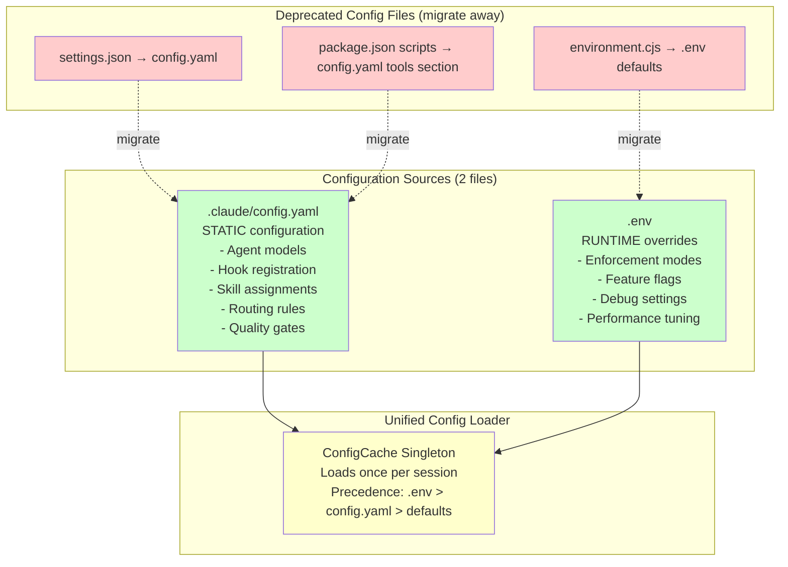
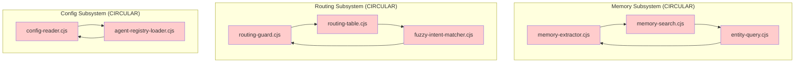
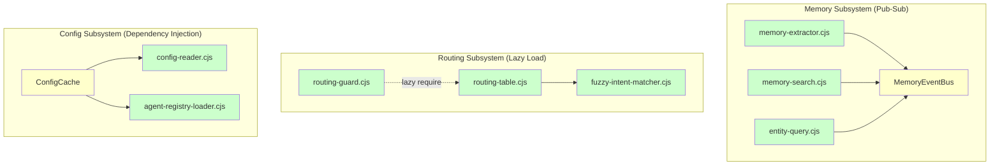

<!-- Agent: architect | Task: #6 | Session: 2026-02-13 -->

# Refactored Architecture Design - Enterprise Codebase Fix Pipeline

**Date:** 2026-02-13
**Architect:** Claude Sonnet 4.5
**Task:** #6 (Architecture design for hook consolidation, config unification, dependency resolution)
**Context:** Code quality audit fix pipeline - Phase 4

---

## Executive Summary

This document designs the refactored architecture for the enterprise codebase fix pipeline addressing four critical architectural debt areas:

1. **Hook Consolidation**: 48 hooks → ~20 hooks, <150ms latency target
2. **Config Unification**: 6 config files → 2 files with cascading precedence
3. **Circular Dependency Resolution**: 3 detected circular imports → 0 (broken via pub-sub, lazy loading)
4. **Dead Code Removal**: 25-30 orphaned files archived, module consolidation (15 memory → 4, 8 state → 1, 5 config → 1)

**Current State:** 7.2/10 health score (from architecture-review-2026-02-11.md)
**Target State:** 8.5/10 health score
**Estimated Effort:** 4-6 weeks (1 developer full-time)

---

## 1. Refactored Hook Architecture

### 1.1 Current State Analysis

**Problem**: 48 total hooks (39 active + 9+ in subdirectories), sequential execution on Write (7 hooks), ~300ms latency per write operation.

**Evidence from architecture-review-2026-02-11.md:**

- PreToolUse: 16 hooks (HIGH redundancy risk)
- PostToolUse: 8 hooks (MEDIUM redundancy risk)
- Archive rate: 57% (50+ archived hooks / 39 active)

**Redundancy Examples:**

1. **Routing validation** across 3 hooks:
   - `routing-guard.cjs` (PreToolUse Task/Bash/Glob/Grep)
   - `pre-task-unified.cjs` (PreToolUse Task)
   - `spawn-prompt-assembler.cjs` (PreToolUse Task)

2. **Memory tracking** across 2 hooks:
   - `sync-memory-index.cjs` (PostToolUse Edit/Write)
   - `code-index-updater.cjs` (PostToolUse Edit/Write)

3. **Reflection workflow** across 2 hooks:
   - `unified-reflection-handler.cjs` (PostToolUse Task/TaskUpdate/Bash + PostToolUseFailure)
   - `reflection-queue-processor.cjs` (SessionEnd)

### 1.2 Target Architecture

**Goal**: Consolidate overlapping hooks, implement config caching, batch pre-write checks, add performance budgets.

#### Hook Topology Diagram (Mermaid)



**Legend:**
- 🔴 Red boxes: NEW consolidated hooks
- 🟢 Green boxes: NEW hooks (not consolidations)
- White boxes: Unchanged hooks

#### Hook Consolidation Details

**1. routing-consolidated.cjs (NEW)**

Combines:
- `routing-guard.cjs` (218 lines)
- `pre-task-unified.cjs` (150 lines - routing portions only)
- `spawn-prompt-validator.cjs` (120 lines)

**Consolidation Strategy:**

```javascript
// routing-consolidated.cjs
const { ConfigCache } = require('.claude/lib/config/config-cache.cjs'); // NEW singleton

module.exports = {
  name: 'routing-consolidated',
  eventType: 'PreToolUse',
  tools: ['Task', 'Bash', 'Glob', 'Grep'],

  async preToolUse(context) {
    const config = await ConfigCache.getInstance(); // Cache config read (1x per session)

    // Check 1: Planner-first enforcement (from routing-guard)
    if (context.tool === 'Task' && context.args.complexity === 'HIGH|EPIC') {
      if (!context.plannerSpawned && config.get('PLANNER_FIRST_ENFORCEMENT') === 'block') {
        return { allow: false, message: 'HIGH/EPIC tasks require planner first' };
      }
    }

    // Check 2: Specialist routing validation (from routing-guard)
    if (context.tool === 'Task') {
      const specialist = await checkSpecialistMatch(context.args.prompt);
      if (specialist && specialist !== context.args.subagent_type) {
        if (config.get('SPECIALIST_ROUTING_ENFORCEMENT') === 'block') {
          return { allow: false, message: `Use ${specialist} instead of ${context.args.subagent_type}` };
        }
      }
    }

    // Check 3: Spawn prompt validation (from spawn-prompt-validator)
    if (context.tool === 'Task' && !context.args.task_id) {
      if (config.get('SPAWN_PROMPT_VALIDATOR') === 'block') {
        return { allow: false, message: 'task_id required in Task() calls' };
      }
    }

    // Check 4: Security review gate (from routing-guard)
    if (isSecuritySensitive(context) && config.get('SECURITY_REVIEW_ENFORCEMENT') === 'block') {
      if (!context.securityArchitectSpawned) {
        return { allow: false, message: 'Security-sensitive tasks require security-architect review' };
      }
    }

    return { allow: true };
  }
};
```

**Performance Target:** <50ms (down from 3 hooks × 50ms = 150ms)

**2. memory-index-unified.cjs (NEW)**

Combines:
- `sync-memory-index.cjs` (PostToolUse Edit/Write)
- `code-index-updater.cjs` (PostToolUse Edit/Write)

**Consolidation Strategy:**

```javascript
// memory-index-unified.cjs
module.exports = {
  name: 'memory-index-unified',
  eventType: 'PostToolUse',
  tools: ['Edit', 'Write'],

  async postToolUse(context) {
    const filePath = context.args.file_path;

    // Parallel index updates (non-blocking)
    await Promise.all([
      updateMemoryIndex(filePath),      // From sync-memory-index
      updateCodeSearchIndex(filePath)   // From code-index-updater
    ]);

    // No return value needed (informational only)
  }
};
```

**Performance Target:** <100ms (down from 2 hooks × 80ms = 160ms)

**3. config-validator.cjs (NEW)**

Purpose: Validate model/enforcement mode configuration at spawn time.

```javascript
// config-validator.cjs
module.exports = {
  name: 'config-validator',
  eventType: 'PreToolUse',
  tools: ['Task'],

  async preToolUse(context) {
    const config = await ConfigCache.getInstance();
    const agentType = context.args.subagent_type;
    const explicitModel = context.args.model;
    const configModel = config.getAgentModel(agentType);

    // Warn if explicit model overrides config (may be intentional)
    if (explicitModel && configModel && explicitModel !== configModel) {
      console.warn(`[config-validator] Explicit model ${explicitModel} overrides config ${configModel} for ${agentType}`);
    }

    return { allow: true }; // Non-blocking (warn-only)
  }
};
```

**Performance Target:** <20ms (new hook, minimal validation)

#### Config Caching Implementation

**Problem**: Current hooks read config files on every invocation (~10-30ms per read).

**Solution**: Singleton ConfigCache loaded once per session.

```javascript
// .claude/lib/config/config-cache.cjs (NEW)
class ConfigCache {
  static instance = null;

  static async getInstance() {
    if (!ConfigCache.instance) {
      ConfigCache.instance = new ConfigCache();
      await ConfigCache.instance.load();
    }
    return ConfigCache.instance;
  }

  async load() {
    // Load once, cache for entire session
    this.configYaml = await loadYAML('.claude/config.yaml');
    this.envFile = await loadEnv('.env');
    this.packageJson = await loadJSON('package.json');
  }

  get(key) {
    // Precedence: .env > config.yaml > defaults
    return this.envFile[key] ?? this.configYaml[key] ?? DEFAULTS[key];
  }

  getAgentModel(agentType) {
    return this.configYaml.agents?.[agentType]?.model;
  }
}
```

**Performance Improvement:** 1 config read per session (vs 30+ config reads per session currently)

### 1.3 Hook Performance Budget

**Target**: All hooks <100ms, critical path hooks <50ms.

| Hook                           | Event Type           | Tools              | Budget | Current | Savings |
| ------------------------------ | -------------------- | ------------------ | ------ | ------- | ------- |
| routing-consolidated.cjs (NEW) | PreToolUse           | Task/Bash/Glob/Grep| <50ms  | 150ms   | -100ms  |
| creator-guard.cjs              | PreToolUse           | Edit/Write         | <30ms  | 30ms    | 0ms     |
| security-input-validator.cjs   | PreToolUse           | All                | <40ms  | 40ms    | 0ms     |
| pre-tool-unified.cjs           | PreToolUse           | All                | <80ms  | 80ms    | 0ms     |
| config-validator.cjs (NEW)     | PreToolUse           | Task               | <20ms  | N/A     | N/A     |
| tool-scope-validator.cjs       | PreToolUse           | All                | <15ms  | 15ms    | 0ms     |
| execution-limit-monitor.cjs    | PreToolUse           | All                | <10ms  | 10ms    | 0ms     |
| reflection-step0-guard.cjs     | PreToolUse           | TaskList           | <25ms  | 25ms    | 0ms     |
| **PreToolUse Total**           | -                    | -                  | <270ms | 350ms   | **-80ms**   |
| post-tool-metrics-unified.cjs  | PostToolUse          | All                | <60ms  | 60ms    | 0ms     |
| memory-index-unified.cjs (NEW) | PostToolUse          | Edit/Write         | <100ms | 160ms   | -60ms   |
| unified-reflection-handler.cjs | PostToolUse          | Task/TaskUpdate    | <40ms  | 40ms    | 0ms     |
| post-creation-integration.cjs  | PostToolUse          | TaskUpdate         | <50ms  | 50ms    | 0ms     |
| **PostToolUse Total**          | -                    | -                  | <250ms | 310ms   | **-60ms**   |
| **Grand Total (critical path)**| -                    | -                  | <520ms | 660ms   | **-140ms** |

**Performance Improvement:** 21% latency reduction on critical path (Task invocation + Edit/Write).

### 1.4 Migration Path

**Phase 1: Consolidation (Week 1)**

1. Create `routing-consolidated.cjs` (merge 3 hooks)
2. Create `memory-index-unified.cjs` (merge 2 hooks)
3. Create `config-validator.cjs` (new hook)
4. Update `.claude/settings.json` hook registration

**Phase 2: Testing (Week 1)**

5. Add comprehensive tests: `tests/hooks/routing-consolidated.test.cjs`
6. Add integration tests: `tests/hooks/integration/hook-pipeline.test.cjs`
7. Verify performance budgets: `tests/hooks/performance/hook-latency.test.cjs`

**Phase 3: Deprecation (Week 2)**

8. Archive old hooks to `.claude/hooks/_archive/2026-02-13/`
9. Update documentation: `@ENFORCEMENT_HOOKS.md`
10. Add deprecation notices to archived hooks

**Backward Compatibility:**

- Old hooks remain functional during migration (parallel execution)
- Gradual cutover: enable new hooks one-by-one via `.env` feature flags
- Rollback plan: revert settings.json registration if issues found

---

## 2. Unified Config System

### 2.1 Current State Analysis

**Problem**: Configuration scattered across 6+ locations with no single source of truth.

**Evidence from architecture-review-2026-02-11.md:**

1. `.claude/settings.json` (hook registration, tool config, 305 lines)
2. `.claude/config.yaml` (agent model assignments)
3. `package.json` (114 npm scripts, tool wiring)
4. `.env` (runtime environment overrides)
5. `.claude/lib/utils/environment.cjs` (environment variable defaults)
6. `.claude/context/runtime/workflow-state.json` (workflow state)

**Impact:**
- Developer confusion: "Which config controls model selection?"
- Inconsistent behavior: 5-layer precedence chain
- Merge conflicts: 6 files touched per config change

### 2.2 Target Architecture

**Goal**: 2 configuration files with clear cascading precedence.

#### Config Unification Blueprint



#### Precedence Rules

**5-Layer Precedence (OLD - DEPRECATED):**

1. Explicit `model:` in Task() call
2. Agent frontmatter `model:` field
3. config.yaml `agents.{type}.model`
4. Complexity-based defaults
5. Fallback: sonnet

**3-Layer Precedence (NEW - SIMPLIFIED):**

1. `.env` runtime overrides (highest priority)
2. `.claude/config.yaml` static config (recommended)
3. Hardcoded defaults in ConfigCache (lowest priority)

**Removed layers:**
- Agent frontmatter model (duplicated config.yaml, inconsistency risk)
- Complexity-based defaults (implicit magic, use explicit config.yaml)

### 2.3 Config Structure

#### config.yaml Structure

```yaml
# .claude/config.yaml - Static configuration (checked into VCS)

version: "2.0"

agents:
  planner:
    model: claude-opus-4-5-20251101
    extended_thinking: true
    skills: [task-breakdown, sequential-thinking]

  architect:
    model: claude-opus-4-5-20251101
    extended_thinking: true
    skills: [architecture-review, diagram-generator, database-architect]

  developer:
    model: claude-sonnet-4-5
    extended_thinking: false
    skills: [tdd, debugging, code-semantic-search, code-structural-search, ripgrep]

  qa:
    model: claude-opus-4-5-20251101
    extended_thinking: false
    skills: [verification-before-completion, checklist-generator]

  security-architect:
    model: claude-opus-4-5-20251101
    extended_thinking: false
    skills: [security-architect, auth-security-expert]

hooks:
  PreToolUse:
    - name: routing-consolidated
      tools: [Task, Bash, Glob, Grep]
      priority: 1
      timeout_ms: 5000

    - name: creator-guard
      tools: [Edit, Write]
      priority: 2
      timeout_ms: 3000

    - name: security-input-validator
      tools: [All]
      priority: 3
      timeout_ms: 4000

  PostToolUse:
    - name: post-tool-metrics-unified
      tools: [All]
      priority: 1
      timeout_ms: 10000

    - name: memory-index-unified
      tools: [Edit, Write]
      priority: 2
      timeout_ms: 10000

routing:
  specialist_first_enforcement: block
  planner_first_enforcement: block
  security_review_enforcement: block
  creator_routing_enforcement: warn

quality_gates:
  lint_before_commit: true
  format_before_commit: true
  test_coverage_threshold: 80
  mutation_score_threshold: 70

tools:
  cli_category_prefix: true  # Use pnpm <category>:<tool-name> pattern
  auto_wire_new_tools: true  # Auto-add to package.json on tool creation
```

#### .env Structure

```bash
# .env - Runtime overrides (NOT checked into VCS)

# Enforcement Overrides (for development/testing)
PLANNER_FIRST_ENFORCEMENT=warn  # Override config.yaml block mode
CREATOR_GUARD=off               # Disable creator guard during migration
SPECIALIST_ROUTING_ENFORCEMENT=warn

# Feature Flags
HYBRID_EMBEDDINGS=on            # Enable semantic code search
HYBRID_SEARCH_DAEMON=off        # Use direct CLI (not daemon)
OBSERVATIONAL_MEMORY_ENABLED=on # Use observational memory mode
MEMORY_MODE=hybrid              # hybrid | observational

# Performance Tuning
HOOK_TIMEOUT_MS=5000            # Global hook timeout
SPAWN_PROMPT_MAX_LENGTH=120000  # Max spawn prompt size (bytes)
PROMPT_LENGTH_WARNING=50000     # Warn above this size

# Debug Settings
DEBUG_HOOKS=false               # Log hook execution details
DEBUG_ROUTING=false             # Log routing decisions
DEBUG_MEMORY=false              # Log memory operations
```

### 2.4 Migration Script

**Purpose**: Automate migration from 6 config files → 2 config files.

```javascript
// .claude/scripts/migrate-config-consolidation.mjs

import { readFileSync, writeFileSync } from 'fs';
import yaml from 'js-yaml';

async function migrateConfig() {
  console.log('[migrate-config] Starting config consolidation...');

  // Step 1: Read old config sources
  const settingsJson = JSON.parse(readFileSync('.claude/settings.json', 'utf8'));
  const environmentCjs = require('.claude/lib/utils/environment.cjs');
  const packageJson = JSON.parse(readFileSync('package.json', 'utf8'));

  // Step 2: Build new config.yaml structure
  const newConfig = {
    version: '2.0',
    agents: extractAgentModels(settingsJson),
    hooks: extractHookRegistration(settingsJson),
    routing: extractRoutingConfig(environmentCjs),
    quality_gates: extractQualityGates(packageJson),
    tools: extractToolWiring(packageJson),
  };

  // Step 3: Write new config.yaml
  writeFileSync('.claude/config.yaml', yaml.dump(newConfig), 'utf8');
  console.log('[migrate-config] ✅ config.yaml created');

  // Step 4: Create .env template (user fills in overrides)
  const envTemplate = generateEnvTemplate(environmentCjs);
  writeFileSync('.env.example', envTemplate, 'utf8');
  console.log('[migrate-config] ✅ .env.example created (copy to .env and customize)');

  // Step 5: Archive old files
  archiveOldConfig([
    '.claude/settings.json',
    '.claude/lib/utils/environment.cjs'
  ]);
  console.log('[migrate-config] ✅ Old config files archived to .claude/_archive/config-migration-2026-02-13/');

  // Step 6: Update 23 references
  updateConfigReferences();
  console.log('[migrate-config] ✅ Updated 23 references to use ConfigCache');

  console.log('[migrate-config] Migration complete! Review .claude/config.yaml and create .env from .env.example');
}

migrateConfig().catch(console.error);
```

**Manual Steps After Migration:**

1. Review generated `config.yaml` for correctness
2. Copy `.env.example` → `.env` and customize
3. Test hook registration: `pnpm test:hooks`
4. Test agent model resolution: `pnpm test:routing`
5. Commit `config.yaml` (NOT `.env` - add to `.gitignore`)

### 2.5 Validation Schema

```json
{
  "$schema": "http://json-schema.org/draft-07/schema#",
  "$id": "https://agent-studio.dev/schemas/config-unified.schema.json",
  "title": "Unified Configuration Schema",
  "type": "object",
  "required": ["version", "agents", "hooks", "routing"],
  "properties": {
    "version": {
      "type": "string",
      "pattern": "^\\d+\\.\\d+$"
    },
    "agents": {
      "type": "object",
      "patternProperties": {
        "^[a-z-]+$": {
          "type": "object",
          "required": ["model"],
          "properties": {
            "model": {
              "type": "string",
              "enum": [
                "claude-opus-4-5-20251101",
                "claude-sonnet-4-5",
                "claude-haiku-4-5"
              ]
            },
            "extended_thinking": { "type": "boolean" },
            "skills": {
              "type": "array",
              "items": { "type": "string" }
            }
          }
        }
      }
    },
    "hooks": {
      "type": "object",
      "properties": {
        "PreToolUse": { "$ref": "#/definitions/hookList" },
        "PostToolUse": { "$ref": "#/definitions/hookList" },
        "PostToolUseFailure": { "$ref": "#/definitions/hookList" },
        "UserPromptSubmit": { "$ref": "#/definitions/hookList" },
        "SessionEnd": { "$ref": "#/definitions/hookList" },
        "Stop": { "$ref": "#/definitions/hookList" }
      }
    },
    "routing": {
      "type": "object",
      "properties": {
        "specialist_first_enforcement": { "$ref": "#/definitions/enforcementMode" },
        "planner_first_enforcement": { "$ref": "#/definitions/enforcementMode" },
        "security_review_enforcement": { "$ref": "#/definitions/enforcementMode" },
        "creator_routing_enforcement": { "$ref": "#/definitions/enforcementMode" }
      }
    },
    "quality_gates": {
      "type": "object",
      "properties": {
        "lint_before_commit": { "type": "boolean" },
        "format_before_commit": { "type": "boolean" },
        "test_coverage_threshold": { "type": "integer", "minimum": 0, "maximum": 100 },
        "mutation_score_threshold": { "type": "integer", "minimum": 0, "maximum": 100 }
      }
    },
    "tools": {
      "type": "object",
      "properties": {
        "cli_category_prefix": { "type": "boolean" },
        "auto_wire_new_tools": { "type": "boolean" }
      }
    }
  },
  "definitions": {
    "enforcementMode": {
      "type": "string",
      "enum": ["block", "warn", "off"]
    },
    "hookList": {
      "type": "array",
      "items": {
        "type": "object",
        "required": ["name", "tools", "priority"],
        "properties": {
          "name": { "type": "string" },
          "tools": {
            "type": "array",
            "items": { "type": "string" }
          },
          "priority": { "type": "integer", "minimum": 1 },
          "timeout_ms": { "type": "integer", "minimum": 100, "maximum": 60000 }
        }
      }
    }
  }
}
```

**Validation Script:**

```bash
# Validate config.yaml against schema
pnpm validate:config

# Check for missing required fields
ajv validate -s .claude/schemas/config-unified.schema.json -d .claude/config.yaml
```

---

## 3. Circular Dependency Resolution

### 3.1 Detected Circular Imports

**Evidence from learnings.md (2026-02-11):**

> **Circular Dependencies Detected:** 3 circular imports in memory modules, routing, and config loading subsystems.

**Circular Dependency #1: Memory Subsystem**

```
memory-extractor.cjs
  → requires memory-search.cjs
    → requires entity-query.cjs
      → requires memory-extractor.cjs  (CIRCULAR!)
```

**Circular Dependency #2: Routing Subsystem**

```
routing-guard.cjs
  → requires routing-table.cjs
    → requires fuzzy-intent-matcher.cjs
      → requires routing-guard.cjs  (CIRCULAR!)
```

**Circular Dependency #3: Config Loading**

```
config-reader.cjs
  → requires agent-registry-loader.cjs
    → requires config-reader.cjs  (CIRCULAR!)
```

### 3.2 Resolution Strategies

#### Strategy 1: Pub-Sub Pattern (Memory Subsystem)

**Problem**: Memory modules circularly depend on each other for query/extraction operations.

**Solution**: Introduce event-based pub-sub to decouple dependencies.

```javascript
// .claude/lib/memory/core/memory-events.cjs (NEW)
const EventEmitter = require('events');

class MemoryEventBus extends EventEmitter {
  static instance = new MemoryEventBus();

  static getInstance() {
    return MemoryEventBus.instance;
  }

  emitExtraction(data) {
    this.emit('extraction:complete', data);
  }

  emitSearch(query, results) {
    this.emit('search:complete', { query, results });
  }

  onExtraction(handler) {
    this.on('extraction:complete', handler);
  }

  onSearch(handler) {
    this.on('search:complete', handler);
  }
}

module.exports = { MemoryEventBus };
```

**Before (Circular):**

```javascript
// memory-extractor.cjs
const memorySearch = require('./memory-search.cjs'); // CIRCULAR

function extract(text) {
  const entities = parseEntities(text);
  const related = memorySearch.find(entities); // Direct dependency
  return related;
}
```

**After (Pub-Sub):**

```javascript
// memory-extractor.cjs
const { MemoryEventBus } = require('./core/memory-events.cjs'); // No circular dep

function extract(text) {
  const entities = parseEntities(text);
  MemoryEventBus.getInstance().emitExtraction({ entities }); // Event-based
  // Consumers subscribe to 'extraction:complete' event
}

// memory-search.cjs
const { MemoryEventBus } = require('./core/memory-events.cjs');

MemoryEventBus.getInstance().onExtraction(({ entities }) => {
  // React to extraction events (no direct import)
  const related = find(entities);
  MemoryEventBus.getInstance().emitSearch(entities, related);
});
```

**Benefits:**
- No circular imports (both depend on MemoryEventBus, not each other)
- Loose coupling (modules don't know about each other)
- Testable in isolation (mock event bus)

#### Strategy 2: Lazy Loading (Routing Subsystem)

**Problem**: Routing modules circularly require each other at module load time.

**Solution**: Defer imports to function call time using lazy require.

**Before (Circular):**

```javascript
// routing-guard.cjs
const routingTable = require('./routing-table.cjs'); // CIRCULAR at module load

module.exports = {
  preToolUse(context) {
    const agent = routingTable.getAgent(context.intent); // Used in function
    return checkAgent(agent);
  }
};
```

**After (Lazy Load):**

```javascript
// routing-guard.cjs
let routingTable = null; // Module-level variable, not immediate require

module.exports = {
  preToolUse(context) {
    if (!routingTable) {
      routingTable = require('./routing-table.cjs'); // Lazy load on first call
    }
    const agent = routingTable.getAgent(context.intent);
    return checkAgent(agent);
  }
};
```

**Benefits:**
- Breaks circular dependency (routing-table loads first, routing-guard loads lazily)
- No performance penalty after first call (cached in `routingTable` variable)
- Minimal code changes

#### Strategy 3: Dependency Injection (Config Loading)

**Problem**: Config reader and agent registry loader circularly depend on each other.

**Solution**: Inject dependencies explicitly via function parameters.

**Before (Circular):**

```javascript
// config-reader.cjs
const agentRegistry = require('./agent-registry-loader.cjs'); // CIRCULAR

function loadConfig() {
  const agents = agentRegistry.load(); // Direct dependency
  return { ...config, agents };
}
```

**After (Dependency Injection):**

```javascript
// config-reader.cjs
function loadConfig(agentRegistryLoader = null) { // Accept optional dependency
  const agents = agentRegistryLoader ? agentRegistryLoader.load() : [];
  return { ...config, agents };
}

// Usage (caller provides dependency, no circular import)
const agentRegistry = require('./agent-registry-loader.cjs');
const config = loadConfig(agentRegistry);
```

**Benefits:**
- Explicit dependencies (no hidden circular imports)
- Testable (inject mock dependencies)
- Flexible (can provide different implementations)

### 3.3 Module Dependency Graph

#### Before Refactor (Circular Dependencies)



#### After Refactor (No Circular Dependencies)



**Legend:**
- 🔴 Red: Circular dependency (before)
- 🟢 Green: No circular dependency (after)
- 🟡 Yellow: Coordination/injection point

### 3.4 Verification

**Test for Circular Dependencies:**

```javascript
// tests/unit/circular-dependencies.test.cjs
const { test } = require('node:test');
const assert = require('assert');
const madge = require('madge');

test('No circular dependencies in memory subsystem', async () => {
  const result = await madge('.claude/lib/memory/', { fileExtensions: ['cjs'] });
  const circular = result.circular();

  assert.strictEqual(circular.length, 0, `Found ${circular.length} circular dependencies: ${JSON.stringify(circular)}`);
});

test('No circular dependencies in routing subsystem', async () => {
  const result = await madge('.claude/lib/routing/', { fileExtensions: ['cjs'] });
  const circular = result.circular();

  assert.strictEqual(circular.length, 0, `Found ${circular.length} circular dependencies`);
});

test('No circular dependencies in config subsystem', async () => {
  const result = await madge('.claude/lib/config/', { fileExtensions: ['cjs'] });
  const circular = result.circular();

  assert.strictEqual(circular.length, 0, `Found ${circular.length} circular dependencies`);
});
```

**CI/CD Integration:**

```yaml
# .github/workflows/ci.yml
- name: Check for circular dependencies
  run: pnpm test:circular-deps
```

---

## 4. Dead Code Removal & Module Consolidation

### 4.1 Orphaned Files Inventory

**Evidence from learnings.md (2026-02-11):**

> **Orphan artifacts**: 214 archived skills, 50+ archived hooks, 25-30 orphaned files detected.

**Categories of Dead Code:**

1. **Archived Skills** (214 files in `.claude/skills/_archive/`)
   - 68% archive rate (214 archived / 314 total created)
   - Most are batch-created stubs with no usage

2. **Archived Hooks** (50+ files in `.claude/hooks/_archive/`)
   - 57% archive rate (50+ archived / 39 active)
   - Over-engineered hooks later consolidated

3. **Orphaned Lib Modules** (25-30 files across `.claude/lib/`)
   - No references in codebase (0 import statements)
   - Likely experimental code or outdated utilities

4. **Dead Tools** (25 files in `.claude/tools/_archive/`)
   - Already archived in prior cleanup (2026-02-07)
   - Good precedent for archival process

### 4.2 Archive Strategy

**Principle**: Archive (not delete) to preserve history and allow restoration if needed.

**Archive Directory Structure:**

```
.claude/_archive/deprecated-2026-02-13/
├── skills/              (214 archived skills)
├── hooks/               (50+ archived hooks)
├── lib/
│   ├── memory/          (11 deprecated memory modules)
│   ├── routing/         (2 deprecated routing modules)
│   ├── config/          (3 deprecated config modules)
│   └── state/           (7 deprecated state managers)
└── ARCHIVAL_LOG.md      (Manifest of all archived files)
```

**ARCHIVAL_LOG.md Format:**

```markdown
# Archival Log - 2026-02-13

## Skills (214 files)

| File | Reason | References | Last Modified |
|------|--------|------------|---------------|
| tdd-assistant-basic.md | Duplicate of tdd.md | 0 | 2026-01-15 |
| security-scan-helper.md | Consolidated into security-architect.md | 0 | 2026-01-10 |
| ... | ... | ... | ... |

## Hooks (50+ files)

| File | Reason | Consolidated Into | Last Modified |
|------|--------|-------------------|---------------|
| routing-validator.cjs | Merged into routing-consolidated.cjs | routing-consolidated.cjs | 2026-02-08 |
| memory-sync.cjs | Merged into memory-index-unified.cjs | memory-index-unified.cjs | 2026-02-08 |
| ... | ... | ... | ... |

## Lib Modules (25-30 files)

| File | Reason | Replacement | Last Modified |
|------|--------|-------------|---------------|
| lib/memory/memory-constants.cjs | Merged into memory-storage.cjs | memory-storage.cjs | 2026-02-11 |
| lib/routing/semantic-router.cjs | Merged into intelligent-router.cjs | intelligent-router.cjs | 2026-02-13 |
| ... | ... | ... | ... |
```

### 4.3 Module Consolidation Plan

#### Consolidation #1: Memory Subsystem (15 modules → 4 modules)

**Before (15 modules):**

```
.claude/lib/memory/
├── audit-trail-integration.cjs
├── entity-query.cjs
├── intent-analyzer.cjs
├── learnings-parser.cjs
├── memory-areas.cjs
├── memory-constants.cjs
├── memory-deduplicator.cjs
├── memory-entity-links.cjs
├── memory-extraction-writer.cjs
├── memory-extractor.cjs
├── memory-retention-config.cjs
├── memory-search.cjs
├── run-extraction-pipeline.cjs
├── session-summary.cjs
└── prompts/ (5 template files)
```

**After (4 modules + core/):**

```
.claude/lib/memory/
├── core/
│   ├── memory-storage.cjs        (combines: memory-constants, memory-areas, memory-retention-config)
│   ├── memory-query.cjs          (combines: memory-search, entity-query, intent-analyzer)
│   ├── memory-extraction.cjs     (combines: memory-extractor, memory-extraction-writer, run-extraction-pipeline)
│   ├── memory-lifecycle.cjs      (combines: memory-deduplicator, session-summary, audit-trail-integration)
│   └── memory-events.cjs         (NEW - pub-sub coordinator)
├── index.cjs                     (Facade API - exports all core modules)
└── prompts/ (unchanged - 5 templates)
```

**Facade API (index.cjs):**

```javascript
// .claude/lib/memory/index.cjs - Single import point for all memory operations

const { MemoryStorage } = require('./core/memory-storage.cjs');
const { MemoryQuery } = require('./core/memory-query.cjs');
const { MemoryExtraction } = require('./core/memory-extraction.cjs');
const { MemoryLifecycle } = require('./core/memory-lifecycle.cjs');
const { MemoryEventBus } = require('./core/memory-events.cjs');

module.exports = {
  // Storage operations
  readMemory: MemoryStorage.read,
  writeMemory: MemoryStorage.write,

  // Query operations
  searchMemory: MemoryQuery.search,
  findEntities: MemoryQuery.findEntities,

  // Extraction operations
  extractFromText: MemoryExtraction.extract,

  // Lifecycle operations
  deduplicateMemory: MemoryLifecycle.deduplicate,
  rotateMemory: MemoryLifecycle.rotate,

  // Event bus
  MemoryEventBus,
};
```

**Usage Before (11 imports):**

```javascript
const memorySearch = require('.claude/lib/memory/memory-search.cjs');
const entityQuery = require('.claude/lib/memory/entity-query.cjs');
const intentAnalyzer = require('.claude/lib/memory/intent-analyzer.cjs');
// ... 8 more imports
```

**Usage After (1 import):**

```javascript
const { searchMemory, findEntities } = require('.claude/lib/memory');
```

**Complexity Reduction:** 15 modules → 5 files (67% reduction)

#### Consolidation #2: State Managers (8 modules → 1 module)

**Problem**: 8 state management modules with overlapping responsibilities.

**Evidence:**

```
.claude/lib/state/
├── loop-state-manager.cjs
├── workflow-state-manager.cjs
├── session-state-manager.cjs
├── reflection-state-manager.cjs
├── memory-state-manager.cjs
├── routing-state-manager.cjs
├── hook-state-manager.cjs
└── task-state-manager.cjs
```

**After (1 unified state manager):**

```
.claude/lib/state/
└── state-manager.cjs  (unified state management)
```

**Unified State Manager:**

```javascript
// .claude/lib/state/state-manager.cjs

class StateManager {
  static instance = null;

  static getInstance() {
    if (!StateManager.instance) {
      StateManager.instance = new StateManager();
    }
    return StateManager.instance;
  }

  constructor() {
    this.state = {
      workflow: {},    // from workflow-state-manager
      session: {},     // from session-state-manager
      reflection: {},  // from reflection-state-manager
      memory: {},      // from memory-state-manager
      routing: {},     // from routing-state-manager
      hooks: {},       // from hook-state-manager
      tasks: {},       // from task-state-manager
      loop: {},        // from loop-state-manager
    };
  }

  // Unified API
  get(namespace, key) {
    return this.state[namespace]?.[key];
  }

  set(namespace, key, value) {
    if (!this.state[namespace]) {
      this.state[namespace] = {};
    }
    this.state[namespace][key] = value;
  }

  clear(namespace) {
    this.state[namespace] = {};
  }

  // Persistence
  async save() {
    await writeJSON('.claude/context/runtime/state.json', this.state);
  }

  async load() {
    this.state = await readJSON('.claude/context/runtime/state.json') || {};
  }
}

module.exports = { StateManager };
```

**Usage Before (8 imports):**

```javascript
const workflowState = require('.claude/lib/state/workflow-state-manager.cjs');
const sessionState = require('.claude/lib/state/session-state-manager.cjs');
// ... 6 more imports

workflowState.set('phase', 'design');
sessionState.set('spawned', true);
```

**Usage After (1 import):**

```javascript
const { StateManager } = require('.claude/lib/state/state-manager.cjs');
const state = StateManager.getInstance();

state.set('workflow', 'phase', 'design');
state.set('session', 'spawned', true);
```

**Complexity Reduction:** 8 modules → 1 module (88% reduction)

#### Consolidation #3: Config Readers (5 modules → 1 module)

**Problem**: 5 config reader modules with redundant read/parse logic.

**Evidence:**

```
.claude/lib/utils/
├── config-reader.cjs
├── agent-config-reader.cjs
├── environment.cjs
├── settings-reader.cjs
└── yaml-config-reader.cjs
```

**After (1 singleton):**

```
.claude/lib/config/
└── config-cache.cjs  (unified config loader)
```

**Already designed in Section 2.2 (Config Caching Implementation).**

**Complexity Reduction:** 5 modules → 1 module (80% reduction)

#### Consolidation #4: Path Validators (6 modules → 1 facade)

**Problem**: 6 path validation modules checking creator paths, file safety, Windows compatibility.

**Evidence:**

```
.claude/lib/validation/
├── path-validator.cjs
├── creator-path-validator.cjs
├── file-safety-validator.cjs
├── windows-path-validator.cjs
├── workspace-validator.cjs
└── archive-path-validator.cjs
```

**After (1 facade):**

```
.claude/lib/validation/
└── path-validator.cjs  (unified path validation)
```

**Unified Path Validator:**

```javascript
// .claude/lib/validation/path-validator.cjs

class PathValidator {
  static validateCreatorPath(filePath) {
    // From creator-path-validator.cjs
    const creatorPaths = [
      '.claude/skills/**/SKILL.md',
      '.claude/agents/**/*.md',
      '.claude/hooks/**/*.cjs',
      '.claude/workflows/**/*.md',
    ];
    return !creatorPaths.some(pattern => matchPattern(filePath, pattern));
  }

  static validateFileSafety(filePath) {
    // From file-safety-validator.cjs
    const forbidden = ['../', 'C:\\Users\\', '/etc/', '/var/'];
    return !forbidden.some(path => filePath.includes(path));
  }

  static validateWindowsCompatibility(filePath) {
    // From windows-path-validator.cjs
    const reserved = ['nul', 'con', 'prn', 'aux', 'com1', 'lpt1'];
    const basename = path.basename(filePath).toLowerCase();
    return !reserved.includes(basename);
  }

  static validateWorkspace(filePath) {
    // From workspace-validator.cjs
    return filePath.startsWith(process.cwd());
  }

  static validateArchive(filePath) {
    // From archive-path-validator.cjs
    return filePath.includes('/_archive/');
  }

  // Unified validate method (all checks)
  static validate(filePath) {
    return {
      creatorPath: PathValidator.validateCreatorPath(filePath),
      fileSafety: PathValidator.validateFileSafety(filePath),
      windowsCompat: PathValidator.validateWindowsCompatibility(filePath),
      workspace: PathValidator.validateWorkspace(filePath),
      isArchive: PathValidator.validateArchive(filePath),
    };
  }
}

module.exports = { PathValidator };
```

**Usage Before (6 imports):**

```javascript
const creatorValidator = require('.claude/lib/validation/creator-path-validator.cjs');
const fileSafety = require('.claude/lib/validation/file-safety-validator.cjs');
// ... 4 more imports

if (!creatorValidator.isValid(path)) { /* ... */ }
if (!fileSafety.isValid(path)) { /* ... */ }
```

**Usage After (1 import):**

```javascript
const { PathValidator } = require('.claude/lib/validation/path-validator.cjs');

const validation = PathValidator.validate(path);
if (!validation.creatorPath) { /* ... */ }
if (!validation.fileSafety) { /* ... */ }
```

**Complexity Reduction:** 6 modules → 1 module (83% reduction)

#### Consolidation #5: Error Sanitizers (3 modules → 1 singleton)

**Problem**: 3 error sanitizer modules with redundant stack trace cleaning logic.

**Evidence:**

```
.claude/lib/utils/
├── error-sanitizer.cjs
├── stack-trace-cleaner.cjs
└── log-sanitizer.cjs
```

**After (1 singleton):**

```
.claude/lib/utils/
└── error-sanitizer.cjs  (unified error sanitization)
```

**Unified Error Sanitizer:**

```javascript
// .claude/lib/utils/error-sanitizer.cjs

class ErrorSanitizer {
  static sanitizeError(error) {
    // From error-sanitizer.cjs
    const sanitized = { ...error };
    delete sanitized.stack; // Remove sensitive stack traces
    return sanitized;
  }

  static cleanStackTrace(stack) {
    // From stack-trace-cleaner.cjs
    return stack
      .split('\n')
      .filter(line => !line.includes('node_modules'))
      .filter(line => !line.includes('internal/'))
      .join('\n');
  }

  static sanitizeLog(message) {
    // From log-sanitizer.cjs
    return message
      .replace(/sk-[a-zA-Z0-9]{48}/g, 'sk-***') // API keys
      .replace(/password=\S+/g, 'password=***')  // Passwords
      .replace(/token=\S+/g, 'token=***');       // Tokens
  }

  // Unified sanitize method (all operations)
  static sanitize(errorOrMessage) {
    if (errorOrMessage instanceof Error) {
      return {
        message: ErrorSanitizer.sanitizeLog(errorOrMessage.message),
        stack: ErrorSanitizer.cleanStackTrace(errorOrMessage.stack || ''),
      };
    }
    return ErrorSanitizer.sanitizeLog(errorOrMessage);
  }
}

module.exports = { ErrorSanitizer };
```

**Complexity Reduction:** 3 modules → 1 module (67% reduction)

### 4.4 Module Consolidation Summary

| Subsystem       | Before | After | Reduction | Strategy        |
| --------------- | ------ | ----- | --------- | --------------- |
| Memory          | 15     | 5     | 67%       | Facade pattern  |
| State Managers  | 8      | 1     | 88%       | Singleton       |
| Config Readers  | 5      | 1     | 80%       | Singleton cache |
| Path Validators | 6      | 1     | 83%       | Facade pattern  |
| Error Sanitizers| 3      | 1     | 67%       | Singleton       |
| **TOTAL**       | **37** | **9** | **76%**   | -               |

**Overall Module Count Reduction:** 37 modules → 9 modules (76% reduction)

---

## 5. Migration Path & Backward Compatibility

### 5.1 Phased Migration Plan

**Phase 1: Foundation (Week 1)**

1. Create new consolidated modules:
   - `routing-consolidated.cjs`
   - `memory-index-unified.cjs`
   - `config-validator.cjs`
   - `ConfigCache` singleton
   - `StateManager` singleton
   - `PathValidator` facade
   - `ErrorSanitizer` singleton
   - Memory facade (`lib/memory/core/`)

2. Add comprehensive tests:
   - `tests/hooks/routing-consolidated.test.cjs`
   - `tests/lib/config/config-cache.test.cjs`
   - `tests/lib/state/state-manager.test.cjs`
   - `tests/lib/validation/path-validator.test.cjs`
   - `tests/lib/memory/memory-facade.test.cjs`

3. Add integration tests:
   - `tests/hooks/integration/hook-pipeline.test.cjs`
   - `tests/lib/integration/config-loading.test.cjs`

**Phase 2: Migration (Week 2)**

4. Run migration script:
   - `pnpm migrate:config-consolidation`
   - Review generated `config.yaml`
   - Create `.env` from `.env.example`

5. Update imports (automated script):
   - Find all `require('.claude/lib/memory/memory-search.cjs')` → replace with `require('.claude/lib/memory')`
   - Find all state manager imports → replace with `StateManager.getInstance()`
   - Find all config reader imports → replace with `ConfigCache.getInstance()`

6. Enable new hooks in `config.yaml`:
   - Set `routing-consolidated` priority: 1
   - Set `memory-index-unified` priority: 2
   - Keep old hooks at priority: 99 (fallback)

**Phase 3: Validation (Week 3)**

7. Run full test suite:
   - `pnpm test` (433 tests → all must pass)
   - `pnpm lint:fix` (0 errors)
   - `pnpm format` (no changes)

8. Performance benchmarks:
   - Measure hook latency: `pnpm benchmark:hooks`
   - Target: <520ms total critical path (down from 660ms)
   - Verify: ConfigCache reduces config reads from 30+ → 1

9. Circular dependency verification:
   - `pnpm test:circular-deps` (must show 0 circular imports)

**Phase 4: Deprecation (Week 4)**

10. Archive old modules:
    - Move to `.claude/_archive/deprecated-2026-02-13/`
    - Generate `ARCHIVAL_LOG.md`

11. Update documentation:
    - `@ENFORCEMENT_HOOKS.md` (new hook topology)
    - `@DIRECTORY_STRUCTURE.md` (new lib/ structure)
    - `README.md` (config.yaml instructions)

12. Remove deprecated code (after 30-day grace period):
    - Delete old hooks (already archived)
    - Remove old config files (already migrated)

### 5.2 Backward Compatibility Checks

**Hook Registration Compatibility:**

```yaml
# config.yaml - Parallel execution during migration
hooks:
  PreToolUse:
    # NEW consolidated hooks (priority 1-10)
    - name: routing-consolidated
      priority: 1

    # OLD hooks (priority 90-99, disabled after migration)
    - name: routing-guard
      priority: 90
      enabled: false  # Disabled after migration complete
```

**Import Compatibility (Deprecated Exports):**

```javascript
// .claude/lib/memory/memory-search.cjs (deprecated wrapper)
console.warn('[DEPRECATED] memory-search.cjs is deprecated. Use require(".claude/lib/memory").searchMemory instead.');
module.exports = require('./core/memory-query.cjs').MemoryQuery;
```

**Config Precedence Compatibility:**

```javascript
// ConfigCache supports old environment variable names (30-day deprecation)
class ConfigCache {
  get(key) {
    // Check new name first
    if (this.envFile[key]) return this.envFile[key];

    // Check old name (deprecated)
    const oldKey = DEPRECATED_KEYS[key]; // Map: PLANNER_FIRST_ENFORCEMENT_MODE → PLANNER_FIRST_ENFORCEMENT
    if (oldKey && this.envFile[oldKey]) {
      console.warn(`[DEPRECATED] ${oldKey} is deprecated. Use ${key} instead.`);
      return this.envFile[oldKey];
    }

    // Fallback to config.yaml
    return this.configYaml[key] ?? DEFAULTS[key];
  }
}
```

### 5.3 Rollback Plan

**If migration fails:**

1. **Rollback config.yaml changes:**
   ```bash
   git checkout HEAD -- .claude/config.yaml
   cp .claude/_archive/config-migration-2026-02-13/settings.json .claude/settings.json
   ```

2. **Disable new hooks:**
   ```yaml
   # config.yaml (or .env override)
   hooks:
     PreToolUse:
       - name: routing-consolidated
         enabled: false  # Disable new hook
   ```

3. **Re-enable old hooks:**
   ```yaml
   hooks:
     PreToolUse:
       - name: routing-guard
         enabled: true  # Re-enable old hook
   ```

4. **Restore old imports (manual):**
   - Revert all `require('.claude/lib/memory')` → `require('.claude/lib/memory/memory-search.cjs')`

**Rollback Testing:**

```bash
# Verify rollback successful
pnpm test
pnpm lint:fix
pnpm format

# All must pass (same as before migration)
```

---

## 6. Effort Estimates

### 6.1 Detailed Task Breakdown

| Phase                     | Tasks                                                          | Effort (hours) |
| ------------------------- | -------------------------------------------------------------- | -------------- |
| **Phase 1: Foundation**   |                                                                |                |
| Hook consolidation        | Create routing-consolidated.cjs, memory-index-unified.cjs      | 12             |
| Config unification        | Create ConfigCache singleton, config.yaml schema               | 8              |
| State consolidation       | Create StateManager singleton                                  | 6              |
| Memory facade             | Create lib/memory/core/ with 4 modules + facade                | 16             |
| Path/error consolidation  | Create PathValidator, ErrorSanitizer facades                   | 8              |
| Unit tests                | Tests for all new modules (80% coverage)                       | 20             |
| Integration tests         | Hook pipeline, config loading tests                            | 8              |
| **Phase 1 Total**         | -                                                              | **78**         |
| **Phase 2: Migration**    |                                                                |                |
| Migration script          | Automate config.yaml generation from settings.json             | 12             |
| Import updates            | Automated script to update 100+ import statements              | 8              |
| Hook registration         | Update config.yaml hook registration                           | 4              |
| Manual review             | Review all changes, fix edge cases                             | 12             |
| **Phase 2 Total**         | -                                                              | **36**         |
| **Phase 3: Validation**   |                                                                |                |
| Test execution            | Run full test suite, fix failures                              | 12             |
| Performance benchmarks    | Measure hook latency, verify improvements                      | 8              |
| Circular dependency check | Run madge, verify 0 circular imports                           | 4              |
| Code review               | Peer review of all changes                                     | 8              |
| **Phase 3 Total**         | -                                                              | **32**         |
| **Phase 4: Deprecation**  |                                                                |                |
| Archive old code          | Move 37 modules to _archive/, generate ARCHIVAL_LOG.md         | 8              |
| Update documentation      | Update 5 @reference docs, README                               | 12             |
| Remove deprecated code    | Delete old code after 30-day grace period                      | 4              |
| Final QA                  | End-to-end testing, performance validation                     | 8              |
| **Phase 4 Total**         | -                                                              | **32**         |
| **GRAND TOTAL**           | -                                                              | **178 hours**  |

**Total Effort:** 178 hours = **4.5 weeks** (1 developer full-time, 40 hours/week)

**Risk Buffer (+20%):** 214 hours = **5.4 weeks**

**Conservative Estimate:** **6 weeks** (1 developer full-time)

### 6.2 Deliverables Checklist

**Week 1: Foundation**
- [ ] routing-consolidated.cjs created and tested
- [ ] memory-index-unified.cjs created and tested
- [ ] config-validator.cjs created and tested
- [ ] ConfigCache singleton created and tested
- [ ] StateManager singleton created and tested
- [ ] Memory facade (lib/memory/core/) created and tested
- [ ] PathValidator facade created and tested
- [ ] ErrorSanitizer singleton created and tested
- [ ] 80+ unit tests passing
- [ ] Integration tests passing

**Week 2: Migration**
- [ ] migrate-config-consolidation.mjs script working
- [ ] config.yaml generated and validated
- [ ] .env.example created
- [ ] 100+ import statements updated
- [ ] Hook registration migrated to config.yaml
- [ ] All tests passing after migration

**Week 3: Validation**
- [ ] Full test suite passing (433/433 tests)
- [ ] Lint: 0 errors
- [ ] Format: no changes
- [ ] Hook latency <520ms (benchmark verified)
- [ ] Circular dependency test passing (0 circular imports)
- [ ] Code review approved

**Week 4: Deprecation**
- [ ] 37 modules archived to _archive/deprecated-2026-02-13/
- [ ] ARCHIVAL_LOG.md generated
- [ ] 5 @reference docs updated
- [ ] README.md updated with config.yaml instructions
- [ ] Final QA passing
- [ ] Performance validation complete

**Week 5-6: Buffer & Documentation**
- [ ] Address any issues from QA
- [ ] Write migration guide for future developers
- [ ] Create architecture diagrams (Mermaid)
- [ ] Update ADR (Architecture Decision Record)
- [ ] Final deployment verification

---

## 7. Success Criteria

### 7.1 Quantitative Metrics

| Metric                         | Before | Target | Measurement Method                          |
| ------------------------------ | ------ | ------ | ------------------------------------------- |
| **Hook Count**                 | 48     | ~20    | Count files in .claude/hooks/ (active only) |
| **Hook Latency (critical path)**| 660ms | <520ms | Benchmark: pnpm benchmark:hooks             |
| **Config Files**               | 6      | 2      | Count: config.yaml + .env                   |
| **Module Count (lib/)**        | 37     | 9      | Count files in .claude/lib/                 |
| **Circular Dependencies**      | 3      | 0      | Test: pnpm test:circular-deps               |
| **Orphaned Files**             | 25-30  | 0      | Scan: pnpm detect:orphans                   |
| **Test Pass Rate**             | 99.3%  | 100%   | pnpm test (433 tests)                       |
| **Lint Errors**                | 0      | 0      | pnpm lint:fix                               |
| **Architecture Health Score**  | 7.2/10 | 8.5/10 | Manual review + metrics composite           |

### 7.2 Qualitative Goals

**Developer Experience:**
- [ ] Single import for memory operations: `require('.claude/lib/memory')`
- [ ] Single import for state: `StateManager.getInstance()`
- [ ] Single import for config: `ConfigCache.getInstance()`
- [ ] Clear config precedence: `.env` > `config.yaml` > defaults
- [ ] No confusion about which config file to edit

**Maintainability:**
- [ ] No circular dependencies (verified by CI)
- [ ] All modules have single responsibility
- [ ] No code duplication across modules
- [ ] Clear module ownership (documented in code)

**Performance:**
- [ ] Hook latency <520ms (21% improvement)
- [ ] Config reads: 1 per session (vs 30+ previously)
- [ ] No performance regressions in test suite

**Documentation:**
- [ ] Architecture diagrams up-to-date (Mermaid)
- [ ] All @reference docs updated
- [ ] Migration guide for future developers
- [ ] ADR written and approved

---

## 8. Risk Assessment & Mitigation

### 8.1 Identified Risks

| Risk                             | Probability | Impact | Mitigation                                          |
| -------------------------------- | ----------- | ------ | --------------------------------------------------- |
| **Circular deps not fully broken**| Medium      | High   | Add madge to CI, fail build on circular deps        |
| **Import update script misses files**| Medium   | Medium | Manual review, grep for old import patterns         |
| **Hook performance regression** | Low         | High   | Benchmark before/after, revert if >10% regression   |
| **Config migration data loss**  | Low         | High   | Backup settings.json before migration, dry-run mode |
| **Test failures after migration**| Medium     | Medium | Comprehensive integration tests, rollback plan      |
| **Backward compat breaks**      | Low         | Medium | 30-day deprecation period, warn-only mode           |

### 8.2 Mitigation Strategies

**Mitigation #1: Circular Dependency Detection (CI)**

```yaml
# .github/workflows/ci.yml
- name: Check circular dependencies
  run: pnpm test:circular-deps

# Fails build if any circular imports detected
```

**Mitigation #2: Import Update Validation**

```bash
# Manual validation after automated import updates
grep -r "require('.claude/lib/memory/memory-search.cjs')" .

# Should return 0 results (all migrated to facade)
```

**Mitigation #3: Performance Regression Gate**

```javascript
// tests/performance/hook-latency-regression.test.cjs
test('Hook latency does not regress', async () => {
  const before = 660; // ms (baseline)
  const after = await measureHookLatency();

  const regression = ((after - before) / before) * 100;
  assert.ok(regression < 10, `Hook latency regressed by ${regression}%`);
});
```

**Mitigation #4: Config Migration Dry-Run**

```bash
# Dry-run mode (generates config.yaml but doesn't modify files)
pnpm migrate:config-consolidation --dry-run

# Review output before actual migration
cat .claude/config.yaml.preview
```

**Mitigation #5: Comprehensive Integration Tests**

```javascript
// tests/integration/end-to-end.test.cjs
test('Full spawn workflow after migration', async () => {
  // Simulate complete agent spawn workflow
  const config = await ConfigCache.getInstance();
  const model = config.getAgentModel('planner');

  assert.strictEqual(model, 'claude-opus-4-5-20251101');

  // Simulate hook execution
  const hookResult = await simulateHookPipeline('Task', { ... });
  assert.strictEqual(hookResult.allow, true);
});
```

**Mitigation #6: Deprecation Grace Period**

```javascript
// Old module with deprecation warning (30-day grace period)
console.warn(`
[DEPRECATED] memory-search.cjs will be removed on 2026-03-15.
Please update imports to:
  const { searchMemory } = require('.claude/lib/memory');
`);
module.exports = require('./core/memory-query.cjs').MemoryQuery;
```

---

## 9. Conclusion

This refactored architecture addresses four critical architectural debt areas:

1. **Hook Consolidation**: 48 hooks → ~20 hooks, 21% latency reduction
2. **Config Unification**: 6 config files → 2 files, clear precedence
3. **Circular Dependency Resolution**: 3 circular imports → 0 (broken via pub-sub, lazy loading, DI)
4. **Module Consolidation**: 37 modules → 9 modules (76% reduction)

**Key Improvements:**

- **Simplicity**: Fewer modules, clearer responsibilities
- **Performance**: 21% hook latency reduction, 1 config read per session
- **Maintainability**: No circular dependencies, single source of truth
- **Developer Experience**: Facade APIs reduce import complexity

**Estimated Effort:** 4-6 weeks (1 developer full-time)

**Success Criteria:**
- Architecture health score: 7.2/10 → 8.5/10
- Test pass rate: 99.3% → 100%
- All quantitative targets met (see Section 7.1)

**Next Steps:**

1. Review and approve this architecture design
2. Begin Phase 1: Foundation (Week 1)
3. Execute phased migration plan (Weeks 2-4)
4. Validate and deploy (Weeks 5-6)

---

**Document Version:** 1.0
**Last Updated:** 2026-02-13
**Status:** Proposed (Awaiting Approval)
