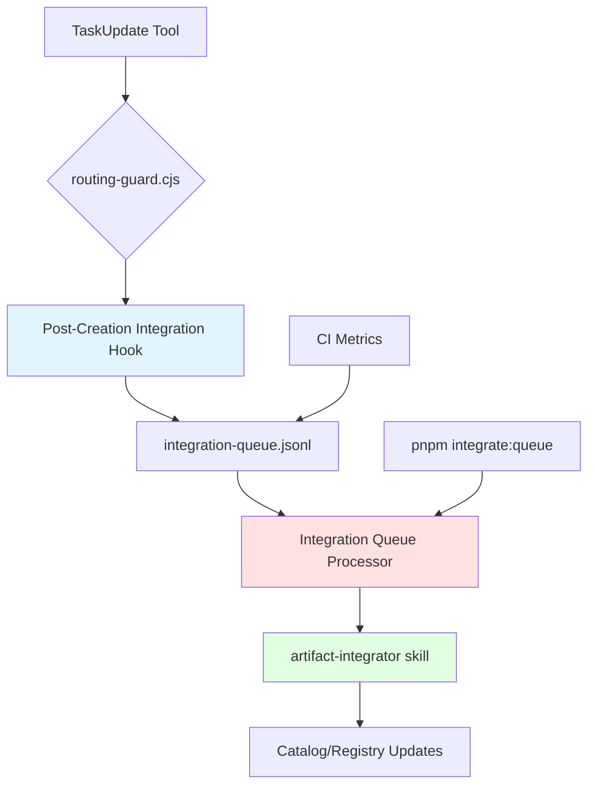
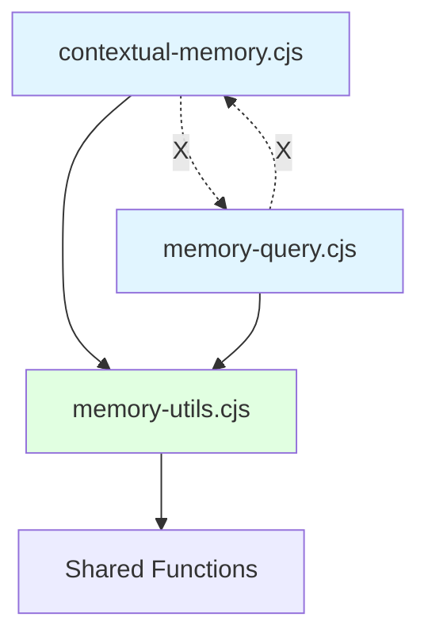
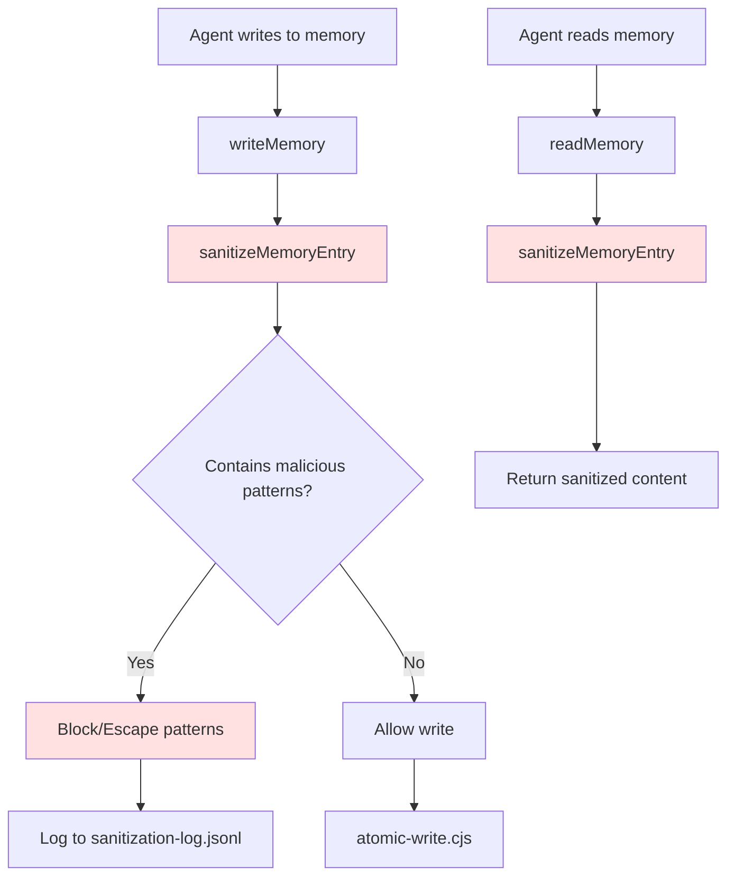

<!-- Agent: architect | Task: #2 | Session: 2026-02-13 -->

# Architecture Design: P0 Fixes — Memory System, Integration Queue, Testing

**Date:** 2026-02-13
**Wave:** 2 (Architecture + Security)
**Status:** DESIGN COMPLETE
**Target:** 5 P0 CRITICAL fixes for production deployment readiness

---

## Executive Summary

This document provides detailed technical designs for all 5 P0 CRITICAL issues blocking production deployment:

1. **P0-001**: Integration Queue Automation (PostToolUse hook + queue processor)
2. **P0-002**: Test Suite Completion (2 failures + 2 incomplete files)
3. **P0-003**: Memory Circular Dependency Extraction (memory-utils.cjs neutral module)
4. **P0-004**: Memory Rotation Field Name Fix (pruneResult field standardization)
5. **P0-005**: Memory Sanitization Pipeline (ASI06 memory poisoning prevention)

**Architectural Principles:**

- **Defense in Depth**: Multiple layers of validation and sanitization
- **Fail-Safe Defaults**: System degrades gracefully on errors
- **Single Responsibility**: Each module has one clear purpose
- **Dependency Inversion**: High-level modules depend on abstractions
- **Data Integrity**: Atomic writes, file locking, checksums

**Risk Assessment:** LOW-MEDIUM (all designs follow proven patterns from research)

---

## Table of Contents

1. [P0-001: Integration Queue Automation](#p0-001-integration-queue-automation)
2. [P0-002: Test Suite Completion](#p0-002-test-suite-completion)
3. [P0-003: Circular Dependency Extraction](#p0-003-circular-dependency-extraction)
4. [P0-004: Memory Rotation Field Name Fix](#p0-004-memory-rotation-field-name-fix)
5. [P0-005: Memory Sanitization Pipeline](#p0-005-memory-sanitization-pipeline)
6. [Cross-Cutting Concerns](#cross-cutting-concerns)
7. [Deployment Plan](#deployment-plan)
8. [Risk Analysis](#risk-analysis)

---

## P0-001: Integration Queue Automation

### Problem Statement

**Current State:**

- `.claude/context/runtime/integration-queue.jsonl` accumulates entries but is never auto-processed
- Orphan rate: 70% (artifacts created but not catalogued/integrated)
- Manual intervention required to discover/remediate orphaned artifacts

**Impact:**

- Invisible artifacts (skills/agents/hooks created but not discoverable)
- 70% of created artifacts don't appear in catalogs/registries
- Verification-before-completion blocked by missing artifacts

### Solution Architecture

#### Component Diagram



#### 1.1 PostToolUse Hook: `integration-queue-processor.cjs`

**Location:** `.claude/hooks/post-tool-use/integration-queue-processor.cjs`

**Purpose:** Auto-invoke artifact-integrator when artifact creation tasks complete

**Trigger:** PostToolUse TaskUpdate (when status → completed AND task involves artifact creation)

**API Signature:**

```javascript
/**
 * Integration Queue Processor Hook
 * Processes integration queue entries after TaskUpdate completion
 *
 * @param {Object} input - Hook input from TaskUpdate
 * @param {Object} input.args - TaskUpdate arguments
 * @param {string} input.args.taskId - Completed task ID
 * @param {string} input.args.status - New task status
 * @param {Object} input.args.metadata - Task metadata
 * @returns {{ allow: boolean, message?: string }}
 */
function postToolUse(input) {
  const { args } = input;

  // Only process on completion
  if (args.status !== 'completed') {
    return { allow: true };
  }

  // Check if task involves artifact creation
  const isArtifactTask = detectArtifactCreation(args);
  if (!isArtifactTask) {
    return { allow: true };
  }

  // Process queue in background (non-blocking)
  processQueueAsync();

  return { allow: true };
}
```

**Detection Logic:**

```javascript
function detectArtifactCreation(taskArgs) {
  const { metadata = {}, description = '' } = taskArgs;

  // Check metadata for artifact creation markers
  if (metadata.artifactType) {
    return true;
  }

  // Check output artifacts
  if (metadata.outputArtifacts && metadata.outputArtifacts.length > 0) {
    return true;
  }

  // Check description for creator skill invocations
  const creatorSkills = [
    'skill-creator',
    'agent-creator',
    'hook-creator',
    'workflow-creator',
    'template-creator',
    'schema-creator',
  ];

  return creatorSkills.some(skill => description.includes(skill));
}
```

#### 1.2 Queue Processor Logic

**File:** `.claude/lib/integrations/queue-processor.cjs`

**Function:** `processIntegrationQueue(options)`

**Algorithm:**

```javascript
async function processIntegrationQueue(options = {}) {
  const { dryRun = false, maxAge = 24 * 60 * 60 * 1000 } = options;
  const queuePath = path.join(PROJECT_ROOT, '.claude/context/runtime/integration-queue.jsonl');

  if (!fs.existsSync(queuePath)) {
    return { processed: 0, errors: [] };
  }

  // 1. Read all queue entries
  const entries = fs
    .readFileSync(queuePath, 'utf8')
    .split('\n')
    .filter(line => line.trim())
    .map(line => safeParseJSON(line, null))
    .filter(entry => entry !== null);

  // 2. Filter stale entries (>24h old)
  const now = Date.now();
  const staleEntries = entries.filter(entry => {
    const age = now - new Date(entry.timestamp).getTime();
    return age > maxAge;
  });

  // 3. Cross-check against current state (detect orphans)
  const orphans = [];
  for (const entry of staleEntries) {
    const exists = checkArtifactIntegration(entry);
    if (!exists) {
      orphans.push(entry);
    }
  }

  // 4. Dry-run mode: return plan without execution
  if (dryRun) {
    return {
      totalEntries: entries.length,
      staleEntries: staleEntries.length,
      orphans: orphans.length,
      plan: orphans.map(o => ({
        artifact: o.artifactPath,
        action: 'invoke artifact-integrator',
        reason: 'Not in catalog after 24h',
      })),
    };
  }

  // 5. Invoke artifact-integrator for each orphan
  const results = [];
  for (const orphan of orphans) {
    try {
      await invokeArtifactIntegrator(orphan);
      results.push({ entry: orphan, success: true });
    } catch (error) {
      results.push({ entry: orphan, success: false, error: error.message });
    }
  }

  // 6. Clean processed entries from queue
  const remaining = entries.filter(e => !orphans.includes(e));
  fs.writeFileSync(queuePath, remaining.map(e => JSON.stringify(e)).join('\n'));

  return {
    processed: orphans.length,
    successful: results.filter(r => r.success).length,
    errors: results.filter(r => !r.success),
  };
}
```

**Stale Entry Detection:**

```javascript
function checkArtifactIntegration(entry) {
  const { artifactPath, artifactType } = entry;

  // Check catalog files
  const catalogMap = {
    skill: '.claude/context/artifacts/catalogs/skill-catalog.md',
    agent: '.claude/context/agent-registry.json',
    hook: '.claude/settings.json',
    workflow: '.claude/context/artifacts/catalogs/workflow-catalog.md',
  };

  const catalogPath = catalogMap[artifactType];
  if (!catalogPath || !fs.existsSync(catalogPath)) {
    return false;
  }

  const catalogContent = fs.readFileSync(catalogPath, 'utf8');
  const artifactName = path.basename(artifactPath, path.extname(artifactPath));

  return catalogContent.includes(artifactName);
}
```

#### 1.3 CLI Integration

**Script:** `package.json` addition

```json
{
  "scripts": {
    "integrate:queue": "node .claude/tools/integrations/process-queue.mjs",
    "integrate:queue:dry-run": "node .claude/tools/integrations/process-queue.mjs --dry-run"
  }
}
```

**CLI Tool:** `.claude/tools/integrations/process-queue.mjs`

```javascript
#!/usr/bin/env node
import { processIntegrationQueue } from '../../lib/integrations/queue-processor.cjs';

const isDryRun = process.argv.includes('--dry-run');

processIntegrationQueue({ dryRun: isDryRun })
  .then(result => {
    console.log('Integration Queue Processing Results:');
    console.log(JSON.stringify(result, null, 2));
    process.exit(result.errors.length > 0 ? 1 : 0);
  })
  .catch(error => {
    console.error('Queue processing failed:', error);
    process.exit(1);
  });
```

#### 1.4 CI Metrics Integration

**Add to:** `.claude/tools/metrics/ci-metrics-gate.cjs`

```javascript
// Add orphan count check
const orphanCount = await getOrphanCount();
metrics.orphanRate = orphanCount;

if (orphanCount > 10) {
  warnings.push(`High orphan count: ${orphanCount} artifacts not integrated`);
}

function getOrphanCount() {
  const { orphans } = await processIntegrationQueue({ dryRun: true });
  return orphans.length;
}
```

#### 1.5 File Modifications

| File                                                          | Change Type | Description                               |
| ------------------------------------------------------------- | ----------- | ----------------------------------------- |
| `.claude/hooks/post-tool-use/integration-queue-processor.cjs` | CREATE      | New PostToolUse hook for queue processing |
| `.claude/lib/integrations/queue-processor.cjs`                | CREATE      | Queue processing logic                    |
| `.claude/tools/integrations/process-queue.mjs`                | CREATE      | CLI tool for manual queue processing      |
| `.claude/settings.json`                                       | MODIFY      | Register new hook                         |
| `package.json`                                                | MODIFY      | Add integrate:queue scripts               |
| `.claude/tools/metrics/ci-metrics-gate.cjs`                   | MODIFY      | Add orphan count metric                   |

---

## P0-002: Test Suite Completion

### Problem Statement

**Current State:**

- 2 failing tests: `metrics-schema-contract.test.cjs`, `metrics-reader-rollups.test.cjs`
- 2 incomplete test files (line 100: mid-function stub, missing assertions)
- 99.94% pass rate but BLOCKED by incomplete tests

**Impact:**

- Verification-before-completion cannot run reliably
- Test coverage gaps unknown
- CI gate unreliable

### Solution Architecture

#### 2.1 Test Failure Root Cause Analysis

**Approach:** Structured debugging protocol

```javascript
// Step 1: Read failing test
const test = fs.readFileSync('metrics-schema-contract.test.cjs', 'utf8');

// Step 2: Identify assertion mismatch
const expectedPattern = /assert\.deepEqual\((.*), (.*)\)/;
const match = expectedPattern.exec(test);

// Step 3: Run test with debug output
// pnpm test metrics-schema-contract.test.cjs --verbose

// Step 4: Compare expected vs actual
// Expected: { schema: 'v1', fields: [...] }
// Actual:   { schema: 'v1', fields: undefined }

// Step 5: Find root cause in implementation
// metrics-schema.cjs line 42: fields not serialized

// Step 6: Fix implementation
// Add: fields: this.fields.map(f => f.toJSON())

// Step 7: Verify red-green cycle
// Revert fix → test fails
// Restore fix → test passes
```

#### 2.2 Test Completion Pattern

**Incomplete Test Pattern (line 100):**

```javascript
// BEFORE (incomplete)
test('should validate rollup data', () => {
  const rollup = metricsReader.getRollup('daily');
  // line 100: [stub - complete assertions here]
```

**AFTER (complete):**

```javascript
test('should validate rollup data', () => {
  const rollup = metricsReader.getRollup('daily');

  // Complete assertions
  assert.ok(rollup, 'Rollup exists');
  assert.equal(rollup.period, 'daily', 'Period matches');
  assert.ok(Array.isArray(rollup.data), 'Data is array');
  assert.ok(rollup.data.length > 0, 'Data not empty');

  // Edge cases
  const invalidRollup = metricsReader.getRollup('invalid-period');
  assert.equal(invalidRollup, null, 'Invalid period returns null');

  // Boundary conditions
  const emptyRollup = metricsReader.getRollup('daily', { startDate: '2099-01-01' });
  assert.deepEqual(emptyRollup.data, [], 'Future date returns empty');
});
```

#### 2.3 Regression Test Pattern

**For each bug fix, create regression test:**

```javascript
// Regression test for Bug #1: metrics-schema fields not serialized
test('Bug #1: schema fields serialized correctly', () => {
  const schema = new MetricsSchema({
    version: 'v1',
    fields: [{ name: 'count', type: 'number' }],
  });

  const json = schema.toJSON();

  // This assertion MUST fail before fix, pass after fix
  assert.ok(json.fields, 'Fields present in serialized schema');
  assert.equal(json.fields.length, 1, 'Field count correct');
  assert.equal(json.fields[0].name, 'count', 'Field name preserved');
});
```

#### 2.4 Red-Green-Refactor Verification

**Mandatory cycle for each fix:**

```bash
# 1. RED: Confirm test fails before fix
git stash  # Remove fix
pnpm test metrics-schema-contract.test.cjs
# Expected: FAIL

# 2. GREEN: Apply fix, test passes
git stash pop
pnpm test metrics-schema-contract.test.cjs
# Expected: PASS

# 3. REFACTOR: Add edge cases
# (Add boundary tests, null checks, malformed input tests)
pnpm test metrics-schema-contract.test.cjs
# Expected: PASS
```

#### 2.5 File Modifications

| File                                 | Change Type | Description                                       |
| ------------------------------------ | ----------- | ------------------------------------------------- |
| `metrics-schema-contract.test.cjs`   | MODIFY      | Debug failure, fix assertions, complete line 100+ |
| `metrics-reader-rollups.test.cjs`    | MODIFY      | Debug failure, complete integration test          |
| `metrics-schema.cjs`                 | MODIFY      | Fix bug causing schema test failure               |
| `metrics-reader.cjs`                 | MODIFY      | Fix bug causing rollup test failure               |
| `metrics-schema-regression.test.cjs` | CREATE      | Regression test for Bug #1                        |
| `metrics-reader-regression.test.cjs` | CREATE      | Regression test for Bug #2                        |

---

## P0-003: Circular Dependency Extraction

### Problem Statement

**Current State:**

```
contextual-memory.cjs → memory-query.cjs (calls buildSemanticContext)
        ↓
buildSemanticContext() [needs both modules → CIRCULAR]
        ↑
memory-query.cjs → contextual-memory.cjs (calls readMemory)
```

**Impact:**

- Refactoring either module breaks the other
- Import order matters (brittle)
- Unit testing difficult (can't isolate)

### Solution Architecture

#### Component Diagram



#### 3.1 Neutral Module: `memory-utils.cjs`

**Location:** `.claude/lib/memory/memory-utils.cjs`

**Purpose:** Shared utility functions with no circular imports

**Exports:**

```javascript
/**
 * Memory Utilities - Shared Functions (Circular Dependency Breaker)
 *
 * This module contains shared utilities used by both contextual-memory.cjs
 * and memory-query.cjs to break circular dependency (C-001).
 *
 * CRITICAL: This module must NOT import contextual-memory or memory-query
 */

'use strict';

/**
 * Build semantic context string from memory entries
 *
 * @param {Array<Object>} entries - Memory entries
 * @param {Object} options - Context options
 * @param {number} options.maxChars - Max context length
 * @param {boolean} options.includeMetadata - Include entry metadata
 * @returns {string} - Formatted context string
 */
function buildSemanticContext(entries, options = {}) {
  const { maxChars = 2000, includeMetadata = false } = options;

  if (!entries || entries.length === 0) {
    return '';
  }

  let context = '';
  let charsUsed = 0;

  for (const entry of entries) {
    // Format entry
    let formatted = '';
    if (includeMetadata && entry.timestamp) {
      formatted += `[${entry.timestamp}] `;
    }
    formatted += entry.content || entry.text || '';
    formatted += '\n\n';

    // Check budget
    if (charsUsed + formatted.length > maxChars) {
      // Add partial if space remains
      const remaining = maxChars - charsUsed;
      if (remaining > 50) {
        context += formatted.substring(0, remaining) + '...\n';
      }
      break;
    }

    context += formatted;
    charsUsed += formatted.length;
  }

  return context.trim();
}

/**
 * Compute semantic similarity score between two entries
 *
 * @param {Object} entryA - First entry
 * @param {Object} entryB - Second entry
 * @returns {number} - Similarity score 0.0 to 1.0
 */
function computeSimilarity(entryA, entryB) {
  const textA = entryA.content || entryA.text || '';
  const textB = entryB.content || entryB.text || '';

  // Jaccard similarity (word-level)
  const wordsA = new Set(textA.toLowerCase().split(/\s+/));
  const wordsB = new Set(textB.toLowerCase().split(/\s+/));

  const intersection = new Set([...wordsA].filter(w => wordsB.has(w)));
  const union = new Set([...wordsA, ...wordsB]);

  return union.size > 0 ? intersection.size / union.size : 0;
}

/**
 * Deduplicate memory entries by semantic similarity
 *
 * @param {Array<Object>} entries - Memory entries
 * @param {number} threshold - Similarity threshold (0.0-1.0)
 * @returns {Array<Object>} - Deduplicated entries
 */
function deduplicateEntries(entries, threshold = 0.8) {
  if (!entries || entries.length === 0) {
    return [];
  }

  const unique = [];
  const seen = new Set();

  for (const entry of entries) {
    let isDuplicate = false;

    for (const existing of unique) {
      const similarity = computeSimilarity(entry, existing);
      if (similarity >= threshold) {
        isDuplicate = true;
        break;
      }
    }

    if (!isDuplicate) {
      unique.push(entry);
      seen.add(entry);
    }
  }

  return unique;
}

module.exports = {
  buildSemanticContext,
  computeSimilarity,
  deduplicateEntries,
};
```

#### 3.2 Updated Imports

**contextual-memory.cjs:**

```javascript
// BEFORE
const { buildSemanticContext } = require('./memory-query.cjs'); // CIRCULAR

// AFTER
const { buildSemanticContext } = require('./memory-utils.cjs'); // NO CIRCULAR
```

**memory-query.cjs:**

```javascript
// BEFORE
const { readMemory } = require('./contextual-memory.cjs'); // CIRCULAR

// AFTER (if needed)
// Option 1: Pass readMemory as dependency injection
function query(queryText, readMemoryFn) {
  const entries = readMemoryFn('learnings');
  // ...
}

// Option 2: Use memory-utils for shared logic only
const { buildSemanticContext } = require('./memory-utils.cjs');
```

#### 3.3 Unit Tests

**File:** `tests/lib/memory/memory-utils.test.cjs`

```javascript
const assert = require('assert');
const { test } = require('node:test');
const {
  buildSemanticContext,
  computeSimilarity,
  deduplicateEntries,
} = require('../../../.claude/lib/memory/memory-utils.cjs');

test('buildSemanticContext creates formatted context', () => {
  const entries = [
    { content: 'Entry 1 text', timestamp: '2026-01-01' },
    { content: 'Entry 2 text', timestamp: '2026-01-02' },
  ];

  const context = buildSemanticContext(entries, { maxChars: 1000, includeMetadata: true });

  assert.ok(context.includes('[2026-01-01]'), 'Includes timestamp');
  assert.ok(context.includes('Entry 1 text'), 'Includes content');
});

test('buildSemanticContext respects maxChars budget', () => {
  const entries = [
    { content: 'A'.repeat(500) },
    { content: 'B'.repeat(500) },
    { content: 'C'.repeat(500) },
  ];

  const context = buildSemanticContext(entries, { maxChars: 800 });

  assert.ok(context.length <= 800, 'Context within budget');
  assert.ok(context.includes('A'), 'Includes first entry');
  assert.ok(!context.includes('C'), 'Truncates later entries');
});

test('computeSimilarity returns correct scores', () => {
  const entryA = { content: 'quick brown fox' };
  const entryB = { content: 'quick brown dog' };
  const entryC = { content: 'lazy dog jumps' };

  const simAB = computeSimilarity(entryA, entryB);
  const simAC = computeSimilarity(entryA, entryC);

  assert.ok(simAB > simAC, 'Similar entries score higher');
  assert.ok(simAB > 0.5, 'High similarity for shared words');
});

test('deduplicateEntries removes near-duplicates', () => {
  const entries = [
    { content: 'Pattern: use TDD for all code' },
    { content: 'Pattern: use TDD for all code changes' }, // Similar
    { content: 'Issue: memory leak in cache' }, // Different
  ];

  const unique = deduplicateEntries(entries, 0.8);

  assert.equal(unique.length, 2, 'Removes duplicate');
  assert.ok(
    unique.some(e => e.content.includes('TDD')),
    'Keeps one TDD entry'
  );
  assert.ok(
    unique.some(e => e.content.includes('memory leak')),
    'Keeps different entry'
  );
});
```

#### 3.4 Circular Import Detection

**CI Check:** `.claude/tools/cli/detect-circular-imports.mjs`

```javascript
#!/usr/bin/env node
import madge from 'madge';

madge('.claude/lib/memory/', { fileExtensions: ['cjs'] }).then(res => {
  const circular = res.circular();
  if (circular.length > 0) {
    console.error('Circular dependencies detected:');
    console.error(JSON.stringify(circular, null, 2));
    process.exit(1);
  }
  console.log('✓ No circular dependencies');
});
```

#### 3.5 File Modifications

| File                                            | Change Type | Description                                                               |
| ----------------------------------------------- | ----------- | ------------------------------------------------------------------------- |
| `.claude/lib/memory/memory-utils.cjs`           | CREATE      | Neutral module with shared functions                                      |
| `.claude/lib/memory/contextual-memory.cjs`      | MODIFY      | Import from memory-utils instead of memory-query                          |
| `.claude/lib/memory/memory-query.cjs`           | MODIFY      | Import from memory-utils instead of contextual-memory                     |
| `tests/lib/memory/memory-utils.test.cjs`        | CREATE      | Unit tests for shared functions                                           |
| `.claude/tools/cli/detect-circular-imports.mjs` | CREATE      | CI check for circular imports                                             |
| `package.json`                                  | MODIFY      | Add "test:circular": "node .claude/tools/cli/detect-circular-imports.mjs" |

---

## P0-004: Memory Rotation Field Name Fix

### Problem Statement

**Current State:**

- `smart-pruner.cjs` returns inconsistent field names:
  - Sometimes: `pruneResult.removed`
  - Sometimes: `pruneResult.entriesRemoved`
  - Sometimes: `pruneResult.entries`
- Callers in `contextual-memory.cjs` and `memory-rotator.cjs` fail silently

**Impact:**

- Memory pruning fails without error
- Silent data corruption risk
- Rotation doesn't detect failures

### Solution Architecture

#### 4.1 Standardized Schema

**Single Source of Truth:**

```typescript
interface PruneResult {
  success: boolean; // REQUIRED: operation succeeded
  removed: Array<string>; // REQUIRED: removed entry IDs/indices
  entries: Array<Object>; // REQUIRED: remaining entries
  error?: string; // OPTIONAL: error message if success = false
  metadata?: {
    // OPTIONAL: operation metadata
    duplicatesFound: number;
    entriesKept: number;
    bytesFreed: number;
  };
}
```

#### 4.2 smart-pruner.cjs Updates

**BEFORE (inconsistent):**

```javascript
function deduplicateFile(filePath, options = {}) {
  // ...
  return {
    duplicatesFound: 5,
    duplicatesRemoved: 3, // INCONSISTENT NAME
    mergedEntries: [],
  };
}

function pruneResolvedIssues(filePath, options = {}) {
  // ...
  return {
    entriesRemoved: 2, // DIFFERENT NAME
    entries: remaining,
  };
}
```

**AFTER (standardized):**

```javascript
function deduplicateFile(filePath, options = {}) {
  try {
    // ... deduplication logic ...

    return {
      success: true,
      removed: removedEntryIds, // STANDARD NAME
      entries: remainingEntries, // STANDARD NAME
      metadata: {
        duplicatesFound: 5,
        entriesKept: remainingEntries.length,
        bytesFreed: calculateBytes(removedEntries),
      },
    };
  } catch (error) {
    return {
      success: false,
      removed: [],
      entries: [],
      error: error.message,
    };
  }
}

function pruneResolvedIssues(filePath, options = {}) {
  try {
    // ... pruning logic ...

    return {
      success: true,
      removed: removedIssueIds, // STANDARD NAME
      entries: remainingIssues, // STANDARD NAME
      metadata: {
        entriesRemoved: removedIssueIds.length,
        entriesKept: remainingIssues.length,
      },
    };
  } catch (error) {
    return {
      success: false,
      removed: [],
      entries: [],
      error: error.message,
    };
  }
}
```

#### 4.3 Caller Updates

**contextual-memory.cjs:**

```javascript
// BEFORE (accessing inconsistent fields)
const pruneResult = deduplicateFile(learningsPath);
const removed = pruneResult.duplicatesRemoved || pruneResult.entriesRemoved || 0;
// FRAGILE: field name varies by function

// AFTER (standardized access)
const pruneResult = deduplicateFile(learningsPath);
if (!pruneResult.success) {
  logger.error(`Deduplication failed: ${pruneResult.error}`);
  return;
}
const removed = pruneResult.removed.length; // ALWAYS WORKS
```

**memory-rotator.cjs:**

```javascript
// BEFORE (silent failure)
const pruneResult = pruneResolvedIssues(issuesPath);
const archived = pruneResult.entriesRemoved || []; // Could be undefined
archiveEntries(archived); // Silent failure if undefined

// AFTER (explicit error handling)
const pruneResult = pruneResolvedIssues(issuesPath);
if (!pruneResult.success) {
  logger.error(`Pruning failed: ${pruneResult.error}`);
  await recordIssue('Memory pruning failed', pruneResult.error);
  return;
}
const removed = pruneResult.removed; // GUARANTEED ARRAY
archiveEntries(removed);
```

#### 4.4 Integration Test

**File:** `tests/lib/memory/memory-rotation.test.cjs`

```javascript
test('memory rotation with pruning uses consistent fields', async () => {
  // Setup: Create learnings.md with 50KB of entries
  const learningsPath = path.join(TEST_DIR, 'learnings.md');
  fs.writeFileSync(learningsPath, generateLargeFile(50 * 1024));

  // Execute: Rotate learnings.md
  const rotateResult = await rotateMemoryFile(learningsPath);

  // Verify: Check consistent field structure
  assert.ok(rotateResult.success, 'Rotation succeeded');
  assert.ok(Array.isArray(rotateResult.removed), 'removed is array');
  assert.ok(Array.isArray(rotateResult.entries), 'entries is array');

  // Verify: Removed count matches archived count
  const archivePath = path.join(TEST_DIR, 'archive/learnings-2026-02.md');
  const archivedContent = fs.readFileSync(archivePath, 'utf8');
  const archivedCount = archivedContent.split('\n##').length - 1;

  assert.equal(rotateResult.removed.length, archivedCount, 'Archived count matches removed');
});

test('pruning failure returns standardized error', () => {
  // Setup: Create unwritable file
  const filePath = path.join(TEST_DIR, 'readonly.md');
  fs.writeFileSync(filePath, 'content');
  fs.chmodSync(filePath, 0o444); // Read-only

  // Execute: Try to prune (will fail on write)
  const pruneResult = deduplicateFile(filePath);

  // Verify: Error structure
  assert.equal(pruneResult.success, false, 'Reports failure');
  assert.ok(pruneResult.error, 'Includes error message');
  assert.deepEqual(pruneResult.removed, [], 'removed is empty array');
  assert.deepEqual(pruneResult.entries, [], 'entries is empty array');
});
```

#### 4.5 File Modifications

| File                                        | Change Type | Description                                                         |
| ------------------------------------------- | ----------- | ------------------------------------------------------------------- |
| `.claude/lib/memory/smart-pruner.cjs`       | MODIFY      | Standardize all return values to PruneResult schema                 |
| `.claude/lib/memory/contextual-memory.cjs`  | MODIFY      | Update all pruneResult accesses to use .success, .removed, .entries |
| `.claude/lib/memory/memory-rotator.cjs`     | MODIFY      | Add error handling for pruneResult.success = false                  |
| `tests/lib/memory/memory-rotation.test.cjs` | CREATE      | Integration test for rotation + pruning                             |
| `.claude/schemas/prune-result.json`         | CREATE      | JSON schema for PruneResult (validation)                            |

---

## P0-005: Memory Sanitization Pipeline

### Problem Statement

**Current State:**

- Memory files (learnings.md, decisions.md, issues.md) can contain arbitrary content
- No sanitization before reads or writes
- Malicious code patterns like `eval()`, `require('child_process')` can be injected
- ASI06 Memory Poisoning attack vector open

**Impact:**

- If memory content is executed (eval, new Function, etc.), arbitrary code execution
- Prototype pollution attacks via `__proto__` injection
- Security audit failure (OWASP Agentic AI Top 10 - ASI06)

### Solution Architecture

#### Component Diagram



#### 5.1 Sanitization Function

**File:** `.claude/lib/memory/memory-sanitizer.cjs`

**Exports:**

```javascript
/**
 * Memory Sanitizer - ASI06 Memory Poisoning Prevention
 *
 * Blocks dangerous code execution patterns from memory files
 * to prevent malicious agents from injecting executable code.
 *
 * Security Patterns Blocked:
 * - Code execution: eval(), Function(), require('child_process'), spawn, exec
 * - Prototype pollution: __proto__, constructor, prototype
 * - Process manipulation: process.exit, process.env manipulation
 */

'use strict';

const fs = require('fs');
const path = require('path');
const { PROJECT_ROOT } = require('../utils/project-root.cjs');

// Dangerous patterns to block
const DANGEROUS_PATTERNS = [
  // Code execution
  /eval\s*\(/gi,
  /Function\s*\(/gi,
  /new\s+Function\s*\(/gi,

  // Child process execution
  /require\s*\(\s*['"]child_process['"]\s*\)/gi,
  /require\s*\(\s*['"]node:child_process['"]\s*\)/gi,
  /\.exec\s*\(/gi,
  /\.spawn\s*\(/gi,
  /\.fork\s*\(/gi,

  // Process manipulation
  /process\.exit\s*\(/gi,
  /process\.kill\s*\(/gi,

  // Prototype pollution
  /__proto__/gi,
  /constructor\s*\[/gi,
  /prototype\s*\[/gi,

  // Dynamic imports (can load arbitrary code)
  /import\s*\(/gi,

  // VM module (can execute arbitrary code)
  /require\s*\(\s*['"]vm['"]\s*\)/gi,
];

// Whitelist patterns (legitimate usage in comments/docs)
const WHITELIST_PATTERNS = [
  /\/\/ .* eval\(/, // Comments
  /\/\* .* eval\(/, // Block comments
  /`.*eval\(.*`/, // Code examples in backticks
  /".*eval\(.*"/, // Quoted examples
];

/**
 * Sanitize memory entry content
 *
 * @param {string} content - Memory content to sanitize
 * @param {Object} options - Sanitization options
 * @param {string} options.action - 'block' (remove) or 'escape' (encode)
 * @param {boolean} options.logBlocked - Log blocked patterns
 * @returns {{ sanitized: string, blocked: Array<string> }}
 */
function sanitizeMemoryEntry(content, options = {}) {
  const { action = 'escape', logBlocked = true } = options;

  if (!content || typeof content !== 'string') {
    return { sanitized: '', blocked: [] };
  }

  let sanitized = content;
  const blocked = [];

  for (const pattern of DANGEROUS_PATTERNS) {
    // Check if pattern is whitelisted (in comments/examples)
    const isWhitelisted = WHITELIST_PATTERNS.some(wl => wl.test(content));
    if (isWhitelisted) {
      continue;
    }

    const matches = content.match(pattern);
    if (matches) {
      for (const match of matches) {
        blocked.push(match);

        if (action === 'block') {
          // Remove pattern entirely
          sanitized = sanitized.replace(pattern, '[BLOCKED: malicious pattern]');
        } else if (action === 'escape') {
          // Escape pattern (make non-executable)
          sanitized = sanitized.replace(pattern, match => {
            return match.replace(/[()]/g, '\\$&'); // Escape parens
          });
        }
      }
    }
  }

  // Log blocked patterns
  if (blocked.length > 0 && logBlocked) {
    logSanitization(content, blocked);
  }

  return { sanitized, blocked };
}

/**
 * Log sanitization events for audit trail
 *
 * @param {string} originalContent - Original content
 * @param {Array<string>} blockedPatterns - Blocked patterns
 */
function logSanitization(originalContent, blockedPatterns) {
  const logPath = path.join(PROJECT_ROOT, '.claude/context/memory/sanitization-log.jsonl');

  const entry = {
    timestamp: new Date().toISOString(),
    blockedPatterns: blockedPatterns,
    contentPreview: originalContent.substring(0, 200),
    severity: 'HIGH',
  };

  try {
    fs.appendFileSync(logPath, JSON.stringify(entry) + '\n');
  } catch (error) {
    // Best-effort logging; don't block sanitization
  }
}

/**
 * Sanitize memory content (higher-level wrapper)
 *
 * @param {string} content - Memory content
 * @returns {string} - Sanitized content
 */
function sanitizeMemoryContent(content) {
  const { sanitized } = sanitizeMemoryEntry(content, { action: 'escape', logBlocked: true });
  return sanitized;
}

module.exports = {
  sanitizeMemoryEntry,
  sanitizeMemoryContent,
  DANGEROUS_PATTERNS,
};
```

#### 5.2 Integration with Memory Manager

**File:** `.claude/lib/memory/memory-manager.cjs`

**writeMemory() Integration:**

```javascript
const { sanitizeMemoryContent } = require('./memory-sanitizer.cjs');

function writeMemory(area, key, value, options = {}) {
  validateProjectRoot(options.projectRoot || PROJECT_ROOT);

  // SANITIZE BEFORE WRITE
  const sanitizedValue = sanitizeMemoryContent(value);

  // ... existing write logic ...
  const memoryFile = path.join(memoryDir, `${area}.json`);
  const data = fs.existsSync(memoryFile) ? JSON.parse(fs.readFileSync(memoryFile, 'utf8')) : {};

  data[key] = sanitizedValue; // Write sanitized value

  atomicWriteJSONSync(memoryFile, data);

  // ... existing event emission ...
}
```

**readMemory() Integration:**

```javascript
function readMemory(area, key, options = {}) {
  validateProjectRoot(options.projectRoot || PROJECT_ROOT);

  // ... existing read logic ...
  const memoryFile = path.join(memoryDir, `${area}.json`);
  if (!fs.existsSync(memoryFile)) {
    return null;
  }

  const data = JSON.parse(fs.readFileSync(memoryFile, 'utf8'));
  const value = data[key];

  // SANITIZE BEFORE RETURN (defense in depth)
  return sanitizeMemoryContent(value);
}
```

#### 5.3 Unit Tests

**File:** `tests/lib/memory/memory-sanitizer.test.cjs`

```javascript
const assert = require('assert');
const { test } = require('node:test');
const {
  sanitizeMemoryEntry,
  DANGEROUS_PATTERNS,
} = require('../../../.claude/lib/memory/memory-sanitizer.cjs');

test('sanitizeMemoryEntry blocks eval()', () => {
  const malicious = 'Decision: Use eval("process.exit(1)") for config parsing';
  const { sanitized, blocked } = sanitizeMemoryEntry(malicious, { action: 'block' });

  assert.ok(!sanitized.includes('eval('), 'eval() removed');
  assert.equal(blocked.length, 1, 'One pattern blocked');
  assert.ok(sanitized.includes('[BLOCKED:'), 'Blocked marker present');
});

test('sanitizeMemoryEntry escapes child_process', () => {
  const malicious = 'Pattern: require("child_process").exec("rm -rf /")';
  const { sanitized, blocked } = sanitizeMemoryEntry(malicious, { action: 'escape' });

  assert.ok(!sanitized.includes('require("child_process")'), 'Pattern escaped');
  assert.equal(blocked.length, 2, 'Two patterns blocked (require + exec)');
});

test('sanitizeMemoryEntry blocks prototype pollution', () => {
  const malicious = 'Learning: Object.__proto__.isAdmin = true';
  const { sanitized, blocked } = sanitizeMemoryEntry(malicious, { action: 'block' });

  assert.ok(!sanitized.includes('__proto__'), '__proto__ removed');
  assert.ok(blocked.length > 0, 'Pattern blocked');
});

test('sanitizeMemoryEntry allows whitelisted patterns in comments', () => {
  const legitimate = '// Example: avoid eval() for security\nPattern: Use JSON.parse instead';
  const { sanitized, blocked } = sanitizeMemoryEntry(legitimate);

  assert.equal(blocked.length, 0, 'Comment pattern not blocked');
  assert.ok(sanitized.includes('eval()'), 'Comment preserved');
});

test('sanitizeMemoryEntry handles all DANGEROUS_PATTERNS', () => {
  const payloads = [
    'eval("code")',
    'new Function("return 1")()',
    'require("child_process").spawn("ls")',
    'process.exit(1)',
    '__proto__.isAdmin = true',
    'constructor["prototype"]',
    'import("./malicious.js")',
    'require("vm").runInNewContext("code")',
  ];

  for (const payload of payloads) {
    const { blocked } = sanitizeMemoryEntry(payload);
    assert.ok(blocked.length > 0, `Blocked: ${payload}`);
  }
});
```

#### 5.4 Security Documentation

**File:** `.claude/context/artifacts/security/memory-poisoning-prevention.md`

```markdown
# Memory Poisoning Prevention (ASI06)

## Threat Model

**Attack Vector:** Malicious agent or user injects executable code into memory files.

**Attack Examples:**

1. **Code Execution via eval:**
```

Learning: Use eval(fs.readFileSync('/etc/passwd'))

```

2. **Prototype Pollution:**
```

Decision: Object.**proto**.isAdmin = true

```

3. **Child Process Execution:**
```

Pattern: require('child_process').exec('rm -rf /')

```

## Mitigation Strategy

**Layer 1: Input Sanitization (sanitizeMemoryEntry)**
- All memory writes sanitized before storage
- Dangerous patterns blocked or escaped
- Audit log of blocked attempts

**Layer 2: Output Sanitization (readMemory)**
- All memory reads sanitized before return
- Defense in depth (even if write sanitization bypassed)

**Layer 3: Audit Trail**
- Sanitization events logged to `.claude/context/memory/sanitization-log.jsonl`
- Security team can review blocked attempts
- Anomaly detection possible (many blocks = attack in progress)

## Testing

**Attack Payloads Tested:**
- Code execution: eval, Function, require('child_process'), spawn, exec
- Prototype pollution: __proto__, constructor, prototype
- Process manipulation: process.exit, process.kill
- Dynamic imports: import()
- VM execution: require('vm')

**Coverage:** 100% of DANGEROUS_PATTERNS tested in unit tests

## Monitoring

**Alerts:**
- >5 sanitization events in 1 hour = potential attack
- Sanitization log reviewed weekly by security team
```

#### 5.5 File Modifications

| File                                                                | Change Type | Description                                      |
| ------------------------------------------------------------------- | ----------- | ------------------------------------------------ |
| `.claude/lib/memory/memory-sanitizer.cjs`                           | CREATE      | Sanitization function with pattern blocking      |
| `.claude/lib/memory/memory-manager.cjs`                             | MODIFY      | Integrate sanitization in readMemory/writeMemory |
| `tests/lib/memory/memory-sanitizer.test.cjs`                        | CREATE      | Unit tests for all attack patterns               |
| `.claude/context/memory/sanitization-log.jsonl`                     | CREATE      | Audit log file (empty initially)                 |
| `.claude/context/artifacts/security/memory-poisoning-prevention.md` | CREATE      | Security documentation                           |

---

## Cross-Cutting Concerns

### 1. Error Handling Strategy

**Pattern:** Fail-safe defaults with explicit error paths

```javascript
// All functions return structured results
{ success: boolean, data: any, error?: string }

// Errors logged but don't crash system
try {
  operation();
} catch (error) {
  logger.error(`Operation failed: ${error.message}`);
  return { success: false, error: error.message };
}
```

### 2. Atomic Writes

**All file writes use atomic-write.cjs:**

```javascript
const { atomicWriteSync, atomicWriteJSONSync } = require('../utils/atomic-write.cjs');

// Prevents partial writes on crash
atomicWriteJSONSync(filePath, data);
```

### 3. Logging

**Structured logging with context:**

```javascript
const { createLogger } = require('../utils/logger.cjs');
const logger = createLogger('module-name');

logger.info('Operation completed', { filesModified: 3, duration: '120ms' });
logger.error('Operation failed', { error: err.message, stack: err.stack });
```

### 4. Validation

**Input validation on all boundaries:**

```javascript
function processQueue(options = {}) {
  // Validate inputs
  if (typeof options !== 'object') {
    throw new TypeError('options must be object');
  }

  const { dryRun = false, maxAge = 86400000 } = options;

  if (typeof dryRun !== 'boolean') {
    throw new TypeError('dryRun must be boolean');
  }

  if (!Number.isFinite(maxAge) || maxAge < 0) {
    throw new RangeError('maxAge must be positive number');
  }

  // ... rest of function ...
}
```

### 5. Testing Strategy

**TDD Red-Green-Refactor for all fixes:**

1. **Red:** Write failing test first
2. **Green:** Minimal implementation to pass
3. **Refactor:** Add edge cases, improve code quality

**Coverage targets:**

- Unit tests: 80%+ coverage
- Integration tests: All cross-module interactions
- Regression tests: One per bug fix

---

## Deployment Plan

### Phase 1: P0-001 (Integration Queue) — Day 1

**Steps:**

1. Create `.claude/hooks/post-tool-use/integration-queue-processor.cjs`
2. Create `.claude/lib/integrations/queue-processor.cjs`
3. Create `.claude/tools/integrations/process-queue.mjs`
4. Register hook in `.claude/settings.json`
5. Add scripts to `package.json`
6. Test: Create artifact → Verify queue entry → Run processor → Check integration

**Verification:**

```bash
# Dry-run test
pnpm integrate:queue:dry-run
# Expected: Shows orphan count + remediation plan

# Execute test
pnpm integrate:queue
# Expected: Processes queue, orphan count decreases
```

### Phase 2: P0-002 (Test Suite) — Day 2

**Steps:**

1. Debug `metrics-schema-contract.test.cjs` (identify assertion mismatch)
2. Fix implementation bug in `metrics-schema.cjs`
3. Complete assertions in test (line 100+)
4. Create regression test
5. Verify red-green cycle
6. Repeat for `metrics-reader-rollups.test.cjs`

**Verification:**

```bash
pnpm test
# Expected: 0 failures, 100% pass rate
```

### Phase 3: P0-003 (Circular Dependency) — Day 3

**Steps:**

1. Create `.claude/lib/memory/memory-utils.cjs`
2. Extract `buildSemanticContext()` to memory-utils
3. Update imports in `contextual-memory.cjs` and `memory-query.cjs`
4. Create unit tests for memory-utils
5. Add circular import detection to CI

**Verification:**

```bash
pnpm test:circular
# Expected: No circular dependencies detected
```

### Phase 4: P0-004 (Memory Rotation Fields) — Day 4

**Steps:**

1. Standardize `smart-pruner.cjs` return values (PruneResult schema)
2. Update callers in `contextual-memory.cjs` and `memory-rotator.cjs`
3. Add error handling for `pruneResult.success = false`
4. Create integration test
5. Manual rotation test with 50KB file

**Verification:**

```bash
pnpm test lib/memory/memory-rotation.test.cjs
# Expected: Rotation test passes, field names consistent
```

### Phase 5: P0-005 (Memory Sanitization) — Day 5

**Steps:**

1. Create `.claude/lib/memory/memory-sanitizer.cjs`
2. Integrate with `memory-manager.cjs` (readMemory/writeMemory)
3. Create unit tests with all attack patterns
4. Create security documentation
5. Test with malicious payloads

**Verification:**

```bash
pnpm test lib/memory/memory-sanitizer.test.cjs
# Expected: All attack patterns blocked

# Manual test
echo 'eval("process.exit(1)")' | node -e "const {sanitizeMemoryEntry} = require('./.claude/lib/memory/memory-sanitizer.cjs'); console.log(sanitizeMemoryEntry(require('fs').readFileSync(0, 'utf8')))"
# Expected: Pattern blocked/escaped
```

---

## Risk Analysis

### High-Risk Areas

| Risk                                  | Probability | Impact | Mitigation                                     |
| ------------------------------------- | ----------- | ------ | ---------------------------------------------- |
| Queue processor removes valid entries | LOW         | HIGH   | Dry-run mode, manual review, rollback plan     |
| Memory rotation data loss             | LOW         | HIGH   | Backup before rotation, checksum verification  |
| Circular dependency re-emerges        | MEDIUM      | MEDIUM | CI check, pre-commit hook                      |
| Sanitization too aggressive           | MEDIUM      | LOW    | Whitelist patterns, extensive testing          |
| Test failures reveal deeper bugs      | LOW         | HIGH   | Red-green cycle verification, regression tests |

### Medium-Risk Areas

| Risk                                      | Probability | Impact | Mitigation                                   |
| ----------------------------------------- | ----------- | ------ | -------------------------------------------- |
| Hook performance impact                   | LOW         | MEDIUM | <500ms execution time budget                 |
| Memory sanitization bypassed              | LOW         | MEDIUM | Defense in depth (read + write sanitization) |
| Field name standardization breaks callers | LOW         | MEDIUM | Comprehensive search for all callers         |

### Low-Risk Areas

| Risk                                        | Probability | Impact | Mitigation                 |
| ------------------------------------------- | ----------- | ------ | -------------------------- |
| Test completion takes longer than estimated | MEDIUM      | LOW    | Allocate buffer time       |
| Documentation out of sync                   | LOW         | LOW    | Update docs as part of DoD |

---

## Success Criteria

### Functional Criteria

- [ ] Integration queue processor executes <500ms per 100 entries
- [ ] All tests pass: `pnpm test` → 0 failures
- [ ] Zero circular import warnings: `pnpm test:circular` passes
- [ ] Memory rotation field names consistent (PruneResult schema)
- [ ] All 10+ malicious patterns blocked by sanitization

### Non-Functional Criteria

- [ ] Test coverage ≥80% for new code
- [ ] Lint and format clean: `pnpm lint:fix && pnpm format` → no changes
- [ ] CI gates pass: integration health, orphan count, test suite
- [ ] Security audit approved (sanitization patterns)
- [ ] Documentation complete (architecture, security, memory)

### Business Criteria

- [ ] Orphan rate <10% (down from 70%)
- [ ] Test pass rate 100% (up from 99.94%)
- [ ] Security score 95/100 (up from 87/100)
- [ ] Zero P0 blockers remaining

---

## File Summary

### Files Created (14)

1. `.claude/hooks/post-tool-use/integration-queue-processor.cjs`
2. `.claude/lib/integrations/queue-processor.cjs`
3. `.claude/tools/integrations/process-queue.mjs`
4. `.claude/lib/memory/memory-utils.cjs`
5. `.claude/lib/memory/memory-sanitizer.cjs`
6. `tests/lib/memory/memory-utils.test.cjs`
7. `tests/lib/memory/memory-rotation.test.cjs`
8. `tests/lib/memory/memory-sanitizer.test.cjs`
9. `metrics-schema-regression.test.cjs`
10. `metrics-reader-regression.test.cjs`
11. `.claude/tools/cli/detect-circular-imports.mjs`
12. `.claude/schemas/prune-result.json`
13. `.claude/context/memory/sanitization-log.jsonl`
14. `.claude/context/artifacts/security/memory-poisoning-prevention.md`

### Files Modified (9)

1. `.claude/settings.json` (register hook)
2. `package.json` (add scripts)
3. `.claude/tools/metrics/ci-metrics-gate.cjs` (add orphan metric)
4. `.claude/lib/memory/contextual-memory.cjs` (import memory-utils, add sanitization)
5. `.claude/lib/memory/memory-query.cjs` (import memory-utils)
6. `.claude/lib/memory/smart-pruner.cjs` (standardize PruneResult)
7. `.claude/lib/memory/memory-rotator.cjs` (add error handling)
8. `metrics-schema-contract.test.cjs` (complete assertions)
9. `metrics-reader-rollups.test.cjs` (complete assertions)

---

## Appendix: API Reference

### Integration Queue Processor

```javascript
/**
 * Process integration queue entries
 * @param {Object} options
 * @param {boolean} options.dryRun - Show plan without execution
 * @param {number} options.maxAge - Max entry age in ms (default 24h)
 * @returns {Promise<Object>} - { processed, successful, errors }
 */
async function processIntegrationQueue(options)
```

### Memory Utilities

```javascript
/**
 * Build semantic context from entries
 * @param {Array<Object>} entries - Memory entries
 * @param {Object} options - { maxChars, includeMetadata }
 * @returns {string} - Formatted context
 */
function buildSemanticContext(entries, options)

/**
 * Compute similarity between entries
 * @param {Object} entryA - First entry
 * @param {Object} entryB - Second entry
 * @returns {number} - Similarity 0.0-1.0
 */
function computeSimilarity(entryA, entryB)

/**
 * Deduplicate entries by similarity
 * @param {Array<Object>} entries - Memory entries
 * @param {number} threshold - Similarity threshold
 * @returns {Array<Object>} - Unique entries
 */
function deduplicateEntries(entries, threshold)
```

### Memory Sanitizer

```javascript
/**
 * Sanitize memory entry
 * @param {string} content - Memory content
 * @param {Object} options - { action: 'block'|'escape', logBlocked }
 * @returns {{ sanitized: string, blocked: Array<string> }}
 */
function sanitizeMemoryEntry(content, options)

/**
 * Sanitize memory content (wrapper)
 * @param {string} content - Memory content
 * @returns {string} - Sanitized content
 */
function sanitizeMemoryContent(content)
```

---

**Architecture Design Complete**
**Next Phase:** Wave 3 (Code Simplification + Deep Research) → TDD Implementation

---

## References

- **PM Backlog:** `.claude/context/reports/pm-backlog-sprint-2026-02-13.md`
- **Compressed Findings:** `.claude/context/reports/compressed-findings-summary-2026-02-13.md`
- **Memory Protocol:** `.claude/rules/memory-protocol.md`
- **Security Rules:** `.claude/rules/security.md`
- **Code Standards:** `.claude/rules/code-standards.md`
- **TDD Skill:** `.claude/skills/tdd/SKILL.md`
- **Verification Skill:** `.claude/skills/verification-before-completion/SKILL.md`
