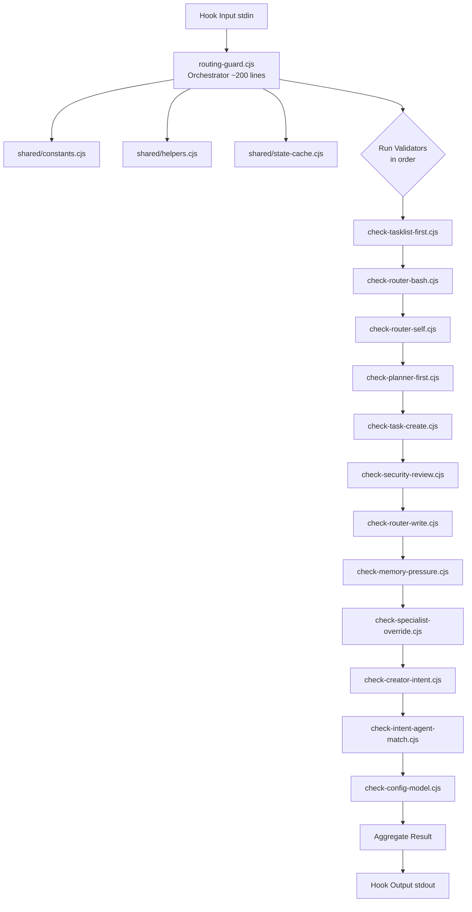
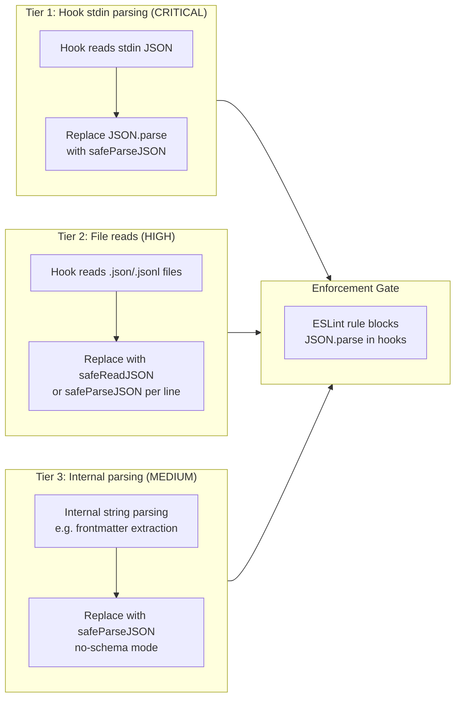
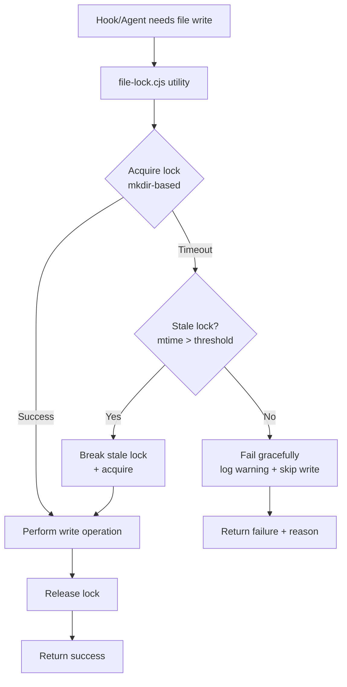
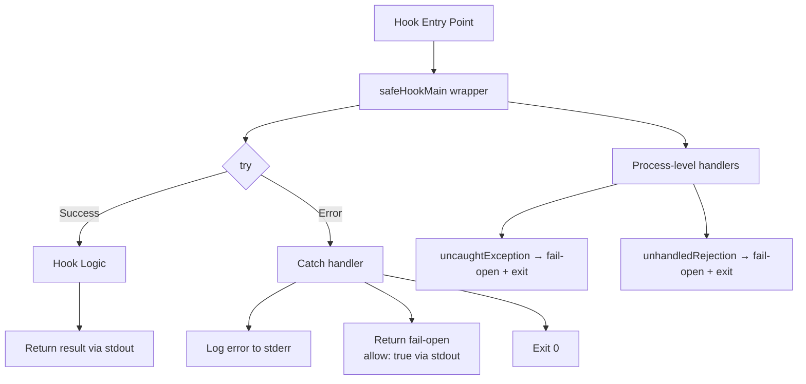
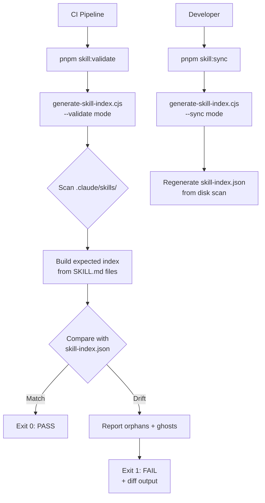
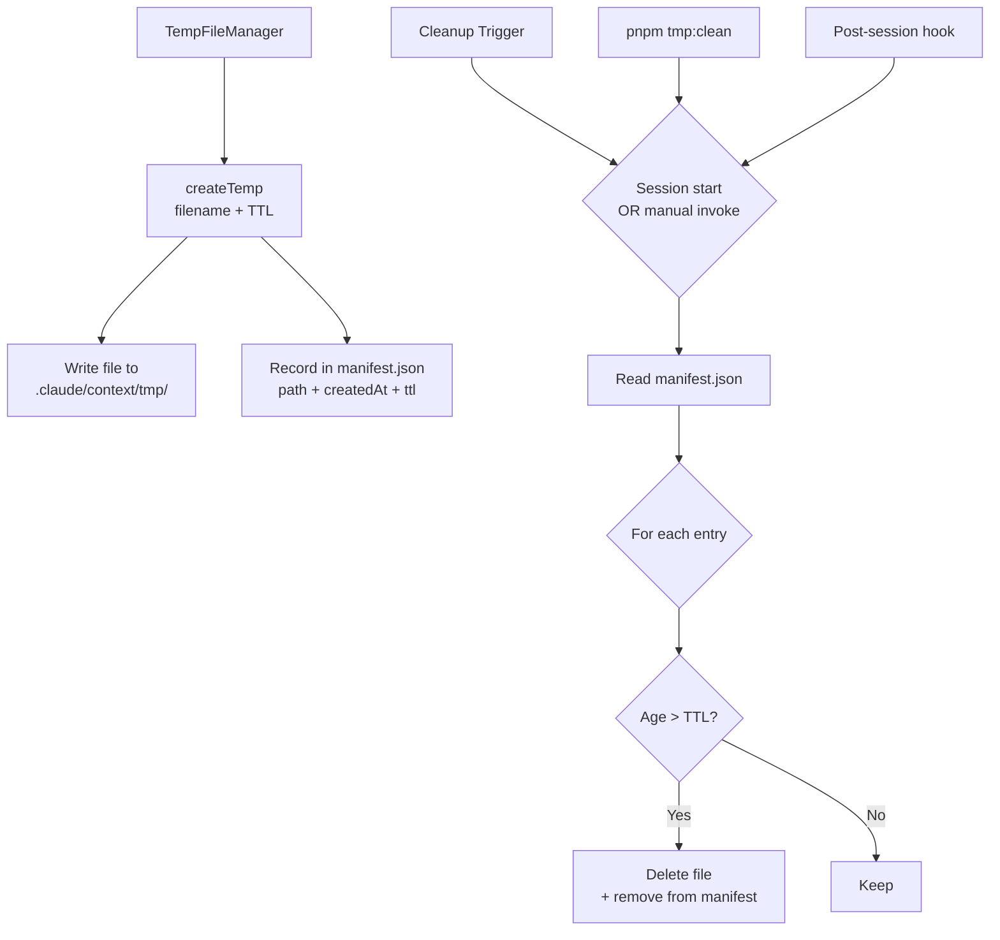
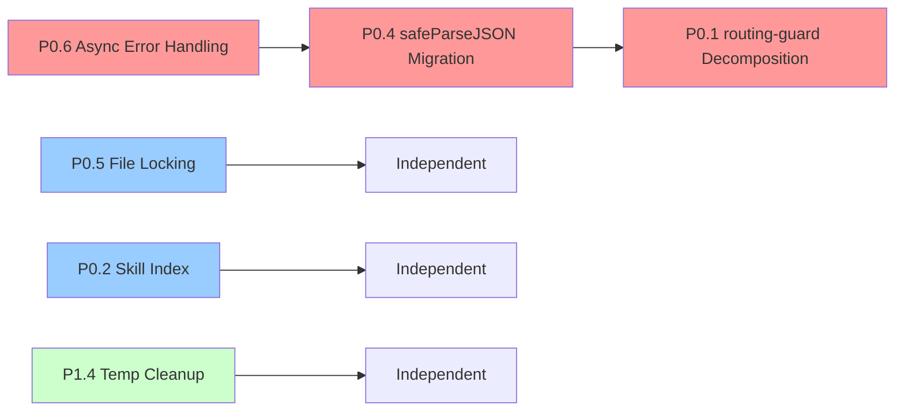

<!-- Agent: architect | Task: #6 | Session: 2026-02-14 -->

# Architecture Remediation Design Report

**Date:** 2026-02-14
**Author:** Architect Agent (Wave 3a)
**Status:** Complete
**Inputs:** Remediation Backlog, Pipeline Reflection (Wave 1), Architecture Review, Research Findings (Wave 2b)

---

## Table of Contents

1. [P0.1 routing-guard.cjs Decomposition](#p01-routing-guardcjs-decomposition)
2. [P0.4 safeParseJSON Migration](#p04-safeparsejson-migration)
3. [P0.5 File Locking Strategy](#p05-file-locking-strategy)
4. [P0.6 Async Error Handling Pattern](#p06-async-error-handling-pattern)
5. [P0.2 Skill Index Reconciliation](#p02-skill-index-reconciliation)
6. [P1.4 Temp File Cleanup](#p14-temp-file-cleanup)

---

## P0.1 routing-guard.cjs Decomposition

### Problem Statement

`routing-guard.cjs` is a 2595-line monolith containing 12 checks, ~340 lines of constants, ~80 lines of helpers, shared infrastructure (~350 lines), and main orchestration (~430 lines). This violates the Single Responsibility Principle and makes testing, debugging, and modification risky. The file has the highest cyclomatic complexity in the hook subsystem.

### Architecture: Chain-of-Responsibility Pattern

Each check becomes an independent validator module. A central orchestrator loads them in priority order and runs them sequentially, short-circuiting on the first block.



### File Structure

```
.claude/hooks/routing/
  routing-guard.cjs              # Orchestrator (slim ~200 lines)
  guards/
    index.cjs                    # Registry: exports ordered validator array
    check-tasklist-first.cjs     # Check 8  (~60 lines)
    check-router-bash.cjs        # Check 0  (~130 lines)
    check-router-self.cjs        # Check 1  (~95 lines)
    check-planner-first.cjs      # Check 2  (~45 lines)
    check-task-create.cjs        # Check 3  (~45 lines)
    check-security-review.cjs    # Check 4  (~40 lines)
    check-router-write.cjs       # Check 5  (~45 lines)
    check-memory-pressure.cjs    # Check 6  (~80 lines)
    check-specialist-override.cjs# Check 7  (~70 lines)
    check-creator-intent.cjs     # Check 9  (~90 lines)
    check-intent-agent-match.cjs # Check 10 (~175 lines)
    check-config-model.cjs       # Check 11 (~145 lines)
  shared/
    constants.cjs                # ALL_WATCHED_TOOLS, BLACKLISTED_TOOLS,
                                 # ROUTER_BASH_WHITELIST, WHITELISTED_TOOLS,
                                 # SPECIALIST_KEYWORD_MAP, INTENT_PATTERNS, etc.
    helpers.cjs                  # isAlwaysAllowedWrite, isPlannerSpawn,
                                 # isSecuritySpawn, extractTaskIdFromPrompt, etc.
    state-cache.cjs              # PERF-001 intra-hook state caching
    block-dedup.cjs              # Threshold + window deduplication logic
```

### Validator Interface Contract

Every validator module must export a single function conforming to this interface:

```javascript
/**
 * @typedef {Object} CheckContext
 *   Provided by the orchestrator to each validator.
 * @property {Object} toolInput    - The tool invocation parameters (parsed from stdin)
 * @property {string} toolName     - Name of the tool being invoked
 * @property {Object} stateCache   - Shared read-through cache (PERF-001)
 * @property {Object} env          - Process environment snapshot
 * @property {Function} isRouterInvocation - Detects if caller is router
 */

/**
 * @typedef {Object} CheckResult
 * @property {'allow'|'block'|'warn'} decision
 * @property {string} [message]     - Human-readable explanation
 * @property {string} checkName     - Identifier for logging (e.g. "check-planner-first")
 */

/**
 * @param {CheckContext} ctx
 * @returns {CheckResult}
 */
module.exports = function checkPlannerFirst(ctx) { /* ... */ };
```

### Orchestrator Logic (routing-guard.cjs slim)

```javascript
// Pseudocode for the new slim orchestrator
const validators = require('./guards/index.cjs');
const { buildStateCache } = require('./shared/state-cache.cjs');
const { shouldDedup } = require('./shared/block-dedup.cjs');

async function main() {
  const input = parseStdinJSON();
  const stateCache = buildStateCache();
  const ctx = { toolInput: input, toolName: input.tool_name, stateCache, env: process.env };

  const warnings = [];
  for (const validator of validators) {
    const result = validator(ctx);
    if (result.decision === 'block') {
      if (shouldDedup(result.checkName, result.message)) continue;
      return outputBlock(result.message);
    }
    if (result.decision === 'warn') {
      warnings.push(result);
    }
  }
  return outputAllow(warnings);
}
```

### Migration Steps

1. **Extract shared modules first** (`constants.cjs`, `helpers.cjs`, `state-cache.cjs`, `block-dedup.cjs`). These have zero behavioral change risk.
2. **Extract validators one at a time**, starting with the simplest (Check 5: router-write, ~43 lines). After each extraction:
   - Run existing routing-guard tests to verify no regression.
   - Add focused unit test for the extracted validator.
3. **Build the `guards/index.cjs` registry** that returns the ordered array. Execution order must match current: `[8, 0, 1, 2, 3, 4, 5, 6, 7, 9, 10, 11]`.
4. **Slim the orchestrator**: Replace inline check functions with `require('./guards/index.cjs')` loop. Keep `main()` stdin/stdout protocol, event bus integration, error handling, and churn/health logging.
5. **Update `settings.json`**: No change needed. The registered hook path remains `.claude/hooks/routing/routing-guard.cjs`. Only internals change.
6. **Update exports for test compatibility**: The current file exports 30+ functions. The new orchestrator re-exports from `guards/` and `shared/` modules so existing test imports continue to work (or update test imports to point at extracted modules).

### Backward Compatibility

- **settings.json**: Unchanged. Hook entry point remains `routing-guard.cjs`.
- **Test imports**: Provide a compatibility re-export layer in the slim orchestrator OR update test files (preferred; cleaner long-term).
- **Event bus / violation tracker**: Keep integration in orchestrator; pass references into validators via `ctx` if needed.
- **Delegation pattern**: Checks 2 and 4 delegate to `pre-task-unified` for Task tool. This behavior moves into the extracted validator modules unchanged.

### Risk Assessment

| Risk | Mitigation |
|------|-----------|
| Broken check ordering | `guards/index.cjs` defines explicit order array; integration test verifies |
| State cache not shared | Single `stateCache` object passed via `ctx` to all validators |
| Performance regression | Single file-read per invocation preserved; validators are sync |
| Test breakage | Re-export layer or batch test-import update |

### Estimated Effort

- Extraction of shared modules: 0.5 day
- Extraction of 12 validators: 2 days (incremental, one-at-a-time)
- Orchestrator slim-down: 0.5 day
- Test updates: 1 day
- **Total: 4 days** (aligns with backlog estimate of 5 days with buffer)

---

## P0.4 safeParseJSON Migration

### Problem Statement

68 occurrences of raw `JSON.parse()` across 36 hook files. Raw `JSON.parse` crashes on malformed input and is vulnerable to prototype pollution. The framework already has `safeParseJSON()` in `.claude/lib/utils/safe-json.cjs` with schema validation and pollution protection.

### Current State of safe-json.cjs

- Location: `.claude/lib/utils/safe-json.cjs` (312 lines)
- Exports: `safeParseJSON(content, schemaName)`, `safeReadJSON(filePath, schemaName)`
- 7 schemas defined: router-state, loop-state, evolution-state, settings-json, anomaly-entry, rollback-entry, anomaly-state, rerouter-state
- Prototype pollution prevention via `Object.create(null)` and key stripping

### Architecture: Tiered Migration



### Migration Categories

**Tier 1 (Critical, 36 files):** Hook stdin parsing - every hook reads `JSON.parse(stdin)` to get tool invocation data. This is the primary crash vector.

Priority files (by occurrence count):
- `user-prompt-unified.cjs` (7 occurrences)
- `spawn-prompt-assembler.cjs` (6 occurrences)
- `unified-creator-guard.cjs` (5 occurrences)
- `pre-completion-validation.cjs` (4 occurrences)
- `adaptive-quality-gate.cjs` (3 occurrences)
- `pre-task-unified.cjs` (3 occurrences)

**Tier 2 (High):** File reads - hooks that read JSON files from disk (e.g., workflow-state.json, router-state.json). Use `safeReadJSON()` for these.

**Tier 3 (Medium):** Internal string parsing - hooks that parse JSON strings from within larger text (e.g., extracting frontmatter, parsing inline JSON). Use `safeParseJSON(content)` without a schema.

### Schema Extensions Required

Add new schemas to `safe-json.cjs` for commonly parsed structures:

```javascript
const SCHEMAS = {
  // Existing 7 schemas...

  // New schemas for hook migration
  'hook-input': {
    tool_name: 'string',
    tool_input: 'object',
    // ... standard hook input fields
  },
  'spawn-log-entry': {
    task_id: 'string',
    agent_type: 'string',
    timestamp: 'string',
  },
  'workflow-state': {
    phase: 'string',
    complexity: 'string',
    tasks: 'array',
  },
  'integration-queue-entry': {
    artifactType: 'string',
    artifactPath: 'string',
    changeType: 'string',
  },
};
```

### Find-Replace Strategy

For each hook file:

1. Add import: `const { safeParseJSON, safeReadJSON } = require('../../lib/utils/safe-json.cjs');`
2. Replace `JSON.parse(data)` with `safeParseJSON(data, schemaName)` (or `safeParseJSON(data)` for no-schema).
3. Handle the return value: `safeParseJSON` returns `{ success, data, error }`.

**Before:**
```javascript
const input = JSON.parse(rawInput);
```

**After:**
```javascript
const { success, data: input, error } = safeParseJSON(rawInput, 'hook-input');
if (!success) {
  process.stderr.write(`[hook] JSON parse error: ${error}\n`);
  process.stdout.write(JSON.stringify({ allow: true }));
  process.exit(0); // fail-open for stdin parse errors
}
```

### ESLint Enforcement Rule

```javascript
// .eslintrc addition
{
  "rules": {
    "no-restricted-syntax": [
      "error",
      {
        "selector": "CallExpression[callee.object.name='JSON'][callee.property.name='parse']",
        "message": "Use safeParseJSON() from .claude/lib/utils/safe-json.cjs instead of JSON.parse(). See P0.4 remediation."
      }
    ]
  },
  // Scope to hook files only
  "overrides": [{
    "files": [".claude/hooks/**/*.cjs"],
    "rules": { /* above rule */ }
  }]
}
```

### Migration Steps

1. **Extend safe-json.cjs** with 4 new schemas (hook-input, spawn-log-entry, workflow-state, integration-queue-entry).
2. **Migrate Tier 1** (stdin parsing) across all 36 hook files. This is mechanical find-replace with error handling wrapper.
3. **Migrate Tier 2** (file reads) - replace `JSON.parse(fs.readFileSync(...))` with `safeReadJSON(filePath, schema)`.
4. **Migrate Tier 3** (internal parsing) - replace remaining `JSON.parse` with no-schema `safeParseJSON`.
5. **Add ESLint rule** to block future raw `JSON.parse` in hook files.
6. **Run full test suite** after each tier.

### Estimated Effort

- Schema extensions: 0.5 day
- Tier 1 migration (36 files): 1.5 days
- Tier 2 + Tier 3: 0.5 day
- ESLint rule: 0.25 day
- Testing: 0.25 day
- **Total: 3 days**

---

## P0.5 File Locking Strategy

### Problem Statement

Multiple hooks and agents write to shared JSONL/JSON files concurrently (observations.jsonl, workflow-state.json, integration-queue.jsonl, spawn-log.jsonl). Without locking, concurrent writes can corrupt data or lose entries. The reflection report flagged Synchronization as CRITICAL (4.0/10).

### Target Files

| File | Access Pattern | Contention Level |
|------|---------------|-----------------|
| `observations.jsonl` | Append-only, high frequency | HIGH |
| `spawn-log.jsonl` | Append-only, per-spawn | MEDIUM |
| `integration-queue.jsonl` | Append + read-and-clear | HIGH |
| `workflow-state.json` | Read-modify-write | MEDIUM |
| `router-state.json` | Read-modify-write | LOW |
| `spawn-assembly-cache.json` | Read-modify-write | LOW |

### Architecture: proper-lockfile with Graceful Degradation



### File Lock Utility Interface

```javascript
// .claude/lib/utils/file-lock.cjs

/**
 * @typedef {Object} LockOptions
 * @property {number} [timeout=3000]       - Max ms to wait for lock
 * @property {number} [staleThreshold=10000] - Lock file mtime age to consider stale
 * @property {number} [retryInterval=100]  - Ms between retry attempts
 * @property {boolean} [failOpen=true]     - If true, proceed without lock on timeout
 */

/**
 * Acquire a file lock using mkdir-based locking (atomic on all OS).
 * @param {string} filePath - Path to the file being locked
 * @param {LockOptions} [options]
 * @returns {{ acquired: boolean, release: Function, error?: string }}
 */
function acquireLock(filePath, options = {}) { /* ... */ }

/**
 * Convenience wrapper: lock, execute callback, release.
 * @param {string} filePath
 * @param {Function} callback - async or sync function to execute while locked
 * @param {LockOptions} [options]
 * @returns {{ success: boolean, result?: any, error?: string }}
 */
function withLock(filePath, callback, options = {}) { /* ... */ }
```

### Lock Mechanism: mkdir-based

- **Why mkdir**: `fs.mkdirSync(lockPath, { recursive: false })` is atomic on all platforms (Windows, Linux, macOS). If the directory already exists, it throws `EEXIST`.
- **Lock path**: `${filePath}.lock/` (directory adjacent to target file)
- **Stale detection**: Read `mtime` of lock directory. If older than `staleThreshold`, remove and re-acquire.
- **No external dependency**: `proper-lockfile` npm package is an option, but a 50-line mkdir implementation avoids adding a dependency for a simple use case.

### Per-File Lock Configuration

| File | Timeout | Stale Threshold | Fail Mode |
|------|---------|----------------|-----------|
| `observations.jsonl` | 2000ms | 5000ms | fail-open (skip write) |
| `spawn-log.jsonl` | 2000ms | 5000ms | fail-open (skip write) |
| `integration-queue.jsonl` | 3000ms | 10000ms | fail-open (log warning) |
| `workflow-state.json` | 5000ms | 15000ms | fail-closed (retry) |
| `router-state.json` | 3000ms | 10000ms | fail-open (use cached) |

### Usage Pattern (JSONL append)

```javascript
const { withLock } = require('../../lib/utils/file-lock.cjs');

// Append to observations.jsonl with lock
const entry = JSON.stringify({ type: 'observation', ts: Date.now(), data });
const { success, error } = withLock(
  observationsPath,
  () => fs.appendFileSync(observationsPath, entry + '\n'),
  { timeout: 2000, staleThreshold: 5000, failOpen: true }
);
if (!success) {
  process.stderr.write(`[hook] Lock failed for observations.jsonl: ${error}\n`);
}
```

### Usage Pattern (JSON read-modify-write)

```javascript
// Update workflow-state.json atomically
const { success } = withLock(
  workflowStatePath,
  () => {
    const current = safeReadJSON(workflowStatePath, 'workflow-state');
    current.data.phase = 'implement';
    fs.writeFileSync(workflowStatePath, JSON.stringify(current.data, null, 2));
  },
  { timeout: 5000, staleThreshold: 15000, failOpen: false }
);
```

### Migration Steps

1. **Implement `file-lock.cjs`** (~80 lines) in `.claude/lib/utils/`.
2. **Add locking to highest-contention files first**: `observations.jsonl` and `integration-queue.jsonl`.
3. **Add locking to remaining files**: `spawn-log.jsonl`, `workflow-state.json`, `router-state.json`.
4. **Add unit tests** for lock acquisition, stale detection, timeout, and concurrent access simulation.
5. **Monitor**: Add lock contention metrics to `post-tool-metrics-unified.cjs`.

### Estimated Effort

- file-lock.cjs implementation: 0.5 day
- Integration into 6 file access points: 1 day
- Testing: 0.5 day
- **Total: 2 days**

---

## P0.6 Async Error Handling Pattern

### Problem Statement

Hooks use async operations (file reads, event bus, metrics) but lack consistent error handling. An unhandled rejection in a hook can crash the entire hook process, potentially blocking the tool pipeline. The reflection report noted this as a systemic risk.

### Architecture: Standardized Error Wrapper



### Error Wrapper Interface

```javascript
// .claude/lib/utils/safe-hook-main.cjs

/**
 * @typedef {Object} HookMainOptions
 * @property {string} hookName            - Identifier for logging
 * @property {boolean} [failOpen=true]    - Return allow:true on error
 * @property {Function} [onError]         - Custom error callback
 * @property {number} [timeoutMs=5000]    - Max execution time before forced exit
 */

/**
 * Wraps a hook's main function with comprehensive error handling.
 * Sets up: try/catch, uncaughtException, unhandledRejection, timeout.
 *
 * @param {Function} hookFn - The hook's main logic (receives parsed input)
 * @param {HookMainOptions} options
 */
function safeHookMain(hookFn, options = {}) {
  const { hookName, failOpen = true, timeoutMs = 5000 } = options;

  // Process-level safety nets
  process.on('uncaughtException', (err) => {
    process.stderr.write(`[${hookName}] Uncaught: ${err.message}\n`);
    outputAndExit(failOpen);
  });
  process.on('unhandledRejection', (reason) => {
    process.stderr.write(`[${hookName}] Unhandled rejection: ${reason}\n`);
    outputAndExit(failOpen);
  });

  // Timeout safety
  const timer = setTimeout(() => {
    process.stderr.write(`[${hookName}] Timeout after ${timeoutMs}ms\n`);
    outputAndExit(failOpen);
  }, timeoutMs);

  // Main execution
  (async () => {
    try {
      const rawInput = readStdin();
      const { success, data: input } = safeParseJSON(rawInput, 'hook-input');
      if (!success) { outputAndExit(failOpen); return; }

      const result = await hookFn(input);
      clearTimeout(timer);
      process.stdout.write(JSON.stringify(result));
      process.exit(result.allow === false ? 2 : 0);
    } catch (err) {
      clearTimeout(timer);
      process.stderr.write(`[${hookName}] Error: ${err.message}\n`);
      if (options.onError) options.onError(err);
      outputAndExit(failOpen);
    }
  })();
}
```

### Hook Adoption Pattern

**Before (current pattern):**
```javascript
async function main() {
  let rawInput = '';
  process.stdin.on('data', (chunk) => { rawInput += chunk; });
  process.stdin.on('end', async () => {
    const input = JSON.parse(rawInput);  // crashes on bad input
    // ... hook logic with no error boundary ...
    process.stdout.write(JSON.stringify({ allow: true }));
  });
}
main();
```

**After (standardized):**
```javascript
const { safeHookMain } = require('../../lib/utils/safe-hook-main.cjs');

safeHookMain(async (input) => {
  // Hook logic only - no boilerplate
  // Errors are caught automatically
  // stdin parsing is handled
  return { allow: true };
}, { hookName: 'my-hook', failOpen: true, timeoutMs: 3000 });
```

### Migration Strategy

This migration pairs naturally with P0.4 (safeParseJSON migration). As each hook is updated for safeParseJSON, simultaneously wrap it with `safeHookMain`.

### Error Reporting Destination

- **stderr**: All hook errors go to stderr (standard hook protocol).
- **Structured logging**: Optional integration with Pino for JSON-formatted error logs.
- **Metrics**: Hook errors tracked by `post-tool-metrics-unified.cjs` (already exists).

### Migration Steps

1. **Implement `safe-hook-main.cjs`** (~60 lines) in `.claude/lib/utils/`.
2. **Pilot on 3 hooks**: Start with `routing-guard.cjs`, `unified-creator-guard.cjs`, `pre-tool-unified.cjs`.
3. **Roll out to remaining hooks** alongside P0.4 safeParseJSON migration.
4. **Add timeout monitoring** to post-tool metrics.

### Estimated Effort

- safe-hook-main.cjs implementation: 0.25 day
- Pilot (3 hooks): 0.5 day
- Full rollout (combined with P0.4): included in P0.4 estimate
- **Total: 0.75 day** (incremental on top of P0.4)

---

## P0.2 Skill Index Reconciliation

### Problem Statement

The skill index (`skill-index.json`) can drift from actual skill files on disk. There is no CI gate to detect when skills exist without index entries (orphans) or index entries point to deleted skills (ghosts). The architecture review found a 16% skill orphan rate.

### Architecture: CI Gate with Reconciliation Script



### Script Enhancement: generate-skill-index.cjs

Add two modes to the existing script:

```javascript
// .claude/tools/cli/generate-skill-index.cjs

/**
 * Modes:
 *   --generate  (default) Regenerate skill-index.json from disk
 *   --validate  Compare disk vs index, exit 1 on drift
 *   --sync      Alias for --generate (explicit name)
 *
 * Output (validate mode):
 *   { orphans: string[], ghosts: string[], driftCount: number }
 *   Exit code: 0 if no drift, 1 if drift detected
 */
```

### Drift Detection Logic

```javascript
function detectDrift(indexEntries, diskSkills) {
  const orphans = [];  // On disk but not in index
  const ghosts = [];   // In index but not on disk

  for (const skill of diskSkills) {
    if (!indexEntries.has(skill.name)) orphans.push(skill);
  }
  for (const [name, entry] of indexEntries) {
    if (!diskSkills.has(name)) ghosts.push({ name, path: entry.path });
  }

  return { orphans, ghosts, driftCount: orphans.length + ghosts.length };
}
```

### CI Integration

```yaml
# .github/workflows/validation.yml addition
skill-index-check:
  name: Skill Index Reconciliation
  runs-on: ubuntu-latest
  steps:
    - uses: actions/checkout@v4
    - uses: pnpm/action-setup@v2
    - run: pnpm install --frozen-lockfile
    - run: pnpm skill:validate
```

### Package.json Scripts

```json
{
  "scripts": {
    "skill:validate": "node .claude/tools/cli/generate-skill-index.cjs --validate",
    "skill:sync": "node .claude/tools/cli/generate-skill-index.cjs --sync"
  }
}
```

### Migration Steps

1. **Enhance `generate-skill-index.cjs`** with `--validate` and `--sync` modes.
2. **Add npm scripts** for convenient invocation.
3. **Add CI job** to `.github/workflows/validation.yml`.
4. **Run initial sync** to fix current 16% orphan rate.
5. **Document** in CLAUDE.md or developer workflow.

### Estimated Effort

- Script enhancement: 0.5 day
- CI integration: 0.25 day
- Initial sync + testing: 0.25 day
- **Total: 1 day**

---

## P1.4 Temp File Cleanup

### Problem Statement

56 temp files accumulate in `.claude/context/tmp/` with no automated cleanup. No TTL mechanism exists. Manual cleanup is unreliable and contributes to disk bloat and confusion.

### Architecture: TempFileManager with TTL



### TempFileManager Interface

```javascript
// .claude/lib/utils/temp-file-manager.cjs

const TMP_DIR = '.claude/context/tmp';
const MANIFEST = `${TMP_DIR}/.manifest.json`;

/**
 * @typedef {Object} TempOptions
 * @property {number} [ttlMs=86400000]  - Time-to-live in ms (default 24h)
 * @property {string} [category]        - Category for grouping (e.g. 'reports', 'cache')
 */

/**
 * Create a temporary file with TTL tracking.
 * @param {string} filename
 * @param {string|Buffer} content
 * @param {TempOptions} [options]
 * @returns {string} Full path to created file
 */
function createTemp(filename, content, options = {}) { /* ... */ }

/**
 * Clean up expired temp files.
 * @returns {{ deleted: string[], kept: string[], errors: string[] }}
 */
function cleanExpired() { /* ... */ }

/**
 * Force clean ALL temp files (manual wipe).
 * @returns {{ deleted: string[], errors: string[] }}
 */
function cleanAll() { /* ... */ }

/**
 * List all tracked temp files with their TTL status.
 * @returns {Array<{ path, createdAt, ttlMs, expired: boolean }>}
 */
function listTemp() { /* ... */ }
```

### Manifest Structure

```json
{
  "version": 1,
  "entries": [
    {
      "path": ".claude/context/tmp/spawn-debug-2026-02-14.json",
      "createdAt": "2026-02-14T10:30:00.000Z",
      "ttlMs": 86400000,
      "category": "debug"
    }
  ]
}
```

### TTL Defaults by Category

| Category | Default TTL | Rationale |
|----------|------------|-----------|
| `debug` | 4 hours | Short-lived diagnostic data |
| `cache` | 24 hours | Day-scoped caching |
| `reports` | 72 hours | Allow time for review |
| `session` | 8 hours | Single work session |
| `uncategorized` | 24 hours | Safe default |

### Cleanup Triggers

1. **Session start**: A pre-session hook or the first hook invocation per session calls `cleanExpired()`.
2. **Manual**: `pnpm tmp:clean` (cleans expired) or `pnpm tmp:clean:all` (wipes everything).
3. **CI**: Optional CI step to verify tmp directory is clean in committed state.

### Package.json Scripts

```json
{
  "scripts": {
    "tmp:clean": "node .claude/lib/utils/temp-file-manager.cjs --clean-expired",
    "tmp:clean:all": "node .claude/lib/utils/temp-file-manager.cjs --clean-all",
    "tmp:list": "node .claude/lib/utils/temp-file-manager.cjs --list"
  }
}
```

### Migration Steps

1. **Implement `temp-file-manager.cjs`** (~120 lines) in `.claude/lib/utils/`.
2. **Create `.manifest.json`** in tmp directory (gitignored).
3. **Retrofit existing temp file writers** to use `createTemp()` instead of direct `fs.writeFileSync`.
4. **Add cleanup trigger** to a pre-session hook or first-invocation guard.
5. **Add npm scripts** for manual cleanup.
6. **Clean up existing 56 files** with initial `cleanAll()`.

### Estimated Effort

- TempFileManager implementation: 0.5 day
- Retrofit existing writers: 0.5 day
- Hook integration + scripts: 0.25 day
- Initial cleanup: 0.25 day
- **Total: 1.5 days**

---

## Cross-Cutting Concerns

### Dependency Graph



**Critical path**: P0.6 -> P0.4 -> P0.1 (sequential, 7.75 days)
**Parallel work**: P0.5 (2 days), P0.2 (1 day), P1.4 (1.5 days) can run alongside critical path.

### Recommended Execution Order

| Sprint Day | Critical Path | Parallel Track |
|-----------|--------------|----------------|
| Day 1 | P0.6: Implement safe-hook-main.cjs | P0.5: Implement file-lock.cjs |
| Day 2 | P0.4: Extend schemas + begin Tier 1 | P0.5: Integrate locking + tests |
| Day 3 | P0.4: Complete Tier 1 migration | P0.2: Skill index reconciliation |
| Day 4 | P0.4: Tier 2+3 + ESLint rule | P1.4: TempFileManager + cleanup |
| Day 5 | P0.1: Extract shared modules | P1.4: Retrofit + hook integration |
| Day 6 | P0.1: Extract validators (batch 1) | Testing + integration |
| Day 7 | P0.1: Extract validators (batch 2) | Testing + integration |
| Day 8 | P0.1: Slim orchestrator + test updates | Final integration testing |

**Total: 8 working days** (with 2-track parallelism)

### Testing Strategy

- **Unit tests**: Each new utility (file-lock, safe-hook-main, temp-file-manager) gets isolated unit tests.
- **Integration tests**: routing-guard decomposition gets full integration tests verifying identical behavior.
- **Regression tests**: Run `pnpm test` after each extraction step.
- **CI gates**: Skill index validation added to CI pipeline.

### Rollback Strategy

All remediations are designed for incremental rollback:
- **P0.1**: Each validator extraction is independent. Revert one file to restore that check inline.
- **P0.4**: Each file's safeParseJSON migration is independent. Revert individual files.
- **P0.5**: File locking is additive. Remove `withLock()` wrappers to revert.
- **P0.6**: `safeHookMain` is a wrapper. Unwrap to restore original pattern.
- **P0.2**: CI gate is additive. Remove the job to revert.
- **P1.4**: TempFileManager is additive. Remove to revert to manual cleanup.

---

## Summary

| Remediation | Approach | New Files | Effort | Risk |
|------------|----------|-----------|--------|------|
| P0.1 routing-guard decomposition | Chain-of-responsibility, 12 validator modules + shared | 16 new files | 4 days | Medium (behavior parity) |
| P0.4 safeParseJSON migration | Tiered replacement + ESLint gate | 0 new (extend existing) | 3 days | Low (mechanical) |
| P0.5 File locking | mkdir-based locks, withLock wrapper | 1 new file | 2 days | Low (additive) |
| P0.6 Async error handling | safeHookMain wrapper | 1 new file | 0.75 days | Low (additive) |
| P0.2 Skill index reconciliation | CI gate + validate/sync modes | 0 new (extend existing) | 1 day | Low (additive) |
| P1.4 Temp file cleanup | TempFileManager + manifest + TTL | 1 new file | 1.5 days | Low (additive) |

**Total effort: ~12.25 days** (8 days with 2-track parallelism)
