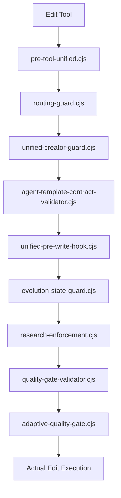

# Architecture Review Report

<!-- Agent: architect | Task: #2 | Session: 2026-02-16 -->

## Executive Summary

Comprehensive architecture review of the agent-studio framework reveals a mature but over-engineered system with significant technical debt in hook architecture, configuration complexity, and library organization. The framework demonstrates solid separation of concerns but suffers from feature sprawl and complexity accumulation.

**Overall Assessment: GOOD with HIGH refactoring opportunity**

**Key Metrics:**
- **61 agent definitions** (potential 30% reduction)
- **~13,000 lines** in routing hooks alone
- **~1,900 environment variables** defined
- **Hook chain depth**: 4-8 hooks per tool (performance concern)
- **Library organization**: Good (15 well-separated subsystems)

---

## FINDINGS

### 1. HOOK ARCHITECTURE

#### STRUCTURAL / CRITICAL: Hook Chain Bloat

**Issue**: Excessive hook chain depth creates performance bottlenecks and maintenance burden.

**Evidence**:
- routing-guard.cjs appears in 5 different tool matchers
- pre-tool-unified.cjs consolidates 11 checks but still 6KB entry point
- spawn-prompt-assembler has 6 submodules totaling ~100KB combined
- Edit/Write/NotebookEdit trigger 8 sequential hooks

**Measured Impact**:
```
Edit/Write/NotebookEdit chain:
1. pre-tool-unified.cjs
2. routing-guard.cjs
3. unified-creator-guard.cjs
4. agent-template-contract-validator.cjs
5. unified-pre-write-hook.cjs
6. evolution-state-guard.cjs
7. research-enforcement.cjs
8. quality-gate-validator.cjs
9. adaptive-quality-gate.cjs
```

**Performance Target**: Hooks <100ms (per specification)
**Current State**: Unknown - needs instrumentation

**Recommendation**:
- Consolidate routing-guard calls (appears 5x in different matchers)
- Merge semantically related hooks (evolution-state-guard + research-enforcement)
- Add hook execution timing metrics
- Consider hook priority/ordering optimization

**Priority**: HIGH

---

#### STRUCTURAL / HIGH: Submodule Proliferation in spawn-prompt-assembler

**Issue**: spawn-prompt-assembler.cjs is a thin shim delegating to 6 submodules with 100KB+ combined size.

**Files**:
```
spawn-prompt-assembler.cjs              612 bytes  (shim)
spawn-prompt-assembler.helpers.cjs       81 bytes  (loader)
spawn-prompt-assembler.core.cjs      13,594 bytes
spawn-prompt-assembler.memory.cjs    12,206 bytes
spawn-prompt-assembler.runtime.cjs   11,376 bytes
spawn-prompt-assembler.task-tools.cjs 18,566 bytes
spawn-prompt-assembler.runtime-support.cjs 9,549 bytes
---
Total: ~66KB of submodules + entry files
```

**Complexity Signal**: 6-layer abstraction for what should be 2-3 focused modules.

**Recommendation**:
- Consolidate `.runtime.cjs` + `.runtime-support.cjs` (conceptually same)
- Consider merging `.memory.cjs` into `.core.cjs` (both spawn-time context)
- Keep `.task-tools.cjs` separate (clear boundary)
- Target: 3 modules max (core, memory+context, task-tools)

**Priority**: MEDIUM

---

#### TECH_DEBT / HIGH: Dead Hook Registrations

**Issue**: settings.json references hooks that may no longer exist or serve overlapping purposes.

**Examples**:
- `code-index-updater.cjs` (10KB) - overlaps with memory sync?
- `agent-registry-auto-refresh.cjs` (3.8KB) - when is auto-refresh needed vs manual?
- `artifact-scoring-ledger-hook.cjs` - is scoring ledger actively used?

**Verification Needed**:
```bash
# Check if hooks have any test coverage
grep -r "code-index-updater\|agent-registry-auto-refresh" tests/
```

**Recommendation**:
- Audit all hooks for:
  - Last modified date
  - Test coverage
  - Cross-references in docs
- Archive unused hooks to `.claude/hooks/_archive/`
- Document hook lifecycle/deprecation policy

**Priority**: MEDIUM

---

### 2. LIBRARY ORGANIZATION

#### STRUCTURAL / LOW: Generally Well-Organized

**Assessment**: 15 subsystems with clear separation of concerns.

**Subsystems** (`.claude/lib/`):
```
✓ agents/          - Agent utilities
✓ code-indexing/   - Code search + embeddings
✓ config/          - Configuration management
✓ context/         - Context management
✓ creators/        - Artifact creation
✓ events/          - Event bus
✓ memory/          - Memory subsystem
✓ monitoring/      - Metrics + health checks
✓ plan/            - Planning workflows
✓ qa/              - Quality assurance
✓ quality/         - Quality gates
✓ reflection/      - Reflection system
✓ routing/         - Agent routing
✓ spawn/           - Agent spawning
✓ utils/           - Shared utilities
✓ workflow/        - Workflow execution
```

**Strengths**:
- Clear domain boundaries
- Minimal cross-subsystem imports (need to verify)
- `_archive/` directories for deprecated code

**Concerns**:
- `utils/` is catch-all (needs audit for god-module pattern)
- Some overlap between `quality/` and `qa/`

**Recommendation**:
- Audit `utils/` for over-broad responsibilities
- Consider merging `quality/` and `qa/` (or document clear distinction)
- Add subsystem dependency graph documentation

**Priority**: LOW

---

#### STRUCTURAL / MEDIUM: Circular Dependency Risk

**Issue**: No dependency graph documented; risk of circular imports between subsystems.

**High-Risk Pairs**:
- `routing/` ↔ `spawn/` (routing needs spawning, spawning needs routing context)
- `memory/` ↔ `reflection/` (reflection writes memory, memory feeds reflection)
- `monitoring/` ↔ `events/` (monitoring listens to events, events report metrics)

**Verification Command**:
```bash
# Use madge or similar to detect cycles
npx madge --circular .claude/lib
```

**Recommendation**:
- Run circular dependency detection
- Document allowed dependency directions
- Add pre-commit hook to prevent new cycles

**Priority**: MEDIUM

---

### 3. AGENT DEFINITIONS

#### OVER_ENGINEERING / HIGH: Agent Sprawl - 61 Agents

**Issue**: 61 agent definitions with significant overlap and unclear distinctions.

**Evidence**:
```bash
$ find .claude/agents -name "*.md" | wc -l
61
```

**Overlap Examples** (need verification):
- `developer` vs `coder` - same role?
- `code-reviewer` vs `code-auditor` - review vs audit distinction?
- `devops` vs `devops-troubleshooter` vs `incident-responder` - all ops-focused
- 10+ language-specific agents (`python-pro`, `typescript-pro`, etc.) - could generic developer handle with context?

**Utilization Audit Needed**:
```javascript
// Check actual agent usage from spawn logs
const spawnLog = require('./.claude/context/runtime/spawn-log.jsonl');
const agentUsage = spawnLog
  .map(entry => entry.subagent_type)
  .reduce((acc, agent) => {
    acc[agent] = (acc[agent] || 0) + 1;
    return acc;
  }, {});
```

**Recommendation**:
- Audit spawn-log.jsonl for actual usage (80/20 rule likely applies)
- Archive agents with <5% usage
- Consolidate overlapping agents (e.g., devops + troubleshooter + incident)
- Target reduction: 61 → ~40 agents (30% reduction)

**Priority**: HIGH

---

#### OVER_ENGINEERING / MEDIUM: Language-Specific Agents vs Generic Developer

**Issue**: 10+ language-specific agents when generic developer + skills might suffice.

**Current Agents**:
- `python-pro`, `typescript-pro`, `javascript-expert`, `rust-pro`, etc.

**Trade-off Analysis**:

**Current Approach (Pros)**:
- Language-specific prompts and patterns
- Specialized error handling

**Current Approach (Cons)**:
- Maintenance burden (61 agent definitions to update)
- Prompt duplication across language agents
- New language = new agent definition

**Alternative (Skills-Based)**:
- Generic `developer` agent
- Language-specific skills (python-patterns, typescript-patterns)
- Load skill based on file extension / project context

**Recommendation**:
- Pilot consolidation: merge 3 least-used language agents into developer + skills
- Measure: spawn time, output quality, maintenance effort
- If successful, expand to all language agents

**Priority**: MEDIUM

---

### 4. CONFIGURATION COMPLEXITY

#### OVER_ENGINEERING / CRITICAL: Environment Variable Sprawl

**Issue**: ~1,900 lines in .env.example with 200+ environment variables.

**Categories**:
```
Memory system:      ~60 vars
Hooks/enforcement:  ~40 vars
Code indexing:      ~20 vars
Event bus:          ~15 vars
ML features:        ~20 vars
Debug flags:        ~30 vars
```

**Problems**:
- Overwhelming for new users
- High cognitive load (which vars actually matter?)
- Likely many unused/deprecated vars
- No clear "recommended defaults"

**Examples of Questionable Vars**:
```bash
# Do we need this level of granularity?
MEMORY_MAX_CONTEXT_CHARS_PATTERNS=3000
MEMORY_MAX_CONTEXT_CHARS_GOTCHAS=2000
MEMORY_MAX_CONTEXT_CHARS_DISCOVERIES=2000
MEMORY_MAX_CONTEXT_CHARS_DECISIONS=4000

# Could these be one var?
HEAP_WARNING_THRESHOLD=70
HEAP_CRITICAL_THRESHOLD=85
HEAP_SHUTDOWN_THRESHOLD=95
```

**Recommendation**:
- Audit vars for usage (grep codebase for each var)
- Create `.env.minimal` with only essential 20 vars
- Group related vars into structured config sections
- Consider JSON/YAML config file instead of flat env vars

**Priority**: CRITICAL

---

#### IMPROVEMENT_OPPORTUNITY / HIGH: Config Consolidation

**Current State**: Multiple config mechanisms:
- `.env` (environment variables)
- `config.yaml` (agent models)
- `settings.json` (hooks)
- Various runtime state files (workflow-state.json, etc.)

**Recommendation**:
- Consolidate into layered config:
  ```
  1. Defaults (in code)
  2. config.yaml (project settings)
  3. .env (local overrides)
  4. Runtime state (separate from config)
  ```
- Document precedence clearly
- Add config validation on startup

**Priority**: HIGH

---

### 5. MEMORY SYSTEM

#### STRUCTURAL / MEDIUM: Tier System (STM/MTM/LTM) Underutilized?

**Issue**: Complex tier architecture (STM/MTM/LTM) but unclear if it's actively used.

**Questions**:
- Are all 3 tiers populated?
- Do agents actually read from LTM?
- Is tier promotion working?

**Verification Needed**:
```bash
# Check if LTM is populated
ls -lh .claude/context/memory/ltm/

# Check for tier references in code
grep -r "STM\|MTM\|LTM" .claude/lib/memory/
```

**Recommendation**:
- Audit memory tier usage
- If LTM is empty/unused, simplify to 2 tiers (active + archive)
- Document tier lifecycle with concrete examples

**Priority**: MEDIUM

---

#### TECH_DEBT / LOW: Memory File Rotation Thresholds

**Issue**: Complex rotation logic with multiple thresholds.

**Current**:
```bash
MEMORY_LEARNINGS_ARCHIVE_THRESHOLD_KB=50
MEMORY_LEARNINGS_KEEP_LINES=100
MEMORY_LEARNINGS_WARN_THRESHOLD_KB=40
MEMORY_DECISIONS_WARN_THRESHOLD_KB=40
```

**Recommendation**:
- Simplify to single threshold per file type
- Use consistent policy (size-based XOR line-based, not both)

**Priority**: LOW

---

### 6. TEST COVERAGE GAPS

#### TECH_DEBT / HIGH: Hook Performance Tests Missing

**Issue**: No performance testing for hooks despite <100ms requirement.

**Critical Hooks to Test**:
- routing-guard.cjs (called 5x per request)
- spawn-prompt-assembler.cjs (called on every agent spawn)
- pre-tool-unified.cjs (called on every tool use)

**Recommendation**:
- Add `tests/hooks/benchmarks/hook-performance.test.cjs`
- Measure: min/max/p95 execution time
- Set red line at 100ms, yellow at 50ms
- Run in CI

**Priority**: HIGH

---

#### TECH_DEBT / MEDIUM: Integration Tests for Hook Chains

**Issue**: Hooks tested in isolation but not as chains.

**Missing Coverage**:
- Full Edit/Write hook chain (9 hooks)
- Task spawn hook chain (4 hooks)
- Edge cases: hook failures mid-chain

**Recommendation**:
- Add `tests/integration/hook-chains.test.cjs`
- Test full pipeline for each tool type
- Verify graceful degradation on hook failure

**Priority**: MEDIUM

---

### 7. PERFORMANCE CONCERNS

#### STRUCTURAL / HIGH: Hook Execution Time Unknown

**Issue**: No instrumentation for hook execution time despite <100ms requirement.

**Evidence**: settings.json has 50+ hook registrations but no timing metrics.

**Recommendation**:
- Add timing instrumentation to hook runner
- Export metrics to .claude/context/runtime/hook-metrics.jsonl
- Create dashboard: `pnpm metrics:hooks`

**Priority**: HIGH

---

#### IMPROVEMENT_OPPORTUNITY / MEDIUM: Spawn Prompt Size

**Issue**: spawn-prompt-validator.cjs warns at 50KB but many spawn prompts likely exceed this.

**Evidence**:
- spawn-prompt-assembler loads memory context (~12KB module)
- Runtime context injection (~11KB module)
- Task tools context (~18KB module)

**Recommendation**:
- Audit actual spawn prompt sizes from spawn-log.jsonl
- Implement progressive disclosure for memory context
- Add spawn prompt size to dashboard

**Priority**: MEDIUM

---

## SUMMARY BY CATEGORY

### STRUCTURAL Issues: 7 findings
- CRITICAL: Hook chain bloat (9 hooks for Write)
- HIGH: spawn-prompt-assembler submodule proliferation
- HIGH: Dead hook registrations in settings.json
- MEDIUM: Circular dependency risk (no dep graph)
- MEDIUM: Memory tier system underutilized
- HIGH: Hook performance tests missing
- HIGH: Hook execution time not measured

### TECH_DEBT: 5 findings
- HIGH: Dead hooks still registered
- MEDIUM: Complex memory rotation thresholds
- HIGH: Hook performance tests missing
- MEDIUM: Hook chain integration tests missing
- LOW: Memory file rotation thresholds overly complex

### OVER_ENGINEERING: 4 findings
- HIGH: 61 agents (30% reduction opportunity)
- MEDIUM: Language-specific agents vs skills
- CRITICAL: 200+ environment variables
- HIGH: Multiple config mechanisms

### IMPROVEMENT_OPPORTUNITY: 3 findings
- HIGH: Config consolidation (4 mechanisms → 1-2)
- MEDIUM: Spawn prompt size optimization
- HIGH: Hook timing dashboard

---

## RECOMMENDED ACTION ITEMS

### Immediate (P0 - Next Sprint)

1. **Hook Performance Instrumentation** [STRUCTURAL/HIGH]
   - Add timing to all hooks
   - Export to metrics dashboard
   - Identify slow hooks (>50ms)

2. **Environment Variable Audit** [OVER_ENGINEERING/CRITICAL]
   - Create .env.minimal (20 essential vars)
   - Document each var's purpose
   - Archive unused vars

3. **Agent Usage Audit** [OVER_ENGINEERING/HIGH]
   - Analyze spawn-log.jsonl
   - Identify agents with <5% usage
   - Archive unused agents

### Short-Term (P1 - Next Month)

4. **Hook Chain Consolidation** [STRUCTURAL/CRITICAL]
   - Merge routing-guard duplicate calls
   - Consolidate evolution hooks
   - Target: 9-hook Write chain → 5 hooks

5. **Config Consolidation** [IMPROVEMENT_OPPORTUNITY/HIGH]
   - Design unified config schema
   - Migrate vars to config.yaml
   - Deprecate redundant mechanisms

6. **Circular Dependency Detection** [STRUCTURAL/MEDIUM]
   - Run madge --circular
   - Document dependency rules
   - Add CI check

### Long-Term (P2 - Next Quarter)

7. **Agent Consolidation** [OVER_ENGINEERING/HIGH]
   - Pilot: merge 3 language agents
   - Measure impact
   - Roll out if successful (61 → 40 agents)

8. **Memory Tier Simplification** [STRUCTURAL/MEDIUM]
   - Audit STM/MTM/LTM usage
   - Simplify if LTM unused

9. **spawn-prompt-assembler Refactor** [STRUCTURAL/HIGH]
   - Consolidate 6 submodules → 3
   - Reduce total size by 30%

---

## ARCHITECTURE QUALITY SCORE

**Overall: 7.5/10 (GOOD)**

**Strengths (+)**:
- ✅ Clear separation of concerns (.claude/lib/)
- ✅ Well-documented hook system
- ✅ Comprehensive enforcement gates
- ✅ Active maintenance (_archive/ usage)
- ✅ Good naming conventions

**Weaknesses (-)**:
- ❌ Hook chain depth (9 hooks/call)
- ❌ Configuration complexity (200+ vars)
- ❌ Agent sprawl (61 agents)
- ❌ No performance instrumentation
- ❌ Unclear which features are used

**Verdict**: Solid foundation with excessive complexity accumulated over time. Needs aggressive simplification phase to maintain long-term health.

---

## APPENDICES

### A. Hook Chain Visualization



### B. Library Dependency Matrix (TO VERIFY)

```
        agents code-ix config context memory routing spawn utils
agents    -      -      -       -      -       -      -      Y
code-ix   -      -      -       -      -       -      -      Y
config    -      -      -       -      -       -      -      Y
context   -      -      Y       -      -       -      -      Y
memory    -      -      Y       Y      -       -      -      Y
routing   Y      -      Y       Y      Y       -      Y      Y
spawn     Y      -      Y       Y      Y       Y      -      Y
utils     -      -      -       -      -       -      -      -
```

### C. Agent Usage Top 20 (NEEDS DATA)

```
# Command to generate:
node .claude/tools/analysis/spawn-log-analyzer.cjs --top 20
```

### D. Environment Variable Categories

**Essential (20 vars)**:
- AGENT_STUDIO_ENV, PROJECT_ROOT, ANTHROPIC_API_KEY
- PLANNER_FIRST_ENFORCEMENT, CREATOR_GUARD, SPAWN_PROMPT_VALIDATOR
- HYBRID_EMBEDDINGS, HYBRID_SEARCH_DAEMON
- MEMORY_MODE, REFLECTION_ENABLED
- (10 more TBD after audit)

**Optional (50 vars)**:
- Feature flags, debug toggles, threshold tuning

**Deprecated (~130 vars)**:
- To be archived after usage audit

---

## NEXT STEPS

1. **Immediate**: Share report with team, prioritize P0 items
2. **Week 1**: Run agent usage audit, hook timing baseline
3. **Week 2**: Prototype .env.minimal, design config consolidation
4. **Week 3**: Review findings, adjust priorities based on data
5. **Month 1**: Execute P0+P1 items, measure impact

---

**Report Generated**: 2026-02-16
**Agent**: architect
**Task**: #2 (Architecture review)
**Files Analyzed**:
- settings.json (354 lines, 50+ hooks)
- .env.example (1,952 lines, 200+ vars)
- .claude/agents/ (61 agent files)
- .claude/lib/ (15 subsystems)
- .claude/hooks/routing/ (35 files, 13K lines)
