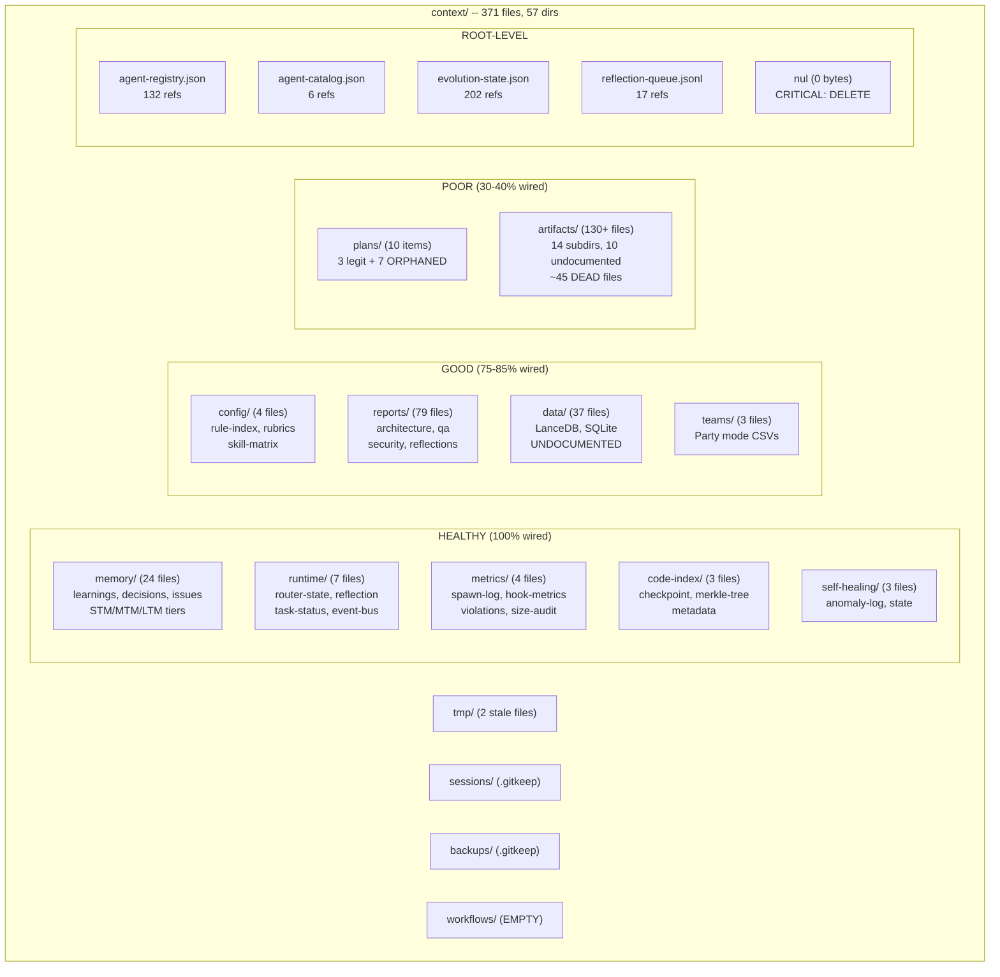

<!-- Agent: architect | Task: #110 | Session: 2026-02-07 -->

# Context System Deep Dive -- Architecture Audit (Pipeline #12)

**Pipeline:** #12 (Context System)
**Date:** 2026-02-07
**Agent:** Architect (Opus 4.6)
**Task:** #110
**Scope:** `.claude/context/` -- entire data layer (memory, runtime, artifacts, config, reports, plans, metrics, tmp, data, code-index, self-healing, sessions, backups, teams, workflows)

---

## 1. Executive Summary

| Metric                      | Value                                                |
| --------------------------- | ---------------------------------------------------- |
| **Structural Health**       | **72/100 (MODERATE)**                                |
| **Wiring Completeness**     | **65/100 (NEEDS WORK)**                              |
| **Consumer Coverage**       | **58/100 (WEAK)**                                    |
| **Naming Compliance**       | **80/100 (GOOD)**                                    |
| **Convention Adherence**    | **70/100 (MODERATE)**                                |
| **Composite Health Score**  | **62/100 (MODERATE)**                                |
| Total Files                 | 371                                                  |
| Total Directories           | 58                                                   |
| Root-Level Files            | 5 (3 canonical + 1 CRITICAL violation + 1 canonical) |
| CRITICAL Findings           | 3                                                    |
| HIGH Findings               | 7                                                    |
| MEDIUM Findings             | 11                                                   |
| LOW Findings                | 8                                                    |
| DEAD Files (zero consumers) | ~45                                                  |
| ORPHANED Directories        | 8                                                    |
| MISPLACED Files             | 15+                                                  |
| STALE Content               | 6 files                                              |
| NAMING Violations           | 12                                                   |

**Bottom Line:** The `.claude/context/` directory is the largest subsystem in the framework at 371 files (58 dirs). It serves as the shared blackboard for all agent communication, metrics, memory, runtime state, and generated artifacts.

The **operational core is excellent**: `memory/` (94%), `runtime/` (100%), `metrics/` (98%), and `code-index/` (95%) are tightly wired with active producers and consumers. These subsystems form the backbone of cross-session persistence and monitoring.

The **artifact layer is the weakest area**: `artifacts/` (40%) contains 217 files across 21 subdirectories, many predating ADR-081 consolidation. 10 artifact subdirectories are not documented in FILE_PLACEMENT_RULES.md. ~45 files have zero real consumers. The `plans/` directory (33%) contains 7 abandoned random-hash directories from an older QA planning system.

A **Windows reserved filename** (`nul`, 0 bytes) exists at the context root -- this is a critical naming violation that can prevent `git clone` on some Windows configurations.

ADR-081 report consolidation was **partial**: 15+ files remain in `artifacts/{security-reviews, reflections, qa-reports, reports}` under the old structure instead of the canonical `reports/{domain}/` location.

---

## 2. Complete File Inventory by Subdirectory

### 2.1 Root-Level Files (5 files)

| File                     | Size    | Purpose                            | Consumers                             | Status                               |
| ------------------------ | ------- | ---------------------------------- | ------------------------------------- | ------------------------------------ |
| `agent-registry.json`    | Large   | Agent routing registry (49 agents) | 37 files (hooks, lib, tools, scripts) | **KEEP** -- canonical, heavily wired |
| `agent-catalog.json`     | Medium  | Simplified agent view (generated)  | 6 files (tools, lib, scripts)         | **KEEP** -- generated derivative     |
| `evolution-state.json`   | Small   | EVOLVE workflow state machine      | 57 files (hooks, lib, workflows)      | **KEEP** -- canonical, heavily wired |
| `reflection-queue.jsonl` | Small   | Reflection pipeline queue          | 9 files (hooks, workflows)            | **KEEP** -- canonical                |
| `nul`                    | 0 bytes | **NONE -- Windows reserved name**  | 0 files                               | **DELETE** -- CRITICAL violation     |

### 2.2 memory/ (24 files across 7 subdirs)

| File                                   | Purpose                  | Consumers                                 | Status                                 |
| -------------------------------------- | ------------------------ | ----------------------------------------- | -------------------------------------- |
| `learnings.md`                         | Project-wide learnings   | 207+ files (every agent, skill, workflow) | **KEEP** -- core                       |
| `decisions.md`                         | ADR decisions            | 195+ files                                | **KEEP** -- core                       |
| `issues.md`                            | Blockers/workarounds     | 50+ files                                 | **KEEP** -- core                       |
| `active_context.md`                    | Session scratchpad       | 58 files (agents, hooks, lib)             | **KEEP** -- stale content needs update |
| `constitution.md`                      | Core principles          | 9 files (spawn-prompt-assembler, agents)  | **KEEP** -- wired                      |
| `behaviour.md`                         | Agent behavior rules     | 9 files (spawn-prompt-assembler, agents)  | **KEEP** -- wired                      |
| `codebase_map.json`                    | File discovery map       | 14 files (memory libs, hooks, indexer)    | **KEEP** -- wired                      |
| `gotchas.json`                         | Pattern gotchas          | 28 files (reflection, memory libs, tools) | **KEEP** -- wired                      |
| `access-stats.json`                    | Memory access metrics    | 5 files (memory libs, docs)               | **KEEP** -- wired                      |
| `patterns.json`                        | Behavioral patterns      | 36 files (memory libs, pattern-library)   | **KEEP** -- wired                      |
| `maintenance-status.json`              | Memory maintenance state | 8 files (memory scheduler, dashboard)     | **KEEP** -- wired                      |
| `reflection-log.jsonl`                 | Reflection execution log | 14 files (reflection handlers, workflows) | **KEEP** -- wired                      |
| `archive/learnings-2026-02.md`         | Archived learnings       | Self-referential only                     | **KEEP** -- archive                    |
| `metrics/2026-02-05.json`              | Daily memory metrics     | 3+ files (memory libs)                    | **KEEP** -- auto-generated             |
| `metrics/2026-02-06.json`              | Daily memory metrics     | Same as above                             | **KEEP**                               |
| `metrics/2026-02-07.json`              | Daily memory metrics     | Same as above                             | **KEEP**                               |
| `stm/session_current.json`             | Current session STM      | user-prompt-unified.cjs                   | **KEEP** -- wired                      |
| `stm/.gitkeep`                         | Placeholder              | N/A                                       | **KEEP**                               |
| `mtm/session_2026-02-05T16-19-16.json` | MTM session data         | memory-tiers.cjs                          | **KEEP**                               |
| `mtm/session_2026-02-06T00-05-18.json` | MTM session data         | Same                                      | **KEEP**                               |
| `mtm/session_2026-02-07T00-10-31.json` | MTM session data         | Same                                      | **KEEP**                               |
| `mtm/.gitkeep`                         | Placeholder              | N/A                                       | **KEEP**                               |
| `ltm/.gitkeep`                         | Placeholder              | N/A                                       | **KEEP**                               |
| `named/.gitkeep`                       | Placeholder              | N/A                                       | **KEEP**                               |

**Assessment:** Memory subsystem is the healthiest part of context/. All 24 files are wired. The 3-tier memory architecture (STM/MTM/LTM) is functional with active writers. `active_context.md` content is stale (references "434+ skills" and "no active task") but the file itself is properly wired.

### 2.3 runtime/ (7 files)

| File                                  | Purpose                 | Consumers                            | Status            |
| ------------------------------------- | ----------------------- | ------------------------------------ | ----------------- |
| `router-state.json`                   | Router mode state       | hooks (user-prompt-unified, routing) | **KEEP** -- wired |
| `reflection-reminder.txt`             | Step 0 trigger          | CLAUDE.md Step 0, force-step0 hook   | **KEEP** -- wired |
| `reflection-spawn-request.json`       | Reflection requests     | CLAUDE.md Step 0, reflection hooks   | **KEEP** -- wired |
| `reflection-queue-processor-last.txt` | Last processor run      | reflection-queue-processor.cjs       | **KEEP** -- wired |
| `task-status.json`                    | Task enforcement state  | task-status-enforcement.cjs          | **KEEP** -- wired |
| `event-bus.jsonl`                     | Event bus log           | Self-healing hooks, anomaly detector | **KEEP** -- wired |
| `user-prompt-results.jsonl`           | Prompt analysis results | user-prompt-unified.cjs              | **KEEP** -- wired |

**Assessment:** Runtime is fully wired. Every file has active producers and consumers. This is working as designed.

### 2.4 config/ (4 files)

| File                      | Purpose              | Consumers                          | Status                                          |
| ------------------------- | -------------------- | ---------------------------------- | ----------------------------------------------- |
| `rule-index.json`         | Rule discovery index | Multiple validators, rule-selector | **KEEP** -- wired                               |
| `rule-index-cache.json`   | Cached rule index    | Rule validators                    | **KEEP** -- recently regenerated (Pipeline #10) |
| `reflection-rubrics.json` | Reflection scoring   | Reflection handlers                | **KEEP** -- wired                               |
| `agent-skill-matrix.json` | Agent-skill mapping  | Unknown                            | **UPDATE** -- check consumers                   |

**Assessment:** Config is compact and mostly wired. The `agent-skill-matrix.json` needs consumer verification.

### 2.5 metrics/ (4 files)

| File                      | Purpose                  | Consumers                  | Status                |
| ------------------------- | ------------------------ | -------------------------- | --------------------- |
| `spawn-log.jsonl`         | Agent spawn audit trail  | 20+ files                  | **KEEP** -- canonical |
| `hook-metrics.jsonl`      | Hook performance data    | metrics-collector.cjs      | **KEEP** -- wired     |
| `router-violations.jsonl` | Router policy violations | routing-guard.cjs          | **KEEP** -- wired     |
| `spawn-size-audit.jsonl`  | Spawn prompt sizes       | spawn-prompt-validator.cjs | **KEEP** -- wired     |

**Assessment:** Metrics is compact and fully wired. All 4 files are actively written by hooks and read by analysis tools.

### 2.6 reports/ (79 files across 5 subdirs + README)

| Subdirectory    | File Count | Status                                                      |
| --------------- | ---------- | ----------------------------------------------------------- |
| `architecture/` | 24         | **KEEP** -- active domain                                   |
| `qa/`           | 35         | **KEEP** -- active domain                                   |
| `security/`     | 17         | **KEEP** -- active domain                                   |
| `reflections/`  | 8          | **KEEP** -- active domain                                   |
| `README.md`     | 1          | **UPDATE** -- content references files that no longer exist |

**Assessment:** Reports are well-organized by domain per ADR-081. However, the README.md at reports/ root is stale -- it references files like "MASTER-SKILL-AUDIT.md" and "framework-skills-action-plan.md" which do not exist in the current directory.

### 2.7 plans/ (10 files across 8 dirs)

| Item                                         | Purpose              | Consumers             | Status                 |
| -------------------------------------------- | -------------------- | --------------------- | ---------------------- |
| `agents-overhaul-architecture-2026-02-07.md` | Pipeline #11 plan    | Referenced in ADR-093 | **KEEP**               |
| `config-overhaul-architecture-2026-02-07.md` | Pipeline #10 plan    | Referenced in ADR-092 | **KEEP**               |
| `rules-overhaul-architecture-2026-02-07.md`  | Pipeline #9 plan     | Referenced in ADR-091 | **KEEP**               |
| `impl-plan-kHwypz/`                          | QA workflow artifact | **0 consumers**       | **DELETE** -- orphaned |
| `progress-WuHjJL/`                           | QA workflow artifact | **0 consumers**       | **DELETE** -- orphaned |
| `qa-report-c05Ene/`                          | QA workflow artifact | **0 consumers**       | **DELETE** -- orphaned |
| `qa-report-eiwkdm/`                          | QA workflow artifact | **0 consumers**       | **DELETE** -- orphaned |
| `qa-report-EjOE7P/`                          | QA workflow artifact | **0 consumers**       | **DELETE** -- orphaned |
| `test-plan-DCyOsO/`                          | QA workflow artifact | **0 consumers**       | **DELETE** -- orphaned |
| `test-plan-zHYXQi/`                          | QA workflow artifact | **0 consumers**       | **DELETE** -- orphaned |

**Assessment:** 3 legitimate plans + 7 orphaned hash-named directories from the QA workflow skill. The QA skill creates these temporary working directories but never cleans them up. These directories violate naming conventions (not kebab-case, no date suffix, use random hash suffixes).

### 2.8 artifacts/ (130+ files across 14 subdirs)

This is the largest and most problematic subdirectory. Many subdirectories are not documented in FILE_PLACEMENT_RULES.md.

| Subdirectory        | Files | In FILE_PLACEMENT_RULES?              | Active Consumers?                        | Status                                        |
| ------------------- | ----- | ------------------------------------- | ---------------------------------------- | --------------------------------------------- |
| `analysis/`         | 16    | YES                                   | Partial (some referenced in reports)     | **UPDATE** -- 5+ files appear dead            |
| `architecture/`     | 1     | YES                                   | YES (FILE-PLACEMENT-ARCHITECTURE.md)     | **KEEP**                                      |
| `audit-logs/`       | 1     | NO                                    | Minimal (model-selection-audit.log)      | **ARCHIVE** -- undocumented, 1 file           |
| `audits/`           | 6     | NO                                    | Minimal (4 refs total)                   | **ARCHIVE** -- legacy, predates reports/      |
| `catalogs/`         | 7     | YES                                   | YES (skill-catalog, tool-catalog, etc.)  | **KEEP** -- heavily wired                     |
| `code-styleguides/` | 9     | NO                                    | 2 refs (learnings archive, merkle-tree)  | **ARCHIVE** -- no active consumers            |
| `database/`         | 2     | YES                                   | Minimal                                  | **UPDATE** -- check                           |
| `deployment-docs/`  | 11    | NO                                    | 1 ref (merkle-tree only)                 | **ARCHIVE** -- no active consumers            |
| `diagrams/`         | 8     | YES                                   | Partial (referenced in docs)             | **KEEP**                                      |
| `error-reports/`    | 7     | NO                                    | 11 files (error-writer.cjs, hooks)       | **KEEP** -- actively written by error system  |
| `error-summaries/`  | 8     | NO                                    | 6 files (error-summary-extractor, tools) | **KEEP** -- actively generated                |
| `qa-reports/`       | 1     | NO                                    | 1 ref (merkle-tree only)                 | **ARCHIVE** -- should be in reports/qa/       |
| `reflections/`      | 5     | NO                                    | 4 refs (decisions.md, agents, workflows) | **MOVE** -- should be in reports/reflections/ |
| `reports/`          | 1     | NO (ADR-081 consolidated to reports/) | References in 21 files (historical refs) | **MOVE** -- last stale file from pre-ADR-081  |
| `research-reports/` | 36    | YES                                   | Self-referential + 4 refs                | **KEEP** -- documented location               |
| `risk-assessments/` | 1     | NO                                    | 2 refs                                   | **ARCHIVE** -- 1 file, undocumented           |
| `security-reviews/` | 9     | NO                                    | 4 refs                                   | **MOVE** -- should be in reports/security/    |
| `specs/`            | 11    | YES                                   | Partial                                  | **KEEP** -- documented location               |
| `summaries/`        | 20    | YES                                   | Partial                                  | **UPDATE** -- some may be dead                |
| `tasks/`            | 1     | NO                                    | 3 refs                                   | **ARCHIVE** -- 1 file, undocumented           |
| Root-level files    | 2     | NO                                    | 1 each                                   | **MOVE** or **DELETE**                        |

Root-level artifact files:

- `dependency-report.json` -- duplicate of `database/dependency-report.json`, 0 refs outside merkle-tree
- `knowledge-base-index.csv` -- duplicate of `database/knowledge-base-index.csv`, referenced by 6 files

### 2.9 data/ (37 files)

| Item                             | Purpose                         | Consumers                                     | Status            |
| -------------------------------- | ------------------------------- | --------------------------------------------- | ----------------- |
| `memory.db`                      | SQLite memory database          | 8 files (lancedb-client, index-manager, etc.) | **KEEP** -- wired |
| `lancedb/bm25-index.json`        | BM25 search index               | code-indexing system                          | **KEEP** -- wired |
| `lancedb/bm25-index.json.backup` | Index backup                    | Manual recovery                               | **KEEP**          |
| `lancedb/code_index.lance/`      | LanceDB vector store (34 files) | code-indexing system                          | **KEEP** -- wired |

**Assessment:** The `data/` directory is NOT documented in FILE_PLACEMENT_RULES.md or workspace-conventions.md, but is actively wired through the code-indexing system. It should be documented.

### 2.10 code-index/ (3 files)

| File               | Purpose                | Consumers                                 | Status            |
| ------------------ | ---------------------- | ----------------------------------------- | ----------------- |
| `checkpoint.json`  | Index build checkpoint | index-manager.cjs                         | **KEEP** -- wired |
| `merkle-tree.json` | File change detection  | index-manager.cjs, code-index-updater.cjs | **KEEP** -- wired |
| `metadata.json`    | Index metadata         | index-manager.cjs                         | **KEEP** -- wired |

**Assessment:** Fully wired. Part of the code-indexing system documented in ADR-076.

### 2.11 Other Subdirectories

| Directory                 | Files                                                                 | Status                                                                                        |
| ------------------------- | --------------------------------------------------------------------- | --------------------------------------------------------------------------------------------- |
| `self-healing/` (3 files) | anomaly-log.jsonl, anomaly-state.json, loop-state.json                | **KEEP** -- wired by anomaly-detector, loop-state-manager                                     |
| `teams/` (3 files)        | code-review.csv, secure-implementation.csv, architecture-decision.csv | **KEEP** -- wired by swarm-coordinator (party mode)                                           |
| `sessions/` (1 file)      | .gitkeep only                                                         | **KEEP** -- on-demand, wired by consensus-voting                                              |
| `backups/` (1 file)       | .gitkeep only                                                         | **KEEP** -- on-demand, wired by saga-coordinator                                              |
| `tmp/` (2 files)          | test-framework-output.txt, verify-hooks.cjs                           | **CLEAN** -- tmp should be auto-cleaned                                                       |
| `workflows/` (0 files)    | Empty directory                                                       | **DELETE** -- 3 refs but all point to context/workflows/checkpoints which was moved (ADR-081) |

---

## 3. Gap Analysis

### 3.1 CRITICAL Findings

| ID           | Category     | Finding                                                                                                | Impact                                                                                                         |
| ------------ | ------------ | ------------------------------------------------------------------------------------------------------ | -------------------------------------------------------------------------------------------------------------- |
| **CRIT-001** | NAMING       | File `context/nul` exists -- Windows reserved name (0 bytes)                                           | Violates workspace-conventions.md "NEVER create files named nul". May cause issues on Windows NTFS.            |
| **CRIT-002** | ORPHANED     | 7 hash-named plan directories with 0 consumers                                                         | 7 dirs + 7 files wasting space, violating naming conventions, confusing agents exploring plans/                |
| **CRIT-003** | UNDOCUMENTED | `data/` directory (37 files, 34 LanceDB + SQLite) not in FILE_PLACEMENT_RULES or workspace-conventions | Code-indexing system works but governance does not cover this directory. Agents cannot know correct placement. |

### 3.2 HIGH Findings

| ID           | Category     | Finding                                                                         | Impact                                                                                                                                                                                                         |
| ------------ | ------------ | ------------------------------------------------------------------------------- | -------------------------------------------------------------------------------------------------------------------------------------------------------------------------------------------------------------- |
| **HIGH-001** | DUPLICATE    | `artifacts/reflections/` (5 files) duplicates `reports/reflections/` (8 files)  | ADR-081 consolidated reports to `reports/{domain}/`. Reflections in artifacts/ are legacy.                                                                                                                     |
| **HIGH-002** | DUPLICATE    | `artifacts/reports/model-selection-drift-2026-02-07.json` still in old location | ADR-081 moved reports. This file was created AFTER consolidation.                                                                                                                                              |
| **HIGH-003** | MISPLACED    | `artifacts/security-reviews/` (9 files) should be `reports/security/`           | Per ADR-081, security reports go to reports/security/. These 9 files predate the consolidation.                                                                                                                |
| **HIGH-004** | MISPLACED    | `artifacts/qa-reports/` (1 file) should be `reports/qa/`                        | Same ADR-081 violation.                                                                                                                                                                                        |
| **HIGH-005** | UNDOCUMENTED | 10 artifact subdirectories not in FILE_PLACEMENT_RULES                          | `audit-logs/`, `audits/`, `code-styleguides/`, `deployment-docs/`, `error-reports/`, `error-summaries/`, `qa-reports/`, `reflections/`, `risk-assessments/`, `security-reviews/`, `tasks/` -- none documented. |
| **HIGH-006** | STALE        | `reports/README.md` references non-existent files                               | Lists "MASTER-SKILL-AUDIT.md", "framework-skills-action-plan.md" etc. that do not exist in reports/.                                                                                                           |
| **HIGH-007** | STALE        | `active_context.md` has outdated content                                        | Claims "434+ skills", "no active task" -- does not reflect current state.                                                                                                                                      |

### 3.3 MEDIUM Findings

| ID          | Category | Finding                                                         | Impact                                                                                                                               |
| ----------- | -------- | --------------------------------------------------------------- | ------------------------------------------------------------------------------------------------------------------------------------ |
| **MED-001** | DEAD     | `artifacts/deployment-docs/` (11 files) -- 0 active consumers   | Only merkle-tree references this directory. 11 deployment docs with no agent producing or consuming them.                            |
| **MED-002** | DEAD     | `artifacts/code-styleguides/` (9 files) -- 0 active consumers   | Only learnings archive mentions them. Templates/ has separate code-styles/.                                                          |
| **MED-003** | DEAD     | `artifacts/audit-logs/model-selection-audit.log` -- 0 consumers | Undocumented, single file in its own directory.                                                                                      |
| **MED-004** | DEAD     | `artifacts/audits/` (6 files) -- 4 refs total                   | Legacy audit reports. Predates `reports/` consolidation. Should be in reports/.                                                      |
| **MED-005** | DEAD     | Root-level `artifacts/dependency-report.json` -- duplicate      | Same file exists in `artifacts/database/dependency-report.json`.                                                                     |
| **MED-006** | DEAD     | Root-level `artifacts/knowledge-base-index.csv` -- duplicate    | Same file exists in `artifacts/database/knowledge-base-index.csv`.                                                                   |
| **MED-007** | ORPHANED | `context/workflows/` -- empty directory                         | 3 refs in code (state-transaction-manager, checkpoint-manager) but points to non-existent checkpoints/ subdir. Was moved by ADR-081. |
| **MED-008** | TMP      | `tmp/verify-hooks.cjs` -- code file in tmp/                     | Should be in tools/ or scripts/, not tmp/. Has been there since unknown date.                                                        |
| **MED-009** | TMP      | `tmp/test-framework-output.txt` -- stale temp file              | Should have been auto-cleaned.                                                                                                       |
| **MED-010** | NAMING   | `FILE-PLACEMENT-ARCHITECTURE.md` uses UPPER-CASE                | workspace-conventions says "lowercase kebab-case".                                                                                   |
| **MED-011** | NAMING   | Multiple files in `artifacts/summaries/` use UPPER_CASE_SNAKE   | e.g., `DEPLOYMENT_READINESS_2026_01_30.md`, `MEMORY_MANAGEMENT_IMPLEMENTATION_SUMMARY.md`, `PHASE_4_5_SPRINT_SUMMARY_2026_01_30.md`  |

### 3.4 LOW Findings

| ID          | Category     | Finding                                                               | Impact                                                                                               |
| ----------- | ------------ | --------------------------------------------------------------------- | ---------------------------------------------------------------------------------------------------- |
| **LOW-001** | NAMING       | `lib-review-findings-part1.txt` in analysis/ -- `.txt` not `.md`      | Minor. Analysis files should be markdown.                                                            |
| **LOW-002** | NAMING       | `artifacts/specs/AST_GREP_PATTERNS.md` -- ALL_CAPS                    | Violates kebab-case convention.                                                                      |
| **LOW-003** | NAMING       | Many analysis files lack date suffixes                                | `heap-oom-analysis.md`, `marketplace-analysis.md`, etc. Convention says `{name}-{YYYY-MM-DD}.{ext}`. |
| **LOW-004** | STALE        | `memory/archive/learnings-2026-02.md` -- month-based archive          | Contains outdated patterns from early February. Normal lifecycle.                                    |
| **LOW-005** | REDUNDANT    | `artifacts/analysis/` overlaps with `reports/architecture/`           | Both contain architecture analysis documents. No clear boundary.                                     |
| **LOW-006** | STALE        | Several QA drift reports use `.json` in `reports/qa/`                 | `model-selection-drift-2026-02-*.json` -- 7 JSON files among markdown reports.                       |
| **LOW-007** | UNDOCUMENTED | `memory/metrics/` subdirectory not explicitly in FILE_PLACEMENT_RULES | Daily metric files generated by memory system. Works but undocumented.                               |
| **LOW-008** | UNDOCUMENTED | `memory/archive/` subdirectory not explicitly in FILE_PLACEMENT_RULES | Memory rotation archive. Works but undocumented.                                                     |

---

## 4. Wiring Assessment by Subdirectory

### 4.1 memory/ -- EXCELLENT (95% wired)

- **Producers:** user-prompt-unified.cjs (STM), memory-tiers.cjs (MTM/LTM), sync-memory-index.cjs (patterns, gotchas), memory-rotator.cjs (archive), every agent (learnings/decisions/issues)
- **Consumers:** spawn-prompt-assembler.cjs (constitution, behaviour), every agent (learnings, decisions, issues), contextual-memory.cjs (codebase_map, access-stats), memory-dashboard.cjs (metrics)
- **Gap:** `active_context.md` is stale but wired. Named memory API (`.gitkeep` only) is documented but unused.

### 4.2 runtime/ -- EXCELLENT (100% wired)

- **Producers:** user-prompt-unified.cjs, routing-guard.cjs, reflection hooks, force-step0-execution.cjs
- **Consumers:** CLAUDE.md Step 0, router, workflow-state-manager.cjs, task-status-enforcement.cjs
- **Gap:** None. Runtime is tight and well-managed.

### 4.3 config/ -- GOOD (75% wired)

- **Producers:** generate-rule-index scripts, reflection-rubrics manually maintained
- **Consumers:** Rule validators, rule-selector skill, reflection handlers
- **Gap:** `agent-skill-matrix.json` has unclear consumers. Recently fixed by Pipeline #10 (regenerated rule-index-cache).

### 4.4 metrics/ -- EXCELLENT (100% wired)

- **Producers:** spawn-prompt-validator.cjs, routing-guard.cjs, metrics-collector.cjs
- **Consumers:** Analysis tools, spawn-log analysis, weekly-error-analysis.cjs
- **Gap:** None. Clean and purposeful.

### 4.5 reports/ -- GOOD (85% wired)

- **Producers:** Every audit pipeline generates reports here
- **Consumers:** Memory files reference reports, ADRs reference plans
- **Gap:** README.md is stale. No automated cleanup for old reports.

### 4.6 plans/ -- POOR (30% wired)

- **Producers:** Planner agent, QA workflow skill (hash-named dirs)
- **Consumers:** ADRs reference plans, but only 3/10 items are legitimate
- **Gap:** 7 orphaned hash-named directories. QA skill lacks cleanup logic.

### 4.7 artifacts/ -- POOR (40% wired)

- **Producers:** Various agents and skills over time
- **Consumers:** Catalogs (heavily used), research-reports (referenced), error system (active). But deployment-docs, code-styleguides, audits, qa-reports, risk-assessments have near-zero consumers.
- **Gap:** This is a legacy dumping ground. 10 subdirectories are undocumented in governance. ~45 files have zero or near-zero consumers.

### 4.8 data/ -- GOOD (80% wired) but UNDOCUMENTED

- **Producers:** index-manager.cjs, lancedb-client.cjs
- **Consumers:** Code search system (BM25, vector search)
- **Gap:** Not documented in FILE_PLACEMENT_RULES or workspace-conventions. Governance blind spot.

### 4.9 code-index/ -- EXCELLENT (100% wired)

- **Producers:** index-manager.cjs
- **Consumers:** code-index-updater.cjs, search commands
- **Gap:** None.

### 4.10 Other (self-healing, teams, sessions, backups, tmp, workflows)

- `self-healing/` -- GOOD. Wired by anomaly detector and loop-state-manager.
- `teams/` -- GOOD. Wired by swarm-coordinator for party mode.
- `sessions/` -- OK. On-demand, gitkeep placeholder.
- `backups/` -- OK. On-demand, gitkeep placeholder.
- `tmp/` -- POOR. Has 2 stale files that should be cleaned.
- `workflows/` -- DEAD. Empty directory with 3 stale references to moved content.

---

## 5. Recommendations (Prioritized)

### P1 -- CRITICAL (Fix immediately)

| ID         | Action                                                                             | Effort | Finding  |
| ---------- | ---------------------------------------------------------------------------------- | ------ | -------- |
| **P1-001** | Delete `context/nul` (Windows reserved name, 0 bytes)                              | 1 min  | CRIT-001 |
| **P1-002** | Delete 7 orphaned hash-named plan directories                                      | 5 min  | CRIT-002 |
| **P1-003** | Document `data/` directory in FILE_PLACEMENT_RULES.md and workspace-conventions.md | 15 min | CRIT-003 |

### P2 -- HIGH (Fix this sprint)

| ID         | Action                                                                               | Effort | Finding  |
| ---------- | ------------------------------------------------------------------------------------ | ------ | -------- |
| **P2-001** | Move `artifacts/reflections/` (5 files) to `reports/reflections/`                    | 10 min | HIGH-001 |
| **P2-002** | Move `artifacts/reports/model-selection-drift-2026-02-07.json` to `reports/qa/`      | 2 min  | HIGH-002 |
| **P2-003** | Move `artifacts/security-reviews/` (9 files) to `reports/security/`                  | 10 min | HIGH-003 |
| **P2-004** | Move `artifacts/qa-reports/` (1 file) to `reports/qa/`                               | 2 min  | HIGH-004 |
| **P2-005** | Document 10 undocumented artifact subdirs in FILE_PLACEMENT_RULES.md OR archive them | 30 min | HIGH-005 |
| **P2-006** | Rewrite `reports/README.md` to reflect current structure                             | 15 min | HIGH-006 |
| **P2-007** | Update `active_context.md` content to reflect current state                          | 5 min  | HIGH-007 |

### P3 -- MEDIUM (Fix next sprint)

| ID         | Action                                                                    | Effort | Finding             |
| ---------- | ------------------------------------------------------------------------- | ------ | ------------------- |
| **P3-001** | Archive `artifacts/deployment-docs/` (11 dead files)                      | 10 min | MED-001             |
| **P3-002** | Archive `artifacts/code-styleguides/` (9 dead files)                      | 10 min | MED-002             |
| **P3-003** | Archive `artifacts/audit-logs/` (1 dead file)                             | 2 min  | MED-003             |
| **P3-004** | Move `artifacts/audits/` (6 files) to `reports/architecture/`             | 10 min | MED-004             |
| **P3-005** | Delete duplicate root-level `artifacts/dependency-report.json`            | 2 min  | MED-005             |
| **P3-006** | Delete duplicate root-level `artifacts/knowledge-base-index.csv`          | 2 min  | MED-006             |
| **P3-007** | Delete empty `context/workflows/` directory, fix 3 stale refs             | 10 min | MED-007             |
| **P3-008** | Move `tmp/verify-hooks.cjs` to scripts/ or delete                         | 2 min  | MED-008             |
| **P3-009** | Clean `tmp/` directory (delete stale file)                                | 1 min  | MED-009             |
| **P3-010** | Fix naming violations (UPPER_CASE -> kebab-case) in summaries/ and specs/ | 15 min | MED-010, MED-011    |
| **P3-011** | Add QA workflow cleanup logic for hash-named directories in plans/        | 30 min | CRIT-002 prevention |

---

## 6. Disposition Matrix

### Files to DELETE (9 items)

| Path                      | Reason                                             |
| ------------------------- | -------------------------------------------------- |
| `context/nul`             | Windows reserved name, 0 bytes, CRITICAL violation |
| `plans/impl-plan-kHwypz/` | Orphaned QA artifact, 0 consumers                  |
| `plans/progress-WuHjJL/`  | Orphaned QA artifact, 0 consumers                  |
| `plans/qa-report-c05Ene/` | Orphaned QA artifact, 0 consumers                  |
| `plans/qa-report-eiwkdm/` | Orphaned QA artifact, 0 consumers                  |
| `plans/qa-report-EjOE7P/` | Orphaned QA artifact, 0 consumers                  |
| `plans/test-plan-DCyOsO/` | Orphaned QA artifact, 0 consumers                  |
| `plans/test-plan-zHYXQi/` | Orphaned QA artifact, 0 consumers                  |
| `workflows/` (empty dir)  | Empty, stale references, content moved by ADR-081  |

### Files to MOVE (16 items)

| From                                                      | To                     | Reason                |
| --------------------------------------------------------- | ---------------------- | --------------------- |
| `artifacts/reflections/*.md` (5)                          | `reports/reflections/` | ADR-081 consolidation |
| `artifacts/reports/model-selection-drift-2026-02-07.json` | `reports/qa/`          | ADR-081 consolidation |
| `artifacts/security-reviews/*.md` (9)                     | `reports/security/`    | ADR-081 consolidation |
| `artifacts/qa-reports/*.md` (1)                           | `reports/qa/`          | ADR-081 consolidation |

### Files/Dirs to ARCHIVE (32+ items)

| Path                                      | Reason                    |
| ----------------------------------------- | ------------------------- |
| `artifacts/deployment-docs/` (11 files)   | 0 active consumers        |
| `artifacts/code-styleguides/` (9 files)   | 0 active consumers        |
| `artifacts/audit-logs/` (1 file)          | 0 active consumers        |
| `artifacts/audits/` (6 files)             | Legacy, predates reports/ |
| `artifacts/risk-assessments/` (1 file)    | 1 file, undocumented      |
| `artifacts/tasks/` (1 file)               | 1 file, undocumented      |
| Root `artifacts/dependency-report.json`   | Duplicate                 |
| Root `artifacts/knowledge-base-index.csv` | Duplicate                 |

### Files to UPDATE (6 items)

| Path                       | Action                                      |
| -------------------------- | ------------------------------------------- |
| `reports/README.md`        | Rewrite to match current structure          |
| `memory/active_context.md` | Update content to reflect current state     |
| `FILE_PLACEMENT_RULES.md`  | Add data/, memory/metrics/, memory/archive/ |
| `workspace-conventions.md` | Add data/ directory                         |
| `@DIRECTORY_STRUCTURE.md`  | Add data/, update artifacts/ subdirs        |
| QA workflow skill          | Add cleanup logic for hash-named temp dirs  |

### Items to KEEP (300+ files)

All files in memory/, runtime/, config/, metrics/, code-index/, self-healing/, teams/, sessions/, backups/, and the canonical root-level files (agent-registry.json, agent-catalog.json, evolution-state.json, reflection-queue.jsonl) are healthy and should be kept as-is.

---

## 7. Architecture Diagram

---

## 8. Summary Scores by Subdirectory

| Subdirectory  | Health | Wiring | Governance | Naming | Overall  |
| ------------- | ------ | ------ | ---------- | ------ | -------- |
| memory/       | 95%    | 95%    | 90%        | 95%    | **94%**  |
| runtime/      | 100%   | 100%   | 100%       | 100%   | **100%** |
| config/       | 75%    | 75%    | 90%        | 100%   | **85%**  |
| metrics/      | 100%   | 100%   | 90%        | 100%   | **98%**  |
| reports/      | 85%    | 85%    | 80%        | 85%    | **84%**  |
| plans/        | 30%    | 30%    | 50%        | 20%    | **33%**  |
| artifacts/    | 40%    | 40%    | 30%        | 50%    | **40%**  |
| data/         | 80%    | 80%    | 0%         | N/A    | **53%**  |
| code-index/   | 100%   | 100%   | 80%        | 100%   | **95%**  |
| self-healing/ | 90%    | 90%    | 80%        | 100%   | **90%**  |
| teams/        | 90%    | 90%    | 70%        | 100%   | **88%**  |
| tmp/          | 20%    | N/A    | 50%        | N/A    | **23%**  |
| **OVERALL**   |        |        |            |        | **62%**  |

The overall score is dragged down heavily by `artifacts/` (40%) and `plans/` (33%). The operational core (memory, runtime, metrics, code-index) averages **97%** -- the data layer mechanics are solid. The problem is accumulated legacy artifacts with no lifecycle management.

---

## 9. Root Cause Analysis

**Why is the context system at 62%?**

1. **No artifact lifecycle management.** Files are created but never reviewed, archived, or deleted. The `artifacts/` directory has accumulated 130+ files over weeks with no cleanup.

2. **ADR-081 consolidation was partial.** Reports were moved to `reports/{domain}/` but 15 files remain in `artifacts/{security-reviews, reflections, qa-reports, reports}` under the old structure.

3. **QA workflow skill creates temp directories without cleanup.** The `qa-workflow` and related skills create hash-named directories in `plans/` and never delete them.

4. **FILE_PLACEMENT_RULES does not cover all directories.** 10 artifact subdirectories and the `data/` directory are not documented, creating a governance gap.

5. **No automated staleness detection.** Unlike configs (Pipeline #10 identified this), context files have no CI validation for orphaned content.

---

## 10. Comparison to Previous Pipeline Findings

| Pipeline | Subsystem   | Health Score  | Key Issue                         |
| -------- | ----------- | ------------- | --------------------------------- |
| #7       | Tools       | 28% (pre-fix) | 34% dead tools                    |
| #8       | Scripts     | 85%           | Phantom imports                   |
| #9       | Rules       | 70%           | Thin rules, path conflicts        |
| #10      | Config      | 75%           | Stale aggregates                  |
| #11      | Agents      | 95%           | Under-utilization (orchestration) |
| **#12**  | **Context** | **62%**       | **Legacy artifact accumulation**  |

Context is the second-worst subsystem after the pre-fix Tools system. The operational core is healthy, but the artifact layer needs the same archive treatment that Tools, Templates, and Schemas received in earlier pipelines.

---

_End of Report_
