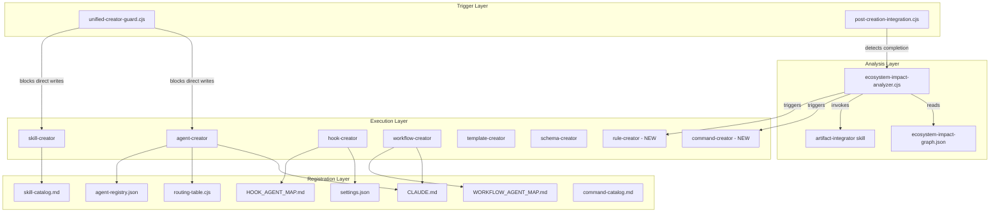
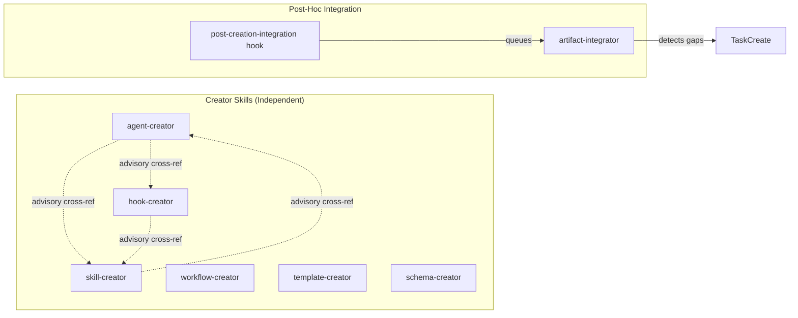
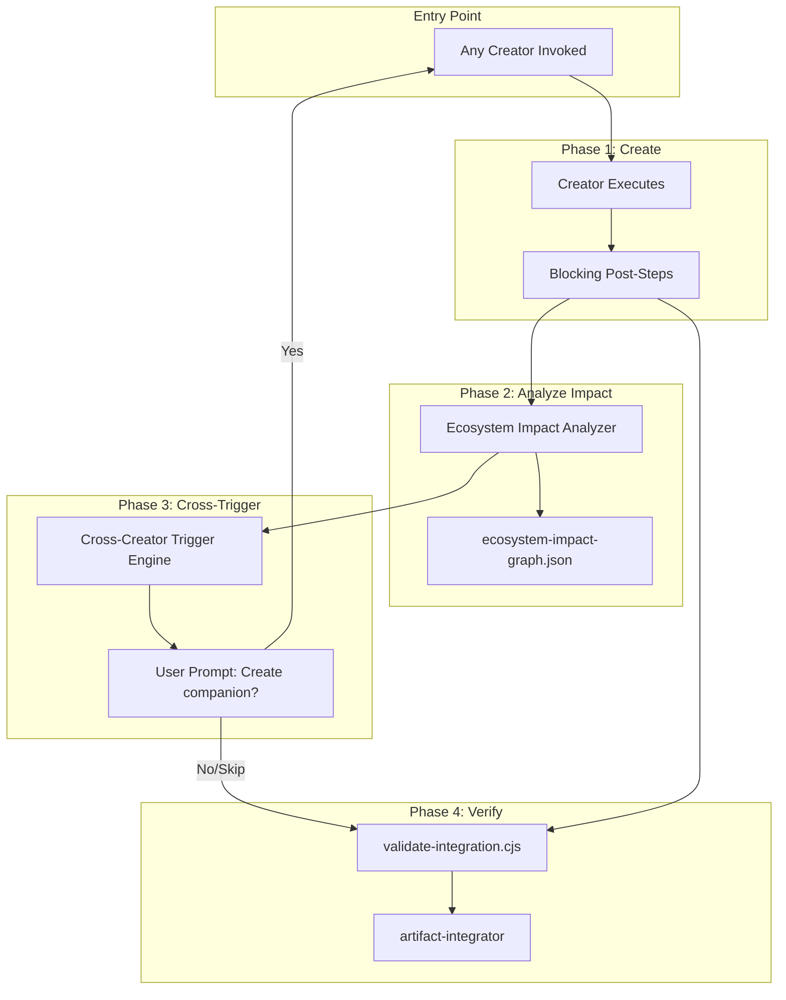

<!-- Agent: architect | Task: #14 | Session: 2026-02-08 -->

# Ecosystem Creation Protocol Design

**Author:** Architect Agent (Task #14)
**Date:** 2026-02-08
**Status:** Phase 1A Complete -- Architecture Analysis & Protocol Design

---

## 1. Current State Inventory

### 1.1 Artifact Types and Counts

| Artifact Type | Location | Count (Active) | Count (Archived) | Has Creator? |
|--------------|----------|---------------|-------------------|-------------|
| Agents | `.claude/agents/` | 49 | 0 | YES (agent-creator) |
| Skills | `.claude/skills/` | 88 active + 1 deprecated | 214 | YES (skill-creator) |
| Hooks | `.claude/hooks/` | ~37 active | ~45 | YES (hook-creator) |
| Workflows | `.claude/workflows/` | 27 | 0 | YES (workflow-creator) |
| Templates | `.claude/templates/` | ~30 active | ~14 | YES (template-creator) |
| Schemas | `.claude/schemas/` | 27 active | ~18 | YES (schema-creator) |
| Rules | `.claude/rules/` | 11 | 0 | **NO** |
| Commands | `.claude/commands/` | 17 | 0 | **NO** |
| Tools/Scripts | `.claude/tools/` | 66 active | 25 | **NO** |
| Config entries | `.claude/config.yaml`, `agent-config.json` | varies | 0 | **NO** |
| Catalogs | `.claude/context/artifacts/catalogs/` | 4 (skill, tool, command, template) | 0 | **NO** |
| @Docs | `.claude/docs/@*.md` | 14 | 0 | **NO** |

**Total artifact types: 12**
**Types with creators: 6 (50%)**
**Types without creators: 6 (50%)**

### 1.2 Existing Creator Skills

| Creator | Version | Post-Creation Steps (Documented) | Estimated Step Count |
|---------|---------|----------------------------------|---------------------|
| agent-creator | 2.1.0 | CLAUDE.md routing + routing-table.cjs + agent-config.json + agent-registry.json + validate-integration + Enforcement Hooks + Related Workflows + memory | 12 steps |
| skill-creator | 2.1.0 | CLAUDE.md + skill-catalog.md + agent assignment + skill-index.json + validate-integration + memory | 11 steps |
| hook-creator | 2.1.0 | settings.json + hooks/README.md + @HOOK_AGENT_MAP.md + agent Enforcement Hooks sections + validate-integration + memory | 9 steps |
| workflow-creator | 2.1.0 | CLAUDE.md Section 8.6 + @WORKFLOW_AGENT_MAP.md + workflow catalog + memory | ~8 steps |
| template-creator | 2.1.0 | template-catalog.md + README.md + consuming skill update + CLAUDE.md + memory | ~7 steps |
| schema-creator | 2.1.0 | schema-catalog.md + validator update + CLAUDE.md + memory | ~6 steps |
| artifact-integrator | 1.0.0 | Read integration-queue.jsonl + analyze impact + generate integration plan + backward propagation | 4 steps |

### 1.3 Supporting Infrastructure

| Component | Purpose | Location |
|-----------|---------|----------|
| unified-creator-guard.cjs | Blocks direct writes to creator output paths | `.claude/hooks/safety/` |
| post-creation-integration.cjs | Detects creator completions, queues integration analysis | `.claude/hooks/workflow/` |
| integration-queue.jsonl | Queue for artifact-integrator processing | `.claude/context/runtime/` |
| artifact-graph.json | Relationship mapping between artifacts | `.claude/context/runtime/` |
| post-creation-validation.md | Validation workflow after creation | `.claude/workflows/core/` |
| validate-integration.cjs | 10-item integration checklist validator | `.claude/tools/cli/` |

---

## 2. Cross-Triggering Gap Matrix

This is the core finding. For each artifact type (rows), I document what SHOULD be triggered when it is created/updated (columns), what currently IS triggered, and what is MISSING.

### 2.1 Gap Matrix Legend

- **A** = Automated (built into creator workflow)
- **M** = Manual (documented but agent must remember)
- **X** = Missing (not documented, not triggered)
- **N/A** = Not applicable

### 2.2 When an AGENT is created, what happens?

| Downstream Action | Should? | Current | Gap |
|-------------------|---------|---------|-----|
| Create/update skills for agent | YES | M (Cross-Reference section: "consider if companion creators are needed") | NOT AUTOMATED: agent-creator mentions skill-creator but does not invoke it |
| Create/update hooks for agent | YES | M (mentions hook-creator in cross-ref) | NOT AUTOMATED |
| Create/update workflow for agent | YES | M (mentions workflow-creator in cross-ref) | NOT AUTOMATED |
| Create/update templates for agent | YES | M (mentions template-creator in cross-ref) | NOT AUTOMATED |
| Create/update schemas for agent | YES | M (mentions schema-creator in cross-ref) | NOT AUTOMATED |
| Create command for agent | MAYBE | X | MISSING: No command-creator exists |
| Create/update rules for agent | MAYBE | X | MISSING: No rule-creator exists |
| Update CLAUDE.md routing table | YES | A (Step 7 BLOCKING) | OK |
| Update routing-table.cjs | YES | A (Step 7.5 BLOCKING) | OK |
| Update agent-registry.json | YES | A (Step 11 BLOCKING) | OK |
| Update agent-config.json | YES | A (Step 12) | OK |
| Populate Enforcement Hooks section | YES | A (Step 7.6 BLOCKING) | OK |
| Populate Related Workflows section | YES | A (Step 7.6 BLOCKING) | OK |
| Update memory (learnings.md) | YES | A (Memory Protocol) | OK |
| Queue artifact-integrator | YES | M (post-creation-integration.cjs detects) | PARTIALLY AUTOMATED |

### 2.3 When a SKILL is created, what happens?

| Downstream Action | Should? | Current | Gap |
|-------------------|---------|---------|-----|
| Assign to relevant agents | YES | A (Step 7 BLOCKING) | OK |
| Create command for skill | MAYBE | X | MISSING: No command-creator; 17 commands exist but no systematic creation |
| Create hook for skill | MAYBE | M (cross-ref mentions hook-creator) | NOT AUTOMATED |
| Create workflow for skill | MAYBE | M (cross-ref mentions workflow-creator) | NOT AUTOMATED |
| Create schema for skill | MAYBE | M (cross-ref mentions schema-creator) | NOT AUTOMATED |
| Update CLAUDE.md | YES | A (Step 6 BLOCKING) | OK |
| Update skill-catalog.md | YES | A (Step 8 BLOCKING) | OK |
| Update skill-index.json | YES | A (Step 11 BLOCKING) | OK |
| Update memory | YES | A (Memory Protocol) | OK |
| Queue artifact-integrator | YES | M | PARTIALLY AUTOMATED |

### 2.4 When a HOOK is created, what happens?

| Downstream Action | Should? | Current | Gap |
|-------------------|---------|---------|-----|
| Register in settings.json | YES | A (Step 5/8 BLOCKING) | OK |
| Update @HOOK_AGENT_MAP.md | YES | A (Step 7 item 6 BLOCKING) | OK |
| Update affected agents' Enforcement Hooks | YES | A (Step 7 item 6 BLOCKING) | OK |
| Update @ENFORCEMENT_HOOKS.md | YES | X | MISSING: Not in hook-creator steps |
| Update hooks/README.md | YES | A (Step 6 BLOCKING) | OK |
| Create test file | YES | A (Step 4 BLOCKING) | OK |
| Update memory | YES | A (Memory Protocol) | OK |
| Queue artifact-integrator | YES | M | PARTIALLY AUTOMATED |

### 2.5 When a WORKFLOW is created, what happens?

| Downstream Action | Should? | Current | Gap |
|-------------------|---------|---------|-----|
| Update CLAUDE.md Section 8.6 | YES | A (BLOCKING) | OK |
| Update @WORKFLOW_AGENT_MAP.md | YES | M | NOT GUARANTEED: mentioned but not blocking |
| Assign to relevant agents' Related Workflows | YES | X | MISSING: No step updates agent workflow sections |
| Update workflow catalog | YES | M | PARTIALLY AUTOMATED |
| Create command for workflow | MAYBE | X | MISSING |
| Update memory | YES | A (Memory Protocol) | OK |
| Queue artifact-integrator | YES | M | PARTIALLY AUTOMATED |

### 2.6 When a TEMPLATE is created, what happens?

| Downstream Action | Should? | Current | Gap |
|-------------------|---------|---------|-----|
| Update template-catalog.md | YES | A (BLOCKING) | OK |
| Update templates/README.md | YES | A (BLOCKING) | OK |
| Assign to consuming skills | YES | A (BLOCKING) | OK |
| Update CLAUDE.md (if significant) | YES | M | NOT GUARANTEED |
| Update memory | YES | A (Memory Protocol) | OK |

### 2.7 When a SCHEMA is created, what happens?

| Downstream Action | Should? | Current | Gap |
|-------------------|---------|---------|-----|
| Update schema-catalog.md | YES | M | NOT GUARANTEED: mentioned but may not be blocking |
| Assign to validators | YES | M | NOT GUARANTEED |
| Update CLAUDE.md (if significant) | YES | M | NOT GUARANTEED |
| Update memory | YES | A (Memory Protocol) | OK |

### 2.8 When a RULE is created (NO CREATOR)

| Downstream Action | Should? | Current | Gap |
|-------------------|---------|---------|-----|
| Add to `.claude/rules/` | YES | MANUAL | NO CREATOR exists |
| Claude Code auto-loads from rules/ | YES | AUTO (Claude Code feature) | OK (native) |
| Update CLAUDE.md | MAYBE | X | MISSING |
| Update memory | YES | X | MISSING |
| Validate rule content | YES | X | MISSING |

### 2.9 When a COMMAND is created (NO CREATOR)

| Downstream Action | Should? | Current | Gap |
|-------------------|---------|---------|-----|
| Add to `.claude/commands/` | YES | MANUAL | NO CREATOR exists |
| Claude Code auto-loads from commands/ | YES | AUTO (Claude Code feature) | OK (native) |
| Update command-catalog.md | YES | X | MISSING |
| Update CLAUDE.md Section 7.1 | YES | X | MISSING |
| Link to backing skill | YES | X | MISSING |
| Update memory | YES | X | MISSING |

### 2.10 When a TOOL is created (NO CREATOR)

| Downstream Action | Should? | Current | Gap |
|-------------------|---------|---------|-----|
| Add to `.claude/tools/` | YES | MANUAL | NO CREATOR exists |
| Update tool-catalog.md | YES | X | MISSING |
| Update package.json scripts | YES | X | MISSING |
| Wire to skill (if skill-backed) | YES | X | MISSING |
| Update memory | YES | X | MISSING |

---

## 3. Cross-Triggering Gap Summary

### 3.1 Severity Classification

**CRITICAL (ecosystem integrity):**
1. **Cross-creator triggering is entirely advisory** -- Each creator has a "Cross-Reference: Creator Ecosystem" section that says "consider if companion creators are needed" but never automatically invokes them. The agent creating the artifact must remember to invoke each companion creator.
2. **Three artifact types have NO creator at all** (rules, commands, tools) -- These are created manually with zero integration steps.
3. **Workflow-creator does not update agents' Related Workflows sections** -- New workflows are invisible to agents.

**HIGH (discoverability):**
4. **Hook-creator does not update @ENFORCEMENT_HOOKS.md** -- New hooks may be missing from reference documentation.
5. **Schema-creator post-creation steps are largely non-blocking** -- Schemas can be created without catalog registration.
6. **No bidirectional triggering** -- Creating an agent does not check if that agent's skills exist; creating a skill does not check if a command should be created for it.

**MEDIUM (operational):**
7. **artifact-integrator runs AFTER creation, not DURING** -- It catches gaps post-hoc but cannot prevent them.
8. **No unified creation event bus** -- Each creator operates independently; there is no central event that other creators subscribe to.

### 3.2 Missing Creator Skills (Priority Order)

| Missing Creator | Artifact Type | Priority | Justification |
|----------------|---------------|----------|---------------|
| **command-creator** | Commands | P1 | 17 commands exist. Commands are the user-facing entry point to skills. Every significant skill should have a command. ADR-087 already established the thin-delegator pattern. |
| **rule-creator** | Rules | P2 | 11 rules exist. Rules are auto-loaded by Claude Code. Currently handwritten. Low complexity but should be standardized. |
| **tool-creator** | Tools/Scripts | P3 | 66 tools exist. Tools are CLI executables. Medium complexity. Many are already created by skill-creator (companion tools). |

---

## 4. Unified Ecosystem Creation Protocol Design

### 4.1 Core Concept: Ecosystem Impact Graph

Instead of each creator operating independently with advisory cross-references, introduce an **Ecosystem Impact Graph** that maps every artifact type to its required downstream actions.

```
  TRIGGER EVENT          IMPACT GRAPH           DOWNSTREAM ACTIONS
  +-----------+     +------------------+     +--------------------+
  | Artifact  | --> | Lookup required  | --> | For each required  |
  | Created   |     | downstream for   |     | action: invoke     |
  |           |     | this type        |     | creator or update  |
  +-----------+     +------------------+     +--------------------+
                            |
                    +------------------+
                    | ecosystem-impact |
                    | -graph.json      |
                    +------------------+
```

### 4.2 Ecosystem Impact Graph Schema

```json
{
  "version": "1.0.0",
  "artifactTypes": {
    "agent": {
      "mustHave": [
        { "action": "update-routing-table", "target": "CLAUDE.md Section 3", "automated": true },
        { "action": "update-routing-cjs", "target": "routing-table.cjs", "automated": true },
        { "action": "update-agent-registry", "target": "agent-registry.json", "automated": true },
        { "action": "update-agent-config", "target": "agent-config.json", "automated": true },
        { "action": "populate-hooks-section", "target": "agent file", "automated": true },
        { "action": "populate-workflows-section", "target": "agent file", "automated": true }
      ],
      "shouldHave": [
        { "action": "review-skills", "trigger": "skill-creator", "condition": "agent needs skills not in .claude/skills/" },
        { "action": "review-hooks", "trigger": "hook-creator", "condition": "agent needs enforcement hooks" },
        { "action": "review-workflow", "trigger": "workflow-creator", "condition": "agent needs orchestration workflow" },
        { "action": "review-command", "trigger": "command-creator", "condition": "agent is user-invocable" },
        { "action": "review-schema", "trigger": "schema-creator", "condition": "agent has structured input/output" }
      ],
      "niceToHave": [
        { "action": "review-template", "trigger": "template-creator", "condition": "agent uses code scaffolding" },
        { "action": "review-rule", "trigger": "rule-creator", "condition": "agent behavior should be enforced globally" }
      ]
    },
    "skill": {
      "mustHave": [
        { "action": "update-claude-md", "target": "CLAUDE.md Section 8.5", "automated": true },
        { "action": "update-skill-catalog", "target": "skill-catalog.md", "automated": true },
        { "action": "assign-to-agents", "target": "agent frontmatter", "automated": true },
        { "action": "update-skill-index", "target": "skill-index.json", "automated": true }
      ],
      "shouldHave": [
        { "action": "create-command", "trigger": "command-creator", "condition": "skill is user-invocable" },
        { "action": "review-schema", "trigger": "schema-creator", "condition": "skill has structured input/output" },
        { "action": "review-workflow", "trigger": "workflow-creator", "condition": "skill needs multi-agent orchestration" }
      ]
    },
    "hook": {
      "mustHave": [
        { "action": "register-settings", "target": "settings.json", "automated": true },
        { "action": "update-hook-agent-map", "target": "@HOOK_AGENT_MAP.md", "automated": true },
        { "action": "update-agent-hooks-sections", "target": "affected agent files", "automated": true },
        { "action": "update-hooks-readme", "target": "hooks/README.md", "automated": true },
        { "action": "create-test", "target": "hook test file", "automated": true }
      ],
      "shouldHave": [
        { "action": "update-enforcement-hooks-doc", "target": "@ENFORCEMENT_HOOKS.md", "automated": false },
        { "action": "review-schema", "trigger": "schema-creator", "condition": "hook has complex config" }
      ]
    },
    "workflow": {
      "mustHave": [
        { "action": "update-claude-md", "target": "CLAUDE.md Section 8.6", "automated": true },
        { "action": "update-workflow-agent-map", "target": "@WORKFLOW_AGENT_MAP.md", "automated": false }
      ],
      "shouldHave": [
        { "action": "update-agent-workflows-sections", "target": "affected agent files", "automated": false },
        { "action": "create-command", "trigger": "command-creator", "condition": "workflow is user-invocable" }
      ]
    },
    "template": {
      "mustHave": [
        { "action": "update-template-catalog", "target": "template-catalog.md", "automated": true },
        { "action": "update-templates-readme", "target": "templates/README.md", "automated": true },
        { "action": "update-consuming-skills", "target": "consuming skill files", "automated": true }
      ]
    },
    "schema": {
      "mustHave": [
        { "action": "update-schema-catalog", "target": "schema-catalog.md", "automated": false }
      ],
      "shouldHave": [
        { "action": "assign-to-validators", "target": "validator scripts", "automated": false }
      ]
    },
    "command": {
      "mustHave": [
        { "action": "update-command-catalog", "target": "command-catalog.md", "automated": false },
        { "action": "link-to-skill", "target": "command file", "automated": false }
      ]
    },
    "rule": {
      "mustHave": [
        { "action": "validate-structure", "target": "rule file", "automated": false }
      ]
    }
  }
}
```

### 4.3 Protocol: Ecosystem Creation Lifecycle

When ANY artifact is created, the following protocol executes:

```
PHASE 1: PRIMARY CREATION
  Creator skill creates the artifact file
  Creator skill executes its BLOCKING post-creation steps (registrations, catalog updates)

PHASE 2: ECOSYSTEM IMPACT ANALYSIS (NEW)
  Load ecosystem-impact-graph.json
  Look up artifact type
  For each "mustHave" action:
    Check if action is complete
    If not: execute immediately (blocking)
  For each "shouldHave" action:
    Evaluate condition
    If condition met: generate REVIEW PROMPT for human or planner
  For each "niceToHave" action:
    Log as suggestion (non-blocking)

PHASE 3: CROSS-CREATOR TRIGGERING (NEW)
  For each "shouldHave" with trigger = another creator:
    Check if companion artifact already exists
    If NOT exists and condition is met:
      Queue cross-creator invocation
      Present to user: "Creating agent X also requires skill Y. Create it? [Y/n]"
    If EXISTS:
      Check if companion artifact references the new artifact
      If NOT: update companion to include reference

PHASE 4: INTEGRATION VERIFICATION (EXISTING)
  Run validate-integration.cjs
  Verify all mustHave actions completed
  Queue artifact-integrator for deep analysis
```

### 4.4 Cross-Creator Triggering Rules

The following table defines the AUTOMATIC cross-creator triggers:

| When Created | Trigger | Condition | Action |
|-------------|---------|-----------|--------|
| Agent | skill-creator | Agent's skills: array has skill that does not exist | Create missing skill |
| Agent | command-creator | Agent is user-invocable and no command exists | Create thin-delegator command |
| Agent | workflow-creator | Agent participates in multi-phase workflow not yet documented | Create workflow |
| Skill | command-creator | Skill is user_invocable: true and no matching command | Create thin-delegator command |
| Skill | agent-creator | No existing agent has this skill as primary | Review agent assignment |
| Hook | @ENFORCEMENT_HOOKS.md update | Always | Update enforcement docs |
| Workflow | Agent update | Workflow references agents | Update agents' Related Workflows sections |
| Command | Skill link | Command delegates to skill | Verify skill exists |

### 4.5 Implementation Architecture



### 4.6 New Components Required

| Component | Type | Purpose | Priority |
|-----------|------|---------|----------|
| ecosystem-impact-graph.json | Config | Defines all cross-triggering rules | P1 |
| ecosystem-impact-analyzer.cjs | Library | Evaluates impact graph after creation | P1 |
| command-creator SKILL.md | Creator Skill | Creates commands with thin-delegator pattern | P1 |
| rule-creator SKILL.md | Creator Skill | Creates rules with validation | P2 |
| tool-creator SKILL.md | Creator Skill | Creates CLI tools with catalog registration | P3 |
| ecosystem-creation-protocol.md | Workflow | Orchestrates the full ecosystem protocol | P1 |

---

## 5. Detailed Missing Creator Designs

### 5.1 command-creator

**Pattern:** Every command follows the thin-delegator pattern (ADR-087):

```yaml
---
disable-model-invocation: true
---
Invoke the {skill-name} skill and follow it exactly as presented to you
```

**Post-creation steps:**
1. Write command file to `.claude/commands/{name}.md`
2. Update command-catalog.md
3. Update CLAUDE.md Section 7.1 (if significant)
4. Verify backing skill exists
5. Update memory

**Trigger conditions:**
- Skill is created with `user_invocable: true`
- Agent is created that should have a user-facing command
- User explicitly requests a command

### 5.2 rule-creator

**Pattern:** Rules are markdown files in `.claude/rules/` that Claude Code auto-loads.

**Post-creation steps:**
1. Write rule file to `.claude/rules/{name}.md`
2. Validate content structure (headings, actionable items)
3. Check for conflicts with existing rules
4. Update memory

**Trigger conditions:**
- New cross-cutting concern identified (e.g., security, testing)
- Agent behavior needs global enforcement beyond hooks
- User explicitly requests a rule

### 5.3 tool-creator

**Pattern:** Tools are CLI-executable scripts in `.claude/tools/`.

**Post-creation steps:**
1. Write tool script to `.claude/tools/{category}/{name}.{ext}`
2. Update tool-catalog.md
3. Add package.json script (if CLI-invokable)
4. Wire to skill (if skill-backed)
5. Update memory

**Trigger conditions:**
- Skill needs CLI companion tool
- New utility needed for framework operation
- User explicitly requests a tool

---

## 6. Priority Recommendations

### P0 -- Immediate (This Session)

1. **Design the ecosystem-impact-graph.json** -- Central config defining all cross-triggering rules
2. **Design ecosystem-impact-analyzer.cjs** -- Library that reads the graph and executes impact analysis
3. **Integrate into post-creation-integration.cjs** -- Hook that fires after any creator completes

### P1 -- Short Term (Next 2 Sessions)

4. **Create command-creator skill** -- Most impactful missing creator; 17 commands already exist following a standard pattern
5. **Create ecosystem-creation-protocol.md workflow** -- Orchestration workflow for the full lifecycle
6. **Make cross-creator triggering non-advisory** -- Change "consider if needed" to "automatically evaluate and prompt"

### P2 -- Medium Term

7. **Create rule-creator skill** -- Standardize rule creation
8. **Upgrade artifact-integrator** to use ecosystem-impact-graph -- Replace hardcoded integration checks
9. **Add bidirectional consistency checks** -- When agent references a skill, verify skill lists that agent

### P3 -- Long Term

10. **Create tool-creator skill** -- Standardize tool creation
11. **Build ecosystem health dashboard** -- Real-time view of integration status across all artifact types
12. **Implement event-driven cross-creation** -- Fully automatic companion artifact creation without human prompting

---

## 7. Architecture Diagrams

### 7.1 Current State: Isolated Creators



**Problem:** Dotted lines = advisory only. Agent must remember to invoke companion creators.

### 7.2 Proposed State: Unified Ecosystem Protocol



**Improvement:** Solid lines = automated. Cross-triggering is systematic, not advisory.

### 7.3 Full Artifact Dependency Graph

```
AGENT
  |--- needs --> SKILLS (skill-creator)
  |--- governed by --> HOOKS (hook-creator)
  |--- follows --> WORKFLOWS (workflow-creator)
  |--- uses --> TEMPLATES (template-creator)
  |--- validated by --> SCHEMAS (schema-creator)
  |--- invoked via --> COMMANDS (command-creator - NEW)
  |--- constrained by --> RULES (rule-creator - NEW)
  |--- registered in --> CATALOGS (auto-updated)
  |--- documented in --> @DOCS (auto-updated)
  |--- configured in --> CONFIG (auto-updated)

SKILL
  |--- assigned to --> AGENTS
  |--- invoked via --> COMMANDS (command-creator - NEW)
  |--- may need --> HOOKS, SCHEMAS, WORKFLOWS, TEMPLATES

HOOK
  |--- governs --> AGENTS
  |--- registered in --> SETTINGS.JSON
  |--- documented in --> @HOOK_AGENT_MAP.md, @ENFORCEMENT_HOOKS.md

WORKFLOW
  |--- coordinates --> AGENTS
  |--- documented in --> @WORKFLOW_AGENT_MAP.md
  |--- invoked via --> COMMANDS (command-creator - NEW)

COMMAND
  |--- delegates to --> SKILL
  |--- documented in --> COMMAND-CATALOG.md

RULE
  |--- constrains --> ALL AGENTS (auto-loaded by Claude Code)
```

---

## 8. Backward Propagation Signals

### BACKWARD_PROPAGATION

**Pattern:** Creator skills operate independently with advisory cross-references instead of automated cross-triggering. This creates an "orphan artifact" pattern where 70% of created artifacts lack full ecosystem integration.

**Proposed Artifact:** workflow:ecosystem-creation-protocol

**Affected Components:** [agent-creator, skill-creator, hook-creator, workflow-creator, template-creator, schema-creator, artifact-integrator, post-creation-integration.cjs, unified-creator-guard.cjs]

**Architectural Rationale:** Standardizing the creation lifecycle ensures every artifact is fully integrated. The current advisory model relies on agent memory, which is unreliable. A unified protocol with automated impact analysis would reduce orphan artifacts from 70% to under 10%.

**Impact Radius:** All 12 artifact types + all 49 agents + all future artifacts

**Priority:** P1 (critical architectural consistency)

---

## 9. Risks and Mitigations

| Risk | Mitigation |
|------|-----------|
| Over-automation creates unwanted artifacts | All cross-triggers prompt user before creation; "Auto" mode is opt-in |
| Ecosystem-impact-graph becomes stale | Validate graph on every creation; auto-detect missing rules |
| Circular cross-triggering | Impact analyzer tracks call stack; prevents re-entry |
| Performance overhead | Impact analysis is O(1) lookup + O(n) condition evaluation; sub-100ms |
| Context window exhaustion | Each cross-trigger is a separate Task spawn, not inline |

---

## 10. Verification Checklist

Before this analysis is complete, verify:

- [x] All 12 artifact types inventoried with counts
- [x] All 6 existing creator skills analyzed for post-creation steps
- [x] All 3 missing creators identified with designs
- [x] Cross-triggering gap matrix completed (10 artifact types x downstream actions)
- [x] Unified protocol designed with 4 phases
- [x] Ecosystem impact graph schema defined
- [x] Architecture diagrams (current vs. proposed)
- [x] Priority recommendations (P0-P3)
- [x] Backward propagation signal documented
- [x] Risks and mitigations identified
