<!-- Agent: architect | Task: #118 | Session: 2026-02-07 -->

# Hooks System Deep Dive Audit

**Pipeline:** #14
**Date:** 2026-02-07
**Agent:** Architect
**Health Score:** 82/100

---

## Executive Summary

The hooks system is in **good health** following the 2026-02-06 consolidation that reduced 88 hooks to 36 registered hooks. All 36 registered hooks have corresponding files on disk (zero PHANTOM hooks). The system has 2 DEAD hooks (unregistered, non-library files in active directories), 7 library modules properly co-located with their consumers, and 45 archived hooks in `_archive/`. One hook (`unified-pre-write-hook.cjs`) is located in the wrong directory (hooks root instead of a category subdirectory). The documentation in `@ENFORCEMENT_HOOKS.md` and `@HOOK_AGENT_MAP.md` is accurate but `@ENFORCEMENT_HOOKS.md` is too narrow (only documents 2 of 36 hooks).

**Key Findings:**
- 36 registered hooks, 0 phantom registrations, 2 dead hooks
- 1 misplaced hook (`unified-pre-write-hook.cjs` at hooks root)
- `@ENFORCEMENT_HOOKS.md` covers only 2 hooks (routing-guard, unified-creator-guard) out of 36
- `@HOOK_AGENT_MAP.md` lists 36 hooks accurately but includes `error-summary-extractor.cjs` in archive Section 5 reference, which was actually RESTORED to active directory
- Library modules (error-tracker.cjs, metrics-collector.cjs, validators/*) are correctly co-located but could be in `.claude/lib/` for consistency
- `orchestrator.mjs` is a stub placeholder that uses ESM exports and `console.log` -- should be archived

---

## Hook Inventory Table

### Registered Hooks (36 total)

| # | Path | Event | Matcher | Mode | Registered | Status |
|---|------|-------|---------|------|------------|--------|
| 1 | `session/state-reset.cjs` | UserPromptSubmit | * | always | YES | KEEP |
| 2 | `routing/user-prompt-unified.cjs` | UserPromptSubmit | * | advisory | YES | KEEP |
| 3 | `reflection/force-step0-execution.cjs` | UserPromptSubmit | * | block | YES | KEEP |
| 4 | `session/session-cleanup.cjs` | PreToolUse | * | approve | YES | KEEP |
| 5 | `monitoring/execution-limit-monitor-hook.cjs` | PreToolUse | * | block/warn | YES | KEEP |
| 6 | `routing/tool-scope-validator.cjs` | PreToolUse | * | warn (default) | YES | KEEP |
| 7 | `safety/bash-command-validator.cjs` | PreToolUse | Bash | block | YES | KEEP |
| 8 | `safety/shell-injection-validator.cjs` | PreToolUse | Bash | block | YES | KEEP |
| 9 | `safety/windows-null-sanitizer.cjs` | PreToolUse | Bash | modify | YES | KEEP |
| 10 | `routing/routing-guard.cjs` | PreToolUse | Bash, Glob\|Grep\|WebSearch, TaskCreate | block | YES | KEEP |
| 11 | `routing/unified-creator-guard.cjs` | PreToolUse | Edit\|Write\|NotebookEdit | block | YES | KEEP |
| 12 | `unified-pre-write-hook.cjs` (ROOT) | PreToolUse | Edit\|Write\|NotebookEdit | block | YES | **MISPLACED** |
| 13 | `evolution/evolution-state-guard.cjs` | PreToolUse | Edit\|Write\|NotebookEdit | block | YES | KEEP |
| 14 | `evolution/research-enforcement.cjs` | PreToolUse | Edit\|Write\|NotebookEdit | block | YES | KEEP |
| 15 | `evolution/quality-gate-validator.cjs` | PreToolUse | Edit\|Write\|NotebookEdit, TaskUpdate | block | YES | KEEP |
| 16 | `evolution/conflict-detector.cjs` | PreToolUse | Write | block | YES | KEEP |
| 17 | `safety/validate-skill-invocation.cjs` | PreToolUse | Read | warn | YES | KEEP |
| 18 | `reflection/reflection-step0-guard.cjs` | PreToolUse | TaskList | warn (default) | YES | KEEP |
| 19 | `routing/intent-agent-match.cjs` | PreToolUse | Task | block | YES | KEEP |
| 20 | `routing/spawn-prompt-assembler.cjs` | PreToolUse | Task | modify | YES | KEEP |
| 21 | `routing/pre-task-unified.cjs` | PreToolUse | Task | block | YES | KEEP |
| 22 | `routing/config-model-validator.cjs` | PreToolUse | Task | warn | YES | KEEP |
| 23 | `safety/spawn-prompt-validator.cjs` | PreToolUse | Task | warn | YES | KEEP |
| 24 | `routing/task-status-enforcement.cjs` | PreToolUse | TaskUpdate | block | YES | KEEP |
| 25 | `validation/pre-completion-validation.cjs` | PreToolUse | TaskUpdate | block | YES | KEEP |
| 26 | `monitoring/metrics-collector-hook.cjs` | PostToolUse | * | advisory | YES | KEEP |
| 27 | `monitoring/error-tracker-hook.cjs` | PostToolUse | * | advisory | YES | KEEP |
| 28 | `self-healing/anomaly-detector.cjs` | PostToolUse | * | advisory | YES | KEEP |
| 29 | `routing/post-task-unified.cjs` | PostToolUse | Task | advisory | YES | KEEP |
| 30 | `routing/task-list-tracker.cjs` | PostToolUse | TaskList | advisory | YES | KEEP |
| 31 | `workflow/post-completion-chain.cjs` | PostToolUse | TaskUpdate | advisory | YES | KEEP |
| 32 | `memory/sync-memory-index.cjs` | PostToolUse | Edit\|Write\|NotebookEdit, MemoryRecord | advisory | YES | KEEP |
| 33 | `routing/code-index-updater.cjs` | PostToolUse | Edit\|Write\|NotebookEdit | advisory | YES | KEEP |
| 34 | `reflection/unified-reflection-handler.cjs` | PostToolUse | Task\|TaskUpdate\|Bash; SessionEnd | advisory | YES | KEEP |
| 35 | `reflection/reflection-queue-processor.cjs` | SessionEnd | * | advisory | YES | KEEP |
| 36 | `validation/check-console-log.cjs` | Stop | * | advisory | YES | KEEP |

### Unregistered Files in Active Directories

| # | Path | Type | Required By | Status |
|---|------|------|-------------|--------|
| 37 | `monitoring/error-tracker.cjs` | Library | error-tracker-hook.cjs | KEEP (library) |
| 38 | `monitoring/metrics-collector.cjs` | Library | metrics-collector-hook.cjs | KEEP (library) |
| 39 | `reflection/error-summary-extractor.cjs` | Hook | (none - superseded) | **DEAD** |
| 40 | `orchestrator.mjs` | Stub | (none) | **DEAD** |
| 41 | `safety/validators/registry.cjs` | Library | bash-command-validator.cjs | KEEP (library) |
| 42 | `safety/validators/database-validators.cjs` | Library | registry.cjs | KEEP (library) |
| 43 | `safety/validators/filesystem-validators.cjs` | Library | registry.cjs | KEEP (library) |
| 44 | `safety/validators/git-validators.cjs` | Library | registry.cjs | KEEP (library) |
| 45 | `safety/validators/network-validators.cjs` | Library | registry.cjs | KEEP (library) |
| 46 | `safety/validators/process-validators.cjs` | Library | registry.cjs | KEEP (library) |
| 47 | `safety/validators/shell-validators.cjs` | Library | registry.cjs | KEEP (library) |

---

## Registration Analysis

### Registered Hooks by Event

| Event | Count | Hooks |
|-------|-------|-------|
| UserPromptSubmit | 3 | state-reset, user-prompt-unified, force-step0-execution |
| PreToolUse(*) | 3 | session-cleanup, execution-limit-monitor-hook, tool-scope-validator |
| PreToolUse(Bash) | 4 | bash-command-validator, shell-injection-validator, windows-null-sanitizer, routing-guard |
| PreToolUse(Glob\|Grep\|WebSearch) | 1 | routing-guard |
| PreToolUse(Edit\|Write\|NotebookEdit) | 5 | unified-creator-guard, unified-pre-write-hook, evolution-state-guard, research-enforcement, quality-gate-validator |
| PreToolUse(Write) | 1 | conflict-detector |
| PreToolUse(Read) | 1 | validate-skill-invocation |
| PreToolUse(TaskList) | 1 | reflection-step0-guard |
| PreToolUse(TaskCreate) | 1 | routing-guard |
| PreToolUse(Task) | 5 | intent-agent-match, spawn-prompt-assembler, pre-task-unified, config-model-validator, spawn-prompt-validator |
| PreToolUse(TaskUpdate) | 3 | task-status-enforcement, pre-completion-validation, quality-gate-validator |
| PostToolUse(*) | 3 | metrics-collector-hook, error-tracker-hook, anomaly-detector |
| PostToolUse(Task) | 1 | post-task-unified |
| PostToolUse(TaskList) | 1 | task-list-tracker |
| PostToolUse(TaskUpdate) | 1 | post-completion-chain |
| PostToolUse(Edit\|Write\|NotebookEdit) | 2 | sync-memory-index, code-index-updater |
| PostToolUse(MemoryRecord) | 1 | sync-memory-index |
| PostToolUse(Task\|TaskUpdate\|Bash) | 1 | unified-reflection-handler |
| SessionEnd | 2 | unified-reflection-handler, reflection-queue-processor |
| Stop | 1 | check-console-log |

### Registration Fidelity

- **Phantom hooks (registered but file missing):** 0 -- CLEAN
- **Dead hooks (on disk, not registered, not a library):** 2
  - `reflection/error-summary-extractor.cjs` -- superseded by `unified-reflection-handler.cjs` per archive README, but file was restored to active directory instead of staying in `_archive/`
  - `orchestrator.mjs` -- ESM stub placeholder with `console.log` in production code, no consumers, no registration

---

## Gap Analysis

### DEAD Hooks (2)

| Hook | Issue | Recommendation |
|------|-------|---------------|
| `reflection/error-summary-extractor.cjs` | Listed as superseded in archive README but exists in active `reflection/` directory. Not registered. No consumers. | **ARCHIVE** -- Move to `_archive/reflection/` |
| `orchestrator.mjs` | ESM stub (12 lines), uses `console.log`, no registration, no consumers, no CJS equivalent. | **DELETE** -- No value, placeholder never implemented |

### MISPLACED Hooks (1)

| Hook | Issue | Recommendation |
|------|-------|---------------|
| `unified-pre-write-hook.cjs` | Located at `.claude/hooks/unified-pre-write-hook.cjs` (root of hooks/) instead of a category subdirectory. All other 35 registered hooks are in subdirectories (routing/, safety/, evolution/, etc.). | **MOVE** to `evolution/` or `safety/` and update settings.json path |

### REDUNDANCY Analysis

| Area | Hooks | Overlap | Verdict |
|------|-------|---------|---------|
| Write/Edit validation | unified-creator-guard + unified-pre-write-hook | unified-pre-write-hook consolidates 11 checks including a subset of unified-creator-guard logic (item #7 in its list). Both fire on Write/Edit. | **POTENTIAL OVERLAP** -- unified-pre-write-hook internally references unified-creator-guard as one of its 11 consolidated checks. The standalone unified-creator-guard also runs separately via settings.json. This means creator-guard logic may execute twice. |
| Routing enforcement | routing-guard (on Bash, Glob\|Grep\|WebSearch, TaskCreate) + pre-task-unified (on Task) | routing-guard subset check #5 is replicated in pre-task-unified's consolidated logic. However they fire on different matchers (routing-guard on Bash/Glob/Grep/WebSearch/TaskCreate, pre-task-unified on Task). | **ACCEPTABLE** -- different event matchers, minimal overlap |
| Quality gates | quality-gate-validator (on Write/Edit AND TaskUpdate) | Registered twice in settings.json: once for Edit\|Write\|NotebookEdit, once for TaskUpdate. This is intentional dual-matcher. | **CORRECT** -- intentional |

### STALE Logic Analysis

| Hook | Concern | Severity |
|------|---------|----------|
| `error-tracker-hook.cjs` | Uses `parseHookInputSync()` (line 14) while all other hooks use `parseHookInputAsync()`. The sync version reads from `argv[2]` which Claude Code does not use (it sends via stdin). This was explicitly noted as a bug fix in metrics-collector-hook.cjs (FIX-RS-003). | **P1 -- error-tracker-hook likely not receiving input** |
| `unified-pre-write-hook.cjs` + `unified-creator-guard.cjs` | Both run on Write/Edit. The pre-write-hook lists unified-creator-guard as one of its 11 consolidated checks (item #7). If both are active, creator-guard logic executes twice per Write/Edit. | **P2 -- redundant execution** |
| `orchestrator.mjs` | Uses ESM exports pattern (`export default`) which is incompatible with Claude Code's CJS hook protocol. Also uses `console.log` in production code. | **P1 -- dead code, should be removed** |

---

## Documentation Accuracy

### `@ENFORCEMENT_HOOKS.md`

| Aspect | Status | Detail |
|--------|--------|--------|
| routing-guard.cjs coverage | ACCURATE | All 5 enforcement checks documented correctly |
| unified-creator-guard.cjs coverage | ACCURATE | Blocked paths, modes, override documented |
| Completeness | **POOR** | Only documents 2 of 36 hooks. The remaining 34 hooks are undocumented in this reference file. |
| Hook registration JSON example | **STALE** | Shows simplified JSON format (lines 122-136) that does not match the actual settings.json structure (array-of-matchers format). |

### `@HOOK_AGENT_MAP.md`

| Aspect | Status | Detail |
|--------|--------|--------|
| Hook-Agent Matrix (Section 1) | ACCURATE | All 36 hooks listed with correct event types and agent archetypes |
| Environment Variables (Section 2) | ACCURATE | 12 env vars documented with correct defaults |
| Hook Categories (Section 3) | **MINOR DRIFT** | Lists 36 hooks across 10 categories. Count says "Routing Hooks (11)" but only 10 are listed (code-index-updater is categorized as routing but is actually a monitoring/indexing hook). |
| Execution Order (Section 4) | ACCURATE | Matches settings.json registration order |
| Orphan/Archived (Section 5) | **MINOR ISSUE** | References error-summary-extractor.cjs as archived, but file exists in active `reflection/` directory |
| Cross-References (Section 6) | ACCURATE | Correct links to related files |

---

## Disposition Matrix

| Hook | Action | Priority | Rationale |
|------|--------|----------|-----------|
| `reflection/error-summary-extractor.cjs` | ARCHIVE | P2 | Superseded by unified-reflection-handler, should be in _archive/ |
| `orchestrator.mjs` | DELETE | P2 | ESM stub, no consumers, console.log in code, never implemented |
| `unified-pre-write-hook.cjs` | MOVE | P3 | Relocate from hooks root to `hooks/safety/` or `hooks/evolution/` |
| `monitoring/error-tracker-hook.cjs` | UPDATE | P1 | Fix `parseHookInputSync` to `parseHookInputAsync` (FIX-RS-003 pattern) |
| `unified-creator-guard.cjs` | REVIEW | P2 | Evaluate if standalone registration is needed given unified-pre-write-hook also runs creator-guard checks |
| All 36 registered hooks | KEEP | -- | All healthy and functional |
| 7 library modules | KEEP | -- | Co-located dependencies, correctly unregistered |
| 45 _archive/ hooks | KEEP ARCHIVED | -- | Properly archived with README documentation |

---

## Recommendations

### P1 (Critical -- Fix Immediately)

1. **Fix error-tracker-hook.cjs stdin parsing**: The hook uses `parseHookInputSync()` which reads from `argv[2]`, but Claude Code sends hook input via stdin. This means error tracking is silently broken (no errors are being tracked). Change to `parseHookInputAsync()` following the same pattern used in `metrics-collector-hook.cjs` (FIX-RS-003).

### P2 (Important -- Fix Soon)

2. **Archive error-summary-extractor.cjs**: Move `reflection/error-summary-extractor.cjs` to `_archive/reflection/` and update the archive README. This file is superseded by `unified-reflection-handler.cjs` but was left in the active directory.

3. **Delete orchestrator.mjs**: Remove this 12-line ESM stub. It uses `console.log` (violates coding standards), uses ESM exports (incompatible with hook protocol), is not registered, and has no consumers.

4. **Evaluate unified-creator-guard + unified-pre-write-hook overlap**: The unified-pre-write-hook consolidates 11 checks including creator-guard logic (item #7). Meanwhile, unified-creator-guard is also registered independently. This means creator path blocking runs twice per Write/Edit. Either:
   - Remove unified-creator-guard from settings.json (rely on unified-pre-write-hook's internal check), OR
   - Remove the creator-guard check from unified-pre-write-hook (keep only the standalone)

   Recommendation: Keep the standalone unified-creator-guard.cjs (it is simpler, focused, and the "Gate 4" canonical implementation). Have unified-pre-write-hook skip check #7 when it detects unified-creator-guard already ran.

5. **Expand @ENFORCEMENT_HOOKS.md**: Currently only documents 2 of 36 hooks. At minimum, add sections for the other high-impact hooks: bash-command-validator, shell-injection-validator, pre-task-unified, spawn-prompt-validator, task-status-enforcement, pre-completion-validation. Fix the stale JSON registration example.

### P3 (Nice to Have)

6. **Move unified-pre-write-hook.cjs to subdirectory**: All other hooks are in category subdirectories. Move from `hooks/unified-pre-write-hook.cjs` to `hooks/safety/unified-pre-write-hook.cjs` (or `hooks/validation/`). Update settings.json path.

7. **Consider relocating library modules**: `monitoring/error-tracker.cjs`, `monitoring/metrics-collector.cjs`, and `safety/validators/*` are library modules co-located with their hook consumers. For consistency with the project pattern (libraries in `.claude/lib/`), consider moving them to `.claude/lib/monitoring/` and `.claude/lib/validators/`. Low priority since co-location works and is documented.

8. **Fix @HOOK_AGENT_MAP.md Section 3 count**: "Routing Hooks (11)" should be "Routing Hooks (10)" or recategorize code-index-updater to "Memory Hooks" where it belongs functionally.

---

## Architecture Diagram

```mermaid
graph TB
    subgraph UserPromptSubmit["UserPromptSubmit (3 hooks)"]
        SR[state-reset]
        UPU[user-prompt-unified]
        FS0[force-step0-execution]
    end

    subgraph PreToolUseAll["PreToolUse * (3 hooks)"]
        SC[session-cleanup]
        ELM[execution-limit-monitor-hook]
        TSV[tool-scope-validator]
    end

    subgraph PreToolUseBash["PreToolUse Bash (4 hooks)"]
        BCV[bash-command-validator]
        SIV[shell-injection-validator]
        WNS[windows-null-sanitizer]
        RG1[routing-guard]
    end

    subgraph PreToolUseWrite["PreToolUse Write/Edit (6 hooks)"]
        UCG[unified-creator-guard]
        UPW[unified-pre-write-hook]
        ESG[evolution-state-guard]
        RE[research-enforcement]
        QGV[quality-gate-validator]
        CD[conflict-detector]
    end

    subgraph PreToolUseTask["PreToolUse Task (5 hooks)"]
        IAM[intent-agent-match]
        SPA[spawn-prompt-assembler]
        PTU[pre-task-unified]
        CMV[config-model-validator]
        SPV[spawn-prompt-validator]
    end

    subgraph PreToolUseTaskUpdate["PreToolUse TaskUpdate (3 hooks)"]
        TSE[task-status-enforcement]
        PCV[pre-completion-validation]
        QGV2[quality-gate-validator]
    end

    subgraph PostToolUseAll["PostToolUse * (3 hooks)"]
        MCH[metrics-collector-hook]
        ETH[error-tracker-hook]
        AD[anomaly-detector]
    end

    subgraph PostToolUseSpecific["PostToolUse Specific"]
        PTU2[post-task-unified]
        TLT[task-list-tracker]
        PCC[post-completion-chain]
        SMI[sync-memory-index]
        CIU[code-index-updater]
        URH[unified-reflection-handler]
    end

    subgraph SessionEnd["SessionEnd (2 hooks)"]
        URH2[unified-reflection-handler]
        RQP[reflection-queue-processor]
    end

    subgraph Stop["Stop (1 hook)"]
        CCL[check-console-log]
    end

    style UCG fill:#f96,stroke:#333
    style UPW fill:#f96,stroke:#333
    style ETH fill:#f66,stroke:#333
```

---

## Metrics Summary

| Metric | Value |
|--------|-------|
| Total hooks on disk (non-archive) | 47 |
| Registered hooks | 36 |
| Library modules (unregistered, intentional) | 9 |
| Dead hooks (unregistered, not library) | 2 |
| Phantom hooks (registered, file missing) | 0 |
| Archived hooks | 45 |
| Events covered | 7 (UserPromptSubmit, PreToolUse, PostToolUse, SessionEnd, Stop + sub-matchers) |
| Unique environment variable overrides | 12+ |
| P1 issues | 1 (error-tracker stdin parsing) |
| P2 issues | 4 (archive dead hook, delete stub, overlap evaluation, docs expansion) |
| P3 issues | 3 (move misplaced hook, relocate libraries, fix doc count) |

---

## Health Score Breakdown

| Category | Weight | Score | Weighted |
|----------|--------|-------|----------|
| Registration integrity (0 phantoms) | 25% | 100 | 25.0 |
| Dead hook hygiene | 15% | 85 | 12.8 |
| Documentation accuracy | 20% | 65 | 13.0 |
| Code quality (stdin bug) | 20% | 75 | 15.0 |
| Organization (misplaced files) | 10% | 80 | 8.0 |
| Redundancy management | 10% | 80 | 8.0 |
| **TOTAL** | **100%** | -- | **81.8** |

**Rounded Health Score: 82/100**
