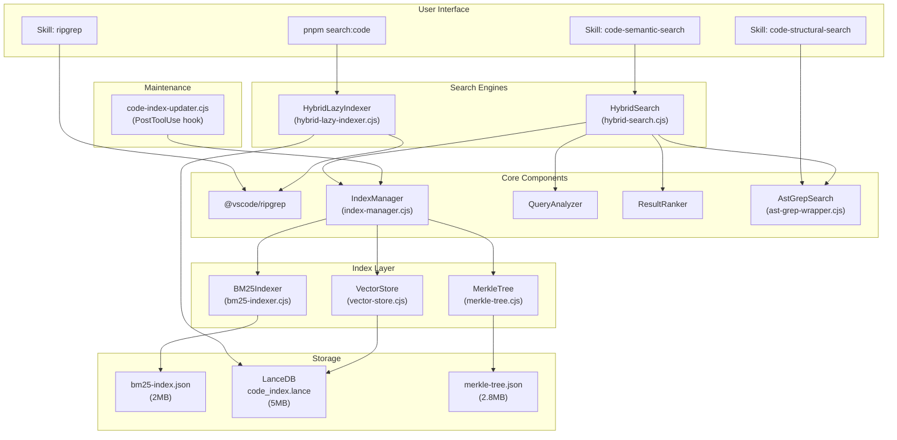

<!-- Agent: architect | Task: #49 | Session: 2026-02-09 -->

# Hybrid Search System Architecture Review

**Date:** 2026-02-09
**Agent:** Architect (Task #49)
**Status:** COMPLETE
**Severity:** MEDIUM (functional but underutilized)

---

## Executive Summary

The agent-studio hybrid search system is architecturally sound with two complementary subsystems, persistent indices (BM25 + LanceDB vector store), and automatic incremental updates via a PostToolUse hook. However, the system suffers from severe **underutilization**: only 10 of 49 agents (20%) reference search skills, and zero domain-specialist agents have search capabilities assigned. This creates a two-tier agent ecosystem where core agents can search code efficiently while domain specialists fall back to basic Grep/Glob.

---

## 1. Search Infrastructure Architecture

### 1.1 Two Subsystems (Dual Architecture)

The search infrastructure consists of two independent subsystems that serve different use cases:

#### Subsystem A: HybridLazyIndexer (CLI-oriented, instant)

**File:** `.claude/lib/code-indexing/hybrid-lazy-indexer.cjs` (701 lines)
**CLI:** `.claude/tools/cli/hybrid-search.cjs`
**Commands:** `pnpm search:code`, `pnpm search:structure`, `pnpm search:file`

**Architecture:**

```
User Query
    |
    v
[ripgrep search] -----> text results (always runs)
    |
    v
[LanceDB semantic search] ---> semantic results (optional, >10 char queries)
    |
    v
[Reciprocal Rank Fusion (RRF)] ---> fused results
    |
    v
Ranked Output
```

**Key characteristics:**

- Zero startup time (no batch indexing required)
- ripgrep via `@vscode/ripgrep` npm package (cross-platform)
- Optional semantic search via `@xenova/transformers` (MiniLM-L6-v2 model)
- LanceDB for vector storage (lazy-initialized)
- RRF scoring with configurable weights (text: 0.4, semantic: 0.6)
- 30-second in-memory cache for repeated queries
- Structural analysis: file tree, entry points, dependency graph, Mermaid diagrams

**Security:** Uses `spawnSync` with `shell: false` and array arguments (SEC-LIB-001 compliant).

#### Subsystem B: HybridSearch (Three-stage pipeline, programmatic)

**File:** `.claude/lib/code-indexing/hybrid-search.cjs` (173 lines)
**Components:** QueryAnalyzer + AstGrepSearch + ResultRanker

**Architecture:**

```
User Query
    |
    v
[QueryAnalyzer] ---> type, keywords, AST pattern, language, confidence
    |
    v
[Stage 1: Semantic Search] ---> IndexManager.semanticSearch()
    |
    v
[Stage 2: Structural Refinement] ---> ast-grep pattern matching
    |
    v
[Stage 3: ResultRanker] ---> combine, deduplicate, sort, filter
    |
    v
Ranked Output with timing
```

**Key characteristics:**

- Depends on IndexManager (requires pre-built index via `pnpm code:index:reindex`)
- Three-stage pipeline: semantic -> structural -> combination
- QueryAnalyzer: natural language -> AST pattern conversion (6 languages)
- ResultRanker: weighted combination (semantic: 0.7, structural: 0.3)
- Confidence threshold filtering (default: 0.3)
- Keyword boost and recency boost

### 1.2 Supporting Components

| Component          | File                             | Purpose                                                 |
| ------------------ | -------------------------------- | ------------------------------------------------------- |
| BM25Indexer        | `bm25-indexer.cjs` (291 lines)   | Okapi BM25 sparse lexical search with lazy IDF          |
| IndexManager       | `index-manager.cjs` (780+ lines) | Full index lifecycle: build, incremental update, search |
| CodeParser         | `code-parser.cjs`                | Tree-sitter AST parsing (JS, TS, Python, Go, Rust)      |
| SemanticChunker    | `semantic-chunker.cjs`           | Intelligent code chunking by AST boundaries             |
| EmbeddingGenerator | `embedding-generator.cjs`        | Dense vector generation (transformers/fastembed)        |
| VectorStore        | `vector-store.cjs`               | LanceDB wrapper with BM25-only mode guard               |
| MerkleTree         | `merkle-tree.cjs`                | O(log n) change detection for incremental updates       |
| QueryAnalyzer      | `query-analyzer.cjs`             | NL -> AST pattern with synonym expansion                |
| ResultRanker       | `result-ranker.cjs`              | Score combination, dedup, confidence filtering          |
| AstGrepSearch      | `ast-grep-wrapper.cjs`           | Structural search via `@ast-grep/cli`                   |

### 1.3 Index Persistence

| Index             | Path                                             | Size                   | Last Updated |
| ----------------- | ------------------------------------------------ | ---------------------- | ------------ |
| BM25 sparse index | `.claude/context/data/lancedb/bm25-index.json`   | 2.0 MB                 | 2026-02-06   |
| LanceDB vectors   | `.claude/context/data/lancedb/code_index.lance/` | ~5.1 MB (36 fragments) | 2026-02-06   |
| Merkle tree       | `.claude/context/code-index/merkle-tree.json`    | 2.8 MB                 | 2026-02-06   |
| Index metadata    | `.claude/context/code-index/metadata.json`       | 190 KB                 | 2026-02-06   |
| Checkpoint        | `.claude/context/code-index/checkpoint.json`     | 99 B                   | 2026-02-06   |

**Observation:** All indices were last updated on 2026-02-06, which is 3 days stale. The Merkle tree and checkpoint suggest the batch indexer ran once but has not been re-run since.

### 1.4 Automatic Index Maintenance

**Hook:** `.claude/hooks/routing/code-index-updater.cjs`
**Event:** PostToolUse(Edit|Write)
**Behavior:**

- Fires after any code file is written or edited
- Debounces rapid changes (5-second window)
- Uses Merkle tree for O(log n) incremental change detection
- Lock file prevents concurrent indexing
- Fail-open: errors logged but never block file operations
- Can be disabled: `CODE_INDEX_AUTO_UPDATE=off`

**Gap:** The hook triggers incremental updates via `IndexManager`, but the `HybridLazyIndexer` (used by `pnpm search:code`) is a completely separate system that does NOT benefit from these incremental updates. The hook updates the full index (BM25 + vectors), while the CLI tool uses ripgrep directly (no index needed for text, but semantic search depends on LanceDB which IS updated).

---

## 2. Search Skills

### 2.1 Skill Inventory

| Skill                    | Type         | Speed  | Accuracy | Backend                                |
| ------------------------ | ------------ | ------ | -------- | -------------------------------------- |
| `ripgrep`                | Text search  | <10ms  | ~70%     | `@vscode/ripgrep` binary               |
| `code-semantic-search`   | Hybrid       | <150ms | ~95%     | HybridSearch (IndexManager + ast-grep) |
| `code-structural-search` | AST patterns | <50ms  | 100%     | `@ast-grep/cli` via ast-grep-wrapper   |

### 2.2 Skill-to-Backend Mapping

```
Skill: ripgrep           --> @vscode/ripgrep binary (direct)
Skill: code-semantic-search  --> HybridSearch class (hybrid-search.cjs)
                              --> IndexManager (index-manager.cjs)
                              --> VectorStore (vector-store.cjs) --> LanceDB
                              --> AstGrepSearch (ast-grep-wrapper.cjs)
Skill: code-structural-search --> @ast-grep/cli binary (direct)
```

**CLI Commands (separate path):**

```
pnpm search:code "query"     --> HybridLazyIndexer (hybrid-lazy-indexer.cjs)
                              --> ripgrep (text) + LanceDB (semantic) + RRF fusion
pnpm search:structure        --> HybridLazyIndexer.analyzeStructure()
pnpm search:file path 1 50   --> HybridLazyIndexer.getFileContent()
```

### 2.3 Recommended Search Strategy (documented in CLAUDE.md and agent files)

1. **Broad Discovery**: `ripgrep` for fast keyword search
2. **Semantic Understanding**: `code-semantic-search` (hybrid mode) for meaning-based search
3. **Structural Refinement**: `code-structural-search` for exact AST patterns

---

## 3. Agent Integration Analysis

### 3.1 Agents WITH Search Skills

| Agent              | `ripgrep` | `code-semantic-search` | `code-structural-search` | `pnpm search:code` docs |
| ------------------ | --------- | ---------------------- | ------------------------ | ----------------------- |
| developer          | YES       | YES                    | YES                      | YES                     |
| architect          | YES       | YES                    | YES                      | YES                     |
| qa                 | YES       | YES                    | YES                      | NO                      |
| code-reviewer      | YES       | YES                    | YES                      | YES                     |
| code-simplifier    | YES       | YES                    | YES                      | NO                      |
| security-architect | YES       | YES                    | YES                      | NO                      |
| researcher         | YES       | YES                    | YES                      | NO                      |
| reverse-engineer   | YES       | YES                    | YES                      | NO                      |
| c4-code            | YES       | NO                     | YES                      | NO                      |

**Total: 9 agents (of 49) have at least one search skill.**

### 3.2 Agents WITHOUT Search Skills (Should Have)

| Agent                        | Why It Needs Search                                   | Missing Skills                                        |
| ---------------------------- | ----------------------------------------------------- | ----------------------------------------------------- |
| planner                      | Needs to understand existing codebase before planning | ripgrep, code-semantic-search                         |
| technical-writer             | Needs to find code references for documentation       | ripgrep, code-semantic-search                         |
| devops                       | Needs to find configuration patterns, Dockerfiles     | ripgrep                                               |
| devops-troubleshooter        | Needs to trace error patterns through codebase        | ripgrep, code-semantic-search                         |
| database-architect           | Needs to find existing schema/query patterns          | ripgrep, code-structural-search                       |
| typescript-pro               | Needs codebase-wide type analysis                     | ripgrep, code-semantic-search, code-structural-search |
| python-pro                   | Needs to find Python patterns and imports             | ripgrep, code-semantic-search, code-structural-search |
| frontend-pro                 | Needs to find component patterns                      | ripgrep, code-semantic-search, code-structural-search |
| nodejs-pro                   | Needs to find API patterns, middleware                | ripgrep, code-semantic-search, code-structural-search |
| incident-responder           | Needs rapid log/error pattern tracing                 | ripgrep                                               |
| All other domain agents (13) | Needs codebase exploration for domain-specific tasks  | ripgrep (minimum)                                     |

### 3.3 Skill Catalog Gaps

The skill catalog (`skill-catalog.md`) lists search skills but assigns them to only 2-3 agents:

| Skill                    | Catalog Assignment       | Actual Assignment |
| ------------------------ | ------------------------ | ----------------- |
| `ripgrep`                | developer, code-reviewer | 9 agents          |
| `code-semantic-search`   | developer, architect     | 8 agents          |
| `code-structural-search` | developer, code-reviewer | 8 agents          |

**Gap:** The catalog is outdated -- it shows 2-3 assignments while the actual agent files show 8-9. But even the actual assignment leaves 40 agents without any search capabilities.

### 3.4 Routing Table Gaps

The routing table (`routing-table.cjs`) has **zero search-specific routing keywords**. There is no mechanism to route "search for X in the codebase" to a specialist. Currently such requests would fall through to the developer agent (last resort), which is correct but not explicit.

---

## 4. Architecture Diagram



---

## 5. Identified Gaps and Issues

### 5.1 CRITICAL: 80% of Agents Lack Search Skills

**Impact:** 40 of 49 agents cannot efficiently search the codebase. They fall back to basic Grep/Glob which is slower, less accurate, and cannot perform semantic search.

**Affected categories:**

- ALL 22 domain agents (0% search coverage)
- 5 specialized agents (devops, devops-troubleshooter, database-architect, incident-responder, conductor-validator)
- 2 core agents (planner, technical-writer)

**Recommendation:** Add `ripgrep` skill to ALL agents that have Bash tool access. Add `code-semantic-search` and `code-structural-search` to agents that frequently explore codebases (all domain-pro agents, planner, database-architect).

### 5.2 HIGH: Dual Search Subsystems Not Unified

**Impact:** The `HybridLazyIndexer` (CLI) and `HybridSearch` (programmatic) are separate implementations with different scoring algorithms, different backends, and different feature sets. This creates confusion about which system agents should use.

**Differences:**

| Aspect      | HybridLazyIndexer (CLI)      | HybridSearch (Programmatic)    |
| ----------- | ---------------------------- | ------------------------------ |
| Scoring     | RRF (Reciprocal Rank Fusion) | Weighted average               |
| Text search | ripgrep (real-time)          | BM25 (pre-indexed)             |
| Semantic    | @xenova/transformers (lazy)  | IndexManager vectors           |
| Structural  | None                         | ast-grep refinement            |
| Startup     | 0 seconds                    | Requires pre-built index       |
| Weights     | text: 0.4, semantic: 0.6     | semantic: 0.7, structural: 0.3 |

**Recommendation:** Document the distinction clearly. The CLI system (`pnpm search:code`) is the recommended entry point for ad-hoc search. The programmatic system (`HybridSearch`) is for agents that need AST-aware structural refinement.

### 5.3 MEDIUM: Stale Indices (3 days old)

**Impact:** The BM25 index, LanceDB vectors, and Merkle tree were all last updated on 2026-02-06. While the `code-index-updater` hook should trigger incremental updates, the data shows no updates in 3 days despite active development.

**Possible causes:**

1. Hook may not be firing (check settings.json registration)
2. Incremental updates may be silently failing (fail-open design)
3. The full index (`pnpm code:index:reindex`) may need manual re-run
4. The hook requires an existing `metadata.json` to operate; if the index was never fully built, the hook returns early

**Recommendation:** Add an automated health check that warns when indices are older than 24 hours. Consider adding a session-start hook or pre-prompt hook that validates index freshness.

### 5.4 MEDIUM: Skill Catalog Out of Date

**Impact:** The skill catalog shows search skills assigned to 2-3 agents, but actual agent definitions show 8-9 agents. This discrepancy means the catalog is not reliable as a source of truth.

**Recommendation:** Regenerate the skill catalog from actual agent definitions (`pnpm skills:index`).

### 5.5 LOW: No Search-First Protocol

**Impact:** No workflow or protocol requires agents to search the codebase before modifying it. Agents may create duplicate code or modify the wrong files because they did not search first.

**Recommendation:** Consider adding a "search-first" pattern to the developer workflow: before implementing, always run `pnpm search:code` or `Skill({ skill: 'ripgrep' })` to understand existing patterns.

### 5.6 LOW: BM25-Only Mode Default

**Impact:** The `index.cjs` entry point defaults to `LANCEDB_EMBEDDING_MODE=off` (BM25-only mode) to avoid async pipeline OOM. This means the full IndexManager pipeline runs without dense vectors unless explicitly overridden.

**Recommendation:** This is a correct trade-off for stability. Document that `LANCEDB_EMBEDDING_MODE=hybrid` can be set for environments with sufficient memory (8GB+) to enable dense vector search alongside BM25.

---

## 6. Strengths

1. **Well-engineered search infrastructure**: Two complementary systems, each well-designed for its use case
2. **Security-hardened**: `shell: false` with array arguments for all process spawning (SEC-LIB-001)
3. **Memory-safe**: BM25-only mode default prevents OOM; IndexManager has dynamic memory limits based on system resources
4. **Cross-platform**: `@vscode/ripgrep` and `@ast-grep/cli` npm packages handle binary management
5. **Incremental updates**: Merkle tree enables O(log n) change detection
6. **Fail-open design**: Index maintenance never blocks file operations
7. **Core agent integration excellent**: developer, architect, code-reviewer have comprehensive search documentation with usage examples and strategy guides
8. **Lazy initialization**: LanceDB and embedding model loaded on-demand, not at startup

---

## 7. Recommendations Summary

| Priority | Issue                       | Recommendation                                                                          | Effort                   |
| -------- | --------------------------- | --------------------------------------------------------------------------------------- | ------------------------ |
| P1       | 80% agents lack search      | Add `ripgrep` to all agents with Bash; add semantic+structural to all domain-pro agents | Medium (22+ agent files) |
| P2       | Stale indices               | Add index freshness check; document re-index procedure                                  | Low                      |
| P2       | Skill catalog outdated      | Regenerate via `pnpm skills:index`                                                      | Low                      |
| P3       | Dual systems not documented | Add architecture docs explaining when to use CLI vs programmatic search                 | Low                      |
| P3       | No search-first protocol    | Add search step to developer workflow                                                   | Low                      |
| P3       | BM25-only mode              | Document `LANCEDB_EMBEDDING_MODE=hybrid` for high-memory environments                   | Low                      |

---

### BACKWARD_PROPAGATION

**Pattern**: Search skill assignment inconsistency across agent definitions. Core agents (developer, architect, code-reviewer) have comprehensive search integration (3 skills + CLI documentation), while 40/49 agents have zero search capabilities.

**Proposed Artifact**: workflow:search-first-protocol

**Affected Components**: [developer, architect, qa, code-reviewer, code-simplifier, security-architect, researcher, reverse-engineer, planner, technical-writer, devops, devops-troubleshooter, database-architect, typescript-pro, python-pro, frontend-pro, nodejs-pro, and 22 more domain agents]

**Architectural Rationale**: Standardizing search skill assignment ensures all agents can efficiently explore codebases before modifying them. The current state creates a capability gap where domain specialists (who are spawned specifically for their expertise) cannot leverage the project's own search infrastructure. This leads to slower task completion and potential duplicate code creation.

**Impact Radius**: 40+ agents (out of 49 total)

**Priority**: P2 (architectural improvement -- functional but underoptimized)
