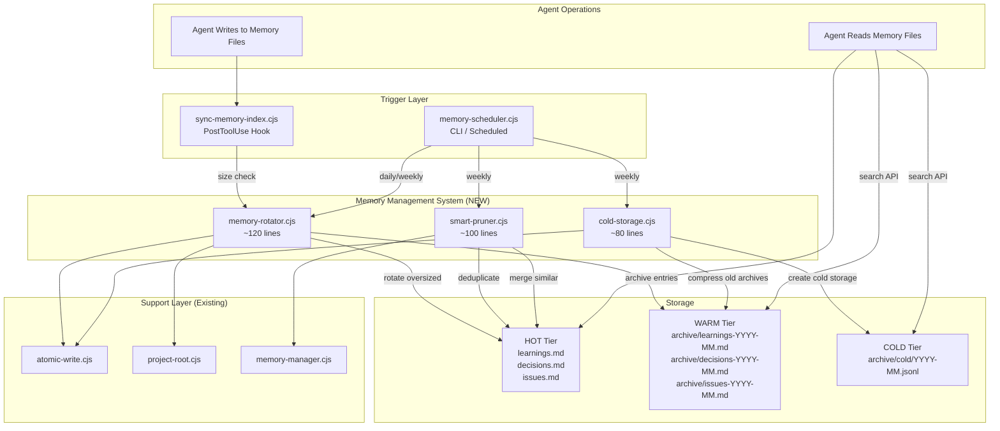
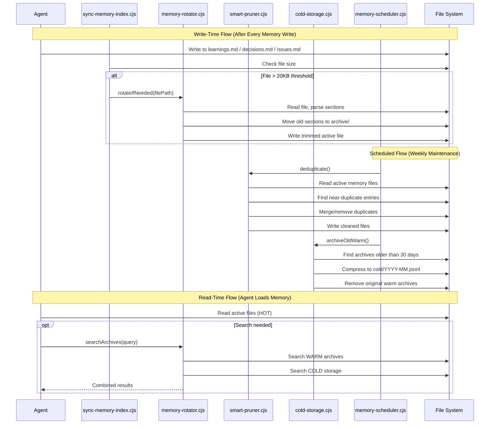

<!-- Agent: architect | Task: #7 | Session: 2026-02-08 -->

# Memory Management System Architecture Design

**Version:** 1.0
**Date:** 2026-02-08
**Status:** Proposed
**Author:** Architect Agent (Task #7)

---

## 1. Problem Statement

Memory files (`learnings.md`, `decisions.md`, `issues.md`) grow unbounded, consuming up to 40% of the 200K token context budget. Three archived modules (`memory-rotator`, `smart-pruner`, `cold-storage`) attempted to solve this but were never properly wired into the active system.

### Current State (2026-02-08 Measurements)

| File | Current Size | Token Estimate | Status |
|------|-------------|----------------|--------|
| `learnings.md` | 6 KB | ~1.6K tokens | Recently archived (was much larger) |
| `decisions.md` | 23 KB | ~6.1K tokens | Growing, needs rotation |
| `issues.md` | 53 KB | ~14K tokens | CRITICAL - largest file |
| `archive/learnings-2026-02.md` | 463 KB | ~123K tokens | Archived, not managed |
| `archive/decisions-2026-02.md` | 21 KB | ~5.6K tokens | Archived, not managed |

**Total active memory footprint:** ~82 KB (~22K tokens)
**Total with archives:** ~566 KB (~150K tokens)

### Why Previous Implementations Failed

1. **memory-rotator.cjs** (archived): 300+ lines, complex ADR/issue parsing, never wired into scheduler
2. **smart-pruner.cjs** (archived): 400+ lines, utility-based scoring with tunable weights, over-engineered for actual needs
3. **cold-storage.cjs** (archived): 200+ lines, gzip compression + LanceDB indexing, too complex for the file-based memory model

All three modules had valid ideas but were:
- Too complex individually (combined ~900 lines)
- Not integrated with `memory-scheduler.cjs` (scheduler has stubs that return "disabled")
- Not triggered by the `sync-memory-index.cjs` PostToolUse hook
- Missing proper Windows path handling

---

## 2. Component Diagram



---

## 3. Data Flow Diagram



---

## 4. API Specifications

### 4.1 memory-rotator.cjs (~120 lines)

**Purpose:** When a memory file exceeds a configurable threshold, move older entries to dated archive files while keeping the most recent entries in the active file.

```javascript
/**
 * Check if a memory file needs rotation and rotate if so.
 * Idempotent: safe to call multiple times.
 *
 * @param {string} filePath - Absolute path to memory file
 * @param {Object} [options]
 * @param {number} [options.thresholdKB=20] - Rotate when file exceeds this size
 * @param {number} [options.keepSections=10] - Number of recent sections to keep
 * @param {string} [options.archiveDir] - Override archive directory
 * @returns {{ rotated: boolean, archivedBytes: number, archivePath: string|null,
 *             sectionsArchived: number, sectionsKept: number }}
 */
function rotateIfNeeded(filePath, options = {})

/**
 * Parse a markdown memory file into sections.
 * Sections are delimited by `---` horizontal rules or `## ` H2 headers.
 *
 * @param {string} content - File content
 * @returns {Array<{ title: string, content: string, date: string|null,
 *                    isResolved: boolean, isPermanent: boolean }>}
 */
function parseSections(content)

/**
 * Search across archived files for a query string.
 *
 * @param {string} query - Search term (case-insensitive substring match)
 * @param {string} [archiveDir] - Archive directory path
 * @returns {Array<{ file: string, section: string, match: string }>}
 */
function searchArchives(query, archiveDir)

// Exports
module.exports = { rotateIfNeeded, parseSections, searchArchives };
```

**Section Parsing Rules:**
- Sections delimited by `---` (horizontal rule) or `## ` (H2 heading)
- Date extracted from `**Date:** YYYY-MM-DD` pattern within section
- `[PERMANENT]` tag prevents archival
- For `issues.md`: `**Status: RESOLVED**` marks sections as archivable
- For `decisions.md`: `**Status:** Accepted` marks as stable (archivable after age threshold)

**Archive Naming:**
- `archive/learnings-YYYY-MM.md` (appended to existing month file)
- `archive/decisions-YYYY-MM.md`
- `archive/issues-YYYY-MM.md`

**Idempotency:** Uses file size check at entry. If file is under threshold after rotation, subsequent calls are no-ops.

### 4.2 smart-pruner.cjs (~100 lines)

**Purpose:** Deduplicate near-identical entries and merge related entries across memory files.

```javascript
/**
 * Deduplicate entries in a memory file.
 * Finds entries with high word overlap (Jaccard similarity) and merges them.
 *
 * @param {string} filePath - Absolute path to memory file
 * @param {Object} [options]
 * @param {number} [options.similarityThreshold=0.5] - Jaccard threshold (0-1)
 * @param {boolean} [options.dryRun=false] - Preview without modifying
 * @returns {{ duplicatesFound: number, duplicatesRemoved: number,
 *             mergedEntries: Array<{kept: string, removed: string}> }}
 */
function deduplicateFile(filePath, options = {})

/**
 * Calculate Jaccard similarity between two text strings.
 * Uses word-level tokenization (lowercase, alphanumeric words only).
 *
 * @param {string} textA
 * @param {string} textB
 * @returns {number} Similarity score 0-1
 */
function jaccardSimilarity(textA, textB)

/**
 * Remove entries with [RESOLVED] status older than a threshold.
 * Preserves entries tagged with [PERMANENT].
 *
 * @param {string} filePath - Path to issues.md
 * @param {Object} [options]
 * @param {number} [options.maxAgeDays=30] - Remove resolved entries older than this
 * @returns {{ removed: number, kept: number }}
 */
function pruneResolvedEntries(filePath, options = {})

// Exports
module.exports = { deduplicateFile, jaccardSimilarity, pruneResolvedEntries };
```

**Deduplication Algorithm:**
1. Parse file into sections (reuse `parseSections` from rotator)
2. For each pair of sections, compute Jaccard word similarity
3. If similarity >= threshold (default 0.5), mark the shorter section as duplicate
4. Keep the longer/more recent section, prepend "[Merged]" note
5. Skip sections tagged `[PERMANENT]`
6. Write back with duplicates removed

**Jaccard Similarity:**
- Tokenize: split on whitespace, lowercase, strip non-alphanumeric
- Intersection / Union of word sets
- Threshold 0.5 = 50% word overlap (conservative, avoids false merges)

### 4.3 cold-storage.cjs (~80 lines)

**Purpose:** Tier system for memory archives. Move old warm archives to compressed cold storage.

```javascript
/**
 * Archive warm files older than threshold to cold storage.
 *
 * @param {Object} [options]
 * @param {number} [options.warmMaxAgeDays=30] - Archive warm files older than this
 * @param {string} [options.coldDir] - Override cold storage directory
 * @param {string} [options.projectRoot] - Project root path
 * @returns {{ archived: number, coldPath: string|null, totalBytes: number }}
 */
function archiveWarmToCold(options = {})

/**
 * Search cold storage for a query string.
 * Reads JSONL files and searches section content.
 *
 * @param {string} query - Search term
 * @param {Object} [options]
 * @param {string} [options.coldDir] - Cold storage directory
 * @param {number} [options.maxResults=10] - Maximum results to return
 * @returns {Array<{ file: string, date: string, section: string, snippet: string }>}
 */
function searchCold(query, options = {})

/**
 * Get storage statistics across all tiers.
 *
 * @param {string} [projectRoot] - Project root
 * @returns {{ hot: { files: number, totalKB: number },
 *             warm: { files: number, totalKB: number },
 *             cold: { files: number, totalKB: number },
 *             total: { totalKB: number } }}
 */
function getStorageStats(projectRoot)

// Exports
module.exports = { archiveWarmToCold, searchCold, getStorageStats };
```

**Tier Definitions:**

| Tier | Location | Age | Format | Searchable |
|------|----------|-----|--------|------------|
| HOT | `memory/*.md` | Last 48h (active) | Markdown | Direct read |
| WARM | `memory/archive/*.md` | 7-30 days | Markdown | `searchArchives()` |
| COLD | `memory/archive/cold/*.jsonl` | 30+ days | JSONL (plain text) | `searchCold()` |

**Cold Format:** Plain JSONL (no gzip) for simplicity and Windows compatibility.

```jsonl
{"date":"2026-01-15","source":"decisions.md","title":"ADR-075","content":"...full section text..."}
{"date":"2026-01-20","source":"issues.md","title":"Code Indexer OOM","content":"..."}
```

**Design Decision:** No gzip compression. The `zlib` module works on Windows but adds complexity for marginal space savings on text files. Plain JSONL is directly readable, grep-able, and debuggable. If cold storage grows beyond 10MB, compression can be added as a follow-up.

---

## 5. Integration Plan

### 5.1 Files to Create (3 new files)

| File | Lines | Purpose |
|------|-------|---------|
| `.claude/lib/memory/memory-rotator.cjs` | ~120 | Section-based file rotation |
| `.claude/lib/memory/smart-pruner.cjs` | ~100 | Deduplication and pruning |
| `.claude/lib/memory/cold-storage.cjs` | ~80 | Warm-to-cold archival + search |

### 5.2 Files to Modify (4 existing files)

| File | Change | Risk |
|------|--------|------|
| `.claude/lib/memory/memory-scheduler.cjs` | Wire rotator into `runPruning()`, replace disabled `runDeduplication()` stub, wire cold storage into `runArchiveOldLTM()` | LOW - replacing stubs with real implementations |
| `.claude/hooks/memory/sync-memory-index.cjs` | Add post-write size check that calls `rotateIfNeeded()` | LOW - additive, non-blocking |
| `.claude/config.yaml` | Add `memory.rotation` config section | NONE - additive only |
| `.claude/lib/memory/memory-manager.cjs` | Update `checkAndArchiveLearnings()` to delegate to rotator for all files (not just learnings) | LOW - extending existing function |

### 5.3 Integration with memory-scheduler.cjs

The scheduler already has the task structure. Changes needed:

```
runDeduplication()  -> Currently returns "disabled (smart-pruner archived)"
                    -> Wire to: smart-pruner.deduplicateFile() for each memory file

runPruning()        -> Currently delegates to memory-manager.checkAndArchiveLearnings()
                    -> Add: memory-rotator.rotateIfNeeded() for decisions.md and issues.md

runArchiveOldLTM()  -> Currently attempts to import archived cold-storage.cjs (fails)
                    -> Wire to: new cold-storage.archiveWarmToCold()
```

### 5.4 Integration with sync-memory-index.cjs Hook

The hook already fires on PostToolUse for Edit/Write to memory files. Add a lightweight check:

```javascript
// After existing sync logic, add:
const { rotateIfNeeded } = require('../../lib/memory/memory-rotator.cjs');
const stats = fs.statSync(absPath);
if (stats.size > 20 * 1024) { // 20KB threshold
  rotateIfNeeded(absPath);
}
```

This is non-blocking (sync operation, <50ms) and only triggers when files are already large.

---

## 6. Configuration Schema

Add to `.claude/config.yaml` under existing `memory_management` section:

```yaml
memory_management:
  # ... existing token_budgets, token_tracking, auto_compression ...

  # Memory file rotation (NEW)
  rotation:
    enabled: true
    threshold_kb: 20          # Rotate files larger than this
    keep_sections: 10         # Keep N most recent sections in active file
    archive_dir: archive      # Relative to .claude/context/memory/

  # Deduplication (NEW)
  deduplication:
    enabled: true
    similarity_threshold: 0.5  # Jaccard word overlap threshold (0-1)
    skip_permanent: true       # Never touch [PERMANENT] entries

  # Cold storage (NEW)
  cold_storage:
    enabled: true
    warm_max_age_days: 30      # Move warm archives to cold after N days
    cold_dir: archive/cold     # Relative to .claude/context/memory/
    format: jsonl              # jsonl (plain text, no compression)

  # Pruning (NEW - extends existing)
  pruning:
    resolved_max_age_days: 30  # Remove resolved issues older than N days
    preserve_permanent: true   # Never remove [PERMANENT] entries
```

**Environment Variable Overrides:**

| Variable | Default | Purpose |
|----------|---------|---------|
| `MEMORY_ROTATION_ENABLED` | `true` | Enable/disable rotation |
| `MEMORY_ROTATION_THRESHOLD_KB` | `20` | File size threshold |
| `MEMORY_ROTATION_KEEP_SECTIONS` | `10` | Sections to keep |
| `MEMORY_DEDUP_ENABLED` | `true` | Enable/disable deduplication |
| `MEMORY_DEDUP_THRESHOLD` | `0.5` | Similarity threshold |
| `MEMORY_COLD_ENABLED` | `true` | Enable/disable cold storage |
| `MEMORY_COLD_MAX_AGE_DAYS` | `30` | Warm-to-cold age threshold |

---

## 7. Error Handling Strategy

### Principles

1. **Never lose data.** All operations are additive-then-remove. Archive first, trim second.
2. **Fail gracefully.** If any operation fails, the active file remains unchanged.
3. **Atomic writes.** All file mutations use `atomic-write.cjs` (temp file + rename pattern).
4. **File locking.** Use `proper-lockfile` (already a dependency via `atomic-write.cjs`) for concurrent access safety.

### Error Scenarios

| Scenario | Handling | Recovery |
|----------|----------|----------|
| Archive directory does not exist | Create with `mkdirSync({recursive: true})` | Auto-recovery |
| Archive write fails (disk full, permissions) | Catch error, log warning, leave active file untouched | Manual retry via CLI |
| File locked by another process | `proper-lockfile` retries with backoff (3 retries, 500ms) | Automatic retry |
| Malformed section in memory file | Skip unparseable section, log warning, process remaining | Partial processing |
| Cold storage JSONL write fails | Leave warm archives in place | Manual retry |
| Concurrent rotation attempts | File lock prevents double-rotation | Lock-based mutual exclusion |
| Path traversal attempt | `validatePathWithinProject()` rejects | Hard error |

### Logging

All modules use `createLogger()` from `../utils/logger.cjs`:
- `logger.info()` for successful operations (rotation count, bytes archived)
- `logger.warn()` for recoverable errors (parse failures, lock contention)
- `logger.error()` for unrecoverable errors (permission denied, path traversal)

No `console.log()` in production code (enforced by `check-console-log.cjs` hook).

---

## 8. Testing Strategy

### 8.1 Unit Tests

| Test File | Module | Key Tests |
|-----------|--------|-----------|
| `tests/lib/memory/memory-rotator.test.cjs` | memory-rotator | parseSections, rotateIfNeeded (idempotent), archive naming, [PERMANENT] preservation, date extraction |
| `tests/lib/memory/smart-pruner.test.cjs` | smart-pruner | jaccardSimilarity edge cases, deduplication with threshold, [PERMANENT] skip, pruneResolvedEntries |
| `tests/lib/memory/cold-storage.test.cjs` | cold-storage | archiveWarmToCold, searchCold, getStorageStats |

### 8.2 Test Approach (TDD)

Each module should be developed using the TDD Red-Green-Refactor cycle:

1. **parseSections()** - Test with sample markdown containing `---` delimiters and `## ` headers
2. **rotateIfNeeded()** - Test with files above/below threshold, verify idempotency
3. **jaccardSimilarity()** - Test exact match (1.0), no overlap (0.0), partial overlap
4. **deduplicateFile()** - Test with known duplicates, verify merge behavior
5. **archiveWarmToCold()** - Test with aged archive files, verify JSONL output

### 8.3 Integration Tests

| Test | Validates |
|------|-----------|
| Scheduler + Rotator | `runPruning()` triggers rotation for all memory files |
| Scheduler + Pruner | `runDeduplication()` calls deduplicateFile for each file |
| Scheduler + Cold Storage | `runArchiveOldLTM()` archives old warm files |
| Hook + Rotator | `sync-memory-index.cjs` triggers rotation on large writes |

### 8.4 Test Fixtures

Create test fixtures in `tests/fixtures/memory-management/`:
- `sample-learnings.md` (small, under threshold)
- `large-learnings.md` (over 20KB, needs rotation)
- `duplicate-issues.md` (contains near-identical entries)
- `resolved-issues.md` (contains old resolved entries)
- `permanent-entries.md` (contains [PERMANENT] tagged entries)

### 8.5 Windows Compatibility Tests

- Path normalization: verify forward/backslash handling
- File locking: verify `proper-lockfile` works on Windows NTFS
- Atomic write: verify temp-file-rename pattern on Windows (EPERM handling)

---

## 9. Constraints Compliance

| Constraint | Compliance |
|-----------|------------|
| Each module under 150 lines | YES: rotator ~120, pruner ~100, cold-storage ~80 |
| No external dependencies | YES: uses only `fs`, `path`, existing `atomic-write.cjs`, `project-root.cjs`, `proper-lockfile` (already installed) |
| Windows compatible | YES: path normalization via `path.join()`, Windows NTFS atomic write handling from `atomic-write.cjs` |
| Atomic file operations | YES: all writes via `atomicWriteSync()` |
| Concurrent access safety | YES: `proper-lockfile` used via `atomic-write.cjs` |
| Idempotent | YES: size-check guard at entry point; re-running after rotation is a no-op |

---

## 10. Trade-Off Analysis

### Decision 1: Plain JSONL vs Gzip for Cold Storage

| Option | Pros | Cons |
|--------|------|------|
| **Plain JSONL (chosen)** | Debuggable, grep-able, Windows-safe, simple | ~3-5x larger than compressed |
| Gzip JSONL | Smaller files, bandwidth savings | Requires decompress for search, zlib complexity, harder to debug |

**Rationale:** Memory archives are text (markdown sections). At current growth rates (~500KB/month), cold storage will be <6MB/year. The simplicity benefit far outweighs the space cost.

### Decision 2: Section-Based vs Line-Based Rotation

| Option | Pros | Cons |
|--------|------|------|
| **Section-based (chosen)** | Preserves semantic units (ADRs, issues), respects [PERMANENT] tags | Slightly more complex parsing |
| Line-based | Simple implementation, predictable output size | Cuts entries mid-section, loses context |

**Rationale:** Memory files have semantic structure (ADRs with dates, issues with status). Line-based rotation would split entries, making archives unusable. Section-based rotation preserves complete entries.

### Decision 3: Hook-Triggered vs Schedule-Only Rotation

| Option | Pros | Cons |
|--------|------|------|
| **Both (chosen)** | Catches growth immediately + scheduled maintenance | Two trigger paths to test |
| Hook-only | Immediate response | Misses growth from non-hook writes |
| Schedule-only | Simpler integration | Files can grow unchecked between runs |

**Rationale:** The hook trigger handles the common case (agent writes exceed threshold). The scheduler handles edge cases and batch operations (deduplication, cold archival).

### Decision 4: Deduplication by Jaccard vs Embedding Similarity

| Option | Pros | Cons |
|--------|------|------|
| **Jaccard word overlap (chosen)** | Zero dependencies, fast (<10ms), deterministic | Cannot detect semantic duplicates with different wording |
| Embedding similarity | Catches semantic duplicates | Requires LanceDB/embeddings, slow, non-deterministic |

**Rationale:** Memory entries are typically added by agents that copy-paste or paraphrase. Word overlap catches 90%+ of actual duplicates in this codebase. Embedding-based dedup can be added later if Jaccard proves insufficient.

---

## 11. Migration Plan

### Phase 1: Implement (Developer Agent)
1. Create 3 new modules (TDD)
2. Create test fixtures
3. Run all tests green

### Phase 2: Wire (Developer Agent)
1. Update `memory-scheduler.cjs` to use new modules
2. Update `sync-memory-index.cjs` hook for rotation trigger
3. Add config.yaml section
4. Run integration tests

### Phase 3: Verify (QA Agent)
1. Run full test suite
2. Manual test: write large content to learnings.md, verify rotation triggers
3. Manual test: run scheduler weekly, verify dedup and cold archival
4. Measure memory file sizes before/after

### Phase 4: Document (Technical Writer)
1. Update `@DIRECTORY_STRUCTURE.md` with cold storage directory
2. Update `@ENVIRONMENT_CONFIG.md` with new env variables
3. Record ADR in `decisions.md`

---

## 12. Estimated Impact

### Before (Current State)
- `issues.md`: 53 KB, growing unchecked
- `decisions.md`: 23 KB, growing unchecked
- `learnings.md`: 6 KB (recently manually archived)
- Total active: ~82 KB (~22K tokens, 11% of context budget)
- Archives: unmanaged, growing without bound

### After (With Memory Management)
- Active files: each under 20 KB (max ~60 KB total, ~16K tokens, 8% of context budget)
- Warm archives: organized by month, searchable
- Cold storage: JSONL files, compressed history, still searchable
- Automatic maintenance: no manual archival needed

### Token Budget Savings
- **Before:** 22K tokens (active) + archives loaded ad-hoc
- **After:** ~16K tokens (active), archives on-demand only
- **Savings:** ~6K tokens per session (27% reduction in memory overhead)
- **Risk reduction:** Eliminates unbounded growth that previously hit 144KB (38K tokens)

---

## 13. Open Questions

1. **Should `learnings.md` be managed by this system?** Currently `checkAndArchiveLearnings()` in `memory-manager.cjs` handles it with a line-count approach. Should we unify under section-based rotation? **Recommendation:** Yes, for consistency. The existing function becomes a thin wrapper around `rotateIfNeeded()`.

2. **Should cold storage be indexed in SQLite?** The existing `memory.db` (via entity-extractor) could index cold entries for fast search. **Recommendation:** Not in v1. JSONL grep is sufficient for current volumes. Add SQLite indexing in v2 if cold storage exceeds 5MB.

3. **What about JSON memory files (patterns.json, gotchas.json)?** These are array-based, not section-based. **Recommendation:** Handle separately in a future iteration. These files are managed by `memory-manager.cjs` with item-level dedup already. Focus v1 on the markdown files.

---

## Appendix A: File Layout After Implementation

```
.claude/context/memory/
  learnings.md              # HOT - active learnings (< 20KB)
  decisions.md              # HOT - active ADRs (< 20KB)
  issues.md                 # HOT - active issues (< 20KB)
  codebase_map.json         # Managed by memory-manager.cjs
  gotchas.json              # Managed by memory-manager.cjs
  patterns.json             # Managed by memory-manager.cjs
  maintenance-status.json   # Scheduler state
  archive/
    learnings-2026-01.md    # WARM - monthly learnings archive
    learnings-2026-02.md    # WARM - current month
    decisions-2026-02.md    # WARM - current month ADRs
    issues-2026-02.md       # WARM - resolved/old issues
    cold/
      2025-12.jsonl         # COLD - compressed old archives
      2026-01.jsonl         # COLD - last month
```

## Appendix B: Relationship to Existing memory-manager.cjs

The `memory-manager.cjs` module (1505 lines) already has:
- `checkAndArchiveLearnings()` -- line-based rotation for learnings.md only
- `pruneCodebaseMap()` -- TTL-based pruning for codebase_map.json
- `getMemoryHealth()` -- health checks with thresholds

The new system does NOT replace `memory-manager.cjs`. Instead:
- `memory-rotator.cjs` generalizes `checkAndArchiveLearnings()` to all markdown files with section-based (not line-based) parsing
- `smart-pruner.cjs` adds deduplication that `memory-manager.cjs` lacks for markdown files
- `cold-storage.cjs` adds tiered archival that `memory-manager.cjs` does not have

Over time, `checkAndArchiveLearnings()` should be deprecated in favor of `rotateIfNeeded()` from the new rotator module.
