<!-- Agent: architect | Task: #microservices-migration | Session: 2026-02-08 -->

# Monolith-to-Microservices Migration Architecture

**Version:** 1.0.0
**Date:** 2026-02-08
**Status:** Reference Architecture
**Author:** Architect Agent (Claude Opus 4.6)

---

## Table of Contents

1. [Current State Assessment Framework](#1-current-state-assessment-framework)
2. [Migration Strategy](#2-migration-strategy)
3. [Target Architecture](#3-target-architecture)
4. [Infrastructure and DevOps](#4-infrastructure-and-devops)
5. [Cross-Cutting Concerns](#5-cross-cutting-concerns)
6. [Risk Mitigation](#6-risk-mitigation)
7. [Decision Framework](#7-decision-framework)
8. [Appendix: Checklists and Templates](#8-appendix-checklists-and-templates)

---

## 1. Current State Assessment Framework

Before writing a single line of migration code, you must understand what you are migrating. The assessment phase is non-negotiable and typically takes 2-6 weeks depending on monolith size.

### 1.1 Bounded Context Identification

Use Domain-Driven Design (DDD) event storming to discover natural service boundaries.

**Step 1: Event Storming Workshop (2-3 days)**

Gather domain experts, developers, and product owners. On a long wall of sticky notes, map:

- **Domain Events** (orange): Things that happen -- "OrderPlaced", "PaymentProcessed", "UserRegistered"
- **Commands** (blue): Actions that trigger events -- "PlaceOrder", "ProcessPayment"
- **Aggregates** (yellow): Clusters of entities that change together -- "Order + OrderItems", "User + Profile"
- **Bounded Contexts** (pink boundaries): Natural groupings where language and models are consistent

**Step 2: Context Map**

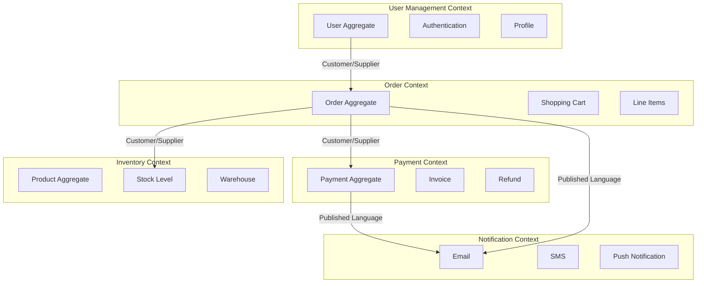

**Step 3: Relationship Classification**

For each boundary pair, classify the relationship:

| Relationship              | Description                               | Migration Implication                              |
| ------------------------- | ----------------------------------------- | -------------------------------------------------- |
| **Shared Kernel**         | Two contexts share a common model         | Must be extracted first or kept temporarily shared |
| **Customer/Supplier**     | One context depends on another's output   | Supplier should be extracted before customer       |
| **Conformist**            | Downstream blindly follows upstream model | Downstream can be extracted independently          |
| **Anti-Corruption Layer** | Downstream translates upstream model      | Natural service boundary -- extract with ACL       |
| **Published Language**    | Shared schema (events, APIs)              | Keep stable during migration                       |

### 1.2 Dependency Mapping Approach

**Static Analysis**

1. **Code-level dependencies**: Use tools like `jdepend` (Java), `madge` (Node.js), `pydeps` (Python), or `deptree` (.NET) to generate import/call graphs
2. **Database-level dependencies**: Map which code modules read/write which tables. A single table accessed by 5+ modules is a "gravity well" that resists decomposition
3. **Shared library dependencies**: Identify utility libraries used across modules -- these become candidates for shared packages or duplication

**Runtime Analysis**

1. **Distributed tracing** (even in a monolith): Instrument with OpenTelemetry to map actual call paths under production load
2. **Database query logs**: Capture 1 week of production queries, group by module/table to find actual data access patterns (not just what code _could_ access)
3. **API call frequency**: Log inter-module method calls to identify hot paths (high-frequency calls that will become expensive network calls)

**Output: Dependency Matrix**

| Module            | Users | Orders | Payments | Inventory | Notifications |
| ----------------- | ----- | ------ | -------- | --------- | ------------- |
| **Users**         | --    | R      | --       | --        | W             |
| **Orders**        | R     | --     | RW       | R         | W             |
| **Payments**      | R     | R      | --       | --        | W             |
| **Inventory**     | --    | R      | --       | --        | --            |
| **Notifications** | R     | R      | R        | --        | --            |

R = reads from, W = writes to, RW = both

### 1.3 Data Ownership Analysis

For every database table, answer three questions:

1. **Who is the single authoritative writer?** If multiple modules write to the same table, that table must be assigned to exactly one service (or split)
2. **Who are the readers?** Readers become consumers of the owning service's API or events
3. **What is the consistency requirement?** Strong consistency (same-transaction) vs eventual consistency (events)

**Data Ownership Decision Table**

| Table       | Current Writers      | Assigned Owner    | Reader Services                 | Consistency                          |
| ----------- | -------------------- | ----------------- | ------------------------------- | ------------------------------------ |
| `users`     | Auth, Admin, Profile | User Service      | Orders, Payments, Notifications | Strong (auth), Eventual (profile)    |
| `orders`    | Checkout, Admin      | Order Service     | Payments, Inventory, Analytics  | Strong (creation), Eventual (status) |
| `payments`  | Checkout, Refund     | Payment Service   | Orders, Notifications           | Strong                               |
| `products`  | Catalog, Inventory   | Inventory Service | Orders, Search                  | Eventual                             |
| `audit_log` | All modules          | Audit Service     | Compliance, Admin               | Eventual                             |

**Red Flag: Shared Mutable State**

If a table has 3+ writers from different bounded contexts, it is a decomposition blocker. Resolve it _before_ starting extraction by:

1. Assigning a single owner and making other modules call that owner's API
2. Splitting the table along context boundaries (e.g., `user_auth` vs `user_profile`)
3. Introducing an event-based write pattern where the owner publishes changes

---

## 2. Migration Strategy

### 2.1 Strategy Comparison

| Criterion           | Strangler Fig           | Big Bang                     | Parallel Run                   |
| ------------------- | ----------------------- | ---------------------------- | ------------------------------ |
| **Risk**            | Low (incremental)       | Very High (all-at-once)      | Medium (duplicate systems)     |
| **Duration**        | 12-24 months typical    | 3-6 months (if it works)     | 12-18 months                   |
| **Rollback**        | Per-feature, trivial    | All-or-nothing, catastrophic | Per-feature, moderate          |
| **Team disruption** | Low (business as usual) | Total (feature freeze)       | High (maintaining two systems) |
| **Data complexity** | Moderate (gradual)      | Extreme (single cutover)     | High (dual-write/sync)         |
| **Cost**            | Moderate (gradual)      | Low upfront, high if fails   | High (double infrastructure)   |

**Recommendation: Strangler Fig Pattern**

The Strangler Fig pattern is the correct choice for almost every production monolith migration. It allows:

- Incremental value delivery (each extracted service is independently deployable)
- Immediate rollback (route traffic back to monolith)
- No feature freeze (team continues delivering features in monolith during migration)
- Risk containment (a failed extraction affects only one service, not the entire system)

The only scenario where Big Bang is defensible is a complete rewrite of a small application (under 50K lines) with comprehensive test coverage and a team that has done it before. Parallel Run is useful for high-stakes financial systems where correctness verification is legally required.

### 2.2 Strangler Fig Implementation

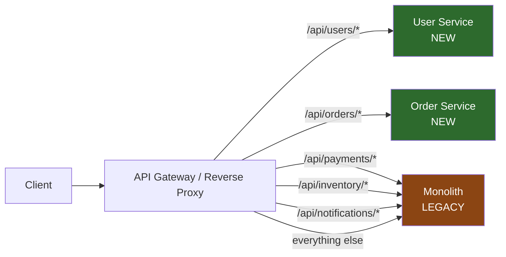

**Phase progression:**

```
Month 1-3:   [Monolith handles 100% of traffic]
Month 4-6:   [User Service extracted] → Monolith handles ~85%
Month 7-9:   [Order Service extracted] → Monolith handles ~60%
Month 10-12: [Payment Service extracted] → Monolith handles ~40%
Month 13-15: [Inventory Service extracted] → Monolith handles ~20%
Month 16-18: [Remaining services] → Monolith decommissioned
```

### 2.3 Extraction Sequencing

**Extract in this order** (each builds on the previous):

| Priority | Service                                              | Rationale                                                             |
| -------- | ---------------------------------------------------- | --------------------------------------------------------------------- |
| 1        | **Edge/Leaf services** (Notifications, Audit)        | Fewest inbound dependencies; low risk; team learns the process        |
| 2        | **Read-heavy services** (Search, Catalog, Reporting) | Can use CQRS read models; no write contention                         |
| 3        | **Independent domain services** (User Management)    | Clear bounded context; stable API surface                             |
| 4        | **Core domain services** (Orders, Payments)          | High business value but complex; team is experienced by now           |
| 5        | **Shared infrastructure** (Inventory, Pricing)       | Most cross-cutting; extract last when other services have stable APIs |

**Anti-pattern: Extracting the core domain first.** Teams that start with Orders or Payments before extracting simpler services face maximum complexity with zero migration experience. Start with a leaf service.

### 2.4 Database Decomposition Strategy

Database decomposition is the hardest part of microservices migration. It proceeds in four stages:

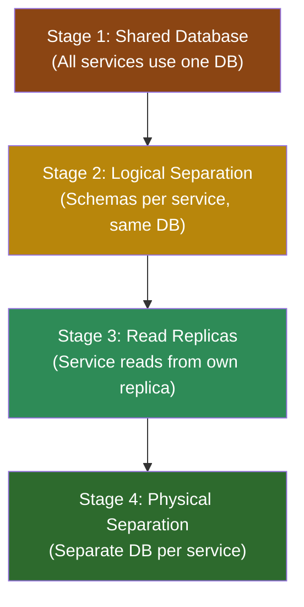

**Stage 1 -- Shared Database (starting state)**

All services access the same database. This is where you start. Do not try to skip stages.

**Stage 2 -- Logical Separation (weeks 1-4 per service)**

1. Create a schema (or namespace) per service in the same database
2. Move tables to their owning service's schema
3. Replace direct table access from non-owning services with API calls to the owning service
4. Add database views as a temporary compatibility layer for queries that span schemas
5. Validate: no cross-schema JOINs remain except through views

**Stage 3 -- Read Replicas (weeks 2-4 per service)**

1. Set up a read replica for each service that needs to query another service's data
2. Use Change Data Capture (CDC) via Debezium to stream changes to a read-optimized store
3. Replace API calls for read-heavy patterns with local read model queries
4. Accept eventual consistency for read paths (document the consistency window)

**Stage 4 -- Physical Separation (weeks 2-6 per service)**

1. Provision a separate database instance for the service
2. Migrate data using a dual-write pattern:
   - Write to both old and new DB
   - Read from new DB
   - Validate data consistency
   - Cut over reads and writes
   - Remove dual-write
3. Tear down the old schema/tables

**Critical Rule: Never split a transaction boundary across services until you have a saga implementation ready.** If `placeOrder()` currently writes to `orders`, `order_items`, and `inventory` in one transaction, you cannot just move `inventory` to another database. You need a saga (Section 3.5) first.

---

## 3. Target Architecture

### 3.1 High-Level Target Architecture

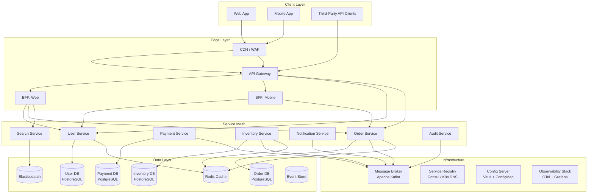

### 3.2 Service Decomposition Principles

**Principle 1: Align services to bounded contexts, not technical layers.**

Wrong: `DatabaseService`, `ValidationService`, `NotificationService`
Right: `OrderService`, `UserService`, `PaymentService` (each contains its own validation, persistence, notifications)

**Principle 2: A service owns its data exclusively.**

No other service may read or write to another service's database. Data sharing happens through APIs (synchronous) or events (asynchronous).

**Principle 3: Services are independently deployable.**

A change to the Order Service must be deployable without redeploying the Payment Service. This means: no shared libraries with business logic, no shared database schemas, no compile-time dependencies between services.

**Principle 4: Two-Pizza Team Rule.**

Each service should be owned by a team small enough to be fed by two pizzas (5-8 people). If a service requires a larger team, it is probably too large and should be split further.

**Principle 5: Design for failure.**

Every inter-service call will fail eventually. Design every synchronous call with a circuit breaker, timeout, and fallback. Prefer asynchronous communication for anything that does not require an immediate response.

### 3.3 Inter-Service Communication

**Decision Matrix: When to Use Each Pattern**

| Scenario                             | Pattern                   | Protocol                   | Example                         |
| ------------------------------------ | ------------------------- | -------------------------- | ------------------------------- |
| Client needs immediate response      | Synchronous request/reply | REST (HTTP/JSON) or gRPC   | `GET /users/{id}`               |
| High-throughput internal RPC         | Synchronous, binary       | gRPC (Protocol Buffers)    | Inventory check during checkout |
| Event notification (fire-and-forget) | Asynchronous event        | Kafka/RabbitMQ             | `OrderPlaced` event             |
| Long-running workflow                | Asynchronous command      | Kafka with correlation ID  | Payment processing              |
| Data replication / read models       | Asynchronous CDC          | Debezium + Kafka           | Search index updates            |
| Aggregating multiple services        | API composition           | BFF pattern (REST/GraphQL) | Product detail page             |

**REST vs gRPC Decision**

```
                       ┌─── External clients (browsers, mobile, third-party)?
                       │    YES → REST (HTTP/JSON) with OpenAPI spec
                       │
  Service-to-Service? ─┤
                       │    NO (internal only)
                       │    ├─── Latency-critical or high-throughput?
                       │    │    YES → gRPC (Protocol Buffers)
                       │    │    NO  → REST is fine (simpler tooling)
                       │    └─── Streaming required?
                       │         YES → gRPC (bidirectional streaming)
                       │         NO  → REST or gRPC, team preference
```

**Synchronous Communication Pattern (REST)**

```
┌──────────┐    HTTP/JSON    ┌──────────────┐    HTTP/JSON    ┌────────────────┐
│  Order    │───────────────>│  User         │───────────────>│  Payment       │
│  Service  │<───────────────│  Service      │<───────────────│  Service       │
│           │   200 OK       │               │   200 OK       │                │
└──────────┘                 └──────────────┘                 └────────────────┘

RISK: Temporal coupling. If Payment Service is down, Order Service fails.
MITIGATION: Circuit breaker + timeout + fallback (cached data or degraded response).
```

**Asynchronous Communication Pattern (Events)**

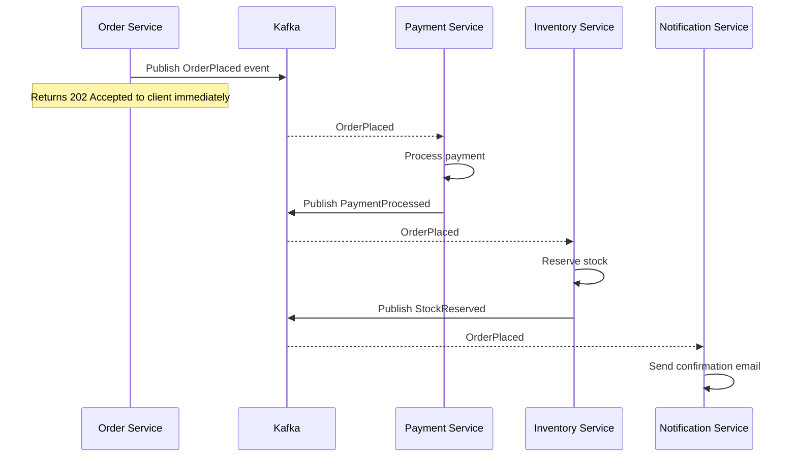

**Event Schema Standard**

Use CloudEvents specification (CNCF standard) for all events:

```json
{
  "specversion": "1.0",
  "type": "com.example.order.placed",
  "source": "/services/order-service",
  "id": "a1b2c3d4-e5f6-7890-abcd-ef1234567890",
  "time": "2026-02-08T10:30:00Z",
  "datacontenttype": "application/json",
  "data": {
    "orderId": "ORD-12345",
    "userId": "USR-67890",
    "totalAmount": 99.99,
    "currency": "USD",
    "items": [{ "productId": "PROD-111", "quantity": 2, "unitPrice": 49.99 }]
  }
}
```

### 3.4 API Gateway Pattern

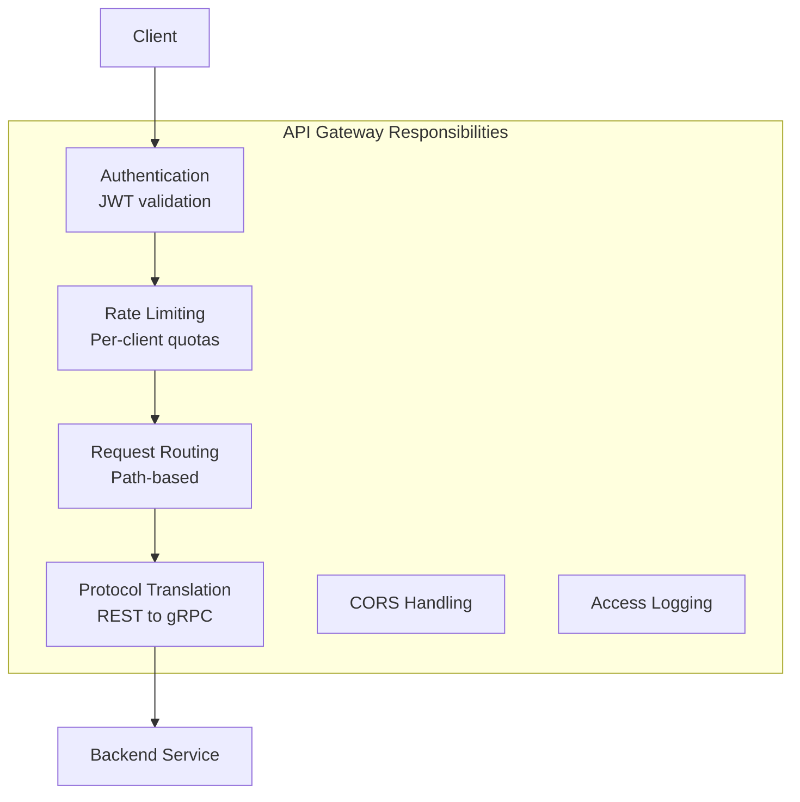

**Technology Selection**

| Gateway             | Best For                              | Avoid When                       |
| ------------------- | ------------------------------------- | -------------------------------- |
| **Kong**            | Plugin ecosystem, enterprise features | Budget-constrained, simple needs |
| **NGINX + Lua**     | High performance, custom logic        | Complex auth flows               |
| **AWS API Gateway** | AWS-native, serverless backends       | Multi-cloud, on-premise          |
| **Envoy**           | Service mesh integration (Istio)      | Standalone gateway (overkill)    |
| **Traefik**         | Kubernetes-native, auto-discovery     | Complex transformation needs     |

**Recommendation: Start with Traefik or Kong.** Traefik for Kubernetes-native deployments (auto-discovers services via labels). Kong if you need a rich plugin ecosystem (OAuth, rate limiting, request transformation). Avoid building a custom gateway.

**Backend-for-Frontend (BFF) Pattern**

When web and mobile clients have significantly different data needs, add a BFF layer:

```
Web Client  ──> BFF-Web ──> Order Service + User Service + Search Service
                             (aggregates, formats for web)

Mobile App  ──> BFF-Mobile ──> Order Service + User Service
                               (lighter payloads, offline-friendly)
```

Each BFF is owned by the client team and aggregates/transforms backend service responses for that specific client. This prevents "one-size-fits-all" API bloat.

### 3.5 Data Consistency Patterns

**The fundamental problem:** In a monolith, you use database transactions for consistency. In microservices, you cannot have a transaction that spans multiple databases. You need distributed consistency patterns.

#### Saga Pattern (Orchestration)

An orchestrator service coordinates the workflow by sending commands to each participant:

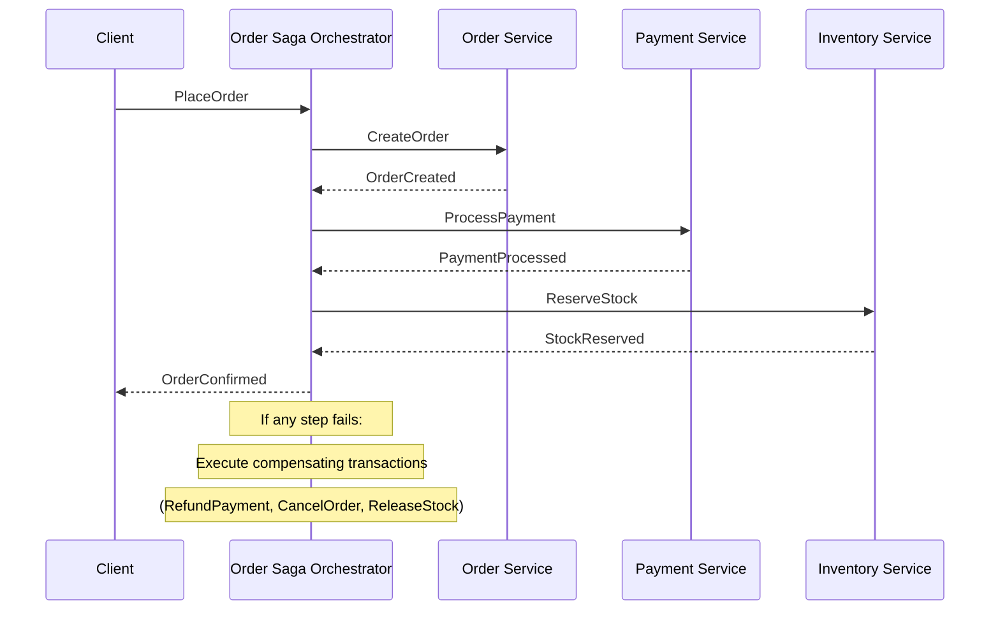

**When to use Orchestration Sagas:**

- Complex workflows with many steps (5+)
- Clear ordering requirements between steps
- Team prefers centralized visibility into saga state

#### Saga Pattern (Choreography)

Each service listens for events and reacts independently. No central orchestrator:

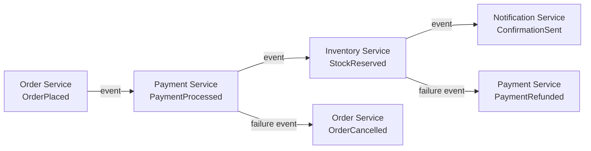

**When to use Choreography Sagas:**

- Simple workflows (2-4 steps)
- Loose coupling is prioritized
- Each service can independently decide how to react

**Trade-off Summary:**

|                         | Orchestration                       | Choreography                      |
| ----------------------- | ----------------------------------- | --------------------------------- |
| Complexity              | Centralized (easier to understand)  | Distributed (harder to trace)     |
| Coupling                | Orchestrator knows all participants | Services are loosely coupled      |
| Single point of failure | Orchestrator                        | None (but debugging is harder)    |
| Best for                | Complex, multi-step, ordered        | Simple, few-step, loosely-coupled |

#### Transactional Outbox Pattern

Ensures that database writes and event publishing are atomic without distributed transactions:

```
┌──────────────────────────────────────────────┐
│  Order Service                               │
│                                              │
│  BEGIN TRANSACTION                           │
│    INSERT INTO orders (...) VALUES (...)     │
│    INSERT INTO outbox (                      │
│      event_type, payload, published          │
│    ) VALUES (                                │
│      'OrderPlaced', '{...}', false           │
│    )                                         │
│  COMMIT                                      │
│                                              │
│  [Background process polls outbox table]     │
│  [Publishes unpublished events to Kafka]     │
│  [Marks events as published]                 │
└──────────────────────────────────────────────┘
```

**Why this matters:** If you write to the database and then publish to Kafka separately, either operation can fail independently, leaving you in an inconsistent state. The outbox pattern uses a single database transaction for both the business write and the event record, then a separate process reliably publishes events from the outbox table.

**Implementation Options:**

1. **Polling publisher**: Background thread queries outbox every N ms (simple, higher latency)
2. **CDC-based**: Debezium reads the outbox table's WAL and publishes to Kafka (lower latency, more operational complexity)

**Recommendation:** Start with polling publisher (simpler). Move to Debezium CDC when latency requirements tighten below 1 second.

#### CQRS and Event Sourcing (Use Sparingly)

**CQRS (Command Query Responsibility Segregation)**

Separate the write model (commands) from the read model (queries). The write model is optimized for consistency; the read model is optimized for query performance.

```
Commands ──> Write Model (normalized, ACID) ──> Events ──> Read Model (denormalized, fast)
Queries ──────────────────────────────────────────────────> Read Model
```

**When to use CQRS:**

- Read and write loads differ dramatically (100:1 read:write ratio)
- Read model needs to be materialized differently from write model (denormalized views, search indexes)
- Different scaling requirements for reads vs writes

**When NOT to use CQRS:**

- Simple CRUD applications
- Read and write models are nearly identical
- Team does not have experience with eventual consistency

**Event Sourcing**

Store every state change as an immutable event rather than the current state:

```
Event Store:
  1. UserCreated { id: "USR-1", name: "Alice", email: "alice@..." }
  2. UserEmailChanged { id: "USR-1", email: "alice@newdomain.com" }
  3. UserDeactivated { id: "USR-1", reason: "Requested" }

Current State (materialized): { id: "USR-1", name: "Alice", email: "alice@newdomain.com", active: false }
```

**Recommendation: Do not use Event Sourcing unless you have a specific business requirement for it** (audit trail, temporal queries, regulatory compliance). It adds significant complexity (event versioning, snapshots, projection rebuilds) that most systems do not need. CQRS without Event Sourcing is valuable on its own.

### 3.6 Service Mesh Considerations

A service mesh provides infrastructure-level networking capabilities (mTLS, load balancing, observability) without application code changes.

**When to adopt a service mesh:**

- 10+ services communicating over the network
- Need for mTLS (mutual TLS) between all services
- Complex traffic routing requirements (canary releases, traffic splitting)
- Consistent observability across all services

**When NOT to adopt a service mesh:**

- Fewer than 10 services (overhead exceeds benefit)
- Team lacks Kubernetes expertise
- Services communicate primarily through events (mesh adds little value)

**Technology Selection:**

| Mesh        | Best For                     | Operational Cost                       |
| ----------- | ---------------------------- | -------------------------------------- |
| **Istio**   | Full-featured, enterprise    | High (complex control plane)           |
| **Linkerd** | Lightweight, simple          | Low (smallest resource footprint)      |
| **Cilium**  | eBPF-based, high performance | Medium (requires Linux kernel support) |

**Recommendation: Start without a service mesh.** Use application-level libraries (e.g., circuit breakers in code) for the first 5-10 services. Adopt Linkerd when you hit 10+ services and need infrastructure-level mTLS and observability. Consider Istio only if you need advanced traffic management (fault injection, traffic mirroring).

---

## 4. Infrastructure and DevOps

### 4.1 Container Orchestration

**Kubernetes is the default choice for microservices orchestration.** Alternatives (Docker Swarm, Nomad, ECS) are viable for simpler deployments but Kubernetes has become the industry standard with the widest ecosystem support.

**Minimum Viable Kubernetes Architecture:**

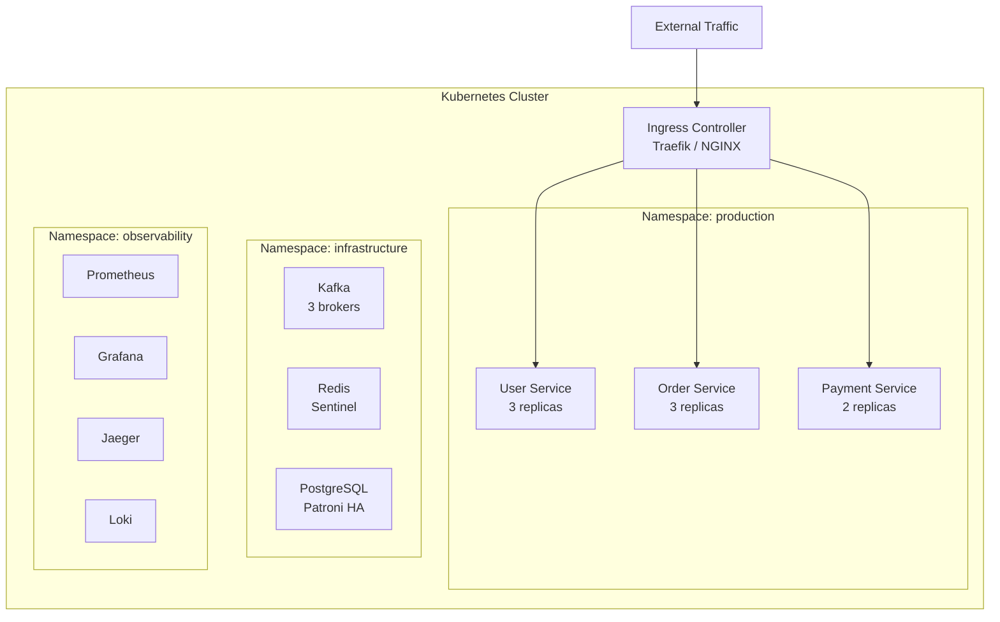

**Key Kubernetes Resources per Service:**

```yaml
# Deployment
apiVersion: apps/v1
kind: Deployment
metadata:
  name: order-service
spec:
  replicas: 3
  strategy:
    type: RollingUpdate
    rollingUpdate:
      maxSurge: 1
      maxUnavailable: 0 # Zero-downtime deploys
  template:
    spec:
      containers:
        - name: order-service
          resources:
            requests: # Guaranteed resources
              cpu: 250m
              memory: 256Mi
            limits: # Maximum resources
              cpu: 500m
              memory: 512Mi
          livenessProbe: # Restart if unhealthy
            httpGet:
              path: /health/live
              port: 8080
            initialDelaySeconds: 15
            periodSeconds: 10
          readinessProbe: # Remove from LB if not ready
            httpGet:
              path: /health/ready
              port: 8080
            initialDelaySeconds: 5
            periodSeconds: 5
```

### 4.2 CI/CD Pipeline per Service

Each service gets its own pipeline. This is non-negotiable for independent deployability.

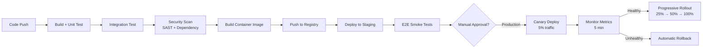

**Pipeline Configuration (per service):**

| Stage             | Tools                                                         | Duration  |
| ----------------- | ------------------------------------------------------------- | --------- |
| Build + Unit Test | Language-specific (go build, npm test, mvn test)              | 1-3 min   |
| Integration Test  | Testcontainers + docker-compose                               | 2-5 min   |
| Security Scan     | Trivy (containers), Snyk/Grype (dependencies), Semgrep (SAST) | 1-3 min   |
| Container Build   | Docker/Buildah with multi-stage builds                        | 1-2 min   |
| Deploy Staging    | Helm/Kustomize + ArgoCD                                       | 1-2 min   |
| E2E Smoke         | Service-specific critical path tests                          | 2-5 min   |
| Production Deploy | ArgoCD progressive delivery                                   | 10-30 min |

**Total pipeline time target: Under 15 minutes to staging, under 45 minutes to full production rollout.**

**Trunk-Based Development:**

- All services use trunk-based development (no long-lived feature branches)
- Short-lived feature branches (max 1-2 days) merged to main
- Feature flags for incomplete features in production
- Every merge to main triggers the full pipeline

### 4.3 Service Discovery and Configuration Management

**Service Discovery**

In Kubernetes, service discovery is built-in via DNS:

```
# Internal service URL pattern:
http://<service-name>.<namespace>.svc.cluster.local:<port>

# Example:
http://user-service.production.svc.cluster.local:8080
```

For non-Kubernetes environments, use Consul or etcd for service registration and discovery.

**Configuration Management**

```
┌─────────────────────────────────────────────────┐
│  Configuration Hierarchy (highest wins)          │
│                                                  │
│  1. Environment variables (runtime override)     │
│  2. Kubernetes ConfigMap (per-environment)        │
│  3. HashiCorp Vault (secrets only)               │
│  4. Application defaults (in code)               │
└─────────────────────────────────────────────────┘
```

**Rules:**

- Secrets (API keys, database passwords, JWT signing keys) MUST be stored in Vault, not ConfigMaps or environment variables
- Non-secret configuration (feature flags, timeouts, URLs) goes in ConfigMaps
- Configuration changes MUST NOT require redeployment (use hot-reload or restart)
- Every configuration value MUST have a sensible default in code

### 4.4 Observability Stack

The three pillars of observability, plus one:

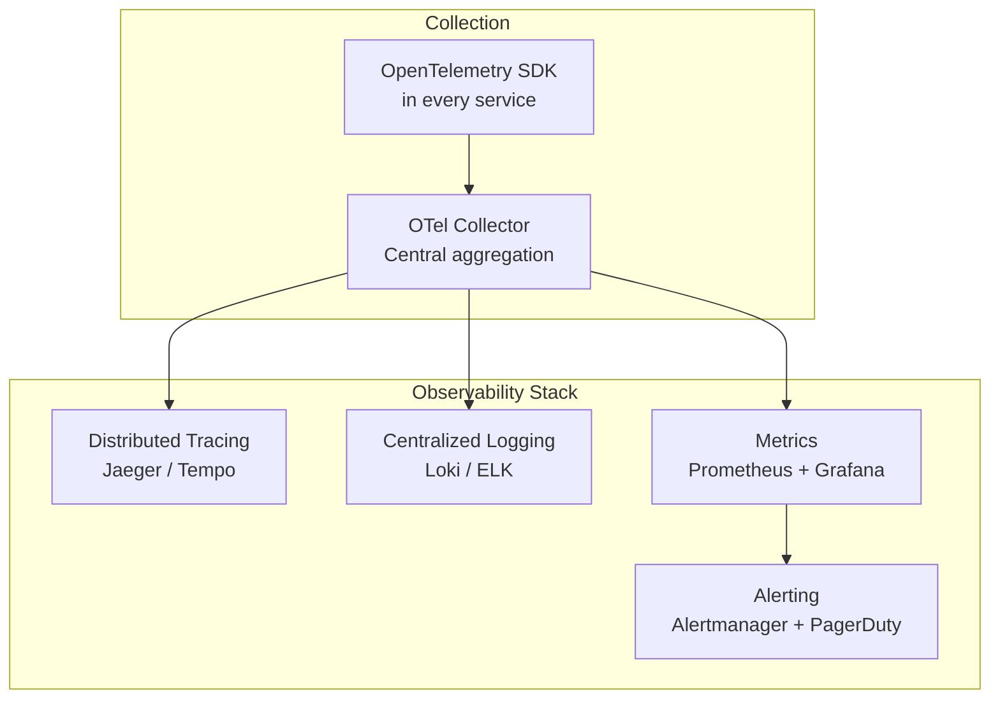

**Implementation Details:**

| Pillar      | Tool                    | Purpose                                                            |
| ----------- | ----------------------- | ------------------------------------------------------------------ |
| **Traces**  | Jaeger or Grafana Tempo | Trace requests across service boundaries; find latency bottlenecks |
| **Logs**    | Loki (Grafana) or ELK   | Centralized log aggregation; correlated by trace ID                |
| **Metrics** | Prometheus + Grafana    | RED metrics (Rate, Errors, Duration) per service                   |
| **Alerts**  | Alertmanager            | SLO-based alerting (not threshold-based)                           |

**Mandatory Instrumentation per Service:**

1. **Trace context propagation**: Every HTTP/gRPC call propagates W3C `traceparent` header
2. **Structured logging**: JSON format with `traceId`, `spanId`, `service`, `level`, `message`
3. **RED metrics**: Request rate, error rate, duration histogram (percentiles: p50, p95, p99)
4. **Health endpoints**: `/health/live` (process alive), `/health/ready` (accepting traffic), `/health/startup` (initialization complete)

**SLO-Based Alerting (not threshold-based):**

Instead of alerting on "error rate > 5%", define SLOs:

- "99.9% of requests complete within 500ms" (latency SLO)
- "99.95% of requests return non-5xx responses" (availability SLO)

Alert when the error budget burn rate threatens the SLO. This reduces alert noise dramatically.

---

## 5. Cross-Cutting Concerns

### 5.1 Authentication and Authorization

**Recommendation: Centralized authentication, distributed authorization.**

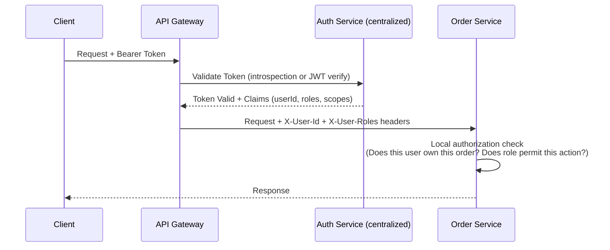

**Why this split:**

- **Centralized authentication** avoids duplicating token validation, key management, and session handling in every service
- **Distributed authorization** avoids a single authorization service becoming a bottleneck and having to know every service's domain rules

**Token Strategy:**

| Token Type         | Lifetime   | Storage                        | Purpose                     |
| ------------------ | ---------- | ------------------------------ | --------------------------- |
| Access Token (JWT) | 15 minutes | Memory (client)                | API authentication          |
| Refresh Token      | 7 days     | HttpOnly cookie or OS keychain | Silent access token renewal |
| API Key            | Long-lived | Vault                          | Service-to-service, CI/CD   |

**JWT Claims Standard (propagated by gateway to downstream services):**

```json
{
  "sub": "USR-67890",
  "iss": "https://auth.example.com",
  "aud": "https://api.example.com",
  "exp": 1707400200,
  "iat": 1707399300,
  "roles": ["user", "premium"],
  "scopes": ["orders:read", "orders:write", "profile:read"],
  "org_id": "ORG-123"
}
```

**Security Controls (non-negotiable):**

1. JWT algorithm whitelist: RS256 or ES256 only. Reject `none` and `HS256` in distributed systems
2. Token validation: Verify signature, expiration, issuer, and audience on every request
3. PKCE (S256) mandatory for all OAuth 2.1 authorization code flows
4. Refresh token rotation: Every use issues a new refresh token; reuse triggers revocation of all user tokens

### 5.2 Rate Limiting and Circuit Breakers

**Rate Limiting (at the API Gateway):**

```
┌─────────────────────────────────────────────┐
│  Rate Limiting Strategy                      │
│                                              │
│  Global:     10,000 req/min (entire API)     │
│  Per-Client: 1,000 req/min (per API key)     │
│  Per-User:   100 req/min (per authenticated) │
│  Per-Route:  Configurable per endpoint       │
│                                              │
│  Algorithm:  Sliding window (recommended)    │
│  Headers:    X-RateLimit-Limit               │
│              X-RateLimit-Remaining            │
│              X-RateLimit-Reset                │
│  Response:   429 Too Many Requests           │
└─────────────────────────────────────────────┘
```

**Circuit Breaker (per service-to-service call):**

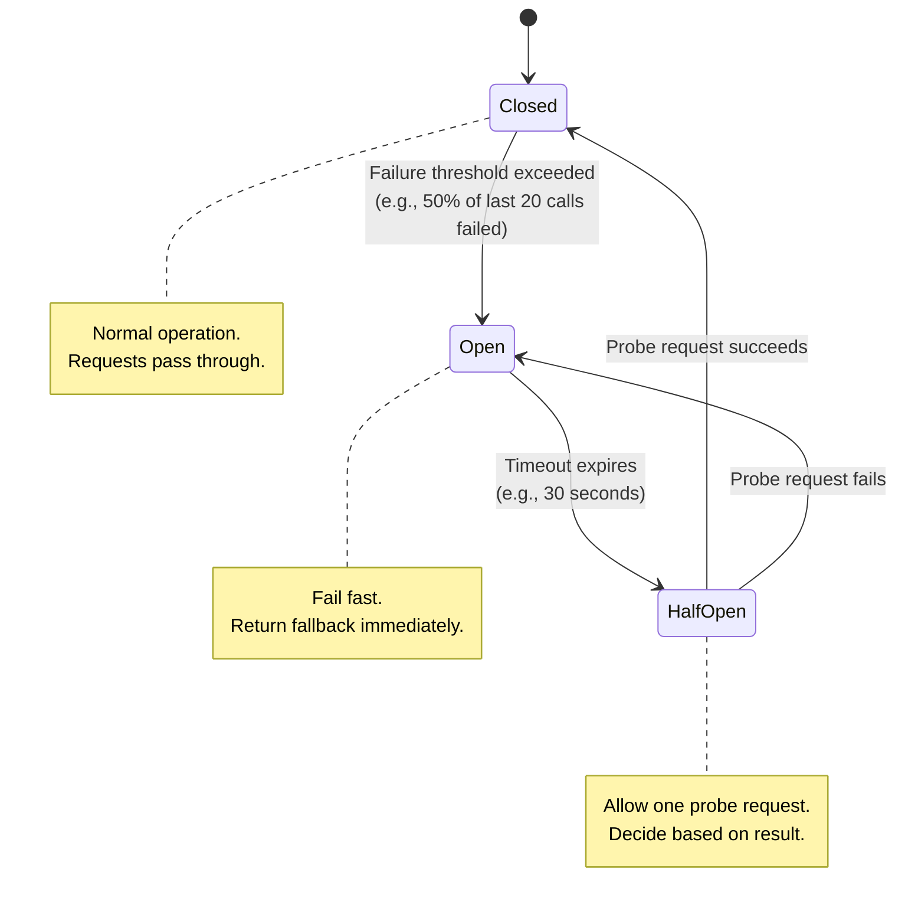

**Implementation:**

- Use Resilience4j (Java), Polly (.NET), opossum (Node.js), or gobreaker (Go)
- Configure per dependency: `{ failureRateThreshold: 50, waitDurationInOpenState: 30s, slidingWindowSize: 20 }`
- Always define a fallback: cached data, degraded response, or graceful error message

**Timeout Budget Pattern:**

For a request that traverses multiple services, set a total timeout budget and split it:

```
Client timeout: 5000ms
  ├── Gateway overhead: 50ms
  ├── Order Service: 2000ms budget
  │    ├── User Service call: 500ms budget
  │    └── Inventory Service call: 500ms budget
  └── Buffer: 1950ms
```

Each service passes the remaining budget downstream via a `X-Request-Deadline` header. A service must not start a new downstream call if the remaining budget is insufficient.

### 5.3 Shared Libraries vs Duplication

**Decision Framework:**

```
                       ┌─── Is this pure infrastructure?
                       │    (logging, tracing, health checks, auth middleware)
                       │    YES → Shared library (versioned, published to internal registry)
                       │
  Should we share? ────┤
                       │    NO (domain/business logic)
                       │    ├─── Is it identical across services?
                       │    │    (exact same code, not "similar")
                       │    │    YES → Shared library (but monitor for divergence)
                       │    │    NO  → DUPLICATE AND DIVERGE
                       │    └─── Will changes need coordination across teams?
                       │         YES → DUPLICATE (coupling is worse than duplication)
                       │         NO  → Shared library with strict semver
```

**What to share (as versioned internal packages):**

1. OpenTelemetry instrumentation setup
2. Structured logging configuration
3. Health check endpoint middleware
4. JWT validation middleware
5. Error response formatting
6. Circuit breaker configuration

**What to duplicate (per service):**

1. Data validation rules (each service validates its own inputs)
2. Domain models (each bounded context has its own model, even if similar)
3. Database migration scripts
4. API client code for other services (generated from OpenAPI spec)

**Shared Library Rules:**

- Published to internal package registry (npm private, Maven Central, Go module proxy)
- Strict semantic versioning (breaking changes = major version bump)
- Services pin to specific versions (no floating versions)
- Library updates are opt-in per service (no forced upgrades)
- Maximum 1 business logic library shared across services (ideally zero)

---

## 6. Risk Mitigation

### 6.1 Rollback Strategies

**Per-Service Rollback (standard):**

```
Production traffic:
  v2.1.0 (new) ──[canary: 5%]──> monitoring ──[healthy]──> progressive rollout
                                              ──[unhealthy]──> instant rollback to v2.0.0
```

Use Kubernetes rolling updates with `maxUnavailable: 0` and ArgoCD progressive delivery. A rollback is a redeploy of the previous container image.

**Database Rollback (complex):**

Database schema changes are NOT automatically reversible. Strategy:

1. **Expand-and-contract pattern**: Never drop columns or tables in the same release
   - Release 1: Add new column (expand)
   - Release 2: Migrate code to use new column
   - Release 3: Drop old column (contract)
2. **Backward-compatible migrations only**: New code must work with old schema, old code must work with new schema
3. **Blue-green database migrations**: For large schema changes, use a separate database and switch over

**Saga Rollback (compensating transactions):**

| Forward Action   | Compensating Action |
| ---------------- | ------------------- |
| CreateOrder      | CancelOrder         |
| ProcessPayment   | RefundPayment       |
| ReserveStock     | ReleaseStock        |
| SendConfirmation | SendCancellation    |

### 6.2 Data Migration Risks

| Risk                                        | Probability | Impact   | Mitigation                                                                                                     |
| ------------------------------------------- | ----------- | -------- | -------------------------------------------------------------------------------------------------------------- |
| Data loss during migration                  | Medium      | Critical | Dual-write + reconciliation. Never delete source data until new service is proven stable for 2+ weeks          |
| Data inconsistency between services         | High        | High     | Use CDC (Debezium) for replication. Run daily reconciliation jobs comparing source and target counts/checksums |
| Foreign key violations                      | Medium      | High     | Migrate data in dependency order. Use soft references (IDs) instead of database-level FKs across services      |
| Performance degradation during migration    | High        | Medium   | Migrate during low-traffic windows. Use batch processing with rate limiting. Monitor database CPU/IO           |
| Timeout/failure during large data migration | High        | Medium   | Use resumable migrations with checkpoints. Process in batches of 1000 rows. Log progress per batch             |

### 6.3 Performance Regression Detection

**Baseline before migration:**

Capture p50, p95, and p99 latency for every API endpoint in the monolith. This is your performance contract.

**Continuous comparison:**

After extracting each service, compare the same endpoints:

```
Endpoint: POST /api/orders
  Monolith baseline:  p50=45ms, p95=120ms, p99=350ms
  Microservice actual: p50=52ms, p95=135ms, p99=380ms (+8.5% p99)

  Acceptable? YES (< 20% regression for p99)
  Action: Monitor. If > 20%, investigate network overhead.
```

**Automated performance gates in CI/CD:**

- Run load tests against staging after every deployment
- Compare against baseline metrics
- Block deployment if p99 latency increases by more than 20% or error rate increases by more than 0.1%

**Common performance pitfalls:**

1. **N+1 API calls**: What was a JOIN in the monolith becomes N network calls. Solution: batch APIs (`GET /users?ids=1,2,3`)
2. **Chatty communication**: Services making 10+ calls per request. Solution: aggregate in BFF, use events for async data
3. **Missing caches**: In-process cache in monolith is now gone. Solution: Redis cache with appropriate TTLs
4. **Serialization overhead**: JSON serialization/deserialization on every call. Solution: gRPC for high-frequency internal calls

### 6.4 Team Organizational Alignment (Conway's Law)

**Conway's Law:** "Organizations which design systems are constrained to produce designs which are copies of the communication structures of these organizations."

**Implication:** Your service boundaries will reflect your team boundaries. If you split services without splitting teams, you will get a distributed monolith.

**Inverse Conway Maneuver:** Structure your teams to match your desired architecture:

```
BEFORE (monolith team):
  Frontend Team ──> Backend Team ──> Database Team ──> Ops Team
  (horizontal, layer-based)

AFTER (microservices teams):
  Order Team:     [FE + BE + DB + Ops] ──> Order Service
  User Team:      [FE + BE + DB + Ops] ──> User Service
  Payment Team:   [FE + BE + DB + Ops] ──> Payment Service
  Platform Team:  [Shared infra, CI/CD, observability]
  (vertical, domain-based)
```

**Team topology recommendations:**

| Team Type                 | Responsibility                                             | Size                   |
| ------------------------- | ---------------------------------------------------------- | ---------------------- |
| **Stream-aligned**        | Owns one or more services end-to-end                       | 5-8 people             |
| **Platform**              | Provides shared infrastructure (K8s, CI/CD, observability) | 3-5 people             |
| **Enabling**              | Helps stream-aligned teams adopt new practices             | 2-3 people (temporary) |
| **Complicated subsystem** | Owns mathematically/algorithmically complex components     | 3-5 specialists        |

**Do this before extracting services:** Reorganize teams to align with bounded contexts. A service extraction that does not come with a dedicated team will fail because nobody owns the operational responsibility.

---

## 7. Decision Framework

### 7.1 When NOT to Migrate

**Do not migrate to microservices if:**

1. **Your monolith is not a problem.** If the monolith deploys reliably, scales adequately, and teams ship features quickly, microservices will add complexity without proportional benefit.

2. **Your team is small (under 20 developers).** Microservices are an organizational scaling strategy. A team of 5 can maintain a monolith far more efficiently than 5 microservices.

3. **You cannot define bounded contexts.** If domain boundaries are unclear or highly coupled, extracting services will create a distributed monolith -- all the complexity of microservices with none of the benefits.

4. **You do not have DevOps maturity.** Microservices require: automated CI/CD per service, container orchestration, centralized logging, distributed tracing, and on-call rotation. If you do not have these, build them first.

5. **You are building a new product.** Start with a modular monolith. Extract services only after boundaries stabilize (usually 12-18 months post-launch).

**Decision Flowchart:**

```
Is your monolith causing deployment bottlenecks?
├── NO → Stay with monolith. Focus on modular architecture.
└── YES
    ├── Can you define 3+ clear bounded contexts?
    │   ├── NO → Invest in domain modeling first. Do not extract.
    │   └── YES
    │       ├── Do you have 20+ developers?
    │       │   ├── NO → Consider modular monolith with clear module boundaries.
    │       │   └── YES
    │       │       ├── Do you have CI/CD, containers, and observability?
    │       │       │   ├── NO → Build platform capabilities first (3-6 months).
    │       │       │   └── YES → Proceed with Strangler Fig migration.
```

### 7.2 Service Granularity Guidelines

**Too coarse (distributed monolith symptoms):**

- Service has 10+ database tables
- Service has 5+ teams contributing
- Service requires coordinated deployments with other services
- Service has 20+ API endpoints
- A single user story requires changes to multiple services

**Too fine (nano-service/function-as-service symptoms):**

- Service has 1-2 API endpoints
- Service is called synchronously by only one other service
- Service has less than 500 lines of code
- Service shares a database with another service (they should be one service)
- You have more services than developers

**Right-sized service characteristics:**

- Aligned with one bounded context
- Owned by one team (5-8 people)
- 3-15 API endpoints
- 3-8 database tables
- Independently deployable (no coordinated releases)
- Can be rewritten in 2-4 weeks if needed

### 7.3 Technology Selection Criteria

**Language/Runtime per Service:**

You CAN use different languages per service (polyglot). You SHOULD NOT unless you have a strong reason.

| Choose polyglot when                                                             | Stick to one language when                                      |
| -------------------------------------------------------------------------------- | --------------------------------------------------------------- |
| Team has deep expertise in a specific language for a specific domain             | Team is small and context-switching between languages is costly |
| Performance requirements demand it (e.g., Go for high-throughput, Python for ML) | Hiring is easier with a unified tech stack                      |
| Acquiring a company with a different tech stack                                  | Shared libraries and tooling work across services               |

**Database per Service:**

| Service Characteristic                | Recommended Database        |
| ------------------------------------- | --------------------------- |
| Transactional, relational data        | PostgreSQL (default choice) |
| Document-oriented, schema flexibility | MongoDB                     |
| High-throughput caching               | Redis                       |
| Full-text search                      | Elasticsearch or OpenSearch |
| Time-series data (metrics, IoT)       | TimescaleDB or InfluxDB     |
| Graph relationships                   | Neo4j                       |
| Key-value at extreme scale            | DynamoDB or Cassandra       |

**Default recommendation: PostgreSQL for everything unless you have a specific reason to use something else.** PostgreSQL supports JSON, full-text search, and time-series extensions, covering 90% of use cases.

**Message Broker Selection:**

| Broker             | Best For                                                 | Avoid When                      |
| ------------------ | -------------------------------------------------------- | ------------------------------- |
| **Apache Kafka**   | Event streaming, high throughput, event sourcing, replay | Simple pub/sub, small scale     |
| **RabbitMQ**       | Task queues, routing, request/reply                      | Event replay, stream processing |
| **Amazon SQS/SNS** | AWS-native, serverless                                   | Multi-cloud, complex routing    |
| **NATS**           | Ultra-low latency, edge computing                        | Complex routing, persistence    |

**Default recommendation: Kafka for event-driven microservices.** It provides durable, replayable, ordered event streams. RabbitMQ if you primarily need task queues (work distribution) rather than event streams.

---

## 8. Appendix: Checklists and Templates

### 8.1 Service Extraction Readiness Checklist

Before extracting a service from the monolith:

- [ ] Bounded context clearly defined (event storming completed)
- [ ] Data ownership assigned (single writer per table)
- [ ] API contract defined (OpenAPI 3.x spec written)
- [ ] Dependency map shows fewer than 3 inbound synchronous dependencies
- [ ] Database tables identified and migration plan written
- [ ] Team assigned (5-8 people, full-stack)
- [ ] CI/CD pipeline template ready
- [ ] Monitoring dashboards defined (RED metrics)
- [ ] Circuit breakers configured for all outbound calls
- [ ] Saga pattern defined for cross-service transactions (if applicable)
- [ ] Performance baseline captured (p50, p95, p99 for affected endpoints)
- [ ] Rollback plan documented and tested

### 8.2 Service Template (Standard Service Structure)

```
order-service/
  src/
    api/                 # REST/gRPC handlers
      routes.ts
      middleware.ts
    domain/              # Business logic (no framework dependencies)
      order.ts           # Aggregate root
      order-repository.ts  # Repository interface
      order-service.ts   # Domain service
    infrastructure/      # External integrations
      database/          # Database implementation
      messaging/         # Kafka producer/consumer
      external/          # HTTP clients for other services
    config/              # Configuration loading
  tests/
    unit/                # Domain logic tests
    integration/         # Database and messaging tests
    e2e/                 # API endpoint tests
  migrations/            # Database migrations
  Dockerfile
  docker-compose.yml     # Local development
  openapi.yaml           # API specification
  helm/                  # Kubernetes deployment
    Chart.yaml
    values.yaml
    values-staging.yaml
    values-production.yaml
```

### 8.3 Migration Phase Gate Checklist

At the end of each service extraction, verify:

| Gate                   | Criterion                                               | Blocking?    |
| ---------------------- | ------------------------------------------------------- | ------------ |
| Functional correctness | All existing tests pass + new service tests pass        | YES          |
| Performance            | p99 latency within 20% of monolith baseline             | YES          |
| Data consistency       | Reconciliation job shows 0 discrepancies for 48 hours   | YES          |
| Observability          | Traces, logs, and metrics visible in dashboards         | YES          |
| Security               | Security scan passes (no critical/high vulnerabilities) | YES          |
| Rollback               | Rollback tested successfully in staging                 | YES          |
| Documentation          | OpenAPI spec published, runbook written                 | NO (warning) |
| Load test              | Service handles 2x expected peak load                   | NO (warning) |

### 8.4 Anti-Pattern Reference

| Anti-Pattern                | Symptom                                         | Resolution                                                     |
| --------------------------- | ----------------------------------------------- | -------------------------------------------------------------- |
| **Distributed Monolith**    | Services must deploy together; shared database  | Enforce data ownership; use events instead of direct DB access |
| **Chatty Services**         | 10+ synchronous calls per request               | Aggregate in BFF; use events for non-critical data             |
| **God Service**             | One service handles 50%+ of all traffic         | Split by subdomain; apply bounded context analysis             |
| **Shared Database**         | Multiple services read/write same tables        | Stage 2-4 database decomposition (Section 2.4)                 |
| **Nano Services**           | Services with 1-2 endpoints, <500 LOC           | Merge into parent bounded context                              |
| **No Observability**        | Cannot trace requests across services           | OpenTelemetry + centralized logging BEFORE extraction          |
| **Big Bang Data Migration** | Moving all data at once                         | Dual-write + incremental migration + reconciliation            |
| **Ignoring Conway's Law**   | Service boundaries do not match team boundaries | Inverse Conway maneuver: restructure teams first               |

---

## Summary of Key Recommendations

1. **Use the Strangler Fig pattern.** Incremental extraction with per-service rollback.
2. **Start with leaf services.** Build team experience on low-risk extractions before tackling the core domain.
3. **Own your data.** One service per database. No shared mutable state.
4. **Prefer async over sync.** Events (Kafka) for most inter-service communication. Synchronous calls only when the client needs an immediate response.
5. **Transactional Outbox for consistency.** Never publish events and write to DB separately.
6. **Invest in observability first.** Distributed tracing, centralized logging, and metrics must be in place before the first service extraction.
7. **Restructure teams before restructuring code.** Conway's Law is not optional.
8. **Do not start with microservices for a new product.** Start with a modular monolith and extract when boundaries are proven.
9. **Default to PostgreSQL and Kafka.** Polyglot persistence is a feature, not a goal.
10. **Measure everything.** Performance baselines, data reconciliation, SLO-based alerting. Without measurement, you are guessing.

---

_This document is a living architecture reference. Update it as migration progresses and patterns are validated against production reality._
