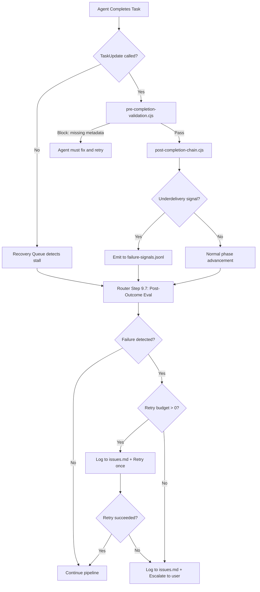

<!-- Agent: architect | Task: #8 | Session: 2026-02-21 -->
# Self-Healing Failure Detection Protocol -- Architecture Design

## Problem Statement

The router currently has no formal protocol for responding to in-session failures. When agents stall (no `TaskUpdate(completed)`), when deliverable counts fall short of requested counts, or when expected files are not created, the router narrates the failure in chat but does not:

1. Log the failure as an open finding in `.claude/context/memory/issues.md`.
2. Queue a reflection spawn request for pattern analysis.
3. Retry, escalate, or route remediation work to another agent.

**Evidence from this session (2026-02-21):** User requested 4-6 skills; the first pipeline attempt produced 1. The router observed the shortfall in chat output but continued to the next phase without logging the failure, retrying, or queuing reflection. The failure was invisible to the memory system and would have been lost if the user had not manually re-requested.

**Evidence from prior sessions:** Issues.md contains P0 entries for "Task Metadata Governance Critical Failure" (2026-02-18, 12+ tasks), "Batch Reflection Failure" (2026-02-20, 6 tasks), and "REFLECTION-AGENT INSUFFICIENT DATA GATE FAILURE" (2026-02-18). All share the pattern: failures observed in chat but not logged, queued, or remediated.

## Codebase Findings

### What Already Exists (Infrastructure)

The framework already has significant self-healing infrastructure, but it is disconnected from the router's decision loop:

| Component | File | What It Does | Gap |
|-----------|------|-------------|-----|
| **Recovery Queue** | `post-task-unified.cjs` / `post-task-unified-completion.helpers.cjs` | Writes `synthesizeRecoveryTaskUpdate()` entries to `taskupdate-recovery-queue.jsonl` when TaskOutput shows completion without matching TaskUpdate | Router never reads this queue |
| **Loop State Manager** | `.claude/lib/self-healing/loop-state-manager.cjs` | Tracks spawn depth, detects infinite loops | Only tracks depth, not outcome quality |
| **Rollback Manager** | `.claude/lib/self-healing/rollback-manager.cjs` | Can rollback failed changes | Not connected to router failure detection |
| **Task Lifecycle State** | `.claude/lib/routing/task-lifecycle-state.cjs` | Persists per-task status to disk | Router does not compare expected vs actual deliverables |
| **Pre-completion Validation** | `.claude/hooks/validation/pre-completion-validation.cjs` | Validates summary, filesModified, required outputs before completion | Only validates what the agent claims -- cannot detect underdelivery (e.g., "asked for 5 skills, got 1") |
| **Post-completion Chain** | `.claude/hooks/workflow/post-completion-chain.cjs` | Advances enterprise workflow phases on task completion | Only advances phases; does not evaluate whether the phase produced adequate output |
| **Reflection Spawn Queue** | `.claude/context/runtime/reflection-spawn-request.json` | Queues reflection requests for Step 0 processing | Only populated by post-creation-integration.cjs and task_completion triggers -- not by failure detection |

### What Is Missing (The Gap)

There is no component that:

1. **Compares expected deliverables against actual deliverables** at the router level after an agent completes.
2. **Logs underdelivery as an open finding** in `issues.md` with structured metadata.
3. **Queues a reflection spawn** specifically for failure-pattern analysis.
4. **Decides whether to retry, escalate, or accept** a partial result.

The router's decision workflow (`router-decision.md`) has an "Error Recovery" section (lines 1325-1414), but it only covers: conflicting tasks, ambiguous classification, self-check failures, no matching agent, and spawn failures. It does not cover **post-spawn outcome evaluation** (the agent completed but delivered less than requested).

### CLAUDE.md Protocol Gaps

- **Section 0.1 (Router Output Contract):** Defines Step 0 (reflection check), Step 0.5 (integration queue), Step 0.6 (creation preflight), Step 1 (TaskList), and spawning -- but no "post-outcome evaluation" step exists.
- **Section 6 (Execution Rules):** States Router ALWAYS uses TaskList() to poll, but does not define what the Router should do when TaskList() reveals a completed task with inadequate results.
- **Section 8 (Memory Persistence):** Defines memory write protocol but does not mandate failure logging as part of the router loop.

## Recommended Solution: Option E (Combination)

**Recommendation: A new CLAUDE.md protocol section (A) + Extension of post-completion-chain.cjs (D) + Two new entries in router-decision.md (B).**

This is the minimal viable combination that actually closes the loop without over-engineering.

### Why Not Single-Option Approaches

- **(A) alone (CLAUDE.md only):** The router is an LLM. Protocol text is necessary but cannot reliably enforce behavior -- the same way the 70-line TaskUpdate warning box failed to ensure metadata in 15+ sessions. Protocol needs a hook backstop.
- **(B) alone (router-decision.md only):** Same problem as (A) -- it is instruction text, not enforcement.
- **(C) alone (New hook):** A new hook would fire on every TaskUpdate, but it cannot know what the router *expected* -- only what the agent *reported*. Expectation context lives in the router's task creation metadata.
- **(D) alone (Extend post-completion-chain.cjs):** This hook already fires on TaskUpdate(completed) and has access to workflow state. It can detect the subset of failures where expected output counts are declared in workflow state. But it cannot detect ad-hoc underdelivery outside enterprise workflows.

### The Recommended Three-Part Design

**Part 1: CLAUDE.md Section 6.1 -- Failure Detection Protocol (Protocol Layer)**

A new mandatory section in CLAUDE.md between Section 6 (Execution Rules) and Section 7 (Skill Invocation). This section defines what the router MUST do after every agent completion:

```
## 6.1 POST-OUTCOME EVALUATION (MANDATORY)

After EVERY agent completion (detected via TaskList() or TaskOutput), Router MUST:

1. COMPARE: Expected deliverables (from task description/metadata) vs actual deliverables (from agent's completion metadata).
2. DETECT: Any of the failure signals below.
3. RESPOND: Execute the appropriate self-healing response.

### Failure Signals
| Signal | Detection Method | Severity |
|--------|-----------------|----------|
| Agent stall | Task remains `in_progress` after agent returns | HIGH |
| Quantitative underdelivery | `metadata.deliveredCount < metadata.requestedCount` | HIGH |
| Missing expected file | `metadata.outputArtifacts` path does not exist on disk | MEDIUM |
| Missing summary metadata | `metadata.summary` is empty or fallback string | LOW (already enforced by pre-completion-validation.cjs) |

### Self-Healing Response
1. LOG: Append finding to `.claude/context/memory/issues.md` with structured format.
2. QUEUE: Append reflection spawn request to `reflection-spawn-request.json`.
3. DECIDE:
   - If severity HIGH and retry budget > 0: Spawn replacement agent with same task + error context.
   - If severity HIGH and retry budget = 0: Escalate to user.
   - If severity MEDIUM: Log + queue reflection. Continue pipeline.
   - If severity LOW: Log only.
4. RETRY BUDGET: Maximum 1 retry per task per session. Router tracks retries in task metadata: `metadata.retryCount`.
```

**Part 2: router-decision.md Step 9.7 -- Post-Outcome Evaluation Step (Workflow Layer)**

Add a new step in the router-decision workflow after Step 9.3 (Check for Next Work):

```
### 9.7 Post-Outcome Evaluation (MANDATORY)

After every agent completion detected by TaskList():

1. Read the completed task's metadata via TaskGet().
2. Compare `metadata.requestedCount` (if set during TaskCreate) against `metadata.deliveredCount` (set by agent).
3. Check `metadata.outputArtifacts` paths exist on disk.
4. If any failure signal detected:
   a. Log to issues.md: "## Underdelivery: Task #{id} ({date})\nRequested: {N}, Delivered: {M}\nAgent: {type}\nAction: {retry|escalate|accept}"
   b. If retry warranted: TaskCreate a retry task referencing the original, spawn replacement agent.
   c. If reflection warranted: Append to reflection-spawn-request.json.
```

**Part 3: Extend post-completion-chain.cjs -- Automated Failure Signal Emission (Hook Layer)**

Extend the existing `post-completion-chain.cjs` to emit a failure signal file when a completed task's metadata indicates underdelivery. This provides a hook-level backstop that fires even if the router protocol text is ignored:

```javascript
// After marking agent complete and evaluating gate (existing code, line ~155)
// NEW: Check for underdelivery signals
const metadata = toolInput.metadata || {};
const requested = metadata.requestedCount || metadata.expected_count;
const delivered = metadata.deliveredCount || metadata.delivered_count;
if (requested && delivered && Number(delivered) < Number(requested)) {
  const signal = {
    type: 'underdelivery',
    taskId: update.taskId,
    requested: Number(requested),
    delivered: Number(delivered),
    timestamp: new Date().toISOString(),
    phase: currentPhase || 'ad_hoc',
  };
  const signalPath = path.join(PROJECT_ROOT, '.claude/context/runtime/failure-signals.jsonl');
  fs.appendFileSync(signalPath, JSON.stringify(signal) + '\n', 'utf8');
}
```

The router would then check `failure-signals.jsonl` as part of its Step 0 sequence (or Step 9.7), similar to how it checks `reflection-spawn-request.json`.

## Failure Signals to Detect

| # | Signal | How Detected | Where Detected | Response |
|---|--------|-------------|----------------|----------|
| F1 | Agent stall (no TaskUpdate(completed)) | TaskList shows task still `in_progress` after agent process ends | Router (Step 9.7) + recovery queue (existing) | Log + retry once |
| F2 | Quantitative underdelivery | `requestedCount > deliveredCount` in completion metadata | post-completion-chain.cjs (new signal) + Router (Step 9.7) | Log + retry once |
| F3 | Missing expected file | `outputArtifacts` path does not exist on disk | pre-completion-validation.cjs (existing TASK_OUTPUT_ENFORCEMENT) + Router (Step 9.7) | Log + queue reflection |
| F4 | High tool-call count without output | Agent used >40 tool calls but `filesModified` is empty | post-task-unified.cjs (new check in Task completion handler) | Log + queue reflection |
| F5 | Recurring failure pattern | Same failure type on same task type in 3+ consecutive sessions | Reflection agent (existing pattern detection) | Escalate to user + propose systemic fix |

## Self-Healing Response Design

### Response Matrix

| Failure | Log to issues.md | Queue Reflection | Retry (max 1) | Escalate to User |
|---------|-------------------|------------------|----------------|-------------------|
| F1: Stall | YES | YES | YES (with timeout increase) | If retry also stalls |
| F2: Underdelivery | YES | YES | YES (with explicit count requirement in prompt) | If retry also underdelivers |
| F3: Missing file | YES | NO (pre-completion already blocks) | NO (agent should fix before completing) | Only if pre-completion in warn mode |
| F4: High tool, no output | YES | YES | NO (likely systemic) | YES |
| F5: Recurring pattern | Already logged | Already queued | NO | YES (mandatory) |

### Retry Protocol

When the router decides to retry:

1. Create a new task with `metadata.isRetry: true, metadata.originalTaskId: <original>`.
2. Include in the spawn prompt: "RETRY: Previous attempt delivered {M} of {N} requested. You MUST deliver all {N}. See task #{original} for what was already produced."
3. Set `metadata.retryCount` on the new task.
4. If the retry also fails, escalate to user with: "Task #{id} failed after retry. Original delivered {M1}/{N}, retry delivered {M2}/{N}. Please advise."

### Issue Logging Format

```markdown
## Underdelivery: Task #{id} ({YYYY-MM-DD})

**Severity**: {HIGH|MEDIUM|LOW}
**Signal**: {F1|F2|F3|F4}
**Agent**: {agent-type}
**Requested**: {count or description}
**Delivered**: {count or description}
**Action Taken**: {retry|reflection-queued|escalated|logged-only}
**Retry Result**: {pending|succeeded|failed|N/A}
```

## Files to Change

| File | Change Type | Description |
|------|-------------|-------------|
| `.claude/CLAUDE.md` | Add section | New Section 6.1: Post-Outcome Evaluation protocol |
| `.claude/workflows/core/router-decision.md` | Add step | New Step 9.7: Post-Outcome Evaluation workflow step |
| `.claude/hooks/workflow/post-completion-chain.cjs` | Extend | Add underdelivery signal emission (~15 lines) |
| `.claude/hooks/routing/post-task-unified.cjs` | Extend | Add high-tool-count-no-output detection in Task completion handler (~20 lines) |
| `.claude/context/memory/issues.md` | Append (at runtime) | Failure entries logged here by router |
| `.claude/context/runtime/failure-signals.jsonl` | New file (at runtime) | Underdelivery signals emitted by hooks |

**Estimated total code change: ~80 lines across 2 hooks + ~40 lines of CLAUDE.md protocol + ~30 lines of router-decision.md.**

## Task Metadata Contract Extension

To enable the router to detect underdelivery, we need a lightweight metadata convention:

```typescript
// When router creates a task that expects quantifiable output:
TaskCreate({
  subject: 'Create 5 skills for audit domain',
  description: '...',
  metadata: {
    requestedCount: 5,        // NEW: How many deliverables expected
    requestedType: 'skill',   // NEW: What type of deliverable
  }
});

// When agent completes:
TaskUpdate({
  taskId: 'X',
  status: 'completed',
  metadata: {
    summary: '...',
    filesModified: [...],
    deliveredCount: 3,        // NEW: How many actually delivered
    deliveredType: 'skill',   // NEW: What type delivered
  }
});
```

This is additive (no breaking changes), backward-compatible (tasks without these fields skip underdelivery checks), and requires no schema enforcement hooks -- just convention documented in CLAUDE.md.

## Risks and Mitigations

| Risk | Likelihood | Impact | Mitigation |
|------|-----------|--------|------------|
| Retry storms (router retries endlessly) | MEDIUM | HIGH | Hard cap: 1 retry per task per session. `metadata.retryCount` tracked. |
| False positive underdelivery (agent delivered correctly but metadata wrong) | LOW | MEDIUM | Retry prompt includes "see task #{original}" so retry agent can check existing work before duplicating. |
| Memory file bloat from excessive failure logging | LOW | LOW | issues.md already has rotation at 20KB threshold. Failure entries are ~10 lines each. |
| Hook extension increases latency | LOW | LOW | Signal emission is a single `appendFileSync` (~1ms). No network calls. Within 100ms hook budget. |
| Router ignores protocol text (as has happened before) | HIGH | HIGH | This is why Part 3 (hook backstop) exists. Hooks fire regardless of whether the router follows protocol text. `failure-signals.jsonl` will accumulate evidence even if the router does not act on it, and reflection-agent will eventually detect the pattern. |
| Context window pressure from retry prompts | MEDIUM | MEDIUM | Retry prompts reference original task ID rather than duplicating full context. Use Step 5.5 context-pressure check before retry spawn. |

## NOT Recommended

### (Rejected) Full autonomous self-healing with zero human involvement

A fully autonomous system that retries indefinitely, changes agent types, escalates model tiers, and modifies task descriptions without human awareness would be dangerous. The router is an LLM and can misjudge failure causes. Allowing unbounded retries with prompt modification creates a risk of cascading incorrect work. The 1-retry cap with user escalation is the correct boundary.

### (Rejected) New standalone hook for failure detection

Creating a new `failure-detection.cjs` hook registered on PostToolUse(TaskUpdate) would add another hook to the chain (already 6+ hooks fire per TaskUpdate). The existing `post-completion-chain.cjs` and `post-task-unified.cjs` already fire at the right moments and have all needed context. Extending them is strictly better than adding a new hook: less latency, less maintenance surface, less risk of ordering conflicts.

### (Rejected) Complex failure taxonomy with weighted scoring

A system that assigns numerical severity scores, computes rolling averages, and triggers based on statistical thresholds would be over-engineered for the current problem. The failure signals are discrete and binary (either underdelivery happened or it did not). A simple signal file + router protocol step is sufficient. If the system proves inadequate, it can be graduated to a scoring system later.

### (Rejected) Making recovery queue the primary mechanism

The `taskupdate-recovery-queue.jsonl` already exists and captures some failure signals. However, it is designed for TaskOutput/TaskUpdate reconciliation (agent forgot to call TaskUpdate), not for semantic underdelivery detection (agent called TaskUpdate but delivered 1/5 items). Repurposing it would conflate two different failure modes and make the recovery queue harder to reason about.

## Implementation Priority

1. **CLAUDE.md Section 6.1** (highest impact, zero code change, immediate effect)
2. **router-decision.md Step 9.7** (workflow documentation, zero code change)
3. **post-completion-chain.cjs extension** (hook backstop for enterprise workflows)
4. **post-task-unified.cjs extension** (hook backstop for ad-hoc tasks)
5. **Task metadata convention** (documented in CLAUDE.md, adopted incrementally)

Steps 1-2 can be done in a single task by a developer. Steps 3-4 are a second task. Step 5 is convention adoption over time.

## Architecture Diagram



## Related ADRs

- **ADR-2026-02-21-013**: Self-Healing Requires Active Issue Logging (ACCEPTED, this session)
- **ADR-2026-02-18 P0**: Task Metadata Governance Critical Failure (the recurring pattern this design addresses)
- **ADR-2026-02-21-010**: Commit-Checkpoint Mandatory for Multi-File Pipelines (related: detected-but-not-remediated failure)
