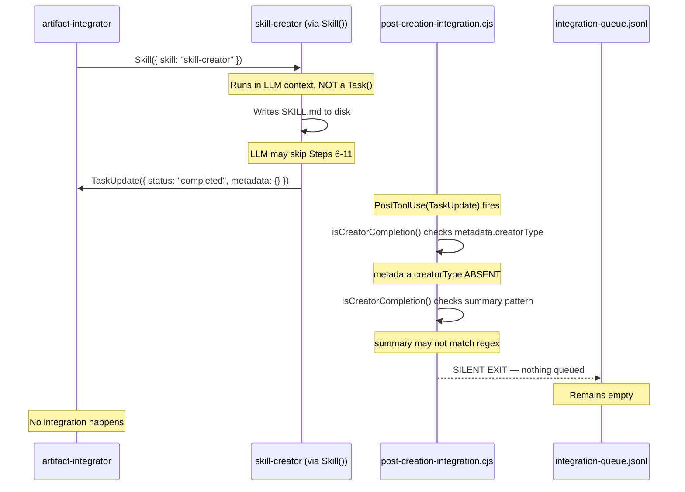

<!-- Agent: architect | Task: #9 | Session: 2026-02-18 -->

# Skill Creator Post-Creation Pipeline Bug Report

**Date**: 2026-02-18
**Task**: #9
**Artifact in Question**: `gemini-cli-security` (SKILL.md exists; all integration silently failed)
**Severity**: P1 — Systemic silent failure causing invisible artifacts

---

## Executive Summary

After `artifact-integrator` ran `skill-creator` to create `gemini-cli-security`, the SKILL.md was written to disk but all post-creation integration steps (catalog, agent assignment, agent-registry, routing table, integration queue) silently failed. Investigation reveals **five compounding failure points** in the pipeline, with the primary root cause being a **detector mismatch**: `post-creation-integration.cjs` only detects creator completions if the TaskUpdate metadata contains `creatorType` or if the summary/subject text matches specific patterns — and when `artifact-integrator` calls `Skill({ skill: "skill-creator" })` directly (without spawning a TaskUpdate with the right metadata), the hook never fires.

---

## Pipeline Architecture (Expected Flow)

```
artifact-integrator
    ↓ calls
Skill({ skill: "skill-creator" })
    ↓ runs
skill-creator writes SKILL.md
    ↓ skill-creator calls
TaskUpdate({ status: "completed", metadata: { creatorType: "skill", artifactName: "..." } })
    ↓ triggers (PostToolUse: TaskUpdate)
post-creation-integration.cjs
    ↓ if creator detected
Appends to integration-queue.jsonl
    ↓ Router reads (Step 0.5)
artifact-integrator spawned for integration gaps
    ↓
Catalog, agent assignment, CLAUDE.md updated
```

---

## Failure Points Identified

### Failure Point 1 (PRIMARY): Detector Mismatch — Hook Never Fires

**File**: `.claude/hooks/workflow/post-creation-integration.cjs`
**Function**: `isCreatorCompletion()` (lines 57–94)

The hook only fires on `PostToolUse(TaskUpdate)`. It detects creator completions via two methods:

**Method 1** — `metadata.creatorType` must be explicitly set in the TaskUpdate call.
**Method 2** — Text pattern matching on `metadata.summary + metadata.subject`.

**The problem**: When `artifact-integrator` calls `Skill({ skill: "skill-creator" })` directly, the Skill tool is NOT a TaskUpdate. Skill invocations do not emit a PostToolUse(TaskUpdate) event. Therefore, **no TaskUpdate is ever intercepted by this hook when skill-creator is called as a Skill (not as a spawned agent)**.

Furthermore, even when `skill-creator` itself calls `TaskUpdate({ status: "completed" })`, unless the metadata explicitly contains `creatorType` OR the summary text matches one of the seven regex patterns (`/creat(e|ed|ing)\s+(new\s+)?skill/i`, etc.), the hook returns `{ match: false }` and silently passes through.

**Evidence**: The integration queue file (`integration-queue.jsonl`) is empty (1 empty line). No entry was ever appended for `gemini-cli-security`. This confirms the hook never detected the creation.

---

### Failure Point 2 (SECONDARY): Artifact-Graph Node Never Created

**File**: `.claude/context/data/artifact-graph.json`

`post-creation-integration.cjs` calls `quickIntegrationCheck(artifactId, graphPath)` which uses `ArtifactGraph.getNode(artifactId)`. If the node does not exist in the graph, it returns `{ gaps: ['not-in-graph'], status: 'unknown' }`.

For `gemini-cli-security`, the node `skill:gemini-cli-security` was **never added to artifact-graph.json**. The graph was last updated `2026-02-08T02:04:00.402Z` — before this skill was created.

**Consequence**: Even IF the hook fired (it did not), the `quickIntegrationCheck` would have returned `status: 'unknown'` with gap `'not-in-graph'`. The hook would then attempt to append to the queue, but the `appendToQueueWithImpact` function would create an entry with `gaps: ['not-in-graph']` rather than the specific catalog/agent-assignment gaps needed for actionable integration.

**Root question**: Who is responsible for adding nodes to artifact-graph.json? The skill-creator SKILL.md (Steps 6–11) does not include any step to call `ArtifactGraph.addNode()`. The graph is populated by a separate tool (`.claude/tools/analysis/artifact-graph-builder.mjs`) that runs periodically — NOT during skill creation.

---

### Failure Point 3: skill-creator's Post-Creation Steps Are Aspirational, Not Executed

**File**: `.claude/skills/skill-creator/SKILL.md` (lines 895–1179)

The skill-creator defines detailed post-creation steps (Steps 6–11):

- Step 6: Update CLAUDE.md
- Step 7: Assign to agents
- Step 8: Update skill catalog
- Step 10: Run `validate-integration.cjs`
- Step 11: Regenerate skill index

**These steps are written as instructions to the LLM agent**, not as automated code that executes. When `artifact-integrator` invokes `Skill({ skill: "skill-creator" })`, the LLM running skill-creator must actively choose to execute each post-creation step.

The skill explicitly calls out post-creation integration via `runIntegrationChecklist()` and `queueCrossCreatorReview()` (lines 776–796), but these are code examples in documentation, not actual executable calls wired to the skill's execution path. There is no `scripts/main.cjs` logic that forces these steps — the SKILL.md is cognitive/prompt-driven (line 22: "No standalone utility script; use via agent context").

**The silent failure mechanism**: If the LLM agent running skill-creator generates the SKILL.md file but fails to execute Steps 6–11 (due to context pressure, misunderstanding, or tool restrictions), nothing in the automated infrastructure catches this. The hook depends on a properly-formatted TaskUpdate from the agent — but if the agent's TaskUpdate omits `creatorType` in metadata, or completes with a generic summary that doesn't match the patterns, the hook silently passes.

---

### Failure Point 4: artifact-integrator's TaskUpdate Metadata Format Not Validated

**File**: `.claude/agents/orchestrators/artifact-integrator.md`

The artifact-integrator agent definition does NOT specify what metadata format must be included in its TaskUpdate calls. Specifically, there is no requirement documented in the agent file that:

- `metadata.creatorType` must be set to `"skill"` when invoking skill-creator
- `metadata.artifactName` must match the skill name
- `metadata.artifactPath` must point to the SKILL.md

The `isCreatorCompletion()` hook's Method 1 requires `toolInput.metadata?.creatorType` — but if artifact-integrator completes the overall integration task with a summary like "Integrated gemini-cli-security security skill", the Method 2 pattern `/creat(e|ed|ing)\s+(new\s+)?skill/i` would match. However, artifact-integrator calls `Skill()` to delegate to skill-creator, not a TaskUpdate that it controls. The hook intercepts TaskUpdate on **the outer artifact-integrator task**, not on the inner Skill() invocation.

---

### Failure Point 5: Router Step 0.5 Only Reads Existing Queue Entries

**File**: `.claude/CLAUDE.md` (Step 0.5 — CHECK INTEGRATION QUEUE)

The router's Step 0.5 checks `integration-queue.jsonl` for unprocessed entries and spawns `artifact-integrator` in background. But if the queue is empty (because the hook never fired — Failure Point 1), Step 0.5 finds nothing to process. The feedback loop breaks at the source.

---

## Pipeline Diagram (Actual Failing Flow)

```
artifact-integrator
    ↓ calls
Skill({ skill: "skill-creator" })  ← NOT a TaskUpdate, hook cannot intercept this
    ↓
skill-creator LLM writes SKILL.md to disk  ← SKILL.md exists
    ↓
skill-creator LLM calls TaskUpdate({ status: "completed", metadata: { summary: "..." } })
    ↓ triggers PostToolUse(TaskUpdate)
post-creation-integration.cjs receives hook
    ↓
isCreatorCompletion() checks metadata.creatorType → MISSING
isCreatorCompletion() checks summary pattern → POSSIBLY MISSING or pattern mismatch
    ↓ if no match:
{ match: false } — hook silently exits, returns { allow: true }
    ↓
integration-queue.jsonl — NO ENTRY ADDED
    ↓
Router Step 0.5 — finds empty queue, does nothing
    ↓
Catalog NOT updated, agents NOT assigned, CLAUDE.md NOT updated
```

---

## Root Cause Summary

| #   | Root Cause                                                                                             | Severity | Mechanism                                                                                                                    |
| --- | ------------------------------------------------------------------------------------------------------ | -------- | ---------------------------------------------------------------------------------------------------------------------------- |
| 1   | `post-creation-integration.cjs` cannot intercept `Skill()` invocations — only `TaskUpdate` events      | P0       | Hook trigger mismatch. Skill() is not a TaskUpdate, so PostToolUse(TaskUpdate) never fires for the skill-creator invocation. |
| 2   | Even when TaskUpdate IS called, `metadata.creatorType` is often absent and pattern matching is fragile | P1       | Both detection methods (explicit field + regex) can fail silently for imprecise summaries                                    |
| 3   | `artifact-graph.json` is not updated during skill creation — node `skill:gemini-cli-security` absent   | P1       | Graph only updated by periodic batch tool, not by skill-creator itself                                                       |
| 4   | skill-creator's post-creation Steps 6–11 are LLM-instructed, not automated — prone to being skipped    | P1       | No enforced code path guarantees catalog/agent-assignment steps execute                                                      |
| 5   | artifact-integrator agent definition does not mandate specific TaskUpdate metadata format              | P2       | No contract enforcement on `creatorType`, `artifactName`, `artifactPath` metadata                                            |

---

## Recommended Fixes

### Fix 1 (Highest Priority): Hook-on-Write Pattern

Register `post-creation-integration.cjs` (or a lightweight variant) on `PostToolUse(Write|Edit)` that matches SKILL.md path patterns. When a SKILL.md write is detected, immediately queue the skill for integration analysis — regardless of TaskUpdate metadata.

```javascript
// In settings.json, add:
{
  "matcher": "Write",
  "hooks": [{
    "type": "command",
    "command": "node .claude/hooks/workflow/post-creation-integration.cjs"
  }]
}
// The hook should detect: path matches /\.claude\/skills\/[^/]+\/SKILL\.md$/
// If so, queue artifact-id = "skill:{name}" for integration
```

### Fix 2: Mandate creatorType in skill-creator's TaskUpdate

Add an iron law to skill-creator's SKILL.md (and the create.cjs script, if it calls TaskUpdate): the TaskUpdate completion call MUST include:

```javascript
TaskUpdate({
  taskId: '...',
  status: 'completed',
  metadata: {
    creatorType: 'skill', // MANDATORY for hook detection
    artifactName: '{skill-name}', // MANDATORY for artifact ID
    artifactPath: '.claude/skills/{skill-name}/SKILL.md', // MANDATORY
    summary: 'Created skill {skill-name}',
  },
});
```

### Fix 3: Update artifact-graph.json During skill-creator Execution

Add a step to skill-creator's execution workflow (and/or the `create.cjs` script) that calls `ArtifactGraph.addNode()` immediately after writing SKILL.md:

```javascript
const { ArtifactGraph } = require('.claude/lib/workflow/artifact-graph.cjs');
const graph = new ArtifactGraph(DEFAULT_ARTIFACT_GRAPH_PATH);
graph.addNode(`skill:${skillName}`, {
  type: 'skill',
  path: `.claude/skills/${skillName}/SKILL.md`,
  integrationStatus: 'created',
});
graph.save();
```

### Fix 4: Validate Integration via validate-integration.cjs (Blocking Gate)

skill-creator's Step 10 already calls `validate-integration.cjs` but this is documented as a LLM instruction, not an enforced code call. Add a `pre-completion-validation.cjs` check specifically for skill creator tasks that runs the integration CLI tool and blocks TaskUpdate(completed) if it fails.

### Fix 5: artifact-integrator's TaskUpdate Contract

Add to artifact-integrator's agent definition a required metadata contract:

```markdown
## TaskUpdate Completion Contract (MANDATORY)

When completing a skill creation task, TaskUpdate MUST include:

- metadata.creatorType: "skill" | "agent" | "hook" | etc.
- metadata.artifactName: the artifact's name
- metadata.artifactPath: relative path to primary artifact file
```

---

## Files Examined

| File                                                   | Key Finding                                                                                                                  |
| ------------------------------------------------------ | ---------------------------------------------------------------------------------------------------------------------------- |
| `.claude/hooks/workflow/post-creation-integration.cjs` | Hook only triggers on TaskUpdate; cannot intercept Skill() calls; detection logic requires fragile metadata or pattern match |
| `.claude/hooks/routing/unified-creator-guard.cjs`      | Guards against direct writes to creator paths; does NOT trigger post-creation integration itself                             |
| `.claude/skills/skill-creator/SKILL.md`                | Post-creation steps are LLM instructions, not automated code; SKILL.md exists but integration is aspirational                |
| `.claude/context/runtime/integration-queue.jsonl`      | Empty (1 line) — confirms hook never fired for gemini-cli-security                                                           |
| `.claude/context/data/artifact-graph.json`             | `skill:gemini-cli-security` node absent — graph not updated during creation                                                  |
| `.claude/agents/orchestrators/artifact-integrator.md`  | No mandatory TaskUpdate metadata contract for creatorType/artifactName                                                       |
| `.claude/settings.json`                                | `post-creation-integration.cjs` registered only on `PostToolUse(TaskUpdate)` — confirms trigger scope limitation             |
| `.claude/lib/workflow/artifact-graph.cjs`              | `quickIntegrationCheck` returns `not-in-graph` if node absent; correct behavior but depends on node existing                 |

---

## Architecture Diagram: Root Cause



---

## BACKWARD_PROPAGATION

**Pattern**: Silent failure in post-creation integration pipeline — skill/agent/hook creators run but integration is never verified or queued, producing orphaned artifacts invisible to the framework
**Proposed Artifact**: `hook:write-triggered-integration-detector`
**Affected Components**: [skill-creator, agent-creator, hook-creator, workflow-creator, artifact-integrator, post-creation-integration.cjs, integration-queue.jsonl]
**Architectural Rationale**: The current hook-on-TaskUpdate pattern is brittle because: (a) Skill() invocations are not TaskUpdates, (b) metadata format is not enforced, and (c) artifact-graph.json is only updated periodically. A hook-on-Write(SKILL.md) pattern would catch all creation events regardless of the invocation path, making integration detection robust by construction.
**Impact Radius**: 7+ components; every creator skill is affected
**Priority**: P1 (critical architectural consistency)
