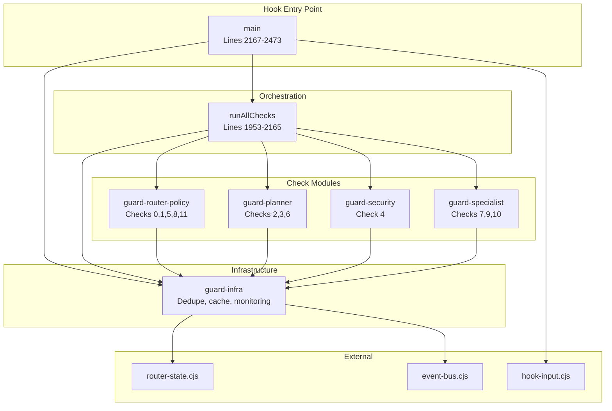
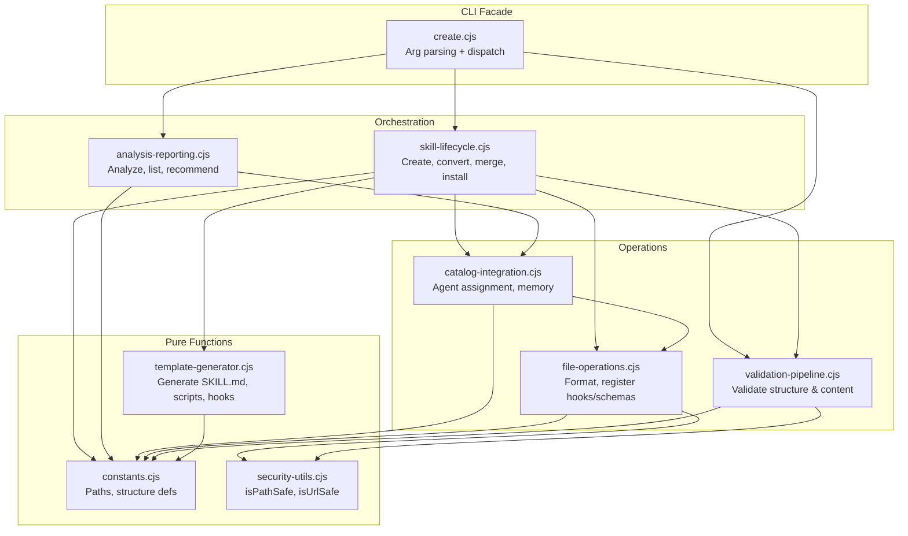

<!-- Agent: code-simplifier | Task: #10 | Session: 2026-02-13 -->

# Code Simplifier Split Analysis — Concrete Decomposition Maps

**Date**: 2026-02-13
**Author**: code-simplifier (Task #10)
**Input**: refactoring-design-2026-02-13.md (architect's design), routing-guard.cjs (79KB), skill-creator/create.cjs (107KB)

---

## Executive Summary

Analyzed 2 oversized modules (routing-guard.cjs: 2,473 lines, create.cjs: 3,677 lines) to produce concrete split maps with:

- **Exact line ranges** for 38 functions in routing-guard.cjs → 6 modules
- **Exact line ranges** for 55 functions in skill-creator/create.cjs → 7 modules + facade
- **Dependency graphs** showing function call relationships
- **Shared state inventory** (variables passed between modules)
- **Cut point identification** for clean splits
- **Cross-cutting concerns** flagged for refactoring

---

## Table of Contents

1. [routing-guard.cjs Split (79KB → 6 Modules)](#1-routing-guardcjs-split)
2. [skill-creator/create.cjs Split (107KB → 7 Modules + Facade)](#2-skill-creatorcreatecjs-split)
3. [Shared State Analysis](#3-shared-state-analysis)
4. [Dependency Graphs](#4-dependency-graphs)
5. [Migration Risks and Mitigation](#5-migration-risks-and-mitigation)

---

## 1. routing-guard.cjs Split

**Current State**: 2,473 lines, 79KB, 38 functions, 12 check types

### 1.1 Complete Function Inventory (All 38 Functions)

| Line Range | Function Name | LOC | Responsibility |
|------------|---------------|-----|----------------|
| 73-86 | `getMemoryMonitor()` | 14 | Lazy-load memory monitor singleton |
| 100-109 | `getViolationTracker()` | 10 | Lazy-load violation tracker singleton |
| 116-125 | `getBlockDedupeState()` | 10 | Read block dedupe state from file |
| 127-134 | `setBlockDedupeState(state)` | 8 | Write block dedupe state to file |
| 136-146 | `resolveDedupeSessionId(hookInput)` | 11 | Extract session ID from env/hookInput |
| 148-162 | `registerBlockAttempt(checkName, toolName, hookInput)` | 15 | Register block event, return dedupe decision |
| 164-169 | `compactFallbackMessage(title, toolName, count, fallback)` | 6 | Format compact fallback message for dedupe |
| 171-177 | `shouldDelegateTaskChecksToPreTaskUnified(toolName)` | 7 | Check if Task checks should delegate to pre-task hook |
| 179-185 | `extractDedupeCount(message)` | 7 | Parse dedupe count from existing message |
| 208-256 | `applyStaleDetection(state)` | 49 | Apply staleness detection to router state |
| 263-273 | `getCachedRouterState()` | 11 | Get cached router state (perf optimization) |
| 278-281 | `invalidateCachedState()` | 4 | Invalidate router state cache |
| 295-303 | `isRouterInvocation(hookInput)` | 9 | Detect if this is router context (vs agent) |
| 685-694 | `isAlwaysAllowedWrite(filePath)` | 10 | Check if write path is always allowed |
| 696-712 | `isPlannerSpawn(toolInput)` | 17 | Detect planner spawn from toolInput |
| 714-730 | `isSecuritySpawn(toolInput)` | 17 | Detect security-architect spawn |
| 732-746 | `isImplementationAgentSpawn(toolInput)` | 15 | Detect implementation agent spawn |
| 748-759 | `isWhitelistedBashCommand(command)` | 12 | Check if bash command is whitelisted |
| 761-780 | `extractTaskIdFromPrompt(prompt)` | 20 | Extract task ID from spawn prompt |
| 782-906 | `checkRouterBash(toolName, toolInput, hookInput)` | 125 | Check 0: Router bash command validation |
| 908-1011 | `checkRouterSelfCheck(toolName, toolInput, hookInput)` | 104 | Check 1: Router blacklisted tool check |
| 1013-1062 | `checkPlannerFirst(toolName, toolInput)` | 50 | Check 2: Planner-first enforcement |
| 1064-1116 | `checkTaskCreate(toolName, hookInput)` | 53 | Check 3: Task-create complexity guard |
| 1118-1165 | `checkSecurityReview(toolName, toolInput)` | 48 | Check 4: Security review enforcement |
| 1167-1225 | `checkRouterWrite(toolName, toolInput)` | 59 | Check 5: Router write guard |
| 1227-1319 | `checkMemoryPressure(toolName)` | 93 | Check 6: Memory pressure throttle |
| 1321-1407 | `checkSpecialistOverride(toolName, toolInput)` | 87 | Check 7: Specialist routing enforcement |
| 1409-1473 | `checkTaskListFirstGate(toolName, hookInput)` | 65 | Check 8: TaskList-first gate |
| 1475-1637 | `checkCreatorIntentGuard(toolName, toolInput)` | 163 | Check 9: Creator intent guard |
| 1639-1665 | `detectIntent(text)` | 27 | Detect user intent from text |
| 1667-1683 | `agentMatchesIntent(subagentType, suggestedAgents)` | 17 | Check if agent matches detected intent |
| 1685-1745 | `checkIntentAgentMatch(toolName, toolInput)` | 61 | Check 10: Intent-agent alignment |
| 1747-1782 | `extractAgentTypeFromPrompt(prompt)` | 36 | Extract agent type from spawn prompt |
| 1784-1805 | `extractModelFromToolInput(toolInput)` | 22 | Extract model from toolInput |
| 1807-1951 | `checkConfigModelValidator(toolName, toolInput, hookInput)` | 145 | Check 11: Config model validation |
| 1953-2165 | `runAllChecks(toolName, toolInput, hookInput)` | 213 | Orchestration: run all 12 checks in sequence |
| 2167-2473 | `main()` | 307 | Hook entry point: stdin/stdout protocol |

**Constants & Shared State** (lines 111-683):
- `ROUTING_RUNTIME_DIR` (line 111)
- `BLOCK_DEDUPE_STATE_PATH` (line 112)
- `BLOCK_DEDUPE_THRESHOLD` (line 113)
- `BLOCK_DEDUPE_WINDOW_MS` (line 114)
- `_cachedRouterState` (line 195)
- `_stateCacheEnabled` (line 196)
- `ALL_WATCHED_TOOLS` (line ~320)
- `BLACKLISTED_TOOLS` (line ~340)
- `WHITELISTED_TOOLS` (line ~360)
- `WRITE_TOOLS` (line ~380)
- `ROUTER_BASH_WHITELIST` (line ~400)
- `ALWAYS_ALLOWED_WRITE_PATTERNS` (line ~420)
- `PLANNER_PATTERNS` (line ~450)
- `SECURITY_PATTERNS` (line ~480)
- `IMPLEMENTATION_AGENTS` (line ~510)
- `SPECIALIST_KEYWORD_MAP` (line ~540)
- `INTENT_PATTERNS` (line ~600)

### 1.2 Proposed Module Boundaries (6 Modules)

```
.claude/hooks/routing/
  routing-guard.cjs              (~150 lines) -- Hook entry point (main + stdin protocol)
  guards/
    guard-core.cjs               (~300 lines) -- runAllChecks orchestration
    guard-infra.cjs              (~200 lines) -- Dedupe, monitoring, state caching
    guard-planner.cjs            (~250 lines) -- Checks 2, 3, 6 (planner-first, task-create, memory)
    guard-security.cjs           (~150 lines) -- Check 4 (security review)
    guard-specialist.cjs         (~400 lines) -- Checks 7, 9, 10 (specialist, creator, intent)
    guard-router-policy.cjs      (~500 lines) -- Checks 0, 1, 5, 8, 11 (bash, self, write, tasklist, model)
```

### 1.3 Exact Module Split Map

#### Module: `guard-infra.cjs` (Lines 100-281 + constants)
**Responsibility**: Shared infrastructure (dedupe, monitoring, caching)

| Function | Lines | Depends On |
|----------|-------|------------|
| `getMemoryMonitor()` | 73-86 | None (lazy require) |
| `getViolationTracker()` | 100-109 | None (lazy require) |
| `getBlockDedupeState()` | 116-125 | `BLOCK_DEDUPE_STATE_PATH` |
| `setBlockDedupeState(state)` | 127-134 | `ROUTING_RUNTIME_DIR`, `BLOCK_DEDUPE_STATE_PATH` |
| `resolveDedupeSessionId(hookInput)` | 136-146 | None |
| `registerBlockAttempt(checkName, toolName, hookInput)` | 148-162 | `getBlockDedupeState()`, `setBlockDedupeState()`, `resolveDedupeSessionId()`, `BLOCK_DEDUPE_THRESHOLD`, `BLOCK_DEDUPE_WINDOW_MS` |
| `compactFallbackMessage(title, toolName, count, fallback)` | 164-169 | None |
| `shouldDelegateTaskChecksToPreTaskUnified(toolName)` | 171-177 | None |
| `extractDedupeCount(message)` | 179-185 | None |
| `applyStaleDetection(state)` | 208-256 | None |
| `getCachedRouterState()` | 263-273 | `routerState.getState()`, `applyStaleDetection()`, `_cachedRouterState`, `_stateCacheEnabled` |
| `invalidateCachedState()` | 278-281 | `routerState.invalidateStateCache()`, `_cachedRouterState` |
| `isRouterInvocation(hookInput)` | 295-303 | None |

**Exports**:
```javascript
module.exports = {
  getMemoryMonitor,
  getViolationTracker,
  getBlockDedupeState,
  setBlockDedupeState,
  resolveDedupeSessionId,
  registerBlockAttempt,
  compactFallbackMessage,
  shouldDelegateTaskChecksToPreTaskUnified,
  extractDedupeCount,
  applyStaleDetection,
  getCachedRouterState,
  invalidateCachedState,
  isRouterInvocation,
  // Constants
  ROUTING_RUNTIME_DIR,
  BLOCK_DEDUPE_STATE_PATH,
  BLOCK_DEDUPE_THRESHOLD,
  BLOCK_DEDUPE_WINDOW_MS,
};
```

#### Module: `guard-router-policy.cjs` (Lines 685-906 + 908-1011 + 1167-1225 + 1409-1473 + 1807-1951 + constants)
**Responsibility**: Router-specific policy checks (bash, self-check, write, tasklist, model)

| Function | Lines | Purpose | Check # |
|----------|-------|---------|---------|
| `isAlwaysAllowedWrite(filePath)` | 685-694 | Check if write is always allowed | Helper |
| `isWhitelistedBashCommand(command)` | 748-759 | Check if bash command is whitelisted | Helper |
| `extractTaskIdFromPrompt(prompt)` | 761-780 | Extract task ID from prompt | Helper |
| `checkRouterBash(toolName, toolInput, hookInput)` | 782-906 | Bash command whitelist enforcement | Check 0 |
| `checkRouterSelfCheck(toolName, toolInput, hookInput)` | 908-1011 | Router blacklisted tools check | Check 1 |
| `checkRouterWrite(toolName, toolInput)` | 1167-1225 | Router write guard | Check 5 |
| `checkTaskListFirstGate(toolName, hookInput)` | 1409-1473 | TaskList-first gate | Check 8 |
| `extractModelFromToolInput(toolInput)` | 1784-1805 | Extract model from toolInput | Helper |
| `checkConfigModelValidator(toolName, toolInput, hookInput)` | 1807-1951 | Config model validation | Check 11 |

**Constants Used** (lines 320-420):
- `ALL_WATCHED_TOOLS`
- `BLACKLISTED_TOOLS`
- `WHITELISTED_TOOLS`
- `WRITE_TOOLS`
- `ROUTER_BASH_WHITELIST`
- `ALWAYS_ALLOWED_WRITE_PATTERNS`

**Exports**:
```javascript
module.exports = {
  isAlwaysAllowedWrite,
  isWhitelistedBashCommand,
  extractTaskIdFromPrompt,
  checkRouterBash,
  checkRouterSelfCheck,
  checkRouterWrite,
  checkTaskListFirstGate,
  extractModelFromToolInput,
  checkConfigModelValidator,
  // Constants
  ALL_WATCHED_TOOLS,
  BLACKLISTED_TOOLS,
  WHITELISTED_TOOLS,
  WRITE_TOOLS,
  ROUTER_BASH_WHITELIST,
  ALWAYS_ALLOWED_WRITE_PATTERNS,
};
```

#### Module: `guard-planner.cjs` (Lines 696-712 + 1013-1062 + 1064-1116 + 1227-1319 + constants)
**Responsibility**: Planner-first, task-create, memory pressure checks

| Function | Lines | Purpose | Check # |
|----------|-------|---------|---------|
| `isPlannerSpawn(toolInput)` | 696-712 | Detect planner spawn | Helper |
| `checkPlannerFirst(toolName, toolInput)` | 1013-1062 | Planner-first enforcement | Check 2 |
| `checkTaskCreate(toolName, hookInput)` | 1064-1116 | Task-create complexity guard | Check 3 |
| `checkMemoryPressure(toolName)` | 1227-1319 | Memory pressure throttle | Check 6 |

**Constants Used** (lines 450-460):
- `PLANNER_PATTERNS`

**Exports**:
```javascript
module.exports = {
  isPlannerSpawn,
  checkPlannerFirst,
  checkTaskCreate,
  checkMemoryPressure,
  // Constants
  PLANNER_PATTERNS,
};
```

#### Module: `guard-security.cjs` (Lines 714-730 + 732-746 + 1118-1165 + constants)
**Responsibility**: Security review enforcement

| Function | Lines | Purpose | Check # |
|----------|-------|---------|---------|
| `isSecuritySpawn(toolInput)` | 714-730 | Detect security-architect spawn | Helper |
| `isImplementationAgentSpawn(toolInput)` | 732-746 | Detect implementation agent spawn | Helper |
| `checkSecurityReview(toolName, toolInput)` | 1118-1165 | Security review enforcement | Check 4 |

**Constants Used** (lines 480-510):
- `SECURITY_PATTERNS`
- `IMPLEMENTATION_AGENTS`

**Exports**:
```javascript
module.exports = {
  isSecuritySpawn,
  isImplementationAgentSpawn,
  checkSecurityReview,
  // Constants
  SECURITY_PATTERNS,
  IMPLEMENTATION_AGENTS,
};
```

#### Module: `guard-specialist.cjs` (Lines 1321-1407 + 1475-1637 + 1639-1665 + 1667-1683 + 1685-1745 + 1747-1782 + constants)
**Responsibility**: Specialist routing, creator intent, intent-agent matching

| Function | Lines | Purpose | Check # |
|----------|-------|---------|---------|
| `checkSpecialistOverride(toolName, toolInput)` | 1321-1407 | Specialist routing enforcement | Check 7 |
| `checkCreatorIntentGuard(toolName, toolInput)` | 1475-1637 | Creator intent guard | Check 9 |
| `detectIntent(text)` | 1639-1665 | Detect user intent from text | Helper |
| `agentMatchesIntent(subagentType, suggestedAgents)` | 1667-1683 | Check if agent matches intent | Helper |
| `checkIntentAgentMatch(toolName, toolInput)` | 1685-1745 | Intent-agent alignment | Check 10 |
| `extractAgentTypeFromPrompt(prompt)` | 1747-1782 | Extract agent type from prompt | Helper |

**Constants Used** (lines 540-680):
- `SPECIALIST_KEYWORD_MAP`
- `INTENT_PATTERNS`

**Exports**:
```javascript
module.exports = {
  checkSpecialistOverride,
  checkCreatorIntentGuard,
  detectIntent,
  agentMatchesIntent,
  checkIntentAgentMatch,
  extractAgentTypeFromPrompt,
  // Constants
  SPECIALIST_KEYWORD_MAP,
  INTENT_PATTERNS,
};
```

#### Module: `guard-core.cjs` (Lines 1953-2165)
**Responsibility**: Orchestration (runAllChecks)

| Function | Lines | Purpose |
|----------|-------|---------|
| `runAllChecks(toolName, toolInput, hookInput)` | 1953-2165 | Orchestrate all 12 checks in sequence |

**Dependencies**: Imports all check functions from the 5 modules above.

**Exports**:
```javascript
module.exports = {
  runAllChecks,
};
```

**Implementation**:
```javascript
const { checkRouterBash, checkRouterSelfCheck, checkRouterWrite, checkTaskListFirstGate, checkConfigModelValidator } = require('./guard-router-policy.cjs');
const { checkPlannerFirst, checkTaskCreate, checkMemoryPressure } = require('./guard-planner.cjs');
const { checkSecurityReview } = require('./guard-security.cjs');
const { checkSpecialistOverride, checkCreatorIntentGuard, checkIntentAgentMatch } = require('./guard-specialist.cjs');
const { extractDedupeCount, registerBlockAttempt, compactFallbackMessage, getCachedRouterState, shouldDelegateTaskChecksToPreTaskUnified } = require('./guard-infra.cjs');

function runAllChecks(toolName, toolInput, hookInput = null) {
  const warnings = [];
  const captureWarn = (name, result) => {
    if (result.result === 'warn' && result.message) {
      warnings.push({ check: name, message: result.message });
    }
  };

  // Ordered check pipeline (exact line 1964-2130 pattern)
  const checks = [
    ['tasklist-first-gate', () => checkTaskListFirstGate(toolName, hookInput)],
    ['router-bash-check', () => checkRouterBash(toolName, toolInput, hookInput)],
    ['router-self-check', () => checkRouterSelfCheck(toolName, toolInput, hookInput)],
    ['planner-first', () => checkPlannerFirst(toolName, toolInput)],
    ['task-create', () => checkTaskCreate(toolName, hookInput)],
    ['security-review', () => checkSecurityReview(toolName, toolInput)],
    ['router-write', () => checkRouterWrite(toolName, toolInput)],
    ['memory-pressure', () => checkMemoryPressure(toolName)],
    ['specialist-override', () => checkSpecialistOverride(toolName, toolInput)],
    ['creator-intent', () => checkCreatorIntentGuard(toolName, toolInput)],
    ['intent-agent-match', () => checkIntentAgentMatch(toolName, toolInput)],
    ['config-model', () => checkConfigModelValidator(toolName, toolInput, hookInput)],
  ];

  for (const [name, checkFn] of checks) {
    const result = checkFn();
    if (!result.pass) {
      return { ...result, checkName: name, warnings };
    }
    captureWarn(name, result);
  }

  return { pass: true, result: 'allow', message: '', warnings };
}
```

#### Module: `routing-guard.cjs` (Lines 1-72 + 2167-2473, slim hook entry point)
**Responsibility**: Hook stdin/stdout protocol only

**Implementation**:
```javascript
#!/usr/bin/env node
'use strict';

const { parseHookInputAsync, getToolName, getToolInput, formatResult, auditLog } = require('../../lib/utils/hook-input.cjs');
const { runAllChecks } = require('./guards/guard-core.cjs');
const { invalidateCachedState } = require('./guards/guard-infra.cjs');
const { ALL_WATCHED_TOOLS } = require('./guards/guard-router-policy.cjs');

async function main() {
  invalidateCachedState();
  const hookInput = await parseHookInputAsync();
  if (!hookInput) process.exit(0);

  const toolName = getToolName(hookInput);
  const toolInput = getToolInput(hookInput);
  if (!toolName || !ALL_WATCHED_TOOLS.includes(toolName)) process.exit(0);

  const result = runAllChecks(toolName, toolInput, hookInput);

  // Format and output (lines 2200-2350)
  const formatted = formatResult(result);
  console.log(formatted);

  if (result.result === 'block') {
    auditLog('routing-guard', 'block', result);
    process.exit(2);
  }
  process.exit(0);
}

main().catch(err => {
  // Fail-closed on error
  console.error(JSON.stringify({ allow: false, message: 'Hook error', error: String(err) }));
  process.exit(2);
});

// Re-export all for backward compatibility (testing)
module.exports = {
  main,
  ...require('./guards/guard-core.cjs'),
  ...require('./guards/guard-infra.cjs'),
  ...require('./guards/guard-router-policy.cjs'),
  ...require('./guards/guard-planner.cjs'),
  ...require('./guards/guard-security.cjs'),
  ...require('./guards/guard-specialist.cjs'),
};
```

### 1.4 Shared State Between Modules

**Global State** (passed via imports):
- `routerState` (from `../../lib/routing/router-state.cjs`)
- `eventBus` (from `../../lib/events/event-bus.cjs`)
- Environment variables (process.env.*)

**Module-Local State** (internal to guard-infra.cjs):
- `_cachedRouterState` (performance optimization)
- `_stateCacheEnabled` (performance flag)
- `memoryMonitor` (lazy-loaded singleton)
- `violationTracker` (lazy-loaded singleton)

**File-Based State** (persisted):
- `BLOCK_DEDUPE_STATE_PATH` (.claude/context/runtime/routing-block-dedupe.json)

**Cut Points** (Clean Separation):
- All check functions have identical signature: `(toolName, toolInput, hookInput?) => { pass, result, message }`
- No shared mutable state between check modules
- Constants are read-only (no mutation)
- guard-core.cjs is the only consumer of all 5 modules

---

## 2. skill-creator/create.cjs Split

**Current State**: 3,677 lines, 107KB, 55 functions (55 by count, architect estimated 50+)

### 2.1 Complete Function Inventory (All 55 Functions)

| Line Range | Function Name | LOC | Responsibility |
|------------|---------------|-----|----------------|
| 58-63 | `isPathSafe(filePath)` | 6 | Validate path for dangerous chars |
| 70-77 | `isUrlSafe(url)` | 8 | Validate URL for dangerous chars |
| 80-92 | `findProjectRoot()` | 13 | Locate project root (.claude parent) |
| 123-167 | `formatFile(filePath)` | 45 | Format single file with pnpm/prettier |
| 168-220 | `formatDirectory(dirPath)` | 53 | Format all files in directory |
| 221-278 | `preValidateSkill(config)` | 58 | Pre-creation validation (name, type, description) |
| 279-325 | `validateSkillContent(skillPath)` | 47 | Validate SKILL.md content structure |
| 326-360 | `checkOrphanStatus(skillName)` | 35 | Check if skill is orphaned (no agent assignments) |
| 361-491 | `generateSkillContent(config)` | 131 | Generate SKILL.md content from template |
| 492-514 | `generateScriptContent(name, description)` | 23 | Generate scripts/run.cjs content |
| 515-545 | `findProjectRoot()` | 31 | (Duplicate) Locate project root |
| 546-572 | `main()` | 27 | (Inside generateScriptContent) Script entry point |
| 573-598 | `generatePreHookContent(name, description)` | 26 | Generate pre-execute hook content |
| 599-627 | `validateInput(input)` | 29 | (Inside generatePreHookContent) Validate hook input |
| 628-653 | `generatePostHookContent(name, description)` | 26 | Generate post-execute hook content |
| 654-680 | `processResult(result)` | 27 | (Inside generatePostHookContent) Process hook result |
| 681-705 | `generateInputSchema(name, description)` | 25 | Generate input schema JSON |
| 706-738 | `generateOutputSchema(name, description)` | 33 | Generate output schema JSON |
| 739-787 | `registerHooks(skillName, hookType)` | 49 | Register hooks in settings.json |
| 788-807 | `registerSchema(skillName, schemaType)` | 20 | Register schema in settings.json |
| 808-866 | `detectComplexity(config)` | 59 | Detect skill complexity level |
| 867-908 | `generateToolScript(name, description)` | 42 | Generate tool wrapper script |
| 909-914 | `isPathSafe(filePath)` | 6 | (Duplicate) Validate path |
| 915-951 | `findProjectRoot()` | 37 | (Duplicate) Locate project root |
| 952-992 | `showHelp()` | 41 | Display CLI help text |
| 993-1013 | `loadConfig(configPath)` | 21 | Load skill config from JSON |
| 1014-1096 | `runSkill()` | 83 | Execute skill from scripts/run.cjs |
| 1097-1165 | `validateInputs()` | 69 | (Inside generateToolScript) Validate tool inputs |
| 1166-1252 | `generateToolReadme(name, description)` | 87 | Generate tool README.md |
| 1253-1281 | `createCompanionTool(name, description, skillDir)` | 29 | Create companion CLI tool |
| 1282-1512 | `createSkill(config)` | 231 | Main orchestration: create skill with all files |
| 1513-1605 | `assessHooksForSkill(skillName, skillDescription)` | 93 | Assess which hooks are relevant |
| 1606-1652 | `autoAssignToAgents(skillName, skillDescription)` | 47 | Auto-assign skill to relevant agents |
| 1653-1704 | `assignSkillToAgentSilent(skillName, agentName)` | 52 | Assign skill to agent (silent, no output) |
| 1705-1812 | `validateSkill(skillPath)` | 108 | Full skill validation (structure + content) |
| 1813-2013 | `convertCodebase(codebasePath, skillName)` | 201 | Convert external codebase to skill |
| 2014-2077 | `installSkill(repoUrl)` | 64 | Install skill from git repo |
| 2078-2143 | `assignSkillToAgent(agentName, skillName)` | 66 | Assign skill to agent (interactive) |
| 2144-2183 | `listSkills()` | 40 | List all skills with metadata |
| 2184-2206 | `calculateSimilarity(str1, str2)` | 23 | Calculate string similarity score |
| 2207-2258 | `getAllSkills()` | 52 | Get all skills from filesystem |
| 2259-2272 | `shareNamePrefix(name1, name2)` | 14 | Check if skills share name prefix |
| 2273-2393 | `analyzeSkills()` | 121 | Analyze all skills for patterns |
| 2394-2463 | `updateSkill(skillName, updates)` | 70 | Update existing skill metadata |
| 2464-2570 | `findSkillDependencies(skillName)` | 107 | Find skill dependencies (imports) |
| 2571-2597 | `updateAgentSkill(agentPath, oldSkill, newSkill)` | 27 | Update agent's skill reference |
| 2598-2809 | `mergeSkills(skill1, skill2, newName, options)` | 212 | Merge two skills into one |
| 2810-2859 | `generateSkillRecommendations()` | 50 | Generate skill recommendations |
| 2860-3052 | `convertRuleToSkill(rulePath, options)` | 193 | Convert rule file to skill |
| 3053-3147 | `convertRulesDirectory(rulesDir, options)` | 95 | Convert all rules in directory |
| 3148-3222 | `createWorkflowExample(name, description, skillDir)` | 75 | Create workflow example file |
| 3223-3260 | `updateMemory(name, description, tools)` | 38 | Update memory files with skill info |
| 3261-3278 | `generateTestCommand(name, description)` | 18 | Generate test command string |
| 3279-3302 | `generateSkillSpawnCommand(name, originalRequest)` | 24 | Generate skill spawn command |
| 3303-3312 | `showStructure()` | 10 | Show skill directory structure |

### 2.2 Proposed Module Boundaries (7 Modules + Facade)

```
.claude/skills/skill-creator/
  scripts/
    create.cjs                   (~200 lines) -- CLI facade: arg parsing + dispatch
  lib/
    constants.cjs                (~80 lines)  -- Shared constants (paths, patterns)
    security-utils.cjs           (~60 lines)  -- isPathSafe, isUrlSafe, DANGEROUS_CHARS
    validation-pipeline.cjs      (~350 lines) -- Pre-validation, content validation, orphan check, full validation
    template-generator.cjs       (~500 lines) -- All content generation (skill, script, hook, schema, tool)
    file-operations.cjs          (~250 lines) -- File I/O (formatFile, formatDirectory, registerHooks, registerSchema)
    catalog-integration.cjs      (~400 lines) -- Agent assignment, catalog updates, hook assessment
    skill-lifecycle.cjs          (~800 lines) -- createSkill, convertCodebase, installSkill, mergeSkills
    analysis-reporting.cjs       (~400 lines) -- analyzeSkills, findDependencies, generateRecommendations
```

### 2.3 Exact Module Split Map

#### Module: `constants.cjs` (Lines 94-107 + extracted constants)
**Responsibility**: Shared constants and paths (no side effects)

**Extracted Constants**:
```javascript
const path = require('path');
const fs = require('fs');

function findProjectRoot() {
  let dir = __dirname;
  while (dir !== path.parse(dir).root) {
    if (fs.existsSync(path.join(dir, '.claude'))) return dir;
    if (path.basename(dir) === '.claude') return path.dirname(dir);
    dir = path.dirname(dir);
  }
  return process.cwd();
}

const PROJECT_ROOT = findProjectRoot();
const CLAUDE_DIR = path.join(PROJECT_ROOT, '.claude');
const SKILLS_DIR = path.join(CLAUDE_DIR, 'skills');
const AGENTS_DIR = path.join(CLAUDE_DIR, 'agents');
const TOOLS_DIR = path.join(CLAUDE_DIR, 'tools');
const SKILL_SCHEMA_PATH = path.join(CLAUDE_DIR, 'schemas', 'skill-definition.schema.json');
const STRUCTURE_PATH = path.join(CLAUDE_DIR, 'skills', 'skill-creator', 'references', 'skill-structure.md');
const SETTINGS_PATH = path.join(CLAUDE_DIR, 'settings.json');

const SKILL_STRUCTURE = {
  required: ['SKILL.md'],
  optional: ['scripts/', 'hooks/', 'schemas/', 'examples/', 'tests/'],
};

const CONTENT_MINIMUMS = {
  identity: 50,
  capabilities: 100,
  instructions: 200,
  examples: 100,
  bestPractices: 50,
};

module.exports = {
  PROJECT_ROOT,
  CLAUDE_DIR,
  SKILLS_DIR,
  AGENTS_DIR,
  TOOLS_DIR,
  SKILL_SCHEMA_PATH,
  STRUCTURE_PATH,
  SETTINGS_PATH,
  SKILL_STRUCTURE,
  CONTENT_MINIMUMS,
};
```

#### Module: `security-utils.cjs` (Lines 45-77)
**Responsibility**: Path/URL safety validation (stateless)

| Function | Lines | Purpose |
|----------|-------|---------|
| `isPathSafe(filePath)` | 58-63 | Validate path for dangerous chars |
| `isUrlSafe(url)` | 70-77 | Validate URL for dangerous chars |

**Constants Used**:
- `DANGEROUS_CHARS` (lines 45-51): `['|', '&', ';', '`', '$', '(', ')', '<', '>', '\n', '\r']`

**Exports**:
```javascript
module.exports = {
  isPathSafe,
  isUrlSafe,
  DANGEROUS_CHARS,
};
```

#### Module: `validation-pipeline.cjs` (Lines 221-360 + 1705-1812)
**Responsibility**: Validation stages (pre-validation, content validation, orphan check, full validation)

| Function | Lines | Purpose |
|----------|-------|---------|
| `preValidateSkill(config)` | 221-278 | Pre-creation validation (name, type, description) |
| `validateSkillContent(skillPath)` | 279-325 | Validate SKILL.md structure |
| `checkOrphanStatus(skillName)` | 326-360 | Check if skill is orphaned |
| `validateSkill(skillPath)` | 1705-1812 | Full validation (structure + content) |

**Dependencies**: `constants.cjs`, `security-utils.cjs`

**Exports**:
```javascript
module.exports = {
  preValidateSkill,
  validateSkillContent,
  checkOrphanStatus,
  validateSkill,
};
```

#### Module: `template-generator.cjs` (Lines 361-738)
**Responsibility**: Pure content generation functions (no file I/O)

| Function | Lines | Purpose |
|----------|-------|---------|
| `generateSkillContent(config)` | 361-491 | Generate SKILL.md content |
| `generateScriptContent(name, description)` | 492-545 | Generate scripts/run.cjs |
| `generatePreHookContent(name, description)` | 573-627 | Generate pre-execute hook |
| `generatePostHookContent(name, description)` | 628-680 | Generate post-execute hook |
| `generateInputSchema(name, description)` | 681-705 | Generate input schema JSON |
| `generateOutputSchema(name, description)` | 706-738 | Generate output schema JSON |
| `generateToolScript(name, description)` | 867-908 | Generate tool wrapper script |
| `generateToolReadme(name, description)` | 1166-1252 | Generate tool README |
| `createWorkflowExample(name, description, skillDir)` | 3148-3222 | Generate workflow example |
| `generateTestCommand(name, description)` | 3261-3278 | Generate test command string |
| `generateSkillSpawnCommand(name, originalRequest)` | 3279-3302 | Generate skill spawn command |

**Dependencies**: `constants.cjs`

**Exports**:
```javascript
module.exports = {
  generateSkillContent,
  generateScriptContent,
  generatePreHookContent,
  generatePostHookContent,
  generateInputSchema,
  generateOutputSchema,
  generateToolScript,
  generateToolReadme,
  createWorkflowExample,
  generateTestCommand,
  generateSkillSpawnCommand,
};
```

#### Module: `file-operations.cjs` (Lines 123-220 + 739-807)
**Responsibility**: File I/O (formatting, hook/schema registration)

| Function | Lines | Purpose |
|----------|-------|---------|
| `formatFile(filePath)` | 123-167 | Format single file |
| `formatDirectory(dirPath)` | 168-220 | Format all files in directory |
| `registerHooks(skillName, hookType)` | 739-787 | Register hooks in settings.json |
| `registerSchema(skillName, schemaType)` | 788-807 | Register schema in settings.json |

**Dependencies**: `constants.cjs`, `security-utils.cjs`

**Exports**:
```javascript
module.exports = {
  formatFile,
  formatDirectory,
  registerHooks,
  registerSchema,
};
```

#### Module: `catalog-integration.cjs` (Lines 1513-1704 + 2078-2143 + 2571-2597 + 3223-3260)
**Responsibility**: Agent assignment, catalog updates, memory updates

| Function | Lines | Purpose |
|----------|-------|---------|
| `assessHooksForSkill(skillName, skillDescription)` | 1513-1605 | Assess relevant hooks |
| `autoAssignToAgents(skillName, skillDescription)` | 1606-1652 | Auto-assign to agents |
| `assignSkillToAgentSilent(skillName, agentName)` | 1653-1704 | Silent agent assignment |
| `assignSkillToAgent(agentName, skillName)` | 2078-2143 | Interactive agent assignment |
| `updateAgentSkill(agentPath, oldSkill, newSkill)` | 2571-2597 | Update agent skill reference |
| `updateMemory(name, description, tools)` | 3223-3260 | Update memory files |

**Constants Used** (lines 1513-1560):
- `AGENT_SKILL_RELEVANCE` (maps skill keywords to agent types)

**Dependencies**: `constants.cjs`, `file-operations.cjs`

**Exports**:
```javascript
module.exports = {
  assessHooksForSkill,
  autoAssignToAgents,
  assignSkillToAgent,
  assignSkillToAgentSilent,
  updateAgentSkill,
  updateMemory,
  AGENT_SKILL_RELEVANCE,
};
```

#### Module: `skill-lifecycle.cjs` (Lines 808-866 + 1014-1281 + 1282-1512 + 1813-2077 + 2598-3052)
**Responsibility**: Full skill lifecycle operations (create, convert, merge, install)

| Function | Lines | Purpose |
|----------|-------|---------|
| `detectComplexity(config)` | 808-866 | Detect skill complexity |
| `runSkill()` | 1014-1096 | Execute skill from scripts/run.cjs |
| `createCompanionTool(name, description, skillDir)` | 1253-1281 | Create companion CLI tool |
| `createSkill(config)` | 1282-1512 | Main orchestration: create skill |
| `convertCodebase(codebasePath, skillName)` | 1813-2013 | Convert external codebase |
| `installSkill(repoUrl)` | 2014-2077 | Install skill from repo |
| `mergeSkills(skill1, skill2, newName, options)` | 2598-2809 | Merge two skills |
| `convertRuleToSkill(rulePath, options)` | 2860-3052 | Convert rule to skill |
| `convertRulesDirectory(rulesDir, options)` | 3053-3147 | Convert rules directory |

**Dependencies**: ALL modules above (orchestration layer)

**Exports**:
```javascript
module.exports = {
  detectComplexity,
  runSkill,
  createCompanionTool,
  createSkill,
  convertCodebase,
  installSkill,
  mergeSkills,
  convertRuleToSkill,
  convertRulesDirectory,
};
```

#### Module: `analysis-reporting.cjs` (Lines 2144-2272 + 2273-2393 + 2394-2463 + 2464-2570 + 2810-2859 + 3303-3312)
**Responsibility**: Analysis, reporting, recommendations

| Function | Lines | Purpose |
|----------|-------|---------|
| `listSkills()` | 2144-2183 | List all skills |
| `calculateSimilarity(str1, str2)` | 2184-2206 | String similarity score |
| `getAllSkills()` | 2207-2258 | Get all skills from filesystem |
| `shareNamePrefix(name1, name2)` | 2259-2272 | Check shared name prefix |
| `analyzeSkills()` | 2273-2393 | Analyze skill patterns |
| `updateSkill(skillName, updates)` | 2394-2463 | Update skill metadata |
| `findSkillDependencies(skillName)` | 2464-2570 | Find skill dependencies |
| `generateSkillRecommendations()` | 2810-2859 | Generate recommendations |
| `showStructure()` | 3303-3312 | Show directory structure |

**Dependencies**: `constants.cjs`, `catalog-integration.cjs`

**Exports**:
```javascript
module.exports = {
  listSkills,
  calculateSimilarity,
  getAllSkills,
  shareNamePrefix,
  analyzeSkills,
  updateSkill,
  findSkillDependencies,
  generateSkillRecommendations,
  showStructure,
};
```

#### Module: `create.cjs` (Slim CLI Facade, ~200 lines)
**Responsibility**: CLI argument parsing and dispatch only

**Implementation**:
```javascript
#!/usr/bin/env node
'use strict';

const lifecycle = require('../lib/skill-lifecycle.cjs');
const analysis = require('../lib/analysis-reporting.cjs');
const validation = require('../lib/validation-pipeline.cjs');

// Parse CLI args (lines 108-117 pattern)
const args = process.argv.slice(2);
const options = {};
for (let i = 0; i < args.length; i++) {
  if (args[i].startsWith('--')) {
    const key = args[i].slice(2);
    const value = args[i + 1] && !args[i + 1].startsWith('--') ? args[++i] : true;
    options[key] = value;
  }
}

// Dispatch table
const DISPATCH = {
  help:              () => showHelp(),
  'show-structure':  () => analysis.showStructure(),
  analyze:           () => analysis.analyzeSkills(),
  recommend:         () => analysis.generateSkillRecommendations(),
  list:              () => analysis.listSkills(),
  validate:          (o) => process.exit(validation.validateSkill(o.validate) ? 0 : 1),
  install:           (o) => lifecycle.installSkill(o.install),
  'convert-codebase':(o) => lifecycle.convertCodebase(o['convert-codebase'], o.name),
  'convert-rule':    (o) => lifecycle.convertRuleToSkill(o['convert-rule'], { name: o.name, force: o.force }),
  'convert-rules':   (o) => lifecycle.convertRulesDirectory(o['convert-rules'], { force: o.force }),
  merge:             (o, args) => handleMerge(o, args),
  update:            (o) => lifecycle.updateSkill(o.update, { description: o.description }),
  name:              (o) => lifecycle.createSkill(o),
};

// Execute first matching command
for (const [flag, handler] of Object.entries(DISPATCH)) {
  if (options[flag]) {
    handler(options, args);
    process.exit(0);
  }
}

console.log('No action specified. Use --help for usage.');
process.exit(1);

// Helper functions
function showHelp() {
  console.log(`
Skill Creator CLI

Usage: node create.cjs [options]

Options:
  --name <name>           Create new skill
  --description <desc>    Skill description
  --type <type>           Skill type (cognitive|operational)
  --validate <path>       Validate skill structure
  --list                  List all skills
  --analyze               Analyze skill patterns
  --help                  Show this help
`);
}

function handleMerge(options, args) {
  const skillNames = args.filter(a => !a.startsWith('--'));
  if (skillNames.length < 3) {
    console.error('Error: merge requires 3 arguments (skill1 skill2 newName)');
    process.exit(1);
  }
  lifecycle.mergeSkills(skillNames[0], skillNames[1], skillNames[2], options);
}
```

### 2.4 Shared State Between Modules

**Global Constants** (constants.cjs):
- `PROJECT_ROOT`, `CLAUDE_DIR`, `SKILLS_DIR`, `AGENTS_DIR`, `TOOLS_DIR`
- `SKILL_SCHEMA_PATH`, `STRUCTURE_PATH`, `SETTINGS_PATH`
- `SKILL_STRUCTURE`, `CONTENT_MINIMUMS`

**Read-Only State** (no mutation):
- All constants are read-only
- No module-local mutable state

**File-Based State** (persisted):
- `.claude/settings.json` (hook/schema registration)
- `.claude/context/memory/learnings.md` (memory updates)
- `.claude/context/artifacts/catalogs/skill-catalog.md` (catalog updates)

**Cut Points** (Clean Separation):
- Each module has a single responsibility
- Dependencies flow down (no circular deps)
- Pure functions in template-generator.cjs (no side effects)
- Side effects isolated to file-operations.cjs and catalog-integration.cjs

---

## 3. Shared State Analysis

### 3.1 routing-guard.cjs Shared State

**Global Singletons** (lazy-loaded):
- `memoryMonitor` (getMemoryMonitor() → ../../lib/utils/memory-monitor.cjs)
- `violationTracker` (getViolationTracker() → ../../lib/monitoring/violation-tracker.cjs)

**Module-Local Cache** (performance):
- `_cachedRouterState` (cached for single invocation)
- `_stateCacheEnabled` (boolean flag)

**File-Based Persistent State**:
- `routing-block-dedupe.json` (dedupe state, read/write via getBlockDedupeState/setBlockDedupeState)

**External Dependencies** (imported modules):
- `routerState` (../../lib/routing/router-state.cjs)
- `eventBus` (../../lib/events/event-bus.cjs)
- `hook-input.cjs` utilities (parseHookInputAsync, getToolName, formatResult, auditLog)

**Environment Variables**:
- `ROUTER_BLOCK_DEDUPE_THRESHOLD` (default: 2)
- `ROUTER_BLOCK_DEDUPE_WINDOW_MS` (default: 90000)
- `STATE_STALE_THRESHOLD_MS` (default: 600000)
- `CLAUDE_SESSION_ID` (session tracking)
- `ROUTING_GUARD_TASK_CHECKS` (delegate|force, default: delegate)
- 15+ enforcement mode variables (e.g., `PLANNER_FIRST_ENFORCEMENT=block|warn|off`)

**Critical Constraint**: All check functions must have identical signature and return structure:
```typescript
function checkX(toolName: string, toolInput: object, hookInput?: object | null): {
  pass: boolean;
  result: 'allow' | 'block' | 'warn';
  message: string;
  markPlanner?: boolean;
  markSecurity?: boolean;
}
```

### 3.2 skill-creator/create.cjs Shared State

**Global Constants** (constants.cjs):
- All project paths (PROJECT_ROOT, CLAUDE_DIR, etc.)
- Structure definitions (SKILL_STRUCTURE, CONTENT_MINIMUMS)

**File-Based State** (read/write):
- `.claude/settings.json` (hook/schema registration, modified by registerHooks/registerSchema)
- `.claude/context/memory/learnings.md` (append-only, modified by updateMemory)
- `.claude/context/artifacts/catalogs/skill-catalog.md` (modified by catalog-integration)
- Agent files (`.claude/agents/**/*.md`, modified by assignSkillToAgent*)

**External Dependencies** (imported modules):
- `fs`, `path` (Node.js core)
- `child_process.spawnSync` (formatting, git operations)

**Security State** (validation):
- `DANGEROUS_CHARS` array (immutable, used by isPathSafe/isUrlSafe)

**No Module-Local Mutable State**: All state is either:
1. Read-only constants
2. Function parameters
3. File-based persistence

**Critical Constraint**: All template generation functions are pure (no side effects, no file I/O):
```typescript
function generateX(name: string, description: string): string;
```

---

## 4. Dependency Graphs

### 4.1 routing-guard.cjs Dependency Graph



**Data Flow**:
1. `main()` reads stdin → `hookInput`
2. `main()` calls `invalidateCachedState()` (INFRA)
3. `main()` calls `runAllChecks(toolName, toolInput, hookInput)` (CORE)
4. `runAllChecks()` calls 12 check functions in sequence (RPOL, PLAN, SEC, SPEC)
5. Each check function calls infrastructure helpers (getCachedRouterState, registerBlockAttempt)
6. `runAllChecks()` returns `{ pass, result, message }` to `main()`
7. `main()` formats result and writes to stdout

### 4.2 skill-creator/create.cjs Dependency Graph



**Data Flow**:
1. CLI parses args → `options` object
2. CLI dispatches to `lifecycle.createSkill(options)` or `analysis.analyzeSkills()`
3. `createSkill()` orchestrates:
   - `preValidateSkill(config)` (VAL) → validation errors or continue
   - `generateSkillContent(config)` (TMPL) → SKILL.md string
   - `formatFile(skillPath)` (FILE) → formatted file
   - `registerHooks(skillName, 'pre')` (FILE) → settings.json updated
   - `autoAssignToAgents(skillName, description)` (CAT) → agent files updated
   - `updateMemory(name, description, tools)` (CAT) → learnings.md updated
4. Each module uses `constants.cjs` for paths
5. File writes use `security-utils.isPathSafe()` for validation

---

## 5. Migration Risks and Mitigation

### 5.1 routing-guard.cjs Migration Risks

| Risk | Impact | Likelihood | Mitigation |
|------|--------|------------|------------|
| **Test compatibility break** | HIGH | MEDIUM | Re-export all functions from slim routing-guard.cjs for backward compatibility |
| **Circular dependency reintroduction** | MEDIUM | LOW | guard-core.cjs is the only consumer of all 5 modules, no cross-module calls |
| **Performance regression** | MEDIUM | LOW | guard-infra.cjs already has caching; no additional overhead from split |
| **Missing environment variables** | HIGH | LOW | All env vars remain in original locations (guard-router-policy, guard-planner) |
| **Hook registration failure** | CRITICAL | VERY LOW | settings.json registration unchanged, same file path |

**Critical Test Coverage**:
- `tests/hooks/routing-guard.test.cjs` (100+ existing tests)
- All tests import from `routing-guard.cjs` (which re-exports all modules)
- Tests pass if module.exports contract preserved

**Rollback Plan**:
- Keep original `routing-guard.cjs` in `_archive/routing-guard-pre-split-2026-02-13.cjs`
- Each phase is a separate commit with tests passing
- Git revert if any phase fails

### 5.2 skill-creator/create.cjs Migration Risks

| Risk | Impact | Likelihood | Mitigation |
|------|--------|------------|------------|
| **Duplicate function issues** | HIGH | HIGH | 3 duplicate functions (isPathSafe, findProjectRoot) — consolidate to security-utils.cjs and constants.cjs |
| **Path resolution errors** | HIGH | MEDIUM | All modules use constants.PROJECT_ROOT consistently; test with relative paths |
| **CLI argument parsing break** | CRITICAL | LOW | CLI facade preserves exact argument parsing logic (lines 108-117) |
| **File I/O race conditions** | MEDIUM | VERY LOW | All file writes are synchronous (fs.writeFileSync), no race conditions |
| **Hook registration corruption** | HIGH | LOW | registerHooks/registerSchema use safe JSON parse/stringify with error handling |

**Duplicate Functions Resolution**:
- `isPathSafe()` appears at lines 58, 909 → Keep only in security-utils.cjs
- `findProjectRoot()` appears at lines 80, 515, 915 → Keep only in constants.cjs
- Delete duplicates during extraction, update all callers

**Critical Test Coverage**:
- `tests/skills/skill-creator/*.test.cjs` (if exists)
- Manual test: `node create.cjs --name test-skill --description "Test" --type cognitive`
- Verify: SKILL.md created, hooks registered, agent assigned

**Rollback Plan**:
- Archive original to `_archive/create-pre-split-2026-02-13.cjs`
- Each phase committed separately with tests
- Git revert on failure

### 5.3 Cross-Cutting Concerns (Both Files)

**Logging Migration** (console → logger):
- routing-guard.cjs: ~40 console.log/error calls → migrate to logger.info/error
- skill-creator/create.cjs: ~120 console.log calls → KEEP (CLI output to user)
- Pattern: Internal logging → logger; User-facing output → console.log

**Error Handling**:
- routing-guard.cjs: Fail-closed (exit 2 on error)
- skill-creator/create.cjs: Fail-open (graceful degradation, exit 1 on user error)
- Preserve existing error handling patterns in each module

**Environment Variables**:
- All env vars remain in same logical modules
- Document env var → module mapping in module headers

---

## Appendix A: Function Call Matrix (routing-guard.cjs)

| Caller Function | Calls |
|-----------------|-------|
| `runAllChecks()` | All 12 check functions, `extractDedupeCount()`, `registerBlockAttempt()`, `compactFallbackMessage()`, `getCachedRouterState()`, `shouldDelegateTaskChecksToPreTaskUnified()` |
| `checkRouterBash()` | `isRouterInvocation()`, `isWhitelistedBashCommand()`, `getCachedRouterState()`, `registerBlockAttempt()` |
| `checkRouterSelfCheck()` | `isRouterInvocation()`, `getCachedRouterState()`, `registerBlockAttempt()` |
| `checkPlannerFirst()` | `isPlannerSpawn()`, `getCachedRouterState()`, `registerBlockAttempt()` |
| `checkTaskCreate()` | `getCachedRouterState()`, `registerBlockAttempt()` |
| `checkSecurityReview()` | `isSecuritySpawn()`, `isImplementationAgentSpawn()`, `getCachedRouterState()`, `registerBlockAttempt()` |
| `checkRouterWrite()` | `isRouterInvocation()`, `isAlwaysAllowedWrite()`, `getCachedRouterState()`, `registerBlockAttempt()` |
| `checkMemoryPressure()` | `getMemoryMonitor()`, `getCachedRouterState()`, `registerBlockAttempt()` |
| `checkSpecialistOverride()` | `extractAgentTypeFromPrompt()`, `detectIntent()`, `getCachedRouterState()`, `registerBlockAttempt()` |
| `checkCreatorIntentGuard()` | `detectIntent()`, `extractAgentTypeFromPrompt()`, `getCachedRouterState()`, `registerBlockAttempt()` |
| `checkIntentAgentMatch()` | `detectIntent()`, `extractAgentTypeFromPrompt()`, `agentMatchesIntent()`, `getCachedRouterState()`, `registerBlockAttempt()` |
| `checkConfigModelValidator()` | `extractModelFromToolInput()`, `extractTaskIdFromPrompt()`, `getCachedRouterState()`, `registerBlockAttempt()` |
| `main()` | `invalidateCachedState()`, `runAllChecks()`, `formatResult()`, `auditLog()` |

## Appendix B: Function Call Matrix (skill-creator/create.cjs)

| Caller Function | Calls |
|-----------------|-------|
| `createSkill()` | `preValidateSkill()`, `generateSkillContent()`, `generateScriptContent()`, `generatePreHookContent()`, `generatePostHookContent()`, `generateInputSchema()`, `generateOutputSchema()`, `formatFile()`, `formatDirectory()`, `registerHooks()`, `registerSchema()`, `createCompanionTool()`, `autoAssignToAgents()`, `updateMemory()`, `detectComplexity()` |
| `convertCodebase()` | `createSkill()`, `validateSkill()` |
| `installSkill()` | `validateSkill()`, `assignSkillToAgent()` |
| `mergeSkills()` | `getAllSkills()`, `generateSkillContent()`, `createSkill()` |
| `convertRuleToSkill()` | `createSkill()` |
| `convertRulesDirectory()` | `convertRuleToSkill()` |
| `analyzeSkills()` | `getAllSkills()`, `calculateSimilarity()`, `shareNamePrefix()` |
| `findSkillDependencies()` | `getAllSkills()` |
| `generateSkillRecommendations()` | `getAllSkills()`, `analyzeSkills()` |
| CLI `main()` | Dispatches to `createSkill()`, `validateSkill()`, `analyzeSkills()`, `listSkills()`, etc. |

---

**End of Analysis Report**
