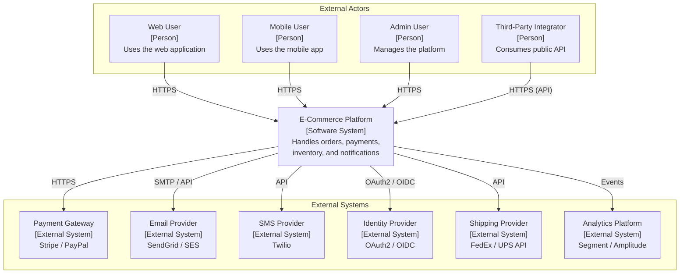
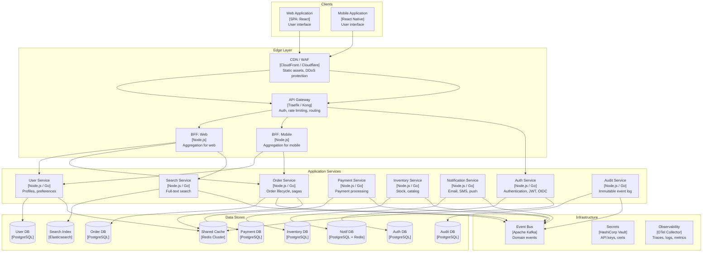
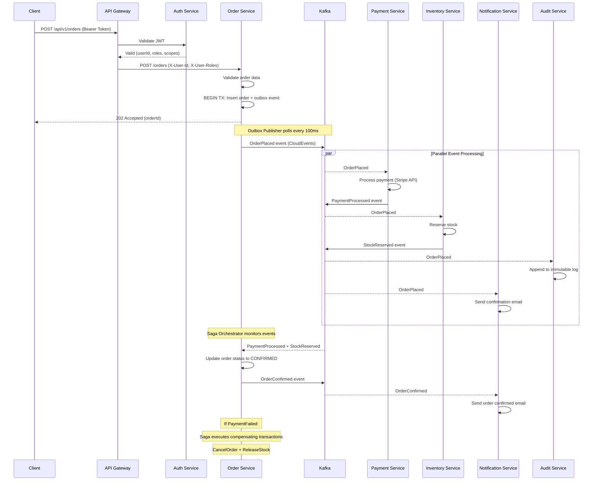
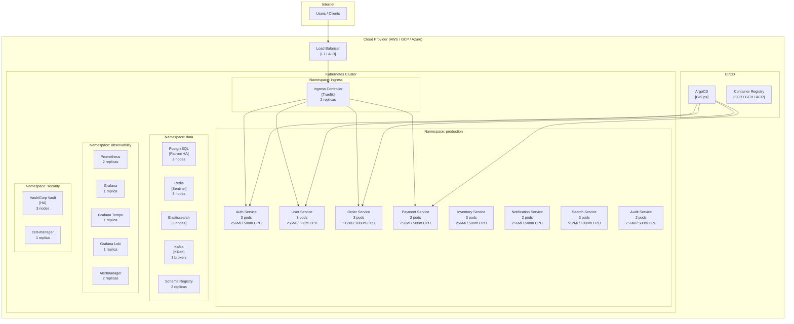

<!-- Agent: architect | Task: #microservices-architecture | Session: 2026-02-08 -->

# Monolith-to-Microservices: Target-State System Architecture

**Version:** 2.0.0
**Date:** 2026-02-08
**Status:** Reference Architecture
**Author:** Architect Agent (Claude Opus 4.6)
**Companion Report:** `.claude/context/reports/architecture/microservices-migration-architecture-2026-02-08.md`

---

## Table of Contents

1. [Architecture Patterns](#1-architecture-patterns)
2. [Service Decomposition Model](#2-service-decomposition-model)
3. [Communication Patterns](#3-communication-patterns)
4. [Data Architecture](#4-data-architecture)
5. [Infrastructure Architecture](#5-infrastructure-architecture)
6. [Architecture Decision Records (ADRs)](#6-architecture-decision-records)
7. [Architecture Diagrams (C4 Model)](#7-architecture-diagrams)
8. [Architecture Quality Checklist](#8-architecture-quality-checklist)

---

## 1. Architecture Patterns

### 1.1 Migration Strategy: Strangler Fig Pattern (Recommended)

The Strangler Fig is the only defensible migration strategy for production monoliths above 50K LOC. It wraps the monolith behind a routing layer (API gateway or reverse proxy) and incrementally routes traffic to new microservices as they are built. The monolith is progressively "strangled" until it can be decommissioned.

**Why not Big Bang?** A Big Bang rewrite requires a complete feature freeze while the new system catches up to the old one. For any system with active development, this is a death march -- the new system is always behind the old one. Big Bang is defensible only for sub-50K LOC applications with comprehensive test suites and experienced teams.

**Why not Parallel Run?** Parallel Run maintains both systems simultaneously and compares their outputs. This is appropriate for financial systems where regulatory compliance demands correctness verification. For most applications, the operational cost of running two full systems exceeds the benefit.

**Strangler Fig Implementation Phases:**

```
Phase 0 (Weeks 1-4):   Set up API Gateway routing ALL traffic to monolith
Phase 1 (Months 2-4):  Extract first leaf service (Notifications or Audit)
Phase 2 (Months 5-7):  Extract read-heavy services (Search, Catalog)
Phase 3 (Months 8-12): Extract core domain services (Users, Orders)
Phase 4 (Months 13-18): Extract remaining services, decommission monolith
```

Each extraction follows the same pattern:

1. Build the new service with its own database
2. Route a percentage of traffic to the new service (canary)
3. Monitor for errors and performance regression
4. Progressively increase traffic to 100%
5. Remove the corresponding code from the monolith
6. Remove the routing rule (new service is now the sole handler)

### 1.2 Event-Driven Architecture

Event-driven architecture decouples services temporally and spatially. A producing service publishes an event ("OrderPlaced") without knowing or caring which services consume it. This is the primary inter-service communication pattern for anything that does not require an immediate response.

**Event Sourcing:** Store every state change as an immutable event rather than the current state. Use ONLY when the business requires complete audit trails, temporal queries, or regulatory compliance. Event Sourcing without a business driver adds complexity (event versioning, snapshots, projection rebuilds) that most systems do not need.

**CQRS (Command Query Responsibility Segregation):** Separate write models (optimized for consistency) from read models (optimized for query performance). CQRS without Event Sourcing is valuable on its own -- use it whenever read and write loads differ dramatically (100:1 ratio) or the read model needs to be materialized differently from the write model.

**Transactional Outbox:** The recommended pattern for ensuring database writes and event publishing are atomic. Write both the business data and the event record in a single database transaction, then a separate process publishes events from the outbox table.

- **Start with:** Polling publisher (queries outbox every 100-500ms)
- **Upgrade to:** Debezium CDC when latency requirements drop below 1 second

### 1.3 API Gateway Pattern

The API Gateway is the single entry point for all client traffic. It handles cross-cutting concerns (authentication, rate limiting, routing, protocol translation) so that individual services do not have to.

**Backend-for-Frontend (BFF):** When web and mobile clients have significantly different data needs, add a thin aggregation layer per client type. Each BFF is owned by the client team and assembles responses from multiple backend services. This prevents "one-size-fits-all" API bloat.

**Technology Recommendation:**

| Scenario | Gateway | Rationale |
|---|---|---|
| Kubernetes-native | Traefik | Auto-discovers services via labels, minimal configuration |
| Plugin ecosystem needed | Kong | Rich plugin marketplace (OAuth, rate limiting, transformation) |
| AWS-native | AWS API Gateway | Integrates with Lambda, IAM, CloudWatch |
| Service mesh integration | Envoy (as mesh ingress) | Unified data plane for mesh and edge |

### 1.4 Service Mesh

A service mesh provides infrastructure-level networking capabilities (mTLS, load balancing, retries, observability) via sidecar proxies. It removes these concerns from application code.

**Adopt a service mesh at 10+ services.** Below 10, application-level libraries (circuit breaker, retry) are simpler and lower overhead.

| Mesh | When to Use | Operational Cost |
|---|---|---|
| Linkerd | First mesh; lightweight; simple | Low |
| Istio | Advanced traffic management; fault injection; traffic mirroring | High |
| Cilium | eBPF-based; high performance; Linux kernel 5.10+ | Medium |

**Recommendation:** Start without a mesh. Adopt Linkerd at 10+ services. Consider Istio only if you need advanced traffic management features.

### 1.5 Resilience Patterns

**Circuit Breaker:** Prevents cascading failures. When a downstream service fails repeatedly (e.g., 50% of last 20 calls), the circuit opens and all subsequent calls return a fallback immediately, giving the downstream service time to recover.

```
States: CLOSED (normal) --> OPEN (fail fast) --> HALF-OPEN (probe) --> CLOSED or OPEN
```

**Retry with Exponential Backoff:** Retry transient failures with increasing delays (100ms, 200ms, 400ms, 800ms) and jitter to prevent thundering herd. Maximum 3 retries.

**Bulkhead:** Isolate failure domains. Each downstream dependency gets its own connection pool and thread pool. If the Payment Service is slow, it does not exhaust the Order Service's capacity to call the Inventory Service.

**Timeout Budget:** For a request traversing multiple services, allocate a total timeout budget and split it among downstream calls. Pass remaining budget via `X-Request-Deadline` header. Never start a new downstream call if the remaining budget is insufficient.

---

## 2. Service Decomposition Model

### 2.1 Identifying Services via Domain-Driven Design

Service boundaries MUST align with bounded contexts, not technical layers. A bounded context is a part of the domain where a particular model and its ubiquitous language are consistent.

**Discovery Process:**

1. **Event Storming (2-3 days):** Map domain events, commands, aggregates, and bounded contexts on a physical wall with sticky notes. Involve domain experts, developers, and product owners.
2. **Context Mapping:** Classify relationships between contexts (Shared Kernel, Customer/Supplier, Conformist, Anti-Corruption Layer, Published Language).
3. **Data Ownership Analysis:** For every database table, identify the single authoritative writer and all readers. Tables with 3+ writers from different contexts are decomposition blockers that must be resolved before extraction.

### 2.2 Service Decomposition Principles

| Principle | Description | Violation Signal |
|---|---|---|
| **Bounded Context Alignment** | Each service maps to exactly one bounded context | A user story requires changes to 3+ services |
| **Single Data Ownership** | Each service exclusively owns its data | Two services write to the same database table |
| **Independent Deployability** | No coordinated releases across services | Deploying Service A requires redeploying Service B |
| **Two-Pizza Team** | Owned by 5-8 people, full-stack | Service requires 15+ contributors |
| **Design for Failure** | Every inter-service call has circuit breaker + timeout + fallback | A downstream outage cascades to all upstream services |
| **Rewritable in 2-4 weeks** | Service is small enough to rewrite | Service has 30+ endpoints or 20+ database tables |

### 2.3 Recommended Initial Service Candidates

**Extraction order is critical.** Start with leaf services (fewest inbound dependencies) and work inward to core domain services.

| Priority | Service | Bounded Context | Rationale for Ordering |
|---|---|---|---|
| 1 | **Notification Service** | Notifications | Pure consumer (no inbound deps); fire-and-forget; low risk |
| 2 | **Audit Service** | Audit & Compliance | Write-only (event consumer); no inbound queries during extraction |
| 3 | **Search Service** | Discovery | Read-only; CQRS read model; independent index (Elasticsearch) |
| 4 | **Auth Service** | Identity & Access | Clear boundary; critical but well-understood; enables mTLS rollout |
| 5 | **User Service** | User Management | Stable domain; many services depend on it (extract early to stabilize API) |
| 6 | **Order Service** | Order Management | Core domain; complex sagas; team is experienced by this point |
| 7 | **Payment Service** | Payments & Billing | High compliance; security-sensitive; strong data isolation required |
| 8 | **Inventory Service** | Inventory & Catalog | Most cross-cutting; extract last when all dependent services have stable APIs |

**Anti-pattern: Extracting the core domain first.** Teams that start with Orders or Payments before simpler services face maximum complexity with zero migration experience.

### 2.4 Service Sizing Guidelines

**Too Coarse (Distributed Monolith):**
- 10+ database tables
- 20+ API endpoints
- 5+ teams contributing
- Requires coordinated deployments

**Too Fine (Nano-Service):**
- 1-2 API endpoints
- Less than 500 LOC
- Called synchronously by only one service
- More services than developers

**Right-Sized:**
- 3-15 API endpoints
- 3-8 database tables
- Owned by 1 team (5-8 people)
- Independently deployable
- Rewritable in 2-4 weeks

---

## 3. Communication Patterns

### 3.1 Synchronous Communication (REST and gRPC)

**REST (HTTP/JSON):** Use for external-facing APIs (clients, third parties) and low-frequency internal calls.

- OpenAPI 3.1 spec for every service (generated from code or code from spec)
- Resource-oriented URLs: `/users/{userId}/orders` (nouns, plural)
- HTTP methods as verbs: GET (read), POST (create), PUT (replace), PATCH (partial update), DELETE (remove)
- Consistent error responses: `{ "error": { "code": "...", "message": "...", "details": [...] } }`
- Pagination: cursor-based for large datasets, offset-based for simple cases

**gRPC (Protocol Buffers):** Use for high-throughput, latency-sensitive internal service-to-service communication.

- Binary serialization (10-100x smaller than JSON)
- Bidirectional streaming for real-time data
- Generated client/server stubs from `.proto` files
- Use when: latency-critical paths, streaming required, high throughput (>1000 RPS per service pair)

**Decision Rule:**

```
External clients (browsers, mobile, third-party) --> REST (HTTP/JSON)
Internal, latency-critical or high-throughput     --> gRPC
Internal, simple, low-frequency                   --> REST (simpler tooling)
Streaming required                                --> gRPC (bidirectional streaming)
```

### 3.2 Asynchronous Communication (Events and Messages)

**Event-driven (Kafka):** Use for decoupled notifications and data replication.

- Producer publishes events without knowing consumers
- CloudEvents specification (CNCF standard) for event schema
- Events are facts ("OrderPlaced"), not commands ("ProcessPayment")
- Durable, replayable, ordered streams
- Use for: notifications, data replication (CDC), audit trails, analytics

**Task queues (RabbitMQ):** Use for work distribution and request/reply patterns.

- Producer sends a task to a queue
- One consumer picks up and processes the task
- Use for: email sending, image processing, report generation

**Default recommendation: Kafka for event streaming, RabbitMQ (or SQS) for task queues.**

### 3.3 Service Discovery

**In Kubernetes:** Built-in via DNS. Internal service URLs follow the pattern:

```
http://<service-name>.<namespace>.svc.cluster.local:<port>
```

**Outside Kubernetes:** Use Consul or etcd for service registration and discovery.

**DNS-based discovery is preferred** over registry-based for simplicity. Kubernetes DNS is sufficient for 95% of use cases.

### 3.4 API Versioning Strategy

**Recommendation: URI versioning (`/v1/users`, `/v2/users`).**

- Simplest for clients and caching
- Breaking changes increment the major version
- Support at most 2 versions simultaneously (current + previous)
- Deprecation timeline: 6 months notice, 3 months overlap

**Versioning Discipline:**

| Change Type | Version Impact | Example |
|---|---|---|
| Adding a field to response | None (backward compatible) | Add `middleName` to User |
| Adding an optional request field | None (backward compatible) | Add optional `note` to Order |
| Removing a field | BREAKING (new version) | Remove `legacyId` from User |
| Renaming a field | BREAKING (new version) | Rename `name` to `fullName` |
| Changing field type | BREAKING (new version) | Change `price` from string to number |
| Adding a new endpoint | None (backward compatible) | Add `GET /users/{id}/preferences` |
| Removing an endpoint | BREAKING (new version) | Remove `GET /users/{id}/legacy` |

---

## 4. Data Architecture

### 4.1 Database-per-Service Pattern

Each service MUST own its database exclusively. No other service may read from or write to another service's database. This is the single most important rule in microservices data architecture.

**Data sharing mechanisms (in order of preference):**

1. **Events (async, preferred):** Service publishes events when data changes; consumers maintain their own read models
2. **API calls (sync, when needed):** Service exposes read endpoints for data other services need
3. **CDC / data replication:** Debezium captures database changes and publishes to Kafka for consumers who need near-real-time replicas

**Technology selection per service:**

| Service | Database | Rationale |
|---|---|---|
| Auth Service | PostgreSQL | Transactional, relational (users, roles, permissions) |
| User Service | PostgreSQL | Transactional, relational (profiles, preferences) |
| Order Service | PostgreSQL | ACID transactions for order lifecycle |
| Payment Service | PostgreSQL | Strong consistency required for financial data |
| Inventory Service | PostgreSQL | Transactional (stock levels, reservations) |
| Notification Service | Redis + PostgreSQL | Redis for queue/rate limiting; PostgreSQL for templates/history |
| Search Service | Elasticsearch | Full-text search, faceted queries, relevance scoring |
| Audit Service | PostgreSQL (append-only) | Immutable event log; optional Event Sourcing |

**Default: PostgreSQL for everything.** It supports JSON, full-text search, and time-series extensions, covering 90% of use cases. Polyglot persistence is a feature, not a goal -- add specialized databases only when PostgreSQL demonstrably cannot meet requirements.

### 4.2 Saga Pattern for Distributed Transactions

In a monolith, you use database transactions for consistency. In microservices, you cannot have a transaction spanning multiple databases. The Saga pattern coordinates a multi-step business process across services using either orchestration or choreography.

**Orchestration Sagas (recommended for complex workflows, 5+ steps):**

An orchestrator service sends commands to each participant and handles compensating transactions on failure. The orchestrator maintains the saga state and knows the full workflow.

**Choreography Sagas (for simple workflows, 2-4 steps):**

Each service listens for events and reacts independently. No central coordinator. Simpler but harder to trace and debug.

**Compensating Transactions:**

| Forward Action | Compensating Action |
|---|---|
| CreateOrder | CancelOrder |
| ProcessPayment | RefundPayment |
| ReserveStock | ReleaseStock |
| SendConfirmation | SendCancellation |

**Critical: Never split a transaction boundary across services until you have a saga implementation ready.**

### 4.3 Event Sourcing for Audit Trails

Use Event Sourcing ONLY when the business requires:

- Complete audit trail (regulatory compliance, financial systems)
- Temporal queries ("What was the order state on January 15th?")
- Event replay (rebuilding read models, debugging production issues)

Event Sourcing stores every state change as an immutable event:

```
Event Store:
  1. OrderCreated { orderId: "ORD-123", userId: "USR-456", items: [...] }
  2. PaymentProcessed { orderId: "ORD-123", amount: 99.99 }
  3. OrderShipped { orderId: "ORD-123", trackingNumber: "TRK-789" }

Current State (materialized view):
  { orderId: "ORD-123", status: "shipped", amount: 99.99, trackingNumber: "TRK-789" }
```

**Complexity cost:** Event versioning (schema evolution), snapshots (performance), projection rebuilds (operational). Do not adopt without a specific business driver.

### 4.4 CQRS for Read/Write Separation

**When to apply CQRS:**

- Read:write ratio exceeds 10:1
- Read model needs different shape than write model (denormalized views, search indexes)
- Different scaling requirements for reads vs writes

**Implementation:**

```
Write Path: Client --> API --> Command Handler --> Write DB (normalized, ACID)
                                    |
                                    v
                              Domain Events --> Event Bus (Kafka)
                                                    |
                                                    v
Read Path:  Client --> API --> Query Handler --> Read DB (denormalized, fast)
                                                    ^
                                                    |
                                              Event Consumer (materializes read model)
```

**Services where CQRS applies:**

| Service | CQRS? | Rationale |
|---|---|---|
| Search Service | YES | Read-only materialized view from multiple sources |
| Order Service | MAYBE | If order history queries are heavy; write model is complex |
| User Service | NO | Simple CRUD; read/write models are nearly identical |
| Notification Service | NO | Primarily write (send); few read queries |

### 4.5 Data Migration Strategy

Database decomposition proceeds in four stages. Never skip stages.

**Stage 1 -- Shared Database (starting state):** All services use the same database. This is where you begin.

**Stage 2 -- Logical Separation (per service, 1-4 weeks):** Create a schema per service in the same database. Move tables. Replace cross-schema access with API calls. Add views as temporary compatibility layer.

**Stage 3 -- Read Replicas (per service, 2-4 weeks):** Set up CDC (Debezium) to stream changes to read-optimized stores. Replace API calls for read-heavy patterns with local read model queries. Accept eventual consistency for read paths.

**Stage 4 -- Physical Separation (per service, 2-6 weeks):** Provision separate database instance. Migrate data using dual-write pattern (write to both, read from new, validate, cut over, remove dual-write). Tear down old schema.

**Data Migration Risks and Mitigations:**

| Risk | Mitigation |
|---|---|
| Data loss | Dual-write + reconciliation; never delete source until 2+ weeks stable |
| Data inconsistency | CDC (Debezium) for replication; daily reconciliation jobs |
| Foreign key violations | Migrate in dependency order; use soft references (IDs) across services |
| Performance degradation | Migrate during low-traffic windows; batch processing with rate limiting |
| Migration failure | Resumable migrations with checkpoints; process in batches of 1000 rows |

---

## 5. Infrastructure Architecture

### 5.1 Container Orchestration (Kubernetes)

Kubernetes is the default choice. It provides service discovery (DNS), rolling deployments, horizontal autoscaling, self-healing (liveness/readiness probes), and a vast ecosystem.

**Minimum Viable K8s Architecture:**

- **Production namespace:** Application services (3+ replicas each)
- **Infrastructure namespace:** Kafka (3 brokers), Redis (Sentinel), PostgreSQL (Patroni HA)
- **Observability namespace:** Prometheus, Grafana, Jaeger/Tempo, Loki
- **Ingress controller:** Traefik or NGINX

**Key resources per service:**

- Deployment (RollingUpdate, maxUnavailable: 0 for zero-downtime)
- Service (ClusterIP for internal, LoadBalancer for edge)
- HPA (Horizontal Pod Autoscaler, target 70% CPU)
- PDB (Pod Disruption Budget, minAvailable: 2)
- ConfigMap (non-secret configuration)
- Secret (references Vault-managed secrets)

### 5.2 Service Mesh (Linkerd at 10+ Services)

**Capabilities provided by the mesh:**

- **mTLS:** Encrypted, authenticated communication between all services (zero-trust networking)
- **Load balancing:** Latency-aware, per-request (not per-connection)
- **Retries and timeouts:** Configurable per route, without application code changes
- **Observability:** Automatic golden metrics (success rate, latency, throughput) for every service
- **Traffic splitting:** Canary releases, A/B testing, blue-green deployments

**Start without a mesh for the first 5-10 services.** Use application-level libraries (opossum for circuit breakers, retry middleware). Adopt Linkerd when you hit 10+ services.

### 5.3 API Gateway (Traefik or Kong)

**Traefik** for Kubernetes-native deployments:
- Auto-discovers services via Kubernetes annotations
- Automatic TLS certificate management (Let's Encrypt)
- Middleware chains (rate limiting, auth, compression, retry)
- Dashboard for real-time traffic visualization

**Kong** when plugin ecosystem matters:
- 100+ plugins (OAuth, rate limiting, request transformation, logging)
- Admin API for dynamic configuration
- Database-backed (PostgreSQL) or DB-less (declarative YAML)

**API Gateway responsibilities:**
1. TLS termination
2. Authentication (JWT validation)
3. Rate limiting (per-client, per-route)
4. Request routing (path-based to backend services)
5. Protocol translation (REST to gRPC if needed)
6. CORS handling
7. Request/response logging

### 5.4 Message Broker (Apache Kafka)

Kafka is the recommended message broker for event-driven microservices.

**Kafka cluster sizing:**
- **Development:** 1 broker, 1 partition per topic
- **Staging:** 3 brokers, 3 partitions per topic, replication factor 2
- **Production:** 3+ brokers, 6-12 partitions per topic, replication factor 3

**Topic naming convention:** `<domain>.<entity>.<event>` (e.g., `orders.order.placed`, `payments.payment.processed`)

**Consumer group naming:** `<consuming-service>.<topic>` (e.g., `notification-service.orders.order.placed`)

**Schema Registry:** Use Confluent Schema Registry (or Apicurio) with Avro or Protobuf schemas. Enforce backward compatibility to prevent breaking consumers.

**When to use RabbitMQ instead:**
- Task queues (work distribution, not event streaming)
- Request/reply patterns
- Complex routing (topic exchanges, header-based routing)
- Simpler operational model (no ZooKeeper/KRaft)

### 5.5 Observability Stack

**The Four Pillars:**

| Pillar | Tool | Purpose |
|---|---|---|
| **Traces** | Jaeger or Grafana Tempo | Trace requests across service boundaries |
| **Logs** | Loki (Grafana stack) | Centralized log aggregation, correlated by trace ID |
| **Metrics** | Prometheus + Grafana | RED metrics (Rate, Errors, Duration) per service |
| **Alerts** | Alertmanager + PagerDuty | SLO-based alerting (error budget burn rate) |

**Collection:** OpenTelemetry SDK in every service, sending to a central OTel Collector.

**Mandatory instrumentation per service:**

1. Trace context propagation (W3C `traceparent` header on every call)
2. Structured logging (JSON: `traceId`, `spanId`, `service`, `level`, `message`)
3. RED metrics exposed at `/metrics` (Prometheus format)
4. Health endpoints: `/health/live`, `/health/ready`, `/health/startup`

**SLO-based alerting (not threshold-based):**

Define SLOs:
- "99.9% of requests complete within 500ms" (latency)
- "99.95% of requests return non-5xx responses" (availability)

Alert when error budget burn rate threatens the SLO. This reduces alert noise by 80%+ compared to threshold-based alerting.

### 5.6 CI/CD Pipeline per Service

Each service gets its own independent pipeline. This is non-negotiable for independent deployability.

**Pipeline stages:**

| Stage | Tools | Duration |
|---|---|---|
| Build + Unit Test | Language-specific (go build, npm test, mvn test) | 1-3 min |
| Integration Test | Testcontainers + docker-compose | 2-5 min |
| Security Scan | Trivy (containers), Snyk (deps), Semgrep (SAST) | 1-3 min |
| Container Build | Docker multi-stage builds | 1-2 min |
| Deploy Staging | Helm/Kustomize + ArgoCD | 1-2 min |
| E2E Smoke | Critical path tests | 2-5 min |
| Production Deploy | ArgoCD progressive delivery (canary 5% --> 25% --> 50% --> 100%) | 10-30 min |

**Targets:** Under 15 minutes to staging. Under 45 minutes to full production rollout.

**Trunk-based development:** Short-lived feature branches (max 1-2 days). Feature flags for incomplete features. Every merge to main triggers the full pipeline.

---

## 6. Architecture Decision Records

### ADR-MS-001: Strangler Fig as Default Migration Strategy

**Date:** 2026-02-08
**Status:** Accepted

**Context:** The organization needs to migrate a production monolith to microservices while continuing to deliver features.

**Decision:** Use the Strangler Fig pattern for incremental service extraction. Route traffic through an API Gateway that directs requests to either the monolith or extracted services based on URL path.

**Rationale:**
- Incremental value delivery (each service is independently deployable)
- Per-service rollback (route traffic back to monolith)
- No feature freeze required
- Risk contained to individual service extractions

**Consequences:**
- Migration takes 12-24 months (longer than Big Bang)
- API Gateway becomes a critical path component
- Temporary complexity of running monolith + services simultaneously
- Team must maintain backward compatibility during transition

### ADR-MS-002: Event-Driven Architecture with Kafka

**Date:** 2026-02-08
**Status:** Accepted

**Context:** Services need to communicate about domain events (OrderPlaced, PaymentProcessed) without tight temporal coupling.

**Decision:** Use Apache Kafka as the primary event streaming platform. Use CloudEvents specification for event schema. Use Transactional Outbox pattern for atomic database write + event publish.

**Rationale:**
- Kafka provides durable, replayable, ordered event streams
- CloudEvents is a CNCF standard with broad ecosystem support
- Transactional Outbox prevents split-brain (DB written but event lost, or vice versa)
- Kafka Streams / ksqlDB enable stream processing without additional infrastructure

**Consequences:**
- Operational complexity of running Kafka (3+ brokers, ZooKeeper or KRaft)
- Team must learn event-driven patterns and eventual consistency
- Schema Registry required for event schema evolution
- Dead letter queues needed for poison messages

### ADR-MS-003: Database-per-Service with PostgreSQL Default

**Date:** 2026-02-08
**Status:** Accepted

**Context:** Services need independent data stores to achieve loose coupling and independent deployability.

**Decision:** Each service owns its own PostgreSQL database. Polyglot persistence (Elasticsearch for Search, Redis for caching) is permitted only when PostgreSQL demonstrably cannot meet requirements.

**Rationale:**
- PostgreSQL covers 90% of use cases (relational, JSON, full-text search, time-series)
- Single database technology reduces operational burden
- Database-per-service enforces data ownership
- Polyglot persistence adds operational complexity per additional technology

**Consequences:**
- No cross-service database JOINs (use API calls or events)
- Distributed transactions replaced by Saga pattern
- Data duplication across services (read models)
- Additional operational cost per database instance

### ADR-MS-004: Orchestration Sagas for Complex Workflows

**Date:** 2026-02-08
**Status:** Accepted

**Context:** Multi-step business processes (e.g., PlaceOrder) that previously used database transactions now span multiple services with independent databases.

**Decision:** Use Orchestration Sagas for workflows with 5+ steps (e.g., order placement). Use Choreography Sagas for simple workflows with 2-4 steps (e.g., notification chains).

**Rationale:**
- Orchestration provides centralized visibility and control for complex workflows
- Orchestrator can be implemented as a state machine (testable, debuggable)
- Choreography is simpler for small workflows but becomes unmanageable at scale
- Compensating transactions handle partial failures gracefully

**Consequences:**
- Orchestrator service is a single point of failure (mitigate with HA deployment)
- Must define compensating transactions for every forward action
- Eventually consistent (not ACID) -- business must accept this
- Saga state must be persisted for crash recovery

### ADR-MS-005: Kubernetes with Linkerd Service Mesh at Scale

**Date:** 2026-02-08
**Status:** Accepted

**Context:** The organization needs container orchestration, service discovery, mTLS, and observability for 8+ microservices.

**Decision:** Use Kubernetes for container orchestration. Adopt Linkerd as the service mesh when the service count reaches 10+. Use application-level resilience libraries (circuit breakers, retries) for the first 5-10 services.

**Rationale:**
- Kubernetes is the industry standard with the widest ecosystem
- Linkerd is the lightest service mesh (smallest resource footprint)
- Application-level libraries are simpler for small service counts
- Linkerd provides automatic mTLS, golden metrics, and traffic splitting

**Consequences:**
- Kubernetes operational complexity (cluster management, upgrades)
- Linkerd adds ~10-20MB memory per pod (sidecar proxy)
- Team must learn Kubernetes concepts (Deployments, Services, HPA, PDB)
- Service mesh adds a layer of abstraction that can complicate debugging

### ADR-MS-006: CQRS without Event Sourcing as Default

**Date:** 2026-02-08
**Status:** Accepted

**Context:** Some services have significantly different read and write patterns (Search Service, Analytics). Event Sourcing has been proposed as a data pattern.

**Decision:** Apply CQRS (separate read/write models) where read:write ratio exceeds 10:1. Do NOT adopt Event Sourcing unless a specific business requirement demands it (audit trail, temporal queries, regulatory compliance).

**Rationale:**
- CQRS without Event Sourcing provides 80% of the benefit with 20% of the complexity
- Event Sourcing adds event versioning, snapshots, and projection rebuild complexity
- Most services do not need temporal queries or event replay
- CQRS enables independent scaling of read and write paths

**Consequences:**
- Eventual consistency between write and read models (acceptable for most use cases)
- Read model materialization via event consumers
- Must monitor and alert on read model lag
- Audit Service is the exception -- it uses Event Sourcing for regulatory compliance

---

## 7. Architecture Diagrams

### 7.1 C4 Level 1: System Context Diagram

This diagram shows the system in its environment, identifying all external actors and systems.



### 7.2 C4 Level 2: Container Diagram

This diagram shows the major containers (deployable units) within the system and their interactions.



### 7.3 Data Flow Diagram: Order Placement

This diagram traces the complete data flow for placing an order, from client request through saga completion.



### 7.4 Deployment Diagram

This diagram shows the physical deployment topology on Kubernetes.



---

## 8. Architecture Quality Checklist

### IEEE 1028 Architecture Base (Universal)

- [ ] SOLID principles followed across service boundaries
- [ ] Proper separation of concerns (bounded contexts)
- [ ] Loose coupling between services (no shared databases)
- [ ] High cohesion within each service
- [ ] Scalability considerations documented (HPA, partitioning)
- [ ] Extensibility patterns in place (event-driven, plugin-capable gateway)
- [ ] Performance bottlenecks identified and mitigated
- [ ] Failure modes considered (circuit breakers, timeouts, bulkheads)
- [ ] Single responsibility per service (one bounded context)
- [ ] Dependency inversion (services depend on abstractions/events, not implementations)

### [AI-GENERATED] Microservices-Specific Items

- [ ] [AI-GENERATED] Service discovery mechanism validated (K8s DNS or Consul)
- [ ] [AI-GENERATED] Circuit breakers configured for every synchronous inter-service call
- [ ] [AI-GENERATED] Transactional Outbox implemented for event publishing
- [ ] [AI-GENERATED] Saga compensating transactions defined for every forward action
- [ ] [AI-GENERATED] API versioning strategy documented and enforced
- [ ] [AI-GENERATED] Data ownership matrix complete (single writer per table)
- [ ] [AI-GENERATED] Observability stack operational before first service extraction
- [ ] [AI-GENERATED] Service mesh evaluation criteria documented (10+ service threshold)
- [ ] [AI-GENERATED] Team topology aligned with service boundaries (Conway's Law)
- [ ] [AI-GENERATED] Performance baseline captured (p50, p95, p99) for monolith endpoints
- [ ] [AI-GENERATED] Rollback procedure tested for every extracted service
- [ ] [AI-GENERATED] Schema Registry enforcing backward compatibility on events

---

## Summary of Key Recommendations

1. **Use the Strangler Fig pattern.** Incremental extraction with per-service rollback.
2. **Start with leaf services.** Notifications and Audit first; Orders and Payments last.
3. **One database per service.** Default to PostgreSQL. No shared mutable state.
4. **Prefer async over sync.** Kafka events for most communication. REST/gRPC only when the client needs an immediate response.
5. **Transactional Outbox for consistency.** Never publish events and write to DB separately.
6. **Observability before extraction.** Distributed tracing, centralized logging, and metrics must be operational before the first service is extracted.
7. **Restructure teams before code.** Conway's Law is not optional.
8. **CQRS without Event Sourcing.** Use CQRS for read/write separation. Only add Event Sourcing when the business demands audit trails or temporal queries.
9. **Service mesh at 10+ services.** Start with application-level libraries. Adopt Linkerd when service count justifies it.
10. **Measure everything.** Performance baselines, data reconciliation, SLO-based alerting.

---

*This document is a living architecture reference. Update it as migration progresses and patterns are validated against production reality.*
