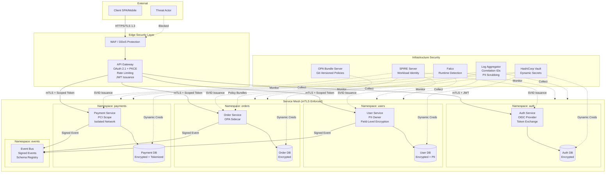
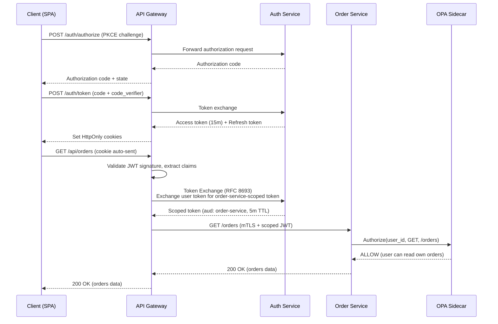
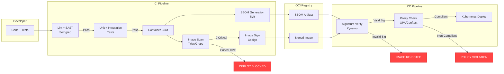

<!-- Agent: security-architect | Task: #task-2 | Session: 2026-03-21 -->

# Microservices Security Architecture: Companion Document

**Version:** 1.0.0
**Date:** 2026-03-21
**Status:** Security Architecture Review
**Author:** Security Architect Agent (Claude Opus 4.6)
**Companion To:** `microservices-architecture-2026-02-08.md`

---

## Table of Contents

1. [Expanded Attack Surface Assessment](#1-expanded-attack-surface-assessment)
2. [Zero Trust Architecture for Microservices](#2-zero-trust-architecture-for-microservices)
3. [Data Security in Distributed Systems](#3-data-security-in-distributed-systems)
4. [Authentication and Authorization Patterns](#4-authentication-and-authorization-patterns)
5. [Supply Chain and Container Security](#5-supply-chain-and-container-security)
6. [STRIDE Threat Model](#6-stride-threat-model)
7. [Security Migration Checklist](#7-security-migration-checklist)
8. [Security Architecture Diagrams](#8-security-architecture-diagrams)
9. [Prioritized Security Controls Checklist](#9-prioritized-security-controls-checklist)

---

## 1. Expanded Attack Surface Assessment

### 1.1 Monolith vs. Microservices Attack Surface Comparison

A monolith exposes a single attack surface: one process, one network boundary, one set of credentials. Decomposing into microservices multiplies every dimension of that surface.

| Dimension              | Monolith              | Microservices (N services)         | Risk Multiplier |
| ---------------------- | --------------------- | ---------------------------------- | --------------- |
| Network endpoints      | 1 ingress             | N + internal mesh                  | N+              |
| Credential sets        | 1 DB, 1 cache         | N DBs, N caches, N secrets         | N               |
| TLS certificates       | 1 edge                | N + mesh sidecar certs             | N+1             |
| Container images       | 1                     | N (each with own supply chain)     | N               |
| Inter-process calls    | In-memory (0 network) | N\*(N-1)/2 potential network paths | Quadratic       |
| Logging surfaces       | 1 log stream          | N log streams + aggregator         | N+1             |
| Configuration surfaces | 1 config set          | N config maps + shared config svc  | N+1             |

**Key insight:** The migration does not merely add services; it introduces an entirely new category of threat -- **east-west traffic** between services that previously communicated via in-process function calls with zero serialization, zero network exposure, and zero authentication overhead.

### 1.2 Service-to-Service Authentication

Three patterns for authenticating east-west traffic, ordered by security strength:

**Pattern A: Mutual TLS (mTLS) -- RECOMMENDED**

Each service holds a unique X.509 certificate. Both sides of every connection verify identity. Provides authentication, encryption, and integrity in a single mechanism.

- **Pros:** Network-layer enforcement (no application code changes), tamper-proof identity, works with any protocol
- **Cons:** Certificate lifecycle management overhead, requires a PKI (SPIFFE/SPIRE or Istio CA)
- **When:** Default choice for all east-west traffic

**Pattern B: JWT Token Propagation**

The API gateway validates the user's JWT and forwards it (or a derived service token) to downstream services. Each service validates the JWT independently.

- **Pros:** Carries user identity and claims through the call chain, stateless verification
- **Cons:** Token lifetime must be short (max 15 minutes), does not authenticate the calling service (only the user), vulnerable to token replay between services
- **When:** When downstream services need user context (authorization decisions)

**Pattern C: SPIFFE/SPIRE (Secure Production Identity Framework for Everyone)**

Provides workload identity via SVIDs (SPIFFE Verifiable Identity Documents). Each workload gets a cryptographic identity based on its runtime environment, not static credentials.

- **Pros:** Short-lived automatic certificates (no manual rotation), workload identity independent of network topology, integrates with Istio/Envoy
- **Cons:** Requires SPIRE server infrastructure, adds operational complexity
- **When:** Kubernetes-native deployments, zero-trust mandates, regulated industries

**Recommendation:** Use mTLS via service mesh (Istio/Linkerd) as the baseline for all service-to-service communication. Layer JWT propagation on top for user-context-aware authorization decisions.

### 1.3 API Gateway as Security Boundary

The API gateway is the single point of ingress from external clients to the microservices mesh. It must enforce:

| Control                        | Implementation                                     | Priority |
| ------------------------------ | -------------------------------------------------- | -------- |
| Authentication termination     | OAuth 2.1 + PKCE at gateway, JWT issued downstream | P0       |
| Rate limiting                  | Per-client, per-endpoint, sliding window           | P0       |
| WAF (Web Application Firewall) | OWASP CRS ruleset, custom rules for API abuse      | P0       |
| Request validation             | OpenAPI schema validation before routing           | P1       |
| TLS termination                | TLS 1.3, HSTS, certificate pinning for mobile      | P0       |
| IP allowlisting                | For admin/internal endpoints only                  | P1       |
| Request size limits            | Per-endpoint max body size                         | P1       |
| Circuit breaking               | Prevent cascade failures from unhealthy backends   | P1       |

**Anti-pattern:** Allowing direct service-to-service calls that bypass the gateway from external clients. Every external request must transit the gateway.

---

## 2. Zero Trust Architecture for Microservices

### 2.1 Core Principles

Zero Trust for microservices means: **no service trusts any other service by default, regardless of network location.**

1. **Verify explicitly:** Every request between services must carry verifiable identity (mTLS certificate or signed token).
2. **Least privilege access:** Each service account has permissions only for the specific APIs it needs to call.
3. **Assume breach:** Design every service as if the internal network is already compromised.

### 2.2 Network Segmentation and Service Mesh Security

```
Network Policy Architecture:

  [Internet] --> [WAF/DDoS] --> [API Gateway] --> [Service Mesh (Istio/Linkerd)]
                                                        |
                                    +---------+---------+---------+
                                    |         |         |         |
                                [Namespace: auth] [Namespace: orders] [Namespace: catalog]
                                    |         |         |         |
                                [NetworkPolicy: deny-all default]
                                [NetworkPolicy: allow specific ingress/egress per service]
```

**Kubernetes NetworkPolicy rules (mandatory):**

- Default deny all ingress and egress per namespace
- Explicit allow rules for each authorized service-to-service path
- No direct pod-to-pod communication outside defined policies
- Separate namespaces for each bounded context (auth, orders, catalog, payments)

### 2.3 Identity-Based Access

Replace network-based trust ("this IP is in the VPC, therefore trusted") with identity-based trust:

| Old Model (Network Trust)            | New Model (Identity Trust)                                             |
| ------------------------------------ | ---------------------------------------------------------------------- |
| Allow if source IP is in 10.0.0.0/16 | Allow if source SPIFFE ID is `spiffe://cluster/ns/orders/sa/order-svc` |
| Firewall rules based on CIDR blocks  | Authorization policies based on workload identity                      |
| VPN = trusted                        | VPN = encrypted transport only, still verify identity                  |

### 2.4 Least-Privilege Service Accounts

Each microservice runs with its own Kubernetes ServiceAccount. Each ServiceAccount has:

- A unique SPIFFE identity
- IAM role bindings scoped to exactly the cloud resources it needs (IRSA for AWS, Workload Identity for GCP)
- Database credentials scoped to its own schema only
- No shared credentials between services

**Anti-pattern:** A single "microservices" IAM role shared across all services. This violates least privilege and means any compromised service can access all resources.

### 2.5 Secret Management

| Requirement                    | Solution                                               | Notes                                  |
| ------------------------------ | ------------------------------------------------------ | -------------------------------------- |
| Database credentials           | HashiCorp Vault dynamic secrets or AWS Secrets Manager | Short-lived, auto-rotated              |
| API keys for external services | Vault KV v2 with ACL per service                       | Audit log on every read                |
| TLS certificates               | cert-manager + SPIRE for automatic issuance            | Max 24h lifetime, auto-renewal         |
| Encryption keys                | Vault Transit or AWS KMS                               | Envelope encryption, never export keys |
| K8s secrets                    | Sealed Secrets or External Secrets Operator            | Never store plaintext in etcd          |

**Iron law:** No secret may be stored in environment variables, ConfigMaps, container images, or source code. All secrets must be injected at runtime from a secrets manager with audit logging.

---

## 3. Data Security in Distributed Systems

### 3.1 Encryption

**In transit (mandatory for all traffic):**

- mTLS between all services (TLS 1.3, ECDHE key exchange, AES-256-GCM)
- TLS 1.3 at the edge (API gateway to client)
- Encrypted connections to all data stores (TLS for PostgreSQL, Redis, Kafka)

**At rest (mandatory for all persistent data):**

- AES-256 encryption for all database storage (RDS encryption, EBS encryption)
- Per-service encryption keys managed via KMS (not shared keys)
- Application-level encryption for PII fields (email, phone, address) before database write
- Separate key hierarchy: master key (KMS) -> data encryption keys (per-service) -> field-level keys (per-PII-type)

### 3.2 PII Handling Across Service Boundaries

**Data ownership model:**

| Service         | Owns PII                      | May Receive (Read-Only)       | Must Never Receive    |
| --------------- | ----------------------------- | ----------------------------- | --------------------- |
| User Service    | email, name, phone, address   | --                            | --                    |
| Order Service   | shipping address (copy)       | user_id (reference only)      | email, phone          |
| Payment Service | billing address, card token   | user_id (reference only)      | email, name, phone    |
| Notification    | email (ephemeral, not stored) | user_id, notification prefs   | address, payment info |
| Analytics       | --                            | anonymized/pseudonymized data | ANY raw PII           |
| Search/Catalog  | --                            | --                            | ANY user PII          |

**Principles:**

- PII is owned by exactly one service (User Service)
- Other services reference users by opaque `user_id`, never by PII
- If a service needs PII for a specific operation (e.g., shipping address), it receives a **copy** that is not persisted beyond the operation lifetime, or persisted with explicit data retention policy
- Analytics receives only pseudonymized data (irreversible hashing of identifiers)

### 3.3 GDPR/Compliance Implications

Distributing data across services creates compliance complexity:

| Requirement           | Monolith Approach      | Microservices Approach                                 |
| --------------------- | ---------------------- | ------------------------------------------------------ |
| Right to erasure      | DELETE FROM users      | Orchestrated deletion across N services + event stores |
| Data portability      | Single DB export       | Aggregation from N services via API                    |
| Consent management    | Single consent table   | Distributed consent propagation via events             |
| Data breach reporting | Single incident scope  | Multi-service blast radius assessment                  |
| Audit trail           | Single application log | Correlated logs across N services (correlation IDs)    |

**Mandatory controls:**

- **Data catalog:** Maintain a service-level data inventory mapping every PII field to its owning service, retention period, and legal basis
- **Deletion orchestrator:** A dedicated service/workflow that coordinates cascading deletion across all services when a user exercises right-to-erasure
- **Consent event bus:** Consent changes published as events; every service that holds user data subscribes and acts
- **72-hour breach notification:** Requires centralized incident detection across all services (see audit logging below)

### 3.4 Audit Logging Across Services

**Correlation ID pattern (mandatory):**

Every request entering the system via the API gateway receives a unique `X-Correlation-ID` header. This ID propagates through every service-to-service call, every log entry, every database operation, and every event publication.

```
Gateway -> generates: X-Correlation-ID: 550e8400-e29b-41d4-a716-446655440000
  -> User Service (logs with correlation ID)
    -> Order Service (logs with correlation ID)
      -> Payment Service (logs with correlation ID)
        -> Event Bus (event metadata includes correlation ID)
```

**Immutable audit trail requirements:**

- All authentication events (login, logout, token refresh, MFA challenges)
- All authorization decisions (granted, denied, with policy reference)
- All PII access events (which service, which user, which fields, when)
- All data modification events (create, update, delete)
- All admin/privileged operations
- Log integrity: write-once storage (S3 with Object Lock, or append-only Kafka topic)
- Retention: minimum 1 year for SOC2, 6 years for financial data, per regulatory requirement

---

## 4. Authentication and Authorization Patterns

### 4.1 OAuth 2.1 / OIDC at the Gateway

```
Client (SPA/Mobile)                    API Gateway                     Auth Service
     |                                      |                               |
     |-- 1. Authorization Code + PKCE ----->|                               |
     |                                      |-- 2. Forward to Auth -------->|
     |                                      |                               |
     |<---- 3. Authorization Code ----------|<----- Auth Code --------------|
     |                                      |                               |
     |-- 4. Token Exchange (code_verifier)->|                               |
     |                                      |-- 5. Validate + Issue JWT --->|
     |                                      |<---- Access + Refresh Token --|
     |<---- 6. Set HttpOnly cookies --------|                               |
     |                                      |                               |
     |-- 7. API Request (cookie auto-sent)->|                               |
     |                                      |-- 8. Validate JWT, inject     |
     |                                      |   X-User-ID, X-User-Roles     |
     |                                      |   into downstream request     |
     |                                      |------> Service A ------------>|
```

**Mandatory OAuth 2.1 requirements (Q2 2026 enforcement):**

- PKCE required for ALL clients (public and confidential)
- Implicit flow completely removed
- Resource Owner Password Credentials removed
- Exact redirect URI matching (no wildcards)
- Access token lifetime: 15 minutes maximum
- Refresh token rotation with reuse detection
- Tokens stored in HttpOnly, Secure, SameSite=Strict cookies

### 4.2 Token Propagation vs. Token Exchange

**Option A: Token Propagation (simpler, less secure)**

The gateway validates the user's access token and forwards it to downstream services. Each service validates the same token independently.

- Risk: If any downstream service is compromised, the attacker holds a valid user token
- Risk: Token audience is broad (valid for all services)
- Use when: All services are in the same trust domain, simple architecture

**Option B: Token Exchange (RFC 8693) -- RECOMMENDED**

The gateway exchanges the user's token for a service-specific, short-lived, narrowly-scoped token before forwarding to each downstream service.

- Benefit: Each downstream service receives a token scoped to only that service's audience
- Benefit: Compromised service token is useless against other services
- Cost: Additional token exchange call per downstream hop
- Use when: Services span trust boundaries, compliance requirements mandate least-privilege tokens

**Recommendation:** Token exchange for all services handling PII or financial data. Token propagation acceptable for read-only catalog/search services.

### 4.3 Fine-Grained Authorization (OPA/Cedar)

Coarse-grained RBAC (admin/user/viewer) is insufficient for microservices. Use policy-as-code engines:

**Open Policy Agent (OPA) with Rego:**

```rego
# policy.rego -- Order Service authorization
package order.authz

default allow = false

# Users can read their own orders
allow {
    input.method == "GET"
    input.path = ["orders", order_id]
    input.user.id == data.orders[order_id].user_id
}

# Admins can read any order
allow {
    input.method == "GET"
    "admin" in input.user.roles
}

# Users can create orders for themselves only
allow {
    input.method == "POST"
    input.path == ["orders"]
    input.body.user_id == input.user.id
}
```

**Cedar (AWS Verified Permissions) alternative:**

```cedar
permit(
    principal in Role::"OrderOwner",
    action in [Action::"ReadOrder", Action::"CancelOrder"],
    resource
) when {
    principal == resource.owner
};
```

**Deployment pattern:** OPA runs as a sidecar container (or via Envoy external authorization filter) in each service pod. Policies are loaded from a Git repository via OPA bundle server. Policy changes are versioned, reviewed, and audited.

### 4.4 Service-to-Service Authorization

Authentication (mTLS) answers "who is calling?" Authorization answers "is this caller allowed to call this endpoint?"

| Method                    | Implementation                                  | Granularity    |
| ------------------------- | ----------------------------------------------- | -------------- |
| Istio AuthorizationPolicy | YAML policies in K8s, enforced by Envoy sidecar | Service-level  |
| OPA sidecar               | Rego policies, evaluated per-request            | Endpoint-level |
| API key + scopes          | Service-specific API keys with declared scopes  | Scope-level    |

**Example Istio AuthorizationPolicy:**

```yaml
apiVersion: security.istio.io/v1
kind: AuthorizationPolicy
metadata:
  name: order-service-policy
  namespace: orders
spec:
  selector:
    matchLabels:
      app: order-service
  rules:
    - from:
        - source:
            principals: ['cluster.local/ns/gateway/sa/api-gateway']
      to:
        - operation:
            methods: ['GET', 'POST']
            paths: ['/api/orders/*']
    - from:
        - source:
            principals: ['cluster.local/ns/payments/sa/payment-service']
      to:
        - operation:
            methods: ['GET']
            paths: ['/api/orders/*/status']
```

---

## 5. Supply Chain and Container Security

### 5.1 Container Image Scanning and Signing

**Image pipeline (mandatory for every service):**

```
Developer -> Dockerfile -> CI Build -> Image Scan -> Image Sign -> Registry -> Deploy

                                          |              |
                                    Trivy/Grype    Cosign/Notation
                                    (CVE scan)     (cryptographic signature)
```

| Gate             | Tool                   | Threshold                                      | Action on Fail |
| ---------------- | ---------------------- | ---------------------------------------------- | -------------- |
| CVE scan         | Trivy or Grype         | 0 critical, 0 high (with no available fix)     | Block deploy   |
| SBOM generation  | Syft                   | Must produce valid SPDX/CycloneDX              | Block deploy   |
| Image signing    | Cosign (Sigstore)      | Must be signed with CI identity                | Block deploy   |
| Signature verify | Kyverno/OPA Gatekeeper | Reject unsigned images at admission            | Block deploy   |
| Base image check | CI policy              | Only approved base images (distroless, alpine) | Block deploy   |

### 5.2 Base Image Hardening

**Approved base images (ranked by security posture):**

1. **Distroless (gcr.io/distroless)** -- RECOMMENDED for production
   - No shell, no package manager, no OS utilities
   - Minimal attack surface (only runtime + app)
   - Cannot exec into container (deliberate)

2. **Alpine Linux** -- acceptable when shell access needed
   - Minimal userland, musl libc
   - Must run `apk upgrade --no-cache` in Dockerfile
   - Must remove apk after install: `RUN apk add --no-cache <pkg> && apk del apk-tools`

3. **Chainguard Images** -- alternative to distroless
   - FIPS-compliant variants available
   - Automated CVE patching via Wolfi OS

**Forbidden base images:** ubuntu, debian (unless explicitly justified for specific library requirements). Never `latest` tag.

### 5.3 Runtime Security

| Control                  | Tool                   | Purpose                                                            |
| ------------------------ | ---------------------- | ------------------------------------------------------------------ |
| Syscall filtering        | seccomp profiles       | Block dangerous syscalls (ptrace, mount)                           |
| Capability dropping      | K8s SecurityContext    | Drop ALL, add only NET_BIND_SERVICE if needed                      |
| File system read-only    | readOnlyRootFilesystem | Prevent runtime file modification                                  |
| Runtime threat detection | Falco                  | Detect anomalous behavior (shell in container, unexpected network) |
| Process monitoring       | Tetragon (eBPF)        | Kernel-level observability without agents                          |

**Mandatory Kubernetes SecurityContext:**

```yaml
securityContext:
  runAsNonRoot: true
  runAsUser: 65534 # nobody
  readOnlyRootFilesystem: true
  allowPrivilegeEscalation: false
  capabilities:
    drop: ['ALL']
  seccompProfile:
    type: RuntimeDefault
```

### 5.4 SBOM Generation Per Service

Every service image must have an associated SBOM (Software Bill of Materials) in CycloneDX or SPDX format:

- Generated at CI build time by Syft
- Stored alongside the image in the OCI registry (as an OCI artifact)
- Queryable for vulnerability correlation (Grype consumes SBOM)
- Retained for compliance auditing (minimum 1 year)

---

## 6. STRIDE Threat Model

### 6.1 STRIDE Analysis Table

Applied to the microservices migration topology described in `microservices-architecture-2026-02-08.md`.

| #   | Threat Category            | Threat Description                                                      | Affected Component        | Likelihood | Impact   | Risk     | Mitigation                                                                               |
| --- | -------------------------- | ----------------------------------------------------------------------- | ------------------------- | ---------- | -------- | -------- | ---------------------------------------------------------------------------------------- |
| T1  | **Spoofing**               | Attacker impersonates a microservice via forged mTLS certificate        | Service Mesh              | Medium     | Critical | HIGH     | SPIFFE/SPIRE with short-lived SVIDs (1h max), certificate pinning in mesh                |
| T2  | **Spoofing**               | Stolen JWT used to impersonate user across services                     | API Gateway, All Services | High       | Critical | CRITICAL | Token exchange (RFC 8693), DPoP binding, 15-min max lifetime                             |
| T3  | **Spoofing**               | DNS spoofing redirects service discovery to malicious endpoint          | Kubernetes DNS (CoreDNS)  | Low        | Critical | MEDIUM   | DNSSEC, mTLS (DNS spoofing irrelevant when mTLS validates identity)                      |
| T4  | **Tampering**              | Man-in-the-middle modifies east-west traffic between services           | Internal Network          | Medium     | High     | HIGH     | Mandatory mTLS for all inter-service communication                                       |
| T5  | **Tampering**              | Compromised service modifies event payloads on message bus              | Event Bus (Kafka/NATS)    | Medium     | High     | HIGH     | Signed events (producer signs, consumer verifies), schema registry validation            |
| T6  | **Tampering**              | Container image tampered with in registry                               | Container Registry        | Low        | Critical | MEDIUM   | Image signing (Cosign), admission controller verification (Kyverno)                      |
| T7  | **Repudiation**            | Service denies performing a destructive operation (delete user data)    | Any Service               | Medium     | High     | HIGH     | Immutable audit log with correlation IDs, signed audit entries                           |
| T8  | **Repudiation**            | Admin denies policy change that weakened security                       | OPA/Authorization Service | Low        | High     | MEDIUM   | Git-versioned policies, signed commits, four-eyes review for policy changes              |
| T9  | **Information Disclosure** | PII leaked via unencrypted east-west traffic                            | Internal Network          | Medium     | Critical | HIGH     | Mandatory mTLS, application-level PII encryption                                         |
| T10 | **Information Disclosure** | Service logs contain PII (email, phone) in plaintext                    | Logging Pipeline          | High       | High     | HIGH     | Log sanitization middleware, PII detection in log aggregator                             |
| T11 | **Information Disclosure** | Database credentials exposed in K8s ConfigMap or env var                | Kubernetes Secrets        | Medium     | Critical | HIGH     | External Secrets Operator + Vault, encrypted etcd, never env vars for secrets            |
| T12 | **Information Disclosure** | Excessive error details returned to client (stack traces, internal IPs) | All Services              | High       | Medium   | MEDIUM   | Generic error responses to clients, detailed errors to internal logs only                |
| T13 | **Denial of Service**      | Cascading failure: one service failure takes down dependent services    | Service Mesh              | High       | High     | HIGH     | Circuit breakers (Istio), retry budgets, bulkhead isolation, graceful degradation        |
| T14 | **Denial of Service**      | Resource exhaustion via unbounded request concurrency                   | Any Service               | High       | High     | HIGH     | Rate limiting at gateway AND per-service, K8s resource limits and quotas                 |
| T15 | **Denial of Service**      | Event bus backpressure causes producer blocking                         | Event Bus (Kafka)         | Medium     | Medium   | MEDIUM   | Dead letter queues, consumer group lag monitoring, partition-level backpressure          |
| T16 | **Elevation of Privilege** | Compromised low-privilege service escalates via shared service account  | Kubernetes RBAC           | Medium     | Critical | HIGH     | Per-service ServiceAccount, minimal RBAC bindings, no cluster-admin for workloads        |
| T17 | **Elevation of Privilege** | JWT claim manipulation grants admin role                                | Auth Service              | Medium     | Critical | HIGH     | RS256/ES256 signing (not HS256), server-side claim validation, no client-editable claims |
| T18 | **Elevation of Privilege** | Container escape via kernel exploit (unpatched node)                    | Kubernetes Nodes          | Low        | Critical | HIGH     | Node auto-patching, Pod Security Standards (restricted), seccomp, AppArmor/SELinux       |
| T19 | **Spoofing**               | Supply chain attack via malicious dependency in one service             | CI/CD Pipeline            | Medium     | Critical | HIGH     | SBOM per service, lockfile enforcement, Dependabot/Socket.dev, private registry scope    |
| T20 | **Tampering**              | Kubernetes admission bypassed allows unsigned image deployment          | Admission Controller      | Low        | Critical | MEDIUM   | Kyverno/Gatekeeper in enforce mode, audit mode disabled in production                    |

### 6.2 Top 10 Migration-Specific Threats (Prioritized)

1. **T2 - Stolen JWT cross-service replay** (CRITICAL) -- The single highest-probability, highest-impact threat during migration. In the monolith, tokens never left the process. In microservices, they transit the network.
2. **T16 - Shared service account privilege escalation** (HIGH) -- Most common misconfiguration during early migration phases when teams reuse the monolith's credentials.
3. **T13 - Cascading failure** (HIGH) -- The monolith's in-process calls cannot fail due to network issues. Microservices introduce network partitions, timeouts, and retry storms.
4. **T9 - PII in unencrypted east-west traffic** (HIGH) -- During migration, the "straddling" phase routes some traffic through the monolith (encrypted) and some through new services (potentially unencrypted if mTLS is not yet deployed).
5. **T5 - Event payload tampering** (HIGH) -- Event-driven architecture introduces a new attack vector that did not exist in the monolith.
6. **T10 - PII in logs** (HIGH) -- Each new service introduces a new logging pipeline that may not have PII sanitization.
7. **T11 - Exposed secrets** (HIGH) -- Migration requires creating N new sets of credentials, increasing the probability of misconfiguration.
8. **T19 - Supply chain attack** (HIGH) -- Each service has its own dependency tree, multiplying the supply chain attack surface by N.
9. **T4 - East-west MITM** (HIGH) -- Assumes mTLS is deployed from day one; if deployment is phased, early services are vulnerable.
10. **T14 - Unbounded concurrency** (HIGH) -- The monolith's single-process model inherently limits concurrency. Microservices can receive unbounded concurrent requests.

---

## 7. Security Migration Checklist

### Phase 0: Foundation (Before ANY Service Extraction)

- [ ] **P0-SEC-01:** API Gateway deployed with OAuth 2.1 + PKCE, rate limiting, WAF
- [ ] **P0-SEC-02:** Service mesh (Istio/Linkerd) installed with mTLS enforced in STRICT mode
- [ ] **P0-SEC-03:** SPIFFE/SPIRE or mesh CA deployed for automatic certificate issuance
- [ ] **P0-SEC-04:** HashiCorp Vault (or equivalent) deployed for secret management
- [ ] **P0-SEC-05:** Kubernetes RBAC configured with per-namespace ServiceAccounts
- [ ] **P0-SEC-06:** NetworkPolicy default-deny applied to all namespaces
- [ ] **P0-SEC-07:** Centralized logging with correlation ID propagation configured
- [ ] **P0-SEC-08:** Container image scanning integrated into CI/CD (Trivy/Grype)
- [ ] **P0-SEC-09:** Image signing and admission controller (Cosign + Kyverno) deployed
- [ ] **P0-SEC-10:** OPA/Cedar policy engine deployed as sidecar or external authz filter
- [ ] **P0-SEC-11:** Incident response playbook updated for distributed architecture
- [ ] **P0-SEC-12:** Security monitoring baseline established (Falco or Tetragon)

### Per-Service Extraction Gate (Before Each Service Goes Live)

- [ ] **SVC-SEC-01:** Service has its own Kubernetes ServiceAccount (not shared)
- [ ] **SVC-SEC-02:** Service has its own database schema with dedicated credentials from Vault
- [ ] **SVC-SEC-03:** All API endpoints have OPA authorization policies defined and tested
- [ ] **SVC-SEC-04:** mTLS verified between this service and all its dependencies
- [ ] **SVC-SEC-05:** SBOM generated and stored in OCI registry alongside image
- [ ] **SVC-SEC-06:** Image scanned: 0 critical CVEs, 0 unfixed high CVEs
- [ ] **SVC-SEC-07:** SecurityContext enforces: runAsNonRoot, readOnlyRootFilesystem, drop ALL caps
- [ ] **SVC-SEC-08:** PII data flow mapped: what PII this service handles, where it stores it, retention period
- [ ] **SVC-SEC-09:** Log sanitization verified: no PII in application logs
- [ ] **SVC-SEC-10:** Circuit breaker configured for all outbound calls
- [ ] **SVC-SEC-11:** Rate limiting configured at service level (not just gateway)
- [ ] **SVC-SEC-12:** Penetration test passed for service-specific attack surface

### Rollback Security Implications

Rolling back a decomposed service to the monolith introduces specific security risks:

| Rollback Scenario                          | Security Risk                                        | Mitigation                                   |
| ------------------------------------------ | ---------------------------------------------------- | -------------------------------------------- |
| Service rolled back, data in new DB        | Data may be stranded in isolated database            | Ensure bidirectional data sync during canary |
| Service rolled back, events still flowing  | Events targeting removed service accumulate in DLQ   | Consumer group cleanup procedure documented  |
| Service rolled back, secrets still exist   | Orphaned credentials in Vault                        | Automated secret cleanup on service teardown |
| Service rolled back, NetworkPolicies stale | Policies may block traffic to monolith               | Rollback procedure includes policy revert    |
| Service rolled back mid-migration          | Dual-write inconsistency between monolith and new DB | Two-phase commit or saga compensation logic  |

---

## 8. Security Architecture Diagrams

### 8.1 Zero Trust Network Architecture



### 8.2 Authentication and Token Flow



### 8.3 CI/CD Security Pipeline



---

## 9. Prioritized Security Controls Checklist

### P0 -- Must Have Before Production (Blocking)

| ID        | Control                                                | OWASP Mapping | STRIDE Threat | Status |
| --------- | ------------------------------------------------------ | ------------- | ------------- | ------ |
| SEC-P0-01 | mTLS enforced for ALL east-west traffic                | A02, A04      | T4, T9        | [ ]    |
| SEC-P0-02 | OAuth 2.1 + PKCE at API gateway                        | A07           | T2            | [ ]    |
| SEC-P0-03 | JWT access token max 15 minutes, refresh rotation      | A07           | T2            | [ ]    |
| SEC-P0-04 | Per-service ServiceAccount with minimal RBAC           | A01           | T16           | [ ]    |
| SEC-P0-05 | Secrets in Vault/KMS only (no env vars, no ConfigMaps) | A02           | T11           | [ ]    |
| SEC-P0-06 | Container images signed and verified at admission      | A08, A03      | T6, T19       | [ ]    |
| SEC-P0-07 | NetworkPolicy default-deny per namespace               | A01           | T4, T16       | [ ]    |
| SEC-P0-08 | Rate limiting at gateway AND per-service               | A01           | T14           | [ ]    |
| SEC-P0-09 | Correlation ID propagation in all logs                 | A09           | T7            | [ ]    |
| SEC-P0-10 | SecurityContext: runAsNonRoot, readOnly, drop ALL      | A02, A05      | T18           | [ ]    |

### P1 -- Should Have Within First Sprint Post-Launch

| ID        | Control                                            | OWASP Mapping | STRIDE Threat | Status |
| --------- | -------------------------------------------------- | ------------- | ------------- | ------ |
| SEC-P1-01 | OPA/Cedar fine-grained authorization per service   | A01           | T16, T17      | [ ]    |
| SEC-P1-02 | Token exchange (RFC 8693) for cross-service calls  | A07           | T2            | [ ]    |
| SEC-P1-03 | SBOM generated per service, stored in OCI registry | A03           | T19           | [ ]    |
| SEC-P1-04 | PII field-level encryption (application layer)     | A04           | T9            | [ ]    |
| SEC-P1-05 | Log sanitization: no PII in application logs       | A09           | T10           | [ ]    |
| SEC-P1-06 | Circuit breakers for all outbound service calls    | --            | T13           | [ ]    |
| SEC-P1-07 | Event signing (producer signs, consumer verifies)  | A08           | T5            | [ ]    |
| SEC-P1-08 | Falco/Tetragon runtime threat detection deployed   | A09           | T18           | [ ]    |
| SEC-P1-09 | Deletion orchestrator for GDPR right-to-erasure    | Compliance    | --            | [ ]    |
| SEC-P1-10 | Penetration test per service before GA             | All           | All           | [ ]    |

### P2 -- Nice to Have / Hardening

| ID        | Control                                               | OWASP Mapping | STRIDE Threat | Status |
| --------- | ----------------------------------------------------- | ------------- | ------------- | ------ |
| SEC-P2-01 | DPoP (Proof of Possession) for all OAuth tokens       | A07           | T2            | [ ]    |
| SEC-P2-02 | Passkeys/WebAuthn for admin access                    | A07           | T2            | [ ]    |
| SEC-P2-03 | Chaos engineering: security failure injection testing | All           | T13           | [ ]    |
| SEC-P2-04 | Immutable audit log (S3 Object Lock or similar)       | A09           | T7, T8        | [ ]    |
| SEC-P2-05 | Data catalog with automated PII classification        | Compliance    | T9, T10       | [ ]    |

---

## Appendix A: Security Decision Records

### SDR-001: mTLS via Service Mesh Over Application-Level TLS

**Decision:** Use Istio/Linkerd service mesh for mTLS rather than implementing TLS in each service's application code.

**Rationale:** Service mesh mTLS is transparent to application code, ensuring consistent enforcement without requiring each development team to correctly implement TLS. It also provides automatic certificate rotation and centralized policy management.

**Trade-off:** Adds sidecar proxy latency (~1-2ms per hop) and operational complexity of managing the mesh.

### SDR-002: Token Exchange Over Token Propagation for PII Services

**Decision:** Use RFC 8693 Token Exchange for services handling PII or financial data.

**Rationale:** Token propagation means a compromised service holds a token valid for all services. Token exchange limits blast radius to a single service audience.

**Trade-off:** Additional latency for token exchange call per downstream hop. Acceptable for security-sensitive paths.

### SDR-003: OPA Over Application-Level Authorization

**Decision:** Deploy OPA as sidecar for fine-grained authorization rather than implementing authorization logic in each service.

**Rationale:** Centralized policy management via Git-versioned Rego policies ensures consistent enforcement and auditability. Application-level authorization leads to inconsistent implementations across teams.

**Trade-off:** Learning curve for Rego policy language. Mitigated by providing policy templates and review process.

### SDR-004: Distroless Base Images as Default

**Decision:** Use Google Distroless as the default base image for all production services.

**Rationale:** Distroless images contain only the runtime and the application. No shell, no package manager, no OS utilities. This eliminates an entire class of container escape and lateral movement attacks.

**Trade-off:** Cannot exec into containers for debugging. Mitigated by ephemeral debug containers (`kubectl debug`) and comprehensive logging.

---

## Appendix B: Compliance Mapping

| Compliance Framework | Relevant Controls from This Document                                                    |
| -------------------- | --------------------------------------------------------------------------------------- |
| SOC 2 Type II        | SEC-P0-04 (access control), SEC-P0-09 (logging), SEC-P2-04 (audit trail)                |
| GDPR                 | SEC-P1-04 (encryption), SEC-P1-05 (PII in logs), SEC-P1-09 (erasure)                    |
| PCI DSS 4.0          | SEC-P0-01 (encryption in transit), SEC-P0-05 (secrets), Payment namespace isolation     |
| HIPAA                | SEC-P1-04 (PHI encryption), SEC-P0-09 (audit logging), SEC-P0-07 (network segmentation) |
| ISO 27001            | All P0 controls map to Annex A controls (A.8 access, A.10 crypto, A.12 operations)      |

---

_End of Security Architecture Companion Document_
