<!-- Agent: microservices-architect | Task: #task-1 | Session: 2026-03-21 -->

# Monolith-to-Microservices Migration Architecture Blueprint

**Version:** 3.0.0
**Date:** 2026-03-21
**Status:** General-Purpose Reference Architecture
**Author:** Microservices Architect Agent (Claude Opus 4.6)

---

## Table of Contents

1. [Migration Strategy Selection](#1-migration-strategy-selection)
2. [Domain-Driven Service Decomposition](#2-domain-driven-service-decomposition)
3. [Inter-Service Communication Architecture](#3-inter-service-communication-architecture)
4. [Data Architecture](#4-data-architecture)
5. [Infrastructure and Deployment](#5-infrastructure-and-deployment)
6. [Resilience Patterns](#6-resilience-patterns)
7. [Migration Roadmap](#7-migration-roadmap)
8. [Architecture Decision Records](#8-architecture-decision-records)
9. [Anti-Patterns to Avoid](#9-anti-patterns-to-avoid)

---

## 1. Migration Strategy Selection

### 1.1 Strategy Comparison Matrix

| Criterion | Strangler Fig | Branch by Abstraction | Parallel Run |
|---|---|---|---|
| **Risk Level** | Low (incremental) | Medium (abstraction layer) | High (dual systems) |
| **Downtime** | Zero (traffic shifting) | Zero (toggle-based) | Zero (shadow mode) |
| **Rollback** | Per-service (route back) | Per-feature (toggle off) | Full (switch back) |
| **Cost** | Moderate (gateway + services) | Low (single codebase) | High (2x infrastructure) |
| **Team Size** | 2+ teams | 1 team | 2+ teams |
| **Best For** | Production monoliths > 50K LOC | Internal modules, libraries | Financial/regulated systems |
| **Duration** | 12-24 months | 6-12 months | 6-18 months |

### 1.2 Recommended Strategy: Strangler Fig (Primary) + Branch by Abstraction (Tactical)

**Recommendation:** Use Strangler Fig as the primary migration strategy. Apply Branch by Abstraction tactically within the monolith to decouple internal modules before extraction.

**Rationale:**

- Strangler Fig provides zero-downtime migration with per-service rollback granularity.
- Branch by Abstraction prepares internal modules for extraction by introducing seams (interfaces) that decouple callers from implementations.
- Parallel Run is reserved only for domains where regulatory compliance demands output comparison (payments, billing, reconciliation).

### 1.3 Migration Phases Overview

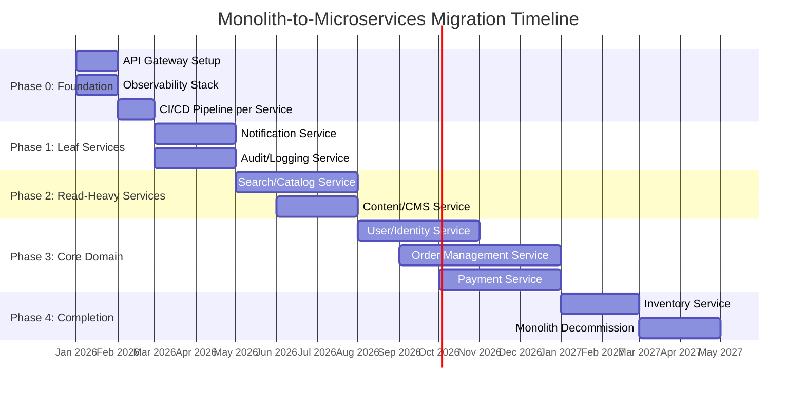

**Phase 0 (Month 1-2): Foundation** -- Set up infrastructure before extracting anything.

- Deploy API Gateway routing 100% of traffic to monolith.
- Deploy observability stack (OpenTelemetry, Prometheus, Grafana, Jaeger).
- Establish CI/CD pipeline template for individual services.
- Define SLOs for each service boundary.
- Establish event schema registry (Avro/Protobuf with compatibility rules).

**Phase 1 (Month 3-4): Leaf Services** -- Extract services with no inbound dependencies from other services.

- Notifications (email, SMS, push) -- pure event consumer, no upstream callers.
- Audit/Logging -- event consumer, append-only, no transactional coupling.
- Validate: Strangler Fig routing works. Team learns the extraction pattern.

**Phase 2 (Month 5-7): Read-Heavy Services** -- Extract services that are read-intensive and can tolerate eventual consistency.

- Search/Catalog -- high read volume, benefits from independent scaling.
- Content/CMS -- static content, low write frequency.
- Data sync via Change Data Capture (CDC) from monolith database.

**Phase 3 (Month 8-12): Core Domain** -- Extract the bounded contexts that define the business.

- User/Identity -- authentication, authorization, profile management.
- Order Management -- order lifecycle, state machine, saga coordination.
- Payment -- PCI-scoped, benefits from isolation.
- Each extraction requires saga patterns for cross-service transactions.

**Phase 4 (Month 13-16): Completion** -- Extract remaining modules and decommission.

- Inventory -- coupled to orders, requires careful saga design.
- Monolith decommission -- remove dead code paths, shut down monolith database.

---

## 2. Domain-Driven Service Decomposition

### 2.1 Event Storming Methodology

Before drawing service boundaries, conduct an Event Storming workshop to discover domain events and aggregates:

1. **Identify Domain Events** (past tense, orange stickies):
   - `OrderPlaced`, `PaymentReceived`, `InventoryReserved`, `ShipmentDispatched`
   - `UserRegistered`, `PasswordReset`, `ProfileUpdated`
   - `NotificationSent`, `SearchQueryExecuted`, `CatalogItemUpdated`

2. **Identify Commands** (imperative, blue stickies):
   - `PlaceOrder`, `ProcessPayment`, `ReserveInventory`, `ShipOrder`
   - `RegisterUser`, `ResetPassword`, `UpdateProfile`

3. **Identify Aggregates** (yellow stickies):
   - `Order` (OrderId, LineItems, Status, Total)
   - `Payment` (PaymentId, Amount, Method, Status)
   - `User` (UserId, Email, PasswordHash, Roles)
   - `Inventory` (SKU, Quantity, WarehouseId)
   - `Catalog` (ProductId, Name, Description, Price, Categories)

4. **Draw Bounded Context Boundaries** -- where the ubiquitous language changes:
   - "User" in Identity context means credentials and roles.
   - "User" in Order context means a customerId reference.
   - "Product" in Catalog context means description and pricing.
   - "Product" in Inventory context means SKU and quantity.

### 2.2 Bounded Context Map

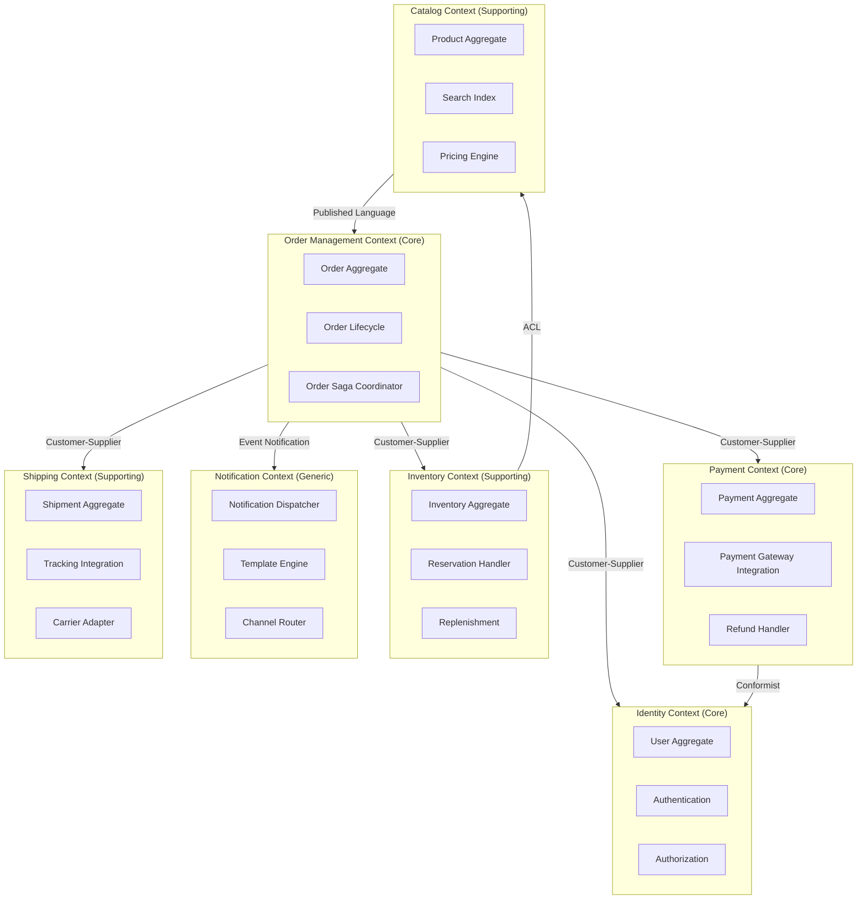

### 2.3 Context Relationship Types

| Relationship | Upstream | Downstream | Pattern | Rationale |
|---|---|---|---|---|
| Identity to Orders | Identity | Orders | Customer-Supplier | Orders depend on user identity but should not dictate auth design |
| Orders to Payments | Orders | Payments | Customer-Supplier | Orders initiate payments; payment service defines its own API |
| Orders to Inventory | Orders | Inventory | Customer-Supplier | Orders request reservations; inventory owns stock truth |
| Catalog to Orders | Catalog | Orders | Published Language | Product data shared via a stable, versioned schema |
| Inventory to Catalog | Catalog | Inventory | Anti-Corruption Layer | Inventory translates catalog product IDs to internal SKU model |
| Orders to Notification | Orders | Notification | Event Notification | Notification is a generic subscriber; no coupling to order internals |
| Orders to Shipping | Orders | Shipping | Customer-Supplier | Orders request fulfillment; shipping owns logistics |

### 2.4 Subdomain Classification

| Subdomain | Type | Investment Level | Build vs Buy |
|---|---|---|---|
| Order Management | Core | High -- competitive advantage | Build |
| Payment Processing | Core | High -- revenue critical | Build + integrate gateway |
| User/Identity | Core | Medium -- foundational | Build (or Auth0/Keycloak) |
| Inventory | Supporting | Medium | Build |
| Catalog/Search | Supporting | Medium | Build + Elasticsearch |
| Shipping | Supporting | Low-Medium | Integrate (ShipStation, EasyPost) |
| Notification | Generic | Low | Build thin layer + SaaS (SendGrid, Twilio) |
| Audit/Logging | Generic | Low | Build thin layer + ELK/Datadog |

### 2.5 Anti-Corruption Layer Design

The ACL sits between bounded contexts that have different domain models. It translates external models into internal ones, preventing foreign concepts from leaking into the domain:

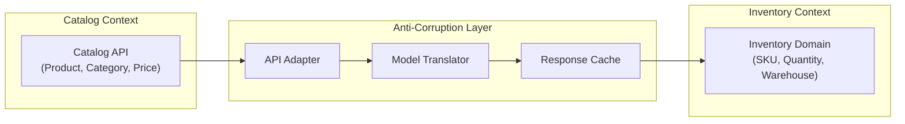

**ACL Implementation Rules:**

- The ACL is owned by the downstream context (Inventory owns the translation from Catalog).
- Translation logic maps external concepts to internal ones: `Product.id` becomes `SKU.catalogProductRef`.
- The ACL caches upstream responses to reduce coupling and improve resilience.
- If the upstream API changes, only the ACL needs updating -- the internal domain model remains stable.

---

## 3. Inter-Service Communication Architecture

### 3.1 Communication Pattern Decision Matrix

| Scenario | Pattern | Protocol | Why |
|---|---|---|---|
| User authentication check | Synchronous | gRPC | Low latency required; real-time auth decision |
| Order placement | Synchronous (API) + Async (events) | REST + Kafka | API returns order ID; downstream processing is async |
| Payment processing | Synchronous | gRPC | Must confirm payment before order confirmation |
| Inventory reservation | Async (command) | Kafka | Can tolerate slight delay; decouples order from inventory |
| Notification dispatch | Async (event) | Kafka | Fire-and-forget; notification failure must not block orders |
| Search index update | Async (CDC) | Debezium + Kafka | Eventual consistency acceptable; read-heavy optimization |
| Shipping label generation | Async (command) | RabbitMQ | Task queue pattern; retryable, order-independent |
| Price lookup | Synchronous | gRPC + cache | Needs current price at order time; cache for performance |

### 3.2 System Topology

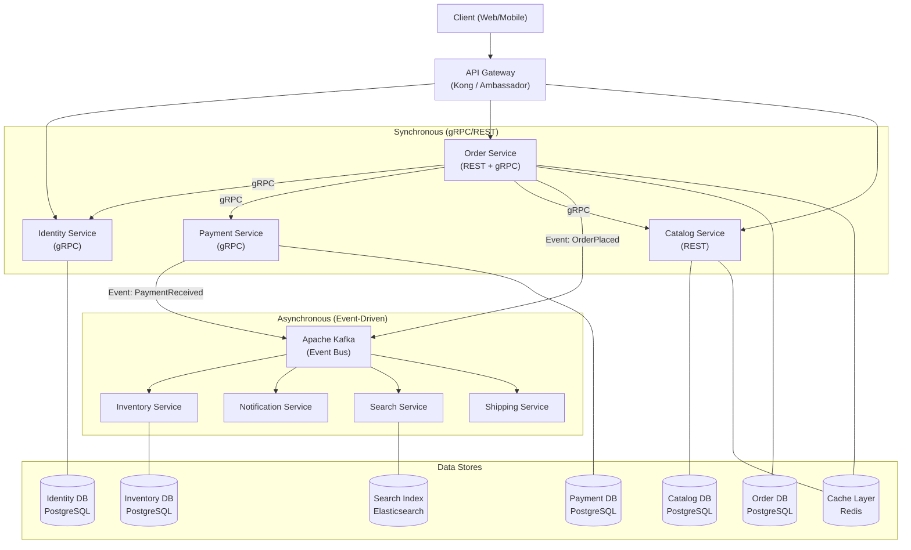

### 3.3 Event Schema Design

All events follow a canonical envelope format with CloudEvents metadata:

```json
{
  "specversion": "1.0",
  "type": "com.example.order.placed",
  "source": "/services/order-service",
  "id": "evt-a1b2c3d4-e5f6-7890",
  "time": "2026-03-21T10:30:00.000Z",
  "datacontenttype": "application/json",
  "subject": "order-42",
  "data": {
    "orderId": "order-42",
    "customerId": "user-7",
    "items": [
      { "productId": "prod-100", "quantity": 2, "unitPrice": 29.99 }
    ],
    "total": 59.98,
    "currency": "USD"
  }
}
```

**Schema Evolution Rules:**

- All schemas registered in Confluent Schema Registry (Avro or Protobuf).
- Backward compatibility mode: new consumers can read old events.
- Forward compatibility mode: old consumers can read new events.
- Never remove or rename fields in published schemas -- add new fields with defaults.
- Use `FULL_TRANSITIVE` compatibility for core domain events (Orders, Payments).

### 3.4 Saga Patterns for Distributed Transactions

#### 3.4.1 Order Fulfillment Saga (Orchestration -- Recommended)

For the order fulfillment flow (5+ steps), use orchestration with a central saga coordinator:

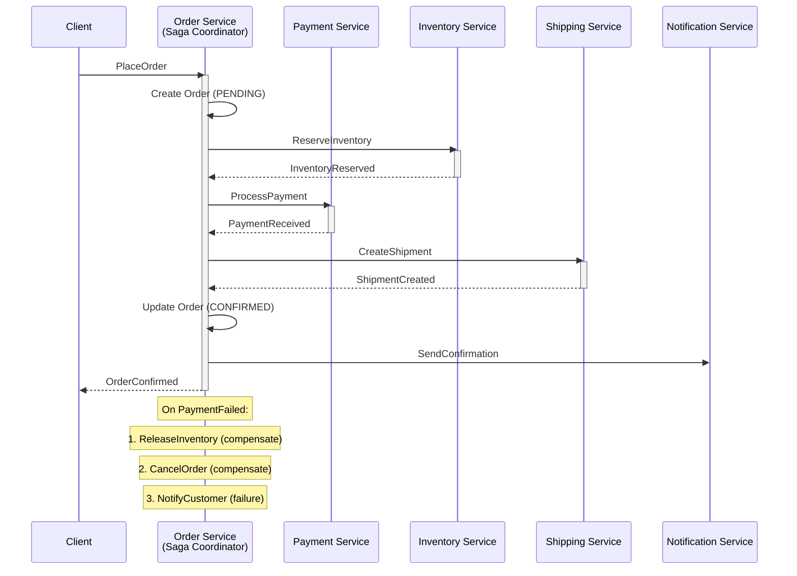

**Saga State Machine:**

```
PENDING --> INVENTORY_RESERVED --> PAYMENT_PROCESSED --> SHIPMENT_CREATED --> CONFIRMED
    |              |                      |                     |
    v              v                      v                     v
 CANCELLED   INVENTORY_FAILED      PAYMENT_FAILED        SHIPMENT_FAILED
                   |                      |                     |
                   v                      v                     v
              (no compensate)      ReleaseInventory      ReleaseInventory +
                                                         RefundPayment
```

#### 3.4.2 Simple Workflows (Choreography)

For 2-3 step flows with low coordination needs, use choreography:

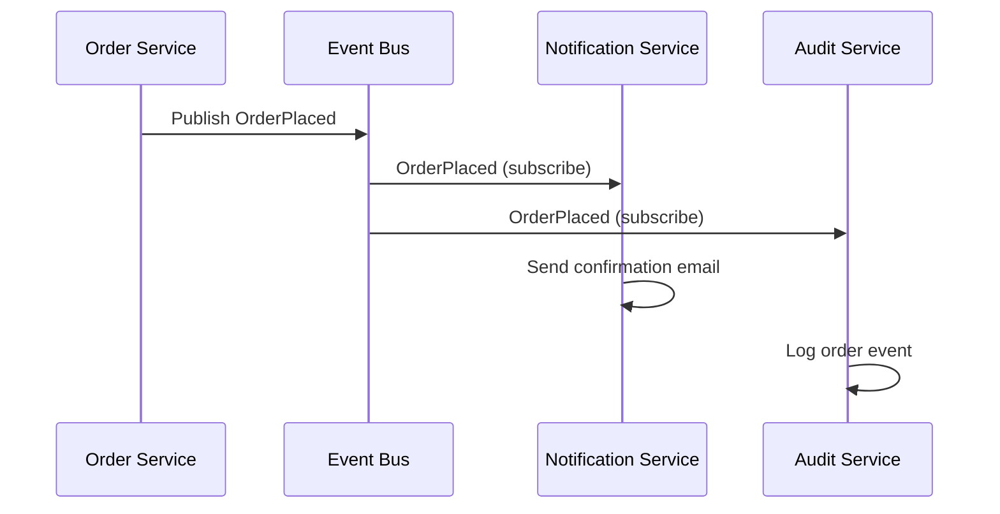

#### 3.4.3 Saga Decision Criteria

| Criteria | Choreography | Orchestration |
|---|---|---|
| Number of steps | 2-4 (simple) | 5+ (complex) |
| Compensation complexity | Simple reverse | Multi-step rollback |
| Observability need | Low (distributed logs) | High (central state machine) |
| Coupling | Very low | Moderate (to coordinator) |
| Error handling | Per-consumer compensating events | Central compensation logic |
| **Recommendation** | Notification flows, audit logging | Order fulfillment, payment flows |

---

## 4. Data Architecture

### 4.1 Database-per-Service Pattern

Each service owns its data exclusively. No service may directly query another service's database.

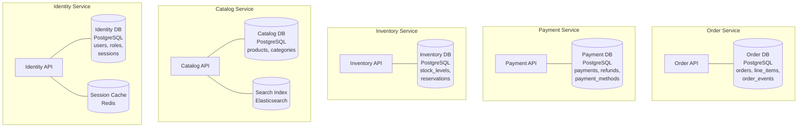

### 4.2 Monolithic Database Decomposition Strategy

Splitting a shared monolithic database is the hardest part of migration. Follow this sequence:

**Step 1: Schema Ownership Mapping**

Map every table to its owning bounded context:

| Table | Owner Context | Consumers | Migration Phase |
|---|---|---|---|
| `users` | Identity | Orders, Payments, Notifications | Phase 3 |
| `orders` | Orders | Payments, Shipping, Notifications | Phase 3 |
| `order_items` | Orders | Inventory, Shipping | Phase 3 |
| `payments` | Payments | Orders, Notifications | Phase 3 |
| `products` | Catalog | Orders, Inventory, Search | Phase 2 |
| `inventory` | Inventory | Orders, Catalog | Phase 4 |
| `notifications` | Notification | -- | Phase 1 |

**Step 2: Introduce Database Views as Seams**

Before splitting, replace direct table access with views:

```sql
-- Create a view that other contexts use instead of the raw table
CREATE VIEW order_context.customer_view AS
  SELECT id, email, display_name
  FROM identity_context.users;

-- Other contexts query the view, not the raw table
-- When the table moves to a separate database, replace the view with an API call
```

**Step 3: Change Data Capture (CDC) for Synchronization**

Use Debezium to stream changes from the monolith database during the transition period:

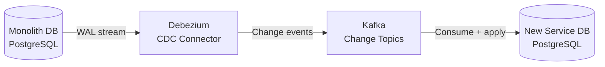

**Step 4: Dual-Write Elimination**

After CDC is stable and the new service handles all writes:

1. Stop monolith from writing to the extracted tables.
2. Route all writes through the new service API.
3. Keep CDC running in reverse (new service to monolith) for read-only consumers.
4. Once all consumers are migrated, drop the monolith tables.

### 4.3 Event Sourcing and CQRS

Apply event sourcing for the Order Management bounded context (core domain requiring full audit trail and temporal queries):

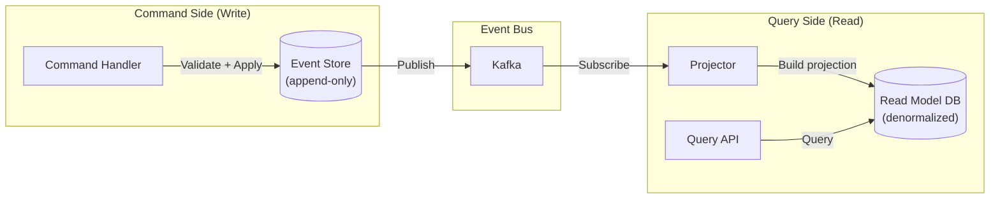

**When to Use Event Sourcing:**

| Use Case | Event Sourcing? | Rationale |
|---|---|---|
| Order lifecycle | Yes | Full audit trail, temporal queries, complex state machine |
| Payment processing | Yes | Regulatory audit requirements, reconciliation |
| User profile CRUD | No | Simple state, no audit requirements |
| Catalog management | No | Read-heavy, no temporal queries needed |
| Inventory levels | Maybe | Depends on audit requirements; snapshot-based may suffice |

### 4.4 Outbox Pattern for Reliable Event Publishing

Guarantee that database writes and event publications happen atomically:

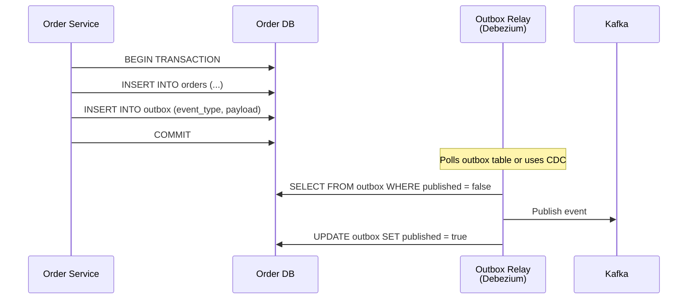

**Outbox Table Schema:**

```sql
CREATE TABLE outbox (
    id UUID PRIMARY KEY DEFAULT gen_random_uuid(),
    aggregate_type VARCHAR(255) NOT NULL,
    aggregate_id VARCHAR(255) NOT NULL,
    event_type VARCHAR(255) NOT NULL,
    payload JSONB NOT NULL,
    created_at TIMESTAMPTZ NOT NULL DEFAULT NOW(),
    published BOOLEAN NOT NULL DEFAULT FALSE,
    published_at TIMESTAMPTZ
);

CREATE INDEX idx_outbox_unpublished ON outbox (created_at) WHERE published = FALSE;
```

### 4.5 Data Consistency Patterns Summary

| Pattern | Consistency | Latency | Complexity | Use When |
|---|---|---|---|---|
| Synchronous API call | Strong | Low | Low | Auth checks, price lookups |
| Saga (orchestration) | Eventual | Medium | High | Multi-service transactions |
| Saga (choreography) | Eventual | Medium | Medium | Simple 2-3 step flows |
| Outbox + CDC | Eventual | Low-Medium | Medium | Reliable event publishing |
| Event sourcing | Eventual (reads) | Medium | High | Audit trail, temporal queries |
| CQRS | Eventual (reads) | Low (reads) | High | Read/write scaling separation |

---

## 5. Infrastructure and Deployment

### 5.1 API Gateway Architecture

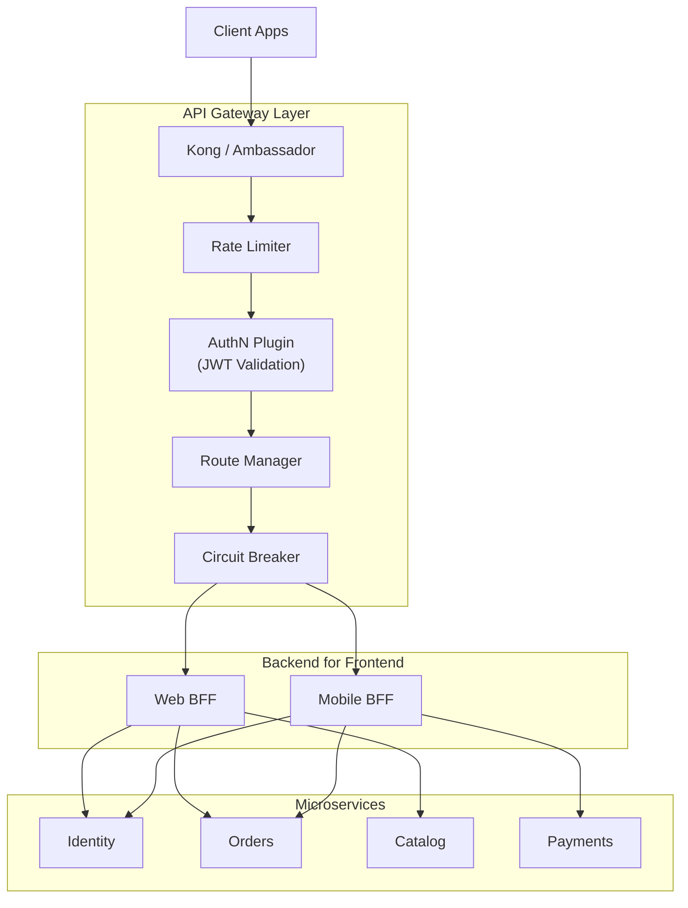

**Gateway Responsibilities:**

- TLS termination
- Authentication (JWT validation, API key verification)
- Rate limiting (per client, per endpoint)
- Request routing (path-based, header-based)
- Circuit breaking (prevent cascading failures)
- Request/response transformation
- CORS handling
- Request logging and tracing (inject trace IDs)

**Gateway Selection:**

| Gateway | Best For | Trade-off |
|---|---|---|
| Kong | General purpose, plugin ecosystem | Heavyweight for small deployments |
| Ambassador/Emissary | Kubernetes-native, Envoy-based | Tighter K8s coupling |
| AWS API Gateway | Serverless, managed | Vendor lock-in, cold starts |
| Traefik | Auto-discovery, Docker/K8s native | Less enterprise plugin ecosystem |

### 5.2 Service Mesh

Deploy Istio or Linkerd for cross-cutting concerns:

| Concern | Service Mesh Handles | Without Mesh |
|---|---|---|
| mTLS between services | Automatic (sidecar) | Manual cert management per service |
| Traffic management | Canary, A/B, fault injection | Custom load balancer config |
| Observability | Automatic metrics, traces | Manual instrumentation per service |
| Rate limiting | Per-service policies | Application-level implementation |
| Retry/timeout | Mesh-level policies | Library-level (Polly, resilience4j) |

**Recommendation:** Start without a service mesh. Add Linkerd (lighter weight) when you have 8+ services and cross-cutting concerns justify the operational complexity.

### 5.3 Kubernetes Deployment Model

```yaml
# Per-service deployment pattern
apiVersion: apps/v1
kind: Deployment
metadata:
  name: order-service
  labels:
    app: order-service
    version: v1.2.3
spec:
  replicas: 3
  strategy:
    type: RollingUpdate
    rollingUpdate:
      maxSurge: 1
      maxUnavailable: 0
  selector:
    matchLabels:
      app: order-service
  template:
    metadata:
      labels:
        app: order-service
        version: v1.2.3
    spec:
      containers:
      - name: order-service
        image: registry.example.com/order-service:v1.2.3
        ports:
        - containerPort: 8080
          name: http
        - containerPort: 9090
          name: grpc
        resources:
          requests:
            cpu: 250m
            memory: 256Mi
          limits:
            cpu: 500m
            memory: 512Mi
        livenessProbe:
          httpGet:
            path: /health/live
            port: 8080
          initialDelaySeconds: 10
          periodSeconds: 15
        readinessProbe:
          httpGet:
            path: /health/ready
            port: 8080
          initialDelaySeconds: 5
          periodSeconds: 10
        env:
        - name: DATABASE_URL
          valueFrom:
            secretKeyRef:
              name: order-service-secrets
              key: database-url
```

### 5.4 CI/CD Pipeline per Service

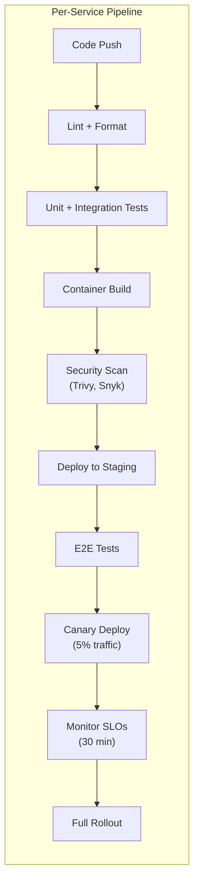

**Independent Deployability Rule:** Each service has its own pipeline. A change to the Order Service does not trigger a build of the Payment Service. Services are deployed independently.

### 5.5 Observability Stack

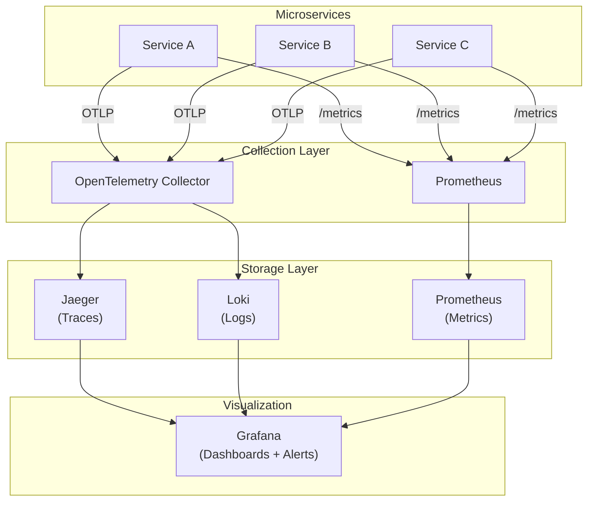

**Golden Signals per Service:**

| Signal | Metric | Alert Threshold |
|---|---|---|
| Latency | P99 request duration | > 500ms for 5 min |
| Traffic | Requests per second | > 2x baseline for 10 min |
| Errors | Error rate (5xx / total) | > 1% for 5 min |
| Saturation | CPU / Memory / Connection pool | > 80% for 10 min |

**Distributed Tracing Requirements:**

- All services propagate W3C Trace Context headers.
- Correlation ID injected at API Gateway, propagated through all downstream calls.
- Kafka messages carry trace context in headers for async flow tracing.
- Sampling strategy: 100% for errors, 10% for successful requests in production.

---

## 6. Resilience Patterns

### 6.1 Circuit Breaker

Prevent cascading failures when a downstream service is degraded:

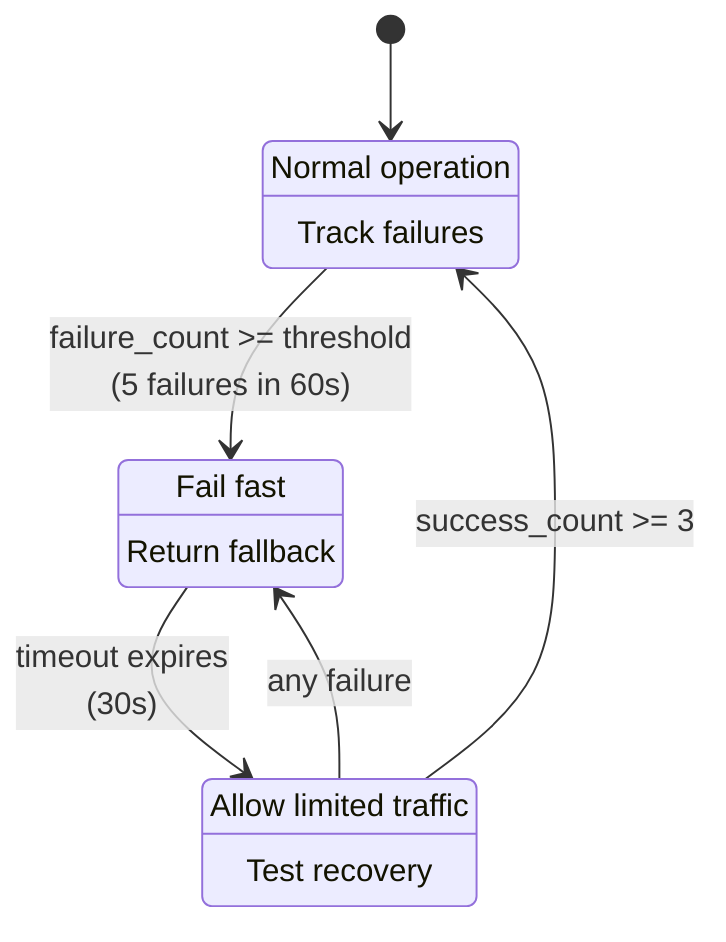

**Configuration per Dependency:**

```yaml
circuit_breakers:
  payment-service:
    failure_threshold: 5
    success_threshold: 3
    timeout_ms: 30000
    monitoring_window_ms: 60000
    fallback: "queue_for_retry"

  inventory-service:
    failure_threshold: 3
    success_threshold: 2
    timeout_ms: 15000
    monitoring_window_ms: 30000
    fallback: "return_cached_availability"

  notification-service:
    failure_threshold: 10
    success_threshold: 5
    timeout_ms: 60000
    monitoring_window_ms: 120000
    fallback: "drop_silently"
```

### 6.2 Bulkhead Pattern

Isolate resources per dependency to prevent one slow dependency from consuming all resources:

| Resource | Bulkhead Strategy | Pool Size | Rationale |
|---|---|---|---|
| Payment Gateway HTTP | Thread pool | 20 threads | Prevent slow payments from blocking orders |
| Inventory gRPC | Connection pool | 10 connections | Inventory is read-heavy, needs less |
| Database connections | Connection pool | 25 per service | Prevent connection exhaustion |
| Kafka producers | Separate producer per topic | 1 per topic | Isolate topic-level failures |

### 6.3 Retry with Exponential Backoff and Jitter

```
delay = min(base_delay * 2^attempt + random_jitter, max_delay)

Example:
  Attempt 0: 100ms + jitter(0-50ms) = 100-150ms
  Attempt 1: 200ms + jitter(0-100ms) = 200-300ms
  Attempt 2: 400ms + jitter(0-200ms) = 400-600ms
  Attempt 3: 800ms + jitter(0-400ms) = 800-1200ms
  Max: 5000ms (cap)
```

**Retry Rules:**

- Retry only on transient failures (5xx, timeout, connection reset).
- Never retry on 4xx errors (client error -- retrying will produce the same result).
- Set a maximum retry count (3-5 attempts).
- All retried operations MUST be idempotent (use idempotency keys).

### 6.4 Timeout Strategy

```
Client --> API Gateway (10s) --> Order Service (5s) --> Payment Service (3s)
                                                   --> Inventory Service (2s)
```

**Rule:** Each downstream timeout must be shorter than the upstream timeout. If the Order Service has a 5s timeout, it must set Payment Service timeout to 3s and Inventory to 2s, leaving margin for its own processing.

### 6.5 Health Check Design

| Check Type | Endpoint | Purpose | Failure Action |
|---|---|---|---|
| Liveness | `/health/live` | Process is alive | Kubernetes restarts pod |
| Readiness | `/health/ready` | Can serve traffic | Kubernetes removes from load balancer |
| Startup | `/health/startup` | Initialization complete | Kubernetes waits for startup |

**Readiness Check Includes:**

- Database connection pool active
- Kafka producer connected
- Cache (Redis) reachable
- Downstream critical dependencies reachable (with circuit breaker state check)

**Liveness Check Is Simple:**

- Process is running
- No deadlocked threads
- Memory below critical threshold

### 6.6 Idempotency

All operations that cross service boundaries must be idempotent:

```
POST /orders
  Header: Idempotency-Key: client-generated-uuid

Server:
  1. Check if Idempotency-Key exists in idempotency store (Redis, 24h TTL)
  2. If exists: return cached response (same status code, same body)
  3. If not: process request, store response, return response
```

**Idempotency Store:**

```sql
CREATE TABLE idempotency_keys (
    key VARCHAR(255) PRIMARY KEY,
    response_status INT NOT NULL,
    response_body JSONB NOT NULL,
    created_at TIMESTAMPTZ NOT NULL DEFAULT NOW(),
    expires_at TIMESTAMPTZ NOT NULL DEFAULT NOW() + INTERVAL '24 hours'
);
```

---

## 7. Migration Roadmap

### 7.1 Phase-by-Phase Timeline with Rollback Points

| Phase | Duration | Services | Rollback Strategy | Success Criteria |
|---|---|---|---|---|
| **Phase 0: Foundation** | 2 months | -- | Remove gateway, route directly | Gateway routes 100% traffic; observability dashboards live |
| **Phase 1: Leaf Services** | 2 months | Notification, Audit | Route traffic back to monolith | < 1% error rate; P99 < 200ms; all notifications delivered |
| **Phase 2: Read-Heavy** | 3 months | Catalog/Search | CDC rollback to monolith queries | Search latency P99 < 100ms; catalog data consistency < 5s lag |
| **Phase 3: Core Domain** | 5 months | User, Order, Payment | Feature flags; route back to monolith | SLOs met for 30 days; saga completion rate > 99.5% |
| **Phase 4: Completion** | 3 months | Inventory; decommission | Re-enable monolith paths | All monolith endpoints return 404; zero traffic to monolith DB |

### 7.2 Risk Assessment per Phase

| Phase | Risk Level | Top Risks | Mitigations |
|---|---|---|---|
| Phase 0 | Low | Gateway misconfiguration | Canary with 1% traffic; automated rollback |
| Phase 1 | Low | Lost notifications | Dead letter queue; monitoring; manual resend capability |
| Phase 2 | Medium | Search data inconsistency | CDC lag monitoring; fallback to monolith search |
| Phase 3 | High | Transaction failures across services | Saga compensation; extensive load testing; parallel run for payments |
| Phase 4 | Medium | Undiscovered monolith dependencies | Dependency scan; gradual traffic reduction; keep monolith warm for 30 days |

### 7.3 SLOs per Phase

| Service | Availability | Latency (P99) | Error Budget (30d) |
|---|---|---|---|
| API Gateway | 99.99% | < 50ms (routing only) | 4.3 min/month |
| Identity Service | 99.95% | < 100ms | 21.9 min/month |
| Order Service | 99.9% | < 500ms | 43.8 min/month |
| Payment Service | 99.9% | < 1000ms | 43.8 min/month |
| Catalog Service | 99.9% | < 200ms | 43.8 min/month |
| Inventory Service | 99.5% | < 300ms | 3.6 hr/month |
| Notification Service | 99.5% | < 5000ms | 3.6 hr/month |
| Search Service | 99.5% | < 100ms | 3.6 hr/month |

---

## 8. Architecture Decision Records

### ADR-001: Strangler Fig as Primary Migration Strategy

- **Context:** Migrating a production monolith to microservices. Need zero-downtime migration with per-service rollback.
- **Decision:** Use Strangler Fig pattern with API Gateway as the routing layer.
- **Consequences:** Longer migration timeline (12-18 months) but dramatically lower risk. Each service extraction is independently reversible. Requires investment in API Gateway infrastructure upfront.
- **Alternatives Rejected:** Big Bang rewrite (too risky for production systems), Parallel Run (2x infrastructure cost not justified except for payment service).

### ADR-002: Orchestrated Sagas for Order Fulfillment

- **Context:** Order placement involves 4+ services (Inventory, Payment, Shipping, Notification). Need distributed transaction coordination.
- **Decision:** Use orchestrated saga with Order Service as coordinator. Use choreography for simpler 2-step flows (notification triggers).
- **Consequences:** Order Service becomes more complex (saga state machine). Easier to debug and monitor than choreography for complex flows. Single point of coordination (mitigated by stateless coordinator with event-sourced state).
- **Alternatives Rejected:** Choreography for all flows (too hard to debug with 5+ steps), 2PC/distributed transactions (violates service autonomy, poor availability).

### ADR-003: Database-per-Service with CDC for Transition

- **Context:** Monolith has a single shared database. Services need data ownership without Big Bang database split.
- **Decision:** Each new service gets its own PostgreSQL database. During transition, use Debezium CDC to replicate data between monolith and new service databases.
- **Consequences:** Operational complexity of managing multiple databases. CDC adds latency (typically < 1s). Eliminates shared database anti-pattern. Enables independent schema evolution.
- **Alternatives Rejected:** Shared database with schemas (doesn't provide true isolation), API-only data access during migration (too slow for bulk data migration).

### ADR-004: gRPC for Internal Synchronous Communication

- **Context:** Services need synchronous communication for real-time operations (auth checks, payment processing).
- **Decision:** Use gRPC for internal service-to-service communication. Use REST for external-facing APIs (API Gateway to clients).
- **Consequences:** Binary protocol is more efficient than JSON over HTTP. Strong typing via Protobuf. Streaming support for future use cases. Requires Protobuf schema management. Learning curve for teams unfamiliar with gRPC.
- **Alternatives Rejected:** REST for all communication (higher latency, no streaming), GraphQL federation (premature complexity for internal communication).

### ADR-005: Event Sourcing for Order Management Only

- **Context:** Need audit trails and temporal queries for order lifecycle. Other domains have simpler CRUD patterns.
- **Decision:** Apply event sourcing only to Order Management bounded context. Use standard CRUD with outbox pattern for other services.
- **Consequences:** Order Management has full audit trail and temporal query capability. Increased complexity in Order Service (event store, projections, snapshots). Other services remain simple. Prevents over-engineering of supporting/generic subdomains.
- **Alternatives Rejected:** Event sourcing everywhere (excessive complexity for CRUD domains), no event sourcing (loses audit trail for core domain).

### ADR-006: Defer Service Mesh Until 8+ Services

- **Context:** Cross-cutting concerns (mTLS, traffic management, observability) needed across services.
- **Decision:** Start without a service mesh. Add Linkerd when the number of services exceeds 8 and cross-cutting concern management becomes a bottleneck.
- **Consequences:** Initial services handle mTLS and retries at the application level. Simpler operational model during early migration. Must retrofit service mesh later. Linkerd chosen over Istio for lower resource overhead and simpler operations.
- **Alternatives Rejected:** Istio from day 1 (too heavy for < 8 services), never adopting a mesh (manual cross-cutting concern management does not scale).

---

## 9. Anti-Patterns to Avoid

### 9.1 Distributed Monolith

**Symptom:** Services cannot be deployed independently. A change in one service requires coordinated deployment of others.

**Causes:**
- Shared database between services
- Synchronous call chains that create temporal coupling
- Shared libraries with business logic (not just utilities)
- Coordinated release schedules

**Prevention:**
- Database-per-service is non-negotiable
- Default to async communication; sync only when consistency requires it
- Share only utility libraries (logging, tracing); never share domain logic
- Independent CI/CD pipelines per service

### 9.2 Chatty Services

**Symptom:** A single user request triggers dozens of inter-service calls, each adding latency.

**Causes:**
- Services decomposed too finely (nanoservices)
- No data denormalization -- every query requires joins across services
- Missing BFF (Backend for Frontend) aggregation layer

**Prevention:**
- Right-size services around bounded contexts, not individual entities
- Denormalize read models (CQRS) to reduce cross-service queries
- Use BFF to aggregate multiple service calls into a single client response

### 9.3 Shared Database

**Symptom:** Multiple services read/write the same database tables.

**Causes:**
- Expedient shortcut during migration
- "Just this one table" exception that multiplies

**Prevention:**
- Enforce database-per-service from day 1 of migration
- Use CDC or API calls for cross-service data access
- No exceptions, no "temporary" shared tables

### 9.4 No API Versioning

**Symptom:** API changes break consumers. Coordinated deployments become necessary.

**Causes:**
- No versioning strategy from the start
- Breaking changes pushed without consumer coordination

**Prevention:**
- Version all APIs from day 1 (URI versioning: `/v1/`, `/v2/`)
- Never remove or rename fields in published schemas
- Deprecation lifecycle: announce, sunset header, grace period, remove

### 9.5 Event Sourcing Everywhere

**Symptom:** CRUD services burdened with event stores, projections, and snapshot management.

**Causes:**
- Applying a pattern without evaluating the domain's needs
- Treating event sourcing as a universal architecture style

**Prevention:**
- Event sourcing only for core domains with audit trail or temporal query requirements
- Standard CRUD with outbox pattern for supporting and generic subdomains
- Evaluate each bounded context independently

### 9.6 Missing Idempotency

**Symptom:** Duplicate payments, double inventory reservations, duplicate notifications when retries occur.

**Causes:**
- Assuming exactly-once delivery (it does not exist in distributed systems)
- Not implementing idempotency keys on mutating operations

**Prevention:**
- All cross-service mutating operations must accept an idempotency key
- Idempotency store with TTL (Redis or database)
- Kafka consumer offset management with exactly-once semantics (transactional consumers)

### 9.7 Ignoring Conway's Law

**Symptom:** Service boundaries do not match team boundaries. Multiple teams modify the same service. No team owns a service end-to-end.

**Causes:**
- Decomposing by technical layer (frontend team, backend team, database team) instead of by business capability

**Prevention:**
- Align service boundaries with team boundaries
- Each service is owned by one team (two-pizza team)
- Teams own the full stack of their service (API, business logic, database, deployment)

---

## Appendix A: Technology Selection Summary

| Concern | Recommended | Alternatives |
|---|---|---|
| API Gateway | Kong | Ambassador, Traefik, AWS API Gateway |
| Service Communication (sync) | gRPC | REST (external), GraphQL (query aggregation) |
| Service Communication (async) | Apache Kafka | RabbitMQ (task queues), NATS (lightweight pub/sub) |
| Event Schema Registry | Confluent Schema Registry | Apicurio, AWS Glue Schema Registry |
| Database | PostgreSQL (per service) | MySQL, DynamoDB (for specific use cases) |
| Search | Elasticsearch | OpenSearch, Meilisearch |
| Cache | Redis | Memcached (simple caching only) |
| CDC | Debezium | Maxwell, AWS DMS |
| Container Orchestration | Kubernetes | ECS (AWS-native), Nomad |
| Service Mesh | Linkerd (when needed) | Istio (heavier, more features) |
| Observability | OpenTelemetry + Grafana stack | Datadog (managed), New Relic |
| CI/CD | GitHub Actions / GitLab CI | ArgoCD (GitOps), Tekton |

## Appendix B: Migration Checklist per Service Extraction

- [ ] Bounded context boundaries identified and documented
- [ ] Data ownership mapped (which tables belong to this service)
- [ ] API contract defined (OpenAPI/Protobuf)
- [ ] Database provisioned (separate instance)
- [ ] CDC pipeline set up (if migrating data from monolith)
- [ ] Event schemas registered in schema registry
- [ ] Circuit breaker configured for all downstream dependencies
- [ ] Retry policies defined with exponential backoff
- [ ] Idempotency keys implemented on all mutating endpoints
- [ ] Health checks implemented (liveness + readiness + startup)
- [ ] Distributed tracing integrated (OpenTelemetry)
- [ ] SLOs defined and dashboards created
- [ ] CI/CD pipeline operational (build, test, deploy independently)
- [ ] Canary deployment tested (5% traffic shift)
- [ ] Load testing completed (match production traffic patterns)
- [ ] Rollback procedure documented and tested
- [ ] Monolith code paths marked for deprecation
- [ ] On-call runbook created for the new service
