<!-- Agent: architect | Task: #11 | Session: 2026-02-07 -->

# Agents System Deep Dive -- Architecture Plan

**Pipeline:** Enterprise Pipeline #11
**Agent:** architect (opus)
**Date:** 2026-02-07
**Status:** Analysis Complete -- Implementation Pending

---

## Executive Summary

The `.claude/agents/` directory contains **49 agent definition files** across 4 subdirectories (core: 9, domain: 22, specialized: 14, orchestrators: 4). Registry consistency is excellent -- all 49 agents are present in both `agent-registry.json` and `agent-config.json`, and all 49 have valid `.md` files on disk. The routing table (`routing-table.cjs`) routes to 47/49 agents; the 2 missing are `reflection-agent` (invoked via Step 0, not keyword routing) and `party-orchestrator` (invoked only via Party Mode, not general routing).

However, **utilization remains critically low**. Spawn logs show only **7 unique agent types** have ever been spawned (developer: 7, reflection-agent: 3, architect: 3, security-architect: 3, planner: 2, code-reviewer: 1, qa: 1). That is 7/49 = **14.3% utilization**, up from 2% (1/49) reported in ADR-079 but still far from the target.

**Key findings:**
- 0 orphaned agents (all files are registered)
- 0 phantom agents (all registry entries have files)
- 2 agents not routable via keyword routing (by design)
- 3 stale references in `rules/agents.md` (wrong agent names)
- 42 agents have never been spawned (85.7% under-utilized)
- 3 non-agent files exist in agents directory (test fixtures)
- devops-troubleshooter and incident-responder have significant purpose overlap

---

## Phase 1: Full Inventory

### Core Agents (9 files) -- `.claude/agents/core/`

| Agent | Model | Lines | Skills | Description |
|-------|-------|-------|--------|-------------|
| architect | opus | 446 | 18 | System designer, stacks, scalability |
| context-compressor | haiku | 162 | 4 | Context summarization, token saving |
| developer | sonnet | 396 | 20 | TDD-focused implementer |
| planner | opus | 694 | 11 | Strategic breakdown, planning |
| pm | sonnet | 350 | 12 | Product management, backlogs |
| qa | opus | 293 | 14 | Testing, regression, quality |
| reflection-agent | sonnet | 576 | 10 | Quality assessment, learning extraction |
| router | haiku | 559 | 7 | Request routing, agent spawning |
| technical-writer | sonnet | 271 | 13 | Documentation, guides |

### Domain Agents (22 files) -- `.claude/agents/domain/`

| Agent | Model | Lines | Skills | Description |
|-------|-------|-------|--------|-------------|
| ai-ml-specialist | opus | 712 | 13 | ML, deep learning, MLOps |
| android-pro | sonnet | 852 | 8 | Kotlin, Jetpack Compose |
| data-engineer | sonnet | 595 | 11 | ETL, data pipelines |
| expo-mobile-developer | sonnet | 556 | 11 | React Native, Expo |
| fastapi-pro | opus | 324 | 11 | FastAPI, async Python |
| frontend-pro | sonnet | 636 | 15 | React, Vue, CSS |
| gamedev-pro | opus | 419 | 9 | Unity, Unreal, Godot |
| golang-pro | opus | 310 | 9 | Go 1.21+, concurrency |
| graphql-pro | sonnet | 780 | 9 | GraphQL, schema design |
| ios-pro | sonnet | 676 | 8 | Swift, SwiftUI |
| java-pro | sonnet | 869 | 11 | Java 21+, Spring Boot |
| mobile-ux-reviewer | sonnet | 270 | 11 | UX/UI critique, accessibility |
| nextjs-pro | sonnet | 810 | 11 | Next.js 14+, RSC |
| nodejs-pro | sonnet | 671 | 10 | Express, NestJS |
| php-pro | sonnet | 852 | 10 | PHP 8.x, Laravel |
| python-pro | opus | 291 | 11 | Python 3.12+ |
| rust-pro | opus | 305 | 8 | Rust 1.75+, Tokio |
| scientific-research-expert | opus | 608 | 12 | Biology, cheminformatics |
| sveltekit-expert | sonnet | 776 | 10 | Svelte 5, SvelteKit |
| tauri-desktop-developer | sonnet | 453 | 11 | Tauri 2.0, Rust backend |
| typescript-pro | opus | 307 | 10 | Advanced types, generics |
| web3-blockchain-expert | opus | 390 | 9 | Solidity, DeFi |

### Specialized Agents (14 files) -- `.claude/agents/specialized/`

| Agent | Model | Lines | Skills | Description |
|-------|-------|-------|--------|-------------|
| c4-code | sonnet | 232 | 6 | C4 code-level docs |
| c4-component | sonnet | 240 | 6 | C4 component synthesis |
| c4-container | sonnet | 250 | 6 | C4 container mapping |
| c4-context | sonnet | 273 | 6 | C4 system context |
| code-reviewer | sonnet | 433 | 17 | Two-stage code review |
| code-simplifier | opus | 400 | 12 | Refactoring for clarity |
| conductor-validator | opus | 321 | 6 | Conductor project validation |
| database-architect | opus | 455 | 10 | Schema, queries, migrations |
| devops | sonnet | 192 | 20+ | IaC, CI/CD, deployment |
| devops-troubleshooter | sonnet | 277 | 14 | Debugging, incident response |
| incident-responder | sonnet | 333 | 13 | SRE, post-mortems |
| researcher | sonnet | 553 | 11 | Web research, fact-finding |
| reverse-engineer | opus | 525 | 13 | Binary analysis, decompilation |
| security-architect | opus | 283 | 20 | Threat modeling, OWASP |

### Orchestrators (4 files) -- `.claude/agents/orchestrators/`

| Agent | Model | Lines | Skills | Description |
|-------|-------|-------|--------|-------------|
| evolution-orchestrator | opus | 895 | 11+ | EVOLVE workflow, artifact creation |
| master-orchestrator | opus | 199 | 13 | Project lifecycle coordination |
| party-orchestrator | opus | 439 | 7 | Multi-agent Party Mode |
| swarm-coordinator | opus | 154 | 8 | Queen/Worker swarm topology |

### Non-Agent Files in `.claude/agents/`

| File | Location | Purpose |
|------|----------|---------|
| agent-response-mock.cjs | orchestrators/__tests__/mocks/ | Test mock |
| task-tool-mock.cjs | orchestrators/__tests__/mocks/ | Test mock |
| run-all-tests.cjs | orchestrators/__tests__/ | Test runner |

These are test fixtures, not agent definitions. They are properly located in a `__tests__` subdirectory.

---

## Phase 2: Registry Consistency

### Agent Files vs. Registries

| Check | Result | Details |
|-------|--------|---------|
| Files on disk | 49 | All .md files in core/domain/specialized/orchestrators |
| agent-registry.json | 49 | All match file paths |
| agent-config.json | 49 | All have model + tools assignments |
| tool-manifest.json metadata | 49 | `totalAgents: 49` (fixed in Pipeline #10) |
| @AGENT_ROUTING_TABLE.md | 49 | All 49 agents listed (including router as Meta) |
| routing-table.cjs INTENT_TO_AGENT | 47 | Missing: reflection-agent, party-orchestrator |
| routing-table.cjs ROUTING_TABLE | 46 | Missing: reflection-agent, party-orchestrator, pm |
| capability-routing.json defaultAgents | 12 | Only maps broad categories |
| rules/agents.md | ~12 | Quick reference, not exhaustive |
| Root-level router.md duplicate | NONE | Previously known issue is RESOLVED |

### Registry Entry Accuracy

Every agent in `agent-registry.json` has:
- Correct `filePath` matching the actual file location
- `category` matching the subdirectory (core/specialized/domain/orchestrator)
- `health.status` = "healthy" (all 49)
- `capabilities` with skills list, tools list, tags

Every agent in `agent-config.json` has:
- `model` field matching the frontmatter model
- `tools` array (tool list)
- `phase` field (only 4 agents have non-"no-phase" values: router=routing, planner=planning, developer=coding, qa=qa, architect=planning)

### Consistency Issues Found

**ISSUE REG-1 [LOW]:** `rules/agents.md` references `python-backend-expert` -- should be `python-pro`.

**ISSUE REG-2 [LOW]:** `rules/agents.md` references `typescript-expert` -- should be `typescript-pro`.

**ISSUE REG-3 [MEDIUM]:** `rules/agents.md` references `database-specialist` -- should be `database-architect`.

**ISSUE REG-4 [LOW]:** `routing-table.cjs ROUTING_TABLE` does not include `pm` (Product Manager). However, `INTENT_TO_AGENT` does map `pm -> pm`, so the pm agent IS reachable. The ROUTING_TABLE is the keyword mapping; pm is reachable via the intent system.

**ISSUE REG-5 [INFO]:** `reflection-agent` and `party-orchestrator` are not in the keyword routing table. This is by design:
- `reflection-agent` is spawned by the Step 0 reflection mechanism, not user-keyword routing
- `party-orchestrator` is spawned only when Party Mode is activated

---

## Phase 3: Wiring Audit

### Wiring Summary Matrix

Legend: RT = routing-table.cjs, ART = @AGENT_ROUTING_TABLE.md, WF = workflow references, CAP = capability-routing.json, SPAWN = actually spawned

| Agent | RT | ART | WF | CAP | SPAWN | Verdict |
|-------|:--:|:---:|:--:|:---:|:-----:|---------|
| **CORE** | | | | | | |
| architect | Y | Y | Y | Y | 3 | FULLY WIRED |
| context-compressor | Y | Y | Y | N | 0 | WIRED, NOT SPAWNED |
| developer | Y | Y | Y | Y | 7 | FULLY WIRED |
| planner | Y | Y | Y | Y | 2 | FULLY WIRED |
| pm | Y* | Y | Y | N | 0 | WIRED, NOT SPAWNED |
| qa | Y | Y | Y | Y | 1 | FULLY WIRED |
| reflection-agent | N** | Y | Y | N | 3 | WIRED (Step 0) |
| router | Y | Y | Y | N | - | META (not spawned) |
| technical-writer | Y | Y | Y | Y | 0 | WIRED, NOT SPAWNED |
| **SPECIALIZED** | | | | | | |
| c4-code | Y | Y | N | N | 0 | PARTIALLY WIRED |
| c4-component | Y | Y | N | N | 0 | PARTIALLY WIRED |
| c4-container | Y | Y | N | N | 0 | PARTIALLY WIRED |
| c4-context | Y | Y | N | N | 0 | PARTIALLY WIRED |
| code-reviewer | Y | Y | Y | Y | 1 | FULLY WIRED |
| code-simplifier | Y | Y | N | N | 0 | PARTIALLY WIRED |
| conductor-validator | Y | Y | Y | N | 0 | WIRED, NOT SPAWNED |
| database-architect | Y | Y | N | Y | 0 | WIRED, NOT SPAWNED |
| devops | Y | Y | Y | Y | 0 | WIRED, NOT SPAWNED |
| devops-troubleshooter | Y | Y | N | Y | 0 | WIRED, NOT SPAWNED |
| incident-responder | Y | Y | N | Y | 0 | WIRED, NOT SPAWNED |
| researcher | Y | Y | N | Y | 0 | WIRED, NOT SPAWNED |
| reverse-engineer | Y | Y | N | N | 0 | PARTIALLY WIRED |
| security-architect | Y | Y | Y | Y | 3 | FULLY WIRED |
| **DOMAIN** | | | | | | |
| ai-ml-specialist | Y | Y | N | N | 0 | PARTIALLY WIRED |
| android-pro | Y | Y | N | Y | 0 | WIRED, NOT SPAWNED |
| data-engineer | Y | Y | N | Y | 0 | WIRED, NOT SPAWNED |
| expo-mobile-developer | Y | Y | N | Y | 0 | WIRED, NOT SPAWNED |
| fastapi-pro | Y | Y | N | N | 0 | PARTIALLY WIRED |
| frontend-pro | Y | Y | N | Y | 0 | WIRED, NOT SPAWNED |
| gamedev-pro | Y | Y | N | N | 0 | PARTIALLY WIRED |
| golang-pro | Y | Y | N | N | 0 | PARTIALLY WIRED |
| graphql-pro | Y | Y | N | N | 0 | PARTIALLY WIRED |
| ios-pro | Y | Y | N | Y | 0 | WIRED, NOT SPAWNED |
| java-pro | Y | Y | N | N | 0 | PARTIALLY WIRED |
| mobile-ux-reviewer | Y | Y | N | N | 0 | PARTIALLY WIRED |
| nextjs-pro | Y | Y | N | N | 0 | PARTIALLY WIRED |
| nodejs-pro | Y | Y | N | N | 0 | PARTIALLY WIRED |
| php-pro | Y | Y | N | N | 0 | PARTIALLY WIRED |
| python-pro | Y | Y | N | Y | 0 | WIRED, NOT SPAWNED |
| rust-pro | Y | Y | N | N | 0 | PARTIALLY WIRED |
| scientific-research-expert | Y | Y | N | N | 0 | PARTIALLY WIRED |
| sveltekit-expert | Y | Y | N | N | 0 | PARTIALLY WIRED |
| tauri-desktop-developer | Y | Y | N | N | 0 | PARTIALLY WIRED |
| typescript-pro | Y | Y | N | N | 0 | PARTIALLY WIRED |
| web3-blockchain-expert | Y | Y | N | N | 0 | PARTIALLY WIRED |
| **ORCHESTRATORS** | | | | | | |
| evolution-orchestrator | Y | Y | Y | N | 0 | WIRED, NOT SPAWNED |
| master-orchestrator | Y | Y | Y | Y | 0 | WIRED, NOT SPAWNED |
| party-orchestrator | N** | Y | Y | N | 0 | WIRED (Party Mode) |
| swarm-coordinator | Y | Y | N | Y | 0 | WIRED, NOT SPAWNED |

Notes:
- `Y*` = pm is in INTENT_TO_AGENT but not in basic ROUTING_TABLE keyword map
- `N**` = By design: reflection-agent uses Step 0 mechanism, party-orchestrator uses Party Mode activation

### Skills Wiring Verification

All 49 agents have skills assigned in their frontmatter. All referenced skills exist as directories in `.claude/skills/`. No phantom skill references were found.

### Spawn History Analysis

From `spawn-log.jsonl` (44 entries, single session 2026-02-07):

| Agent | Times Spawned | % of Total |
|-------|:------------:|:----------:|
| developer | 7 | 35% |
| reflection-agent | 3 | 15% |
| architect | 3 | 15% |
| security-architect | 3 | 15% |
| planner | 2 | 10% |
| code-reviewer | 1 | 5% |
| qa | 1 | 5% |
| **All others (42 agents)** | **0** | **0%** |

**Key insight:** 7/49 agents have been spawned = 14.3% utilization. This is a significant improvement from the 2% (1/49 = developer only) reported in ADR-079, but 85.7% of agents remain unused.

---

## Phase 4: Gap Analysis

### 4.1 Orphaned Agents (on disk, not in registry)

**COUNT: 0**

All 49 agent files on disk are present in both `agent-registry.json` and `agent-config.json`.

### 4.2 Phantom Agents (in registry, no file)

**COUNT: 0**

All 49 registry entries have corresponding `.md` files on disk at the listed paths.

### 4.3 Stale Agents (frontmatter references non-existent resources)

**COUNT: 0** (all skill references verified against disk)

All skills listed in agent frontmatter exist as directories in `.claude/skills/`. No phantom skill references.

### 4.4 Duplicate/Overlapping Agents

**OVERLAP-1 [MEDIUM]: devops-troubleshooter vs incident-responder**

Both agents handle incident response and production debugging:
- `devops-troubleshooter`: "rapid incident response, advanced debugging, modern observability"
- `incident-responder`: "rapid problem resolution, modern observability, comprehensive incident management"

They share 8 common skills: `debugging`, `container-expert`, `context-compressor`, `logging-module-usage`, `postmortem-writing`, `recovery`, `sentry-monitoring`, `smart-debug`.

The distinction is:
- `devops-troubleshooter` focuses on **debugging** and **root cause analysis**
- `incident-responder` focuses on **incident command** and **communication** (includes `on-call-handoff-patterns`, `slack-notifications`)

**Recommendation:** KEEP BOTH but clarify routing. Add disambiguation rule: "debugging/troubleshoot -> devops-troubleshooter, incident/outage -> incident-responder" (already correct in routing-table.cjs).

**OVERLAP-2 [LOW]: fastapi-pro vs python-pro**

Both are Python experts:
- `fastapi-pro`: "FastAPI, SQLAlchemy 2.0, Pydantic V2, microservices"
- `python-pro`: "Python 3.12+, modern features, async, performance optimization"

The distinction is:
- `fastapi-pro` is FastAPI-specific
- `python-pro` is general Python

**Recommendation:** KEEP BOTH. Routing already disambiguates via keywords (`fastapi` -> fastapi-pro, `python` -> python-pro).

**OVERLAP-3 [LOW]: researcher vs scientific-research-expert**

Both do research:
- `researcher`: "Web access, Exa tools, fact-finding, technology comparisons"
- `scientific-research-expert`: "Computational biology, cheminformatics, genomics, drug discovery"

The distinction is clear: `researcher` is general-purpose web research; `scientific-research-expert` is domain-specific academic research. KEEP BOTH.

### 4.5 Under-Utilized Agents

**42 agents have never been spawned (85.7%)**

**Tier 1: High-value, should be spawning regularly (NOT spawning = system failure):**
- `technical-writer` -- should spawn after documentation changes
- `devops` -- should spawn for deployment tasks
- `context-compressor` -- should spawn when context is large
- `master-orchestrator` -- should spawn for multi-phase work
- `pm` -- should spawn for product planning

**Tier 2: Domain specialists (spawn when matching domain detected):**
- All 22 domain agents (python-pro, rust-pro, etc.)
- These only fire when users work in those specific domains, which is expected

**Tier 3: Specialized (spawn in specific workflows):**
- c4-* agents (C4 architecture documentation)
- conductor-validator, reverse-engineer, code-simplifier
- evolution-orchestrator, swarm-coordinator, party-orchestrator

**Root Cause (unchanged from ADR-079):**
1. Enforcement hooks still default to `warn` (not `block`)
2. No post-completion chain triggers follow-up agents
3. Enterprise workflow state machine not yet implemented
4. Router collapses most requests to `developer`

### 4.6 Missing Agents (capabilities needed but no agent)

**GAP-AGENT-1 [LOW]:** No dedicated **accessibility-auditor** agent. Mobile-ux-reviewer and frontend-pro cover some accessibility, but there is no standalone WCAG/ADA compliance agent.

**GAP-AGENT-2 [LOW]:** No dedicated **performance-engineer** agent. Performance optimization is scattered across devops, developer, and domain agents.

**GAP-AGENT-3 [INFO]:** No dedicated **UI designer** agent for creating mockups or wireframes. mobile-ux-reviewer reviews UX but does not design it.

These gaps are LOW priority and do not warrant new agents until demand is demonstrated.

### 4.7 Root-Level Duplicates

**COUNT: 0**

The known issue of `router.md` existing at both `.claude/agents/router.md` and `.claude/agents/core/router.md` has been RESOLVED. Only the core/ version exists now.

### 4.8 Stale References in Documentation

**STALE-1 [MEDIUM]:** `rules/agents.md` line 30 says `python-backend-expert` -- should be `python-pro`

**STALE-2 [MEDIUM]:** `rules/agents.md` line 30 says `typescript-expert` -- should be `typescript-pro`

**STALE-3 [MEDIUM]:** `rules/agents.md` line 43 says `database-specialist` -- should be `database-architect`

---

## Phase 5: Disposition Matrix

### Core Agents

| Agent | Disposition | Action Required |
|-------|------------|-----------------|
| architect | **KEEP** | None. Fully wired, being spawned. |
| context-compressor | **KEEP** | Enable auto-spawn when context exceeds threshold. |
| developer | **KEEP** | None. Primary agent, most spawned. |
| planner | **KEEP** | None. Fully wired, being spawned. |
| pm | **KEEP** | Add to capability-routing.json. |
| qa | **KEEP** | None. Fully wired, being spawned. |
| reflection-agent | **KEEP** | None. Wired via Step 0, being spawned. |
| router | **KEEP** | None. Meta agent, functioning. |
| technical-writer | **KEEP** | Add to post-completion chain for doc tasks. |

### Domain Agents

| Agent | Disposition | Action Required |
|-------|------------|-----------------|
| ai-ml-specialist | **KEEP** | Add workflow reference. Low priority. |
| android-pro | **KEEP** | None. Routable on demand. |
| data-engineer | **KEEP** | None. Routable on demand. |
| expo-mobile-developer | **KEEP** | None. Routable on demand. |
| fastapi-pro | **KEEP** | None. Routable on demand. |
| frontend-pro | **KEEP** | None. Routable on demand. |
| gamedev-pro | **KEEP** | None. Routable on demand. |
| golang-pro | **KEEP** | None. Routable on demand. |
| graphql-pro | **KEEP** | None. Routable on demand. |
| ios-pro | **KEEP** | None. Routable on demand. |
| java-pro | **KEEP** | None. Routable on demand. |
| mobile-ux-reviewer | **KEEP** | None. Routable on demand. |
| nextjs-pro | **KEEP** | None. Routable on demand. |
| nodejs-pro | **KEEP** | None. Routable on demand. |
| php-pro | **KEEP** | None. Routable on demand. |
| python-pro | **KEEP** | None. Routable on demand. |
| rust-pro | **KEEP** | None. Routable on demand. |
| scientific-research-expert | **KEEP** | None. Routable on demand. |
| sveltekit-expert | **KEEP** | None. Routable on demand. |
| tauri-desktop-developer | **KEEP** | None. Routable on demand. |
| typescript-pro | **KEEP** | None. Routable on demand. |
| web3-blockchain-expert | **KEEP** | None. Routable on demand. |

### Specialized Agents

| Agent | Disposition | Action Required |
|-------|------------|-----------------|
| c4-code | **KEEP** | Add C4 workflow reference. |
| c4-component | **KEEP** | Add C4 workflow reference. |
| c4-container | **KEEP** | Add C4 workflow reference. |
| c4-context | **KEEP** | Add C4 workflow reference. |
| code-reviewer | **KEEP** | None. Fully wired, being spawned. |
| code-simplifier | **KEEP** | Add to post-completion chain for refactors. |
| conductor-validator | **KEEP** | Low priority, niche use. |
| database-architect | **KEEP** | None. Routable on demand. |
| devops | **KEEP** | Add to enterprise workflow deploy phase. |
| devops-troubleshooter | **KEEP** | Clarify routing vs incident-responder. |
| incident-responder | **KEEP** | Clarify routing vs devops-troubleshooter. |
| researcher | **KEEP** | None. Key for EVOLVE workflow. |
| reverse-engineer | **KEEP** | Niche use, properly wired. |
| security-architect | **KEEP** | None. Fully wired, being spawned. |

### Orchestrators

| Agent | Disposition | Action Required |
|-------|------------|-----------------|
| evolution-orchestrator | **KEEP** | Enable via EVOLVE workflow activation. |
| master-orchestrator | **KEEP** | Enable via enterprise workflow. |
| party-orchestrator | **KEEP** | Wired via Party Mode. |
| swarm-coordinator | **KEEP** | Enable via swarm workflows. |

### Disposition Summary

| Disposition | Count | Agents |
|------------|:-----:|--------|
| **KEEP** | 49 | All agents |
| **UPDATE** | 1 | rules/agents.md (3 wrong names) |
| **ARCHIVE** | 0 | None |
| **DELETE** | 0 | None |
| **FIX WIRING** | 0* | None (all are wired; utilization is the problem) |

*The core problem is not missing wiring but rather that the enterprise orchestration workflow (ADR-080) has not been implemented. All 49 agents are properly defined, registered, and routable. The 85.7% under-utilization is caused by:

1. **Enforcement hooks in warn mode** (should be block)
2. **No post-completion chain** triggering follow-up agents
3. **No enterprise workflow state machine** managing phase transitions
4. **Domain agents are demand-driven** (correct behavior -- they only spawn when users work in those domains)

---

## ADR-093 Proposal: Agent System Health Status and Remediation

**Date:** 2026-02-07
**Status:** Proposed

**Context:**

Enterprise Pipeline #11 comprehensive audit of all 49 agent definition files found:
- 100% registry consistency (49/49 in all registries)
- 0 orphaned agents, 0 phantom agents, 0 stale skill references
- 14.3% utilization (7/49 agents spawned), up from 2% in ADR-079
- 3 stale agent name references in rules/agents.md
- Root-level router.md duplicate has been resolved
- All agents are properly wired for keyword routing (47/49 via routing-table.cjs, 2/49 via special mechanisms)

**Decision:**

1. **FIX rules/agents.md** stale references:
   - `python-backend-expert` -> `python-pro`
   - `typescript-expert` -> `typescript-pro`
   - `database-specialist` -> `database-architect`

2. **PRIORITIZE ADR-079/080 implementation** over any agent file changes. The agents themselves are sound. The problem is the orchestration layer not using them.

3. **DO NOT archive or delete** any agents. All 49 serve distinct purposes with clear routing paths. Domain agents are intentionally demand-driven.

4. **ADD monitoring**: Track agent utilization in spawn-log.jsonl over time. Create a monthly utilization report script.

5. **ADD capability-routing.json entries** for agents currently missing (pm, context-compressor, code-simplifier, C4 agents, domain agents without fallback chains).

**Rationale:**
- The agent layer is healthy. Zero structural issues.
- Under-utilization is an orchestration problem (ADR-079/080), not an agent definition problem.
- Archiving unused domain agents would be premature -- they exist for when users work in those domains.

**Consequences:**
- rules/agents.md becomes accurate (3 name fixes)
- Future pipelines focus on orchestration activation, not agent cleanup
- Utilization monitoring enables tracking improvement over time

---

## Implementation Sequence

### Phase A: Documentation Fixes (15 min, developer agent)

1. Fix `rules/agents.md` stale references (3 name changes)
2. Verify all changes with grep

### Phase B: Orchestration Activation (depends on ADR-079/080)

This is the critical path to agent utilization. Priority order:

1. Change enforcement defaults to `block` mode (PLANNER_FIRST_ENFORCEMENT, SECURITY_REVIEW_ENFORCEMENT)
2. Implement post-completion chain hook (auto-spawn code-reviewer, qa, technical-writer)
3. Implement enterprise workflow state machine
4. Add utilization monitoring script

### Phase C: Capability Routing Enhancement (1-2 hours, developer agent)

1. Expand capability-routing.json to include all 49 agents
2. Add domain fallbacks for remaining uncovered domains

### Phase D: Agent Quality Improvements (Optional, ongoing)

1. Add workflow references for C4 agents (link to c4-architecture workflow)
2. Clarify devops-troubleshooter vs incident-responder routing rules
3. Add usage examples to agent files that lack them

---

## Architecture Diagram

```mermaid
graph TB
    subgraph "Router Layer"
        R[Router Agent<br/>haiku]
    end

    subgraph "Routing Infrastructure"
        RT[routing-table.cjs<br/>ROUTING_TABLE + INTENT_TO_AGENT]
        CR[capability-routing.json]
        AR[agent-registry.json<br/>49 agents]
        AC[agent-config.json<br/>49 agents]
    end

    subgraph "Core Agents (9)"
        DEV[developer<br/>sonnet - 7 spawns]
        PLAN[planner<br/>opus - 2 spawns]
        ARCH[architect<br/>opus - 3 spawns]
        QA[qa<br/>opus - 1 spawn]
        SEC[security-architect<br/>opus - 3 spawns]
        CR2[code-reviewer<br/>sonnet - 1 spawn]
        TW[technical-writer<br/>sonnet - 0 spawns]
        REF[reflection-agent<br/>sonnet - 3 spawns]
        CC[context-compressor<br/>haiku - 0 spawns]
        PM[pm<br/>sonnet - 0 spawns]
    end

    subgraph "Domain Agents (22)"
        DOM[22 domain specialists<br/>0 spawns each]
    end

    subgraph "Specialized (14)"
        SPEC[14 specialized agents<br/>0 spawns each<br/>except code-reviewer + security-architect]
    end

    subgraph "Orchestrators (4)"
        MO[master-orchestrator<br/>0 spawns]
        EO[evolution-orchestrator<br/>0 spawns]
        PO[party-orchestrator<br/>0 spawns]
        SC[swarm-coordinator<br/>0 spawns]
    end

    R --> RT
    R --> CR
    RT --> DEV
    RT --> PLAN
    RT --> ARCH
    RT --> QA
    RT --> SEC
    RT --> CR2
    RT --> TW
    RT --> DOM
    RT --> SPEC
    RT --> MO
    RT --> EO
    RT --> SC

    R -.->|Step 0| REF
    R -.->|Party Mode| PO

    style DEV fill:#2d8,stroke:#333,color:#000
    style PLAN fill:#2d8,stroke:#333,color:#000
    style ARCH fill:#2d8,stroke:#333,color:#000
    style QA fill:#2d8,stroke:#333,color:#000
    style SEC fill:#2d8,stroke:#333,color:#000
    style CR2 fill:#2d8,stroke:#333,color:#000
    style REF fill:#2d8,stroke:#333,color:#000
    style TW fill:#fc3,stroke:#333,color:#000
    style CC fill:#fc3,stroke:#333,color:#000
    style PM fill:#fc3,stroke:#333,color:#000
    style DOM fill:#f66,stroke:#333,color:#000
    style SPEC fill:#f66,stroke:#333,color:#000
    style MO fill:#f66,stroke:#333,color:#000
    style EO fill:#f66,stroke:#333,color:#000
    style PO fill:#f66,stroke:#333,color:#000
    style SC fill:#f66,stroke:#333,color:#000
```

Legend: Green = spawned at least once | Yellow = wired but never spawned (core) | Red = never spawned (domain/specialized/orchestrator)

---

## Appendix: Complete Agent-Skill Cross-Reference

### Universal Skills (assigned to nearly all agents)
- `task-management-protocol` (49/49 agents)
- `verification-before-completion` (49/49 agents)

### High-Assignment Skills (10+ agents)
- `debugging` (20+ agents)
- `git-expert` (20+ agents)
- `tdd` (18+ agents)

### Agents by Skill Count
- Most skills: devops (20+), security-architect (20), developer (20)
- Fewest skills: context-compressor (4), c4-code (6), c4-component (6), c4-container (6), c4-context (6), conductor-validator (6)

---

*End of Architecture Plan*
