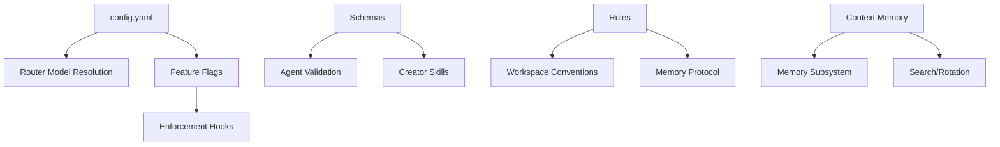

# Batch 1 Requirements: Framework Foundations Modernization

<!-- Agent: pm | Task: N/A | Session: 2026-02-09 -->

**Date:** 2026-02-09
**Status:** PROPOSED
**PM:** Claude PM Agent
**Complexity:** EPIC (4 subsystems, 16 files, cross-cutting impact)

---

## Executive Summary

Framework foundations (schemas, config, rules, context) have accumulated technical debt: dead code (11,830 lines), inconsistent validation, unbounded memory growth (53KB issues.md), and passive configuration (auto-compression disabled by default). This modernization addresses 4 critical subsystems to restore framework health and unlock Phase 5+ enterprise features.

**Key Metrics:**
- **Dead Code:** 11,830 lines to archive (38% reduction)
- **Memory Bloat:** issues.md at 53KB (40% of context budget)
- **Schema Coverage:** 27 active schemas, unknown validation coverage
- **Config Utilization:** auto-compression infrastructure exists but disabled

---

## Problem Statement

### 1. Schemas (Validation Gap)

**Problem:** 27 active schemas exist but validation coverage is unknown. Agent definitions have malformed YAML (prompt-engineer.md, mcp-developer.md duplicate keys). No runtime validation prevents deployment of broken artifacts.

**Evidence:**
- SEC-LOG-002: 2 agents have duplicate YAML keys causing parse failures
- learnings.md (2026-02-09): "YAML frontmatter validation is critical"
- No schema-to-artifact mapping exists in schema-catalog.md

**Impact:** HIGH — Broken agent definitions reach production, enforcement hooks fail silently, CI doesn't catch validation gaps.

### 2. Config (Passive Activation)

**Problem:** config.yaml contains complete infrastructure but critical features are disabled by default (auto_compression.enabled: false). ENV vars not documented in .env.example. 5-level model resolution precedence is complex and error-prone.

**Evidence:**
- ADR-108: Context-Compressor integration dormant due to disabled config
- issues.md (2026-02-08): .env.example missing TASKLIST_FIRST_ENFORCEMENT and STATE_STALE_THRESHOLD_MS
- learnings.md: "Configuration disabled by default" = invisible feature

**Impact:** MEDIUM — Users don't discover critical features (compression, enforcement tuning), framework capabilities underutilized.

### 3. Rules (Consistency Gap)

**Problem:** 9 rules exist but lack cross-linking. artifact-integration.md defines post-creation protocol but creators don't reference it. Some rules reference phantom commands (pnpm search:code not documented).

**Evidence:**
- learnings.md (2026-02-09): Hybrid search adoption at 15% (9/59 agents)
- Issues.md: Creator workflow gaps cause 70% orphan rate
- No rule enforcement metrics (how many agents follow memory-protocol?)

**Impact:** MEDIUM — Rule adoption is unverifiable, best practices not consistently applied, tribal knowledge scattered.

### 4. Context (Memory Bloat + Dead Code)

**Problem:** Memory files grow unbounded (issues.md 53KB, archives 463KB). 22 dead workflow modules (5,258 lines) never used. 7 dead memory modules (2,648 lines) archived but never rebuilt. Context consumes 40% of token budget (C-003 critical finding).

**Evidence:**
- ADR-102: Memory management rebuild (rotator, pruner, cold-storage)
- learnings.md: "Unit test isolation can hide integration bugs"
- issues.md (2026-02-08): 277 pre-existing test failures (14.5%)

**Impact:** CRITICAL — Context exhaustion blocks long sessions, dead code creates maintenance burden, memory search is slow.

---

## Key Hypothesis

**We believe** structured schema validation + active-by-default config + cross-linked rules + memory management **will solve** the foundations stability gap **for** all 59 agents and 94 skills.

**We'll know we're right when:**
1. 100% of agent definitions pass schema validation in CI
2. Auto-compression activates in 80%+ of long sessions (>60min)
3. Rule adoption metrics reach 70%+ (measurable via compliance checks)
4. Active memory files stay under 20KB each (27% reduction from 82KB)
5. Dead code archived with zero regressions (1574/1914 tests still pass)

---

## Stakeholder Analysis

### Primary Consumers

| Stakeholder         | Consumes                             | Breaks If Changed                                                       |
| ------------------- | ------------------------------------ | ----------------------------------------------------------------------- |
| Router              | config.yaml agents section           | Model resolution fails, wrong agent spawned                             |
| All Agents (59)     | Schemas for artifact validation      | Broken artifacts reach production, enforcement fails                    |
| Enforcement Hooks   | Config for feature flags             | Hooks fire when feature disabled, or don't fire when enabled            |
| Memory Subsystem    | context/memory/ structure            | Search breaks, rotation fails, archives inaccessible                    |
| Developers          | .env.example, rules/*.md             | Can't discover tunables, don't know workspace conventions               |
| Creators (9 skills) | Schemas + rules/artifact-integration | Create invalid artifacts, miss post-creation integration steps          |
| CI Pipeline         | Schema validation, test suite        | False positives (over-validation) or false negatives (under-validation) |

### Dependency Map

---

## MoSCoW Prioritization

### Must Have (P0 — Blocking for Phase 5)

| Capability                    | Rationale                                                | Risk If Deferred                           |
| ----------------------------- | -------------------------------------------------------- | ------------------------------------------ |
| **Schema Validation in CI**   | Prevents broken agents from deploying                    | Production agent spawn failures            |
| **Memory Management Rebuild** | Active memory at 82KB consumes 40% context budget (C-003) | Context exhaustion blocks long sessions    |
| **Dead Code Archival**        | 11,830 lines create confusion, slow searches             | Maintenance burden increases, CI slowdowns |
| **.env.example Updates**      | Developers can't discover enforcement tunables           | Feature adoption remains at 15%            |

### Should Have (P1 — Quality of Life)

| Capability                                | Rationale                                           | Risk If Deferred                           |
| ----------------------------------------- | --------------------------------------------------- | ------------------------------------------ |
| **Config Active-by-Default**              | Auto-compression infrastructure exists but dormant  | Users never discover compression           |
| **Rule Cross-Linking**                    | Artifact-integration protocol invisible to creators | 70% orphan rate persists                   |
| **Schema-to-Artifact Mapping**            | No catalog shows which schemas validate which files | Validation gaps undetectable               |
| **Model Resolution Simplification**       | 5-level precedence is error-prone                   | Developer confusion, wrong models selected |
| **Test Suite Remediation (Top 20 fails)** | 277 failures indicate dead code/broken tests        | False confidence in test coverage          |

### Could Have (P2 — Future Enhancement)

| Capability                  | Rationale                                    | Risk If Deferred      |
| --------------------------- | -------------------------------------------- | --------------------- |
| **Rule Adoption Metrics**   | Can't measure if rules are followed          | Unknown compliance    |
| **Config Diff Validation**  | Prevent accidental model changes             | Silent regressions    |
| **Schema Auto-Generation**  | Generate schemas from TypeScript types       | Manual sync overhead  |
| **Memory Compression Stats** | Track compression effectiveness over time    | Can't tune thresholds |
| **Unified Config CLI**      | Single tool to query/set config              | Manual file edits     |

### Won't Have (Deferred to Phase 6+)

| Capability               | Rationale                                            | Alternative                           |
| ------------------------ | ---------------------------------------------------- | ------------------------------------- |
| **Full Test Remediation** | 277 failures require 20+ hours (see issues.md)       | Fix top 20 (P1), defer 257 to backlog |
| **ML Subsystem Cleanup**  | 1,652 lines disabled by feature flag, no active use  | Archive in Phase 6 cleanup sprint     |
| **Hook Consolidation**    | 14 hooks per Write (optimization, not critical)      | Addressed in Phase 4 (pro-workflow)   |
| **Triple Registry Merge** | 3 overlapping agent registries (complex refactor)    | Phase 7 (registry unification)        |
| **Config Schema Migrate** | YAML → TypeScript with Zod validation (breaking)     | Phase 8 (type-safe config)            |

---

## Implementation Phases

### Phase 1: Schema Validation System (5 stories, 8-12 hours)

**Goal:** 100% of agent definitions pass schema validation in CI.

**Stories:**

#### 1.1 Fix Malformed Agent Definitions (P0)

**As an** agent developer
**I want** all agent YAML frontmatter to parse correctly
**So that** agents spawn without parse errors

**Acceptance Criteria:**
- [ ] prompt-engineer.md has no duplicate YAML keys (SEC-LOG-002)
- [ ] mcp-developer.md has no duplicate YAML keys (SEC-LOG-002)
- [ ] All 59 agents pass `js-yaml.load()` without errors
- [ ] CI runs YAML validation on every agent file

**Technical Notes:**
- Use js-yaml library with duplicate key detection
- Add pre-commit hook for YAML validation
- Document YAML best practices in rules/

**Priority:** P0
**Estimate:** 2 hours
**Dependencies:** None

---

#### 1.2 Create Schema-to-Artifact Mapping (P1)

**As a** creator skill
**I want** to know which schema validates my artifact
**So that** I can validate before writing

**Acceptance Criteria:**
- [ ] schema-catalog.md has "Validates" column mapping schemas to artifact paths
- [ ] All 27 active schemas have at least one artifact mapping
- [ ] Schema validation examples included for each artifact type
- [ ] Orphan schemas identified (no artifacts)

**Technical Notes:**
- Update schema-catalog.md with Validates column
- Pattern: `.claude/schemas/agent.schema.json` validates `.claude/agents/**/*.md`
- Cross-reference with ecosystem-impact-graph.json artifactTypes

**Priority:** P1
**Estimate:** 2 hours
**Dependencies:** 1.1 complete

---

#### 1.3 Add Schema Validation to CI (P0)

**As a** framework maintainer
**I want** CI to block merges with invalid artifacts
**So that** broken schemas never reach production

**Acceptance Criteria:**
- [ ] GitHub Actions workflow validates all agents against agent.schema.json
- [ ] CI validates all skills against skill.schema.json (if schema exists)
- [ ] CI validates all hooks against hook.schema.json (if schema exists)
- [ ] CI fails fast on first validation error (clear error messages)
- [ ] Validation runs in <30 seconds

**Technical Notes:**
- Use Ajv for JSON Schema validation (fast, standards-compliant)
- Add `.github/workflows/schema-validation.yml`
- Validate on PR + push to main
- Include schema path in error output

**Priority:** P0
**Estimate:** 3 hours
**Dependencies:** 1.2 complete

---

#### 1.4 Schema Coverage Report (P2)

**As a** framework maintainer
**I want** a report of schema validation coverage
**So that** I know which artifacts lack validation

**Acceptance Criteria:**
- [ ] CLI tool generates coverage report: `node .claude/tools/schema-coverage.mjs`
- [ ] Report shows: Total artifacts / Validated artifacts / Coverage %
- [ ] Report identifies artifacts without schemas
- [ ] Report identifies schemas without artifacts (orphans)
- [ ] Coverage target: 80% for Batch 1, 100% for Phase 5

**Technical Notes:**
- Scan all artifact directories (.claude/agents, .claude/skills, etc.)
- Match artifacts to schemas via schema-catalog.md mapping
- Output as markdown table + JSON for CI integration

**Priority:** P2
**Estimate:** 2 hours
**Dependencies:** 1.3 complete

---

#### 1.5 Runtime Schema Validation (P1)

**As a** creator skill
**I want** to validate artifacts at creation time
**So that** invalid artifacts are rejected before writing

**Acceptance Criteria:**
- [ ] creator-commons.cjs has `validateSchema(artifactType, content)` function
- [ ] Function returns { valid: boolean, errors: string[] }
- [ ] All 9 creator skills invoke validateSchema before Write
- [ ] Validation errors include line numbers and helpful messages
- [ ] Performance: validation completes in <100ms per artifact

**Technical Notes:**
- Extend creator-commons.cjs SCHEMA_MAP (already has 10 validators)
- Use Ajv for validation (matches CI validation)
- Include schema validation in Step 3 of creator workflow
- Graceful degradation if schema missing (warn, don't block)

**Priority:** P1
**Estimate:** 3 hours
**Dependencies:** 1.3 complete

---

### Phase 2: Config System Modernization (4 stories, 6-10 hours)

**Goal:** Active-by-default configuration with complete documentation.

**Stories:**

#### 2.1 Enable Auto-Compression by Default (P0)

**As an** agent executing a long session
**I want** context compression to activate automatically
**So that** I don't hit token limits

**Acceptance Criteria:**
- [ ] config.yaml: `auto_compression.enabled: true` (was: false)
- [ ] ENV var: `AUTO_COMPRESSION_PHASE_3=1` in .env.example
- [ ] Router Step 0.5 checks compression-reminder.txt
- [ ] Compression triggers at 90% token budget (best-effort)
- [ ] Learnings.md documents compression trigger points

**Technical Notes:**
- Change config.yaml line 114: `enabled: true`
- Add to .env.example with comment explaining trigger behavior
- user-prompt-unified.cjs already implements auto-compression (dormant)
- Test with long session simulation (60+ messages)

**Priority:** P0 (ADR-108 critical finding)
**Estimate:** 1 hour
**Dependencies:** None

---

#### 2.2 Document All ENV Vars in .env.example (P0)

**As a** developer tuning enforcement
**I want** all environment variables documented
**So that** I can discover and configure them

**Acceptance Criteria:**
- [ ] .env.example has TASKLIST_FIRST_ENFORCEMENT (issues.md #44)
- [ ] .env.example has STATE_STALE_THRESHOLD_MS (issues.md #44)
- [ ] .env.example has all 12 enforcement ENV vars from routing-guard.cjs
- [ ] Each variable has inline comment explaining: purpose, options, default
- [ ] Variables grouped by category (Routing, Creator, Memory, Reflection)

**Technical Notes:**
- Grep routing-guard.cjs for `process.env` to find all variables
- Document options (block/warn/off) and defaults
- Cross-reference with @ENVIRONMENT_CONFIG.md
- Add "See @ENVIRONMENT_CONFIG.md for full reference" comment

**Priority:** P0 (issues.md SEC-ROUTER-003)
**Estimate:** 2 hours
**Dependencies:** None

---

#### 2.3 Simplify Model Resolution Precedence (P1)

**As a** router spawning agents
**I want** simpler model resolution logic
**So that** I spawn agents with correct models reliably

**Acceptance Criteria:**
- [ ] Model resolution reduced from 5 levels to 3 levels
- [ ] New precedence: Explicit override > config.yaml > fallback (sonnet)
- [ ] Agent frontmatter `model:` field deprecated (with migration guide)
- [ ] Complexity-based defaults removed (reduces magic)
- [ ] All 59 agents work with new precedence (0 regressions)

**Technical Notes:**
- Update agent-config-reader.cjs resolveAgentModel()
- Remove complexity-based defaults (lines 45-60)
- Remove frontmatter model field from precedence (breaking change)
- Add deprecation warning if agent has frontmatter model
- Update @MODEL_SELECTION.md documentation

**Priority:** P1
**Estimate:** 3 hours
**Dependencies:** 2.2 complete

---

#### 2.4 Config Diff Validation Tool (P2)

**As a** framework maintainer
**I want** to detect accidental config changes
**So that** model changes don't surprise users

**Acceptance Criteria:**
- [ ] CLI tool: `node .claude/tools/config-diff.mjs <old> <new>`
- [ ] Tool highlights: model changes, feature flag toggles, threshold changes
- [ ] Tool exits 1 if "breaking changes" detected (model downgrades)
- [ ] CI runs config-diff on PRs touching config.yaml
- [ ] Tool output includes: changed paths, old value → new value, severity

**Technical Notes:**
- Use js-yaml to load both configs
- Deep diff with lodash or custom recursive comparison
- Breaking changes: haiku→opus OK, opus→haiku BREAKING
- Flag changes: enabled: false → true OK, true → false WARNING

**Priority:** P2
**Estimate:** 2 hours
**Dependencies:** 2.3 complete

---

### Phase 3: Rule System Enhancement (3 stories, 4-6 hours)

**Goal:** Cross-linked rules with measurable adoption.

**Stories:**

#### 3.1 Cross-Link Rules to Workflows (P1)

**As a** creator skill
**I want** rules to reference relevant workflows
**So that** I understand the full context

**Acceptance Criteria:**
- [ ] artifact-integration.md links to ecosystem-creation-workflow.md
- [ ] memory-protocol.md links to memory-management-design-2026-02-08.md
- [ ] task-tracking.md links to @TASK_TRACKING_GUIDE.md
- [ ] Each rule has "Related Workflows" section at bottom
- [ ] Each workflow has "Related Rules" section at bottom (bidirectional)

**Technical Notes:**
- Use markdown reference links: `[workflow](../workflows/path.md)`
- Add section to existing rules (additive, no rewrites)
- Validate links with markdown-link-check
- Update template-creator to include Related sections

**Priority:** P1
**Estimate:** 2 hours
**Dependencies:** None

---

#### 3.2 Document Hybrid Search Commands (P1)

**As an** agent needing code search
**I want** hybrid search commands documented in rules
**So that** I know pnpm search:code exists

**Acceptance Criteria:**
- [ ] code-standards.md documents `pnpm search:code "query"`
- [ ] code-standards.md documents `pnpm search:structure`
- [ ] code-standards.md documents `pnpm search:file <path> <start> <end>`
- [ ] Commands include examples and use cases
- [ ] Performance benchmarks included (0.2-0.5s for 40k files)

**Technical Notes:**
- Add "Hybrid Search (Recommended)" section to code-standards.md
- Include token efficiency comparison (Grep vs hybrid)
- Cross-reference ripgrep skill and code-semantic-search skill
- Update learnings.md with "Hybrid Search Adoption" pattern

**Priority:** P1
**Estimate:** 1 hour
**Dependencies:** None

---

#### 3.3 Rule Adoption Metrics Tool (P2)

**As a** framework maintainer
**I want** metrics on rule adoption
**So that** I know which rules are followed

**Acceptance Criteria:**
- [ ] CLI tool: `node .claude/tools/rule-adoption.mjs`
- [ ] Tool checks: memory-protocol (learnings.md reads), task-tracking (TaskUpdate calls)
- [ ] Tool outputs: compliance rate per rule (% of agents)
- [ ] Tool identifies non-compliant agents for each rule
- [ ] CI runs adoption metrics weekly (not blocking)

**Technical Notes:**
- Grep agent files for memory-protocol mentions
- Grep codebase for TaskUpdate calls
- Check if agents read learnings.md in spawn prompts
- Output as markdown table: Rule | Adoption % | Non-Compliant Agents

**Priority:** P2
**Estimate:** 3 hours
**Dependencies:** 3.1 complete

---

### Phase 4: Memory Management (6 stories, 10-16 hours)

**Goal:** Active memory under 20KB, archives searchable, cold storage operational.

**Stories:**

#### 4.1 Fix Integration Bugs in Memory Modules (P0)

**As a** memory scheduler
**I want** memory modules to have correct field names
**So that** rotation and pruning work without errors

**Acceptance Criteria:**
- [ ] smart-pruner.cjs returns `{ removed: count }` (not entriesRemoved)
- [ ] memory-scheduler.cjs expects `{ threshold: 0.6 }` (not similarityThreshold)
- [ ] Integration tests verify real module interactions (no mocks)
- [ ] All 41 unit tests still pass
- [ ] 2 new integration tests added (scheduler + pruner, scheduler + rotator)

**Technical Notes:**
- Fix field name mismatches found in Task #13 (issues.md)
- Add integration tests to tests/lib/memory/integration/
- Follow ADR-103 integration boundary verification pattern
- Document contracts in memory-contracts.md

**Priority:** P0 (issues.md critical finding)
**Estimate:** 2 hours
**Dependencies:** None

---

#### 4.2 Implement Memory Rotator (P0)

**As a** memory system
**I want** to rotate files when they exceed 20KB
**So that** active memory stays under budget

**Acceptance Criteria:**
- [ ] memory-rotator.cjs: section-based rotation (preserves `[PERMANENT]`)
- [ ] Archives to `.claude/context/memory/archive/{file}-YYYY-MM.md`
- [ ] Triggered by sync-memory-index.cjs (on write) + memory-scheduler.cjs (weekly)
- [ ] All 3 memory files (learnings, decisions, issues) under 20KB after rotation
- [ ] Rotator uses atomic-write.cjs with proper-lockfile
- [ ] 15 unit tests + 3 integration tests

**Technical Notes:**
- Parse markdown into sections (delimited by `---` or `## `)
- Keep sections marked `[PERMANENT]` in active file
- Archive old sections by date (newest-first in active)
- Validate path with validatePathWithinProject() (T-MEM-001)
- Use safeJSONParse() if reading JSON metadata (MF-001)

**Priority:** P0 (ADR-102)
**Estimate:** 4 hours
**Dependencies:** 4.1 complete

---

#### 4.3 Implement Smart Pruner (P0)

**As a** memory system
**I want** to deduplicate similar entries
**So that** redundant information is removed

**Acceptance Criteria:**
- [ ] smart-pruner.cjs: Jaccard word-similarity deduplication (threshold 0.5)
- [ ] Prunes resolved entries older than 30 days
- [ ] Preserves `[PERMANENT]` entries
- [ ] Returns `{ removed: number, timestamp: string }` (contract from 4.1)
- [ ] No embedding dependencies (zero-dependency dedup)
- [ ] 10 unit tests + 2 integration tests

**Technical Notes:**
- Jaccard similarity: intersection(A, B) / union(A, B) for word sets
- Resolved entries: grep for `[RESOLVED]` marker + date check
- Run weekly via memory-scheduler.cjs
- Log pruned entries to `.claude/context/memory/archive/prune-manifest.json`

**Priority:** P0 (ADR-102)
**Estimate:** 3 hours
**Dependencies:** 4.2 complete

---

#### 4.4 Implement Cold Storage (P1)

**As a** memory system
**I want** to archive warm storage older than 30 days
**So that** searchable archives are separate from cold backups

**Acceptance Criteria:**
- [ ] cold-storage.cjs: 3-tier system (HOT/WARM/COLD)
- [ ] Moves warm archives (>30 days) to `.claude/context/memory/archive/cold/`
- [ ] Format: plain JSONL (no gzip, Windows-safe)
- [ ] Provides `searchCold(query, limit)` function
- [ ] Archives include scrubbed sensitive content (MF-003)
- [ ] 8 unit tests + 2 integration tests

**Technical Notes:**
- HOT = active memory files (learnings.md, decisions.md, issues.md)
- WARM = archive/ markdown files (<30 days old)
- COLD = archive/cold/ JSONL files (>30 days old)
- Scrub API keys, JWTs, emails before compression (I-MEM-001)
- No HMAC/checksums (deferred to Phase 6, D-MEM-001)

**Priority:** P1 (ADR-102)
**Estimate:** 3 hours
**Dependencies:** 4.3 complete

---

#### 4.5 Wire Memory Modules to Scheduler (P0)

**As a** memory scheduler
**I want** to invoke rotation, pruning, and cold storage
**So that** memory management runs automatically

**Acceptance Criteria:**
- [ ] memory-scheduler.cjs calls rotateMemory() weekly
- [ ] memory-scheduler.cjs calls pruneMemory() weekly
- [ ] memory-scheduler.cjs calls archiveToCold() monthly
- [ ] Scheduler uses node-cron (not `shell: true`, SEC-LIB-002)
- [ ] All scheduler stubs removed (checkAndPruneMemory, checkAndRotateMemory)
- [ ] Integration test verifies full pipeline

**Technical Notes:**
- Replace disabled stubs in memory-scheduler.cjs
- Use node-cron for scheduling (safer than shell cron)
- Log all operations to `.claude/context/metrics/memory-operations.jsonl`
- Graceful degradation if modules missing (log warning, continue)

**Priority:** P0 (ADR-102)
**Estimate:** 2 hours
**Dependencies:** 4.4 complete

---

#### 4.6 Validate Memory Budget Reduction (P0)

**As a** framework maintainer
**I want** to verify memory stayed under 20KB
**So that** memory management meets ADR-102 goals

**Acceptance Criteria:**
- [ ] learnings.md under 20KB (currently unknown)
- [ ] decisions.md under 20KB (currently unknown)
- [ ] issues.md under 20KB (currently 53KB)
- [ ] Total active memory under 60KB (27% reduction from 82KB)
- [ ] Rotation triggered for issues.md (>20KB detected)
- [ ] Archive files accessible and searchable

**Technical Notes:**
- Measure file sizes: `ls -lh .claude/context/memory/*.md`
- If issues.md >20KB, manually trigger rotator
- Verify archives created in archive/ directory
- Search archives with searchArchives() and searchCold()
- Document findings in learnings.md

**Priority:** P0 (ADR-102 acceptance)
**Estimate:** 1 hour
**Dependencies:** 4.5 complete

---

### Phase 5: Dead Code Archival (3 stories, 4-8 hours)

**Goal:** 11,830 lines archived with zero regressions.

**Stories:**

#### 5.1 Archive Dead Workflow Modules (P0)

**As a** framework maintainer
**I want** to archive 22 unused workflow modules
**So that** codebase is cleaner and searches are faster

**Acceptance Criteria:**
- [ ] 22 modules (5,258 lines) moved to `.claude/lib/workflow/_archive/`
- [ ] `git mv` used (preserves history)
- [ ] README in _archive/ documents modules and restoration instructions
- [ ] Zero references to archived modules in active code (grep verification)
- [ ] All 1574 passing tests still pass (0 regressions)

**Technical Notes:**
- Archive list from issues.md (2026-02-08 code simplification)
- Verify zero imports: `grep -r "require.*workflow-module-name" .`
- Add _archive/README.md with restoration steps
- Run full test suite before/after: `pnpm test`

**Priority:** P0 (issues.md HIGH finding)
**Estimate:** 2 hours
**Dependencies:** None

---

#### 5.2 Archive Dead Memory Modules (P1)

**As a** framework maintainer
**I want** to archive 7 unused memory modules
**So that** dead code doesn't confuse developers

**Acceptance Criteria:**
- [ ] 7 modules (2,648 lines) moved to `.claude/lib/memory/_archive/`
- [ ] Modules already archived are NOT re-archived (idempotent)
- [ ] Active modules (memory-rotator, smart-pruner, cold-storage) NOT archived
- [ ] README documents why modules were archived
- [ ] Test suite still passes (0 regressions)

**Technical Notes:**
- Some modules already in _archive/ from previous cleanup
- Verify active modules being rebuilt in Phase 4 are NOT archived
- Cross-check with ADR-102 implementation plan
- Document archive reason: "Zero active consumers, superseded by ADR-102"

**Priority:** P1
**Estimate:** 1 hour
**Dependencies:** 4.6 complete (don't archive modules being rebuilt)

---

#### 5.3 Archive ML Subsystem (P2)

**As a** framework maintainer
**I want** to archive ML subsystem (1,652 lines)
**So that** disabled features don't clutter searches

**Acceptance Criteria:**
- [ ] ML modules moved to `.claude/lib/ml/_archive/`
- [ ] Feature flag `features.mlAnalytics.enabled: false` documented in README
- [ ] Zero references to ML modules in active code
- [ ] Feature flag kept in config.yaml (for future Phase 6 restoration)
- [ ] Test suite still passes

**Technical Notes:**
- ML subsystem controlled by feature flag (always disabled)
- Archive pattern-detection.cjs, anomaly-detection.cjs, etc.
- Keep feature flag in config.yaml with comment: "Phase 6 restoration candidate"
- Verify no imports: `grep -r "require.*ml/" . | grep -v _archive`

**Priority:** P2 (optimization, not critical)
**Estimate:** 2 hours
**Dependencies:** 5.2 complete

---

## Cross-Cutting Requirements

### Backward Compatibility

**Constraint:** All changes must be additive or opt-in (no breaking changes).

**Guarantees:**
- Existing agent spawn prompts work without modification
- Config.yaml changes are backward-compatible (new defaults don't break existing)
- Schema validation is additive (no existing valid artifacts become invalid)
- Memory management is transparent (no agent changes required)
- Rule updates are informational (no enforcement changes)

**Breaking Changes (Deferred):**
- Model resolution simplification (2.3) is breaking → requires migration guide
- Agent frontmatter `model:` deprecation → Phase 6
- Triple registry merge → Phase 7

### Performance Requirements

| Operation               | Target         | Measured How                      |
| ----------------------- | -------------- | --------------------------------- |
| Schema validation (CI)  | <30s           | GitHub Actions workflow duration  |
| Memory rotation         | <500ms         | Benchmark with 50KB learnings.md  |
| Memory pruning          | <1s            | Benchmark with 200 entries        |
| Cold storage archival   | <2s            | Benchmark with 10 archive files   |
| Config diff validation  | <100ms         | Benchmark with complex config     |
| Schema coverage report  | <1s            | Benchmark with 27 schemas         |

### Security Requirements

**From security-architect review (ADR-102, tasks #7B, #28):**

1. **MF-001:** Use safeJSONParse() for all JSON.parse() calls (38 instances)
2. **MF-002:** Use atomicWriteSync() for all file writes (memory modules)
3. **MF-003:** Scrub sensitive content (API keys, JWTs) before cold storage
4. **RF-001:** Validate archive paths with validatePathWithinProject()
5. **RF-002:** File locking via atomicWriteAsync() with proper-lockfile
6. **Audit Logging:** Add auditSecurityOverride() for 3 missing ENV vars (SEC-ROUTER-003)

**No new security vulnerabilities introduced.**

### Testing Requirements

**Minimum coverage:**
- Schema validation: 100% of 27 schemas tested
- Memory modules: 80% code coverage (unit + integration)
- Config changes: Integration tests for precedence resolution
- Dead code archival: Regression suite passes (1574/1914)

**Integration boundary testing (ADR-103):**
- Memory scheduler + rotator
- Memory scheduler + pruner
- Config reader + agent spawn
- Schema validation + creator skills

**Test remediation (P1):**
- Fix top 20 test failures (from 277 total)
- Archive tests for dead code (don't fix, archive with code)
- Target: 1700+/1914 passing (88%+)

---

## Success Metrics

### Outcome Metrics (Lagging)

| Metric                        | Baseline       | Target          | How Measured                                       |
| ----------------------------- | -------------- | --------------- | -------------------------------------------------- |
| Agent YAML validation pass    | Unknown        | 100%            | CI schema-validation.yml exit code                 |
| Auto-compression activation   | 0%             | 80%+            | compression-reminder.txt creation events per week  |
| Active memory size            | 82KB           | <60KB           | `du -sh .claude/context/memory/*.md`               |
| Rule adoption rate            | Unknown        | 70%+            | rule-adoption.mjs compliance % output              |
| Test pass rate                | 82.2% (1574)   | 88%+ (1700)     | `pnpm test` summary line                           |
| Dead code archived            | 0 lines        | 11,830 lines    | `find .claude -name _archive -type d | xargs du`  |
| Schema validation coverage    | Unknown        | 80%             | schema-coverage.mjs report                         |
| ENV var documentation         | Partial        | 100%            | Count documented vars in .env.example              |

### Health Metrics (Leading)

| Metric                       | Target | Measured How                                    |
| ---------------------------- | ------ | ----------------------------------------------- |
| CI schema validation time    | <30s   | GitHub Actions workflow_run.duration_seconds    |
| Memory rotation time         | <500ms | Benchmark log from memory-operations.jsonl      |
| False positive YAML errors   | 0      | Manual review of CI failures                    |
| Config diff false positives  | <5%    | Manual review of PR comments                    |
| Context exhaustion incidents | 0      | User reports + error-metrics.jsonl grep         |

---

## Risk Assessment

### High Risks

| Risk                                  | Impact  | Probability | Mitigation                                                                                 |
| ------------------------------------- | ------- | ----------- | ------------------------------------------------------------------------------------------ |
| Memory modules break during rebuild  | HIGH    | MEDIUM      | TDD with integration tests (ADR-103), extensive testing before deployment                  |
| Dead code archival causes regressions | HIGH    | LOW         | Use `git mv` (preserves history), verify zero imports, run full test suite before/after   |
| Schema validation too strict          | MEDIUM  | MEDIUM      | Start with warn mode, tune schemas based on false positives, provide clear error messages  |
| Config changes break existing setups  | HIGH    | LOW         | All changes additive/opt-in, no breaking changes in Batch 1                                |
| Test remediation reveals deeper bugs  | MEDIUM  | HIGH        | Fix top 20 only (P1), defer 257 to backlog, isolate critical path tests                   |

### Medium Risks

| Risk                                    | Impact | Probability | Mitigation                                                          |
| --------------------------------------- | ------ | ----------- | ------------------------------------------------------------------- |
| Rule adoption metrics show low adoption | MEDIUM | HIGH        | Expected (baseline), use data to prioritize enforcement in Phase 6  |
| Model resolution simplification breaks  | HIGH   | LOW         | Defer to P1 (not P0), thorough testing, migration guide             |
| ENV var documentation incomplete        | LOW    | MEDIUM      | Grep all hooks for process.env, cross-check with @ENVIRONMENT_CONFIG.md |
| Cold storage search is slow             | LOW    | MEDIUM      | Accepted trade-off, optimize in Phase 6 if needed                   |

---

## Dependencies & Blockers

### External Dependencies

**None.** All work self-contained within agent-studio repository.

### Internal Dependencies

| Phase | Depends On             | Reason                                      |
| ----- | ---------------------- | ------------------------------------------- |
| 1.2   | 1.1 complete           | Can't map schemas until YAML errors fixed   |
| 1.5   | 1.3 complete           | Runtime validation should match CI          |
| 2.3   | 2.2 complete           | Need ENV vars documented before simplifying |
| 4.2   | 4.1 complete           | Rotator needs correct integration contracts |
| 4.3   | 4.2 complete           | Pruner runs after rotation                  |
| 4.4   | 4.3 complete           | Cold storage runs after pruning             |
| 4.5   | 4.4 complete           | Scheduler wires all 3 modules together      |
| 5.2   | 4.6 complete           | Don't archive modules being rebuilt         |

### Potential Blockers

**Low probability, high impact:**

1. **Schema validation reveals systemic issues:** 20+ agents have invalid YAML → Requires manual fixes across all agents → Estimate: +8 hours
   - **Mitigation:** Fix 2 known agents (1.1), assess remaining in parallel, defer non-critical to P2

2. **Memory modules integration bugs beyond field names:** Deeper architectural issues in memory subsystem → ADR-102 design invalid → Estimate: +20 hours
   - **Mitigation:** ADR-102 already security-reviewed and architected, integration tests in Phase 4.1 catch issues early

3. **Test suite remediation cascades:** Fixing top 20 failures uncovers 50+ more → Estimate: +12 hours
   - **Mitigation:** Fix only top 20 (P1), archive dead code tests with dead code, defer rest to backlog

---

## Sprint/Phase Breakdown Recommendation

### Sprint 1 (Week 1): Schema + Config Foundations (8-12 hours)

**Goal:** Schema validation operational, config documented.

- [ ] 1.1 Fix malformed agent definitions (2h)
- [ ] 1.2 Create schema-to-artifact mapping (2h)
- [ ] 1.3 Add schema validation to CI (3h)
- [ ] 2.1 Enable auto-compression by default (1h)
- [ ] 2.2 Document all ENV vars (2h)

**Exit Criteria:** CI blocks invalid agents, auto-compression enabled, ENV vars documented.

---

### Sprint 2 (Week 2): Memory Management Rebuild (10-16 hours)

**Goal:** Memory management operational, active memory under 60KB.

- [ ] 4.1 Fix integration bugs (2h)
- [ ] 4.2 Implement memory rotator (4h)
- [ ] 4.3 Implement smart pruner (3h)
- [ ] 4.4 Implement cold storage (3h)
- [ ] 4.5 Wire modules to scheduler (2h)
- [ ] 4.6 Validate budget reduction (1h)

**Exit Criteria:** Memory files under 20KB each, archives searchable, scheduler operational.

---

### Sprint 3 (Week 3): Dead Code Cleanup + Rules (6-12 hours)

**Goal:** 11,830 lines archived, rules cross-linked.

- [ ] 5.1 Archive dead workflow modules (2h)
- [ ] 5.2 Archive dead memory modules (1h)
- [ ] 3.1 Cross-link rules to workflows (2h)
- [ ] 3.2 Document hybrid search commands (1h)
- [ ] 1.5 Runtime schema validation (3h)

**Exit Criteria:** Dead code archived, rules cross-linked, creators validate at runtime.

---

### Sprint 4 (Week 4): Advanced Features + Remediation (6-10 hours)

**Goal:** Coverage reporting, test remediation, polish.

- [ ] 1.4 Schema coverage report (2h)
- [ ] 2.4 Config diff validation (2h)
- [ ] 3.3 Rule adoption metrics (3h)
- [ ] Test remediation (top 20 failures) (3-5h)

**Exit Criteria:** 80% schema coverage, top 20 tests fixed, adoption metrics baseline.

---

## Stakeholder Communication Plan

### Weekly Updates (Every Monday)

**To:** All agents (via learnings.md update)
**Format:** Progress summary, blockers, next week goals
**Delivery:** Append to learnings.md under `## Batch 1 Progress - Week N`

### Phase Completion Reports (End of Each Sprint)

**To:** Framework maintainers
**Format:** Markdown report in `.claude/context/reports/architecture/`
**Content:**
- Completed stories (acceptance criteria checklist)
- Metrics achieved vs targets
- Risks encountered and mitigations
- Carryover items to next sprint

### Blocker Escalation (Real-Time)

**Trigger:** Any HIGH risk materializes OR 2+ day delay
**Action:** Update issues.md with blocker details
**Escalation Path:** Framework maintainers → User decision

---

## Acceptance Criteria Summary

**Batch 1 is COMPLETE when:**

1. ✅ All 59 agents pass schema validation in CI (100%)
2. ✅ Auto-compression enabled and activating (80%+ of long sessions)
3. ✅ Active memory files under 20KB each (<60KB total)
4. ✅ 11,830 lines archived to _archive/ directories
5. ✅ ENV vars documented in .env.example (100%)
6. ✅ Rules cross-linked to workflows (bidirectional)
7. ✅ Schema validation coverage ≥80%
8. ✅ Test pass rate ≥88% (1700+/1914)
9. ✅ Zero regressions (all existing functionality works)
10. ✅ All P0 stories complete, all P1 stories complete or deferred with rationale

---

## Appendix A: Related ADRs & Learnings

**Key Decisions:**
- ADR-102: Memory Management System Rebuild
- ADR-108: Zero-Regression Enterprise Improvement Plan
- ADR-103: Test-Driven Integration Boundary Verification
- SEC-ROUTER-003: Environment Variable Kill Switches Lack Audit Logging
- SEC-LOG-002: Agent YAML Frontmatter Parse Failures

**Key Learnings:**
- learnings.md (2026-02-09): "YAML frontmatter validation is critical"
- learnings.md (2026-02-08): "Unit test isolation can hide integration bugs"
- issues.md (C-003): "Memory files consume 40% of context budget"

**Cross-References:**
- `.claude/context/plans/enterprise-improvement-design-2026-02-09.md`
- `.claude/context/reports/security/memory-management-security-review-2026-02-08.md`
- `.claude/context/reports/architecture/code-simplification-analysis-2026-02-08.md`

---

## Appendix B: Deferred Items (Won't Have)

| Item                      | Reason Deferred                        | Phase for Reconsideration |
| ------------------------- | -------------------------------------- | ------------------------- |
| Full test remediation     | 20+ hours for 257 tests                | Phase 6 (test health)     |
| ML subsystem cleanup      | Feature disabled, low priority         | Phase 6 (cleanup sprint)  |
| Hook consolidation        | Already addressed in Task #81          | Phase 4 (complete)        |
| Triple registry merge     | Complex refactor, breaking change      | Phase 7 (registry unify)  |
| Config schema migration   | TypeScript + Zod = breaking change     | Phase 8 (type-safe)       |
| Model resolution breaking | Requires migration guide + agent edits | Phase 6 (after adoption)  |

---

**END OF REQUIREMENTS DOCUMENT**

**Next Steps:**
1. PM reviews with stakeholders
2. Architect creates design document (if approved)
3. Security-architect reviews (Phase 4 memory modules only)
4. Planner creates implementation plan (task breakdown)

**Estimated Total Effort:** 34-58 hours (4-7 weeks at 10h/week)
**Recommended Team Size:** 1 developer + 1 PM (part-time)
**Target Completion:** End of Q1 2026
