<!-- Agent: architect | Task: #106 | Session: 2026-02-07 -->

# Config System Deep Dive: Architecture Plan

**Pipeline:** Enterprise Pipeline #10
**Date:** 2026-02-07
**Status:** Architecture Complete
**Author:** Architect Agent (Opus 4.6)

---

## Executive Summary

The agent-studio configuration system spans **17 files** across **4 locations** (`.claude/config/`, `.claude/context/config/`, `.claude/config.yaml`, `.env`). After comprehensive audit:

- **10 of 13** `.claude/config/` files are actively wired to runtime code
- **3 files are DEAD** (zero active consumers): `command-allowlist.yaml`, `contexts/claude-code.yml`, `modes/planning.yml`+`modes/editing.yml`
- **4 files have STALE values** that contradict other config sources
- **2 config duplication** problems exist (agent-config.json vs config.yaml, phase-models.json vs config.yaml)
- **1 CRITICAL gap**: `command-allowlist.yaml` header claims a validator and library consume it, but neither does

The recommended action is: **UPDATE 4, ARCHIVE 3, MERGE 1, KEEP 9, CREATE 0**.

---

## Phase 1: Full Inventory

### 1A. `.claude/config/` (13 files)

| # | File | Size | Format | Purpose |
|---|------|------|--------|---------|
| 1 | `agent-config.json` | 22KB | JSON | Agent type definitions: tools, models, phases, thinking budgets. 49 agents. |
| 2 | `capability-routing.json` | 3.5KB | JSON | Request-to-capability keyword mapping + default agent per capability + domain fallbacks |
| 3 | `code-index-config.json` | 2.9KB | JSON | Code indexing settings: file patterns, chunking, embedding, BM25, vector store |
| 4 | `command-allowlist.yaml` | 2.8KB | YAML | Shell command allowlist/blocklist for background Bash execution |
| 5 | `contexts/claude-code.yml` | 240B | YAML | Claude Code context definition (prompt, excluded tools) |
| 6 | `intent-feedback.json` | 42B | JSON | Intent classification feedback loop (empty entries array) |
| 7 | `modes/editing.yml` | 160B | YAML | Editing mode definition (full implementation capability) |
| 8 | `modes/planning.yml` | 210B | YAML | Planning mode definition (read-only, excludes Write/Edit/Bash) |
| 9 | `phase-models.json` | 290B | JSON | Phase-to-model and phase-to-thinking-level mapping |
| 10 | `presets.json` | 1.2KB | JSON | Named presets mapping agent + enabled skills |
| 11 | `routing-prototypes.json` | 415KB | JSON | Pre-computed embedding vectors for semantic routing (12 agent types) |
| 12 | `skill-index.json` | ~200KB | JSON | Comprehensive skill metadata index (199 skills, 22 domains) |
| 13 | `tool-manifest.json` | 25KB | JSON | Tool availability, toolsets, agent-tool validation rules |

### 1B. `.claude/context/config/` (4 files)

| # | File | Size | Format | Purpose |
|---|------|------|--------|---------|
| 14 | `agent-skill-matrix.json` | ~8KB | JSON | Agent-to-skill mapping (primary, secondary, contextual, always) |
| 15 | `reflection-rubrics.json` | ~4KB | JSON | Quality scoring rubrics for reflection-agent output evaluation |
| 16 | `rule-index.json` | 3.4KB | JSON | Rule file registry: paths, descriptions, sizes, technology map (10 rules) |
| 17 | `rule-index-cache.json` | ~1KB | JSON | File modification timestamps for incremental rule re-indexing |

### 1C. Root-Level Config (3 files)

| # | File | Format | Purpose |
|---|------|--------|---------|
| 18 | `.claude/config.yaml` | YAML | Unified config: router, agents (model+path), features, evolution, monitoring, memory, token budgets |
| 19 | `.env.example` | Dotenv | 115+ environment variables across 24 sections: enforcement modes, memory, ML, worker, search |
| 20 | `.env` | Dotenv | Active local environment overrides (gitignored) |

---

## Phase 2: Wiring Audit

### File-by-File Consumer Analysis

#### 1. `agent-config.json` -- WIRED (Active)
**Loaded by:**
- `.claude/lib/agents/agent-config.cjs` -- primary consumer (reads tools, model, thinking budgets)
- `.claude/hooks/routing/spawn-prompt-assembler.cjs` -- reads agent tools for AVAILABLE_TOOLS injection
- `.claude/lib/spawn/prompt-assembler.cjs` -- reads agent tools for prompt construction
**Referenced by:**
- `.claude/skills/agent-creator/SKILL.md` -- agent creation workflow updates this file
- `.claude/docs/ARCHITECTURE.md` -- documentation
- CLAUDE.md Section 5 -- model resolution documentation
**Verdict:** KEEP -- actively consumed by critical runtime path

#### 2. `capability-routing.json` -- WIRED (Active)
**Loaded by:**
- `.claude/lib/routing/intent-classifier.cjs` -- reads capabilityMap for keyword-to-capability classification
- `.claude/lib/routing/agent-registry-resolver.cjs` -- reads defaultAgents and domainFallbacks
- `.claude/scripts/validate-routing-consistency.cjs` -- validation script
- `.claude/scripts/quick-status.cjs` -- status dashboard
**Referenced by:**
- `.claude/agents/core/router.md` -- router references it
- `.claude/agents/orchestrators/master-orchestrator.md` -- orchestrator references it
- `.claude/skills/agent-creator/SKILL.md` -- creator updates it
**Verdict:** KEEP -- actively consumed by routing pipeline

#### 3. `code-index-config.json` -- WIRED (Active)
**Loaded by:**
- `.claude/tools/cli/index-codebase.cjs` -- primary consumer for indexing settings
**Referenced by:**
- `.claude/docs/CODE_INDEXING_DESIGN.md` -- architecture documentation
- `.claude/context/artifacts/diagrams/code-indexing-architecture.md` -- diagram reference
**Verdict:** KEEP -- consumed by code indexing pipeline

#### 4. `command-allowlist.yaml` -- DEAD
**Loaded by:**
- NOTHING (zero active consumers)
**Header claims:**
- "Validator: `.claude/hooks/safety/command-allowlist-validator.cjs`" -- **ARCHIVED** (in `hooks/_archive/safety/`)
- "Library: `.claude/lib/safety/command-allowlist.cjs`" -- **EXISTS but does NOT read the YAML file** (hardcodes the same data)
**Analysis:** The YAML file is a data-only artifact. The library (`command-allowlist.cjs`) hardcodes identical allowlist data as JavaScript objects. The hook validator was archived during hook consolidation. No active code reads this YAML file.
**Verdict:** ARCHIVE -- dead config, library hardcodes equivalent data

#### 5. `contexts/claude-code.yml` -- DEAD (Likely)
**Loaded by:**
- NOTHING in the agent-studio codebase (zero grep matches for `claude-code.yml`, `config/contexts`, or `config/modes`)
**Analysis:** This appears to be a Claude Code native feature directory (`contexts/` and `modes/` under `.claude/config/`). However, no Claude Code documentation confirms these directories are auto-loaded. The `settings.json` has no reference to them. The `.env.example` references `AGENT_STUDIO_CONTEXT` and `AGENT_STUDIO_MODES=editing` environment variables, suggesting an intended feature that may or may not be consumed by Claude Code itself (external to this codebase).
**Verdict:** INVESTIGATE then ARCHIVE if confirmed dead -- appears to be speculative scaffolding for a Claude Code feature that was never activated

#### 6. `intent-feedback.json` -- WIRED (Active, empty)
**Loaded by:**
- `.claude/lib/routing/intent-classifier.cjs` -- reads feedback entries for intent classification correction
**Analysis:** Structurally wired but functionally empty (`"entries": []`). The intent-classifier reads it but gets no data. This is designed for future learning from routing corrections.
**Verdict:** KEEP -- wired infrastructure for intent learning, empty by design

#### 7-8. `modes/editing.yml` + `modes/planning.yml` -- DEAD (Same as #5)
**Loaded by:**
- NOTHING in the agent-studio codebase
**Analysis:** Same situation as `contexts/claude-code.yml`. May be a Claude Code platform feature. No codebase consumer found.
**Verdict:** INVESTIGATE then ARCHIVE if confirmed dead

#### 9. `phase-models.json` -- WIRED (Active, stale values)
**Loaded by:**
- `.claude/lib/config/phase-config.cjs` -- reads phaseModels and phaseThinking for model/thinking resolution per workflow phase
**Issue:** All 4 phases map to "sonnet" model, but `config.yaml` and `agent-config.json` map planner/qa/architect to opus. This creates a contradiction: phase-based model resolution yields sonnet while agent-type-based resolution yields opus. The phase-config is a LOWER priority path (used by enterprise workflow phases), but its values are misleading.
**Verdict:** UPDATE -- values should match config.yaml agent models

#### 10. `presets.json` -- WIRED (Active)
**Loaded by:**
- `.claude/hooks/routing/spawn-prompt-assembler.cjs` -- reads presets for skill injection into spawn prompts
- `.claude/lib/spawn/prompt-assembler.cjs` -- reads presets for prompt construction
**Referenced by:**
- `.claude/docs/GETTING_STARTED.md` -- user documentation
**Analysis:** Actively consumed by spawn prompt pipeline. Preset system is wired through env var -> router-state.json -> user-prompt-unified -> spawn-prompt-assembler.
**Verdict:** KEEP -- actively consumed

#### 11. `routing-prototypes.json` -- WIRED (Active)
**Loaded by:**
- `.claude/lib/routing/semantic-router.cjs` -- primary consumer (loads pre-computed embeddings for cosine similarity routing)
- `.claude/scripts/ensure-routing-prototypes.cjs` -- regeneration if missing
- `.claude/scripts/quick-status.cjs` -- status check
**Generated by:**
- `.claude/tools/cli/generate-routing-prototypes.cjs` -- generates vectors from agent descriptions
**Analysis:** 415KB file containing 384-dim embedding vectors for 12+ agent types. Used for semantic routing (nearest-neighbor matching of user prompts to agent types). Large but functional.
**Verdict:** KEEP -- actively consumed by semantic routing

#### 12. `skill-index.json` -- WIRED (Active)
**Loaded by:**
- `.claude/lib/tools/skill-catalog.cjs` -- reads skill metadata for skill discovery
- `.claude/lib/tools/agent-registry-generator.cjs` -- reads skill assignments for agent registry generation
- `.claude/lib/spawn/prompt-assembler.cjs` -- reads skill data for prompt enrichment
**Generated by:**
- `.claude/tools/cli/generate-skill-index.cjs` -- generates from skill catalog markdown
**Verdict:** KEEP -- actively consumed by skill discovery and spawn pipeline

#### 13. `tool-manifest.json` -- WIRED (Active)
**Loaded by:**
- `.claude/lib/tools/tool-set.cjs` -- primary consumer (getAllTools, getToolsForAgent, getToolsForRole)
- `.claude/lib/tools/mcp-tool-resolver.cjs` -- reads MCP tool fallbacks
- `.claude/lib/spawn/prompt-assembler.cjs` -- reads tool availability for prompt construction
- `.claude/hooks/routing/spawn-prompt-assembler.cjs` -- reads tool manifest for AVAILABLE_TOOLS injection
**Generated by:**
- `.claude/tools/cli/generate-tool-manifest.cjs` -- generates from CLAUDE.md sections
**Referenced by:** 6 creator skills, multiple docs
**Verdict:** KEEP -- actively consumed by tool validation and spawn pipeline

#### 14. `agent-skill-matrix.json` -- WIRED (Active)
**Loaded by:**
- `.claude/tools/cli/generate-skill-index.cjs` -- reads matrix for skill-to-agent mapping
- `.claude/lib/tools/agent-registry-generator.cjs` -- reads matrix for registry generation
**Verdict:** KEEP -- consumed by generators

#### 15. `reflection-rubrics.json` -- WIRED (Active, documentation-level)
**Referenced by:**
- `.claude/agents/core/reflection-agent.md` -- agent definition references rubrics for scoring
- `.claude/workflows/core/reflection-workflow.md` -- workflow references rubrics
- `.claude/docs/FILE_PLACEMENT_RULES.md` -- documentation
**Analysis:** No `require()` or `readFileSync()` call -- the reflection-agent reads it via the Read tool at runtime (agent reads file content, not code `require()`). This is valid wiring for agent-consumed config.
**Verdict:** KEEP -- consumed by reflection-agent at runtime

#### 16. `rule-index.json` -- WIRED (Active)
**Loaded by:**
- `scripts/generation/generate-rule-index.mjs` -- generator (creates/updates this file)
- `scripts/validation/validate-rule-index-paths.mjs` -- validator
- `scripts/validation/validate-config.mjs` -- validation chain
**Analysis:** Consumed by validation scripts via `pnpm validate:index`. Also used by rule-index generation pipeline.
**Verdict:** KEEP -- consumed by validation and generation

#### 17. `rule-index-cache.json` -- WIRED (Active)
**Loaded by:**
- `scripts/generation/generate-rule-index.mjs` -- uses mtime cache for incremental re-indexing
**Verdict:** KEEP -- consumed by rule index generator

#### 18. `config.yaml` -- WIRED (Active, primary)
**Loaded by:**
- `.claude/lib/utils/agent-config-reader.cjs` -- primary consumer (agent model resolution)
- `.claude/lib/utils/config-loader.cjs` -- generic config loader
- `.claude/hooks/routing/user-prompt-unified.cjs` -- reads token monitoring, features, memory settings
- `.claude/hooks/routing/config-model-validator.cjs` -- validates spawn models match config
- `.claude/hooks/unified-pre-write-hook.cjs` -- reads feature flags
- `.claude/tools/cli/doctor.mjs` -- health check
- `.claude/tools/run-agent-framework-integration-headless.mjs` -- integration tests
- `.claude/lib/memory/audit-trail-integration.cjs` -- reads memory settings
**Verdict:** KEEP -- central configuration source of truth

---

## Phase 3: Gap Analysis

### 3A. Dead Configs (zero active consumers)

| Config | Status | Evidence |
|--------|--------|----------|
| `command-allowlist.yaml` | **DEAD** | Validator archived. Library hardcodes data. Zero code reads the YAML. |
| `contexts/claude-code.yml` | **DEAD** (probable) | Zero grep matches in entire codebase. No settings.json reference. |
| `modes/editing.yml` | **DEAD** (probable) | Zero grep matches in entire codebase. |
| `modes/planning.yml` | **DEAD** (probable) | Zero grep matches in entire codebase. |

### 3B. Phantom References

| Reference | In File | Points To | Status |
|-----------|---------|-----------|--------|
| `command-allowlist-validator.cjs` | `command-allowlist.yaml` header (line 4) | `.claude/hooks/safety/command-allowlist-validator.cjs` | **ARCHIVED** -- file is in `hooks/_archive/safety/` |
| `command-allowlist.cjs` | `command-allowlist.yaml` header (line 5) | `.claude/lib/safety/command-allowlist.cjs` | **EXISTS but does NOT read the YAML** |

### 3C. Stale Config Values

| Config | Field | Current Value | Correct Value | Impact |
|--------|-------|---------------|---------------|--------|
| `phase-models.json` | `phaseModels.planning` | `"sonnet"` | `"opus"` (per config.yaml planner model) | Phase-based routing selects wrong model for planning phase |
| `phase-models.json` | `phaseModels.qa` | `"sonnet"` | `"opus"` (per config.yaml qa model) | Phase-based routing selects wrong model for QA phase |
| `tool-manifest.json` | `metadata.totalAgents` | `16` | `49` (per agent-config.json) | Agent count in manifest metadata is severely outdated |
| `tool-manifest.json` | `metadata.totalTools` | `31` | Should be audited against current tool count | May be stale after Pipeline #7 overhaul |
| `rule-index-cache.json` | entry for `coding-style.md` | Present | Should be removed | Pipeline #9 merged `coding-style.md` into `code-standards.md` |

### 3D. Duplicate Configs

| Data | Location A | Location B | Conflict? |
|------|-----------|-----------|-----------|
| Agent models | `config.yaml` agents section | `agent-config.json` agents section | **YES** -- config.yaml has 5 agents, agent-config.json has 49. Models MATCH for the 5 overlapping agents, but agent-config.json is the superset. |
| Agent tools | `agent-config.json` agent tools arrays | `tool-manifest.json` validation.agentDefaults | **PARTIAL** -- tool-manifest has toolsets per agent-role. agent-config.json has per-agent tool lists. Different granularity, some inconsistencies in tool lists. |
| Command allowlist | `command-allowlist.yaml` | `lib/safety/command-allowlist.cjs` (hardcoded) | **YES** -- identical data in two formats. YAML is authoritative format but never read. |
| Skill-agent mapping | `agent-skill-matrix.json` | `skill-index.json` (agentPrimary, agentSecondary) | **DERIVED** -- skill-index is generated from agent-skill-matrix. Not a true duplicate. |

### 3E. Missing Configs (hardcoded data that should be externalized)

| Hardcoded Data | Location | Recommendation |
|----------------|----------|----------------|
| `COMPLEXITY_DEFAULTS` map | `agent-config-reader.cjs` (lines 68-87) | Could be in config.yaml but the current pattern (code constant) is acceptable for 12 entries |
| Model aliases (`opus`/`sonnet`/`haiku`) | `agent-config-reader.cjs` (lines 38-47) | Acceptable as code constant -- changes rarely |
| Enforcement hook default modes | Scattered across 15+ hook files | Already externalized to `.env.example` -- correctly configured |

---

## Phase 4: Consistency Audit

### 4A. config.yaml vs agent-config.json Model Consistency

| Agent | config.yaml | agent-config.json | Match? |
|-------|------------|-------------------|--------|
| router | `claude-haiku-4-5` | `claude-haiku-4-5` | YES |
| planner | `claude-opus-4-5-20251101` | `claude-opus-4-5-20251101` | YES |
| developer | `claude-sonnet-4-5` | `claude-sonnet-4-5` | YES |
| qa | `claude-opus-4-5-20251101` | `claude-opus-4-5-20251101` | YES |
| architect | `claude-opus-4-5-20251101` | `claude-opus-4-5-20251101` | YES |
| (44 other agents) | NOT in config.yaml | Present in agent-config.json | N/A |

**Assessment:** Models are consistent for the 5 agents that exist in both files. config.yaml only defines 5 core agents. agent-config.json defines all 49. This is by design -- config.yaml is the source of truth for core agents; agent-config.json extends with domain/specialized agents.

### 4B. phase-models.json vs config.yaml Consistency

| Phase | phase-models.json | Expected (per config.yaml agent models) | Match? |
|-------|------------------|----------------------------------------|--------|
| spec | sonnet | sonnet (reasonable for spec gathering) | YES |
| planning | **sonnet** | **opus** (planner model is opus in config.yaml) | **NO** |
| coding | sonnet | sonnet (developer model is sonnet) | YES |
| qa | **sonnet** | **opus** (qa model is opus in config.yaml) | **NO** |

**Impact:** When the enterprise workflow uses `getPhaseModel('planning')`, it gets sonnet instead of opus. This undercuts the model resolution from config.yaml/agent-config.json which correctly assigns opus to planners. The phase-config path is a secondary resolution method (used by `post-completion-chain.cjs` and enterprise workflow), so the impact is limited but still incorrect.

### 4C. tool-manifest.json Agent Count

`tool-manifest.json` declares `"totalAgents": 16` but `agent-config.json` has 49 agents. The tool-manifest was generated before all domain agents were added. The manifest should be regenerated.

### 4D. Environment Variables vs Config Files

The `.env.example` documents 115+ environment variables. Several override config.yaml values:

| Env Var | Overrides | Config File Default |
|---------|-----------|---------------------|
| `PLANNER_FIRST_ENFORCEMENT` | Enforcement mode | config.yaml does not define this |
| `PARTY_MODE_ENABLED` | `features.partyMode.enabled` | config.yaml: `true` |
| `ELICITATION_ENABLED` | `features.advancedElicitation.enabled` | config.yaml: `false` |
| `LANCEDB_EMBEDDING_MODE` | Embedding mode | code-index-config.json: `fastembed` |
| `AGENT_STUDIO_ENV` | Config file selection | Selects `config.yaml` vs `config.staging.yaml` |

**Assessment:** Environment variable overrides are well-documented in `.env.example`. The precedence order (env var > config file) is implemented correctly in `agent-config-reader.cjs` and `config-loader.cjs`.

### 4E. Stale References from Previous Pipelines

| Reference | Current State | Issue |
|-----------|--------------|-------|
| `command-allowlist.yaml` references archived validator hook | Hook at `hooks/safety/command-allowlist-validator.cjs` is in `hooks/_archive/` | YAML header is stale |
| `rule-index-cache.json` has entry for `coding-style.md` | File was merged into `code-standards.md` in Pipeline #9 | Cache is stale |
| `tool-manifest.json` agent count of 16 | 49 agents exist | Metadata stale since agent expansion |

---

## Phase 5: Disposition Matrix

| # | Config File | Disposition | Action | Priority | Effort |
|---|-------------|-------------|--------|----------|--------|
| 1 | `agent-config.json` | **KEEP** | No action needed | -- | -- |
| 2 | `capability-routing.json` | **KEEP** | No action needed | -- | -- |
| 3 | `code-index-config.json` | **KEEP** | No action needed | -- | -- |
| 4 | `command-allowlist.yaml` | **ARCHIVE** | Move to `config/_archive/`. Library hardcodes data; YAML never read. | P2 | 5 min |
| 5 | `contexts/claude-code.yml` | **ARCHIVE** | Move to `config/_archive/`. Zero consumers found. | P3 | 5 min |
| 6 | `intent-feedback.json` | **KEEP** | Empty by design; infrastructure for future learning | -- | -- |
| 7 | `modes/editing.yml` | **ARCHIVE** | Move to `config/_archive/`. Zero consumers found. | P3 | 5 min |
| 8 | `modes/planning.yml` | **ARCHIVE** | Move to `config/_archive/`. Zero consumers found. | P3 | 5 min |
| 9 | `phase-models.json` | **UPDATE** | Change `planning` to `"opus"`, `qa` to `"opus"` to match config.yaml | P1 | 5 min |
| 10 | `presets.json` | **KEEP** | No action needed | -- | -- |
| 11 | `routing-prototypes.json` | **KEEP** | No action needed (large but functional) | -- | -- |
| 12 | `skill-index.json` | **KEEP** | No action needed (generated) | -- | -- |
| 13 | `tool-manifest.json` | **UPDATE** | Regenerate to fix stale agent count (16 -> 49) | P2 | 10 min |
| 14 | `agent-skill-matrix.json` | **KEEP** | No action needed | -- | -- |
| 15 | `reflection-rubrics.json` | **KEEP** | No action needed | -- | -- |
| 16 | `rule-index.json` | **KEEP** | No action needed (accurate after Pipeline #9) | -- | -- |
| 17 | `rule-index-cache.json` | **UPDATE** | Regenerate to remove stale `coding-style.md` entry | P3 | 5 min |
| 18 | `config.yaml` | **KEEP** | Source of truth; no changes needed | -- | -- |
| 19 | `.env.example` | **KEEP** | Comprehensive; well-documented | -- | -- |
| 20 | `.env` | **KEEP** | Local overrides; gitignored | -- | -- |

### Summary Statistics

| Disposition | Count | Files |
|-------------|-------|-------|
| KEEP | 13 | agent-config.json, capability-routing.json, code-index-config.json, intent-feedback.json, presets.json, routing-prototypes.json, skill-index.json, agent-skill-matrix.json, reflection-rubrics.json, rule-index.json, config.yaml, .env.example, .env |
| UPDATE | 3 | phase-models.json, tool-manifest.json, rule-index-cache.json |
| ARCHIVE | 4 | command-allowlist.yaml, contexts/claude-code.yml, modes/editing.yml, modes/planning.yml |
| MERGE | 0 | (command-allowlist.yaml data already embedded in library) |
| CREATE | 0 | No missing configs identified |

---

## ADR-092 Proposal

### ADR-092: Config System Overhaul -- Dead Config Cleanup + Stale Value Fixes

**Date:** 2026-02-07
**Status:** Proposed

**Context:**
Comprehensive audit of all configuration files across `.claude/config/` (13 files), `.claude/context/config/` (4 files), `.claude/config.yaml`, and `.env.example` (Pipeline #10). Found 4 dead configs with zero consumers, 3 configs with stale values, and 1 duplicate data source.

**Decision:**

1. Archive 4 dead configs to `.claude/config/_archive/` via `git mv`:
   - `command-allowlist.yaml` (validator archived, library hardcodes data)
   - `contexts/claude-code.yml` (zero consumers)
   - `modes/editing.yml` (zero consumers)
   - `modes/planning.yml` (zero consumers)
2. Fix `phase-models.json`: change `planning` model from `"sonnet"` to `"opus"`, `qa` model from `"sonnet"` to `"opus"` (align with config.yaml)
3. Regenerate `tool-manifest.json` via `node .claude/tools/cli/generate-tool-manifest.cjs` (fixes stale agent count 16 -> 49)
4. Regenerate `rule-index-cache.json` via `pnpm generate-rule-index` (removes stale `coding-style.md` entry)

**Rationale:**
- Dead configs create false expectations (command-allowlist.yaml header claims a validator reads it)
- Stale phase-models.json causes enterprise workflow to select sonnet instead of opus for planning/QA phases
- Stale tool-manifest metadata is misleading (reports 16 agents when 49 exist)
- Archive via `git mv` preserves history (proven pattern from Pipelines #3, #6, #7)

**Consequences:**
- Config directory goes from 13 to 9 active files (+ 4 archived)
- Phase-based model resolution becomes consistent with agent-type-based resolution
- Tool manifest accurately reflects current agent count
- Rule index cache reflects Pipeline #9 rule merges

---

## Implementation Sequence

### Task 1 (P1, 5 min): Fix phase-models.json
- Update `phaseModels.planning` from `"sonnet"` to `"opus"`
- Update `phaseModels.qa` from `"sonnet"` to `"opus"`
- Verify `phase-config.cjs` cache is cleared in tests

### Task 2 (P2, 15 min): Archive dead configs
- Create `.claude/config/_archive/` directory with README
- `git mv` 4 files: `command-allowlist.yaml`, `contexts/`, `modes/`
- Update any documentation referencing these files

### Task 3 (P2, 10 min): Regenerate tool-manifest.json
- Run `node .claude/tools/cli/generate-tool-manifest.cjs`
- Verify `totalAgents` reflects current count
- Verify tool counts are accurate

### Task 4 (P3, 5 min): Regenerate rule-index-cache.json
- Run `pnpm generate-rule-index`
- Verify `coding-style.md` entry is removed
- Verify `code-standards.md` entry is present

### Task 5 (P3, 10 min): Create TDD regression test
- Test that validates all config files referenced by `require()` or `readFileSync()` exist
- Test that validates phase-models.json model values match config.yaml agent models
- Prevents future config drift

---

## Appendix A: Config File Relationship Diagram

```mermaid
graph TD
    subgraph "Source of Truth"
        CY[config.yaml<br/>5 agents, features, monitoring]
        ENV[.env<br/>115+ environment variables]
    end

    subgraph ".claude/config/ (Runtime)"
        AC[agent-config.json<br/>49 agents, tools, models]
        CR[capability-routing.json<br/>keyword->capability->agent]
        TM[tool-manifest.json<br/>tools, toolsets, validation]
        SI[skill-index.json<br/>199 skills, domains]
        PR[presets.json<br/>named agent+skill combos]
        PM[phase-models.json<br/>phase->model mapping]
        RP[routing-prototypes.json<br/>embedding vectors]
        CI[code-index-config.json<br/>indexing settings]
        IF[intent-feedback.json<br/>learning entries]
    end

    subgraph ".claude/context/config/ (Derived)"
        ASM[agent-skill-matrix.json<br/>agent->skill mapping]
        RR[reflection-rubrics.json<br/>quality scoring]
        RI[rule-index.json<br/>rule registry]
        RIC[rule-index-cache.json<br/>mtime cache]
    end

    subgraph "Consumers"
        ACR[agent-config-reader.cjs]
        IC[intent-classifier.cjs]
        SR[semantic-router.cjs]
        TS[tool-set.cjs]
        SPA[spawn-prompt-assembler.cjs]
        PC[phase-config.cjs]
        SC[skill-catalog.cjs]
    end

    CY -->|model resolution| ACR
    AC -->|tools, thinking| SPA
    CR -->|keywords, agents| IC
    TM -->|tool availability| TS
    SI -->|skill metadata| SC
    PR -->|presets| SPA
    PM -->|phase models| PC
    RP -->|vectors| SR
    ASM -->|matrix| SC
    ENV -->|overrides| ACR
    ENV -->|enforcement| SPA
```



## Appendix B: Config Authority Hierarchy

```
Precedence (highest to lowest):
1. .env (environment variables) -- overrides everything
2. .claude/config.yaml -- unified config source of truth
3. .claude/config/agent-config.json -- agent-specific runtime config
4. .claude/config/phase-models.json -- phase-specific model selection
5. COMPLEXITY_DEFAULTS (hardcoded in agent-config-reader.cjs) -- fallback
6. "sonnet" -- final default
```

The key resolution function is `resolveAgentModel()` in `agent-config-reader.cjs` which implements this precedence chain. The enterprise workflow's `phase-config.cjs` is a parallel resolution path that should be consistent with the primary path but currently is not (Phase 4B finding).
