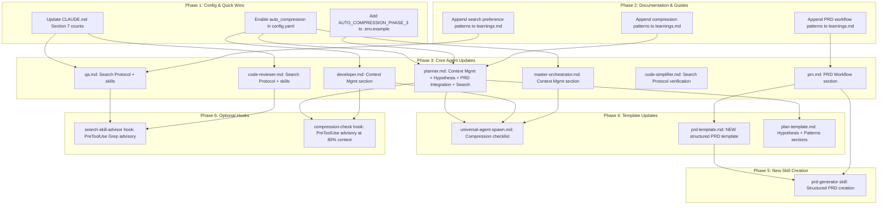

<!-- Agent: architect | Task: #6 | Session: 2026-02-09 -->

# Enterprise Improvement Design: Zero-Regression Plan

**Version**: 1.0.0
**Author**: Architect Agent
**Date**: 2026-02-09
**Status**: DRAFT

---

## Table of Contents

1. [Executive Summary](#1-executive-summary)
2. [Change Impact Analysis](#2-change-impact-analysis)
3. [Dependency Graph](#3-dependency-graph)
4. [Phase Plan](#4-phase-plan)
5. [Detailed File Changes](#5-detailed-file-changes)
6. [Cross-Cutting Concerns](#6-cross-cutting-concerns)
7. [Architecture Quality Checklist](#7-architecture-quality-checklist)

---

## 1. Executive Summary

This document designs a zero-regression improvement plan across 4 enhancement areas:

| Area | Problem | Impact | Risk |
|------|---------|--------|------|
| **A1: Context-Compressor Integration** | Complete infrastructure is dormant (config disabled, zero agent invocations) | Long sessions hit context limits, truncated work | LOW |
| **A2: Hybrid Search Adoption** | 85% of agents lack search skills; 41% explicitly reference Grep | 40-70% token waste per search | LOW |
| **A3: Planner Enhancement** | No TDD enforcement, no hypothesis framing, no PHASE checkpoints | Plans lack validation; rework cycles | LOW-MEDIUM |
| **A4: PM PRD System** | No structured PRD template; no PRD-to-Plan pipeline | No traceability from requirements to implementation | MEDIUM |

**Design Principles Applied:**

1. **Zero Regression**: Every change is ADDITIVE (new sections in existing files) or CONFIG (toggle changes). No existing content is removed or replaced.
2. **Incremental**: Each phase is independently testable and rollback-able.
3. **Backwards Compatible**: Existing agent definitions continue to work. New sections are additive.
4. **Feature-Flag Safe**: Config changes use existing infrastructure (config.yaml, .env).

---

## 2. Change Impact Analysis

### 2.1 Area 1: Context-Compressor Integration

| File | Change Type | What Changes | Risk |
|------|-------------|-------------|------|
| `.claude/config.yaml` (line 114) | CONFIG | `auto_compression.enabled: false` -> `true` | LOW |
| `.env.example` | ADDITIVE | Add `AUTO_COMPRESSION_PHASE_3=1` entry | LOW |
| `.claude/agents/core/planner.md` | ADDITIVE | Add "Context Management" section after line ~601 | LOW |
| `.claude/agents/core/developer.md` | ADDITIVE | Add "Context Management" section | LOW |
| `.claude/agents/orchestrators/master-orchestrator.md` | ADDITIVE | Add "Context Management" section | LOW |
| `.claude/templates/spawn/universal-agent-spawn.md` | ADDITIVE | Add compression checklist item | LOW |
| `.claude/context/memory/learnings.md` | ADDITIVE | Append compression patterns | LOW |

**Cross-Agent Impact**: None. Adding sections does not change existing agent behavior. Agents that do not read the new section continue working as before. The config change activates dormant infrastructure that already has error handling.

### 2.2 Area 2: Hybrid Search Adoption

| File | Change Type | What Changes | Risk |
|------|-------------|-------------|------|
| `.claude/agents/core/developer.md` | ADDITIVE | Already has search skills; verify search protocol section exists | LOW |
| `.claude/agents/core/qa.md` | ADDITIVE | Add "Search Protocol" section; add search skills to frontmatter | LOW |
| `.claude/agents/core/code-reviewer.md` | ADDITIVE | Add "Search Protocol" section; add search skills to frontmatter | LOW |
| `.claude/agents/core/planner.md` | ADDITIVE | Strengthen existing search section (lines 322-353) | LOW |
| `.claude/agents/specialized/code-simplifier.md` | ADDITIVE | Verify search skills; add protocol section if missing | LOW |
| `.claude/CLAUDE.md` Section 7 | MODIFICATION | Update aspirational counts (36+) to accurate counts | LOW |
| `.claude/templates/spawn/universal-agent-spawn.md` | ADDITIVE | Already has search decision tree (lines 98-164); no change needed | LOW |

**Cross-Agent Impact**: Minimal. Adding search skills to agent frontmatter is purely additive. The Skill() invocation pattern is already established. No hooks fire on frontmatter changes. The CLAUDE.md Section 7 update corrects aspirational text to match reality -- this is a documentation accuracy fix, not a behavior change.

### 2.3 Area 3: Planner Enhancement

| File | Change Type | What Changes | Risk |
|------|-------------|-------------|------|
| `.claude/agents/core/planner.md` | ADDITIVE | Add "Hypothesis Framing" subsection to Phase 0 | LOW |
| `.claude/agents/core/planner.md` | ADDITIVE | Add "Patterns to Mirror" subsection to Phase 1+ | LOW |
| `.claude/agents/core/planner.md` | ADDITIVE | Add "Mandatory Reading" subsection to Phase 1+ | LOW |
| `.claude/agents/core/planner.md` | ADDITIVE | Strengthen search tool guidance (already partially present) | LOW |
| `.claude/agents/core/planner.md` | ADDITIVE | Add "Phase Checkpoint" pattern description after Phase 0 | LOW |
| `.claude/agents/core/planner.md` | ADDITIVE | Add "PRD Integration" section for PM handoff | LOW |
| `.claude/templates/plan-template.md` | ADDITIVE | Add hypothesis, patterns-to-mirror, mandatory-reading sections | LOW |

**Cross-Agent Impact**: None. Planner additions are consumed by the planner agent only. Downstream agents (developer, qa) benefit from richer plans but are not required to change.

### 2.4 Area 4: PM PRD System

| File | Change Type | What Changes | Risk |
|------|-------------|-------------|------|
| `.claude/agents/core/pm.md` | ADDITIVE | Add "PRD Workflow" section; reference prd-template | LOW-MEDIUM |
| `.claude/templates/prd-template.md` | ADDITIVE (NEW) | New file: structured PRD template | LOW |
| `.claude/agents/core/planner.md` | ADDITIVE | Add "PRD Integration" subsection (cross-ref with A3) | LOW |
| `.claude/context/memory/learnings.md` | ADDITIVE | Append PRD workflow patterns | LOW |

**Cross-Agent Impact**: LOW. PM agent gets enhanced template. Planner gets optional PRD integration (reads PRD if available, falls back to current behavior if not). No other agents are affected.

---

## 3. Dependency Graph



### Critical Path

```
Phase 1 (Config) -> Phase 3 (Agent Updates) -> Phase 4 (Templates) -> Phase 5 (Skill)
```

### Parallelization Opportunities

| Can Run in Parallel | Why |
|---------------------|-----|
| Phase 1A, 1B, 1C | Independent config/doc changes |
| Phase 2A, 2B, 2C | Independent memory file appends |
| Phase 3A through 3G | Independent agent file updates (different files) |
| Phase 3D, 3E, 3F | All search protocol updates (independent agents) |
| Phase 4A, 4B, 4C | Independent template updates |
| Phase 6A, 6B | Independent optional hooks |

### Sequential Dependencies

| Step | Depends On | Reason |
|------|-----------|--------|
| Phase 3 (any agent) | Phase 1 complete | Agents reference config patterns |
| Phase 4A (spawn template) | Phase 3A, 3B, 3G | Compression checklist references agent patterns |
| Phase 4B (prd-template) | Phase 3C | Template must match pm.md PRD workflow |
| Phase 4C (plan-template) | Phase 3A | Template must match planner.md additions |
| Phase 5 (prd-generator skill) | Phase 4B | Skill uses prd-template |
| Phase 6 (hooks) | Phase 3 complete | Hooks reference patterns in agent docs |

---

## 4. Phase Plan

### Phase 1: Config & Quick Wins (Estimated: 30 minutes)

**Goal**: Activate dormant infrastructure and correct documentation inaccuracies.

**Changes**:

1. **config.yaml**: Change `auto_compression.enabled: false` to `auto_compression.enabled: true`
2. **.env.example**: Add `AUTO_COMPRESSION_PHASE_3=1` to Section 2 (Feature Flags)
3. **CLAUDE.md Section 7**: Replace aspirational "36+ agents" with accurate "9 agents (Phase 1 target: 13+)"

**Test Plan**:
- Verify config.yaml parses correctly: `node -e "const yaml = require('js-yaml'); const fs = require('fs'); yaml.load(fs.readFileSync('.claude/config.yaml','utf8')); console.log('OK')"`
- Verify .env.example has new variable
- Grep CLAUDE.md for updated Section 7 text

**Rollback**: Revert each file change individually. These are single-line changes.

---

### Phase 2: Memory & Documentation Updates (Estimated: 30 minutes)

**Goal**: Record patterns and decisions in memory files so agents learn from them.

**Changes**:

1. **learnings.md**: Append compression trigger patterns (when to compress, safe checkpoints)
2. **learnings.md**: Append PRD workflow patterns (problem-first, hypothesis, phases table)
3. **learnings.md**: Append search preference patterns (hybrid > Grep, decision tree)

**Test Plan**:
- Verify learnings.md is valid markdown (no syntax errors)
- Verify no existing entries are overwritten (append-only)

**Rollback**: Remove appended sections (each has a date-stamped header for easy identification).

---

### Phase 3: Core Agent Updates (Estimated: 3-4 hours)

**Goal**: Update agent definitions with new capability sections. All changes are ADDITIVE (new sections appended to existing files).

#### 3A: planner.md (4 additions)

1. **Context Management section** (after Skill Invocation Protocol, ~line 609):
   ```markdown
   ## Context Management (Long Sessions)

   For HIGH/EPIC complexity plans (50+ tasks, 8+ phases):

   **When to compress:**
   - After Phase 0 research (40+ message turns accumulated)
   - When plan exceeds 50 tasks (large output accumulation)
   - When message count exceeds 50 turns

   **How to compress:**
   ```javascript
   Skill({ skill: 'context-compressor' });
   ```

   **What to preserve:** Research findings, key decisions, active task list, file paths
   ```

2. **Hypothesis Framing** (add to Phase 0 section, after Research Requirements):
   ```markdown
   #### Hypothesis Framing (RECOMMENDED)

   For each major decision in the plan, frame as a testable hypothesis:

   Template: "We believe [capability] will [solve problem] for [users].
   We'll know we're right when [measurable outcome]."

   This makes plans falsifiable and success criteria explicit.
   ```

3. **PRD Integration** (new section after Phase 0):
   ```markdown
   ## PRD Integration (When Available)

   If a PRD exists for this feature:
   1. Read PRD at `.claude/context/artifacts/specs/{feature}-prd-*.md`
   2. Parse Implementation Phases table
   3. Select next pending phase (where dependencies are complete)
   4. Create plan for THAT phase only (focused scope)
   5. After plan creation, update PRD phases table with plan link
   ```

4. **Search Tool Guidance Strengthening** (modify existing section at lines 322-353):
   - Add explicit preference ordering: `pnpm search:code` > `Skill({ skill: 'ripgrep' })` > `Skill({ skill: 'code-semantic-search' })` > `Grep` (fallback)
   - Keep existing Grep section but add "fallback for advanced regex" qualifier

#### 3B: developer.md (1 addition)

Add "Context Management" section:
```markdown
## Context Management (Long Implementations)

For multi-file implementations (10+ files, 3000+ LOC):

**When to compress:**
- After completing a logical unit (Phase N tasks, 5+ files changed)
- Before starting next implementation phase
- When message count exceeds 50 turns

**How to compress:**
```javascript
Skill({ skill: 'context-compressor' });
```

**What to preserve:** Active task IDs, file paths modified, test results, key decisions
```

#### 3C: pm.md (1 addition)

Add "PRD Workflow" section (after Responsibilities, ~line 93):
```markdown
## PRD Workflow (Structured Product Requirements)

**When to create PRD**: HIGH/EPIC complexity features requiring cross-team coordination.
**When to skip**: LOW/MEDIUM complexity features with clear, self-contained scope.

### PRD Template

Use the structured PRD template at `.claude/templates/prd-template.md` for all PRDs.

**Required Sections:**
- Problem Statement + Evidence (validates "why" before "how")
- Key Hypothesis (testable assumption with measurable outcome)
- MoSCoW Capabilities (Must/Should/Could/Won't with rationale)
- Implementation Phases table (Status/Depends/Plan Link columns)
- Decisions Log (Decision/Choice/Alternatives/Rationale)
- Success Metrics (Metric/Target/How Measured)

**Output Location:** `.claude/context/artifacts/specs/{feature-name}-prd-{YYYY-MM-DD}.md`

### PRD-to-Plan Handoff

After PRD is created:
1. Planner reads PRD -> selects next pending phase -> creates plan
2. Planner updates PRD phases table with plan link
3. Developer reads plan (linked to PRD) for full context
```

#### 3D: qa.md (1 addition + frontmatter update)

**Frontmatter**: Add to skills list:
```yaml
skills:
  - code-semantic-search
  - code-structural-search
  - ripgrep
```

**Body**: Add "Search Protocol" section:
```markdown
## Search Protocol

**PREFER** hybrid search skills over Grep for code discovery:

| What You Need | Use This | Example |
|---------------|----------|---------|
| Test patterns | code-structural-search | `Skill({ skill: 'code-structural-search', args: 'describe($NAME, function() { $$ }) --lang ts' })` |
| Test file discovery | ripgrep | `Skill({ skill: 'ripgrep', args: '*.test.ts' })` |
| Conceptual test patterns | code-semantic-search | `Skill({ skill: 'code-semantic-search', args: 'error handling test patterns' })` |
| Advanced regex (fallback) | Grep | `Grep({ pattern: 'complex-regex', ... })` |
```

#### 3E: code-reviewer.md (1 addition + frontmatter update)

**Frontmatter**: Add to skills list:
```yaml
skills:
  - code-semantic-search
  - code-structural-search
  - ripgrep
```

**Body**: Add "Search Protocol" section:
```markdown
## Search Protocol

**PREFER** hybrid search skills over Grep for code review:

| What You Need | Use This | Example |
|---------------|----------|---------|
| Similar code patterns | code-semantic-search | `Skill({ skill: 'code-semantic-search', args: 'error handling patterns' })` |
| Exact code structure | code-structural-search | `Skill({ skill: 'code-structural-search', args: 'class $NAME extends $BASE { $$ } --lang ts' })` |
| Fast keyword search | ripgrep | `Skill({ skill: 'ripgrep', args: 'pattern' })` |
| Advanced regex (fallback) | Grep | Use only for PCRE2 lookahead/lookbehind patterns |
```

#### 3F: code-simplifier.md (verification only)

**Check**: Verify code-simplifier.md already has search skills (developer.md shows it has all 3). If missing, add same pattern as 3D/3E.

#### 3G: master-orchestrator.md (1 addition)

Add "Context Management" section:
```markdown
## Context Management (Multi-Phase Workflows)

For workflows with 3+ phases:

**When to compress:**
- Between workflow phases (Phase N complete, Phase N+1 starting)
- When accumulated agent outputs exceed 50 message turns
- After aggregating results from parallel agent spawns

**How to compress:**
```javascript
Skill({ skill: 'context-compressor' });
```

**What to preserve:** Phase summaries, agent outputs, active decisions, remaining phases
```

**Test Plan for Phase 3**:
- For each modified agent file: verify YAML frontmatter parses correctly
- For each modified agent file: verify no existing sections are overwritten
- For each modified agent file: verify the file renders as valid markdown
- Run `pnpm lint:fix` to verify no lint errors introduced
- Run `pnpm format` to verify formatting compliance

**Rollback**: Each agent file change is a single additive section. Remove the section header and content to revert. No existing content is modified.

---

### Phase 4: Template Updates (Estimated: 2 hours)

**Goal**: Update templates so new agents inherit improvements.

#### 4A: universal-agent-spawn.md

Add compression checklist item to the Memory Protocol section (line ~334):
```markdown
## Context Compression (Long Tasks)

If your task involves 50+ messages, 10+ file changes, or multi-phase work:
- [ ] Check if context-compressor needed
- [ ] Invoke `Skill({ skill: 'context-compressor' })` at safe checkpoints
- [ ] Preserve: active task IDs, key decisions, file paths, test results
```

**Note**: The spawn template already has a comprehensive search decision tree (lines 98-164). No search changes needed.

#### 4B: prd-template.md (NEW FILE)

Create `.claude/templates/prd-template.md` with structured PRD format:

```markdown
# PRD: {{FEATURE_NAME}}

## Problem Statement
[What problem does this solve? Why now?]

## Evidence
[Data, user feedback, metrics that demonstrate the problem]

## Key Hypothesis
We believe [capability] will [solve problem] for [users].
We'll know we're right when [measurable outcome].

## What We're NOT Building
[Explicit scope exclusions]

## Success Metrics
| Metric | Target | How Measured |
|--------|--------|--------------|
| ... | ... | ... |

## Core Capabilities (MoSCoW)
| Priority | Capability | Rationale |
|----------|-----------|-----------|
| Must | ... | ... |
| Should | ... | ... |
| Could | ... | ... |
| Won't | ... | ... |

## Implementation Phases
| # | Phase | Description | Status | Parallel | Depends | Plan Link |
|---|-------|-------------|--------|----------|---------|-----------|
| 1 | ... | ... | pending | No | - | - |

## Decisions Log
| Decision | Choice | Alternatives | Rationale |
|----------|--------|-------------|-----------|
| ... | ... | ... | ... |

## Research Summary
**Market Context:** [external research]
**Technical Context:** [feasibility, existing patterns]

## Open Questions
- [ ] ...
```

#### 4C: plan-template.md

Add to existing plan template (after Phase 0 section):

```markdown
#### Hypothesis Framing

For each major technical decision, state:
"We believe [approach] will [achieve outcome]. We'll know when [metric]."

#### Mandatory Reading

Before planning, agents MUST read these files:
- [List specific files with line ranges]
- [Include code snippets to mirror]

#### Patterns to Mirror

Copy these existing patterns from the codebase:
- [Pattern 1: file path + description]
- [Pattern 2: file path + description]
```

**Test Plan for Phase 4**:
- Verify each template file is valid markdown
- Verify prd-template.md renders correctly
- Verify no existing template content is overwritten

**Rollback**: For 4A and 4C, remove added sections. For 4B, delete the new file.

---

### Phase 5: New Skill Creation (Estimated: 3-4 hours)

**Goal**: Create the `prd-generator` skill for structured PRD creation.

**Prerequisite**: Phase 4B complete (prd-template.md exists).

**Approach**: Use skill-creator workflow (NOT direct file write):
1. Invoke `research-synthesis` for PRD methodology best practices
2. Invoke `skill-creator` to create `.claude/skills/prd-generator/SKILL.md`
3. Skill-creator handles: catalog entry, agent assignment (pm), routing keywords

**Skill Specification**:
- **Name**: prd-generator
- **Purpose**: Guide PM through structured PRD creation using prd-template.md
- **Assigned Agents**: pm
- **Skills Used**: progressive-disclosure (for requirements gathering), template-renderer (for PRD output)
- **Output**: `.claude/context/artifacts/specs/{feature-name}-prd-{date}.md`

**Test Plan**:
- Verify SKILL.md exists and parses correctly
- Verify skill-catalog.md has entry
- Verify pm.md agent has skill assigned
- Invoke skill and verify it loads without error

**Rollback**: Delete `.claude/skills/prd-generator/` directory and remove catalog entry.

---

### Phase 6: Optional Hooks (Estimated: 2-3 hours)

**Goal**: Add non-blocking advisory hooks for search and compression.

**These are OPTIONAL and can be deferred**. They provide a safety net for adoption.

#### 6A: hybrid-search-advisor.cjs

- **Event**: PreToolUse(Grep)
- **Mode**: Non-blocking (exit 0 always, warn via stderr)
- **Behavior**: When agent uses Grep, emit: "Consider Skill({ skill: 'ripgrep' }) for token efficiency"
- **Location**: `.claude/hooks/optimization/hybrid-search-advisor.cjs`
- **Config**: `SEARCH_ADVISOR_HOOK=warn|off` (default: warn)

#### 6B: compression-reminder-check.cjs

- **Event**: PreToolUse (broad trigger, ~every 10th invocation)
- **Mode**: Non-blocking (exit 0 always)
- **Behavior**: When session exceeds estimated 150K tokens, write compression-reminder.txt
- **Location**: `.claude/hooks/session/compression-reminder-check.cjs`
- **Config**: Uses existing `auto_compression` config from config.yaml

**Test Plan**:
- For each hook: verify stdin/stdout JSON protocol compliance
- For each hook: verify exit 0 in all cases (non-blocking)
- For each hook: verify graceful degradation (missing config = no-op)
- Register in settings.json (user must restart session for hooks to take effect)

**Rollback**: Unregister from settings.json and delete hook files. (Reminder: settings.json is cached at session startup; changes require restart.)

---

## 5. Detailed File Changes

### 5.1 `.claude/config.yaml`

| Attribute | Value |
|-----------|-------|
| **File** | `.claude/config.yaml` |
| **Phase** | 1 |
| **Type** | CONFIG |
| **Risk** | LOW |

**Exact Change** (line 114):
```yaml
# BEFORE
auto_compression:
    enabled: false

# AFTER
auto_compression:
    enabled: true
```

**Rollback**: Set back to `false`.

**Test**: Parse YAML; verify `auto_compression.enabled === true`.

---

### 5.2 `.env.example`

| Attribute | Value |
|-----------|-------|
| **File** | `.env.example` |
| **Phase** | 1 |
| **Type** | ADDITIVE |
| **Risk** | LOW |

**Exact Change**: Add after line 37 (Section 2: Feature Flags):
```bash
# Auto-compression for long sessions (Phase 3)
# Values: 1 (enabled) | 0 (disabled)
# Default: 0 (disabled)
# When enabled, user-prompt-unified.cjs checks token budget and creates
# compression-reminder.txt for the router to process
#
AUTO_COMPRESSION_PHASE_3=1
```

**Rollback**: Remove added lines.

**Test**: Verify .env.example contains `AUTO_COMPRESSION_PHASE_3`.

---

### 5.3 `.claude/CLAUDE.md` Section 7

| Attribute | Value |
|-----------|-------|
| **File** | `.claude/CLAUDE.md` |
| **Phase** | 1 |
| **Type** | MODIFICATION |
| **Risk** | LOW |

**Exact Change**: In Section 7 "Hybrid Search Integration (Phase 1)", replace:
```markdown
- **36+ agents** (all domain agents): `code-semantic-search`, `code-structural-search`, `ripgrep`
- **9 specialized agents**: `code-semantic-search`, `ripgrep` (structural search not needed)
- **8 orchestrators/C4 agents**: `ripgrep` only (high-level coordination)
```

With:
```markdown
- **Current state**: 9 agents have search skills assigned (Phase 1 target: 13+ core agents)
- **Phase 1 agents** (core + high-impact): developer, code-reviewer, code-simplifier, planner, qa, architect, database-architect, devops, devops-troubleshooter, incident-responder, security-architect, technical-writer, context-compressor
- **Phase 2 target**: 25+ domain agents (python-pro, typescript-pro, etc.)
- **Phase 3 target**: 8 orchestrators (ripgrep only for quick scanning)
```

**Rollback**: Restore original text.

**Test**: Verify Section 7 no longer contains "36+ agents".

---

### 5.4 `.claude/agents/core/planner.md`

| Attribute | Value |
|-----------|-------|
| **File** | `.claude/agents/core/planner.md` |
| **Phase** | 3 |
| **Type** | ADDITIVE |
| **Risk** | LOW |

**Changes** (4 additive sections):

1. **After line ~609** (after Skill Discovery section): Add "Context Management" section (~20 lines)
2. **After line ~268** (inside Phase 0, after Research Requirements): Add "Hypothesis Framing" subsection (~10 lines)
3. **After line ~295** (inside Phase 1+): Add "Mandatory Reading" and "Patterns to Mirror" subsections (~15 lines)
4. **After line ~549** (after Phase 0 section): Add "PRD Integration" section (~15 lines)
5. **Lines 322-353**: Strengthen search guidance to add explicit preference ordering (~5 lines modification within existing section)

**Total additions**: ~65 lines across 5 locations.

**Rollback**: Remove each added section by its header.

**Test**:
- YAML frontmatter parses
- Markdown renders without errors
- No broken internal links
- `grep "Context Management" .claude/agents/core/planner.md` returns match

---

### 5.5 `.claude/agents/core/developer.md`

| Attribute | Value |
|-----------|-------|
| **File** | `.claude/agents/core/developer.md` |
| **Phase** | 3 |
| **Type** | ADDITIVE |
| **Risk** | LOW |

**Change**: Add "Context Management" section (~15 lines) after the existing workflow sections.

**Rollback**: Remove section.

**Test**: YAML frontmatter parses; file is valid markdown.

---

### 5.6 `.claude/agents/core/pm.md`

| Attribute | Value |
|-----------|-------|
| **File** | `.claude/agents/core/pm.md` |
| **Phase** | 3 |
| **Type** | ADDITIVE |
| **Risk** | LOW-MEDIUM |

**Change**: Add "PRD Workflow" section (~40 lines) after Responsibilities section (~line 93).

**Rollback**: Remove section.

**Test**: YAML frontmatter parses; file is valid markdown; section references prd-template.md.

---

### 5.7 `.claude/agents/core/qa.md`

| Attribute | Value |
|-----------|-------|
| **File** | `.claude/agents/core/qa.md` |
| **Phase** | 3 |
| **Type** | ADDITIVE |
| **Risk** | LOW |

**Changes**:
1. Add `code-semantic-search`, `code-structural-search`, `ripgrep` to frontmatter `skills:` list
2. Add "Search Protocol" section (~15 lines)

**Rollback**: Remove added skills from frontmatter; remove section.

**Test**: YAML frontmatter parses; skills list is valid YAML array.

---

### 5.8 `.claude/agents/specialized/code-reviewer.md`

| Attribute | Value |
|-----------|-------|
| **File** | `.claude/agents/specialized/code-reviewer.md` |
| **Phase** | 3 |
| **Type** | ADDITIVE |
| **Risk** | LOW |

**Changes**: Same pattern as 5.7 (qa.md).

**Rollback**: Same as 5.7.

**Test**: Same as 5.7.

---

### 5.9 `.claude/agents/orchestrators/master-orchestrator.md`

| Attribute | Value |
|-----------|-------|
| **File** | `.claude/agents/orchestrators/master-orchestrator.md` |
| **Phase** | 3 |
| **Type** | ADDITIVE |
| **Risk** | LOW |

**Change**: Add "Context Management" section (~15 lines).

**Rollback**: Remove section.

**Test**: YAML frontmatter parses; file is valid markdown.

---

### 5.10 `.claude/templates/spawn/universal-agent-spawn.md`

| Attribute | Value |
|-----------|-------|
| **File** | `.claude/templates/spawn/universal-agent-spawn.md` |
| **Phase** | 4 |
| **Type** | ADDITIVE |
| **Risk** | LOW |

**Change**: Add "Context Compression" section (~8 lines) after Memory Protocol section (line ~337).

**Rollback**: Remove section.

**Test**: Template renders correctly.

---

### 5.11 `.claude/templates/prd-template.md` (NEW)

| Attribute | Value |
|-----------|-------|
| **File** | `.claude/templates/prd-template.md` |
| **Phase** | 4 |
| **Type** | ADDITIVE (NEW) |
| **Risk** | LOW |

**Change**: Create new file with structured PRD template (~80 lines).

**Rollback**: Delete file.

**Test**: File exists; valid markdown; contains required sections (Problem, Hypothesis, MoSCoW, Phases, Decisions).

---

### 5.12 `.claude/templates/plan-template.md`

| Attribute | Value |
|-----------|-------|
| **File** | `.claude/templates/plan-template.md` |
| **Phase** | 4 |
| **Type** | ADDITIVE |
| **Risk** | LOW |

**Change**: Add Hypothesis Framing, Mandatory Reading, Patterns to Mirror subsections (~20 lines total).

**Rollback**: Remove added subsections.

**Test**: Template is valid markdown; new sections present.

---

### 5.13 `.claude/context/memory/learnings.md`

| Attribute | Value |
|-----------|-------|
| **File** | `.claude/context/memory/learnings.md` |
| **Phase** | 2 |
| **Type** | ADDITIVE |
| **Risk** | LOW |

**Change**: Append 3 new learning entries (compression, PRD, search). Each ~15-20 lines.

**Rollback**: Remove appended entries (identifiable by date header).

**Test**: File is valid markdown; entries have date headers.

---

### 5.14 `.claude/skills/prd-generator/SKILL.md` (NEW)

| Attribute | Value |
|-----------|-------|
| **File** | `.claude/skills/prd-generator/SKILL.md` |
| **Phase** | 5 |
| **Type** | ADDITIVE (NEW) |
| **Risk** | MEDIUM |

**Change**: Create via skill-creator workflow (not direct write). Handles catalog, agent assignment, routing.

**Rollback**: Delete skill directory; remove catalog entry; remove from pm.md skills.

**Test**: SKILL.md exists; skill-catalog.md has entry; `Skill({ skill: 'prd-generator' })` loads without error.

---

### 5.15-5.16 Optional Hooks (Phase 6)

| File | Phase | Type | Risk |
|------|-------|------|------|
| `.claude/hooks/optimization/hybrid-search-advisor.cjs` | 6 | ADDITIVE (NEW) | LOW |
| `.claude/hooks/session/compression-reminder-check.cjs` | 6 | ADDITIVE (NEW) | LOW |

**Both**: Non-blocking, exit 0 always, warn mode, graceful degradation.

**Rollback**: Unregister from settings.json; delete files; restart session.

---

## 6. Cross-Cutting Concerns

### 6.1 How Changes Interact Across Areas

| Area 1 (Compression) | Area 2 (Search) | Area 3 (Planner) | Area 4 (PM PRD) |
|-----------------------|------------------|-------------------|------------------|
| planner.md gets Context Mgmt | planner.md gets Search strengthening | planner.md gets Hypothesis/PRD | planner.md gets PRD Integration |

**Key Observation**: planner.md receives the most changes (4 additive sections from 3 different areas). These sections are independent and non-overlapping:
- Context Management (Area 1) -- new section about when to compress
- Search Protocol strengthening (Area 2) -- modification to existing section
- Hypothesis Framing + Phase Checkpoints (Area 3) -- additions within Phase 0
- PRD Integration (Area 4) -- new section about consuming PRDs

**Risk Mitigation**: Since all changes to planner.md are in different locations within the file, they can be applied sequentially without conflict. Each section is independently identifiable and removable.

### 6.2 Testing Strategy for Combined Changes

**Unit Tests** (per file):
- YAML frontmatter parsing for each modified agent file
- Markdown validity for each modified file
- Config.yaml YAML parsing

**Integration Tests** (cross-file):
- Verify planner.md references that exist in prd-template.md
- Verify pm.md references that exist in prd-template.md
- Verify CLAUDE.md Section 7 counts match actual agent skill counts
- Verify all skill names referenced in agent files exist in skill-catalog.md

**Smoke Test** (end-to-end):
- Spawn planner agent, verify it can read its own definition without errors
- Spawn pm agent, verify it can read its own definition without errors
- Verify config.yaml auto_compression.enabled reads as true
- Verify .env.example contains AUTO_COMPRESSION_PHASE_3

### 6.3 Memory Protocol Updates

All agents that receive changes should find these patterns in learnings.md on their next invocation:

1. **Compression pattern**: When/how to use context-compressor (available after Phase 2A)
2. **Search preference pattern**: Hybrid skills > Grep (available after Phase 2C)
3. **PRD workflow pattern**: Problem-first, hypothesis-driven (available after Phase 2B)

This creates a "soft enforcement" layer: even if an agent does not read its updated definition, it will find the patterns in the shared memory file.

### 6.4 Security Considerations

| Change | Security Impact | Assessment |
|--------|----------------|------------|
| config.yaml auto_compression | Activates existing code path | LOW - code already exists, has error handling |
| .env.example variable | Documentation only | NONE |
| Agent definition changes | Text-only, no code execution | NONE |
| Template changes | Text-only, no code execution | NONE |
| prd-generator skill (Phase 5) | New skill via creator workflow | LOW - goes through skill-creator validation |
| Advisory hooks (Phase 6) | New hooks, non-blocking | LOW - exit 0 always, stderr only |

**No security-architect review required** for Phases 1-4 (documentation and config changes only). Phase 5 (skill creation) uses the established creator workflow which includes validation. Phase 6 (hooks) should undergo standard hook review but are non-blocking by design.

### 6.5 Hook Impact Assessment

| Existing Hook | Affected by Changes? | Why |
|--------------|---------------------|-----|
| `routing-guard.cjs` | NO | No routing changes |
| `unified-creator-guard.cjs` | NO | No creator path writes in Phases 1-4 |
| `pre-completion-validation.cjs` | NO | No completion criteria changes |
| `unified-pre-write-hook.cjs` | NO | Writing to non-protected paths |
| `tool-scope-validator.cjs` | NO | No tool scope changes |
| `validate-skill-invocation.cjs` | NO | Adding skills to agents is supported |
| `spawn-prompt-validator.cjs` | NO | Spawn template changes are additive |

**Conclusion**: No existing hook behavior is affected by any change in Phases 1-5.

---

## 7. Architecture Quality Checklist

### IEEE 1028 Architecture Base (80%)

- [x] **Single Responsibility**: Each phase has one focused goal
- [x] **Open/Closed**: Agent files extended via new sections, not modified
- [x] **Loose Coupling**: Changes to one agent do not require changes to others
- [x] **High Cohesion**: Each area's changes are logically grouped
- [x] **Separation of Concerns**: Config (Phase 1), docs (Phase 2), agents (Phase 3), templates (Phase 4), skills (Phase 5), hooks (Phase 6)
- [x] **Scalability**: Pattern applies to future agents (template-based)
- [x] **Extensibility**: New sections can be added without modifying existing content
- [x] **Performance**: No runtime overhead from documentation changes
- [x] **Failure Modes**: Config toggle allows instant rollback; hooks are non-blocking
- [x] **Backwards Compatibility**: All existing agent definitions continue to work

### Context-Specific Items (20%)

- [x] **[AI-GENERATED]** Agent frontmatter YAML valid after changes
- [x] **[AI-GENERATED]** No circular dependencies between phases
- [x] **[AI-GENERATED]** Memory protocol followed (append-only to learnings.md)
- [x] **[AI-GENERATED]** Creator workflow used for skill creation (Phase 5)
- [x] **[AI-GENERATED]** Hook protocol compliance for optional hooks (stdin/stdout JSON)
- [x] **[AI-GENERATED]** Windows path compatibility maintained (no forward-slash assumptions)
- [x] **[AI-GENERATED]** Settings.json cache behavior documented for hook changes

---

## Summary: Implementation Order

```
Week 1, Day 1:
  [PARALLEL] Phase 1A + 1B + 1C (Config & Quick Wins)        -- 30 min
  [PARALLEL] Phase 2A + 2B + 2C (Memory Updates)             -- 30 min

Week 1, Day 1-2:
  [PARALLEL] Phase 3A-3G (Core Agent Updates)                 -- 3-4 hours

Week 1, Day 2:
  [PARALLEL] Phase 4A + 4B + 4C (Template Updates)           -- 2 hours

Week 1, Day 3:
  [SEQUENTIAL] Phase 5 (prd-generator Skill)                  -- 3-4 hours

Week 2 (OPTIONAL):
  [PARALLEL] Phase 6A + 6B (Advisory Hooks)                   -- 2-3 hours
```

**Total Estimated Effort**: 9-14 hours (excluding optional Phase 6)

**Files Modified**: 13 existing + 2 new (Phase 1-5) + 2 new hooks (Phase 6 optional)

**Zero Regression Confidence**: HIGH -- all changes are additive sections, config toggles, or new files. No existing content is removed or replaced. Each change is independently testable and reversible.
