<!-- Agent: planner | Task: #3 | Session: 2026-02-07 -->

# Implementation Plan: Cross-Artifact Integration System

**Version:** 1.0.0
**Date:** 2026-02-07
**Status:** Ready for Execution
**Architecture:** ADR-100 (`.claude/context/artifacts/analysis/cross-artifact-integration-architecture.md`)
**Complexity:** HIGH (multi-phase, multi-file, new subsystem)
**Estimated Duration:** 8-10 days across 3 phases

---

## Executive Summary

Implement a cross-artifact integration system that eliminates the "orphan artifact" problem (currently ~70% orphan rate) by introducing an artifact relationship graph, post-creation orchestration via hook + queue + skill, integration enforcement gates in planner and code-reviewer, and backward propagation from reviews to new artifact proposals. The system uses proven patterns (JSONL queue, PostToolUse hook, JSON graph) and requires zero external dependencies.

## Key Deliverables

- `artifact-graph.json` -- live directed graph of ~268 artifact nodes and ~500 relationship edges
- `artifact-graph.cjs` -- library module with query API (getRelated, getMissingIntegrations, getImpactRadius)
- `bootstrap-artifact-graph.cjs` -- CLI tool to populate initial graph from filesystem scan
- `post-creation-integration.cjs` -- PostToolUse hook detecting creator completions
- `artifact-integrator` -- skill for deep integration analysis and task proposal
- `integration-impact.cjs` -- library module for impact analysis
- Planner Gate 5, Code-Reviewer Stage 3, Router Step 0.5
- `artifact-integration.md` -- rule file for cross-cutting integration protocol
- Comprehensive test suite

## Strategy

Foundation-first: Build the graph + library (Phase 1) so Phase 2 (intelligence) and Phase 3 (enforcement) can query it. Advisory before blocking: Phase 1-2 warn about missing integrations; Phase 3 makes must-have integrations blocking.

---

## Dependency Graph

```mermaid
graph TD
    subgraph "Phase 1: Foundation"
        T1_1[1.1 Graph Schema]
        T1_2[1.2 Graph Library]
        T1_3[1.3 Bootstrap Tool]
        T1_4[1.4 Run Bootstrap]
        T1_5[1.5 Post-Creation Hook]
        T1_6[1.6 Register Hook]
        T1_7[1.7 Integration Rule]
        T1_8[1.8 Queue Rotation]
        T1_9[1.9 Graph Library Tests]
        T1_10[1.10 Hook Tests]
        T1_11[1.11 Bootstrap Tests]

        T1_1 --> T1_2
        T1_2 --> T1_3
        T1_3 --> T1_4
        T1_2 --> T1_5
        T1_5 --> T1_6
        T1_2 --> T1_9
        T1_5 --> T1_10
        T1_3 --> T1_11
    end

    subgraph "Phase 2: Enhancement"
        T2_1[2.1 Integration Impact Library]
        T2_2[2.2 Artifact Integrator Skill]
        T2_3[2.3 Planner Gate 5]
        T2_4[2.4 Reviewer Stage 3]
        T2_5[2.5 Router Step 0.5]
        T2_6[2.6 Routing Keywords]
        T2_7[2.7 Post-Creation Validation Update]
        T2_8[2.8 Impact Library Tests]
        T2_9[2.9 Integrator Skill Tests]
        T2_10[2.10 Integration E2E Test]

        T1_2 --> T2_1
        T1_5 --> T2_1
        T2_1 --> T2_2
        T2_1 --> T2_3
        T2_1 --> T2_4
        T2_2 --> T2_5
        T2_1 --> T2_8
        T2_2 --> T2_9
    end

    subgraph "Phase 3: Full System"
        T3_1[3.1 Backward Prop - Reviewer]
        T3_2[3.2 Backward Prop - Architect]
        T3_3[3.3 Backward Prop - Integrator]
        T3_4[3.4 Blocking Enforcement]
        T3_5[3.5 Health Dashboard]
        T3_6[3.6 Graph Visualization]
        T3_7[3.7 CLAUDE.md Update]
        T3_8[3.8 @ENFORCEMENT_HOOKS.md Update]
        T3_9[3.9 @CREATOR_SKILLS_TABLE.md Update]
        T3_10[3.10 E2E Integration Test]
        T3_11[3.11 Evolution & Reflection]

        T2_2 --> T3_1
        T2_2 --> T3_2
        T2_2 --> T3_3
        T2_5 --> T3_4
        T2_1 --> T3_5
        T3_5 --> T3_6
        T3_10 --> T3_11
    end

    T1_4 --> T2_1
    T2_10 --> T3_1
```



---

## Critical Path

```
1.1 Schema → 1.2 Library → 1.3 Bootstrap → 1.4 Run Bootstrap → 2.1 Impact Library → 2.2 Integrator Skill → 2.5 Router Step 0.5 → 3.4 Blocking Enforcement → 3.10 E2E Test → 3.11 Reflection
```

Estimated critical path duration: **7 working days** (with parallelism reducing total to 8-10 days).

---

## Commit Checkpoint Pattern

This plan modifies 20+ files across 3 phases. Per Enhancement #9, commit checkpoints are REQUIRED.

- **Checkpoint 1:** After Phase 1 completion (foundation), before Phase 2
- **Checkpoint 2:** After Phase 2 completion (enhancement), before Phase 3
- **Checkpoint 3:** After Phase 3 completion (full system)

---

## Phase 1: Foundation (Estimated: 2-3 days)

**Purpose:** Establish the artifact graph data structure, library, bootstrap tool, and post-creation detection hook. This is the minimum viable system -- it tracks artifacts and detects when new ones are created.

**Dependencies:** None (starting point)
**Parallel OK:** Partial (see task dependencies)

### Phase 1 Tasks

| #    | Task                                      | Target Agent       | Complexity | Dependencies | Est. Time |
| ---- | ----------------------------------------- | ------------------ | ---------- | ------------ | --------- |
| 1.1  | Create artifact-graph schema              | `developer`        | LOW        | None         | 1-2 hrs   |
| 1.2  | Create artifact-graph.cjs library         | `developer`        | MEDIUM     | 1.1          | 3-4 hrs   |
| 1.3  | Create bootstrap-artifact-graph.cjs tool  | `developer`        | MEDIUM     | 1.2          | 3-4 hrs   |
| 1.4  | Run bootstrap to populate initial graph   | `devops`           | TRIVIAL    | 1.3          | 15 min    |
| 1.5  | Create post-creation-integration.cjs hook | `developer`        | MEDIUM     | 1.2          | 3-4 hrs   |
| 1.6  | Register hook in settings.json            | `devops`           | TRIVIAL    | 1.5          | 15 min    |
| 1.7  | Create artifact-integration.md rule       | `technical-writer` | LOW        | None         | 1 hr      |
| 1.8  | Add integration-queue.jsonl rotation      | `developer`        | LOW        | 1.5          | 1 hr      |
| 1.9  | Tests for artifact-graph.cjs              | `qa`               | MEDIUM     | 1.2          | 2-3 hrs   |
| 1.10 | Tests for post-creation-integration.cjs   | `qa`               | MEDIUM     | 1.5          | 2-3 hrs   |
| 1.11 | Tests for bootstrap-artifact-graph.cjs    | `qa`               | LOW        | 1.3          | 1-2 hrs   |

**Parallel Groups:**

- **Group A (sequential):** 1.1 -> 1.2 -> 1.3 -> 1.4
- **Group B (after 1.2):** 1.5 -> 1.6, 1.5 -> 1.8
- **Group C (independent):** 1.7 (can start immediately)
- **Group D (after dependencies):** 1.9 (after 1.2), 1.10 (after 1.5), 1.11 (after 1.3)

---

### Task 1.1: Create Artifact Graph Schema

**What:** Create JSON Schema for the artifact-graph.json data structure.

**File:** `.claude/schemas/artifact-graph.schema.json`

**Target Agent:** `developer`
**Recommended Skills:** `tdd`, `verification-before-completion`

**Specification:**

```json
{
  "$schema": "http://json-schema.org/draft-07/schema#",
  "title": "Artifact Relationship Graph",
  "type": "object",
  "required": ["version", "lastUpdated", "nodes", "edges"],
  "properties": {
    "version": { "type": "string", "pattern": "^\\d+\\.\\d+\\.\\d+$" },
    "lastUpdated": { "type": "string", "format": "date-time" },
    "nodes": {
      "type": "object",
      "additionalProperties": {
        "type": "object",
        "required": ["type", "path", "created", "integrationStatus"],
        "properties": {
          "type": {
            "enum": [
              "skill",
              "agent",
              "hook",
              "workflow",
              "template",
              "schema",
              "rule",
              "catalog",
              "registry"
            ]
          },
          "path": { "type": "string" },
          "created": { "type": "string", "format": "date-time" },
          "integrationStatus": {
            "enum": ["created", "partially-integrated", "fully-integrated", "needs-update"]
          },
          "missingIntegrations": { "type": "array", "items": { "type": "string" } }
        }
      }
    },
    "edges": {
      "type": "array",
      "items": {
        "type": "object",
        "required": ["from", "to", "type", "status"],
        "properties": {
          "from": { "type": "string" },
          "to": { "type": "string" },
          "type": {
            "enum": [
              "assigned-to",
              "enforced-by",
              "invokes",
              "depends-on",
              "triggers",
              "references",
              "validates",
              "templates"
            ]
          },
          "status": { "enum": ["active", "missing", "proposed", "deprecated"] }
        }
      }
    }
  }
}
```

**Node ID Convention:** `{type}:{name}` (e.g., `skill:tdd`, `agent:developer`, `hook:routing-guard`)

**Acceptance Criteria:**

- [ ] Schema file exists at `.claude/schemas/artifact-graph.schema.json`
- [ ] Schema validates the example graph from ADR-100 Section 4.1
- [ ] Schema rejects invalid data (missing required fields, invalid enum values)
- [ ] Schema is registered in schema-catalog.md

---

### Task 1.2: Create artifact-graph.cjs Library Module

**What:** Library module providing CRUD operations and query API for the artifact graph.

**File:** `.claude/lib/workflow/artifact-graph.cjs`

**Target Agent:** `developer`
**Recommended Skills:** `tdd`, `verification-before-completion`

**API Specification:**

```javascript
class ArtifactGraph {
  constructor(graphPath) // Load or create graph from JSON file

  // Node operations
  addNode(id, nodeData)          // Add/update a node
  removeNode(id)                 // Remove node and all edges
  getNode(id)                    // Get node by ID
  getAllNodes(filter?)            // Get all nodes, optional type filter

  // Edge operations
  addEdge(from, to, type, status) // Add an edge
  removeEdge(from, to, type)      // Remove specific edge
  getEdges(nodeId, direction?)    // Get edges for a node (incoming/outgoing/both)

  // Query operations
  getRelated(nodeId, edgeType, direction)  // Find related nodes
  getMissingIntegrations(nodeId)            // Return integration checklist with status
  getImpactRadius(nodeId, options?)        // Find all affected nodes within depth
  isFullyIntegrated(nodeId)                // Returns { integrated, score, missing }
  getIntegrationChecklist(nodeId)          // Full checklist for artifact type

  // Persistence
  save()                         // Atomic write to disk
  reload()                       // Re-read from disk

  // Statistics
  getStats()                     // Node count, edge count, integration health %
}
```

**Integration Checklist Rules (by artifact type):**

| Artifact Type | Must-Have                          | Should-Have                          | Nice-to-Have           |
| ------------- | ---------------------------------- | ------------------------------------ | ---------------------- |
| Skill         | Catalog entry, 1+ agent assignment | Enforcement hook, workflow reference | Template, schema       |
| Agent         | Registry entry, routing keywords   | Skills assigned, model config        | Workflow, template     |
| Hook          | settings.json registration         | @ENFORCEMENT_HOOKS.md entry          | Tests, agent awareness |
| Workflow      | Registry entry, agent mapping      | @ENTERPRISE_WORKFLOWS.md entry       | Template, tests        |
| Template      | Catalog entry                      | Agent/workflow reference             | Schema validation      |
| Schema        | Catalog entry                      | Consumer wiring (Ajv)                | Documentation          |

**Implementation Notes:**

- Use `atomicWriteJSONSync()` pattern for safe writes (or `fs.writeFileSync` with temp + rename)
- Graph file at `.claude/context/runtime/artifact-graph.json`
- File size ~50-80KB for ~268 nodes -- trivially small, no performance concerns
- All operations are synchronous (graph is small enough)

**Acceptance Criteria:**

- [ ] Module exports `ArtifactGraph` class
- [ ] All CRUD operations work (add/remove/get nodes and edges)
- [ ] `getMissingIntegrations()` correctly identifies gaps per artifact type
- [ ] `isFullyIntegrated()` returns accurate status
- [ ] `getImpactRadius()` traverses graph to specified depth
- [ ] `save()` writes atomically (no partial writes)
- [ ] Handles missing/empty graph file gracefully (creates new)
- [ ] No external dependencies (Node.js built-ins only)

---

### Task 1.3: Create bootstrap-artifact-graph.cjs CLI Tool

**What:** One-time CLI tool that scans the filesystem for all artifacts and builds the initial graph.

**File:** `.claude/tools/cli/bootstrap-artifact-graph.cjs`

**Target Agent:** `developer`
**Recommended Skills:** `tdd`, `verification-before-completion`

**Scan Targets:**

```
1. Skills:      .claude/skills/*/SKILL.md (excluding _archive)
2. Agents:      .claude/agents/{core,domain,specialized,orchestrators}/*.md
3. Hooks:       .claude/hooks/**/*.cjs (excluding _archive)
4. Workflows:   .claude/workflows/**/*.md (excluding _archive)
5. Templates:   .claude/templates/**/* (excluding _archive)
6. Schemas:     .claude/schemas/*.schema.json (excluding _archive)
7. Rules:       .claude/rules/*.md
8. Catalogs:    .claude/context/artifacts/catalogs/*.md
9. Registries:  .claude/context/*-registry.json
```

**Edge Detection Logic:**

| Edge Type     | Detection Method                                              |
| ------------- | ------------------------------------------------------------- |
| `assigned-to` | Grep agent files for `Skill({ skill: '<name>' })` patterns    |
| `invokes`     | Grep workflow files for `Skill({ skill: '<name>' })` patterns |
| `enforced-by` | Grep hook files for artifact path patterns in CREATOR_CONFIGS |
| `references`  | Grep catalog/doc files for artifact name mentions             |
| `validates`   | Grep schema files for `$ref` or consumer patterns             |
| `templates`   | Grep template files for artifact generation targets           |

**CLI Interface:**

```bash
node .claude/tools/cli/bootstrap-artifact-graph.cjs [options]
  --output    Path to write graph (default: .claude/context/runtime/artifact-graph.json)
  --dry-run   Print stats without writing
  --verbose   Show each artifact and edge found
  --compare   Compare with existing graph (show additions/removals)
```

**Package.json Scripts:**

- `pnpm graph:bootstrap` -- run bootstrap
- `pnpm graph:health` -- print graph stats

**Acceptance Criteria:**

- [ ] Tool scans all 9 artifact directories
- [ ] Creates nodes with correct `{type}:{name}` IDs
- [ ] Detects skill-to-agent assignment edges via grep
- [ ] Detects workflow invocation edges
- [ ] Handles missing directories gracefully
- [ ] `--dry-run` mode prints stats without writing
- [ ] `--compare` mode shows diff with existing graph
- [ ] Output matches artifact-graph.schema.json
- [ ] Generates 200+ nodes and 400+ edges for current codebase
- [ ] Completes in < 30 seconds
- [ ] Package.json scripts added

---

### Task 1.4: Run Bootstrap to Generate Initial Graph

**What:** Execute the bootstrap tool to populate the artifact graph with current codebase data.

**Target Agent:** `devops`
**Recommended Skills:** `verification-before-completion`

**Command:**

```bash
node .claude/tools/cli/bootstrap-artifact-graph.cjs --verbose
```

**Acceptance Criteria:**

- [ ] `.claude/context/runtime/artifact-graph.json` exists and is valid JSON
- [ ] Node count >= 200 (88 skills + 49 agents + 36 hooks + 41 workflows + 27 templates + 27 schemas + rules + catalogs)
- [ ] Edge count >= 300
- [ ] `pnpm graph:health` reports stats without errors

---

### Task 1.5: Create post-creation-integration.cjs Hook

**What:** PostToolUse hook that detects when a creator skill completes and queues integration analysis.

**File:** `.claude/hooks/workflow/post-creation-integration.cjs`

**Target Agent:** `developer`
**Recommended Skills:** `tdd`, `verification-before-completion`

**Hook Specification:**

- **Event:** PostToolUse on TaskUpdate
- **Mode:** Advisory (never blocks, only warns and queues)
- **Performance Budget:** < 100ms total

**Detection Logic:**

```javascript
function isCreatorCompletion(toolInput) {
  // Check status is "completed"
  if (toolInput?.status !== 'completed') return false;

  // Method 1: Explicit metadata
  if (toolInput?.metadata?.creatorType) return true;

  // Method 2: Task subject pattern matching
  const subject = toolInput?.metadata?.summary || '';
  const creatorPatterns = [
    /creat(e|ed|ing)\s+(skill|agent|hook|workflow|template|schema)/i,
    /skill-creator|agent-creator|hook-creator|workflow-creator|template-creator|schema-creator/i,
    /update.*catalog|update.*registry/i,
  ];
  return creatorPatterns.some(p => p.test(subject));
}
```

**Integration Check (quick, < 50ms):**

```javascript
function quickIntegrationCheck(artifactId, graph) {
  const node = graph.getNode(artifactId);
  if (!node) return { gaps: ['not-in-graph'], status: 'unknown' };

  const checklist = graph.getIntegrationChecklist(artifactId);
  const mustHaves = checklist.filter(c => c.required && c.status !== 'done');

  return {
    gaps: mustHaves.map(c => c.item),
    status: mustHaves.length === 0 ? 'fully-integrated' : 'partially-integrated',
  };
}
```

**Queue Write:**

When gaps detected, append to `.claude/context/runtime/integration-queue.jsonl`:

```jsonl
{
  "timestamp": "2026-02-07T10:30:00Z",
  "artifactId": "skill:rate-limiter",
  "changeType": "created",
  "source": "post-creation-integration.cjs",
  "priority": "P1",
  "processed": false
}
```

**Output:**

Hook always returns `{ allow: true }` (advisory). Warning message includes:

- Artifact ID
- Number of missing must-have integrations
- Queue entry created (yes/no)

**Acceptance Criteria:**

- [ ] Hook detects TaskUpdate with status "completed" for creator tasks
- [ ] Hook correctly identifies creator completions via metadata, subject patterns, or file patterns
- [ ] Hook reads artifact-graph.json and performs quick integration check
- [ ] Hook writes to integration-queue.jsonl when gaps found
- [ ] Hook always returns `{ allow: true }` (never blocks)
- [ ] Hook completes in < 100ms
- [ ] Hook degrades gracefully if graph file missing (logs warning, skips check)
- [ ] Uses stderr for logging, stdout for JSON response only

---

### Task 1.6: Register Hook in settings.json

**What:** Add the post-creation-integration.cjs hook to Claude Code settings.

**File:** `.claude/settings.json`

**Target Agent:** `devops`
**Recommended Skills:** `verification-before-completion`

**Registration:**

```json
{
  "type": "command",
  "event": "PostToolUse",
  "command": "node .claude/hooks/workflow/post-creation-integration.cjs",
  "timeout": 5000,
  "matcher": { "tool_name": "TaskUpdate" }
}
```

**Acceptance Criteria:**

- [ ] Hook registered in `.claude/settings.json`
- [ ] Hook fires on TaskUpdate PostToolUse events
- [ ] No conflict with existing `post-completion-chain.cjs` hook

---

### Task 1.7: Create artifact-integration.md Rule

**What:** Rule file that reminds all agents about the integration protocol.

**File:** `.claude/rules/artifact-integration.md`

**Target Agent:** `technical-writer`
**Recommended Skills:** `writing-skills`, `verification-before-completion`

**Content:**

```markdown
# Artifact Integration

## Cross-Artifact Integration Protocol

- Every created artifact must be tracked in artifact-graph.json
- Must-have integrations are blocking: artifact is not complete until they pass
- After creating any artifact, verify it appears in the appropriate catalog/registry
- After creating a skill, assign it to at least one agent
- After creating an agent, add routing keywords and CLAUDE.md entry
- After creating a hook, register it in settings.json
- Use the artifact-integrator skill for deep integration analysis
- Check integration-queue.jsonl before starting new work

## Integration Priority

- Must-Have: Catalog entry, primary consumer (agent/workflow/hook)
- Should-Have: Enforcement mechanism, documentation reference
- Nice-to-Have: Tests, memory file updates, related templates

## Quick Reference

| Artifact | Must-Have Integration             |
| -------- | --------------------------------- |
| Skill    | Catalog entry + agent assignment  |
| Agent    | Registry entry + routing keywords |
| Hook     | settings.json registration        |
| Workflow | Registry entry + agent mapping    |
| Template | Catalog entry                     |
| Schema   | Catalog entry                     |
```

**Acceptance Criteria:**

- [ ] Rule file exists at `.claude/rules/artifact-integration.md`
- [ ] Content is concise and actionable (auto-loaded into every conversation)
- [ ] Covers must-have/should-have/nice-to-have tiers
- [ ] Includes quick reference table
- [ ] Updated in rule-index.json (if applicable)

---

### Task 1.8: Add Integration Queue Rotation Config

**What:** Ensure the JSONL queue file has rotation to prevent unbounded growth.

**File:** Modification to post-creation-integration.cjs (or shared utility)

**Target Agent:** `developer`
**Recommended Skills:** `verification-before-completion`

**Specification:**

- Max 500 lines in `integration-queue.jsonl`
- Use same rotation pattern as `reflection-queue.jsonl`
- Reuse `appendJsonl` from `jsonl-utils.cjs` if available

**Acceptance Criteria:**

- [ ] Queue file is capped at 500 lines
- [ ] Old entries are trimmed when cap exceeded
- [ ] Rotation does not lose unprocessed entries (processed: false)

---

### Task 1.9: Tests for artifact-graph.cjs

**What:** Unit tests for the graph library module.

**File:** `tests/integration/artifact-graph.test.cjs`

**Target Agent:** `qa`
**Recommended Skills:** `tdd`, `checklist-generator`, `verification-before-completion`

**Test Cases:**

1. **Node CRUD:** Add node, get node, remove node, get all nodes with filter
2. **Edge CRUD:** Add edge, remove edge, get edges by direction
3. **getRelated:** Find related nodes through specific edge type
4. **getMissingIntegrations:** Skill without agent assignment returns "agent-assignment" gap
5. **isFullyIntegrated:** Returns false for partial, true for complete
6. **getImpactRadius:** Traverses edges to depth 2
7. **getIntegrationChecklist:** Returns correct checklist for each artifact type
8. **Persistence:** Save and reload produces identical graph
9. **Empty graph:** Handles missing/empty file gracefully
10. **Invalid IDs:** Handles non-existent node IDs gracefully
11. **getStats:** Returns accurate counts

**Acceptance Criteria:**

- [ ] All test cases pass with `node --test`
- [ ] Tests are deterministic (no shared state)
- [ ] Tests create/clean up temp files (no pollution)

---

### Task 1.10: Tests for post-creation-integration.cjs

**What:** Unit tests for the post-creation hook.

**File:** `tests/hooks/post-creation-integration.test.cjs`

**Target Agent:** `qa`
**Recommended Skills:** `tdd`, `checklist-generator`, `verification-before-completion`

**Test Cases:**

1. **Detection - metadata:** Recognizes `{ metadata: { creatorType: 'skill' } }` as creator completion
2. **Detection - subject pattern:** Recognizes "Created new skill: rate-limiter" as creator completion
3. **Detection - non-creator:** Ignores regular TaskUpdate completions
4. **Detection - in-progress:** Ignores non-completed status
5. **Queue write:** Writes correct JSONL entry when gaps detected
6. **Advisory mode:** Always returns `{ allow: true }`
7. **Missing graph:** Degrades gracefully when artifact-graph.json missing
8. **Performance:** Completes in < 100ms for typical input

**Acceptance Criteria:**

- [ ] All test cases pass
- [ ] Tests mock filesystem appropriately
- [ ] No side effects on real graph file

---

### Task 1.11: Tests for bootstrap-artifact-graph.cjs

**What:** Tests for the bootstrap CLI tool.

**File:** `tests/tools/bootstrap-artifact-graph.test.cjs`

**Target Agent:** `qa`
**Recommended Skills:** `tdd`, `verification-before-completion`

**Test Cases:**

1. **Node creation:** Creates nodes for skills, agents, hooks, workflows
2. **Edge detection:** Detects skill-to-agent assignment edges
3. **Dry-run mode:** Prints stats without writing file
4. **Schema validation:** Output conforms to artifact-graph.schema.json
5. **Empty directories:** Handles missing artifact directories gracefully

**Acceptance Criteria:**

- [ ] All test cases pass
- [ ] Tests use fixture directories (not production artifacts)

---

### Phase 1 Verification Gate

All of the following must be true before proceeding to Phase 2:

- [ ] `artifact-graph.schema.json` passes Ajv validation tests
- [ ] `artifact-graph.cjs` passes all unit tests (Task 1.9)
- [ ] `bootstrap-artifact-graph.cjs` generates valid graph with 200+ nodes
- [ ] `post-creation-integration.cjs` detects creator completions in tests (Task 1.10)
- [ ] Hook registered in settings.json
- [ ] `artifact-integration.md` rule file exists
- [ ] `pnpm graph:bootstrap` and `pnpm graph:health` commands work
- [ ] All tests pass: `node --test tests/integration/artifact-graph.test.cjs && node --test tests/hooks/post-creation-integration.test.cjs && node --test tests/tools/bootstrap-artifact-graph.test.cjs`

### Phase 1 Commit Checkpoint

```bash
git add .claude/schemas/artifact-graph.schema.json \
        .claude/lib/workflow/artifact-graph.cjs \
        .claude/tools/cli/bootstrap-artifact-graph.cjs \
        .claude/context/runtime/artifact-graph.json \
        .claude/hooks/workflow/post-creation-integration.cjs \
        .claude/rules/artifact-integration.md \
        .claude/settings.json \
        tests/integration/artifact-graph.test.cjs \
        tests/hooks/post-creation-integration.test.cjs \
        tests/tools/bootstrap-artifact-graph.test.cjs \
        package.json
git commit -m "feat(integration): Phase 1 - artifact graph foundation (ADR-100)

- Create artifact-graph.schema.json with node/edge validation
- Create artifact-graph.cjs library with query API
- Create bootstrap-artifact-graph.cjs CLI tool
- Create post-creation-integration.cjs PostToolUse hook (advisory)
- Create artifact-integration.md rule
- Add integration-queue.jsonl rotation
- Add comprehensive test suite (graph, hook, bootstrap)
- Register hook in settings.json
- Add pnpm graph:bootstrap and graph:health scripts

Co-Authored-By: Claude Opus 4.6 <noreply@anthropic.com>"
```

---

## Phase 2: Enhancement (Estimated: 3-4 days)

**Purpose:** Add integration intelligence -- the skill that analyzes artifacts, the library that computes impact, and the enforcement gates in planner and code-reviewer.

**Dependencies:** Phase 1 complete (graph populated, hook active)
**Parallel OK:** Partial (see task dependencies)

### Phase 2 Tasks

| #    | Task                                               | Target Agent                  | Complexity | Dependencies     | Est. Time |
| ---- | -------------------------------------------------- | ----------------------------- | ---------- | ---------------- | --------- |
| 2.1  | Create integration-impact.cjs library              | `developer`                   | MEDIUM     | 1.2, 1.4         | 3-4 hrs   |
| 2.2  | Create artifact-integrator skill                   | `developer` + `skill-creator` | HIGH       | 2.1              | 4-6 hrs   |
| 2.3  | Add Planner Gate 5                                 | `technical-writer`            | LOW        | 2.1              | 1-2 hrs   |
| 2.4  | Add Code-Reviewer Stage 3                          | `technical-writer`            | LOW        | 2.1              | 1-2 hrs   |
| 2.5  | Add Router Step 0.5 (integration queue check)      | `developer`                   | MEDIUM     | 2.2              | 2-3 hrs   |
| 2.6  | Add routing keywords for artifact integration      | `developer`                   | LOW        | None (after 1.4) | 1 hr      |
| 2.7  | Update post-creation-validation.md                 | `technical-writer`            | LOW        | 2.1              | 1 hr      |
| 2.8  | Tests for integration-impact.cjs                   | `qa`                          | MEDIUM     | 2.1              | 2-3 hrs   |
| 2.9  | Tests for artifact-integrator skill flow           | `qa`                          | MEDIUM     | 2.2              | 2-3 hrs   |
| 2.10 | Integration E2E test (create -> detect -> analyze) | `qa`                          | HIGH       | 2.5              | 3-4 hrs   |

**Parallel Groups:**

- **Group A (sequential):** 2.1 -> 2.2 -> 2.5
- **Group B (after 2.1):** 2.3, 2.4, 2.7, 2.8 (all can run in parallel)
- **Group C (independent):** 2.6 (can start after Phase 1)
- **Group D (after dependencies):** 2.9 (after 2.2), 2.10 (after 2.5)

---

### Task 2.1: Create integration-impact.cjs Library

**What:** Library module that computes the impact of an artifact change on the graph and proposes follow-up tasks.

**File:** `.claude/lib/workflow/integration-impact.cjs`

**Target Agent:** `developer`
**Recommended Skills:** `tdd`, `verification-before-completion`

**API:**

```javascript
const { analyzeImpact } = require('./integration-impact.cjs');

const impact = analyzeImpact({
  artifactId: 'skill:rate-limiter',
  changeType: 'created', // created | updated | deleted
  graphPath: GRAPH_PATH, // path to artifact-graph.json
});

// Returns:
// {
//   directDependents: ['agent:developer', ...],
//   missingIntegrations: [
//     { type: 'agent-assignment', target: 'agent:api-development-expert', priority: 'must-have' },
//     { type: 'enforcement-hook', target: 'hook:rate-limit-enforcer', priority: 'should-have' }
//   ],
//   proposedTasks: [
//     { subject: 'Assign rate-limiter skill to developer agent', creator: 'agent-creator', priority: 'P1' },
//     { subject: 'Create rate-limit enforcement hook', creator: 'hook-creator', priority: 'P2' }
//   ],
//   impactScore: 0.7  // 0-1, higher = more integration needed
// }
```

**Impact Score Calculation:**

- Must-have gaps: +0.3 each (capped at 0.9)
- Should-have gaps: +0.1 each (capped at 0.3)
- Nice-to-have gaps: +0.05 each (capped at 0.1)
- Score = sum, capped at 1.0
- Score 0.0 = fully integrated, Score 1.0 = completely orphaned

**Acceptance Criteria:**

- [ ] `analyzeImpact()` returns correct missing integrations for each artifact type
- [ ] `proposedTasks` includes correct creator skill for each gap
- [ ] Impact score is 0.0 for fully-integrated artifacts
- [ ] Impact score > 0.5 for orphan artifacts (no must-haves)
- [ ] Handles "deleted" change type (identifies consumers that need migration)
- [ ] No external dependencies

---

### Task 2.2: Create artifact-integrator Skill

**What:** Skill that performs deep integration analysis, consulted by the planner or Router when the integration queue has entries.

**File:** `.claude/skills/artifact-integrator/SKILL.md`

**Target Agent:** `developer` (creates skill content), followed by `skill-creator` (for catalog/assignment)
**Recommended Skills:** `skill-creator`, `research-synthesis`, `verification-before-completion`

**NOTE:** This task MUST use the skill-creator workflow to ensure the skill is properly integrated (catalog entry, agent assignment, etc.). The developer drafts the content; skill-creator handles the integration steps.

**Skill Specification:**

The `artifact-integrator` skill, when invoked, performs:

1. **Read integration queue** (`.claude/context/runtime/integration-queue.jsonl`)
2. **For each unprocessed entry:**
   a. Load artifact content (Read the SKILL.md, agent .md, hook .cjs, etc.)
   b. Load artifact-graph.json
   c. Call `analyzeImpact()` from integration-impact.cjs
   d. Generate integration plan with dependency-ordered tasks
3. **Mark queue entries as processed**
4. **Output:** Integration analysis report + proposed TaskCreate entries

**Skill Inputs:**

- `artifactId` (optional) -- analyze specific artifact
- `queue` (default) -- process entire queue

**Skill Outputs:**

- Integration analysis report (markdown)
- Proposed tasks (structured, ready for TaskCreate)

**Agent Assignment:** architect, planner, developer (all should be able to invoke this)

**Acceptance Criteria:**

- [ ] SKILL.md exists at `.claude/skills/artifact-integrator/SKILL.md`
- [ ] Skill is in skill-catalog.md
- [ ] Skill is assigned to at least architect, planner, developer
- [ ] Skill reads queue and processes entries
- [ ] Skill calls `analyzeImpact()` for each artifact
- [ ] Skill generates dependency-ordered task proposals
- [ ] Skill marks entries as processed after analysis

---

### Task 2.3: Add Planner Gate 5 -- Artifact Dependency Planning

**What:** Add a new constitution checkpoint to the planner agent that requires checking artifact dependencies when plans involve creating/modifying/deleting artifacts.

**File:** `.claude/agents/core/planner.md` (modification)

**Target Agent:** `technical-writer`
**Recommended Skills:** `writing-skills`, `verification-before-completion`

**Addition (after Gate 4, before Workflow section):**

```markdown
## Gate 5: Artifact Dependency Planning (MANDATORY)

Before finalizing any implementation plan, check:

1. Does this task CREATE new artifacts (skills, agents, hooks, workflows, templates, schemas)?
   - If YES: Include integration tasks in the plan (catalog, assignment, routing)
   - Order integration tasks AFTER creation tasks

2. Does this task MODIFY existing artifacts?
   - If YES: Check artifact-graph.json for dependents
   - Include update tasks for all direct dependents

3. Does this task DELETE or ARCHIVE artifacts?
   - If YES: Check artifact-graph.json for consumers
   - Include migration tasks for affected consumers

4. For each artifact task, specify:
   - Target Creator: which creator skill handles it
   - Integration Level: must-have / should-have / nice-to-have
   - Dependencies: what must complete before this task starts
```

**Acceptance Criteria:**

- [ ] Gate 5 section added to planner.md after existing gates
- [ ] Gate covers create, modify, and delete scenarios
- [ ] References artifact-graph.json as data source
- [ ] Specifies integration level for each task

---

### Task 2.4: Add Code-Reviewer Stage 3 -- Integration Verification

**What:** Add a new review stage to the code-reviewer agent that verifies integration completeness for artifact-related changes.

**File:** `.claude/agents/specialized/code-reviewer.md` (modification)

**Target Agent:** `technical-writer`
**Recommended Skills:** `writing-skills`, `verification-before-completion`

**Addition (after existing review stages):**

```markdown
## Stage 3: Integration Verification

After completing code quality (Stage 1) and design (Stage 2) review:

1. Check if the changes involve artifact creation or modification
2. If YES:
   a. Read artifact-graph.json
   b. Verify all must-have integrations are present
   c. Check for orphan artifacts (created but not assigned/registered)
   d. Verify catalog entries match on-disk artifacts
   e. Check for broken relationships (edges to deleted nodes)

3. Report integration issues as review findings:
   - MUST-FIX: Missing must-have integrations
   - SHOULD-FIX: Missing should-have integrations
   - NOTE: Missing nice-to-have integrations

4. If systemic pattern detected (e.g., same validation repeated in 5+ places):
   - Propose new artifact creation (skill, hook, etc.)
   - Include rationale and evidence
   - Tag as "backward-propagation" for artifact-integrator
```

**Acceptance Criteria:**

- [ ] Stage 3 section added to code-reviewer.md
- [ ] Stage covers integration verification for artifact changes
- [ ] References artifact-graph.json for checking
- [ ] Includes backward propagation tagging for systemic patterns

---

### Task 2.5: Add Router Step 0.5 -- Integration Queue Check

**What:** Update router behavior to check the integration queue after reflection check and before TaskList.

**Files:**

- `.claude/workflows/core/router-decision.md` (documentation update)
- Router behavior guidance (CLAUDE.md reference or inline in router-decision.md)

**Target Agent:** `developer` (for router-decision.md logic), `technical-writer` (for documentation)
**Recommended Skills:** `verification-before-completion`

**Specification:**

```
Step 0.5: CHECK INTEGRATION QUEUE
  1. Read .claude/context/runtime/integration-queue.jsonl
  2. Count unprocessed entries (processed: false)
  3. If count > 0:
     a. Spawn artifact-integrator skill (sonnet model, low priority)
     b. Mark entries as processed
  4. Continue to TaskList()

Note: This step is NON-BLOCKING. Integration analysis runs in parallel
with the user's primary request.
```

**Acceptance Criteria:**

- [ ] Router-decision.md updated with Step 0.5 documentation
- [ ] Step is non-blocking (parallel with user request)
- [ ] Only triggers when unprocessed entries exist
- [ ] Uses sonnet model (integration analysis is standard complexity)

---

### Task 2.6: Add Routing Keywords for Artifact Integration

**What:** Add intent keywords to the routing table so the Router can classify artifact integration requests.

**File:** `.claude/lib/routing/routing-table.cjs` (modification)

**Target Agent:** `developer`
**Recommended Skills:** `verification-before-completion`

**Addition:**

```javascript
'artifact-integration': {
  keywords: ['integrate artifact', 'missing integration', 'orphan artifact',
             'artifact not discovered', 'not in catalog', 'not assigned to agent',
             'artifact graph', 'integration check', 'integration health'],
  agent: 'architect',
  priority: 'high'
}
```

**Acceptance Criteria:**

- [ ] Keywords added to routing-table.cjs
- [ ] Routes to architect agent (appropriate for integration analysis)
- [ ] Keywords cover common user phrases about integration issues

---

### Task 2.7: Update post-creation-validation.md

**What:** Update the existing post-creation validation workflow to reference the artifact graph.

**File:** `.claude/workflows/core/post-creation-validation.md` (modification)

**Target Agent:** `technical-writer`
**Recommended Skills:** `writing-skills`, `verification-before-completion`

**Changes:**

- Add reference to artifact-graph.json as the source of truth for integration status
- Add step: "After completing checklist, update artifact-graph.json via artifact-graph.cjs library"
- Cross-reference the artifact-integrator skill
- Note that the post-creation-integration.cjs hook now automates parts of this workflow

**Acceptance Criteria:**

- [ ] post-creation-validation.md references artifact-graph.json
- [ ] Workflow updated to include graph update step
- [ ] Cross-references artifact-integrator skill

---

### Task 2.8: Tests for integration-impact.cjs

**What:** Unit tests for the impact analysis library.

**File:** `tests/integration/integration-impact.test.cjs`

**Target Agent:** `qa`
**Recommended Skills:** `tdd`, `checklist-generator`, `verification-before-completion`

**Test Cases:**

1. **New skill:** Missing agent assignment detected, proposed task generated
2. **New agent:** Missing routing keywords detected
3. **New hook:** Missing settings.json registration detected
4. **Fully integrated:** Impact score = 0.0, no proposed tasks
5. **Orphan artifact:** Impact score > 0.5, multiple proposed tasks
6. **Deleted artifact:** Consumers identified for migration
7. **Updated artifact:** Dependents flagged for review
8. **Impact score bounds:** Never < 0.0 or > 1.0

**Acceptance Criteria:**

- [ ] All test cases pass
- [ ] Tests use fixture graph data (not production)

---

### Task 2.9: Tests for artifact-integrator Skill Flow

**What:** Tests verifying the integrator skill workflow (queue processing, analysis, task generation).

**File:** `tests/skills/artifact-integrator.test.cjs`

**Target Agent:** `qa`
**Recommended Skills:** `tdd`, `verification-before-completion`

**Test Cases:**

1. **Queue processing:** Reads unprocessed entries, processes them, marks as processed
2. **Task generation:** Generates correct TaskCreate proposals for missing integrations
3. **Empty queue:** Handles empty queue gracefully (no errors, no tasks)
4. **Already processed:** Skips entries with `processed: true`
5. **Dependency ordering:** Tasks are ordered correctly (schema before artifact before catalog)

**Acceptance Criteria:**

- [ ] All test cases pass
- [ ] Tests use fixture queue and graph data

---

### Task 2.10: Integration E2E Test

**What:** End-to-end test verifying the full flow: creator completes -> hook detects -> queue populated -> integrator analyzes -> tasks proposed.

**File:** `tests/integration/cross-artifact-e2e.test.cjs`

**Target Agent:** `qa`
**Recommended Skills:** `tdd`, `checklist-generator`, `verification-before-completion`

**Test Flow:**

1. Create a test artifact graph with known gaps
2. Simulate a TaskUpdate completion for a creator task
3. Verify hook writes to integration queue
4. Call `analyzeImpact()` for the queued artifact
5. Verify proposed tasks match expected gaps
6. Verify graph update after integration completes

**Acceptance Criteria:**

- [ ] Full flow executes without errors
- [ ] Each step produces expected output
- [ ] Test is deterministic and isolated

---

### Phase 2 Verification Gate

- [ ] `integration-impact.cjs` passes all unit tests (Task 2.8)
- [ ] `artifact-integrator` skill exists in catalog and is assigned to agents
- [ ] Planner Gate 5 documented in planner.md
- [ ] Code-Reviewer Stage 3 documented in code-reviewer.md
- [ ] Router Step 0.5 documented in router-decision.md
- [ ] Routing keywords added to routing-table.cjs
- [ ] E2E test passes (Task 2.10)
- [ ] All tests pass: combined test suite for Phase 1 + Phase 2

### Phase 2 Commit Checkpoint

```bash
git add .claude/lib/workflow/integration-impact.cjs \
        .claude/skills/artifact-integrator/ \
        .claude/agents/core/planner.md \
        .claude/agents/specialized/code-reviewer.md \
        .claude/workflows/core/router-decision.md \
        .claude/workflows/core/post-creation-validation.md \
        .claude/lib/routing/routing-table.cjs \
        .claude/context/artifacts/catalogs/skill-catalog.md \
        tests/integration/integration-impact.test.cjs \
        tests/skills/artifact-integrator.test.cjs \
        tests/integration/cross-artifact-e2e.test.cjs
git commit -m "feat(integration): Phase 2 - integration intelligence (ADR-100)

- Create integration-impact.cjs library (impact analysis + task proposals)
- Create artifact-integrator skill (queue processing + deep analysis)
- Add Planner Gate 5: artifact dependency planning
- Add Code-Reviewer Stage 3: integration verification
- Add Router Step 0.5: integration queue check
- Add routing keywords for artifact integration intent
- Update post-creation-validation.md with graph reference
- Add comprehensive test suite (impact, integrator, E2E)

Co-Authored-By: Claude Opus 4.6 <noreply@anthropic.com>"
```

---

## Phase 3: Full System (Estimated: 2-3 days)

**Purpose:** Enable backward propagation (reviews proposing new artifacts), switch must-have integrations to blocking enforcement, add monitoring dashboard, and update all documentation.

**Dependencies:** Phase 2 complete (integrator skill active, gates in place)
**Parallel OK:** Yes (most tasks can run in parallel)

### Phase 3 Tasks

| #    | Task                                            | Target Agent       | Complexity | Dependencies | Est. Time |
| ---- | ----------------------------------------------- | ------------------ | ---------- | ------------ | --------- |
| 3.1  | Add backward propagation to code-reviewer       | `developer`        | MEDIUM     | 2.4          | 2-3 hrs   |
| 3.2  | Add backward propagation to architect           | `developer`        | MEDIUM     | 2.4          | 2-3 hrs   |
| 3.3  | Add backward propagation to artifact-integrator | `developer`        | MEDIUM     | 2.2, 3.1     | 2-3 hrs   |
| 3.4  | Change must-haves from warning to blocking      | `developer`        | LOW        | 2.5          | 1-2 hrs   |
| 3.5  | Create integration health dashboard             | `developer`        | MEDIUM     | 2.1          | 2-3 hrs   |
| 3.6  | Add graph visualization (mermaid) to dashboard  | `developer`        | LOW        | 3.5          | 1-2 hrs   |
| 3.7  | Update CLAUDE.md with integration protocol      | `technical-writer` | LOW        | All Phase 2  | 1-2 hrs   |
| 3.8  | Update @ENFORCEMENT_HOOKS.md                    | `technical-writer` | LOW        | 1.5          | 1 hr      |
| 3.9  | Update @CREATOR_SKILLS_TABLE.md                 | `technical-writer` | LOW        | 2.2          | 1 hr      |
| 3.10 | End-to-end integration test (full system)       | `qa`               | HIGH       | 3.3, 3.4     | 3-4 hrs   |
| 3.11 | Evolution and Reflection Check                  | `reflection-agent` | LOW        | 3.10         | 1 hr      |

**Parallel Groups:**

- **Group A:** 3.1, 3.2 (parallel, both add backward propagation)
- **Group B:** 3.3 (after 3.1)
- **Group C:** 3.4 (independent, after Phase 2)
- **Group D:** 3.5 -> 3.6 (sequential)
- **Group E:** 3.7, 3.8, 3.9 (parallel documentation)
- **Group F:** 3.10 (after 3.3, 3.4)
- **Group G:** 3.11 (after 3.10)

---

### Task 3.1: Add Backward Propagation to Code-Reviewer

**What:** Enhance code-reviewer Stage 3 with the ability to detect systemic patterns and propose new artifacts.

**File:** `.claude/agents/specialized/code-reviewer.md` (modification) + integration queue support

**Target Agent:** `developer`
**Recommended Skills:** `tdd`, `verification-before-completion`

**Detection Patterns:**

| Review Finding                    | Proposed Artifact                | Creator          |
| --------------------------------- | -------------------------------- | ---------------- |
| Same validation logic in 3+ files | New skill (extract + centralize) | skill-creator    |
| Missing security check pattern    | New enforcement hook             | hook-creator     |
| Repeated agent spawn boilerplate  | New spawn template               | template-creator |
| Undocumented API pattern          | New workflow                     | workflow-creator |
| Unvalidated data structure        | New JSON schema                  | schema-creator   |
| Missing domain expertise          | New domain agent                 | agent-creator    |

**Queue Entry Format:**

```jsonl
{
  "timestamp": "...",
  "type": "backward-propagation",
  "source": "code-reviewer",
  "finding": "Auth validation duplicated in 5 endpoints",
  "proposedArtifact": {
    "type": "skill",
    "name": "auth-validator",
    "rationale": "Centralize auth validation"
  },
  "evidence": [
    "src/api/users.ts:45",
    "src/api/orders.ts:23"
  ],
  "priority": "P2",
  "processed": false
}
```

**Safeguards:**

- Minimum 3 occurrences before proposing
- Must include evidence (file paths/line numbers)
- HIGH complexity proposals require user confirmation

**Acceptance Criteria:**

- [ ] Code-reviewer can detect systemic patterns (3+ occurrences)
- [ ] Backward propagation entries written to integration queue
- [ ] Entries include evidence and rationale
- [ ] Safeguards prevent over-creation

---

### Task 3.2: Add Backward Propagation to Architect

**What:** Enable the architect agent to propose new artifacts when reviewing system design.

**File:** `.claude/agents/core/architect.md` (modification)

**Target Agent:** `developer`
**Recommended Skills:** `verification-before-completion`

**Specification:** Same pattern as Task 3.1 but triggered during architecture reviews instead of code reviews. The architect focuses on:

- Missing workflow patterns
- Missing domain agents
- Missing schema definitions
- Cross-cutting concerns that need skills

**Acceptance Criteria:**

- [ ] Architect agent documentation includes backward propagation guidance
- [ ] Same queue format as code-reviewer
- [ ] Same safeguards (3+ threshold, evidence required)

---

### Task 3.3: Add Backward Propagation Processing to Artifact-Integrator

**What:** Extend the artifact-integrator skill to process backward propagation requests from the queue.

**File:** `.claude/skills/artifact-integrator/SKILL.md` (modification)

**Target Agent:** `developer`
**Recommended Skills:** `verification-before-completion`

**Additional Processing:**

When queue entry has `type: "backward-propagation"`:

1. Verify the proposed artifact does not already exist (deduplication against graph)
2. Research best practices via researcher agent (if complexity HIGH)
3. Check cool-down (no same-type proposal within 24 hours)
4. If all safeguards pass: generate creation + integration task proposal
5. If HIGH complexity: flag for user confirmation via AskUserQuestion

**Acceptance Criteria:**

- [ ] Integrator processes backward-propagation queue entries
- [ ] Deduplication check against existing graph
- [ ] Cool-down period enforced (24 hours)
- [ ] HIGH complexity proposals flagged for user confirmation
- [ ] Task proposals include correct creator skill

---

### Task 3.4: Change Must-Have Integrations to Blocking

**What:** Switch the post-creation-integration.cjs hook from advisory to blocking for must-have integration gaps.

**File:** `.claude/hooks/workflow/post-creation-integration.cjs` (modification)

**Target Agent:** `developer`
**Recommended Skills:** `verification-before-completion`

**Specification:**

Add an environment variable toggle:

```
INTEGRATION_ENFORCEMENT=block  (default: warn)
```

When `block`:

- Must-have integration gaps return `{ allow: false, message: "..." }`
- Should-have and nice-to-have remain advisory
- Error message includes specific missing integrations

When `warn` (default during rollout):

- All gaps are advisory (current behavior)

**Acceptance Criteria:**

- [ ] Environment variable `INTEGRATION_ENFORCEMENT` controls behavior
- [ ] `block` mode prevents completion of creator tasks with must-have gaps
- [ ] `warn` mode preserves current advisory behavior
- [ ] Error message is actionable (lists specific missing integrations)
- [ ] Default is `warn` for safe rollout

---

### Task 3.5: Create Integration Health Dashboard

**What:** CLI script that reports integration health statistics from the artifact graph.

**File:** `.claude/tools/cli/integration-health-dashboard.cjs`

**Target Agent:** `developer`
**Recommended Skills:** `verification-before-completion`

**Output:**

```
=== Artifact Integration Health Dashboard ===
Date: 2026-02-07

Summary:
  Total artifacts: 268
  Fully integrated: 241 (90%)
  Partially integrated: 22 (8%)
  Orphaned (no integrations): 5 (2%)

By Type:
  Skills:    88 total | 85 integrated | 3 partial | 0 orphaned
  Agents:    49 total | 49 integrated | 0 partial | 0 orphaned
  Hooks:     36 total | 34 integrated | 2 partial | 0 orphaned
  Workflows: 41 total | 35 integrated | 4 partial | 2 orphaned
  Templates: 27 total | 20 integrated | 5 partial | 2 orphaned
  Schemas:   27 total | 18 integrated | 8 partial | 1 orphaned

Top 5 Most Connected:
  1. agent:developer (42 edges)
  2. skill:tdd (28 edges)
  3. ...

Top 5 Most Orphaned:
  1. template:html-email (0 edges, score: 1.0)
  2. ...

Queue Status:
  Pending entries: 3
  Processed today: 12
```

**Package.json:** `pnpm graph:health`

**Acceptance Criteria:**

- [ ] Dashboard reads artifact-graph.json and produces formatted report
- [ ] Includes per-type breakdown
- [ ] Includes top connected and top orphaned lists
- [ ] Includes queue status
- [ ] `pnpm graph:health` runs without errors

---

### Task 3.6: Add Graph Visualization (Mermaid)

**What:** Add `--mermaid` flag to dashboard that outputs a Mermaid diagram of the graph.

**File:** `.claude/tools/cli/integration-health-dashboard.cjs` (modification)

**Target Agent:** `developer`
**Recommended Skills:** `verification-before-completion`

**Specification:**

```bash
node .claude/tools/cli/integration-health-dashboard.cjs --mermaid > graph.md
```

Outputs a Mermaid `graph TD` with:

- Nodes colored by integration status (green=integrated, yellow=partial, red=orphaned)
- Edges labeled by type
- Subgraphs by artifact type

**Acceptance Criteria:**

- [ ] `--mermaid` flag produces valid Mermaid markdown
- [ ] Nodes are colored by status
- [ ] Output is renderable in GitHub/GitLab/Mermaid Live Editor

---

### Task 3.7: Update CLAUDE.md with Integration Protocol

**What:** Add integration protocol references to CLAUDE.md.

**File:** `.claude/CLAUDE.md` (modification)

**Target Agent:** `technical-writer`
**Recommended Skills:** `writing-skills`, `verification-before-completion`

**Changes:**

- Add to Section 3 (after Creator Skills): Brief reference to artifact-integrator skill
- Add to Section 8.5 (Workflow Enhancement Skills): artifact-integrator entry
- Add to Section 1.3 (Enforcement Hooks): post-creation-integration.cjs reference
- Add note about Router Step 0.5 to Section 0

**Acceptance Criteria:**

- [ ] CLAUDE.md references artifact-integrator skill
- [ ] CLAUDE.md references post-creation-integration.cjs hook
- [ ] CLAUDE.md mentions Router Step 0.5
- [ ] All additions are concise (CLAUDE.md is already large)

---

### Task 3.8: Update @ENFORCEMENT_HOOKS.md

**What:** Document the post-creation-integration.cjs hook in the enforcement hooks reference.

**File:** `.claude/docs/@ENFORCEMENT_HOOKS.md` (modification)

**Target Agent:** `technical-writer`
**Recommended Skills:** `writing-skills`, `verification-before-completion`

**Addition:**

- Hook name, event type (PostToolUse), trigger (TaskUpdate)
- Enforcement mode (warn/block), env var (INTEGRATION_ENFORCEMENT)
- Purpose, examples, troubleshooting

**Acceptance Criteria:**

- [ ] Hook documented in @ENFORCEMENT_HOOKS.md
- [ ] Includes environment variable override
- [ ] Follows existing documentation pattern

---

### Task 3.9: Update @CREATOR_SKILLS_TABLE.md

**What:** Update the creator skills reference to include the integration flow.

**File:** `.claude/docs/@CREATOR_SKILLS_TABLE.md` (modification)

**Target Agent:** `technical-writer`
**Recommended Skills:** `writing-skills`, `verification-before-completion`

**Changes:**

- Add "Post-Creation Integration" row showing hook -> queue -> integrator flow
- Note that integration analysis is automatic (not manual)
- Reference artifact-integrator skill

**Acceptance Criteria:**

- [ ] Integration flow documented in creator skills table
- [ ] Clear that post-creation integration is now automated

---

### Task 3.10: End-to-End Integration Test (Full System)

**What:** Comprehensive E2E test covering the complete flow including backward propagation.

**File:** `tests/integration/cross-artifact-full-e2e.test.cjs`

**Target Agent:** `qa`
**Recommended Skills:** `tdd`, `checklist-generator`, `verification-before-completion`

**Test Scenarios:**

1. **Forward flow:** Create skill -> hook detects -> queue populated -> integrator analyzes -> tasks proposed -> graph updated -> artifact marked fully-integrated
2. **Backward propagation:** Review detects pattern -> proposes artifact -> integrator processes -> creation task generated
3. **Blocking enforcement:** With INTEGRATION_ENFORCEMENT=block, creator task fails to complete when must-haves missing
4. **Deduplication:** Backward propagation does not propose already-existing artifacts
5. **Cool-down:** Duplicate proposals within 24 hours are rejected
6. **No regression:** Existing creator workflows still function

**Acceptance Criteria:**

- [ ] All 6 test scenarios pass
- [ ] Tests are deterministic and isolated
- [ ] No regression in existing hook/creator behavior
- [ ] Test completes in < 60 seconds

---

### Phase 3: Evolution and Reflection Check

**Purpose:** Quality assessment and learning extraction

**Tasks:**

1. Spawn reflection-agent to analyze completed work
2. Extract learnings and update memory files
3. Check for evolution opportunities (new agents/skills needed)

**Target Agent:** `reflection-agent`

**Acceptance Criteria:**

- [ ] Reflection-agent spawned and completed
- [ ] Learnings extracted to `.claude/context/memory/learnings.md`
- [ ] Evolution opportunities logged if any detected

---

### Phase 3 Verification Gate

- [ ] Backward propagation works in code-reviewer and architect
- [ ] artifact-integrator processes backward-propagation entries
- [ ] Blocking enforcement works with INTEGRATION_ENFORCEMENT=block
- [ ] Health dashboard produces accurate report
- [ ] Mermaid visualization renders correctly
- [ ] CLAUDE.md, @ENFORCEMENT_HOOKS.md, @CREATOR_SKILLS_TABLE.md updated
- [ ] Full E2E test passes (Task 3.10)
- [ ] All Phase 1 + Phase 2 + Phase 3 tests pass
- [ ] No regression in existing creator workflows

### Phase 3 Commit Checkpoint

```bash
git add .claude/agents/specialized/code-reviewer.md \
        .claude/agents/core/architect.md \
        .claude/skills/artifact-integrator/ \
        .claude/hooks/workflow/post-creation-integration.cjs \
        .claude/tools/cli/integration-health-dashboard.cjs \
        .claude/CLAUDE.md \
        .claude/docs/@ENFORCEMENT_HOOKS.md \
        .claude/docs/@CREATOR_SKILLS_TABLE.md \
        tests/integration/cross-artifact-full-e2e.test.cjs
git commit -m "feat(integration): Phase 3 - full system with backward propagation (ADR-100)

- Add backward propagation to code-reviewer and architect
- Add backward propagation processing to artifact-integrator
- Add blocking enforcement mode (INTEGRATION_ENFORCEMENT env var)
- Create integration health dashboard with Mermaid visualization
- Update CLAUDE.md, @ENFORCEMENT_HOOKS.md, @CREATOR_SKILLS_TABLE.md
- Add full E2E integration test (6 scenarios)
- Complete cross-artifact integration system (ADR-100)

Co-Authored-By: Claude Opus 4.6 <noreply@anthropic.com>"
```

---

## Risk Analysis

| Risk                                               | Likelihood | Impact | Mitigation                                                    |
| -------------------------------------------------- | ---------- | ------ | ------------------------------------------------------------- |
| Graph becomes stale                                | MEDIUM     | MEDIUM | Re-bootstrap script (`pnpm graph:bootstrap`), hook monitoring |
| Integration analysis spawns too many agents        | LOW        | HIGH   | Batch analysis (max 3 per run), cool-down timer               |
| Hook fails silently                                | MEDIUM     | LOW    | Error tracking via error-tracker-hook, stderr logging         |
| Backward propagation creates unnecessary artifacts | LOW        | MEDIUM | 3+ occurrence threshold, user confirmation for HIGH           |
| Graph file grows too large                         | LOW        | LOW    | 268 artifacts = ~80KB, far below any limit                    |
| Context window overhead                            | MEDIUM     | MEDIUM | Load graph only when needed, not every prompt                 |
| Circular dependency in integration tasks           | LOW        | HIGH   | Cycle detection in planner Gate 5                             |
| Existing creators break with new hook              | LOW        | HIGH   | Hook is advisory (Phase 1-2), never blocks                    |

## Success Metrics

| Metric                              | Current | Phase 1 Target | Phase 2 Target | Phase 3 Target |
| ----------------------------------- | ------- | -------------- | -------------- | -------------- |
| Post-creation steps completed       | ~30%    | 60%            | 75%            | 90%            |
| Orphan artifact rate                | ~70%    | 40%            | 20%            | < 10%          |
| Cross-creator triggers per creation | 0       | 1-2            | 2-3            | 2-4            |
| Artifact graph coverage             | 0%      | 80%            | 90%            | 100%           |
| Integration analysis latency        | N/A     | < 30s          | < 20s          | < 15s          |

---

## Complete File Inventory

### New Files (11)

| File                                                   | Phase | Type    |
| ------------------------------------------------------ | ----- | ------- |
| `.claude/schemas/artifact-graph.schema.json`           | 1     | Schema  |
| `.claude/lib/workflow/artifact-graph.cjs`              | 1     | Library |
| `.claude/tools/cli/bootstrap-artifact-graph.cjs`       | 1     | Tool    |
| `.claude/context/runtime/artifact-graph.json`          | 1     | Data    |
| `.claude/hooks/workflow/post-creation-integration.cjs` | 1     | Hook    |
| `.claude/context/runtime/integration-queue.jsonl`      | 1     | Data    |
| `.claude/rules/artifact-integration.md`                | 1     | Rule    |
| `.claude/lib/workflow/integration-impact.cjs`          | 2     | Library |
| `.claude/skills/artifact-integrator/SKILL.md`          | 2     | Skill   |
| `.claude/tools/cli/integration-health-dashboard.cjs`   | 3     | Tool    |
| `tests/integration/artifact-graph.test.cjs`            | 1     | Test    |
| `tests/hooks/post-creation-integration.test.cjs`       | 1     | Test    |
| `tests/tools/bootstrap-artifact-graph.test.cjs`        | 1     | Test    |
| `tests/integration/integration-impact.test.cjs`        | 2     | Test    |
| `tests/skills/artifact-integrator.test.cjs`            | 2     | Test    |
| `tests/integration/cross-artifact-e2e.test.cjs`        | 2     | Test    |
| `tests/integration/cross-artifact-full-e2e.test.cjs`   | 3     | Test    |

### Modified Files (12)

| File                                                  | Phase | Change                                    |
| ----------------------------------------------------- | ----- | ----------------------------------------- |
| `.claude/settings.json`                               | 1     | Register post-creation-integration.cjs    |
| `package.json`                                        | 1     | Add graph:bootstrap, graph:health scripts |
| `.claude/agents/core/planner.md`                      | 2     | Add Gate 5                                |
| `.claude/agents/specialized/code-reviewer.md`         | 2, 3  | Add Stage 3, backward propagation         |
| `.claude/agents/core/architect.md`                    | 3     | Add backward propagation                  |
| `.claude/workflows/core/router-decision.md`           | 2     | Add Step 0.5                              |
| `.claude/workflows/core/post-creation-validation.md`  | 2     | Reference graph                           |
| `.claude/lib/routing/routing-table.cjs`               | 2     | Add keywords                              |
| `.claude/context/artifacts/catalogs/skill-catalog.md` | 2     | Add artifact-integrator                   |
| `.claude/CLAUDE.md`                                   | 3     | Add integration references                |
| `.claude/docs/@ENFORCEMENT_HOOKS.md`                  | 3     | Document hook                             |
| `.claude/docs/@CREATOR_SKILLS_TABLE.md`               | 3     | Add integration flow                      |

**Total:** 29 files (17 new + 12 modified)

---

## Timeline Summary

| Phase          | Tasks  | Est. Time     | Parallel?    | Commit Checkpoint   |
| -------------- | ------ | ------------- | ------------ | ------------------- |
| 1: Foundation  | 11     | 2-3 days      | Partial      | Yes (after Phase 1) |
| 2: Enhancement | 10     | 3-4 days      | Partial      | Yes (after Phase 2) |
| 3: Full System | 11     | 2-3 days      | Yes (mostly) | Yes (after Phase 3) |
| **Total**      | **32** | **7-10 days** |              | 3 checkpoints       |

---

_End of implementation plan._
