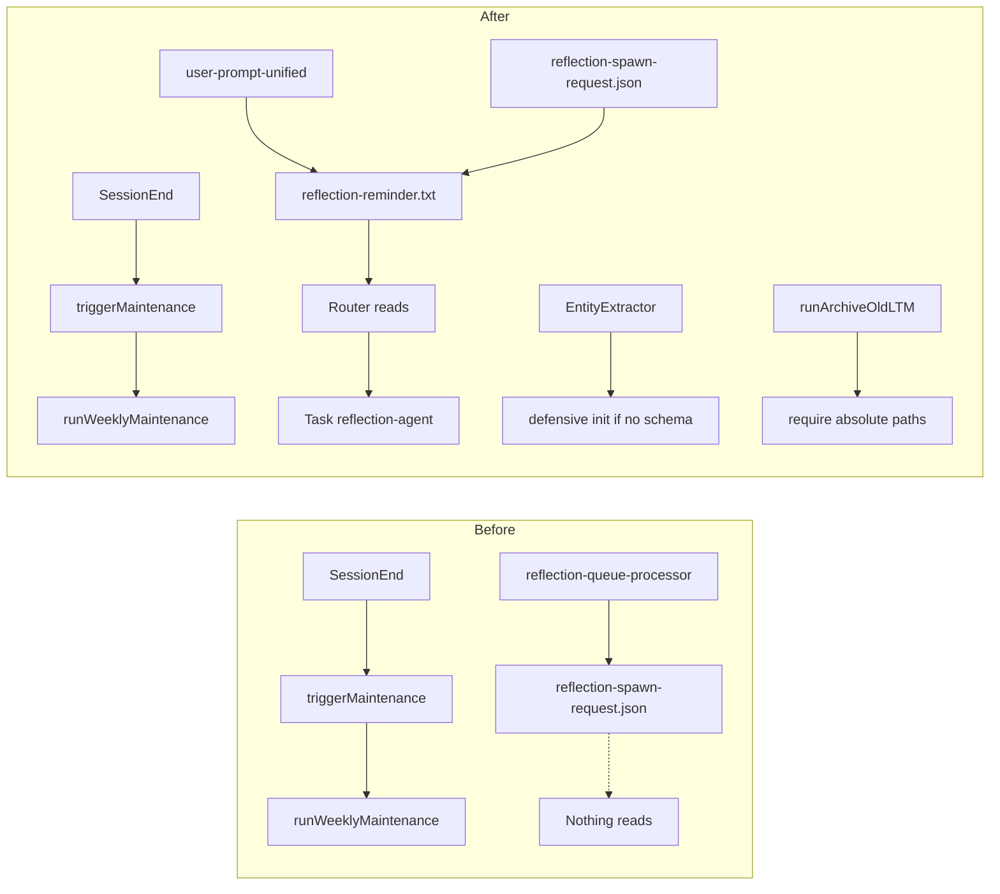

# Memory and Core Audit – Fix Plan (Detailed)

This plan addresses every finding from the deep-dive audit with specific files, line ranges, and example fixes.

---

## 1. Reflection spawn request – wire a consumer

**Finding:** [reflection-queue-processor.cjs](.claude/hooks/reflection/reflection-queue-processor.cjs) writes `.claude/context/runtime/reflection-spawn-request.json` (see `getSpawnRequestFile()` at line 55–57 and `writeSpawnRequests()` at 187–221). No code reads this file to spawn the reflection-agent.

**Approach:** Hooks cannot invoke `Task()` directly. So the consumer is the **Router**: we ensure the Router is told to check the file and spawn reflection-agent when requests exist. Two parts: (1) a hook that writes a **reminder file** the Router can see; (2) Router instructions that tell it to read the spawn request file and spawn reflection-agent when the reminder exists.

### 1.1 Add reflection-reminder write in UserPromptSubmit

**File:** [.claude/hooks/routing/user-prompt-unified.cjs](.claude/hooks/routing/user-prompt-unified.cjs)

**Where:** In `runAllChecks()` (around 867–905), after the STM write block and before building `result`, add a small block that:

1. Reads `.claude/context/runtime/reflection-spawn-request.json` (path: `path.join(PROJECT_ROOT, '.claude', 'context', 'runtime', 'reflection-spawn-request.json')`).
2. If the file exists and parses to an array with length > 0:

- Write `.claude/context/runtime/reflection-reminder.txt` with one line, e.g. `You have N pending reflection spawn request(s). Before handling the user prompt, read .claude/context/runtime/reflection-spawn-request.json and spawn reflection-agent for each request (or the first batch). Then delete this reminder file and clear/trim the spawn request file.`
- Use a small constant for `N` (e.g. `requests.length`).

3. If the file is missing or empty, remove `reflection-reminder.txt` if it exists (so we don't leave stale reminders).
4. Wrap in try/catch; non-blocking (exit 0 always).

**Example snippet (conceptual):**

```javascript
// In runAllChecks(), after stmWrite block:
const runtimeDir = path.join(PROJECT_ROOT, '.claude', 'context', 'runtime');
const spawnRequestPath = path.join(runtimeDir, 'reflection-spawn-request.json');
const reminderPath = path.join(runtimeDir, 'reflection-reminder.txt');
try {
  if (fs.existsSync(spawnRequestPath)) {
    const raw = fs.readFileSync(spawnRequestPath, 'utf8');
    const requests = (() => {
      try {
        const a = JSON.parse(raw);
        return Array.isArray(a) ? a : [];
      } catch {
        return [];
      }
    })();
    if (requests.length > 0) {
      fs.mkdirSync(runtimeDir, { recursive: true });
      fs.writeFileSync(
        reminderPath,
        `You have ${requests.length} pending reflection spawn request(s). Read .claude/context/runtime/reflection-spawn-request.json and spawn reflection-agent before handling the user prompt. Then delete this file and clear the spawn request file.\n`,
        'utf8'
      );
    } else if (fs.existsSync(reminderPath)) fs.unlinkSync(reminderPath);
  } else if (fs.existsSync(reminderPath)) fs.unlinkSync(reminderPath);
} catch (_e) {
  /* ignore */
}
```

**File format reference:** The spawn request file is a JSON array of objects with at least `id`, `subagent_type: 'reflection-agent'`, `description`, `prompt` (see [reflection-queue-processor.cjs](.claude/hooks/reflection/reflection-queue-processor.cjs) `generateSpawnRequest()` at 152–170).

### 1.2 Router instructions to consume the reminder

**File:** [.claude/CLAUDE.md](.claude/CLAUDE.md) (or the Router section / routing workflow doc that the Router loads)

**Change:** Add a short "Reflection spawn" rule in the Router protocol, e.g. under "On EVERY user prompt" or right after "TaskList()":

- If `.claude/context/runtime/reflection-reminder.txt` exists:
  1. Read `.claude/context/runtime/reflection-spawn-request.json`.
  2. For each entry (or first batch, e.g. up to 3), spawn reflection-agent via `Task({ subagent_type: 'reflection-agent', description: entry.description, prompt: entry.prompt, ... })`.
  3. Delete `reflection-reminder.txt`.
  4. After processing, truncate or clear `reflection-spawn-request.json` (or remove processed IDs so the next run doesn't re-spawn the same ones). Prefer documenting "clear the file after spawning" to keep behavior simple.

**Optional:** In [.claude/docs/MEMORY_SYSTEM.md](.claude/docs/MEMORY_SYSTEM.md) (around line 47), add one sentence: "On UserPromptSubmit, if `reflection-spawn-request.json` has entries, a reminder file is written so the Router spawns reflection-agent before handling the user prompt."

---

## 2. Weekly maintenance – document and add explicit trigger

**Finding:** Daily and weekly maintenance (including `archiveOldLTM`) run only from [unified-reflection-handler.cjs](.claude/hooks/reflection/unified-reflection-handler.cjs) `triggerMaintenance()` (lines 971–998) on **SessionEnd**. If SessionEnd rarely fires, weekly maintenance may never run.

### 2.1 Document dependency on SessionEnd

**File:** [.claude/docs/MEMORY_SYSTEM.md](.claude/docs/MEMORY_SYSTEM.md)

**Where:** Around line 117 ("Retention is enforced by the **weekly** maintenance task…").

**Change:** Add a short subsection, e.g. "When does weekly maintenance run?":

- Weekly maintenance (including `archiveOldLTM`) runs only when **SessionEnd** fires (conversation session ends). It is triggered by `unified-reflection-handler.cjs` → `triggerMaintenance()` → `memory-scheduler.cjs` `runWeeklyMaintenance()`.
- If you rarely end sessions (e.g. close IDE without ending the conversation), run maintenance manually (see below).

### 2.2 Add npm script and usage docs

**File:** [package.json](package.json)

**Where:** In `scripts`, next to `"memory:init": "node .claude/tools/cli/init-memory-db.cjs"` (line 82).

**Change:** Add:

```json
"memory:weekly": "node .claude/lib/memory/memory-scheduler.cjs weekly",
"memory:daily": "node .claude/lib/memory/memory-scheduler.cjs daily",
"memory:status": "node .claude/lib/memory/memory-scheduler.cjs status"
```

**File:** [.claude/docs/MEMORY_SYSTEM.md](.claude/docs/MEMORY_SYSTEM.md) (and optionally [README.md](README.md) or [GETTING_STARTED.md](GETTING_STARTED.md))

**Change:** In MEMORY_SYSTEM.md, in the same "When does weekly maintenance run?" subsection, add:

- To run maintenance manually: `pnpm run memory:weekly` (or `memory:daily`). To check last run: `pnpm run memory:status`.

**File:** [.claude/docs/MEMORY_OPERATIONAL_RUNBOOK.md](.claude/docs/MEMORY_OPERATIONAL_RUNBOOK.md) (lines 23–26 already mention `node .claude/lib/memory/memory-scheduler.cjs weekly`)

**Change:** Add a line that these are also available as `pnpm run memory:weekly` and `pnpm run memory:daily`.

---

## 3. SyncLayer / BackgroundSyncWorker – deprecate and document

**Finding:** [.claude/lib/memory/sync-layer.cjs](.claude/lib/memory/sync-layer.cjs) and [.claude/lib/memory/sync-worker.cjs](.claude/lib/memory/sync-worker.cjs) are not used by any hook; sync is done by [.claude/hooks/memory/sync-memory-index.cjs](.claude/hooks/memory/sync-memory-index.cjs) (PostToolUse Edit|Write|NotebookEdit).

### 3.1 Deprecation notice in code

**File:** [.claude/lib/memory/sync-layer.cjs](.claude/lib/memory/sync-layer.cjs)

**Where:** At the top of the file (after line 1 comment).

**Change:** Add a block comment:

```javascript
/**
 * @deprecated Replaced by sync-memory-index.cjs (PostToolUse hook).
 * SyncLayer assumed a long-lived Node process; Claude Code hooks are short-lived.
 * Do not use in new code. See .claude/hooks/memory/sync-memory-index.cjs.
 */
```

**File:** [.claude/lib/memory/sync-worker.cjs](.claude/lib/memory/sync-worker.cjs)

**Where:** At the top (after line 1).

**Change:** Add:

```javascript
/**
 * @deprecated SyncLayer is deprecated; BackgroundSyncWorker is not used.
 * See .claude/lib/memory/sync-layer.cjs and .claude/hooks/memory/sync-memory-index.cjs.
 */
```

### 3.2 Docs and audit doc

**File:** [.claude/docs/DEEP_DIVE_AUDIT_MEMORY_AND_CORE.md](.claude/docs/DEEP_DIVE_AUDIT_MEMORY_AND_CORE.md)

**Where:** In the FILE INVENTORY table where `sync-layer.cjs` is marked "Not used by hooks".

**Change:** Add one line: "Deprecation notice added in source; canonical sync: sync-memory-index.cjs."

**File:** [.claude/docs/MEMORY_SYSTEM.md](.claude/docs/MEMORY_SYSTEM.md)

**Where:** If SyncLayer is mentioned anywhere (e.g. in "Sync" or "Entity index" sections).

**Change:** State that the canonical sync path is the PostToolUse hook `sync-memory-index.cjs`; SyncLayer/SyncWorker are deprecated and not wired.

---

## 4. Orchestrator tool – expose in manifest and docs

**Finding:** [.claude/lib/tools/orchestrator-tool.cjs](.claude/lib/tools/orchestrator-tool.cjs) exists and uses ContextualMemory + OrchestratorService, but it is not listed in the tool manifest or CLAUDE.md, so the Router/agents do not see it as an available tool.

### 4.1 Add to tool manifest generator

**File:** [.claude/tools/cli/generate-tool-manifest.cjs](.claude/tools/cli/generate-tool-manifest.cjs)

**Where:** In the `CORE_TOOLS` array (around 39–118), add an entry after the orchestration/task tools, e.g.:

```javascript
{
  name: 'Orchestrator',
  category: 'Orchestration',
  description: 'Delegate complex task to Architect -> Developer -> QA pipeline',
  mandatory: false,
},
```

**Note:** The manifest is generated from this list; adding it here makes the tool appear in [.claude/config/tool-manifest.json](.claude/config/tool-manifest.json) after running `pnpm run manifest:generate` (or equivalent). Actual availability to the Router still depends on whether the runtime (Cursor/Claude Code) exposes tools from this manifest; document that.

### 4.2 Document in CLAUDE.md

**File:** [.claude/CLAUDE.md](.claude/CLAUDE.md)

**Where:** Section 1.4 "TOOLS REFERENCE" / "22 core tools" (or the bullet list of tools).

**Change:** Add "Orchestrator" to the list and one line: "Orchestrator – delegate complex task to Architect → Developer → QA pipeline (optional; availability depends on runtime)."

**File:** [.claude/docs/TOOL_REFERENCE.md](.claude/docs/TOOL_REFERENCE.md) (if it exists and lists tools)

**Change:** Add a short entry for Orchestrator with the same description and a note that it is implemented in `.claude/lib/tools/orchestrator-tool.cjs` and may require runtime support to be callable.

---

## 5. Memory DB init – defensive init in EntityExtractor

**Finding:** [.claude/hooks/memory/sync-memory-index.cjs](.claude/hooks/memory/sync-memory-index.cjs) calls `ensureEntityDbInitialized(dbPath)` (lines 41–61) before using EntityExtractor, so sync path is safe. However, [.claude/lib/memory/entity-extractor.cjs](.claude/lib/memory/entity-extractor.cjs) (constructor lines 22–32) opens the DB and does not create the schema; any other caller that uses EntityExtractor or EntityQuery without running init first can hit "no such table".

### 5.1 Defensive init in EntityExtractor constructor

**File:** [.claude/lib/memory/entity-extractor.cjs](.claude/lib/memory/entity-extractor.cjs)

**Where:** Constructor (lines 22–32). After resolving `dbPath` and before `this.db = new DatabaseSync(dbPath)`:

1. Ensure the directory containing `dbPath` exists (`path.dirname(dbPath)`, `fs.mkdirSync(..., { recursive: true })`).
2. After `this.db = new DatabaseSync(dbPath)` and `this.db.exec('PRAGMA foreign_keys = ON')`, check for schema: run `SELECT name FROM sqlite_master WHERE type='table' AND name='schema_version'` (or reuse the same check as sync-memory-index). If no row, call the init module: `require(path.join(__dirname, '..', '..', 'tools', 'cli', 'init-memory-db.cjs')).initializeDatabase(this.db)`.

**Example patch (constructor only):**

```javascript
constructor(dbPath) {
  if (!dbPath) {
    const projectRoot = path.resolve(__dirname, '../../../');
    dbPath = path.join(projectRoot, '.claude/data/memory.db');
  }
  const dbDir = path.dirname(dbPath);
  if (!fs.existsSync(dbDir)) {
    fs.mkdirSync(dbDir, { recursive: true });
  }
  this.db = new DatabaseSync(dbPath);
  this.db.exec('PRAGMA foreign_keys = ON');
  // Defensive init: ensure schema exists (idempotent)
  try {
    const row = this.db.prepare("SELECT name FROM sqlite_master WHERE type='table' AND name='schema_version'").get();
    if (!row) {
      const init = require(path.join(__dirname, '..', '..', 'tools', 'cli', 'init-memory-db.cjs'));
      init.initializeDatabase(this.db);
    }
  } catch (e) {
    // best-effort; caller may still get errors if init fails
  }
}
```

### 5.2 Document memory:init in GETTING_STARTED / README

**File:** [.claude/docs/MEMORY_SYSTEM.md](.claude/docs/MEMORY_SYSTEM.md) (line 33)

**Change:** Keep "Initialize schema: `pnpm run memory:init`" and add: "Run once per environment (e.g. after clone). EntityExtractor will also create the schema on first use if missing."

**File:** [README.md](README.md) or [GETTING_STARTED.md](GETTING_STARTED.md)

**Change:** In the "Memory" or "Setup" section, add one line: "Optional: run `pnpm run memory:init` once to initialize the memory DB (entity index). If skipped, the schema is created on first sync or first use of the entity index."

---

## 6. runArchiveOldLTM – use absolute require paths

**Finding:** In [.claude/lib/memory/memory-scheduler.cjs](.claude/lib/memory/memory-scheduler.cjs), `runArchiveOldLTM()` (lines 384–425) runs an inline script with `require('./.claude/lib/memory/cold-storage.cjs')` and `require('./.claude/lib/memory/memory-retention-config.cjs')`. Those resolve relative to `process.cwd()` (projectRoot) when using `-e`. If cwd or invocation context changes, this can break.

### 6.1 Interpolate absolute paths into the script

**File:** [.claude/lib/memory/memory-scheduler.cjs](.claude/lib/memory/memory-scheduler.cjs)

**Where:** Lines 395–406 (the `script` string and the `spawnSync` call).

**Change:** Before building `script`, compute absolute paths and use `JSON.stringify(coldPath)` and `JSON.stringify(configPath)` inside the script string:

```javascript
const coldPath = path.join(projectRoot, '.claude', 'lib', 'memory', 'cold-storage.cjs');
const configPath = path.join(
  projectRoot,
  '.claude',
  'lib',
  'memory',
  'memory-retention-config.cjs'
);
const script = `
  (async () => {
    const { archiveOldLTM } = require(${JSON.stringify(coldPath)});
    const { getRetentionOptions } = require(${JSON.stringify(configPath)});
    const projectRoot = process.cwd();
    const options = getRetentionOptions(projectRoot);
    const details = await archiveOldLTM(projectRoot, options);
    process.stdout.write(JSON.stringify({ success: true, details }));
  })().catch((err) => {
    process.stdout.write(JSON.stringify({ success: false, details: err && err.message ? err.message : String(err) }));
  });
`;
```

---

## 7. Second audit: "Ghost" memory system (SQLite read path unused)

**Finding:** EntityQuery and EntityExtractor _are_ imported, but the **agent-visible** memory path never uses the SQLite graph. No hook or agent calls `ContextualMemory.findEntities()` or `getRelated()`.

### 7.1 Option A: Wire EntityQuery into agent memory (recommended)

**File:** [.claude/lib/memory/memory-manager.cjs](.claude/lib/memory/memory-manager.cjs) – In `loadMemoryForContext()`, after loading gotchas/patterns/discoveries/sessions, add a best-effort block that requires EntityQuery (or ContextualMemory), calls `findByType('pattern', { limit: 5 })` and `findByType('gotcha', { limit: 5 })`, merges into returned patterns/gotchas, with try/catch fallback.

**Alternative:** In spawn-prompt-assembler or prompt-assembler, when building the memory section, fetch a small set of entities by type and append to the markdown.

### 7.2 Option B: Document SQLite as sync-only (minimal change)

**Files:** [.claude/docs/MEMORY_SYSTEM.md](.claude/docs/MEMORY_SYSTEM.md), [.claude/docs/DEEP_DIVE_AUDIT_MEMORY_AND_CORE.md](.claude/docs/DEEP_DIVE_AUDIT_MEMORY_AND_CORE.md)

**Change:** Add a short subsection stating that the entity index is used for (1) sync from learnings/decisions/issues via sync-memory-index, (2) optional graph API for future use; agent-visible memory today comes from gotchas/patterns/sessions (file/JSON) and semantic search (LanceDB).

---

## 8. Task tool – document host-provided

**File:** [.claude/CLAUDE.md](.claude/CLAUDE.md) (Section 1.4)

**Change:** Add one sentence: "The Task, TaskList, TaskCreate, TaskUpdate, TaskGet tools are provided by the host (Claude Code / Cursor / Factory Droid); they are not implemented in this repository."

---

## 9. agent:production script – fix broken entry point

**Finding:** In [package.json](package.json) line 19, `"agent:production"` has no script file; the command starts a Node REPL.

**Fix (Option A):** Create [.claude/tools/agent-production-stub.mjs](.claude/tools/agent-production-stub.mjs) that prints a single line and exits. Change the script to:

```json
"agent:production": "node --max-old-space-size=8192 .claude/tools/agent-production-stub.mjs"
```

---

## 10. agent-config-reader – replace regex with js-yaml

**File:** [.claude/lib/utils/agent-config-reader.cjs](.claude/lib/utils/agent-config-reader.cjs) – Replace regex in `parseAgentFromConfig()` with `yaml.load(content)` and read `parsed.agents[agentType]`. Move `js-yaml` from devDependencies to dependencies in [package.json](package.json).

---

## 11. routing-guard – document and optional refactor

**Change (documentation only):** In [.claude/docs/DEEP_DIVE_AUDIT_MEMORY_AND_CORE.md](.claude/docs/DEEP_DIVE_AUDIT_MEMORY_AND_CORE.md) or [.claude/docs/@ENFORCEMENT_HOOKS.md](.claude/docs/@ENFORCEMENT_HOOKS.md), add a short note that routing-guard.cjs is large and should be refactored in the future into smaller modules.

---

## 12. Structural recommendation – .claude/lib visibility (optional)

**Change (optional, long-term):** Document in DEEP_DIVE_AUDIT or ARCHITECTURE.md that Agent Studio is a configuration bundle and core logic lives in .claude/lib by design; moving to src/ is optional and high effort.

---

## 15. Third audit – Memory System & Core Fundamentals (23 issues)

This section maps all 23 issues from the "Memory System & Core Fundamentals Audit Report" to fixes.

### CATEGORY 1: Broken or unwired

- **15.1 (ISSUE 1) searchMemory / LanceDB mock fallback – HIGH:** In lancedb-client.cjs set `this._mockMode = true` when using mock embedder, expose `isMockMode()`. In contextual-memory.cjs `search()`, when mock mode, call `return await this._keywordSearch(query, { limit });` instead of returning LanceDB results.
- **15.2 (ISSUE 2) Memory scheduler no automatic trigger:** Already covered – Section 2; add doc that SessionEnd triggers scheduler via unified-reflection-handler `triggerMaintenance()`.
- **15.3 (ISSUE 3) Entity index not populated on session end:** Option A – add SessionEnd path to index MTM into SQLite; Option B – document that only learnings/decisions/issues are indexed.
- **15.4 (ISSUE 4) reflection-spawn-request no consumer:** Already covered – Section 1.
- **15.5 (ISSUE 5) Cold storage LanceDB not initialized:** In cold-storage.cjs, ensure table exists before upsert or skip indexing when unavailable.

### CATEGORY 2: Split-brain

- **15.6–15.7 (ISSUES 6–7) saveSession split-brain:** Remove `saveSession` from exports or make it throw with message to use memory-tiers; document legacy sessions/.
- **15.8 (ISSUE 8) Access tracking rate limiting:** Document in MEMORY_SYSTEM.md that updates are rate-limited (MEMORY_ACCESS_TRACKING_MIN_INTERVAL_MS).

### CATEGORY 3: Missing or incomplete

- **15.9 (ISSUE 9) ContextualMemory.findEntities requires schema:** Extend Section 5 – add defensive init in EntityQuery constructor or ContextualMemory.\_getEntityQuery() when schema missing.
- **15.10–15.15 (ISSUES 10–15):** Documentation only – ML integration, retention config env vars, embedding best-effort, SessionStart clarification, MEMORY_LTM_MAX_SUMMARIES usage, hook wiring (PostToolUse Task|TaskUpdate|Bash).

### CATEGORY 4 & 5: Performance, reliability, consistency

- **15.16 (ISSUE 16) Sync file ops:** Document as P2; no code change.
- **15.17 (ISSUE 17) Corrupted memory files:** In memory-manager.cjs catch blocks, add warning log when JSON.parse fails.
- **15.18–15.19 (ISSUES 18–19):** Document LanceDB race and health check frequency; optional cache.
- **15.20 (ISSUE 20) atomicWriteJSONSync:** In memory-tiers.cjs and memory-scheduler.cjs, use atomicWriteJSONSync for all JSON writes.
- **15.21 (ISSUE 21) Session data validation:** Optional – validate minimal shape in writeSTMEntry.
- **15.22 (ISSUE 22) vectors.db orphan:** Remove orphan or add to .gitignore and document.
- **15.23 (ISSUE 23) Test DB cleanup:** Tests use temp dir or cleanup so .claude/data/test-\*.db are not left behind.

---

## 13. Implementation order and testing

**P0:** Run 6 → 5 → 15.1 → 15.6/15.7 → 15.9 → 3 → 2 → 4 → 1 → 9 → 10 → 7 → 8 → 11 → 12 (optional).

**P1:** 15.3, 15.5, 15.11, 15.14, 15.17, 15.20.

**P2:** 15.8, 15.10, 15.12, 15.13, 15.15 (doc); 15.22, 15.23; 15.16, 15.18, 15.19, 15.21 (optional).

---

## 14. Summary diagram (current vs after fixes)



---

All items from all three audits are addressed: original six; second-audit (ghost memory, Task doc, agent:production, agent-config-reader, routing-guard, structural note); third-audit 23 issues (Section 15).
