<!-- Agent: microservices-architect | Task: #task-1 | Session: 2026-03-21 -->

# Monolith-to-Microservices Migration Architecture

A comprehensive guide for decomposing a monolithic application into a microservices architecture using Domain-Driven Design, event-driven patterns, and incremental migration strategies.

---

## Table of Contents

1. [Decision Framework: Should This Be a Microservice?](#1-decision-framework)
2. [Assessment Framework](#2-assessment-framework)
3. [Decomposition Strategy](#3-decomposition-strategy)
4. [Architecture Patterns](#4-architecture-patterns)
5. [Infrastructure](#5-infrastructure)
6. [Migration Roadmap](#6-migration-roadmap)
7. [Anti-Patterns to Avoid](#7-anti-patterns-to-avoid)
8. [Appendix: Architecture Decision Records](#appendix-architecture-decision-records)

---

## 1. Decision Framework

Before beginning any migration, answer this question honestly: **should this system even be microservices?**

### The Microservice Litmus Test

| Criterion | Threshold for Microservices | Stay Monolith If... |
|---|---|---|
| Team size | 3+ teams (>15 engineers) working on the same codebase | Single team (<8 engineers) can own the whole system |
| Deployment frequency | Different components need independent release cycles | Whole system deploys together weekly and that is acceptable |
| Scalability needs | Components have 10x+ difference in resource demands | Uniform load across all features |
| Fault isolation | A failure in one area must not crash unrelated areas | Acceptable for the whole system to restart on failure |
| Technology diversity | Components benefit from different languages/runtimes | Single language/runtime serves all needs |
| Domain complexity | Multiple distinct business domains with separate language | Single cohesive domain with shared vocabulary |
| Organizational autonomy | Teams need to deploy without cross-team coordination | Coordination overhead is low and acceptable |

### Scoring Model

Assign 0-3 points per criterion (0 = no need, 3 = critical need). Sum the scores:

| Score | Recommendation |
|---|---|
| 0-7 | **Stay monolith.** Invest in modular monolith architecture instead. |
| 8-13 | **Consider selective extraction.** Extract 1-3 services for the highest-scoring criteria. |
| 14-21 | **Full microservices migration justified.** Follow the roadmap below. |

### The Modular Monolith Alternative

If the score is below 14, a modular monolith provides 80% of the benefits at 20% of the cost:

```
Modular Monolith
+--------------------------------------------------+
|  [User Module]  [Order Module]  [Payment Module]  |
|       |              |               |            |
|  +----v--------------v---------------v--------+   |
|  |          Internal Event Bus                |   |
|  +--------------------------------------------+   |
|  |          Shared Database (with schemas)    |   |
|  +--------------------------------------------+   |
+--------------------------------------------------+
```

Each module has:
- Its own database schema (no cross-module table joins)
- Communication via an internal event bus or well-defined interfaces
- Clear package/namespace boundaries enforced by linting rules

This is the recommended first step even for teams that will eventually migrate to microservices.

---

## 2. Assessment Framework

### 2.1 Coupling Analysis

Before decomposing, measure how tangled the monolith is.

**Static Analysis (Code-Level Coupling)**

1. **Import/dependency graph**: Map which packages import which. Tools: jdepend (Java), madge (Node.js), pydeps (Python).
2. **Afferent coupling (Ca)**: How many other modules depend on this module? High Ca = dangerous to change.
3. **Efferent coupling (Ce)**: How many modules does this module depend on? High Ce = fragile.
4. **Instability ratio**: I = Ce / (Ca + Ce). Modules with I near 0 are stable foundations. Modules with I near 1 are volatile and should be extracted first.

**Runtime Analysis (Behavioral Coupling)**

1. **Co-change frequency**: Which files change together in the same commits? Use `git log --follow` analysis. Files that always change together belong in the same service.
2. **Call frequency**: Profile production traffic. Which modules call each other most? High call frequency between two modules = keep together or use async communication.
3. **Data sharing**: Which modules read/write the same database tables? Shared tables = shared ownership = coupling.

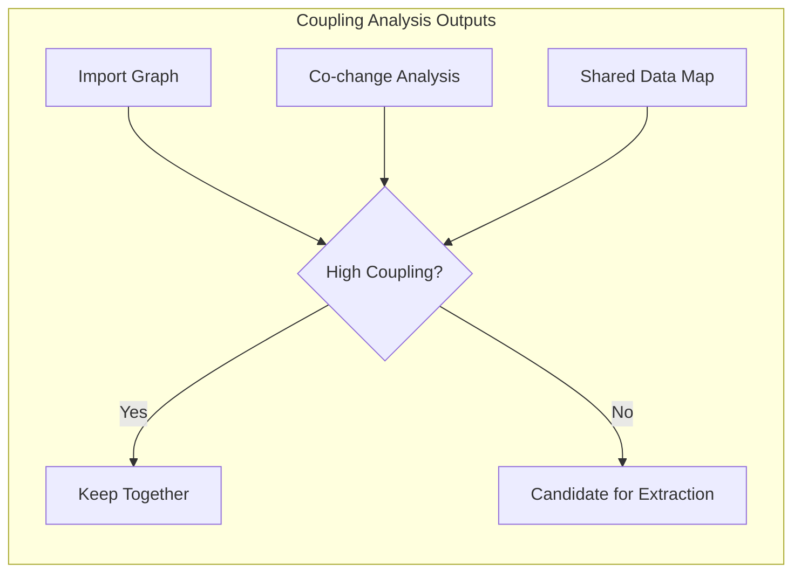

### 2.2 Domain Boundary Identification

Use **Event Storming** to discover natural boundaries:

**Step 1: Domain Events (Orange Sticky Notes)**

Identify everything that happens in the system using past tense:

- OrderPlaced, PaymentReceived, ShipmentDispatched
- UserRegistered, PasswordReset, AccountSuspended
- InventoryReserved, StockDepleted, ReorderTriggered

**Step 2: Commands (Blue Sticky Notes)**

What triggers each event?

- PlaceOrder -> OrderPlaced
- ProcessPayment -> PaymentReceived
- DispatchShipment -> ShipmentDispatched

**Step 3: Aggregates (Yellow Sticky Notes)**

Group commands and events around the entity they modify:

- Order aggregate: PlaceOrder, CancelOrder, OrderPlaced, OrderCancelled
- Payment aggregate: ProcessPayment, RefundPayment, PaymentReceived, PaymentRefunded

**Step 4: Bounded Contexts (Pink Boundary Lines)**

Draw boundaries where the ubiquitous language changes:

- "Customer" in Sales means "a person who buys things"
- "Customer" in Shipping means "a delivery address"
- "Customer" in Billing means "a payment profile"

These are three different bounded contexts, even though they share the word "Customer."

**Step 5: Context Map**

Document how bounded contexts relate:

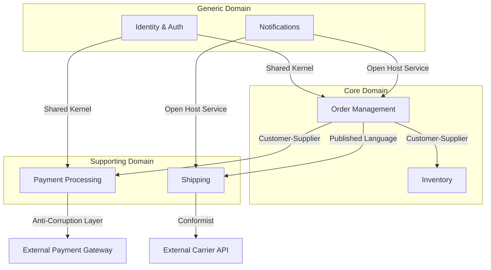

### 2.3 Data Ownership Mapping

For every database table, answer:

1. **Who writes?** Only one service should write to a table.
2. **Who reads?** Multiple services may read, but through APIs or events, not direct queries.
3. **What is the consistency requirement?** Strong consistency (same service) or eventual consistency (cross-service)?

| Table | Current Writers | Current Readers | Proposed Owner | Migration Strategy |
|---|---|---|---|---|
| users | auth, profile, admin | everyone | Identity Service | Extract first |
| orders | checkout, admin, fulfillment | reporting, shipping | Order Service | Strangler Fig |
| inventory | purchasing, warehouse, returns | checkout, reporting | Inventory Service | Event-carried state |
| payments | checkout, billing, refunds | reporting, admin | Payment Service | Anti-corruption layer |

**Rule**: If a table has multiple writers from different domains, that table must be split or ownership must be consolidated before extraction.

---

## 3. Decomposition Strategy

### 3.1 Bounded Context to Service Mapping

**One bounded context = one service.** Never split a bounded context across services. Never merge two bounded contexts into one service.

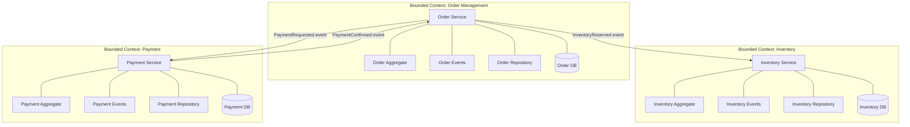

### 3.2 Subdomain Classification

Invest differently based on subdomain type:

| Subdomain Type | Characteristics | Investment Level | Build vs. Buy |
|---|---|---|---|
| **Core** | Competitive advantage, unique to your business | Maximum: best engineers, custom code, event sourcing | Build |
| **Supporting** | Necessary but not differentiating | Moderate: solid engineering, standard patterns | Build (simpler) |
| **Generic** | Same across all businesses (auth, email, payments) | Minimum: use off-the-shelf, SaaS, or open source | Buy/Integrate |

### 3.3 Migration Pattern Selection

#### Strangler Fig Pattern (Recommended Default)

Incrementally replace monolith functionality by routing requests to new services while the monolith continues to run.

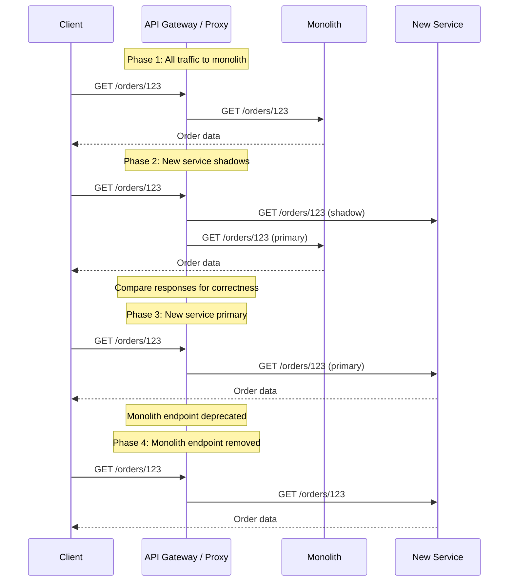

**When to use**: Default choice. Low risk, incremental, reversible at each phase.

#### Branch by Abstraction

Introduce an abstraction layer inside the monolith, implement the new service behind it, and switch implementations.

```
Monolith Code
     |
     v
[Abstraction Interface]
     |
     +--- [Old Implementation (monolith code)]
     |
     +--- [New Implementation (calls microservice)]
           |
           v
      [New Service]
```

**When to use**: When the monolith code is too tangled for clean routing (deeply embedded business logic).

#### Big Bang (Avoid)

Rewrite everything at once and switch over.

**When to use**: Almost never. Only justified when the monolith is so broken that incremental migration would cost more than rewriting. Requires extremely high test coverage and a rollback plan.

### 3.4 Recommended Phased Approach

**Phase 0** -> Prepare (Modular Monolith)
**Phase 1** -> Extract first service (lowest risk)
**Phase 2** -> Extract core domain services
**Phase 3** -> Decommission monolith

Details in Section 6 (Migration Roadmap).

---

## 4. Architecture Patterns

### 4.1 Inter-Service Communication

#### Synchronous Communication

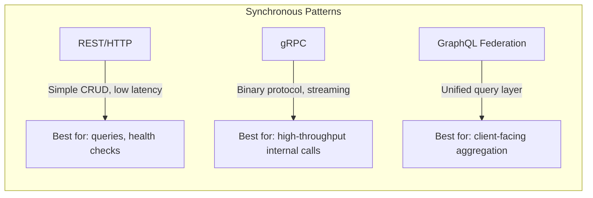

**REST/HTTP**
- Use for: simple CRUD operations, health checks, external-facing APIs
- Version with URI prefixes: `/v1/orders`, `/v2/orders`
- Always set timeouts (default: 5s for internal, 30s for external)
- Return proper HTTP status codes (never 200 for errors)

**gRPC**
- Use for: high-throughput internal service-to-service calls
- Protobuf schemas enforce backward compatibility
- Built-in streaming (unary, server-streaming, client-streaming, bidirectional)
- Health checking protocol built-in

**GraphQL Federation**
- Use for: client-facing API that aggregates data from multiple services
- Each service owns its subgraph
- Apollo Router or similar federates into a supergraph
- Avoid for service-to-service communication (too much overhead)

#### Asynchronous Communication (Preferred for Decoupling)

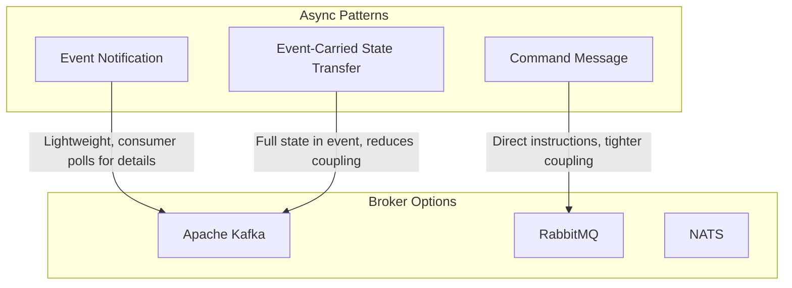

**Event Notification** (Preferred for most cases)
```json
{
  "eventType": "OrderPlaced",
  "eventId": "evt-abc123",
  "timestamp": "2026-03-21T10:00:00Z",
  "aggregateId": "order-456",
  "aggregateType": "Order",
  "payload": {
    "orderId": "order-456",
    "customerId": "cust-789"
  }
}
```
Consumer receives the event and calls back to the Order Service API if it needs full details.

**Event-Carried State Transfer** (For maximum decoupling)
```json
{
  "eventType": "OrderPlaced",
  "eventId": "evt-abc123",
  "timestamp": "2026-03-21T10:00:00Z",
  "payload": {
    "orderId": "order-456",
    "customerId": "cust-789",
    "items": [
      { "productId": "prod-001", "quantity": 2, "price": 29.99 }
    ],
    "totalAmount": 59.98,
    "shippingAddress": {
      "street": "123 Main St",
      "city": "Springfield",
      "zip": "62704"
    }
  }
}
```
Consumer has all the data it needs. No callback required. Maximum autonomy.

**Communication Pattern Decision Matrix**

| Factor | Sync (REST/gRPC) | Async (Event-Driven) |
|---|---|---|
| Temporal coupling | High (caller waits) | None (fire and forget) |
| Data consistency | Strong (immediate) | Eventual |
| Failure handling | Caller must handle timeouts | Broker handles retry/DLQ |
| Scalability | Limited by slowest participant | Independent scaling |
| Debugging | Easier (request/response trace) | Harder (distributed trace required) |
| Latency | Lower for single hops | Higher (queue processing time) |

**Default recommendation**: Use async event-driven communication for all cross-service state changes. Use sync REST/gRPC only for queries where the caller needs an immediate response and eventual consistency is not acceptable.

### 4.2 API Gateway Pattern

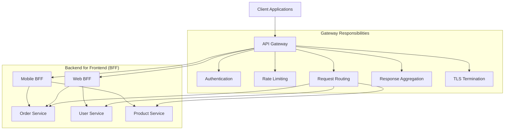

**Gateway responsibilities (do)**:
- Authentication and authorization (JWT validation)
- Rate limiting and throttling
- Request routing and load balancing
- TLS termination
- Request/response transformation (versioning)
- Response aggregation for simple cases

**Gateway responsibilities (do NOT)**:
- Business logic (belongs in services)
- Data transformation beyond simple mapping
- Stateful session management
- Database access

**BFF Pattern**: When web and mobile clients need fundamentally different API shapes, create a Backend for Frontend per client type. Each BFF aggregates and transforms data for its specific client.

### 4.3 Data Management

#### Database per Service (Iron Law)

Every service owns its database exclusively. No shared databases.

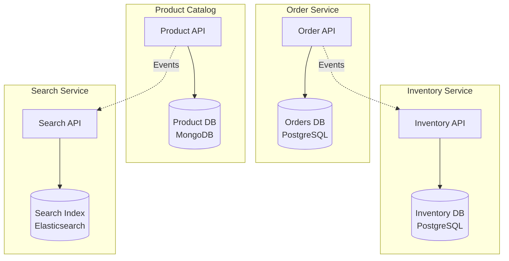

**Polyglot persistence**: Each service chooses the database technology that best fits its data model. Orders need ACID transactions (PostgreSQL). Product catalog needs flexible schemas (MongoDB). Search needs full-text indexing (Elasticsearch).

#### Saga Pattern for Distributed Transactions

When a business operation spans multiple services, use the Saga pattern instead of distributed transactions (2PC).

**Choreography-Based Saga** (2-4 steps, simple flows)

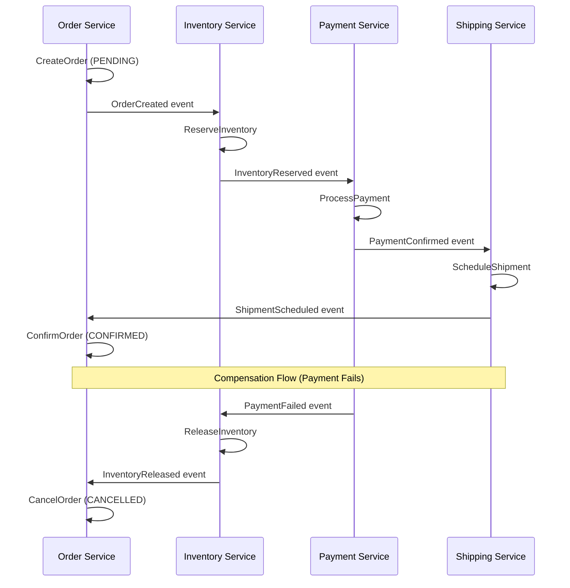

**Orchestration-Based Saga** (5+ steps, complex flows)

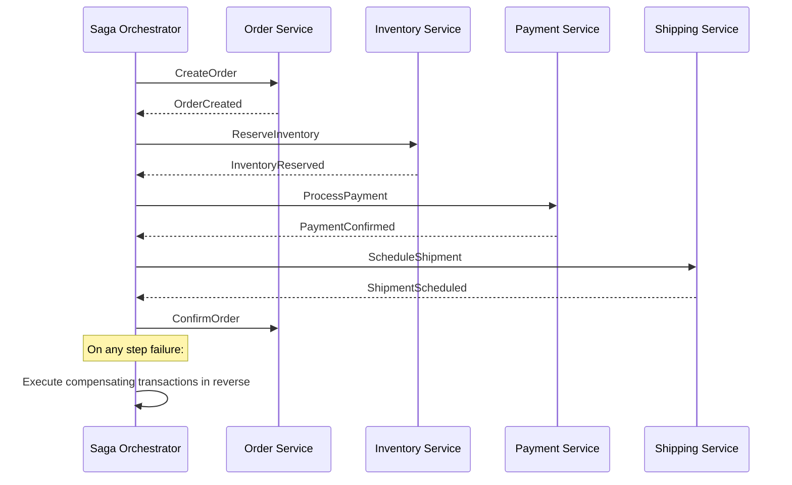

**Saga Decision Matrix**

| Criteria | Choreography | Orchestration |
|---|---|---|
| Number of steps | 2-4 (simple) | 5+ (complex) |
| Error handling | Compensating events (distributed) | Central compensation (easier to reason about) |
| Observability | Harder (trace across services) | Easier (single coordinator has full view) |
| Coupling | Lower (services react to events) | Higher (orchestrator knows all participants) |
| Team coordination | Less (each team owns their handler) | More (orchestrator team must coordinate) |
| Testing | Integration tests across services | Unit test the orchestrator state machine |
| Recommended when | Simple, linear flows | Complex branching, conditional logic, timeouts |

#### CQRS (Command Query Responsibility Segregation)

Separate the write model (optimized for consistency) from the read model (optimized for queries).

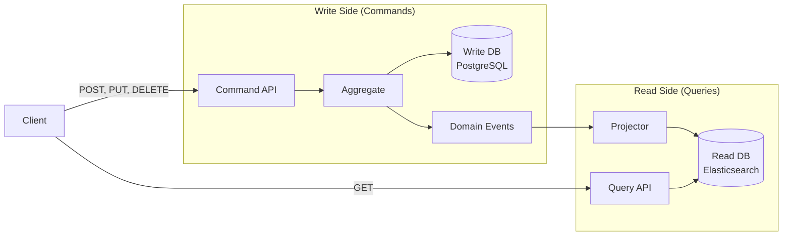

**When to use CQRS**:
- Read and write workloads have vastly different scaling needs
- Complex queries that don't map well to the write model
- Need for multiple read projections (search, analytics, reporting)
- Combined with Event Sourcing for full audit trail

**When NOT to use CQRS**:
- Simple CRUD with uniform read/write patterns
- Small datasets where a single model suffices
- Team lacks experience with eventual consistency

#### Event Sourcing

Store state as an append-only log of domain events instead of mutable rows.

```
Event Store for Order #456:
+----+-------------------+----------------------+------------------+
| #  | Event Type        | Payload              | Timestamp        |
+----+-------------------+----------------------+------------------+
| 1  | OrderCreated      | {items: [...]}       | 2026-03-21T10:00 |
| 2  | PaymentReceived   | {amount: 59.98}      | 2026-03-21T10:01 |
| 3  | ItemShipped        | {trackingId: "T123"} | 2026-03-22T14:00 |
| 4  | OrderDelivered     | {signature: "JD"}    | 2026-03-24T09:30 |
+----+-------------------+----------------------+------------------+

Current state = replay events 1-4:
{
  "orderId": "456",
  "status": "delivered",
  "items": [...],
  "payment": { "amount": 59.98, "status": "captured" },
  "shipping": { "trackingId": "T123", "delivered": true }
}
```

**Benefits**: Full audit trail, temporal queries ("what was the order state at 2pm?"), event replay for rebuilding read models, natural fit with event-driven architecture.

**Costs**: Higher complexity, eventual consistency, snapshot management needed for long event streams.

#### Outbox Pattern (Guaranteed Event Publication)

Ensure events are published atomically with database writes.

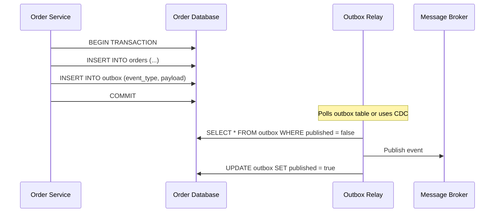

**Why this matters**: Without the outbox pattern, you risk either publishing an event without persisting the state change (if the DB transaction fails after publishing) or persisting without publishing (if the broker is down). The outbox pattern makes both operations atomic.

### 4.4 Service Discovery and Load Balancing

| Pattern | How It Works | Best For |
|---|---|---|
| **Client-side discovery** | Client queries a registry (Eureka, Consul), caches endpoints, load-balances locally | Non-Kubernetes environments, fine-grained control |
| **Server-side discovery** | Client calls a load balancer (ELB, NGINX), which routes to healthy instances | Simple setups, cloud-native load balancers |
| **DNS-based (Kubernetes)** | Kubernetes DNS resolves `service-name.namespace.svc.cluster.local` | Kubernetes-native deployments (recommended) |
| **Service mesh sidecar** | Envoy/Linkerd proxy handles discovery, load balancing, and mTLS transparently | Complex environments needing cross-cutting concerns |

**Recommendation**: If running on Kubernetes, use Kubernetes-native DNS service discovery. Add a service mesh only when you need mTLS, traffic management, or advanced observability across 10+ services.

---

## 5. Infrastructure

### 5.1 Container Orchestration (Kubernetes)

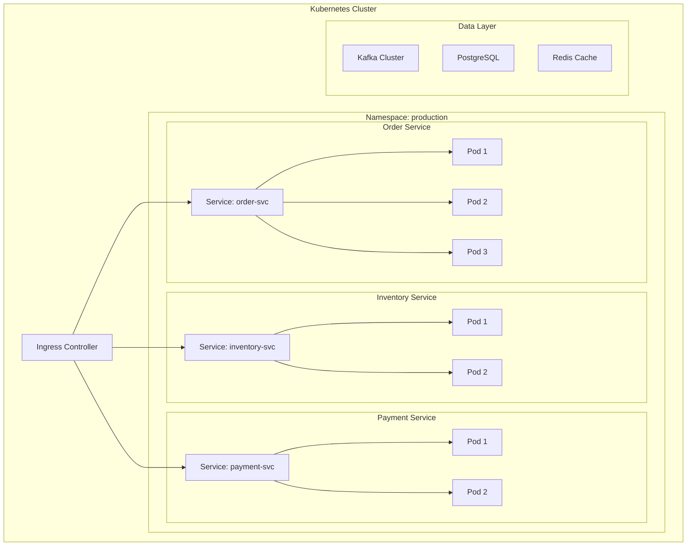

**Key Kubernetes Patterns**:

- **Horizontal Pod Autoscaler (HPA)**: Scale pods based on CPU, memory, or custom metrics
- **Pod Disruption Budgets**: Ensure minimum availability during rolling updates
- **Resource Limits**: Always set CPU/memory requests and limits (prevent noisy neighbors)
- **Liveness and Readiness Probes**: Distinguish "process alive" from "ready to serve traffic"
- **ConfigMaps and Secrets**: Externalize configuration from container images
- **Network Policies**: Restrict pod-to-pod communication to only what is necessary

### 5.2 CI/CD Pipeline for Independent Deployability

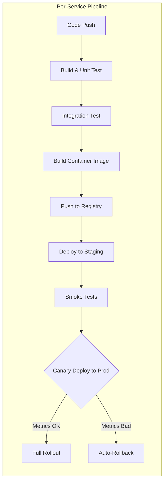

**Pipeline Principles**:

1. **Independent pipelines per service**: Each service has its own pipeline triggered by changes in its directory.
2. **Contract testing**: Every pipeline runs consumer-driven contract tests (Pact) to verify it does not break other services.
3. **Canary deployments**: Route 5% of traffic to the new version. Monitor error rates for 10 minutes. Auto-rollback if error rate > 1%.
4. **Blue-green deployments**: For high-risk changes, run two full environments and switch traffic atomically.
5. **Feature flags**: Decouple deployment from release. Deploy code to production behind a flag, enable for specific users.

**Monorepo vs. Polyrepo**:

| Approach | Pros | Cons | Recommended When |
|---|---|---|---|
| Monorepo | Atomic cross-service changes, shared tooling, easier refactoring | Build system complexity, all-or-nothing CI triggers without smart filtering | <20 services, shared libraries, strong platform team |
| Polyrepo | Independent pipelines, clear ownership, simple CI per repo | Cross-service changes require coordination, dependency management harder | >20 services, autonomous teams, different tech stacks |

### 5.3 Observability Stack

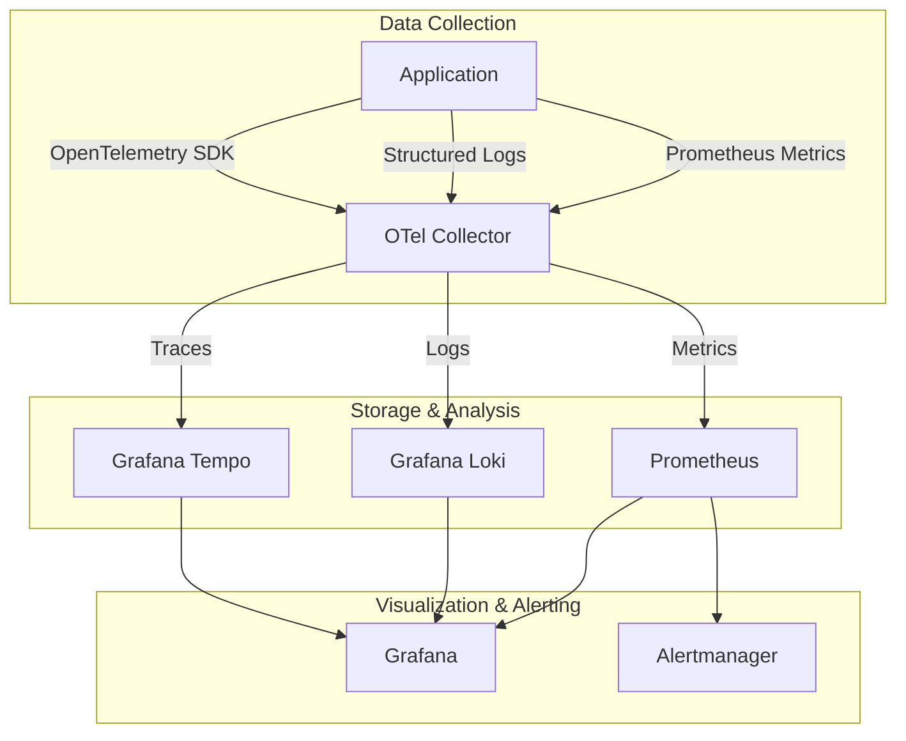

**Three Pillars of Observability**:

**1. Distributed Tracing (OpenTelemetry)**
- Propagate W3C Trace Context headers across all service calls (HTTP and messaging)
- Every service adds spans with relevant attributes (order ID, user ID, operation name)
- Trace sampling: 100% for errors, 10% for normal traffic in production
- Tail-based sampling recommended (decide to keep trace after seeing the outcome)

**2. Structured Logging**
- JSON format with correlation IDs (trace ID, span ID, request ID)
- Log levels: ERROR (action needed), WARN (degradation), INFO (business events), DEBUG (development only)
- Never log PII, secrets, or credit card numbers
- Include: timestamp, service name, version, trace ID, span ID, log level, message, structured fields

**3. Metrics (RED + USE)**

| Signal | Metric | Alert Threshold | Meaning |
|---|---|---|---|
| **R**ate | `http_requests_total` | > 2x baseline for 10m | Traffic spike or attack |
| **E**rrors | `http_errors_total / http_requests_total` | > 1% for 5m | Service degradation |
| **D**uration | `http_request_duration_seconds` (p99) | > 500ms for 5m | Latency regression |
| **U**tilization | CPU, memory, connection pool usage | > 80% for 10m | Capacity pressure |
| **S**aturation | Queue depth, thread pool exhaustion | > 90% for 5m | Approaching overload |
| **E**rrors (system) | OOM kills, disk full, connection refused | Any occurrence | Infrastructure failure |

### 5.4 Service Mesh Decision Criteria

**When to adopt a service mesh (Istio/Linkerd)**:

| Criterion | Adopt If... | Skip If... |
|---|---|---|
| Service count | >10 services with complex traffic patterns | <10 services with simple routing |
| mTLS requirement | Mandatory encryption between all services | Network-level encryption (VPC) is sufficient |
| Traffic management | Need canary, A/B testing, fault injection | Simple load balancing is sufficient |
| Observability | Need transparent distributed tracing without code changes | Teams can instrument with OpenTelemetry SDKs |
| Multi-team | Multiple teams need consistent cross-cutting policies | Single platform team manages everything |

**Istio vs. Linkerd**:

| Factor | Istio | Linkerd |
|---|---|---|
| Complexity | Higher (more features, more config) | Lower (simpler, opinionated defaults) |
| Resource overhead | ~100-200MB per sidecar | ~10-20MB per sidecar (Rust proxy) |
| Feature set | Traffic management, security, observability, extensibility | mTLS, observability, traffic splitting |
| Learning curve | Steeper (CRDs, Envoy config, Virtual Services) | Gentler (annotations, sensible defaults) |
| Best for | Large organizations needing extensive traffic control | Teams wanting quick mTLS and observability wins |

**Recommendation**: Start with Linkerd for mTLS and basic observability. Migrate to Istio only if you need advanced traffic management (fault injection, complex routing rules, rate limiting at the mesh level).

---

## 6. Migration Roadmap

### Phase 0: Prepare the Monolith (4-8 weeks)

**Goal**: Make the monolith ready for extraction without changing external behavior.

**Step 0.1: Modularize the Monolith**

```
Before:
monolith/
  src/
    controllers/
    services/
    repositories/
    models/

After:
monolith/
  src/
    modules/
      orders/
        controllers/
        services/
        repositories/
        models/
        OrderModule.ts
      inventory/
        controllers/
        services/
        repositories/
        models/
        InventoryModule.ts
      payments/
        ...
```

- Reorganize code by bounded context, not by technical layer
- Enforce module boundaries with linting rules (no cross-module imports except through public interfaces)
- Each module exposes a facade/interface that other modules call

**Step 0.2: Add Integration Tests at Seams**

For every module boundary (the "seam" where extraction will happen):

1. Write contract tests that verify the module's public interface behavior
2. Write integration tests that cover cross-module workflows
3. These tests become the acceptance criteria for the extracted service

**Step 0.3: Introduce an Internal Event Bus**

Before extracting services, introduce asynchronous communication inside the monolith:

```typescript
// Before: direct function call
class OrderService {
  placeOrder(order: Order) {
    this.inventoryService.reserve(order.items); // direct call
    this.paymentService.charge(order.total);    // direct call
  }
}

// After: event-based (still in-process)
class OrderService {
  placeOrder(order: Order) {
    this.save(order);
    this.eventBus.publish(new OrderPlaced(order)); // async in-process
  }
}

class InventoryHandler {
  @OnEvent('OrderPlaced')
  handleOrderPlaced(event: OrderPlaced) {
    this.inventoryService.reserve(event.order.items);
  }
}
```

This prepares the codebase for extraction: when you extract a service, you replace the in-process event bus with a real message broker.

**Step 0.4: Set Up Infrastructure**

- Deploy Kubernetes cluster (or validate existing)
- Set up container registry
- Configure CI/CD pipeline template for microservices
- Deploy message broker (Kafka/RabbitMQ)
- Set up observability stack (OpenTelemetry + Grafana)
- Set up API Gateway

**Rollback strategy**: Phase 0 changes are internal refactoring. Rollback = revert commits. No external behavior changes.

---

### Phase 1: Extract First Service (4-6 weeks)

**Goal**: Prove the migration pattern works with the lowest-risk bounded context.

**Choosing the first service**: Pick the bounded context that is:
- Least coupled to other modules (fewest cross-module dependencies)
- Has the simplest data model (fewest shared tables)
- Is a supporting or generic subdomain (not core business logic)
- Has good test coverage

Common first extractions: Notifications, User Profiles, Product Catalog.

**Step 1.1: Strangler Fig Setup**

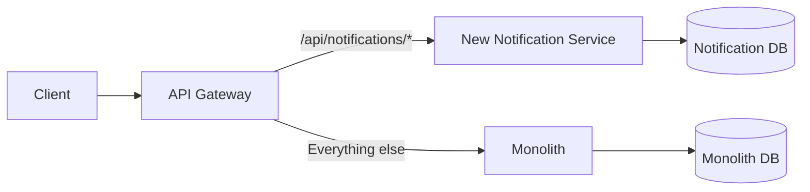

1. Deploy the new service alongside the monolith
2. Configure API Gateway to route specific paths to the new service
3. Keep the monolith endpoint active as fallback

**Step 1.2: Data Migration**

1. Copy relevant tables to the new service's database
2. Set up Change Data Capture (CDC) from monolith DB to new service DB during transition
3. Once all traffic goes through the new service, stop CDC and remove old tables

**Step 1.3: Shadow Traffic**

1. Route 100% of traffic to the monolith (primary)
2. Mirror 100% of traffic to the new service (shadow)
3. Compare responses for correctness (log discrepancies, do not return shadow responses to clients)
4. Fix discrepancies until shadow matches primary for 48+ hours

**Step 1.4: Traffic Cutover**

1. Route 5% of traffic to the new service (canary)
2. Monitor error rates, latency, and correctness for 24 hours
3. If healthy: increase to 25%, then 50%, then 100%
4. If unhealthy at any stage: route back to monolith immediately

**Step 1.5: Cleanup**

1. Remove the notification code from the monolith
2. Remove the old database tables (after backup)
3. Update cross-module references to use the new service's API or events

**Rollback strategy**: API Gateway routes all traffic back to monolith. New service continues running but receives no traffic. No data loss because monolith DB is still intact.

---

### Phase 2: Extract Core Services (3-6 months)

**Goal**: Extract the core domain services that provide competitive advantage.

**Extraction order** (based on coupling analysis from Phase 0):

1. **Order Management** (core domain, central to business)
2. **Inventory** (supporting, feeds into order management)
3. **Payment** (supporting, interacts with external gateways)
4. **Shipping** (supporting, mostly external integrations)

For each extraction, follow the same pattern as Phase 1 (strangler fig, shadow traffic, canary, cutover).

**Additional concerns for core domain extraction**:

- **Saga implementation**: Order placement now spans multiple services. Implement saga coordination (choreography for simple flows, orchestration for complex ones).
- **Data consistency**: Accept eventual consistency. Design UIs to show "processing" states. Implement idempotency keys for all cross-service operations.
- **Event schema evolution**: Use Avro or Protobuf with a schema registry. Enforce backward compatibility (new fields are optional, old fields are never removed).

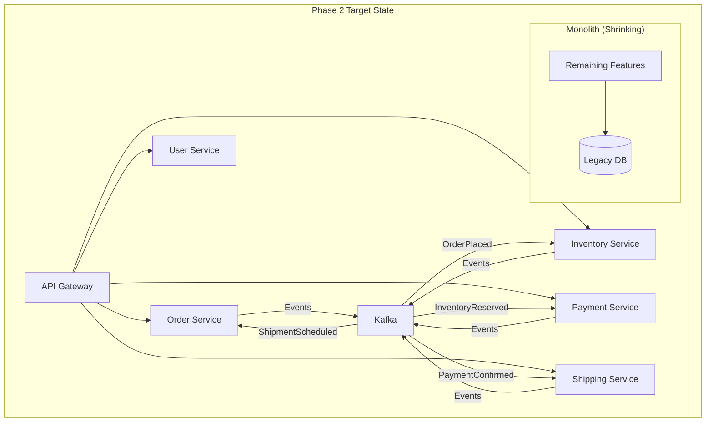

**Rollback strategy**: Each service extraction is independent. If an extraction fails, revert that specific service's traffic to the monolith. Other extracted services continue running.

---

### Phase 3: Decommission Monolith (2-4 months)

**Goal**: Remove the monolith entirely.

**Step 3.1: Identify Remaining Functionality**

Audit what is left in the monolith:
- Admin dashboards
- Batch jobs and scheduled tasks
- Legacy integrations
- Reporting queries

**Step 3.2: Extract or Replace**

| Remaining Feature | Strategy |
|---|---|
| Admin dashboard | Replace with new admin service or off-the-shelf admin tool |
| Batch jobs | Extract to dedicated worker services or serverless functions |
| Legacy integrations | Anti-corruption layer in a new integration service |
| Reporting | CQRS read models or dedicated analytics service |

**Step 3.3: Final Cutover**

1. Route zero traffic to the monolith
2. Keep monolith running in read-only mode for 30 days (safety net)
3. After 30 days with zero traffic: decommission monolith infrastructure
4. Archive monolith codebase (do not delete)

**Rollback strategy**: Monolith infrastructure remains available in read-only mode for 30 days. If a critical issue is discovered, re-enable monolith endpoints via API Gateway routing.

---

## 7. Anti-Patterns to Avoid

### 7.1 Distributed Monolith

**Symptom**: All services must be deployed together. A change in one service requires changes in multiple other services. Services share a database.

**Root cause**: Services were split by technical layer (API service, business logic service, data service) instead of by business capability.

**Fix**: Re-evaluate bounded contexts. Merge services that always change together. Enforce database-per-service.

```
WRONG (Distributed Monolith):
[API Layer Service] --> [Business Logic Service] --> [Data Layer Service] --> [Shared DB]

RIGHT (Business Capability):
[Order Service + API + Logic + DB]
[Inventory Service + API + Logic + DB]
[Payment Service + API + Logic + DB]
```

### 7.2 Shared Database

**Symptom**: Multiple services read/write the same database tables. Schema changes require coordinated deployments.

**Root cause**: Data ownership was not established during decomposition.

**Fix**: Each service owns its tables exclusively. Other services access data through APIs or events, never through direct database queries.

### 7.3 Synchronous Dependency Chains

**Symptom**: Service A calls Service B, which calls Service C, which calls Service D. If any service is slow or down, the entire chain fails.

```
WRONG (Synchronous Chain):
Client --> A --> B --> C --> D
         5s    3s   2s   1s
Total latency: 11s, failure if ANY service is down

RIGHT (Async with Local Data):
Client --> A (has cached data from B, C, D via events)
Total latency: 50ms, resilient to B/C/D downtime
```

**Fix**: Use event-carried state transfer. Each service maintains a local projection of the data it needs from other services, updated via events.

### 7.4 Premature Decomposition

**Symptom**: Extracting services before understanding the domain. Service boundaries are wrong and need frequent refactoring. Teams spend more time on inter-service coordination than on business features.

**Root cause**: Skipped domain analysis (Event Storming, bounded context mapping).

**Fix**: Start with a modular monolith. Run the system in production for 3-6 months. Let the domain boundaries emerge from real usage patterns and team structures. Only then extract services.

### 7.5 Chatty Services

**Symptom**: A single user request generates 50+ inter-service calls. Latency is high and unpredictable.

**Root cause**: Services are too fine-grained (nanoservices). Operations that should be atomic are split across multiple services.

**Fix**: Merge chatty services that always communicate together. Use the CQRS pattern to create dedicated read models that aggregate data from multiple sources, avoiding runtime aggregation.

### 7.6 No Idempotency

**Symptom**: Retrying a failed operation creates duplicate records, double charges, or inconsistent state.

**Root cause**: Operations are not designed to be safely retried.

**Fix**: Every operation that can be retried must be idempotent. Use idempotency keys:

```
POST /payments
Idempotency-Key: pay-abc-123-attempt-1
Body: { "orderId": "order-456", "amount": 59.98 }

// First call: processes payment, returns 201
// Retry (same key): returns cached 201 result, does NOT charge again
```

### 7.7 Missing Circuit Breakers

**Symptom**: One failing service cascades failures to all upstream services. The entire system goes down because of one broken dependency.

**Fix**: Implement circuit breakers at every service boundary:

```yaml
circuit_breaker:
  payment_service:
    failure_threshold: 5        # Open after 5 failures
    success_threshold: 3        # Close after 3 successes in half-open
    timeout_ms: 30000           # Wait 30s before trying half-open
    monitoring_window_ms: 60000 # Track failures within 60s window
    fallback: "return cached payment status or queue for retry"
```

States: Closed (normal) -> Open (failing fast, return fallback) -> Half-Open (testing recovery with limited traffic).

---

## Appendix: Architecture Decision Records

### ADR-001: Migration Strategy Selection

**Context**: The monolith has grown beyond a single team's ability to maintain and deploy safely. Deployment frequency is limited by cross-team coordination.

**Decision**: Use the Strangler Fig pattern for incremental migration.

**Rationale**: Big Bang rewrites have a >70% failure rate (industry data). Strangler Fig allows incremental value delivery, reversible phases, and parallel operation of old and new systems.

**Consequences**:
- Longer total migration timeline (12-18 months vs. 6-9 months for Big Bang)
- Must maintain both systems during transition (increased operational cost)
- Lower risk per phase (each phase is independently reversible)
- Teams can learn microservices patterns incrementally

**Alternatives rejected**:
- Big Bang rewrite: Too risky for a production system with active users
- Branch by Abstraction: Adds complexity inside the monolith; harder to reason about

---

### ADR-002: Async-First Communication

**Context**: Services need to communicate about state changes. Choosing between synchronous (REST/gRPC) and asynchronous (event-driven) as the default.

**Decision**: Default to asynchronous event-driven communication for all cross-service state changes. Use synchronous REST/gRPC only for queries where the caller needs an immediate response.

**Rationale**: Asynchronous communication eliminates temporal coupling (caller does not wait for callee), provides natural buffering under load, enables event replay for recovery, and allows services to be independently deployable and scalable.

**Consequences**:
- Eventual consistency is the default (must design UIs and business logic accordingly)
- Requires a message broker (Kafka/RabbitMQ) as infrastructure
- Debugging is harder (distributed traces required)
- Event schema management becomes critical (schema registry required)

**Alternatives rejected**:
- Sync-first: Creates cascading failure risk and temporal coupling
- Mixed without default: Teams will default to sync (easier) and create coupling

---

### ADR-003: Database per Service

**Context**: The monolith uses a single shared database. Multiple modules read and write overlapping tables.

**Decision**: Each microservice owns its database exclusively. No service accesses another service's database directly.

**Rationale**: Shared databases create deployment coupling (schema changes affect all services), scaling coupling (one service's queries affect another's performance), and technology coupling (all services must use the same database technology).

**Consequences**:
- Data joins across services must be done at the application level (API calls or events)
- Distributed transactions require saga pattern (increased complexity)
- Data duplication is expected and acceptable (event-carried state transfer)
- Must implement outbox pattern for guaranteed event publication

**Alternatives rejected**:
- Shared database with schema separation: Still creates deployment and scaling coupling
- Shared read replicas: Leaks implementation details across service boundaries

---

### ADR-004: Observability Stack Selection

**Context**: Moving from a monolith (where debugging is straightforward) to microservices (where a single request may traverse 5+ services).

**Decision**: Use OpenTelemetry for instrumentation, Grafana stack (Tempo, Loki, Prometheus) for storage and visualization.

**Rationale**: OpenTelemetry is vendor-neutral and becoming the industry standard. Grafana stack is open-source, cost-effective, and provides a unified interface for traces, logs, and metrics.

**Consequences**:
- Every service must include OpenTelemetry SDK (added dependency)
- Must propagate W3C Trace Context headers through all communication channels
- Operational overhead for running Tempo, Loki, and Prometheus
- Team training required on distributed tracing concepts

**Alternatives rejected**:
- Datadog/New Relic: Higher cost at scale, vendor lock-in
- Jaeger + ELK: Two separate stacks to maintain, no unified UI
- No observability: Not an option for microservices (debugging is impossible without it)

---

*End of architecture document.*
