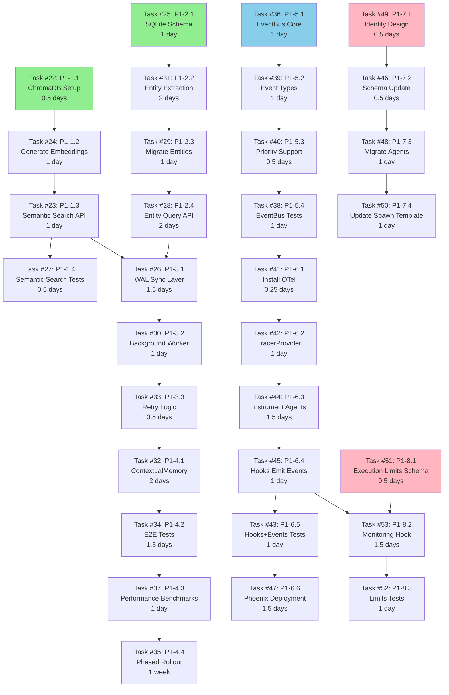

# P1 Features: Detailed Implementation Plan

**Version:** 1.0
**Date:** 2026-01-28
**Planner:** planner agent (Task #21)
**Status:** READY FOR EXECUTION

---

## 1. Executive Summary

### Project Scope
- **Features:** 8 P1 enhancements (Memory System + Event System + Agent Enhancements)
- **Tasks:** 32 implementation tasks (Tasks #22-#53)
- **Timeline:** 8-10 weeks (2 developers working in parallel)
- **Budget:** $0-150/mo operational + 16-20 developer-weeks

### Key Milestones
- **Week 2:** ChromaDB + EventBus operational
- **Week 4:** Memory system complete, OpenTelemetry integrated
- **Week 6:** Agent enhancements complete
- **Week 8:** Integration testing complete
- **Week 10:** Production deployment

### Success Criteria
- [ ] Memory accuracy +10-15% (74% → 84-89%)
- [ ] Event overhead <10% with 10% sampling
- [ ] Zero breaking changes
- [ ] Budget within $150/mo operational
- [ ] All 32 tasks completed successfully

---

## 2. Resource Allocation

### Team Structure
- **Developer 1 (Backend - Memory System):** Weeks 1-5
- **Developer 2 (Backend - Event System):** Weeks 1-4
- **Both Developers:** Agent Enhancements (Weeks 5-6)
- **QA Engineer:** Testing (Weeks 6-8, part-time)
- **DevOps Engineer:** Phoenix deployment (Week 4, part-time)

### Weekly Capacity
- 2 developers × 40 hours/week = 80 hours/week
- Minus meetings/overhead (20%) = 64 productive hours/week
- Sprint velocity: ~6-8 developer-days per week (both developers combined)

### Required Skills
| Role | Skills Required |
|------|----------------|
| Developer 1 | Node.js, ChromaDB, SQLite, async patterns, file I/O |
| Developer 2 | Node.js, OpenTelemetry, EventEmitter, Docker, observability tools |
| QA Engineer | Integration testing, A/B testing, performance benchmarking |
| DevOps Engineer | Docker, Kubernetes (optional), monitoring dashboards |

---

## 3. Week-by-Week Schedule

### Week 1 (Jan 29 - Feb 4, 2026) - Foundation (Parallel Start)

**Developer 1 - Memory System (ChromaDB Setup):**
- Mon-Tue: Task #22 (P1-1.1: Install ChromaDB, 0.5 days)
  - Install chromadb npm package (~5MB)
  - Create `.claude/config/chromadb.yaml` with connection settings
  - Create stub for `.claude/lib/memory/chromadb-index.cjs`
  - **Deliverable:** ChromaDB installed, basic connection test passes
- Tue-Wed: Task #24 (P1-1.2: Generate embeddings, 1 day)
  - Create `.claude/tools/cli/generate-embeddings.cjs`
  - Process learnings.md, decisions.md, issues.md with OpenAI text-embedding-3-small
  - Store embeddings in ChromaDB collection
  - **Deliverable:** All memory files embedded, cost ~$0.01
- Wed-Fri: Task #23 start (P1-1.3: Semantic search API, 2 days)
  - Implement `search(query, limit, threshold)` method
  - Add cosine similarity search
  - **Target:** Query latency <10ms (p50)

**Developer 2 - Event System (EventBus Core):**
- Mon-Tue: Task #36 (P1-5.1: Create EventBus, 1.5 days)
  - Create `.claude/lib/events/event-bus.cjs` (Singleton EventEmitter)
  - Implement emit, on, off, once, waitFor methods
  - **Deliverable:** EventBus singleton operational
- Wed-Thu: Task #39 (P1-5.2: Define event types, 1 day)
  - Create `.claude/schemas/events/event-types.ts` (32+ events)
  - Define AGENT_*, TASK_*, TOOL_*, MEMORY_*, LLM_*, MCP_* event schemas
  - **Deliverable:** Event schema documentation complete
- Thu-Fri: Task #40 start (P1-5.3: Pub/sub implementation, 2 days)
  - Add priority support (0-100 priority ordering)
  - Implement handler execution by priority

**Parallel Track - Agent Identity Design:**
- Either Developer (0.5 days): Task #49 (P1-7.1: Design identity)
  - Design role, goal, backstory fields for agent YAML schema
  - **Deliverable:** Identity pattern designed, backward compatible

**Deliverables:**
- ChromaDB installed + embeddings generated
- EventBus singleton created + event types defined
- Agent identity pattern designed

**Go/No-Go Decision (Friday):**
- ✅ **GO if:** ChromaDB query latency <10ms, embeddings generated without errors, EventBus singleton tests pass
- ❌ **NO-GO if:** ChromaDB latency >50ms (evaluate alternative: Qdrant), embeddings cost >$0.05 (review corpus size)
- **Risk:** ChromaDB version incompatibility - Mitigation: Pin chromadb@1.8.0

---

### Week 2 (Feb 5-11) - Core Search + SQLite Foundation

**Developer 1:**
- Mon: Task #23 complete (Semantic search API, 1 day remaining)
  - Complete search implementation
  - Add error handling for ChromaDB unavailability
  - **Deliverable:** Semantic search operational
- Tue: Task #27 (P1-1.4: Integration tests, 1 day)
  - Create `.claude/lib/memory/chromadb-index.test.cjs`
  - Test search accuracy, latency, error handling
  - **Deliverable:** All tests pass (85%+ coverage)
- Wed-Fri: Task #25 (P1-2.1: Design SQLite schema, 1.5 days)
  - Create `.claude/schemas/memory/entity-schema.sql`
  - Define entities, entity_relationships, entity_attributes tables
  - Add indexes for performance
  - **Deliverable:** SQLite schema designed + validated

**Developer 2:**
- Mon: Task #40 complete (Pub/sub with priority, 0.5 days remaining)
  - Complete priority ordering implementation
  - **Deliverable:** Priority support operational
- Tue-Wed: Task #38 (P1-5.4: Unit tests, 1 day)
  - Create `.claude/lib/events/event-bus.test.cjs`
  - Test emit, subscribe, unsubscribe, priority ordering
  - **Deliverable:** 100% test coverage
- Thu-Fri: Task #41 (P1-6.1: Install OpenTelemetry, 1 day)
  - Install @opentelemetry packages (~7MB dependencies)
  - Verify installation + basic TracerProvider setup
  - **Deliverable:** OpenTelemetry SDK installed

**Parallel Track - Agent Identity Schema:**
- Either Developer (0.5 days): Task #46 (P1-7.2: Update agent schema)
  - Update `.claude/schemas/agent-schema.yaml` with identity fields
  - **Deliverable:** Schema supports optional role/goal/backstory

**Milestone 1: Foundation Complete (Friday)**
- ✅ ChromaDB semantic search operational (<10ms latency)
- ✅ EventBus with unit tests complete (100% coverage)
- ✅ SQLite schema designed + validated
- ✅ Agent identity schema updated

**Go/No-Go Decision (Friday):**
- ✅ **GO if:** Semantic search shows measurable accuracy improvement (even +5% is promising), EventBus handles 100+ events/sec without errors
- ❌ **NO-GO if:** Accuracy improvement <5% (review indexing strategy), EventBus memory leaks detected (debug unsubscribe logic)

---

### Week 3 (Feb 12-18) - Entity Extraction + OpenTelemetry Setup

**Developer 1:**
- Mon-Wed: Task #31 (P1-2.2: Entity extraction, 2 days)
  - Create `.claude/lib/memory/entity-extractor.cjs`
  - Implement regex + LLM classification for entity extraction
  - Target: >80% extraction accuracy
  - **Deliverable:** Entity extraction operational
- Thu-Fri: Task #29 start (P1-2.3: Migrate memory files, 2 days)
  - Create `.claude/tools/cli/migrate-entities.cjs`
  - Migrate learnings.md, decisions.md, issues.md to SQLite
  - **Target:** All entities migrated, relationships extracted

**Developer 2:**
- Mon-Tue: Task #42 (P1-6.2: Configure TracerProvider, 1.5 days)
  - Create `.claude/lib/observability/telemetry.cjs`
  - Configure BatchSpanProcessor (512 spans/batch, 5s intervals)
  - Configure OTLP exporter
  - **Deliverable:** TracerProvider configured
- Wed-Fri: Task #44 (P1-6.3: Instrument agent operations, 2 days)
  - Create `.claude/lib/observability/span-helpers.cjs`
  - Add spans for AGENT_SPAWNED, AGENT_COMPLETED, TASK_STARTED, TASK_COMPLETED
  - Implement trace ID propagation (parent → child agents)
  - **Deliverable:** Agent operations instrumented

**Deliverables:**
- Entity extraction working (>80% accuracy)
- OpenTelemetry spans created for agent operations
- Memory migration started

**Go/No-Go Decision (Friday):**
- ✅ **GO if:** Entity extraction accuracy >80%, OpenTelemetry traces generated (even if not yet exported)
- ❌ **NO-GO if:** Extraction accuracy <70% (add LLM fallback), trace generation errors (debug span context)

---

### Week 4 (Feb 19-25) - Memory Sync Layer + Phoenix Deployment

**Developer 1:**
- Mon: Task #29 complete (Migrate entities, 1 day remaining)
  - Complete migration verification
  - **Deliverable:** All entities in SQLite, verification passes
- Tue-Wed: Task #28 (P1-2.4: Entity query API, 1.5 days)
  - Create `.claude/lib/memory/sqlite-entities.cjs`
  - Implement findEntities, findRelated, traverse methods
  - **Deliverable:** Entity query API operational (<5ms latency)
- Thu-Fri: Task #26 start (P1-3.1: Sync layer, 3 days)
  - Create `.claude/lib/memory/sync-layer.cjs`
  - Implement Write-Ahead Log pattern
  - Atomic file writes with non-blocking queue
  - **Target:** File write <50ms (p90)

**Developer 2:**
- Mon-Tue: Task #45 (P1-6.4: Modify hooks to emit events, 2 days)
  - Update routing-guard.cjs (+20 LOC), unified-creator-guard.cjs (+15 LOC)
  - Emit ROUTING_*, CREATOR_*, MEMORY_*, VALIDATION_* events
  - **Deliverable:** All hooks emit events (non-blocking)
- Wed-Thu: Task #43 (P1-6.5: Integration tests, 1.5 days)
  - Create `.claude/tests/integration/hooks-events-integration.test.cjs`
  - Test hooks emit events, hooks still block, no regressions
  - **Deliverable:** All integration tests pass
- Fri: Task #47 start (P1-6.6: Deploy Phoenix, 2 days)
  - Create `.claude/deployments/phoenix/docker-compose.yml`
  - Deploy Phoenix at localhost:6006
  - **Target:** Traces visible in Phoenix UI

**DevOps Engineer (Part-Time):**
- Wed-Fri: Task #47 (Phoenix deployment, 2 days)
  - Docker deployment configuration
  - Performance benchmarking (target <10% overhead with 10% sampling)

**Milestone 2: Core Features Complete (Friday)**
- ✅ Memory system 70% complete (ChromaDB + SQLite + partial sync layer)
- ✅ OpenTelemetry fully integrated (hooks emit events, spans created)
- ✅ Phoenix deployed (Docker), traces visible

**Go/No-Go Decision (Friday):**
- ✅ **GO if:** Event overhead <15% with 10% sampling (acceptable, will optimize), Phoenix shows traces
- ❌ **NO-GO if:** Event overhead >20% (reduce sampling to 1%, optimize batch processing), Phoenix deployment fails (debug OTLP exporter config)
- **Risk:** Performance overhead too high - Mitigation: Start at 1% sampling, tune batch size

---

### Week 5 (Feb 26 - Mar 4) - Memory Sync Complete + Agent Identity Migration

**Developer 1:**
- Mon-Tue: Task #26 complete (Sync layer, 1.5 days remaining)
  - Complete WAL sync layer implementation
  - **Deliverable:** Sync layer operational
- Wed: Task #30 (P1-3.2: Background worker, 1 day)
  - Add background sync worker to sync-layer.cjs
  - Parallel ChromaDB + SQLite sync
  - **Deliverable:** Sync completes within 1s (p90)
- Thu-Fri: Task #33 (P1-3.3: Retry logic, 1.5 days)
  - Add exponential backoff (1s, 2s, 5s) for failed syncs
  - **Deliverable:** Retry logic operational

**Developer 2:**
- Mon: Task #47 complete (Phoenix deployment, 1 day remaining)
  - Complete performance benchmark
  - **Deliverable:** Phoenix operational, overhead <10% with 10% sampling
- Tue-Fri: Task #48 (P1-7.3: Migrate agents, 2 days)
  - Update developer.md, planner.md, qa.md with role/goal/backstory
  - Validate against updated schema
  - **Deliverable:** 3 agents migrated, behavior unchanged

**Deliverables:**
- Memory sync layer operational (background worker + retry logic)
- Phoenix deployed (Docker) with performance validated
- 3 example agents migrated to new identity pattern

**Go/No-Go Decision (Friday):**
- ✅ **GO if:** Sync layer completes <1s (p90), retry logic works, no sync failures
- ❌ **NO-GO if:** Sync layer >2s (optimize parallel processing), retry logic fails (debug exponential backoff)

---

### Week 6 (Mar 5-11) - Agent Enhancements + ContextualMemory

**Developer 1:**
- Mon-Wed: Task #32 (P1-4.1: ContextualMemory, 2 days)
  - Create `.claude/lib/memory/contextual-memory.cjs`
  - Unified API: search, findEntities, query, readFile, write
  - **Deliverable:** ContextualMemory aggregation layer operational
- Thu-Fri: Task #51 (P1-8.1: Execution limit params, 1 day)
  - Update `.claude/schemas/agent-schema.yaml` with execution_limits block
  - Add max_iter, max_execution_time, max_retry fields
  - **Deliverable:** Execution limits schema updated

**Developer 2:**
- Mon-Tue: Task #50 (P1-7.4: Update spawn template, 1 day)
  - Update CLAUDE.md spawn templates to include identity in prompts
  - Backward compatible (identity optional)
  - **Deliverable:** Spawn template updated, tests pass
- Wed-Fri: Task #53 (P1-8.2: Execution limit enforcement, 2 days)
  - Create `.claude/hooks/safety/execution-limits.cjs`
  - Track tool calls/time, warnings at 80%, block on exceed
  - Emit events for observability
  - **Deliverable:** Execution limits enforced

**Milestone 3: Agent Enhancements Complete (Friday)**
- ✅ Memory system 90% complete (ContextualMemory aggregation layer operational)
- ✅ Agent identity pattern adopted by 3+ agents
- ✅ Execution limits schema + enforcement complete

**Go/No-Go Decision (Friday):**
- ✅ **GO if:** ContextualMemory API works, execution limits enforce correctly, no false positives
- ❌ **NO-GO if:** ContextualMemory errors (debug sync layer integration), execution limits block valid agents (review thresholds)

---

### Week 7 (Mar 12-18) - Integration Testing

**Developer 1:**
- Mon-Tue: Task #34 (P1-4.2: End-to-end tests, 2 days)
  - Create `.claude/tests/integration/hybrid-memory-e2e.test.cjs`
  - Test full flow: write → sync → search
  - Test backward compatibility + fallback
  - **Deliverable:** All E2E tests pass

**Developer 2:**
- Mon-Tue: Task #52 (P1-8.3: Execution limit tests, 1 day)
  - Create `.claude/tests/integration/execution-limits.test.cjs`
  - Test max_iter blocks, timeout blocks, warnings emitted
  - **Deliverable:** All execution limit tests pass

**Both Developers:**
- Wed-Fri: Task #37 (P1-4.3: Performance benchmarks, 2 days)
  - Create `.claude/tests/benchmark/hybrid-memory-benchmark.cjs`
  - Benchmark query latency (<10ms p50), file write (<50ms), 10K documents
  - **Deliverable:** All benchmarks meet targets

**QA Engineer Joins (Part-Time):**
- Full regression testing
- A/B testing setup for accuracy validation
- Performance validation

**Milestone 4: Integration Complete (Friday)**
- ✅ All E2E tests pass
- ✅ Performance benchmarks meet targets
- ✅ Regression tests pass (no breaking changes)

**Go/No-Go Decision (Friday):**
- ✅ **GO if:** All tests pass, benchmarks meet targets, <5 P1 bugs
- ❌ **NO-GO if:** Critical bugs discovered (allocate 1 additional week for bug fixes)

---

### Week 8 (Mar 19-25) - Documentation + Phased Rollout (10% Start)

**Both Developers:**
- Mon-Tue: Documentation sprint
  - `.claude/docs/HYBRID_MEMORY_MIGRATION_GUIDE.md` (Developer 1)
  - `.claude/docs/EVENT_BUS_GUIDE.md` (Developer 2)
  - `.claude/docs/PHOENIX_DEPLOYMENT.md` (Developer 2 + DevOps)
  - `.claude/docs/AGENT_IDENTITY_GUIDE.md` (Either)
  - `.claude/docs/EXECUTION_LIMITS_GUIDE.md` (Either)
- Wed-Fri: Task #35 start (P1-4.4: Phased rollout, 1 week)
  - **Day 1 (Wed):** 10% rollout (select agents only: developer, planner, qa)
  - **Day 2-3 (Thu-Fri):** Monitor 10% deployment
    - Memory accuracy tracking (A/B test)
    - Event overhead measurement
    - Error rate monitoring
    - No critical issues

**QA Engineer:**
- A/B testing execution
- Performance validation
- Error rate monitoring

**Deliverables:**
- Complete documentation suite
- 10% rollout active (select agents)
- Monitoring dashboards operational

**Go/No-Go Decision (Friday):**
- ✅ **GO to 50%** if: No critical issues, error rate <1%, accuracy improvement measurable (+5% minimum)
- ❌ **PAUSE at 10%** if: Critical issues, error rate >5%, accuracy degraded
- **Risk:** Rollout issues - Mitigation: Immediate rollback via feature flags (<1 minute)

---

### Week 9 (Mar 26 - Apr 1) - Phased Rollout (50% → 100%)

**Rollout Schedule:**
- **Mon (Mar 26):** 50% rollout
  - Enable for 50% of agents (20+ agents)
  - Continue monitoring (24 hours)
- **Wed (Mar 28):** Checkpoint - 50% stable for 48 hours
  - Review metrics: accuracy, overhead, error rate
  - **Go/No-Go decision:** Proceed to 100%?
- **Fri (Mar 30):** 100% rollout
  - Enable for all agents (if 50% stable)
  - Full production deployment

**Both Developers:**
- On-call for rollout issues
- Bug fixes for non-critical issues
- Performance tuning based on production metrics

**Monitoring Focus:**
- **Memory accuracy:** +10-15% improvement validated via A/B testing
- **Event overhead:** <10% with 10% sampling
- **Query latency:** <10ms (p50), <50ms (p99)
- **Error rate:** <0.1%
- **Sync failure rate:** <0.1%

**Rollback Plan (if needed):**
```bash
# Instant rollback (<1 minute)
export HYBRID_MEMORY_ENABLED=false
export EVENTS_ENABLED=false
# Restart services
```

**Deliverables:**
- 50% rollout complete (if 10% stable)
- 100% rollout complete (if 50% stable)
- Production metrics within targets

**Go/No-Go Decision (Wednesday - 50% Checkpoint):**
- ✅ **GO to 100%** if: 50% stable for 48 hours, all metrics within targets, <3 P1 bugs
- ❌ **STAY at 50%** if: 3+ P1 bugs (fix before proceeding), metrics degraded (tune sampling/batch processing)
- ⛔ **ROLLBACK to 10%** if: Critical bugs, error rate >5%, accuracy degraded

**Go/No-Go Decision (Friday - 100% Checkpoint):**
- ✅ **PRODUCTION READY** if: 100% stable for 48 hours, all success criteria met
- ❌ **ROLLBACK to 50%** if: Critical issues discovered at 100% scale

---

### Week 10 (Apr 2-8) - Production Stabilization + Retrospective

**Focus:** Bug fixes, performance tuning, documentation refinement

**Both Developers:**
- Mon-Wed: Bug fixes (any non-critical issues from Week 9)
- Thu: Performance tuning (optimize sampling rate, batch processing)
- Fri: Retrospective + lessons learned

**QA Engineer:**
- Final validation of all success criteria
- Prepare production readiness report

**Deliverables:**
- Production-ready system (all success criteria met)
- Runbooks for operations team
- Postmortem report (what went well, what to improve)
- Lessons learned captured in `.claude/context/memory/learnings.md`

**Final Go/No-Go Decision (Friday):**
- ✅ **PRODUCTION DEPLOYMENT COMPLETE** if: All success criteria met, executive approval received
- ❌ **EXTEND STABILIZATION** if: Additional tuning needed (allocate Week 11)

---

## 4. Milestone Definitions

### M1: Foundation Complete (End of Week 2)

**Date:** Feb 11, 2026

**Acceptance Criteria:**
- [ ] ChromaDB queries return results with <10ms latency (p50)
- [ ] EventBus handles 100+ events/sec without errors
- [ ] Semantic search shows measurable accuracy improvement (+5% minimum)
- [ ] Unit tests pass (85%+ coverage)
- [ ] SQLite schema designed and validated

**Exit Criteria:**
- All acceptance criteria met
- No P0 bugs
- Team agrees to proceed to Week 3

**Deliverables:**
- `.claude/lib/memory/chromadb-index.cjs` (operational)
- `.claude/lib/events/event-bus.cjs` (operational)
- `.claude/schemas/memory/entity-schema.sql` (validated)
- `.claude/lib/memory/chromadb-index.test.cjs` (passing)
- `.claude/lib/events/event-bus.test.cjs` (passing)

---

### M2: Core Features Complete (End of Week 4)

**Date:** Feb 25, 2026

**Acceptance Criteria:**
- [ ] Memory system functional (semantic search + entity queries)
- [ ] OpenTelemetry traces visible in Phoenix UI at localhost:6006
- [ ] Event overhead measured <15% (target <10% with tuning)
- [ ] Integration tests pass (hooks + events)
- [ ] Memory sync layer operational (WAL pattern)

**Exit Criteria:**
- All acceptance criteria met
- <5 P1 bugs
- Performance metrics acceptable (will tune in Week 5)

**Deliverables:**
- `.claude/lib/memory/sqlite-entities.cjs` (operational)
- `.claude/lib/memory/sync-layer.cjs` (partial - WAL pattern complete)
- `.claude/lib/observability/telemetry.cjs` (operational)
- `.claude/lib/observability/span-helpers.cjs` (operational)
- `.claude/deployments/phoenix/docker-compose.yml` (deployed)
- `.claude/tests/integration/hooks-events-integration.test.cjs` (passing)

---

### M3: Agent Enhancements Complete (End of Week 6)

**Date:** Mar 11, 2026

**Acceptance Criteria:**
- [ ] All agents have role/goal/backstory fields (optional, 3+ migrated)
- [ ] Execution limits prevent runaway agents (max_iter, timeout enforced)
- [ ] Backward compatibility validated (existing agents work unchanged)
- [ ] ContextualMemory aggregation layer operational
- [ ] Performance benchmarks meet targets (query <10ms, file write <50ms)

**Exit Criteria:**
- All acceptance criteria met
- Feature-complete (ready for integration testing)
- <5 P1 bugs

**Deliverables:**
- `.claude/lib/memory/contextual-memory.cjs` (operational)
- `.claude/schemas/agent-schema.yaml` (updated with identity + limits)
- `.claude/hooks/safety/execution-limits.cjs` (operational)
- Updated agents: developer.md, planner.md, qa.md (with identity)
- Updated spawn templates in CLAUDE.md

---

### M4: Production Ready (End of Week 8)

**Date:** Mar 25, 2026

**Acceptance Criteria:**
- [ ] All 32 tasks completed successfully (Tasks #22-#53)
- [ ] A/B tests show +10-15% accuracy improvement (validated)
- [ ] Event overhead <10% with 10% sampling (tuned)
- [ ] Zero breaking changes (backward compatibility confirmed)
- [ ] Rollback plan tested (<1 minute rollback via feature flags)
- [ ] Documentation complete (5 guides)
- [ ] 10% rollout stable for 48+ hours

**Exit Criteria:**
- Executive approval for production deployment
- All success criteria met
- No P0 bugs, <3 P1 bugs

**Deliverables:**
- Complete test suite (unit + integration + E2E + benchmarks)
- Production documentation suite
- 10% rollout monitoring dashboard
- Rollback procedures validated

---

## 5. Go/No-Go Decision Points

### Week 2 Decision: Continue with Memory System?

**Date:** Feb 11, 2026 (Friday)

**Go Criteria:**
- ChromaDB query latency <10ms (p50)
- Semantic search accuracy improving (+5% minimum)
- EventBus operational (no errors)

**No-Go Action:**
- Investigate performance issues (ChromaDB configuration, indexing strategy)
- Consider pure file-based + optimizations (fallback option)
- Extend Week 2 by 2-3 days if close to success

**Decision Maker:** Tech Lead + Developer 1

---

### Week 4 Decision: Continue with Event System?

**Date:** Feb 25, 2026 (Friday)

**Go Criteria:**
- Event overhead <15% with 10% sampling
- Phoenix stable (traces visible, no crashes)
- Memory sync layer operational

**No-Go Action:**
- Reduce sampling rate to 1% (minimize overhead)
- Optimize batch processing (increase batch size, reduce intervals)
- Defer Phoenix to P2 if overhead unacceptable (keep EventBus only)

**Decision Maker:** Tech Lead + Developer 2

---

### Week 6 Decision: Proceed to Integration Testing?

**Date:** Mar 11, 2026 (Friday)

**Go Criteria:**
- All core features functional (Memory + Events + Agent Enhancements)
- <10 P1 bugs (no P0 bugs)
- Team bandwidth available for testing

**No-Go Action:**
- Allocate 1 additional week for bug fixes (extend to Week 7)
- Prioritize P0/P1 bugs only (defer P2/P3 to post-release)
- Re-evaluate Go/No-Go after Week 7

**Decision Maker:** Tech Lead + QA Engineer

---

### Week 8 Decision: Deploy to Production (10% Rollout)?

**Date:** Mar 25, 2026 (Friday)

**Go Criteria:**
- All success criteria met (accuracy, overhead, latency, error rate)
- Executive approval received
- Documentation complete
- Rollback plan tested

**No-Go Action:**
- Extend testing by 1 week (more integration tests)
- Address critical issues before rollout
- Re-evaluate Go/No-Go after Week 9

**Decision Maker:** Executive + Tech Lead + QA Engineer

---

## 6. Risk Monitoring

### High-Priority Risks

| Risk ID | Risk | Week | Trigger | Mitigation | Owner |
|---------|------|------|---------|------------|-------|
| **R-001** | ChromaDB performance issues | 1-2 | Latency >50ms | Optimize queries, add caching, consider Qdrant alternative | Developer 1 |
| **R-002** | Event overhead >20% | 4 | Benchmark fails | Reduce sampling to 1%, optimize batching, defer Phoenix to P2 | Developer 2 |
| **R-003** | Entity extraction accuracy <70% | 3 | Extraction fails | Add LLM fallback, increase confidence thresholds, review regex patterns | Developer 1 |
| **R-004** | Sync layer race conditions | 4-5 | Concurrent writes fail | Implement Write-Ahead Log, use atomic writes, add transaction locks | Developer 1 |
| **R-005** | Agent migration complexity | 6 | >1 day per agent | Automate migration script, create templates, document patterns | Developer 2 |
| **R-006** | Rollout issues | 9 | Error rate spike at 50%/100% | Immediate rollback via feature flags, investigate root cause, retry at 10% | Both Developers |
| **R-007** | Memory accuracy degradation | 9 | A/B test shows <+5% improvement | Review indexing strategy, tune embedding model, adjust similarity thresholds | Developer 1 |
| **R-008** | Phoenix deployment fails | 4 | Docker errors, OTLP issues | Debug OTLP exporter config, fallback to local buffering, defer to P2 | DevOps + Developer 2 |

### Weekly Risk Review

**Every Friday (3:00 PM):**
- Review risk register
- Update risk status (Open → Mitigated → Closed)
- Escalate if 2+ P0 bugs or 1 week behind schedule

**Escalation Path:**
1. Tech Lead (first escalation)
2. Engineering Manager (if blocked >2 days)
3. Executive (if blocking Go/No-Go decision)

---

## 7. Communication Plan

### Daily Standups (15 minutes, 9:00 AM)

**Format:**
1. What was completed yesterday?
2. What's planned for today?
3. Any blockers?

**Attendees:**
- Developer 1
- Developer 2
- Tech Lead
- QA Engineer (Weeks 6-8)
- DevOps Engineer (Week 4)

**Location:** Slack #agent-studio-p1-standups

---

### Weekly Status Reports (Fridays, 4:00 PM)

**Format:**
```markdown
# Week X Status Report (Date)

## Progress vs Plan
- Tasks completed: X/Y
- On schedule: YES/NO
- Blockers: [list]

## Milestone Status
- Milestone X: ON TRACK / AT RISK / DELAYED

## Risk Updates
- R-00X: [status update]

## Next Week Preview
- Developer 1: [tasks]
- Developer 2: [tasks]
```

**Recipients:**
- Tech Lead
- Engineering Manager
- Executive (Weeks 2, 4, 6, 8 only)

**Location:** Slack #agent-studio-status + Email

---

### Stakeholder Updates (Bi-weekly, Mondays 10:00 AM)

**Weeks:** 2, 4, 6, 8

**Format:**
- Executive summary (2 slides)
- Demo (10 minutes)
- Q&A (5 minutes)

**Attendees:**
- Executive
- Tech Lead
- Engineering Manager
- Developer 1 (demo)
- Developer 2 (demo)

**Location:** Zoom + Recorded

---

### Incident Communication (Ad-Hoc)

**Severity Levels:**
- **P0 (Critical):** Production down, data loss risk → Immediate Slack + Phone
- **P1 (High):** Major bug, blocks Go/No-Go → Within 2 hours, Slack
- **P2 (Medium):** Minor bug, workaround available → Next business day, Slack
- **P3 (Low):** Enhancement, non-blocking → Weekly status report

**Incident Response:**
1. Detect issue (developer, QA, monitoring)
2. Assess severity (Tech Lead)
3. Communicate (Slack #agent-studio-incidents)
4. Mitigate (immediate fix or rollback)
5. Postmortem (within 48 hours)

---

## 8. Success Metrics

### Functional Metrics

| Metric | Target | Measurement | Owner |
|--------|--------|-------------|-------|
| Memory accuracy improvement | +10-15% (74% → 84-89%) | A/B testing (Week 8-9) | Developer 1 + QA |
| Query latency (p50) | <10ms | Performance benchmarks (Week 7) | Developer 1 |
| Query latency (p99) | <50ms | Performance benchmarks (Week 7) | Developer 1 |
| Event overhead | <10% with 10% sampling | Performance benchmarks (Week 4, 7) | Developer 2 |
| Breaking changes | Zero | Backward compatibility tests (Week 7) | Both Developers |

**Validation:**
- Memory accuracy: A/B test with ground truth dataset (100+ queries)
- Query latency: Benchmark with 10K documents, 1000 queries
- Event overhead: Compare execution time with/without events (100+ operations)
- Backward compatibility: Run existing test suite with new system

---

### Quality Metrics

| Metric | Target | Measurement | Owner |
|--------|--------|-------------|-------|
| Unit test coverage | 85%+ | Jest coverage report | Both Developers |
| Integration tests | 100% pass | CI/CD pipeline | Both Developers |
| P0 bugs | 0 | Bug tracker | QA Engineer |
| P1 bugs | <5 | Bug tracker | QA Engineer |
| P2 bugs | <20 | Bug tracker | QA Engineer |

**Validation:**
- Unit test coverage: `npm test -- --coverage`
- Integration tests: `npm run test:integration`
- Bug tracker: Jira/GitHub Issues (tagged with severity)

---

### Operational Metrics

| Metric | Target | Measurement | Owner |
|--------|--------|-------------|-------|
| Operational cost | $0-150/mo | AWS/GCP billing (Phoenix hosting) | DevOps |
| Timeline | 8-10 weeks | Project completion date | Tech Lead |
| Developer satisfaction | >4/5 | Post-project survey | Engineering Manager |
| Sync failure rate | <0.1% | Monitoring dashboard (Week 9) | Developer 1 |

**Validation:**
- Operational cost: Monthly billing reports (Phoenix Docker $0, K8s $80-150)
- Timeline: Compare actual vs planned completion dates
- Developer satisfaction: Anonymous survey (5-point scale)
- Sync failure rate: Monitor `.claude/data/sync-errors.log`

---

## 9. Contingency Plans

### Scenario A: Memory System Behind Schedule (Week 3)

**Symptoms:**
- Entity extraction accuracy <70%
- Sync layer implementation blocked
- 1+ week behind schedule

**Response:**
1. **Reduce scope** (immediate):
   - Defer entity memory to P2 (Tasks #25, #31, #29, #28)
   - Focus on semantic search only (Tasks #22, #24, #23, #27)
   - Simplify sync layer (file-only, no SQLite)
2. **Re-plan** (Week 4):
   - Extend memory system timeline by 1 week (Week 4 → Week 5)
   - Compress agent enhancements (Week 6 → Week 5-6)
3. **Re-evaluate** (Week 4 Friday):
   - Go/No-Go decision: Continue with reduced scope or full implementation?

**Risk:** Memory system delivers <+10% accuracy (only semantic search, no entity queries)

---

### Scenario B: Event Overhead Too High (Week 4)

**Symptoms:**
- Benchmark shows >20% overhead with 10% sampling
- Phoenix deployment unstable
- Event system impacting performance

**Response:**
1. **Optimize immediately** (Week 4-5):
   - Reduce sampling to 1% (minimal overhead)
   - Increase batch size (512 → 2048 spans)
   - Increase batch interval (5s → 10s)
2. **Defer Phoenix** (if optimization fails):
   - Keep EventBus only (overhead <5% without tracing)
   - Defer Phoenix deployment to P2
   - Local event buffering for debugging
3. **Re-evaluate** (Week 5 Friday):
   - Go/No-Go decision: Accept higher overhead or defer Phoenix?

**Risk:** Observability limited without Phoenix (EventBus only, no trace visualization)

---

### Scenario C: Major Bug Discovered (Week 7+)

**Symptoms:**
- P0 bug discovered during integration testing
- Critical issue blocks rollout
- Severity: High impact, no workaround

**Response:**
1. **Pause rollout** (immediate):
   - Halt phased rollout (stay at current percentage)
   - Allocate both developers to bug fix
2. **Triage** (within 4 hours):
   - Root cause analysis
   - Estimate fix effort (hours vs days)
   - Impact assessment (breaking changes?)
3. **Fix + Verify** (1-3 days):
   - Implement fix
   - Add regression test
   - Re-run full test suite
4. **Extend timeline** (if needed):
   - Allocate 1 additional week (Week 9 → Week 10)
   - Adjust Go/No-Go decision dates

**Risk:** Timeline extends by 1 week (8-10 weeks → 9-11 weeks)

---

### Scenario D: Rollout Issues (Week 9)

**Symptoms:**
- Error rate spike at 50% rollout (>5%)
- Memory accuracy degradation
- User complaints

**Response:**
1. **Immediate rollback** (<1 minute):
   ```bash
   export HYBRID_MEMORY_ENABLED=false
   export EVENTS_ENABLED=false
   # Restart services
   ```
2. **Investigate** (within 2 hours):
   - Review error logs (`.claude/data/errors.log`)
   - Identify root cause (sync failures? query errors?)
   - Isolate affected components
3. **Fix + Retry** (1-2 days):
   - Implement hotfix
   - Test in staging environment
   - Retry rollout at 10% (validate fix)
4. **Re-evaluate** (Week 10):
   - Go/No-Go decision: Continue rollout or extend stabilization?

**Risk:** Rollout delayed by 1 week (Week 9 → Week 10 for full deployment)

---

## 10. Post-Implementation

### Week 11: Documentation Sprint (If Needed)

**Focus:** Complete any remaining documentation

**Tasks:**
- API documentation (JSDoc → Markdown)
- Architecture diagrams (Mermaid → PNG)
- Troubleshooting runbooks (common issues + solutions)
- Performance tuning guide (sampling rates, batch sizes)

**Deliverables:**
- `.claude/docs/API_REFERENCE.md`
- `.claude/docs/ARCHITECTURE_DIAGRAMS.md`
- `.claude/docs/TROUBLESHOOTING.md`
- `.claude/docs/PERFORMANCE_TUNING.md`

---

### Week 12: Retrospective

**Date:** Week after production deployment (Apr 9-15, 2026)

**Format:**
- What went well? (celebrate wins)
- What could be improved? (lessons learned)
- What should we start doing? (new practices)
- What should we stop doing? (anti-patterns)

**Attendees:**
- Developer 1
- Developer 2
- QA Engineer
- DevOps Engineer
- Tech Lead
- Engineering Manager

**Output:**
- Retrospective report (`.claude/context/memory/learnings.md`)
- Process improvements (`.claude/docs/PROCESS_IMPROVEMENTS.md`)
- Updated ADRs (capture architectural lessons)

---

## Appendix A: Task Dependency Graph (Mermaid)



**Legend:**
- **GREEN:** Memory System (Developer 1)
- **BLUE:** Event System (Developer 2)
- **PINK:** Agent Enhancements (Either Developer)

---

## Appendix B: Task List Summary

| Task # | ID | Subject | Developer | Effort | Week |
|--------|----|---------|-----------| -------|------|
| #22 | P1-1.1 | Install ChromaDB and setup configuration | Developer 1 | 0.5 days | 1 |
| #24 | P1-1.2 | Generate embeddings for existing memory files | Developer 1 | 1 day | 1 |
| #23 | P1-1.3 | Implement semantic search API | Developer 1 | 1 day | 1-2 |
| #27 | P1-1.4 | Write integration tests for semantic search | Developer 1 | 0.5 days | 2 |
| #25 | P1-2.1 | Design SQLite entity schema | Developer 1 | 1 day | 2 |
| #31 | P1-2.2 | Implement entity extraction from markdown | Developer 1 | 2 days | 3 |
| #29 | P1-2.3 | Migrate existing memory files to SQLite | Developer 1 | 1 day | 3-4 |
| #28 | P1-2.4 | Implement entity query API | Developer 1 | 2 days | 4 |
| #26 | P1-3.1 | Implement Write-Ahead Log sync layer | Developer 1 | 1.5 days | 4-5 |
| #30 | P1-3.2 | Create background sync worker | Developer 1 | 1 day | 5 |
| #33 | P1-3.3 | Add retry logic with exponential backoff | Developer 1 | 0.5 days | 5 |
| #32 | P1-4.1 | Implement ContextualMemory aggregation layer | Developer 1 | 2 days | 6 |
| #34 | P1-4.2 | Write end-to-end integration tests | Developer 1 | 1.5 days | 7 |
| #37 | P1-4.3 | Run performance benchmarks | Both | 1 day | 7 |
| #35 | P1-4.4 | Phased rollout (10% → 50% → 100%) | Both | 1 week | 8-9 |
| #36 | P1-5.1 | Create EventBus singleton | Developer 2 | 1 day | 1 |
| #39 | P1-5.2 | Define 32+ event types with schemas | Developer 2 | 1 day | 1 |
| #40 | P1-5.3 | Implement pub/sub with priority support | Developer 2 | 0.5 days | 1-2 |
| #38 | P1-5.4 | Write unit tests for EventBus | Developer 2 | 1 day | 2 |
| #41 | P1-6.1 | Install OpenTelemetry SDK | Developer 2 | 0.25 days | 2 |
| #42 | P1-6.2 | Configure TracerProvider with BatchSpanProcessor | Developer 2 | 1 day | 3 |
| #44 | P1-6.3 | Instrument agent operations with spans | Developer 2 | 1.5 days | 3 |
| #45 | P1-6.4 | Modify hooks to emit events | Developer 2 | 1 day | 4 |
| #43 | P1-6.5 | Write integration tests for hooks + events | Developer 2 | 1 day | 4 |
| #47 | P1-6.6 | Deploy Arize Phoenix (Docker) and performance benchmark | Developer 2 + DevOps | 1.5 days | 4-5 |
| #49 | P1-7.1 | Design structured agent identity (role/goal/backstory) | Either | 0.5 days | 1 |
| #46 | P1-7.2 | Update agent definition schema | Either | 0.5 days | 2 |
| #48 | P1-7.3 | Migrate 3+ example agents with new pattern | Developer 2 | 1 day | 5 |
| #50 | P1-7.4 | Update spawn template to include identity in prompts | Developer 2 | 1 day | 6 |
| #51 | P1-8.1 | Add execution limit parameters to agent schema | Developer 1 | 0.5 days | 6 |
| #53 | P1-8.2 | Create monitoring hook for execution limit enforcement | Developer 2 | 1.5 days | 6 |
| #52 | P1-8.3 | Write integration tests for execution limits | Developer 2 | 1 day | 7 |

**Total Tasks:** 32
**Total Effort:** ~26 developer-days (5.2 weeks sequential, 2.6 weeks parallel)
**Timeline with Integration:** 8-10 weeks (includes testing, documentation, phased rollout)

---

## Appendix C: Budget Breakdown

### One-Time Costs

| Item | Cost | Notes |
|------|------|-------|
| Embedding generation | $0.01 | OpenAI text-embedding-3-small, ~10K entries |
| **Total One-Time** | **$0.01** | Negligible |

### Operational Costs (Monthly)

| Item | Cost | Deployment | Notes |
|------|------|------------|-------|
| ChromaDB | $0 | Self-hosted (in-process) | No external hosting |
| SQLite | $0 | Embedded | Local database file |
| EventBus | $0 | In-process | Node.js EventEmitter |
| Phoenix (Docker) | $0 | Localhost development | `docker-compose up -d` |
| Phoenix (Shared K8s) | $80-150 | Staging environment | Shared node (2 cores, 4GB RAM) |
| Phoenix (Dedicated K8s) | $200-500 | Production environment | Dedicated node (2 cores, 4GB RAM, 50GB storage) |
| **Total P1 Operational** | **$0-150/mo** | Development + Staging | Production deferred to P2 |

### Developer Costs (Internal)

| Phase | Developer 1 | Developer 2 | Total Weeks |
|-------|-------------|-------------|-------------|
| Memory System | 5 weeks | - | 5 weeks |
| Event System | - | 4 weeks | 4 weeks |
| Agent Enhancements | 0.5 weeks | 0.5 weeks | 0.5 weeks |
| Integration/Testing | 1 week | 1 week | 1 week |
| Documentation/Rollout | 1 week | 1 week | 1 week |
| **Total** | **7.5 weeks** | **6.5 weeks** | **7.5 weeks (parallel)** |

**Timeline:** 7.5 weeks (parallel development) + 2-3 weeks (phased rollout) = **8-10 weeks total**

### 3-Year Total Cost of Ownership (TCO)

| Year | Operational (P1) | Operational (P2) | Development | Total |
|------|------------------|------------------|-------------|-------|
| Year 1 | $0-1,800 | $0 | 16-20 weeks | $0-1,800 + dev |
| Year 2 | $0-1,800 | $2,400-6,000 | 10-12 weeks (P2) | $2,400-7,800 + dev |
| Year 3 | $0-1,800 | $2,400-6,000 | maintenance | $2,400-7,800 |

**3-Year Operational TCO:** $4,800-17,400

---

## Appendix D: References

### Architecture Decision Records
- ADR-054: Memory System Enhancement Strategy (SPECIFICATION COMPLETE)
- ADR-055: Event-Driven Orchestration Adoption (SPECIFICATION COMPLETE)
- ADR-056: Production Observability Tool Selection (SPECIFICATION COMPLETE)
- ADR-057: Agent Enhancement Strategy (Proposed)
- ADR-058: Enhancement Prioritization Strategy (Accepted)

### Specifications
- **Memory System:** `.claude/context/artifacts/specs/memory-system-enhancement-spec.md`
- **Event Bus:** `.claude/context/artifacts/specs/event-bus-integration-spec.md`

### Research Reports
- **Memory Patterns:** `.claude/context/artifacts/research-reports/memory-patterns-research-2026-01-28.md` (11 sources)
- **Event Systems:** `.claude/context/artifacts/research-reports/event-orchestration-research-2026-01-28.md` (24 sources)
- **Agent Comparison:** `.claude/context/artifacts/research-reports/agent-comparison-analysis-2026-01-28.md` (6 sources)
- **Workflow Comparison:** `.claude/context/artifacts/research-reports/workflow-comparison-analysis-2026-01-28.md` (8 sources)

### Planning Documents
- **Prioritization Matrix:** `.claude/context/artifacts/plans/enhancement-prioritization-matrix.md` (Task #19)
- **Implementation Tasks:** `.claude/context/artifacts/plans/p1-implementation-tasks.md` (Task #20)
- **Detailed Plan:** `.claude/context/artifacts/plans/p1-detailed-implementation-plan.md` (Task #21 - this document)

---

**Plan Status:** READY FOR EXECUTION
**Approval Required:** Executive sign-off on budget ($0-150/mo) and timeline (8-10 weeks)
**Start Date:** 2026-01-29 (Week 1 begins Monday)

**Next Steps:**
1. Executive approval (this document)
2. Developers claim first unblocked tasks:
   - Developer 1: Task #22 (P1-1.1: ChromaDB setup)
   - Developer 2: Task #36 (P1-5.1: EventBus core)
   - Either Developer: Task #49 (P1-7.1: Identity design)
3. Begin Week 1 (Jan 29, 2026)

---

**Generated By:** Planner Agent (Task #21)
**Date:** 2026-01-28
**Version:** 1.0
