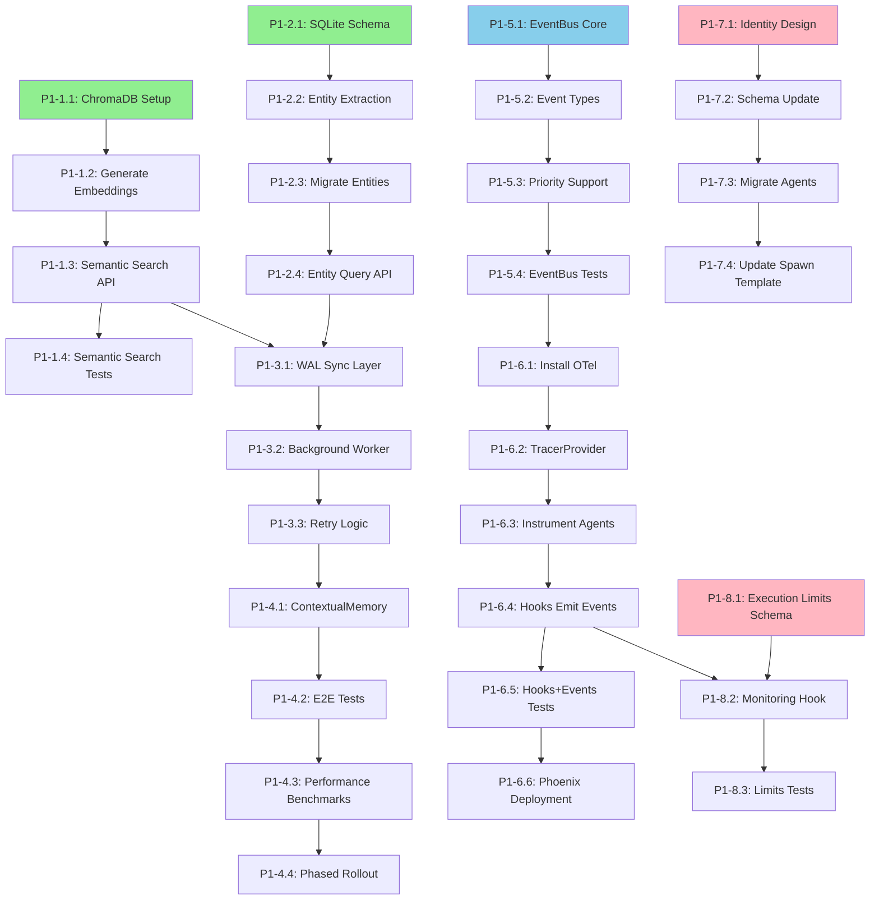

# P1 Implementation Tasks

**Version:** 1.0
**Date:** 2026-01-28
**Created By:** Planner Agent (Task #20)
**Based On:** Task #19 (Prioritization Matrix), Task #17 (Memory Spec), Task #18 (Event Spec)

---

## Executive Summary

**Total Tasks:** 32 implementation tasks
**Estimated Effort:** 10-12 developer-weeks (5-6 weeks with 2 developers in parallel)
**Timeline:** 8-10 weeks (including integration, testing, phased rollout)
**Team:** 2 Backend Developers (Developer 1 = Memory System, Developer 2 = Event System)

---

## Task Dependencies Graph



---

## Memory System Tasks (Developer 1) - ~5 weeks

### Phase 1: ChromaDB Integration (Week 1-2)

#### Task #22: P1-1.1: Install ChromaDB and setup configuration
- **Effort:** 0.5 days
- **Dependencies:** None (START HERE)
- **Output:** package.json, .claude/config/chromadb.yaml, .claude/lib/memory/chromadb-index.cjs (stub)
- **Acceptance:** ChromaDB installed, config created, basic connection test passes

#### Task #24: P1-1.2: Generate embeddings for existing memory files
- **Effort:** 1 day
- **Dependencies:** #22
- **Output:** .claude/tools/cli/generate-embeddings.cjs
- **Acceptance:** All memory files processed, embeddings stored, cost ~$0.01

#### Task #23: P1-1.3: Implement semantic search API
- **Effort:** 1 day
- **Dependencies:** #24
- **Output:** .claude/lib/memory/chromadb-index.cjs (search methods)
- **Acceptance:** Query latency <10ms, cosine similarity search working

#### Task #27: P1-1.4: Write integration tests for semantic search
- **Effort:** 0.5 days
- **Dependencies:** #23
- **Output:** .claude/lib/memory/chromadb-index.test.cjs
- **Acceptance:** All tests pass, ChromaDB unavailability handled gracefully

---

### Phase 2: SQLite Entity Schema (Week 2-3)

#### Task #25: P1-2.1: Design SQLite entity schema
- **Effort:** 1 day
- **Dependencies:** None (PARALLEL with ChromaDB)
- **Output:** .claude/schemas/memory/entity-schema.sql
- **Acceptance:** entities, entity_relationships, entity_attributes tables + indexes

#### Task #31: P1-2.2: Implement entity extraction from markdown
- **Effort:** 2 days
- **Dependencies:** #25
- **Output:** .claude/lib/memory/entity-extractor.cjs
- **Acceptance:** Extraction accuracy >80%, regex + LLM classification

#### Task #29: P1-2.3: Migrate existing memory files to SQLite
- **Effort:** 1 day
- **Dependencies:** #31
- **Output:** .claude/tools/cli/migrate-entities.cjs
- **Acceptance:** All entities migrated, relationships extracted, verification passes

#### Task #28: P1-2.4: Implement entity query API
- **Effort:** 2 days
- **Dependencies:** #29
- **Output:** .claude/lib/memory/sqlite-entities.cjs
- **Acceptance:** findEntities, findRelated, traverse methods, latency <5ms

---

### Phase 3: Sync Layer (Week 3-4)

#### Task #26: P1-3.1: Implement Write-Ahead Log sync layer
- **Effort:** 1.5 days
- **Dependencies:** #23 (ChromaDB), #28 (SQLite)
- **Output:** .claude/lib/memory/sync-layer.cjs
- **Acceptance:** Atomic file writes <50ms, non-blocking queue

#### Task #30: P1-3.2: Create background sync worker
- **Effort:** 1 day
- **Dependencies:** #26
- **Output:** .claude/lib/memory/sync-layer.cjs (worker methods)
- **Acceptance:** Sync completes within 1s (p90), parallel ChromaDB + SQLite

#### Task #33: P1-3.3: Add retry logic with exponential backoff
- **Effort:** 0.5 days
- **Dependencies:** #30
- **Output:** .claude/lib/memory/sync-layer.cjs (retry methods)
- **Acceptance:** 3 retries with exponential backoff (1s, 2s, 5s)

---

### Phase 4: Integration & Testing (Week 4-5)

#### Task #32: P1-4.1: Implement ContextualMemory aggregation layer
- **Effort:** 2 days
- **Dependencies:** #33
- **Output:** .claude/lib/memory/contextual-memory.cjs
- **Acceptance:** Unified API (search, findEntities, query, readFile, write)

#### Task #34: P1-4.2: Write end-to-end integration tests
- **Effort:** 1.5 days
- **Dependencies:** #32
- **Output:** .claude/tests/integration/hybrid-memory-e2e.test.cjs
- **Acceptance:** Full flow (write → sync → search), backward compatibility, fallback

#### Task #37: P1-4.3: Run performance benchmarks
- **Effort:** 1 day
- **Dependencies:** #34
- **Output:** .claude/tests/benchmark/hybrid-memory-benchmark.cjs
- **Acceptance:** Query <10ms (p50), file write <50ms, 10K documents handled

#### Task #35: P1-4.4: Phased rollout (10% → 50% → 100%)
- **Effort:** 1 week
- **Dependencies:** #37
- **Output:** .claude/config.yaml (rollout_percentage)
- **Acceptance:** Week 1 (10%), Week 2 (50%), Week 3 (100%), no regressions

---

## Event System Tasks (Developer 2) - ~4 weeks

### Phase 1: EventBus Core (Week 1)

#### Task #36: P1-5.1: Create EventBus singleton
- **Effort:** 1 day
- **Dependencies:** None (PARALLEL START)
- **Output:** .claude/lib/events/event-bus.cjs (~200 LOC)
- **Acceptance:** emit, on, off, once, waitFor methods, singleton pattern

#### Task #39: P1-5.2: Define 32+ event types with schemas
- **Effort:** 1 day
- **Dependencies:** #36
- **Output:** .claude/schemas/events/event-types.ts, event-schemas.json
- **Acceptance:** 32+ events (AGENT_*, TASK_*, TOOL_*, MEMORY_*, LLM_*, MCP_*)

#### Task #40: P1-5.3: Implement pub/sub with priority support
- **Effort:** 0.5 days
- **Dependencies:** #39
- **Output:** .claude/lib/events/event-bus.cjs (priority logic)
- **Acceptance:** Handlers execute high to low priority (0-100)

#### Task #38: P1-5.4: Write unit tests for EventBus
- **Effort:** 1 day
- **Dependencies:** #40
- **Output:** .claude/lib/events/event-bus.test.cjs
- **Acceptance:** 100% coverage, emit/subscribe/unsubscribe/priority tests pass

---

### Phase 2: OpenTelemetry Integration (Week 2-3)

#### Task #41: P1-6.1: Install OpenTelemetry SDK
- **Effort:** 0.25 days
- **Dependencies:** #38
- **Output:** package.json (~7MB dependencies)
- **Acceptance:** @opentelemetry packages installed and verified

#### Task #42: P1-6.2: Configure TracerProvider with BatchSpanProcessor
- **Effort:** 1 day
- **Dependencies:** #41
- **Output:** .claude/lib/observability/telemetry.cjs
- **Acceptance:** BatchSpanProcessor (512 spans/batch, 5s intervals), OTLP exporter

#### Task #44: P1-6.3: Instrument agent operations with spans
- **Effort:** 1.5 days
- **Dependencies:** #42
- **Output:** .claude/lib/observability/span-helpers.cjs
- **Acceptance:** Spans for AGENT_*, trace ID propagation, error handling

#### Task #45: P1-6.4: Modify hooks to emit events
- **Effort:** 1 day
- **Dependencies:** #44
- **Output:** routing-guard.cjs (+20 LOC), unified-creator-guard.cjs (+15 LOC), others
- **Acceptance:** Hooks emit events (ROUTING_*, CREATOR_*, MEMORY_*, VALIDATION_*)

#### Task #43: P1-6.5: Write integration tests for hooks + events
- **Effort:** 1 day
- **Dependencies:** #45
- **Output:** .claude/tests/integration/hooks-events-integration.test.cjs
- **Acceptance:** Hooks emit events, hooks still block, no regressions

#### Task #47: P1-6.6: Deploy Arize Phoenix (Docker) and performance benchmark
- **Effort:** 1.5 days
- **Dependencies:** #43
- **Output:** .claude/deployments/phoenix/docker-compose.yml, benchmark scripts
- **Acceptance:** Phoenix at :6006, traces visible, overhead <10% with 10% sampling

---

## Agent Enhancement Tasks (Either Developer) - ~2-3 weeks

### Phase 1: Structured Identity (Week 1-2)

#### Task #49: P1-7.1: Design structured agent identity (role/goal/backstory)
- **Effort:** 0.5 days
- **Dependencies:** None (PARALLEL)
- **Output:** .claude/schemas/agent-schema.yaml (design)
- **Acceptance:** role, goal, backstory fields designed, backward compatible

#### Task #46: P1-7.2: Update agent definition schema
- **Effort:** 0.5 days
- **Dependencies:** #49
- **Output:** .claude/schemas/agent-schema.yaml (updated)
- **Acceptance:** Schema supports optional identity fields, validation passes

#### Task #48: P1-7.3: Migrate 3+ example agents with new pattern
- **Effort:** 1 day
- **Dependencies:** #46
- **Output:** developer.md, planner.md, qa.md (updated)
- **Acceptance:** 3 agents migrated, validated against schema, behavior unchanged

#### Task #50: P1-7.4: Update spawn template to include identity in prompts
- **Effort:** 1 day
- **Dependencies:** #48
- **Output:** .claude/lib/agent-spawner.cjs (or equivalent)
- **Acceptance:** Identity fields in prompts, backward compatible, tests pass

---

### Phase 2: Execution Limits (Week 2-3)

#### Task #51: P1-8.1: Add execution limit parameters to agent schema
- **Effort:** 0.5 days
- **Dependencies:** None (PARALLEL)
- **Output:** .claude/schemas/agent-schema.yaml (execution_limits block)
- **Acceptance:** max_iter, max_execution_time, max_retry fields added

#### Task #53: P1-8.2: Create monitoring hook for execution limit enforcement
- **Effort:** 1.5 days
- **Dependencies:** #51, #45 (EventBus for events)
- **Output:** .claude/hooks/safety/execution-limits.cjs
- **Acceptance:** Track tool calls/time, warnings at 80%, block on exceed

#### Task #52: P1-8.3: Write integration tests for execution limits
- **Effort:** 1 day
- **Dependencies:** #53
- **Output:** .claude/tests/integration/execution-limits.test.cjs
- **Acceptance:** max_iter blocks, timeout blocks, warnings emitted, events emitted

---

## Critical Path Analysis

**Longest Path (Memory System):**
```
P1-1.1 (0.5d) → P1-1.2 (1d) → P1-1.3 (1d) → P1-3.1 (1.5d) → P1-3.2 (1d) →
P1-3.3 (0.5d) → P1-4.1 (2d) → P1-4.2 (1.5d) → P1-4.3 (1d) → P1-4.4 (5d)
= 15 working days (3 weeks)
```

**Parallel Path (Event System):**
```
P1-5.1 (1d) → P1-5.2 (1d) → P1-5.3 (0.5d) → P1-5.4 (1d) → P1-6.1 (0.25d) →
P1-6.2 (1d) → P1-6.3 (1.5d) → P1-6.4 (1d) → P1-6.5 (1d) → P1-6.6 (1.5d)
= 10.75 working days (2.5 weeks)
```

**Bottleneck:** Memory System (15 days) is critical path
**Total Duration:** ~3 weeks parallel work + 1-2 weeks integration/rollout = **4-5 weeks**

---

## Parallel Execution Opportunities

### Week 1-2: Foundation (PARALLEL)
**Developer 1:**
- P1-1.1: ChromaDB setup (0.5d)
- P1-1.2: Embeddings (1d)
- P1-1.3: Semantic search (1d)
- P1-1.4: Tests (0.5d)
- P1-2.1: SQLite schema (1d) ← **PARALLEL with ChromaDB**

**Developer 2:**
- P1-5.1: EventBus core (1d)
- P1-5.2: Event types (1d)
- P1-5.3: Priority support (0.5d)
- P1-5.4: Tests (1d)

**Developer 1 or 2:**
- P1-7.1: Identity design (0.5d)
- P1-7.2: Schema update (0.5d)

### Week 3: Integration (CONVERGENCE)
**Developer 1:**
- P1-3.1: WAL sync layer (1.5d) ← **Requires ChromaDB + SQLite**
- P1-3.2: Background worker (1d)
- P1-3.3: Retry logic (0.5d)

**Developer 2:**
- P1-6.1: Install OTel (0.25d)
- P1-6.2: TracerProvider (1d)
- P1-6.3: Instrument agents (1.5d)

### Week 4-5: Testing & Rollout (SEQUENTIAL)
**Developer 1:**
- P1-4.1: ContextualMemory (2d)
- P1-4.2: E2E tests (1.5d)
- P1-4.3: Benchmarks (1d)
- P1-4.4: Rollout (5d)

**Developer 2:**
- P1-6.4: Hooks emit events (1d)
- P1-6.5: Integration tests (1d)
- P1-6.6: Phoenix + benchmarks (1.5d)

**Either Developer:**
- P1-7.3: Migrate agents (1d)
- P1-7.4: Update spawn template (1d)
- P1-8.1: Limits schema (0.5d)
- P1-8.2: Monitoring hook (1.5d)
- P1-8.3: Limits tests (1d)

---

## Resource Allocation

| Week | Developer 1 (Memory) | Developer 2 (Events) | Both/Either |
|------|---------------------|---------------------|-------------|
| 1-2 | ChromaDB + SQLite Setup | EventBus Core | Identity Design |
| 3 | Sync Layer Integration | OpenTelemetry Setup | - |
| 4 | ContextualMemory + Tests | Hooks + Events Integration | Agent Enhancements |
| 5 | Benchmarks + Rollout | Phoenix Deployment | Execution Limits |

**Total Effort:**
- Developer 1: ~6 weeks (Memory System)
- Developer 2: ~4 weeks (Event System)
- Agent Enhancements: ~1 week (either developer)
- **Parallel Duration:** ~5-6 weeks

---

## Go/No-Go Checkpoints

| Week | Checkpoint | Go Criteria | No-Go Action |
|------|------------|-------------|--------------|
| **Week 2** | ChromaDB POC | Search latency <10ms, embedding works | Evaluate alternative (Qdrant) |
| **Week 3** | SQLite Entity Schema | Extraction accuracy >80%, queries work | Review extraction strategy |
| **Week 3** | EventBus Operational | Events emitted/subscribed, tests pass | Simplify event types |
| **Week 4** | Memory Accuracy | +5% improvement in test suite | Review indexing strategy, adjust targets |
| **Week 4** | OpenTelemetry Performance | Overhead <10% with 10% sampling | Optimize batch processing, reduce sampling |
| **Week 5** | Integration Complete | All tests pass, no regressions | Extend timeline, fix issues |
| **Week 6-8** | Phased Rollout 10% | No critical issues | Halt rollout, investigate |

---

## Success Metrics

### Memory System
- [ ] Semantic search accuracy improved by +10-15% (A/B test validated)
- [ ] Query latency <10ms (p50) measured in production
- [ ] Entity relationship queries functional (find blocked tasks, agent assignments)
- [ ] Zero breaking changes to existing file-based memory
- [ ] Sync failure rate <0.1% over 30 days

### Event System
- [ ] EventBus operational (emit, subscribe, unsubscribe working)
- [ ] OpenTelemetry traces visible in Phoenix UI
- [ ] Performance overhead <10% with 10% sampling
- [ ] 32+ event types defined and documented
- [ ] All existing hooks emit events (non-blocking)

### Agent System
- [ ] Structured Identity pattern adopted by 3+ agents
- [ ] Execution limits enforced (max_iter, timeout)
- [ ] No runaway agent incidents in production

### Overall
- [ ] All backward compatible (zero breaking changes)
- [ ] Operational cost within $150/mo (P1)
- [ ] Phased rollout completed (10% → 50% → 100%)
- [ ] All 32 tasks completed successfully

---

## Risk Mitigation

### Technical Risks
| Risk | Likelihood | Impact | Mitigation |
|------|-----------|--------|------------|
| ChromaDB version incompatibility | LOW | HIGH | Pin version, test upgrades in staging |
| OpenTelemetry overhead >20% | MEDIUM | HIGH | Start 1% sampling, tune batch processing |
| Entity extraction errors | MEDIUM | MEDIUM | Confidence thresholds, LLM fallback |
| Sync layer race conditions | MEDIUM | MEDIUM | Write-Ahead Log, atomic writes |

### Operational Risks
| Risk | Likelihood | Impact | Mitigation |
|------|-----------|--------|------------|
| Phoenix downtime | MEDIUM | LOW | Graceful degradation, local buffering |
| Backup complexity (files + DBs) | MEDIUM | MEDIUM | Include .claude/data/ in backup scripts |
| Performance regression | LOW | MEDIUM | Benchmarks in CI, phased rollout with monitoring |

---

## Rollback Procedures

### Memory System Rollback
```bash
# Instant rollback (<1 minute)
export HYBRID_MEMORY_ENABLED=false
# Restart services
# Optional: Remove .claude/data/ to free disk space
```

### Event System Rollback
```bash
# Instant rollback (<1 minute)
export EVENTS_ENABLED=false
export OTLP_ENABLED=false
# Restart services
# Stop Phoenix: docker-compose down
```

### Agent Enhancements Rollback
- Identity fields are optional (backward compatible, no rollback needed)
- Execution limits: Remove hook or set limits to high values

---

## Documentation Requirements

| Document | Owner | Deliverable |
|----------|-------|-------------|
| Hybrid Memory Migration Guide | Developer 1 | .claude/docs/HYBRID_MEMORY_MIGRATION_GUIDE.md |
| EventBus User Guide | Developer 2 | .claude/docs/EVENT_BUS_GUIDE.md |
| Phoenix Deployment Guide | Developer 2 + DevOps | .claude/docs/PHOENIX_DEPLOYMENT.md |
| Agent Identity Guide | Either Developer | .claude/docs/AGENT_IDENTITY_GUIDE.md |
| Execution Limits Guide | Either Developer | .claude/docs/EXECUTION_LIMITS_GUIDE.md |

---

## References

- **Prioritization Matrix:** `.claude/context/artifacts/plans/enhancement-prioritization-matrix.md`
- **Memory Specification:** `.claude/context/artifacts/specs/memory-system-enhancement-spec.md`
- **Event Specification:** `.claude/context/artifacts/specs/event-bus-integration-spec.md`
- **Architecture Decision Records:** ADR-054 (Memory), ADR-055 (Events), ADR-056 (Observability), ADR-057 (Agent Enhancements)

---

**Status:** READY FOR EXECUTION
**Next Step:** Developers claim first unblocked tasks (P1-1.1, P1-2.1, P1-5.1, P1-7.1, P1-8.1) and begin work

**Generated By:** Planner Agent (Task #20)
**Date:** 2026-01-28
