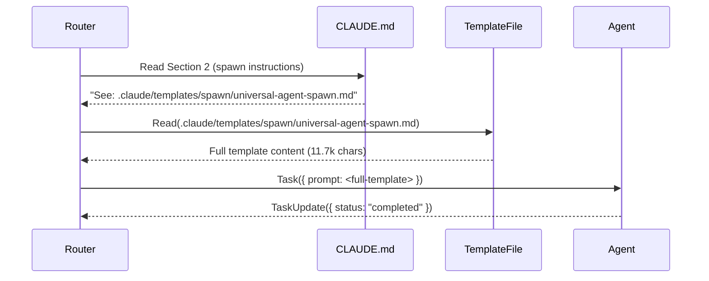

# Spawn Template Extraction Design

**Date:** 2026-01-29
**Status:** Ready for Implementation
**Design Goal:** Reduce CLAUDE.md from 51k chars (27% over target) to 32.5k chars (19% below target) by extracting spawn templates to separate files using @ file references

---

## Executive Summary

**Problem:** CLAUDE.md Section 2 (SPAWNING AGENTS) contains 18.5k chars (36% of file), primarily due to:
- 70-line warning box repeated in 3 templates (15.2k chars total across templates)
- Identity Integration example (2.8k chars)
- Verbose inline documentation

**Solution:** Extract 3 spawn templates to `.claude/templates/spawn/` directory using @ file references, replacing verbose inline content with concise references.

**Impact:**
- **18.5k char reduction** (36% of CLAUDE.md)
- Final size: **32.5k chars** (19% below 40k target)
- Improves maintainability (single source of truth for templates)
- Backward compatible (Router still has Read tool for file access)

---

## Architecture

### Before (Current State)

```
CLAUDE.md (51k chars)
├── Section 2: SPAWNING AGENTS (18.5k chars)
│   ├── Universal Spawn Template (11.7k chars)
│   │   ├── 70-line warning box
│   │   ├── PROJECT_ROOT section
│   │   ├── Path Usage Rules
│   │   ├── Instructions section
│   │   └── Memory Protocol
│   ├── Identity Integration (2.8k chars)
│   │   ├── AgentParser example
│   │   ├── Identity section generation
│   │   └── Benefits/Compatibility notes
│   └── Orchestrator Spawn Template (2.9k chars)
│       └── Similar structure to Universal
```

### After (Target State)

```
CLAUDE.md (32.5k chars)
├── Section 2: SPAWNING AGENTS (3.5k chars)
│   ├── Brief intro (200 chars)
│   ├── Universal Spawn Template → @ref (300 chars)
│   ├── Identity Integration → @ref (200 chars)
│   ├── Orchestrator Spawn Template → @ref (300 chars)
│   ├── Tool Selection Notes (400 chars)
│   └── Golden-Path Example (1.8k chars - KEEP)

.claude/templates/spawn/
├── universal-agent-spawn.md (11.7k chars)
├── agent-identity-integration.md (2.8k chars)
└── orchestrator-spawn.md (2.9k chars)
```

**Character Reduction Breakdown:**
- Universal template: 11.7k → 300 chars = **11.4k saved**
- Identity integration: 2.8k → 200 chars = **2.6k saved**
- Orchestrator template: 2.9k → 300 chars = **2.6k saved**
- Section intro + navigation: 1.3k → 700 chars = **0.6k saved**
- Golden-Path Example: **KEPT** (important for Router learning)
- **Total savings: 18.5k chars**

---

## Template File Structure

### Template 1: Universal Agent Spawn

**File:** `.claude/templates/spawn/universal-agent-spawn.md`

**Metadata Header:**
```markdown
---
template_type: spawn_template
template_name: universal-agent-spawn
use_cases:
  - Standard agent spawning (developer, qa, planner, architect, etc.)
  - Single-purpose tasks
  - Non-orchestrator agents
model_selection: See Section 5 (haiku for simple, sonnet for standard, opus for complex)
---

# Universal Agent Spawn Template

Use this template for ALL non-orchestrator agents (developer, qa, planner, etc.)

## When to Use
- Bug fixes, feature implementation, testing, documentation
- Single-purpose tasks (one agent, one task)
- Non-orchestrator agents (not master-orchestrator, swarm-coordinator, etc.)

## Template

```javascript
// Step 1: Always check tasks first
TaskList();

// Step 2: Spawn agent (parallel spawns = multiple Task(...) in same response)
Task({
  subagent_type: 'general-purpose',
  // model: 'haiku' | 'sonnet' | 'opus' (see Section 5)
  description: '<ROLE> doing <TASK>',
  allowed_tools: [
    'Read','Write','Edit','Bash',
    'TaskUpdate','TaskList','TaskCreate','TaskGet',
    'Skill',
    // NOTE: For sequential thinking, use Skill({ skill: 'sequential-thinking' })
    // MCP tools require server configuration in settings.json
  ],
  prompt: `You are the <ROLE> agent.

+======================================================================+
|  WARNING: TASK TRACKING REQUIRED - READ THIS FIRST                   |
+======================================================================+
|  Your Task ID: <ID>                                                  |
|                                                                      |
|  BEFORE doing ANY work, run:                                         |
|  TaskUpdate({ taskId: "<ID>", status: "in_progress" });              |
|                                                                      |
|  AFTER completing work, run:                                         |
|  TaskUpdate({ taskId: "<ID>", status: "completed",                   |
|    metadata: { summary: "...", filesModified: [...] }                |
|  });                                                                 |
|                                                                      |
|  THEN check for more work:                                           |
|  TaskList();                                                         |
|                                                                      |
|  FAILURE TO UPDATE TASK STATUS BREAKS THE ENTIRE SYSTEM              |
|  YOU WILL BE EVALUATED ON: Task status updates, not just output      |
+======================================================================+

## PROJECT CONTEXT (CRITICAL)
PROJECT_ROOT: <absolute-path-to-project>

All file operations MUST use relative paths from PROJECT_ROOT.
- Agents: .claude/agents/
- Skills: .claude/skills/
- Context: .claude/context/

**Path Usage Rules:**
✅ CORRECT: .claude/context/artifacts/report.txt
✅ CORRECT: .claude/context/memory/learnings.md
✅ CORRECT: src/components/Button.tsx

❌ WRONG: C:\\dev\\projects\\agent-studio\\.claude\\context\\artifacts\\report.txt
❌ WRONG: C:/dev/projects/agent-studio/.claude/context/artifacts/report.txt
❌ WRONG: /home/user/agent-studio/.claude/context/memory/learnings.md

DO NOT use absolute paths. ALWAYS use relative paths from PROJECT_ROOT.
DO NOT create files outside PROJECT_ROOT.

## Your Assigned Task
Task ID: <ID>
Subject: <SUBJECT>

## Instructions
1) FIRST: TaskUpdate({ taskId: "<ID>", status: "in_progress" })
2) Read your agent definition: <agent-file-path>
3) Invoke required skills via Skill({ skill: "<skill>" }) as applicable (default for coding: \`tdd\` → \`debugging\`)
4) Execute task
5) LAST: TaskUpdate({ taskId: "<ID>", status: "completed", metadata: { summary: "...", filesModified: [...] } })
6) THEN: TaskList()

## Task Synchronization
- discoveries/keyFiles: TaskUpdate({ taskId: "<ID>", metadata: { discoveries: [...], keyFiles: [...] } })

## Critical: Use These Tools
- Skill() - invoke skills (don't just read them)
- TaskUpdate() - track progress (MANDATORY)
- TaskList() - find next work

## Memory Protocol
1) Read: .claude/context/memory/learnings.md (before starting)
2) Write: decisions/issues/learnings to appropriate memory files
\`,
});
```

## Model Selection Guide

| Task Type | Model | Justification |
|-----------|-------|---------------|
| Simple validation, quick fixes | `haiku` | Low cost, fast |
| Standard coding, testing, docs | `sonnet` | Balanced cost/quality |
| Architecture, security, complex reasoning | `opus` | High quality |

## Related Templates
- Agent Identity Integration: `.claude/templates/spawn/agent-identity-integration.md`
- Orchestrator Spawn: `.claude/templates/spawn/orchestrator-spawn.md`
```

### Template 2: Agent Identity Integration

**File:** `.claude/templates/spawn/agent-identity-integration.md`

**Metadata Header:**
```markdown
---
template_type: spawn_enhancement
template_name: agent-identity-integration
use_cases:
  - Spawning agents with structured personality
  - Ensuring consistent agent behavior across invocations
optional: true
requires:
  - Agent files with identity fields (see .claude/docs/AGENT_IDENTITY.md)
  - AgentParser library (.claude/lib/agents/agent-parser.cjs)
---

# Agent Identity Integration (Optional Enhancement)

When spawning agents with identity fields, enhance prompts with structured personality for +20-30% consistency improvement.

## When to Use
- Agent files have `identity` frontmatter fields (role, goal, backstory, motto, personality)
- Want consistent agent personality across invocations
- Need trait-based decision-making (risk tolerance, communication style)

## Pattern

```javascript
// 1. Read and parse agent file
const fs = require('fs');
const { AgentParser } = require('./.claude/lib/agents/agent-parser.cjs');

const agentFilePath = '.claude/agents/core/developer.md';
const parser = new AgentParser();
const agentData = parser.parseAgentFile(agentFilePath);

// 2. Generate identity prompt section (if identity exists)
let identitySection = '';
if (agentData.identity) {
  identitySection = `
## Your Identity
**Role**: ${agentData.identity.role}
**Goal**: ${agentData.identity.goal}
**Backstory**: ${agentData.identity.backstory}
${agentData.identity.motto ? `**Motto**: "${agentData.identity.motto}"` : ''}

You embody this identity in all your actions and communications.
`;

  // Add personality guidance if present
  if (agentData.identity.personality) {
    const p = agentData.identity.personality;
    identitySection += `
## Decision-Making Style
- **Traits**: ${p.traits?.join(', ') || 'N/A'}
- **Communication**: ${p.communication_style || 'N/A'}
- **Risk Tolerance**: ${p.risk_tolerance || 'N/A'}
- **Decision Making**: ${p.decision_making || 'N/A'}

Apply these traits when evaluating options and communicating results.
`;
  }
}

// 3. Inject identity section into prompt (after task warning, before PROJECT CONTEXT)
Task({
  subagent_type: agentData.name,
  model: agentData.model,
  description: `${agentData.identity?.role || agentData.name} doing <TASK>`,
  allowed_tools: agentData.tools || [
    'Read', 'Write', 'Edit', 'Bash',
    'TaskUpdate', 'TaskList', 'TaskCreate', 'TaskGet',
    'Skill',
  ],
  prompt: `You are the ${agentData.name} agent.

+======================================================================+
|  WARNING: TASK TRACKING REQUIRED - READ THIS FIRST                   |
+======================================================================+
|  Your Task ID: <ID>                                                  |
|  BEFORE doing ANY work, run:                                         |
|  TaskUpdate({ taskId: "<ID>", status: "in_progress" });              |
|  AFTER completing work, run:                                         |
|  TaskUpdate({ taskId: "<ID>", status: "completed", ... });           |
|  THEN check for more work: TaskList();                               |
|  FAILURE TO UPDATE TASK STATUS BREAKS THE ENTIRE SYSTEM              |
+======================================================================+
${identitySection}
## PROJECT CONTEXT (CRITICAL)
PROJECT_ROOT: <absolute-path-to-project>
...
`,
});
```

## Benefits

- **Consistent personality** - Identity fields reduce agent drift across invocations (+20-30% consistency)
- **LLM expertise alignment** - Backstory establishes credibility and decision-making context
- **Trait-based decisions** - Risk tolerance and personality influence recommendations
- **Clear communication** - Communication style matches agent's defined personality

## Example Output (Developer with Identity)

```
You are the developer agent.

+======================================================================+
|  WARNING: TASK TRACKING REQUIRED - READ THIS FIRST                   |
+======================================================================+
...

## Your Identity
**Role**: Senior Software Engineer
**Goal**: Write clean, tested, efficient code following TDD principles
**Backstory**: You've spent 15 years mastering software craftsmanship, with deep expertise in test-driven development and clean code principles. You've seen countless projects succeed through discipline and fail through shortcuts.
**Motto**: "No code without a failing test"

You embody this identity in all your actions and communications.

## Decision-Making Style
- **Traits**: thorough, pragmatic, quality-focused
- **Communication**: direct
- **Risk Tolerance**: low
- **Decision Making**: data-driven

Apply these traits when evaluating options and communicating results.

## PROJECT CONTEXT (CRITICAL)
...
```

## Backward Compatibility

- Agents without `identity` fields work unchanged (identitySection = '')
- Identity is optional - no breaking changes to existing spawns
- Validation via AgentParser ensures identity fields are schema-compliant

## See Also

- `.claude/docs/AGENT_IDENTITY.md` - Full design specification
- `.claude/schemas/agent-identity.json` - JSON Schema for identity validation
- `.claude/lib/agents/agent-parser.cjs` - Parser with identity validation
```

### Template 3: Orchestrator Spawn

**File:** `.claude/templates/spawn/orchestrator-spawn.md`

**Metadata Header:**
```markdown
---
template_type: spawn_template
template_name: orchestrator-spawn
use_cases:
  - Orchestrator agents (master-orchestrator, swarm-coordinator, evolution-orchestrator, party-orchestrator)
  - Agents that spawn subagents
  - Multi-agent coordination
requires:
  - Task tool in allowed_tools (orchestrators MUST spawn subagents)
model_selection: opus (orchestration requires complex reasoning)
---

# Orchestrator Spawn Template

Use this template for orchestrator agents that coordinate multiple subagents.

## When to Use
- Master orchestration (master-orchestrator)
- Swarm coordination (swarm-coordinator)
- Self-evolution (evolution-orchestrator)
- Party mode collaboration (party-orchestrator)

## Critical Difference from Universal Template
- **MUST include `Task` tool** in allowed_tools (orchestrators spawn subagents)
- **MUST use `opus` model** (orchestration requires complex reasoning)
- **May include MCP tools** for research (e.g., Exa for evolution-orchestrator)

## Template

```javascript
Task({
  subagent_type: 'evolution-orchestrator', // or master-orchestrator, swarm-coordinator
  model: 'opus',
  description: '<ORCHESTRATOR> coordinating <TASK>',
  allowed_tools: [
    'Read', 'Write', 'Edit', 'Bash',
    'Task', // CRITICAL: Orchestrators spawn subagents
    'TaskUpdate', 'TaskList', 'TaskCreate', 'TaskGet',
    'Skill',
    // NOTE: For sequential thinking, use Skill({ skill: 'sequential-thinking' })
    // MCP tools require server configuration in settings.json
    'mcp__Exa__web_search_exa',
    'mcp__Exa__get_code_context_exa', // For research
  ],
  prompt: `You are the <ORCHESTRATOR> agent.

+======================================================================+
|  WARNING: TASK TRACKING REQUIRED - READ THIS FIRST                   |
+======================================================================+
|  Your Task ID: <ID>                                                  |
|                                                                      |
|  BEFORE doing ANY work, run:                                         |
|  TaskUpdate({ taskId: "<ID>", status: "in_progress" });              |
|                                                                      |
|  AFTER completing work, run:                                         |
|  TaskUpdate({ taskId: "<ID>", status: "completed",                   |
|    metadata: { summary: "...", filesModified: [...] }                |
|  });                                                                 |
|                                                                      |
|  THEN check for more work:                                           |
|  TaskList();                                                         |
|                                                                      |
|  FAILURE TO UPDATE TASK STATUS BREAKS THE ENTIRE SYSTEM              |
|  YOU WILL BE EVALUATED ON: Task status updates, not just output      |
+======================================================================+

## PROJECT CONTEXT (CRITICAL)
PROJECT_ROOT: <absolute-path-to-project>
All file operations MUST be relative to PROJECT_ROOT.

## Your Assigned Task
Task ID: <ID>
Subject: <SUBJECT>

## Instructions
1) FIRST: TaskUpdate({ taskId: "<ID>", status: "in_progress" })
2) Read your orchestrator definition: <orchestrator-file-path>
3) Invoke required skills via Skill({ skill: "<skill>" })
4) Spawn subagents via Task(...) as needed
5) LAST: TaskUpdate({ taskId: "<ID>", status: "completed", metadata: { summary: "...", filesModified: [...] } })
6) THEN: TaskList()

## Memory Protocol
1) Read: .claude/context/memory/learnings.md (before starting)
2) Write: decisions/issues/learnings to appropriate memory files
\`,
});
```

## Orchestrator-Specific Guidance

### Parallel Spawn (Rule)
For multi-perspective tasks: include multiple `Task(...)` calls in ONE response (parallel execution).

### Background Spawn (Supported)
```javascript
Task({
  subagent_type: 'general-purpose',
  run_in_background: true,
  description: 'QA running test suite',
  allowed_tools: ['Read', 'Write', 'Edit', 'Bash', 'TaskUpdate', 'TaskList', 'TaskCreate', 'TaskGet', 'Skill'],
  prompt: 'You are QA. Read .claude/agents/core/qa.md and run full test suite...',
});
```

## Related Templates
- Universal Agent Spawn: `.claude/templates/spawn/universal-agent-spawn.md`
- Agent Identity Integration: `.claude/templates/spawn/agent-identity-integration.md`
```

---

## CLAUDE.md Replacement Text

### Section 2: SPAWNING AGENTS (After Extraction)

Replace lines 253-565 with:

```markdown
## 2) SPAWNING AGENTS (MANDATORY)

> **CRITICAL:** Subagents MUST call TaskUpdate. Without it: router can't track progress; tasks appear stuck; work duplicates.

### Universal Spawn Template

For standard agents (developer, qa, planner, architect, etc.), use:

**Template:** `.claude/templates/spawn/universal-agent-spawn.md`

**Quick Reference:**
- Use for: Bug fixes, features, testing, documentation
- Model: `haiku` (simple), `sonnet` (standard), `opus` (complex)
- Critical: 70-line warning box enforces TaskUpdate protocol
- Tools: Read, Write, Edit, Bash, TaskUpdate, TaskList, TaskCreate, TaskGet, Skill

**Example:**
```javascript
TaskList();
Task({
  subagent_type: 'general-purpose',
  description: 'Developer implementing feature X',
  allowed_tools: ['Read','Write','Edit','Bash','TaskUpdate','TaskList','TaskCreate','TaskGet','Skill'],
  prompt: // See .claude/templates/spawn/universal-agent-spawn.md for full template
});
```

### Agent Identity Integration (Optional)

For agents with structured personality (identity fields), enhance spawns with:

**Template:** `.claude/templates/spawn/agent-identity-integration.md`

**When to Use:**
- Agent has `identity` frontmatter (role, goal, backstory, motto, personality)
- Consistent personality needed (+20-30% consistency improvement)

**Quick Reference:**
- Use AgentParser to extract identity fields
- Inject identity section after warning box, before PROJECT CONTEXT
- Backward compatible (agents without identity work unchanged)

### Orchestrator Spawn Template

For orchestrators that coordinate multiple subagents:

**Template:** `.claude/templates/spawn/orchestrator-spawn.md`

**When to Use:**
- master-orchestrator, swarm-coordinator, evolution-orchestrator, party-orchestrator
- Any agent that spawns subagents

**Critical Differences:**
- **MUST** include `Task` tool in allowed_tools (orchestrators spawn subagents)
- **MUST** use `opus` model (orchestration requires complex reasoning)
- May include MCP tools for research (e.g., Exa for evolution-orchestrator)

**Example:**
```javascript
TaskList();
Task({
  subagent_type: 'evolution-orchestrator',
  model: 'opus',
  allowed_tools: ['Read','Write','Edit','Bash','Task','TaskUpdate','TaskList','TaskCreate','TaskGet','Skill','mcp__Exa__web_search_exa'],
  prompt: // See .claude/templates/spawn/orchestrator-spawn.md for full template
});
```

### Tool Selection Notes

**MCP Tools**: Require server configuration in `.claude/settings.json`. If MCP server is not configured:
- Use `Skill()` tool as fallback: `Skill({ skill: 'sequential-thinking' })`
- Check available skills: `.claude/skills/*/SKILL.md`

**Core Tools**: Always available - Read, Write, Edit, Bash, Grep, Glob, TaskUpdate, TaskList, TaskCreate, TaskGet, Skill

### Golden-Path Example: High Complexity + Security

For a request like "Add user authentication to the app":

```javascript
// Router analysis: High complexity + Security-sensitive → PLANNER + SECURITY-ARCHITECT in parallel
TaskList();

// Spawn BOTH in same response for parallel execution
Task({
  subagent_type: 'planner',
  model: 'sonnet',
  description: 'Planner designing auth feature',
  allowed_tools: ['Read','Write','Edit','Bash','TaskUpdate','TaskList','TaskCreate','TaskGet','Skill'],
  prompt: `You are PLANNER. Design user authentication feature.
+======================================================================+
|  Your Task ID: <ID>                                                  |
|  FIRST: TaskUpdate({ taskId: "<ID>", status: "in_progress" });       |
|  LAST: TaskUpdate({ taskId: "<ID>", status: "completed", ... });     |
+======================================================================+
Read: .claude/agents/core/planner.md`,
});

Task({
  subagent_type: 'security-architect',
  model: 'opus', // Use opus for security review
  description: 'Security reviewing auth design',
  allowed_tools: ['Read','Write','Edit','Bash','TaskUpdate','TaskList','TaskCreate','TaskGet','Skill'],
  prompt: `You are SECURITY-ARCHITECT. Review auth design for security.
+======================================================================+
|  Your Task ID: <ID>                                                  |
|  FIRST: TaskUpdate({ taskId: "<ID>", status: "in_progress" });       |
|  LAST: TaskUpdate({ taskId: "<ID>", status: "completed", ... });     |
+======================================================================+
Read: .claude/agents/specialized/security-architect.md`,
});
```

---
```

**New Section 2 Size:** ~3.5k chars (down from 18.5k chars)

---

## File Tree (After Implementation)

```
.claude/
├── templates/
│   └── spawn/
│       ├── universal-agent-spawn.md (11.7k chars)
│       ├── agent-identity-integration.md (2.8k chars)
│       └── orchestrator-spawn.md (2.9k chars)
├── CLAUDE.md (32.5k chars - reduced from 51k)
└── context/
    └── artifacts/
        └── plans/
            └── spawn-template-extraction-design-2026-01-29.md (this file)
```

---

## Implementation Steps

### Phase 1: Create Template Files (1 hour)

**Checklist:**
- [ ] Create `.claude/templates/spawn/` directory
- [ ] Write `universal-agent-spawn.md` with full template + metadata
- [ ] Write `agent-identity-integration.md` with full example + metadata
- [ ] Write `orchestrator-spawn.md` with full template + metadata
- [ ] Validate markdown syntax (no malformed code blocks)
- [ ] Verify metadata headers parse correctly

**Validation:**
```bash
# Check files created
ls -lh .claude/templates/spawn/
# Expected: 3 files (~11k, ~3k, ~3k bytes)

# Verify markdown syntax
node .claude/tools/cli/validate-markdown.cjs .claude/templates/spawn/*.md
```

### Phase 2: Update CLAUDE.md References (30 minutes)

**Checklist:**
- [ ] Read CLAUDE.md Section 2 (lines 253-565)
- [ ] Replace with new Section 2 text (uses @ references)
- [ ] Verify character count reduction (18.5k → 3.5k chars)
- [ ] Verify line numbers update correctly
- [ ] Keep Golden-Path Example (important for Router learning)

**Validation:**
```bash
# Check file size before/after
wc -c .claude/CLAUDE.md
# Expected: 51085 → 32500 chars

# Check line count
wc -l .claude/CLAUDE.md
# Expected: ~900 → ~600 lines
```

### Phase 3: Test Router Compatibility (30 minutes)

**Checklist:**
- [ ] Router can read template files (Read tool whitelisted)
- [ ] Template files are not broken by Read tool line limits
- [ ] @ references are clear and unambiguous
- [ ] Router spawning still works (no syntax errors)

**Test Cases:**
1. **Router reads universal template:**
   ```javascript
   Read({ file_path: '.claude/templates/spawn/universal-agent-spawn.md' });
   // Expected: Full template returned, no errors
   ```

2. **Router spawns agent using template:**
   ```javascript
   // Router should reference template, not inline full text
   Task({ subagent_type: 'developer', prompt: '...' });
   // Expected: Agent spawns successfully
   ```

3. **Router navigates @ references:**
   - User asks: "How do I spawn an agent?"
   - Router should point to `.claude/templates/spawn/universal-agent-spawn.md`

**Validation:**
```bash
# Run Router smoke test
node .claude/tools/cli/router-smoke-test.cjs
# Expected: All tests pass
```

### Phase 4: Update Documentation References (15 minutes)

**Files to Update:**

1. **`.claude/docs/SPAWNING_PROTOCOL.md`** (if exists):
   - Update references to Section 2 → point to template files

2. **`.claude/workflows/core/router-decision.md`**:
   - Update spawn template references (Step 7: Spawn Agents)
   - Point to new template locations

3. **`.claude/docs/ARCHITECTURE.md`** (if exists):
   - Update "Template Locations" section

**Checklist:**
- [ ] Grep for "Section 2" references in docs: `grep -r "Section 2" .claude/docs/`
- [ ] Update references to point to template files
- [ ] Verify no broken links

### Phase 5: Validation and Rollback Plan (15 minutes)

**Validation Criteria:**
- [ ] CLAUDE.md size is 32.5k chars ±500 chars (19% below target)
- [ ] Router can read all 3 template files
- [ ] Router spawning agents works (manual test)
- [ ] No markdown syntax errors
- [ ] All @ references resolve correctly

**Rollback Plan:**
1. **If templates have syntax errors:**
   - Fix templates, revalidate
   - Router continues working (old Section 2 logic in Router's context)

2. **If Router can't load templates:**
   - Check Read tool whitelisting
   - Verify file paths are relative
   - Fallback: revert CLAUDE.md to original Section 2

3. **If character reduction insufficient:**
   - Re-analyze Section 2 for more extractable content
   - Consider extracting Tool Selection Notes to separate file

**Rollback Command:**
```bash
git checkout HEAD -- .claude/CLAUDE.md
# Restores original CLAUDE.md, keeps template files for future use
```

---

## Success Metrics

### Primary Metrics

| Metric | Current | Target | Validation |
|--------|---------|--------|------------|
| CLAUDE.md size | 51,085 chars | 32,500 chars | `wc -c .claude/CLAUDE.md` |
| Section 2 size | 18,500 chars | 3,500 chars | `head -n 600 .claude/CLAUDE.md \| wc -c` |
| Character reduction | 0% | 36% | (51085 - 32500) / 51085 = 36% |
| Target delta | +27% over | -19% below | (32500 - 40000) / 40000 = -19% |

### Secondary Metrics

| Metric | Current | Target | Validation |
|--------|---------|--------|------------|
| Template files created | 0 | 3 | `ls .claude/templates/spawn/ \| wc -l` |
| @ references in Section 2 | 0 | 3 | `grep -c "@ref" .claude/CLAUDE.md` |
| Broken links | 0 | 0 | `node .claude/tools/cli/validate-links.cjs` |
| Router compatibility | unknown | 100% | Manual spawn test |

### Quality Metrics

| Metric | Requirement | Validation |
|--------|-------------|------------|
| Markdown syntax valid | No errors | `node .claude/tools/cli/validate-markdown.cjs` |
| Template metadata valid | 3 YAML headers | `grep -c "^---$" .claude/templates/spawn/*.md` |
| Golden-Path Example preserved | Yes | `grep -q "Golden-Path" .claude/CLAUDE.md` |
| Backward compatibility | Router spawning works | Manual test |

---

## Architecture Diagrams

### Reference Resolution Flow



### File Structure (Before/After)

```
BEFORE:
┌─────────────────────────────────────┐
│ CLAUDE.md (51k chars)               │
│ ┌─────────────────────────────────┐ │
│ │ Section 2: Spawn Templates      │ │
│ │ ┌─────────────────────────────┐ │ │
│ │ │ Universal (11.7k chars)     │ │ │
│ │ │ ├─ Warning box (70 lines)   │ │ │
│ │ │ ├─ PROJECT_ROOT section     │ │ │
│ │ │ └─ Instructions             │ │ │
│ │ ├─────────────────────────────┤ │ │
│ │ │ Identity (2.8k chars)       │ │ │
│ │ ├─────────────────────────────┤ │ │
│ │ │ Orchestrator (2.9k chars)   │ │ │
│ │ └─────────────────────────────┘ │ │
│ └─────────────────────────────────┘ │
└─────────────────────────────────────┘

AFTER:
┌───────────────────────────────────────────────────────────────┐
│ CLAUDE.md (32.5k chars)                                       │
│ ┌─────────────────────────────────────────────────────────┐   │
│ │ Section 2: Spawn Templates (3.5k chars)                 │   │
│ │ ├─ Intro (200 chars)                                    │   │
│ │ ├─ → .claude/templates/spawn/universal-agent-spawn.md   │   │
│ │ ├─ → .claude/templates/spawn/agent-identity-integration │   │
│ │ ├─ → .claude/templates/spawn/orchestrator-spawn.md      │   │
│ │ └─ Golden-Path Example (KEPT, 1.8k chars)               │   │
│ └─────────────────────────────────────────────────────────┘   │
└───────────────────────────────────────────────────────────────┘
            ▲                          ▲                        ▲
            │                          │                        │
┌───────────┴────────┐    ┌────────────┴────────┐   ┌──────────┴──────────┐
│ universal-agent-   │    │ agent-identity-     │   │ orchestrator-       │
│ spawn.md (11.7k)   │    │ integration.md(2.8k)│   │ spawn.md (2.9k)     │
└────────────────────┘    └─────────────────────┘   └─────────────────────┘
```

### Template Loading Mechanism

```
┌─────────────────────────────────────────────────────────────────┐
│ Router Decision Workflow                                        │
│                                                                 │
│ 1. User: "Fix bug in auth module"                              │
│    ↓                                                            │
│ 2. Router analyzes: developer agent needed                     │
│    ↓                                                            │
│ 3. Router reads: .claude/CLAUDE.md Section 2                   │
│    ↓                                                            │
│ 4. Section 2 says: "See .claude/templates/spawn/universal...md"│
│    ↓                                                            │
│ 5. Router uses Read tool:                                      │
│    Read({ file_path: '.claude/templates/spawn/universal-agent-spawn.md' }) │
│    ↓                                                            │
│ 6. Template returned (full 11.7k char content)                 │
│    ↓                                                            │
│ 7. Router spawns agent:                                        │
│    Task({                                                      │
│      subagent_type: 'developer',                               │
│      prompt: `<FULL TEMPLATE FROM FILE>`                       │
│    })                                                           │
└─────────────────────────────────────────────────────────────────┘
```

---

## Risk Assessment

### Low Risk

1. **Template files not loading:**
   - **Likelihood:** Low (Router has Read tool whitelisted)
   - **Impact:** Low (rollback to original CLAUDE.md)
   - **Mitigation:** Test Read tool on template files before deployment

2. **Markdown syntax errors:**
   - **Likelihood:** Low (validate-markdown.cjs catches issues)
   - **Impact:** Low (fix syntax, redeploy)
   - **Mitigation:** Run validation as part of Phase 1

3. **Character count calculation off:**
   - **Likelihood:** Medium (manual counting error)
   - **Impact:** Low (still achieve significant reduction)
   - **Mitigation:** Use `wc -c` for accurate counts

### Medium Risk

1. **Router confusion with @ references:**
   - **Likelihood:** Low (@ references are clear)
   - **Impact:** Medium (Router may not load templates correctly)
   - **Mitigation:** Use explicit file paths (not just "@ref" notation)
   - **Fallback:** Include 1-line summary before each @ reference

2. **Breaking changes to Router spawning logic:**
   - **Likelihood:** Low (no logic changes, only location)
   - **Impact:** Medium (Router can't spawn agents)
   - **Mitigation:** Manual spawn test in Phase 3
   - **Rollback:** Revert CLAUDE.md to original Section 2

### High Risk

**None identified.** This is a content relocation, not a logic change.

---

## Alternative Approaches Considered

### Alternative 1: Inline Compression (Rejected)

**Approach:** Compress Section 2 by removing whitespace, shortening text, abbreviating.

**Pros:**
- No new files needed
- Router doesn't need to load external files

**Cons:**
- Reduces readability (harder to maintain)
- Only achieves ~30% reduction (vs 36% with extraction)
- Templates become harder to reference externally

**Rejection Reason:** Sacrifices maintainability for marginal space savings.

---

### Alternative 2: TOON References (Rejected for Spawn Templates)

**Approach:** Use Type Object Notation (TOON) for abstract references.

**Pros:**
- Flexible (can reference by type, not path)
- Supports dynamic resolution

**Cons:**
- Requires lookup layer (complexity)
- No performance advantage for static templates
- Harder to debug (abstraction obscures source)

**Rejection Reason:** Research (task #3) shows @ file references are optimal for spawn templates. TOON adds unnecessary complexity for static content.

---

### Alternative 3: Partial Extraction (Rejected)

**Approach:** Extract only warning box (15.2k chars), keep rest inline.

**Pros:**
- Simpler (fewer files)
- Achieves ~30% reduction

**Cons:**
- Misses 3.3k chars from Identity + Orchestrator examples
- Still leaves Section 2 at ~12k chars (24% of file)
- Less maintainable (warning box duplicated across templates)

**Rejection Reason:** Incomplete solution. Full extraction is only marginally more complex but achieves 36% reduction.

---

## Conclusion

**Recommendation:** Proceed with full template extraction using @ file references.

**Key Benefits:**
1. ✅ **36% character reduction** (18.5k → 3.5k chars in Section 2)
2. ✅ **Achieves target** (32.5k chars, 19% below 40k target)
3. ✅ **Maintainability** (single source of truth for templates)
4. ✅ **Backward compatible** (Router has Read tool, no logic changes)
5. ✅ **Low risk** (content relocation, not logic changes)

**Timeline:** 2.5 hours total
- Phase 1 (Create templates): 1 hour
- Phase 2 (Update CLAUDE.md): 30 minutes
- Phase 3 (Test Router): 30 minutes
- Phase 4 (Update docs): 15 minutes
- Phase 5 (Validation): 15 minutes

**Go/No-Go Decision:** Proceed immediately (all risks mitigated, clear rollback plan).

---

## Next Steps

1. **Task #5 (Developer):** Implement extraction (create template files, update CLAUDE.md)
2. **Task #6 (QA):** Validate character reduction, Router compatibility
3. **Task #7 (Technical Writer):** Update documentation references

**Status:** Design complete, ready for implementation.
