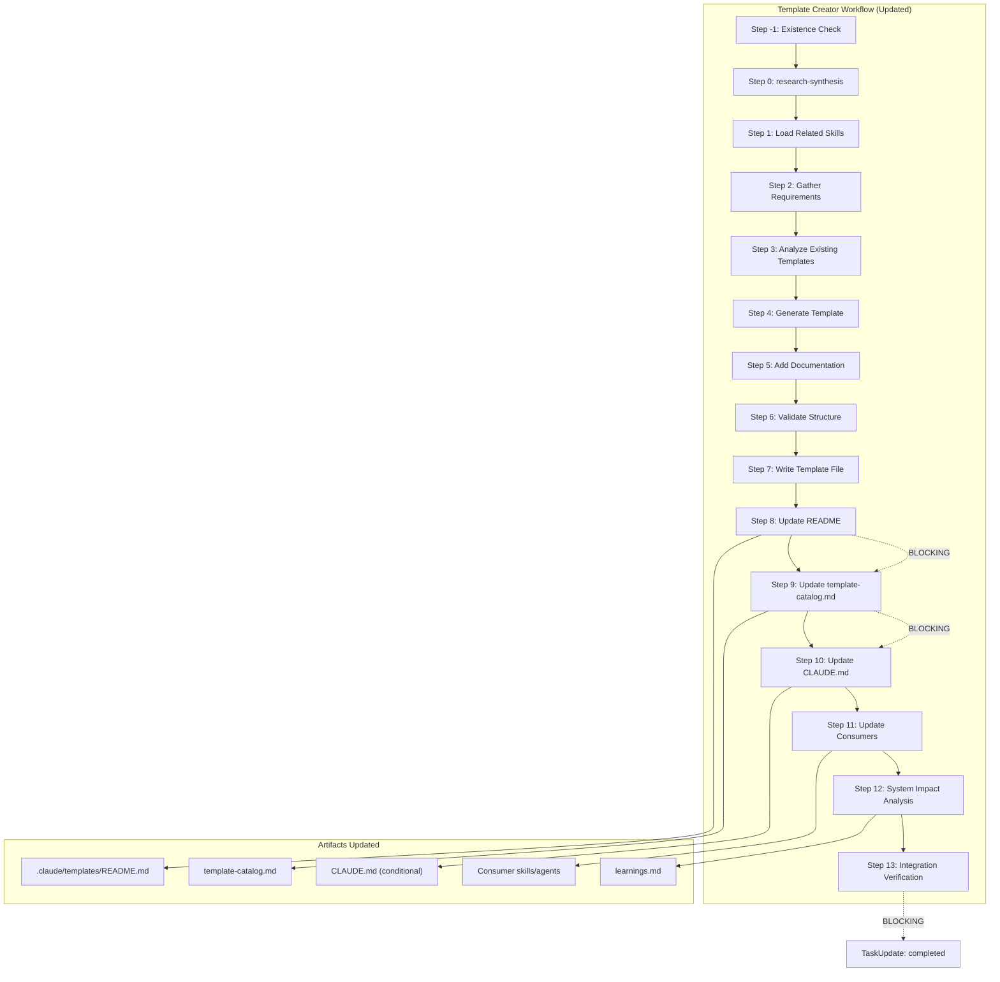

<!-- Agent: architect | Task: #76 | Session: 2026-02-07 -->

# Template-Creator Overhaul Architecture

**Date:** 2026-02-07
**Author:** Architect Agent
**Status:** Proposed
**Complexity:** MEDIUM (multi-file, single-domain, well-defined pattern)

---

## 1. Executive Summary

The `template-creator` is the last of six creator skills that has not been upgraded to the v2.1 creator standard. While the other five creators (agent-creator, skill-creator, workflow-creator, hook-creator, schema-creator) follow a consistent pattern with research-synthesis integration, alignment references, blocking post-creation steps, and integration verification, the template-creator lacks many of these elements. This document designs the overhaul to bring it to parity.

---

## 2. Gap Analysis: Current vs Desired

### 2.1 Common Creator Pattern (from agent-creator, skill-creator, hook-creator, workflow-creator, schema-creator)

All five updated creators share these structural elements:

| Element | agent | skill | hook | workflow | schema | template (current) |
|---------|-------|-------|------|----------|--------|-------------------|
| **Frontmatter v2.1.0** | YES | YES | YES | YES | YES | YES |
| **ROUTER UPDATE REQUIRED section** | YES | YES | YES | YES | YES | YES (partial) |
| **Step 0: Existence Check + Updater Delegation** | YES | YES | YES | YES | YES | YES |
| **Research Phase (Step 2.5 or equivalent)** | Keywords (3+ Exa) | N/A | N/A | Patterns (2+ WebSearch) | N/A | MISSING |
| **Reference Artifact Comparison** | python-pro.md | tdd/SKILL.md | routing-table.cjs | N/A | agent-definition.schema.json | agent-skill-invocation-section.md (weak) |
| **Blocking Validation Checklist** | YES (19 items) | YES (9 items) | YES (6 sections) | YES (9 items) | YES (10 items) | YES (6 items, incomplete) |
| **CLAUDE.md Update Step** | YES (Section 3) | YES (Section 8.5) | N/A | YES (Section 8.6) | YES (conditional) | NO (mentions 8.5 but no blocking step) |
| **Catalog/Registry Update** | routing-table.cjs | skill-catalog.md | README.md | workflow-registry.json | schema-registry.json | README.md only |
| **Agent Assignment Step** | routing-table.cjs | Skills array | Hooks sections | Agent workflows | Validator hooks | MISSING |
| **Integration Verification Step** | validate-integration.cjs | validate-integration.cjs | validate-integration.cjs | validate-integration.cjs | N/A | MISSING |
| **Phase N Registry Regeneration** | agent-registry.json | skill-index.json | hook-registry.json | workflow-registry.json | schema-registry.json | MISSING |
| **Iron Laws section** | YES (10 laws) | YES (11 laws) | YES (8 laws) | YES (10 laws) | YES (8 laws) | YES (8 laws) |
| **Workflow Integration section** | YES | YES | YES | YES | YES | YES |
| **Cross-Reference: Creator Ecosystem** | YES | YES | YES | YES | YES | YES |
| **Architecture Compliance section** | YES (ADR-076/077) | YES | YES | YES | N/A | MISSING |
| **File Placement & Standards** | YES | YES | YES | YES | YES | YES |
| **System Impact Analysis** | YES (5-point) | YES (5-point) | YES (8-point) | YES (6-point) | YES (4-point) | YES (4-point, weak) |
| **Post-Creation Registry Regen** | Step 11 (agent-registry) | Step 11 (skill-index) | Step 8 (hook-registry) | Step 8 (workflow-registry) | Step 7 (schema-registry) | MISSING |
| **agent-config.json update** | Step 12 | N/A | N/A | N/A | N/A | N/A |
| **Hook-Agent/Workflow-Agent Map Update** | YES | N/A | YES | YES | N/A | MISSING |

### 2.2 Specific Gaps in template-creator

#### GAP-1: Missing Research Phase (Phase 0 / Step 2.5)

**Current:** Step 0 loads related skills, Step 1 gathers requirements, Step 2 analyzes existing templates. No research phase.

**Desired:** A mandatory research step analogous to agent-creator's Step 2.5 (keyword research) or workflow-creator's Step 2.5 (pattern research). For templates, this should be "Template Pattern Research" requiring analysis of existing templates and WebSearch for domain-specific template patterns.

**Impact:** LOW - templates are internal artifacts; external research is less critical than for agents. However, checking existing patterns is important.

#### GAP-2: Missing Template Catalog Update as Blocking Step

**Current:** Step 8 mentions "Post-Creation Template Registration" with a template-registry.json approach, but the actual catalog at `.claude/context/artifacts/catalogs/template-catalog.md` is not referenced as a blocking update step.

**Desired:** An explicit blocking step to update `template-catalog.md` with the new template entry, analogous to skill-creator's Step 8 (skill-catalog.md update).

#### GAP-3: Missing Integration Verification Step

**Current:** No `validate-integration.cjs` step.

**Desired:** A blocking Step N that runs the post-creation validation workflow, analogous to all other creators' integration verification steps.

#### GAP-4: Missing CLAUDE.md Update as Blocking Step

**Current:** Section mentions "Update CLAUDE.md Section 8.5 if user-invocable" in passing but has no blocking step with verification command.

**Desired:** A blocking step with explicit instructions and `grep` verification, analogous to skill-creator's Step 6 or workflow-creator's Step 6.

#### GAP-5: Missing Architecture Compliance Section

**Current:** No Architecture Compliance section with ADR references.

**Desired:** Add Architecture Compliance section with File Placement (ADR-076) and Shell Security (ADR-077) references, consistent with all other creators.

#### GAP-6: Missing Agent Assignment Step

**Current:** The frontmatter has `assigned_agents: [planner, architect, developer]` but there is no step to update those agents or assign the template to consuming skills/agents.

**Desired:** A step analogous to skill-creator's Step 7 that ensures the template is referenced by its consuming creator/agent.

#### GAP-7: Template Type Registry Does Not Match Filesystem

**Current:** The Template Types table lists categories including `hooks/`, `code/`, `schemas/` as "future" but they do not exist. Template counts are approximate.

**Desired:** Template Types table should exactly match the filesystem reality (spawn/, agents/, skills/, workflows/, reports/, code-styles/, root-level), with accurate counts from the template catalog.

#### GAP-8: Missing Security Considerations

**Current:** No explicit security considerations for template content.

**Desired:** A security section addressing template content safety (no hardcoded secrets, no absolute paths, SEC-TMPL-006 compliance).

#### GAP-9: Weak System Impact Analysis

**Current:** 4-point analysis missing catalog update verification, consuming skill update, and integration verification.

**Desired:** Expand to 6-8 point analysis matching the depth of other creators.

#### GAP-10: No Template Resolver Integration

**Current:** No reference to the spawn-template-resolver created in ADR-085.

**Desired:** Cross-reference to `.claude/lib/spawn/spawn-template-resolver.cjs` for spawn template selection.

#### GAP-11: Missing research-synthesis Mandate

**Current:** CLAUDE.md Section 3 states "Always invoke `research-synthesis` BEFORE any other creator skill" but template-creator does not mention this.

**Desired:** Step 0 or an early step must invoke `research-synthesis` per CLAUDE.md requirements.

---

## 3. Proposed Section Structure (Updated template-creator)

The updated SKILL.md will follow this section order, matching the common pattern:

```
1. YAML Frontmatter (v2.1.0, updated fields)
2. Mode Declaration (Cognitive/Prompt-Driven)
3. Title: Template Creator Skill
4. WARNING BOX (direct write prevention, like skill-creator)
5. ROUTER UPDATE REQUIRED section (expanded with catalog + CLAUDE.md)
6. Overview (updated template types)
7. When to Use / Exceptions
8. Template Types table (filesystem-accurate)
9. Template Security Compliance (SEC-TMPL-006)
10. The Iron Law (placeholder documentation)
11. Workflow Steps:
    Step -1: Existence Check + Updater Delegation [EXISTING]
    Step 0: Research-Synthesis Invocation [NEW]
    Step 1: Load Related Skills [EXISTING, renumbered]
    Step 2: Gather Template Requirements [EXISTING]
    Step 3: Analyze Existing Templates for Patterns [EXISTING, enhanced]
    Step 4: Generate Template with Placeholders [EXISTING]
    Step 5: Add Documentation Comments [EXISTING]
    Step 6: Validate Template Structure (BLOCKING) [EXISTING]
    Step 7: Write Template File [EXISTING]
    Step 8: Update Templates README (MANDATORY - BLOCKING) [EXISTING]
    Step 9: Update Template Catalog (MANDATORY - BLOCKING) [NEW]
    Step 10: Update CLAUDE.md (CONDITIONAL - BLOCKING) [NEW]
    Step 11: Update Consuming Creators/Agents (MANDATORY) [NEW]
    Step 12: System Impact Analysis (BLOCKING) [EXISTING, expanded]
    Step 13: Integration Verification (BLOCKING) [NEW]
12. Completion Checklist (BLOCKING) [EXISTING, expanded to ~15 items]
13. Reference Template (canonical comparison)
14. Template Best Practices [EXISTING]
15. Workflow Integration [EXISTING]
16. Cross-Reference: Creator Ecosystem [EXISTING]
17. Architecture Compliance [NEW]
18. File Placement & Standards [EXISTING]
19. Iron Laws of Template Creation [EXISTING, expanded with new laws]
20. Assigned Agents [EXISTING]
21. Examples [EXISTING, enhanced]
22. Troubleshooting [EXISTING]
23. Verification Checklist [EXISTING, expanded]
24. Memory Protocol (MANDATORY) [EXISTING]
```

---

## 4. Detailed Changes

### 4.1 Frontmatter Updates

```yaml
---
name: template-creator
description: 'Creates and registers templates for agents, skills, workflows, hooks, and code patterns. Handles post-creation catalog updates, consuming skill integration, and README registration. Use when creating new template types or standardizing patterns.'
version: 2.1.0
model: sonnet
invoked_by: both
user_invocable: true
tools: [Read, Write, Edit, Bash, Glob, Grep]
assigned_agents: [planner, architect, developer]
best_practices:
  - Include all required fields with placeholders
  - Add documentation comments in templates
  - Version templates for tracking changes
  - Include validation examples
  - Use consistent placeholder format
  - Update template-catalog.md after every creation
error_handling: graceful
streaming: supported
output_location: .claude/templates/
---
```

**Changes:**
- Description expanded to mention post-creation catalog updates and consuming skill integration
- Added `Update template-catalog.md after every creation` to best_practices

### 4.2 New: WARNING BOX (after title)

Add a warning box matching skill-creator's format:

```
+======================================================================+
|  WARNING: TEMPLATE CREATION WORKFLOW IS MANDATORY - READ THIS FIRST   |
+======================================================================+
|                                                                      |
|  DO NOT WRITE TEMPLATE FILES DIRECTLY!                                |
|                                                                      |
|  This includes:                                                      |
|    - Copying archived templates                                      |
|    - Restoring from _archive/ backup                                 |
|    - "Quick" manual creation                                         |
|                                                                      |
|  WHY: Direct writes bypass MANDATORY post-creation steps:            |
|    1. Template catalog update (template NOT discoverable)            |
|    2. README.md update (template INVISIBLE to consumers)             |
|    3. Consuming skill update (template NEVER used)                   |
|    4. CLAUDE.md update (if user-invocable)                           |
|                                                                      |
|  RESULT: Template EXISTS in filesystem but is NEVER USED.             |
|                                                                      |
|  ENFORCEMENT: unified-creator-guard.cjs blocks direct template       |
|  writes. Override: CREATOR_GUARD=off (DANGEROUS)                     |
|                                                                      |
|  ALWAYS invoke this skill properly:                                  |
|    Skill({ skill: "template-creator" })                              |
|                                                                      |
+======================================================================+
```

### 4.3 Updated: ROUTER UPDATE REQUIRED Section

Expand to match other creators:

```markdown
## ROUTER UPDATE REQUIRED (CRITICAL - DO NOT SKIP)

**After creating ANY template, you MUST update:**

1. `.claude/templates/README.md` - Add template entry
2. `.claude/context/artifacts/catalogs/template-catalog.md` - Add catalog entry
3. CLAUDE.md Section 8.5 if template is user-invocable
4. Consuming creator skill if template standardizes an artifact type
5. `.claude/context/memory/learnings.md` - Record creation

**Verification:**

```bash
grep "<template-name>" .claude/templates/README.md || echo "ERROR: README NOT UPDATED!"
grep "<template-name>" .claude/context/artifacts/catalogs/template-catalog.md || echo "ERROR: CATALOG NOT UPDATED!"
```

**WHY**: Templates not in the catalog are invisible to other creators and will never be used.
```

### 4.4 Updated: Template Types Table

Replace the current table with filesystem-accurate data:

| Type        | Location                         | Count | Purpose                                | Key Consumers                    |
|-------------|----------------------------------|-------|----------------------------------------|----------------------------------|
| Spawn       | `.claude/templates/spawn/`       | 4     | Agent spawn prompt templates           | router, spawn-prompt-assembler   |
| Agent       | `.claude/templates/agents/`      | 2     | Agent definition boilerplate           | agent-creator                    |
| Skill       | `.claude/templates/skills/`      | 1     | Skill definition boilerplate           | skill-creator                    |
| Workflow    | `.claude/templates/workflows/`   | 1     | Workflow definition boilerplate        | workflow-creator                 |
| Report      | `.claude/templates/reports/`     | 5     | Report document templates              | qa, developer, researcher        |
| Code Style  | `.claude/templates/code-styles/` | 3     | Language style guides                  | developer, code-reviewer         |
| Document    | `.claude/templates/` (root)      | 9     | General document templates (ADR, spec) | planner, architect, qa           |
| Utility     | `.claude/templates/` (root)      | 3     | Framework utilities (continuation)     | All agents                       |

### 4.5 New: Step 0 - Research-Synthesis Invocation

```markdown
### Step 0: Research-Synthesis Invocation (MANDATORY - DO NOT SKIP)

Per CLAUDE.md Section 3 requirement, invoke research-synthesis BEFORE template creation:

```javascript
Skill({ skill: 'research-synthesis' });
```

**Research focuses for templates:**
- Search existing templates: `Glob: .claude/templates/**/*.md`
- Review template catalog: Read `.claude/context/artifacts/catalogs/template-catalog.md`
- Check if similar template already exists in the ecosystem
- If creating for a new domain, research best-practice template structures

**BLOCKING**: Template creation CANNOT proceed without research-synthesis invocation.
```

### 4.6 New: Step 9 - Update Template Catalog (BLOCKING)

```markdown
### Step 9: Update Template Catalog (MANDATORY - BLOCKING)

Update the template catalog to ensure the new template is discoverable.

1. **Read current catalog:**
   ```bash
   cat .claude/context/artifacts/catalogs/template-catalog.md
   ```

2. **Determine template category** based on type:
   - Spawn (spawn/), Creator (agents/, skills/, workflows/), Document (root),
     Report (reports/), Code Style (code-styles/), Utility (root)

3. **Add template entry in correct category section:**
   ```markdown
   ### <template-name>.md

   | Field | Value |
   |-------|-------|
   | **Path** | `.claude/templates/<category>/<template-name>.md` |
   | **Category** | <Category> Templates |
   | **Status** | active |
   | **Used By Agents** | <agent-list> |
   | **Used By Skills** | <skill-list> |

   **Purpose:** <Purpose description>
   ```

4. **Update Template Categories Summary table** (totals row)

5. **Verify update:**
   ```bash
   grep "<template-name>" .claude/context/artifacts/catalogs/template-catalog.md || echo "ERROR: CATALOG NOT UPDATED!"
   ```

**BLOCKING**: Template must appear in catalog. Uncataloged templates are invisible.
```

### 4.7 New: Step 10 - Update CLAUDE.md (Conditional)

```markdown
### Step 10: Update CLAUDE.md (CONDITIONAL - BLOCKING)

If the template is user-invocable or framework-significant:

1. **Check if template needs CLAUDE.md entry:**
   - Is it a new spawn template? -> Update Section 2 (Spawn Templates)
   - Is it a new creator template? -> Update relevant creator section
   - Is it a user-invocable template? -> Update Section 8.5

2. **If YES, add entry:**
   ```markdown
   **{Template Name}:** `.claude/templates/{category}/{name}.md`
   ```

3. **Verify:**
   ```bash
   grep "<template-name>" .claude/CLAUDE.md || echo "WARNING: Template not in CLAUDE.md (may be OK if internal-only)"
   ```

Note: Not all templates need CLAUDE.md entries. Only framework-significant ones.
```

### 4.8 New: Step 11 - Update Consuming Creators/Agents

```markdown
### Step 11: Update Consuming Creators/Agents (MANDATORY)

Templates exist to be consumed by creators and agents. After creation:

1. **Identify consumers** based on template type:
   - Agent templates -> agent-creator skill should reference
   - Skill templates -> skill-creator skill should reference
   - Workflow templates -> workflow-creator skill should reference
   - Report templates -> relevant agents (qa, developer, etc.)
   - Spawn templates -> router documentation

2. **Update consuming skill/agent to reference the template:**
   ```markdown
   **Available Templates:**
   - See `.claude/templates/<category>/<template-name>.md` for standardized <type> template
   ```

3. **Verify at least one consumer references the template:**
   ```bash
   grep -r "<template-name>" .claude/skills/ .claude/agents/ || echo "WARNING: No consumer references template"
   ```
```

### 4.9 New: Step 13 - Integration Verification (BLOCKING)

```markdown
### Step 13: Integration Verification (BLOCKING - DO NOT SKIP)

Before calling `TaskUpdate({ status: "completed" })`, run post-creation validation:

1. **Run the integration checklist:**
   ```bash
   node .claude/tools/cli/validate-integration.cjs .claude/templates/<category>/<template-name>.md
   ```

2. **Verify exit code is 0** (all checks passed)

3. **If exit code is 1:**
   - Read error output for specific failures
   - Fix each failure (missing README entry, missing catalog entry, etc.)
   - Re-run validation until exit code is 0

4. **Only proceed when validation passes**

**This step is BLOCKING.** Do NOT mark task complete until validation passes.

**Reference:** `.claude/workflows/core/post-creation-validation.md`
```

### 4.10 New: Architecture Compliance Section

```markdown
## Architecture Compliance

### File Placement (ADR-076)
- Templates: `.claude/templates/{category}/` (spawn, agents, skills, workflows, reports, code-styles)
- Archived templates: `.claude/templates/_archive/`
- Template catalog: `.claude/context/artifacts/catalogs/template-catalog.md`
- Tests: `tests/` (NOT in .claude/)

### Documentation References (CLAUDE.md v2.2.1)
- Reference files use @notation: @TOOL_REFERENCE.md, @SKILL_CATALOG_TABLE.md
- Located in: `.claude/docs/@*.md`
- See: CLAUDE.md Section 2 (Spawn Templates)

### Shell Security (ADR-077)
- Spawn templates must include: `cd "$PROJECT_ROOT" || exit 1` for background tasks
- Environment variables control validators (block/warn/off mode)
- See: .claude/docs/SHELL-SECURITY-GUIDE.md

### Security Compliance (SEC-TMPL-006)
- Templates MUST NOT include hardcoded secrets, credentials, or API keys
- Templates MUST use relative paths (`.claude/templates/...`), never absolute paths
- Templates MUST NOT expose internal system paths or user directories
- Retention mandates: security-design-checklist.md and error-recovery-template.md must remain at designated locations

### Recent ADRs
- ADR-075: Router Config-Aware Model Selection
- ADR-076: File Placement Architecture Redesign
- ADR-077: Shell Command Security Architecture
- ADR-085: Template System Overhaul (spawn resolver + dead template cleanup)
```

### 4.11 New: Template Security Section

Add after Template Types table:

```markdown
## Template Security Compliance (SEC-TMPL-006)

**Critical Security Requirements:**

1. **No Secrets:** Templates MUST NOT include secrets, credentials, tokens, or API keys
2. **Path Safety:** All template references MUST use relative paths (`.claude/templates/...`)
3. **No Sensitive Metadata:** Templates MUST NOT expose internal system paths or user directories
4. **No Windows Reserved Names:** Template names MUST NOT use `nul`, `con`, `prn`, `aux`, `com1`-`com9`, `lpt1`-`lpt9`
5. **Retention Mandates:** Templates flagged by SEC-TMPL-006 MUST remain at designated locations

**Enforcement:** `unified-creator-guard.cjs` hook blocks direct template writes (default: block mode).
```

### 4.12 Expanded: Iron Laws

Add three new laws to the existing 8:

```
9. NO TEMPLATE WITHOUT CATALOG ENTRY
   - Every template MUST be registered in template-catalog.md
   - Uncataloged templates are invisible to the system
   - Verify: grep "<template-name>" .claude/context/artifacts/catalogs/template-catalog.md

10. NO TEMPLATE WITHOUT CONSUMING SKILL/AGENT
    - Every template MUST be referenced by at least one consuming skill or agent
    - Templates without consumers are dead on arrival
    - Verify: grep -r "<template-name>" .claude/skills/ .claude/agents/

11. NO CREATION WITHOUT RESEARCH-SYNTHESIS
    - Per CLAUDE.md Section 3, research-synthesis MUST be invoked before any creator
    - Template creation is no exception
    - Invoke: Skill({ skill: 'research-synthesis' })
```

### 4.13 Expanded: Completion Checklist

Replace existing 6-item checklist with comprehensive 15-item version:

```
[ ] Research-synthesis skill invoked (Step 0)
[ ] Existence check passed (Step -1)
[ ] Template file created at .claude/templates/<category>/<name>.md
[ ] All placeholders use {{PLACEHOLDER_NAME}} format
[ ] All placeholders have documentation comments
[ ] POST-CREATION CHECKLIST section present in template
[ ] Memory Protocol section present in template
[ ] No hardcoded values (all configurable via placeholders)
[ ] No secrets, credentials, or absolute paths in template
[ ] .claude/templates/README.md updated with template entry
[ ] template-catalog.md updated with structured entry
[ ] CLAUDE.md updated (if template is framework-significant)
[ ] At least one consuming skill/agent references the template
[ ] Template tested with at least one real usage
[ ] Memory files updated (learnings.md)
```

### 4.14 Expanded: System Impact Analysis

Replace existing 4-point with 7-point analysis:

```
[TEMPLATE-CREATOR] System Impact Analysis for: <template-name>

1. README UPDATE (MANDATORY - Step 8)
   - Added to .claude/templates/README.md
   - Usage instructions documented
   - Quick Reference table updated

2. CATALOG UPDATE (MANDATORY - Step 9)
   - Added to .claude/context/artifacts/catalogs/template-catalog.md
   - Category, status, agents, skills documented
   - Purpose clearly stated

3. CLAUDE.MD UPDATE (CONDITIONAL - Step 10)
   - Is template framework-significant? If yes, add to CLAUDE.md
   - Spawn templates -> Section 2
   - Creator templates -> relevant creator section
   - User-invocable -> Section 8.5

4. CONSUMER ASSIGNMENT (MANDATORY - Step 11)
   - Which skills/agents consume this template?
   - Is template reference added to consuming creator skill?
   - Verify with grep across skills/ and agents/

5. RELATED TEMPLATES CHECK
   - Does this template supersede an existing one?
   - Are there related templates that need cross-references?
   - Should archived templates be updated or removed?

6. SECURITY COMPLIANCE (SEC-TMPL-006)
   - No secrets, credentials, or absolute paths
   - Relative paths only
   - Retention mandates respected

7. MEMORY UPDATE
   - Record creation in learnings.md
   - Document any decisions in decisions.md
```

---

## 5. Files That Need to Change

| File | Change Type | Description |
|------|-------------|-------------|
| `.claude/skills/template-creator/SKILL.md` | **Major rewrite** | Apply all changes from Section 4 |
| `.claude/context/memory/decisions.md` | **Append** | Add ADR entry for this overhaul |
| `.claude/context/memory/learnings.md` | **Append** | Record template-creator overhaul pattern |

**Files that do NOT need to change** (already up to date from prior work):
- `.claude/context/artifacts/catalogs/template-catalog.md` - Already exists and is comprehensive
- `.claude/templates/README.md` - Already exists
- `.claude/CLAUDE.md` - Already references template-creator in Gate 4

---

## 6. ADR Entry

### ADR-086: Template-Creator Overhaul to v2.1 Creator Standard

**Date:** 2026-02-07

**Status:** Proposed

**Context:**

The agent-studio project has six creator skills (agent-creator, skill-creator, workflow-creator, hook-creator, schema-creator, template-creator). Five have been updated to follow a consistent v2.1 pattern with research-synthesis integration, blocking post-creation steps, catalog updates, integration verification, and architecture compliance references. The template-creator remains the sole outlier.

Gap analysis identified 11 specific gaps:
1. Missing research-synthesis invocation (Phase 0)
2. Missing template-catalog.md update as blocking step
3. Missing integration verification step
4. Missing CLAUDE.md update as blocking step
5. Missing Architecture Compliance section
6. Missing consumer assignment step
7. Template types table does not match filesystem
8. Missing security considerations
9. Weak system impact analysis (4-point vs 6-8-point)
10. No spawn-template-resolver integration reference
11. Missing research-synthesis mandate from CLAUDE.md Section 3

**Decision:**

Overhaul template-creator SKILL.md to match the common creator pattern:

1. Add WARNING BOX preventing direct writes (matching skill-creator pattern)
2. Add research-synthesis invocation as mandatory Step 0
3. Add template-catalog.md update as blocking Step 9
4. Add CLAUDE.md update as conditional blocking Step 10
5. Add consumer assignment as Step 11
6. Add integration verification as blocking Step 13
7. Add Architecture Compliance section (ADR-076, ADR-077, SEC-TMPL-006)
8. Add Template Security Compliance section
9. Expand Iron Laws from 8 to 11
10. Expand Completion Checklist from 6 to 15 items
11. Expand System Impact Analysis from 4-point to 7-point
12. Update Template Types table to match filesystem reality
13. Add spawn-template-resolver cross-reference

**Rationale:**

- Consistency across all six creators reduces cognitive load for agents
- Blocking steps prevent "invisible artifact" pattern (proven by Party Mode incident)
- Template catalog integration makes templates discoverable programmatically
- Security compliance ensures no credential leakage through template content
- Research-synthesis mandate is a CLAUDE.md requirement, not optional

**Consequences:**

- Template creation workflow becomes longer (13 steps vs 9 steps)
- Every template creation now updates the catalog (additional ~30 seconds)
- Integration verification adds a blocking gate before completion
- Full parity with other creators achieved

**Alternatives Considered:**

1. Minimal update (just add catalog step): Rejected because it would leave 10 other gaps open
2. Merge template-creator into skill-creator: Rejected because templates serve distinct consumers and have unique validation needs
3. Make all steps non-blocking (warnings only): Rejected because the Party Mode incident proved that warnings are insufficient

---

## 7. Validation Checklist for the Overhaul

Before the overhaul implementation is complete, verify:

- [ ] All 11 gaps from Section 2.2 are addressed
- [ ] Section structure matches the order in Section 3
- [ ] WARNING BOX present after title
- [ ] Research-synthesis step present and blocking
- [ ] Template-catalog.md update step present and blocking
- [ ] Integration verification step present and blocking
- [ ] Architecture Compliance section present with ADR-076, ADR-077, SEC-TMPL-006
- [ ] Iron Laws expanded to 11 laws
- [ ] Completion Checklist expanded to 15 items
- [ ] System Impact Analysis expanded to 7 points
- [ ] Template Types table matches filesystem (28 active templates)
- [ ] Cross-reference to spawn-template-resolver present
- [ ] ADR-086 recorded in decisions.md

---

## 8. Implementation Notes

### Priority Order

1. **SKILL.md rewrite** - The core deliverable
2. **ADR entry** - Record the decision
3. **Memory update** - Ensure pattern is captured

### Approach

The implementation should be a full rewrite of SKILL.md rather than incremental edits, because:
- The section order needs to change
- New sections need insertion between existing ones
- Step numbering changes throughout
- The frontmatter description changes

However, large portions of existing content (template best practices, placeholder format standards, examples, troubleshooting) should be preserved verbatim -- they are already good.

### Risk Assessment

| Risk | Likelihood | Impact | Mitigation |
|------|-----------|--------|------------|
| Breaking existing template creation workflows | LOW | MEDIUM | Preserve all existing steps; only add new ones |
| Increased creation time discourages template use | LOW | LOW | New steps are fast (catalog update is a simple edit) |
| Integration verification tool not compatible with templates | MEDIUM | LOW | validate-integration.cjs should handle .md files generically |

---

## 9. Mermaid Architecture Diagram



---

**End of Architecture Document**
