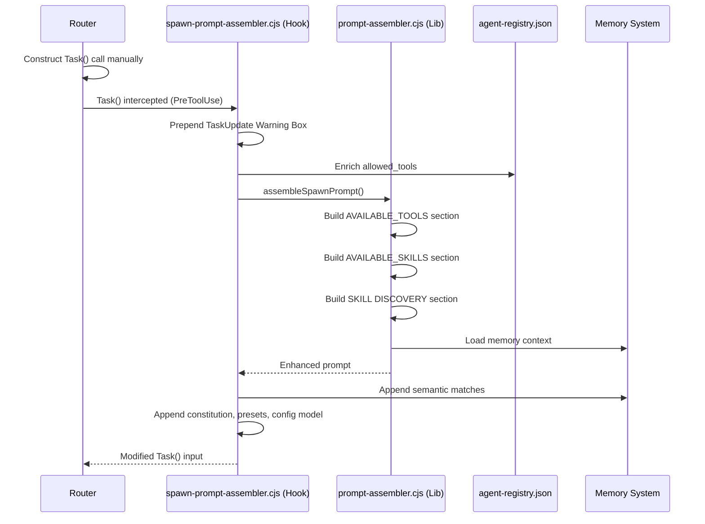
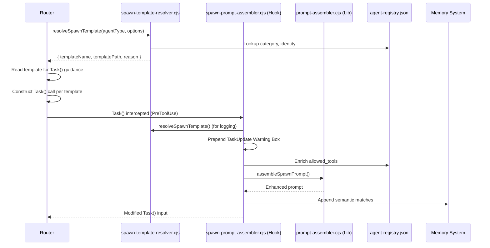

<!-- Agent: architect | Task: #61 | Session: 2026-02-07 -->

# Template System Overhaul -- Architecture Design

**Version:** 1.0.0
**Date:** 2026-02-07
**Status:** Proposed
**Author:** Architect Agent (Task #61)
**Complexity:** HIGH (multi-file, cross-cutting, design + cleanup + catalog expansion)

---

## Table of Contents

1. [Executive Summary](#1-executive-summary)
2. [Current State Analysis](#2-current-state-analysis)
3. [Component 1: Spawn Template Resolver](#3-component-1-spawn-template-resolver)
4. [Component 2: Dead Template Cleanup](#4-component-2-dead-template-cleanup)
5. [Component 3: Template Catalog Expansion](#5-component-3-template-catalog-expansion)
6. [Component 4: Template-Creator Skill Update](#6-component-4-template-creator-skill-update)
7. [Component 5: Template README Update](#7-component-5-template-readme-update)
8. [Data Flow Diagram](#8-data-flow-diagram)
9. [Implementation Sequence](#9-implementation-sequence)
10. [Trade-offs and Risks](#10-trade-offs-and-risks)

---

## 1. Executive Summary

The template system has 43 files across `.claude/templates/` but only about 20% are actively wired into the framework. The spawn prompt assembler (`spawn-prompt-assembler.cjs`) does not read spawn templates from disk at all -- it programmatically generates required fragments. The core library (`prompt-assembler.cjs`) injects AVAILABLE_TOOLS, AVAILABLE_SKILLS, and Memory Context sections into prompts but is template-agnostic.

This design addresses five components:
1. A **spawn template resolver** that selects the appropriate spawn template based on agent type and options
2. A **dead template cleanup strategy** categorizing 28 dead templates
3. A **template catalog expansion** from 0 entries (no catalog file exists) to full coverage
4. A **template-creator skill update** removing phantom references
5. A **template README update** for accuracy

---

## 2. Current State Analysis

### 2.1 Template Inventory (43 files)

| Directory | Count | Status |
|-----------|-------|--------|
| `spawn/` | 6 | 2 wired (universal, orchestrator), 4 dead |
| `agents/` | 2 | Wired (used by agent-creator) |
| `skills/` | 1 | Wired (used by skill-creator) |
| `workflows/` | 1 | Wired (used by workflow-creator) |
| `reports/` | 5 | Dead (zero references) |
| `planning/` | 3 | Dead (zero references) |
| `code-styles/` | 8 | Dead (zero references) |
| `examples/` | 2 | Dead (zero references) |
| Root templates | 15 | Mixed: 5 wired (plan, spec, specification, tasks, adr), 10 dead |

### 2.2 Spawn Infrastructure

Two files handle spawn prompt assembly:

**Hook (PreToolUse Task):** `.claude/hooks/routing/spawn-prompt-assembler.cjs`
- Intercepts every `Task()` call
- Prepends TaskUpdate Warning Box if missing
- Delegates to `prompt-assembler.cjs` for section injection
- Enriches `allowed_tools` from agent-registry
- Appends semantic memory, entity graph, constitution, presets, config model
- Does NOT read any spawn template files from disk

**Library:** `.claude/lib/spawn/prompt-assembler.cjs`
- `assembleSpawnPrompt()` is the core function
- Builds AVAILABLE_TOOLS, AVAILABLE_SKILLS, SKILL DISCOVERY PROTOCOL sections
- Loads memory context, behaviour rules, agent prompt overrides
- Injects all sections into the base prompt at appropriate insertion points
- Also does NOT read spawn template files

**Key finding:** The spawn templates in `.claude/templates/spawn/` are **documentation artifacts** (copy-paste guides for the Router), not programmatically loaded templates. The actual spawn prompt assembly is fully code-driven.

### 2.3 What "wired" means

A template is "wired" if:
1. It is referenced by a creator skill, agent definition, or workflow
2. It is read programmatically by a library module
3. It is explicitly documented in CLAUDE.md as part of the Template Loading Protocol

---

## 3. Component 1: Spawn Template Resolver

### 3.1 Problem Statement

The Router's Template Loading Protocol (CLAUDE.md Section 0) describes reading templates and substituting placeholders, but neither `spawn-prompt-assembler.cjs` nor `prompt-assembler.cjs` implements this. All spawn templates are just markdown documentation that the Router is expected to copy-paste from manually.

The `ORCHESTRATOR_IDS` set in the hook hardcodes which agents are orchestrators, but template selection is not automated.

### 3.2 Proposed Design: `resolveSpawnTemplate(agentType, options)`

**New file:** `.claude/lib/spawn/spawn-template-resolver.cjs`

```javascript
/**
 * Spawn Template Resolver
 *
 * Selects the appropriate spawn template based on agent type,
 * agent config, and spawn options.
 *
 * @module spawn-template-resolver
 */

'use strict';

const fs = require('fs');
const path = require('path');

const TEMPLATES_DIR = path.join(__dirname, '..', '..', 'templates', 'spawn');

const ORCHESTRATOR_IDS = new Set([
  'router',
  'master-orchestrator',
  'evolution-orchestrator',
  'swarm-coordinator',
  'party-orchestrator',
]);

/**
 * Template selection priority (highest to lowest):
 * 1. Explicit templateName in options
 * 2. One-shot subordinate (options.oneShot === true)
 * 3. Orchestrator agents -> orchestrator-spawn.md
 * 4. Agents with identity frontmatter -> agent-identity-integration.md
 * 5. Default -> universal-agent-spawn.md
 *
 * @param {string} agentType - Agent type identifier
 * @param {Object} options - Spawn options
 * @param {string} [options.templateName] - Explicit template override
 * @param {boolean} [options.oneShot] - One-shot subordinate mode
 * @param {boolean} [options.hasIdentity] - Agent has identity frontmatter
 * @param {string} [options.category] - Agent category from registry
 * @returns {{ templateName: string, templatePath: string, reason: string }}
 */
function resolveSpawnTemplate(agentType, options = {}) {
  const normalized = String(agentType || '').toLowerCase().trim();

  // Priority 1: Explicit override
  if (options.templateName) {
    const explicitPath = path.join(TEMPLATES_DIR, options.templateName);
    if (fs.existsSync(explicitPath)) {
      return {
        templateName: options.templateName,
        templatePath: explicitPath,
        reason: 'explicit_override',
      };
    }
  }

  // Priority 2: One-shot subordinate
  if (options.oneShot === true) {
    return {
      templateName: 'subordinate-once.md',
      templatePath: path.join(TEMPLATES_DIR, 'subordinate-once.md'),
      reason: 'one_shot_mode',
    };
  }

  // Priority 3: Orchestrator agents
  if (
    ORCHESTRATOR_IDS.has(normalized) ||
    options.category === 'orchestrator'
  ) {
    return {
      templateName: 'orchestrator-spawn.md',
      templatePath: path.join(TEMPLATES_DIR, 'orchestrator-spawn.md'),
      reason: 'orchestrator_agent',
    };
  }

  // Priority 4: Agents with identity frontmatter
  if (options.hasIdentity === true) {
    return {
      templateName: 'agent-identity-integration.md',
      templatePath: path.join(TEMPLATES_DIR, 'agent-identity-integration.md'),
      reason: 'identity_frontmatter',
    };
  }

  // Priority 5: Default
  return {
    templateName: 'universal-agent-spawn.md',
    templatePath: path.join(TEMPLATES_DIR, 'universal-agent-spawn.md'),
    reason: 'default',
  };
}

module.exports = { resolveSpawnTemplate, ORCHESTRATOR_IDS };
```

### 3.3 Integration Points

**Where to integrate:** The resolver does NOT modify the spawn-prompt-assembler hook. Instead, it serves two consumers:

1. **Router agent (documentation):** The Router reads the resolved template for guidance on how to construct its `Task()` call. The template tells the Router what sections to include, what model to use, and what `allowed_tools` pattern to follow.

2. **Spawn-prompt-assembler hook (optional enrichment):** The hook can optionally read the resolved template to extract template-specific metadata (e.g., required model, mandatory tools). This is an additive enhancement -- if the template file is missing, the hook falls back to current behavior.

**Data flow:**

```
Router prompt instructs: "Read resolved spawn template"
  -> resolveSpawnTemplate(agentType, { category, hasIdentity, oneShot })
  -> Returns { templateName, templatePath, reason }
  -> Router reads templatePath for Task() construction guidance
  -> Router constructs Task() call with appropriate prompt structure
  -> spawn-prompt-assembler hook intercepts Task() call
  -> Hook enriches prompt with tools/skills/memory (existing behavior)
```

### 3.4 Selection Criteria Determination

How does the resolver know the agent's properties?

| Property | Source | Lookup |
|----------|--------|--------|
| `agentType` | `Task()` `subagent_type` parameter | Direct |
| `category` | `agent-registry.json` `.agents[type].category` | Registry lookup |
| `hasIdentity` | Agent `.md` file YAML frontmatter `identity:` field | AgentParser check |
| `oneShot` | `Task()` option or Router decision | Passed explicitly |

**Agent registry integration:**

```javascript
function resolveAgentProperties(agentType) {
  const registry = loadAgentRegistry();
  const agent = registry?.agents?.[agentType];
  return {
    category: agent?.category || 'core',
    hasIdentity: Boolean(agent?.identity),
    filePath: agent?.filePath || '',
  };
}
```

### 3.5 Files Changed

| File | Action | Purpose |
|------|--------|---------|
| `.claude/lib/spawn/spawn-template-resolver.cjs` | NEW | Template resolver module |
| `.claude/hooks/routing/spawn-prompt-assembler.cjs` | MODIFY | Optional: log resolved template in spawn-log |
| `.claude/templates/spawn/universal-agent-spawn.md` | NO CHANGE | Used as-is (documentation) |
| `.claude/templates/spawn/orchestrator-spawn.md` | NO CHANGE | Used as-is (documentation) |
| `.claude/templates/spawn/subordinate-once.md` | NO CHANGE | Used as-is (documentation) |
| `.claude/templates/spawn/agent-identity-integration.md` | NO CHANGE | Used as-is (documentation) |

### 3.6 Trade-offs

**Option A (Chosen): Resolver as advisory module**
- The resolver returns template metadata; the Router uses it for guidance
- spawn-prompt-assembler hook continues to work independently
- Low risk: no changes to the critical-path hook
- Templates remain documentation artifacts

**Option B (Rejected): Resolver loads template content into prompts**
- Template content would be read and injected into spawn prompts
- High risk: spawn templates are 200-350 lines each; duplicating sections already handled by the assembler
- Would cause section duplication (AVAILABLE_TOOLS, Memory Protocol, etc.)
- Rejected because the assembler already programmatically generates all required sections

**Option C (Rejected): Full template rendering engine**
- Templates with `<PLACEHOLDER>` tokens rendered by a template engine
- Maximum flexibility but high complexity
- Rejected because the existing programmatic approach is simpler and more maintainable

---

## 4. Component 2: Dead Template Cleanup

### 4.1 Classification Methodology

Each template evaluated on:
1. **Active references:** grep across codebase for filename/path
2. **Content quality:** Does the template have meaningful, reusable content?
3. **Overlapping coverage:** Is the same concern handled by an existing wired template?
4. **Future utility:** Would this be useful if properly wired?

### 4.2 Disposition Matrix

#### ARCHIVE (move to `.claude/templates/_archive/`) -- 14 templates

Templates that are either duplicated by better alternatives or too generic to be useful, but might have reference value.

| Template | Reason for Archive |
|----------|-------------------|
| `spawn/bash-safe-background.md` | Content already embedded in universal-agent-spawn.md (lines 271-329). Standalone file is redundant. |
| `spawn/router-task-template.md` | Overlaps heavily with universal-agent-spawn.md. Router uses the universal template guidance. |
| `claude-md-template.md` | 16-line stub with zero useful content. No real template structure. |
| `project-brief.md` | Generic project brief. Not agent-studio specific. No references. |
| `prd.md` | Generic PRD template. No agent-studio specific content. Not referenced. |
| `ui-spec.md` | UI specification template. Agent-studio has no UI. Not applicable. |
| `planning/findings.md` | Superseded by `reports/` templates and workspace conventions. |
| `planning/progress.md` | Superseded by TaskUpdate metadata pattern for progress tracking. |
| `planning/task_plan.md` | Good content but superseded by `plan-template.md` which has Phase 0 research, verification gates, and constitution checkpoints. |
| `examples/example-adr-050.md` | Example data, not a template. Archive as reference. |
| `examples/example-specification.md` | Example data, not a template. Archive as reference. |
| `code-styles/dart.md` | Agent-studio is Node.js/CJS. No Dart usage. Keep for reference. |
| `code-styles/csharp.md` | No C# usage in project. Keep for reference. |
| `code-styles/go.md` | No Go usage in project. Keep for reference. |

#### KEEP and WIRE -- 12 templates

Templates with genuine value that need proper integration.

| Template | Wiring Action |
|----------|---------------|
| `architecture.md` | Wire to architect agent. Add to template catalog. Reference in architecture-review workflow. |
| `security-design-checklist.md` | Wire to security-architect agent. Excellent STRIDE checklist. Reference in security-architect skill. |
| `test-plan.md` | Wire to qa agent. Reference in qa workflow for structured test planning. |
| `error-recovery-template.md` | Wire to developer agent and hook-creator skill. JavaScript error recovery pattern. |
| `continuation.md` | Wire to all agents via spawn template. Standardized next-steps presentation. |
| `reports/audit-report-template.md` | Wire to qa agent and security-architect. Used for audit reports. |
| `reports/implementation-report-template.md` | Wire to developer agent. Post-implementation summary template. |
| `reports/plan-template.md` | Wire to planner agent. Report format for plan outputs. |
| `reports/reflection-report-template.md` | Wire to reflection-agent. Structured reflection output. |
| `reports/research-report-template.md` | Wire to researcher agent. Research synthesis output template. |
| `code-styles/typescript.md` | Wire to developer agent. Google TS style guide summary -- directly applicable. |
| `code-styles/javascript.md` | Wire to developer agent. JS style guide -- directly applicable. |

#### DELETE -- 2 templates

Templates with zero value and no foreseeable utility.

| Template | Reason for Delete |
|----------|-------------------|
| `code-styles/html-css.md` | Agent-studio has no HTML/CSS. Pure dead weight. |
| `code-styles/general.md` | Generic coding principles already covered by `.claude/rules/coding-style.md` and `.claude/rules/patterns.md`. Complete overlap. |

#### UPGRADE -- 3 templates

Templates to keep but improve based on industry research (Task #62 will provide input).

| Template | Upgrade Plan |
|----------|-------------|
| `code-styles/python.md` | Upgrade with modern Python 3.12+ patterns, type hints, ruff linting standards. |
| `spec-template.md` | Merge with `specification-template.md` into single canonical spec template. Currently two competing spec templates. |
| `adr-template.md` | Upgrade with structured YAML frontmatter matching the ADR format used in `decisions.md`. |

### 4.3 Implementation

```
Phase 1: Create archive directory
  mkdir .claude/templates/_archive/
  mkdir .claude/templates/_archive/spawn/
  mkdir .claude/templates/_archive/planning/
  mkdir .claude/templates/_archive/examples/
  mkdir .claude/templates/_archive/code-styles/

Phase 2: Archive 14 templates (git mv)
  git mv .claude/templates/spawn/bash-safe-background.md .claude/templates/_archive/spawn/
  git mv .claude/templates/spawn/router-task-template.md .claude/templates/_archive/spawn/
  git mv .claude/templates/claude-md-template.md .claude/templates/_archive/
  git mv .claude/templates/project-brief.md .claude/templates/_archive/
  git mv .claude/templates/prd.md .claude/templates/_archive/
  git mv .claude/templates/ui-spec.md .claude/templates/_archive/
  git mv .claude/templates/planning/findings.md .claude/templates/_archive/planning/
  git mv .claude/templates/planning/progress.md .claude/templates/_archive/planning/
  git mv .claude/templates/planning/task_plan.md .claude/templates/_archive/planning/
  git mv .claude/templates/examples/example-adr-050.md .claude/templates/_archive/examples/
  git mv .claude/templates/examples/example-specification.md .claude/templates/_archive/examples/
  git mv .claude/templates/code-styles/dart.md .claude/templates/_archive/code-styles/
  git mv .claude/templates/code-styles/csharp.md .claude/templates/_archive/code-styles/
  git mv .claude/templates/code-styles/go.md .claude/templates/_archive/code-styles/

Phase 3: Delete 2 templates
  git rm .claude/templates/code-styles/html-css.md
  git rm .claude/templates/code-styles/general.md

Phase 4: Wire 12 templates (update agent definitions, skill references)
  (Detailed wiring actions per template above)

Phase 5: Upgrade 3 templates
  (Requires research input from Task #62)
```

### 4.4 Post-Cleanup Template Count

| Category | Before | After |
|----------|--------|-------|
| Active (wired) | ~9 | ~24 |
| Dead (unreferenced) | ~28 | 0 |
| Archived | 0 | 14 |
| Deleted | 0 | 2 |
| Pending upgrade | 0 | 3 |
| **Total on disk** | **43** | **27 active + 14 archived = 41** |

---

## 5. Component 3: Template Catalog Expansion

### 5.1 Current State

No `template-catalog.md` file exists. The `templates/README.md` serves as informal documentation but lacks structured catalog entries, agent assignments, or usage instructions per template.

### 5.2 Catalog Schema

**New file:** `.claude/context/artifacts/catalogs/template-catalog.md`

Each entry follows this schema:

```markdown
### {template-name}

| Field | Value |
|-------|-------|
| **Name** | {display name} |
| **Path** | `.claude/templates/{path}` |
| **Category** | spawn / agent / skill / workflow / report / code-style / document |
| **Status** | active / deprecated / archived |
| **Used By Agents** | {comma-separated agent list} |
| **Used By Skills** | {comma-separated skill list} |
| **Placeholders** | {count of {{PLACEHOLDER}} tokens} |
| **Last Updated** | {YYYY-MM-DD} |

**Purpose:** {one-line description}

**Usage:** {how to use this template}
```

### 5.3 Category Structure

```
template-catalog.md
  ## Spawn Templates (4 active)
    - universal-agent-spawn.md
    - orchestrator-spawn.md
    - subordinate-once.md
    - agent-identity-integration.md

  ## Creator Templates (4 active)
    - agents/agent-template.md
    - agents/agent-context-template.md
    - skills/skill-template.md
    - workflows/workflow-template.md

  ## Document Templates (8 active)
    - adr-template.md
    - plan-template.md
    - spec-template.md / specification-template.md
    - tasks-template.md
    - architecture.md
    - security-design-checklist.md
    - test-plan.md
    - error-recovery-template.md

  ## Report Templates (5 active)
    - reports/audit-report-template.md
    - reports/implementation-report-template.md
    - reports/plan-template.md
    - reports/reflection-report-template.md
    - reports/research-report-template.md

  ## Code Style Templates (3 active)
    - code-styles/typescript.md
    - code-styles/javascript.md
    - code-styles/python.md

  ## Utility Templates (2 active)
    - continuation.md
    - agent-skill-invocation-section.md
```

### 5.4 Agent Assignment Mapping

| Template | Primary Agents | Supporting Agents |
|----------|---------------|-------------------|
| universal-agent-spawn.md | router | all agents (consumed) |
| orchestrator-spawn.md | router | master-orchestrator, evolution-orchestrator |
| subordinate-once.md | router | any one-shot task |
| agent-identity-integration.md | router | agents with identity fields |
| agents/agent-template.md | agent-creator | planner |
| skills/skill-template.md | skill-creator | planner |
| workflows/workflow-template.md | workflow-creator | planner |
| adr-template.md | architect | planner, developer |
| plan-template.md | planner | architect |
| specification-template.md | planner | spec-gathering skill |
| tasks-template.md | planner | developer |
| architecture.md | architect | planner |
| security-design-checklist.md | security-architect | architect |
| test-plan.md | qa | developer |
| error-recovery-template.md | developer | hook-creator |
| continuation.md | all agents | -- |
| reports/audit-report-template.md | qa, security-architect | -- |
| reports/implementation-report-template.md | developer | -- |
| reports/plan-template.md | planner | -- |
| reports/reflection-report-template.md | reflection-agent | -- |
| reports/research-report-template.md | researcher | evolution-orchestrator |
| code-styles/typescript.md | developer | code-reviewer |
| code-styles/javascript.md | developer | code-reviewer |
| code-styles/python.md | developer | code-reviewer |

### 5.5 Files Changed

| File | Action | Purpose |
|------|--------|---------|
| `.claude/context/artifacts/catalogs/template-catalog.md` | NEW | Full template catalog |

---

## 6. Component 4: Template-Creator Skill Update

### 6.1 Current Issues

The `template-creator` SKILL.md has these problems:
1. References `hooks/`, `code/`, `schemas/` template directories that do not exist
2. These are listed as "Future" in the README but the skill treats them as if they exist
3. `assigned_agents: []` is empty -- no agents are assigned to use this skill
4. Missing spawn template category entirely
5. Missing report template category

### 6.2 Sections to Update

**Section: Template Types table (line 76-83)**

Update to reflect actual directories:

| Type | Location | Status |
|------|----------|--------|
| Agent | `.claude/templates/agents/` | Active (2 templates) |
| Skill | `.claude/templates/skills/` | Active (1 template) |
| Workflow | `.claude/templates/workflows/` | Active (1 template) |
| Spawn | `.claude/templates/spawn/` | Active (4 templates) -- NEW |
| Report | `.claude/templates/reports/` | Active (5 templates) -- NEW |
| Code Style | `.claude/templates/code-styles/` | Active (3 templates) -- NEW |
| Document | `.claude/templates/` (root) | Active (8 templates) -- NEW |
| Hook | `.claude/templates/hooks/` | **Does not exist** -- remove or create |
| Code | `.claude/templates/code/` | **Does not exist** -- remove or create |
| Schema | `.claude/templates/schemas/` | **Does not exist** -- remove or create |

**Section: assigned_agents (line 12)**

Change from `[]` to `[planner, architect, developer]`

**Section: Output Location Rules (lines 793-800)**

Remove references to non-existent directories. Add spawn, report, code-style categories.

**Recommendation:** Either create the `hooks/`, `code/`, `schemas/` directories with at least one template each, OR remove all references. I recommend **removing** the references and marking them as "available for future creation" in a single comment, to avoid "phantom directory" confusion.

### 6.3 Files Changed

| File | Action | Purpose |
|------|--------|---------|
| `.claude/skills/template-creator/SKILL.md` | MODIFY | Fix phantom refs, add missing categories, assign agents |

---

## 7. Component 5: Template README Update

### 7.1 Current Issues

1. Hook Templates section says "Future" -- accurate, keep as-is
2. Code Pattern Templates section says "Future" -- accurate, keep as-is
3. Schema Templates section says "Future" -- accurate, keep as-is
4. Missing spawn templates section entirely
5. Missing report templates section
6. Quick Reference table incomplete (missing spawn, report, code-style rows)
7. Creator Skills table incomplete (missing workflow-creator, hook-creator, template-creator)
8. Code Style Templates section lists all 8 code-styles but 3 will be archived, 2 deleted

### 7.2 Updates Required

1. **Add Spawn Templates section** documenting all 4 active spawn templates
2. **Add Report Templates section** documenting all 5 report templates
3. **Update Code Style Templates section** to list only 3 active templates (typescript, javascript, python)
4. **Update Quick Reference table** with spawn, report, code-style rows
5. **Update Creator Skills table** to include all 6 creators
6. **Add cross-reference** to template-catalog.md
7. **Add Archive section** documenting `.claude/templates/_archive/` and how to restore

### 7.3 Files Changed

| File | Action | Purpose |
|------|--------|---------|
| `.claude/templates/README.md` | MODIFY | Add missing sections, update tables, add archive docs |

---

## 8. Data Flow Diagram

### 8.1 Current Spawn Flow



### 8.2 Proposed Spawn Flow (with Template Resolver)



### 8.3 Template Directory Structure (Post-Cleanup)

```
.claude/templates/
  README.md                          # Updated documentation
  adr-template.md                    # ADR creation (upgrade pending)
  agent-skill-invocation-section.md  # Skill invocation reference
  architecture.md                    # Architecture docs (newly wired)
  continuation.md                    # Next-steps presentation (newly wired)
  error-recovery-template.md         # Error recovery patterns (newly wired)
  plan-template.md                   # Implementation plans
  security-design-checklist.md       # STRIDE checklist (newly wired)
  spec-template.md                   # Spec template (merge pending)
  specification-template.md          # IEEE 830 spec template
  tasks-template.md                  # Task breakdown template
  test-plan.md                       # Test plans (newly wired)
  agents/
    agent-template.md                # Agent creation template
    agent-context-template.md        # Agent context template
  code-styles/
    javascript.md                    # JS style guide (newly wired)
    python.md                        # Python style guide (upgrade pending)
    typescript.md                    # TS style guide (newly wired)
  reports/
    audit-report-template.md         # Audit reports (newly wired)
    implementation-report-template.md # Implementation reports (newly wired)
    plan-template.md                 # Plan reports (newly wired)
    reflection-report-template.md    # Reflection reports (newly wired)
    research-report-template.md      # Research reports (newly wired)
  skills/
    skill-template.md                # Skill creation template
  spawn/
    agent-identity-integration.md    # Identity-enhanced spawning
    orchestrator-spawn.md            # Orchestrator spawning
    subordinate-once.md              # One-shot spawning
    universal-agent-spawn.md         # Default spawning
  workflows/
    workflow-template.md             # Workflow creation template
  _archive/
    README.md                        # Archive index
    spawn/
      bash-safe-background.md
      router-task-template.md
    planning/
      findings.md
      progress.md
      task_plan.md
    code-styles/
      csharp.md
      dart.md
      go.md
    examples/
      example-adr-050.md
      example-specification.md
    claude-md-template.md
    prd.md
    project-brief.md
    ui-spec.md
```

---

## 9. Implementation Sequence

### Phase 1: Spawn Template Resolver (Low Risk)

**Estimated effort:** 2-3 hours
**Dependencies:** None
**Files:**
- NEW: `.claude/lib/spawn/spawn-template-resolver.cjs`
- NEW: `tests/lib/spawn/spawn-template-resolver.test.cjs`

### Phase 2: Dead Template Cleanup (Low Risk)

**Estimated effort:** 1-2 hours
**Dependencies:** None (can parallelize with Phase 1)
**Files:**
- Archive 14 templates via `git mv`
- Delete 2 templates via `git rm`
- NEW: `.claude/templates/_archive/README.md`

### Phase 3: Template Catalog (Low Risk)

**Estimated effort:** 2 hours
**Dependencies:** Phase 2 (need final template list)
**Files:**
- NEW: `.claude/context/artifacts/catalogs/template-catalog.md`

### Phase 4: Template-Creator Skill Update (Low Risk)

**Estimated effort:** 1 hour
**Dependencies:** Phase 2 and Phase 3 (need accurate directory state)
**Files:**
- MODIFY: `.claude/skills/template-creator/SKILL.md`

### Phase 5: Template README Update (Low Risk)

**Estimated effort:** 1 hour
**Dependencies:** Phase 2, Phase 3, Phase 4
**Files:**
- MODIFY: `.claude/templates/README.md`

### Phase 6: Template Wiring (Medium Risk)

**Estimated effort:** 3-4 hours
**Dependencies:** Phase 2, Phase 3
**Files:**
- MODIFY: 8-10 agent definition files (add template references)
- MODIFY: 3-5 skill definition files (add template references)
- MODIFY: CLAUDE.md (update Template Loading Protocol)

### Phase 7: Template Upgrades (Depends on Research)

**Estimated effort:** 2-3 hours
**Dependencies:** Task #62 (research results)
**Files:**
- MODIFY: `adr-template.md`
- MODIFY: `code-styles/python.md`
- DELETE + MERGE: `spec-template.md` into `specification-template.md`

---

## 10. Trade-offs and Risks

### 10.1 Design Decisions

| Decision | Chosen | Alternative | Rationale |
|----------|--------|------------|-----------|
| Resolver as advisory | Yes | Resolver injects template content | Avoids section duplication; assembler already handles injection |
| Archive vs delete dead templates | Archive most | Delete all | Git mv preserves history; archived templates may be reference material |
| Single catalog file | Yes | JSON registry | Markdown is human-readable and agent-friendly; JSON harder to maintain |
| Remove phantom dirs from SKILL.md | Yes | Create empty dirs | Empty dirs with no templates are confusing; better to be explicit |

### 10.2 Risks

| Risk | Likelihood | Impact | Mitigation |
|------|-----------|--------|------------|
| Spawn template changes break Router | Low | High | Resolver is advisory-only; no changes to critical hook path |
| Archive breaks references | Low | Medium | grep for all template paths before archiving |
| Catalog becomes stale | Medium | Low | Template-creator skill updates catalog as post-creation step |
| Template wiring adds maintenance burden | Medium | Low | Catalog and README serve as discovery mechanism |

### 10.3 Open Questions

1. **Spec template merge:** Should `spec-template.md` and `specification-template.md` be merged into one? The former is more concise, the latter is IEEE 830 compliant. Recommendation: keep `specification-template.md` as canonical, archive `spec-template.md`.

2. **Code style templates scope:** Should code-style templates be expanded to cover more languages as the project supports them? Recommendation: keep only languages actively used (JS/TS/Python), archive others, add new ones when demand arises.

3. **Template rendering engine:** Should a future phase implement a proper template rendering engine that processes `{{PLACEHOLDER}}` tokens? Recommendation: defer. The current manual replacement pattern is simple and sufficient. A rendering engine adds complexity without proportional value in a prompt-assembly context.

---

## Appendix A: Template Reference Count (grep results)

Templates with zero references across the codebase (confirmed dead):

- `bash-safe-background.md` -- content embedded in universal-agent-spawn.md
- `router-task-template.md` -- not referenced by any code
- `claude-md-template.md` -- not referenced by any code
- `project-brief.md` -- not referenced by any code
- `prd.md` -- not referenced by any code
- `ui-spec.md` -- not referenced by any code
- `planning/findings.md` -- not referenced by any code
- `planning/progress.md` -- not referenced by any code
- `planning/task_plan.md` -- not referenced by any code
- `examples/example-adr-050.md` -- not referenced by any code
- `examples/example-specification.md` -- not referenced by any code
- `reports/audit-report-template.md` -- not referenced by any code
- `reports/implementation-report-template.md` -- not referenced by any code
- `reports/plan-template.md` -- not referenced by any code
- `reports/reflection-report-template.md` -- not referenced by any code
- `reports/research-report-template.md` -- not referenced by any code
- `code-styles/dart.md` -- not referenced by any code
- `code-styles/csharp.md` -- not referenced by any code
- `code-styles/go.md` -- not referenced by any code
- `code-styles/html-css.md` -- not referenced by any code
- `code-styles/general.md` -- not referenced by any code
- `code-styles/python.md` -- not referenced by any code
- `code-styles/javascript.md` -- not referenced by any code
- `code-styles/typescript.md` -- not referenced by any code
- `architecture.md` -- not referenced by any code
- `security-design-checklist.md` -- not referenced by any code
- `test-plan.md` -- not referenced by any code
- `error-recovery-template.md` -- not referenced by any code
- `continuation.md` -- not referenced by any code

Note: Some templates are referenced in README.md documentation but not in any programmatic code or agent definitions.
