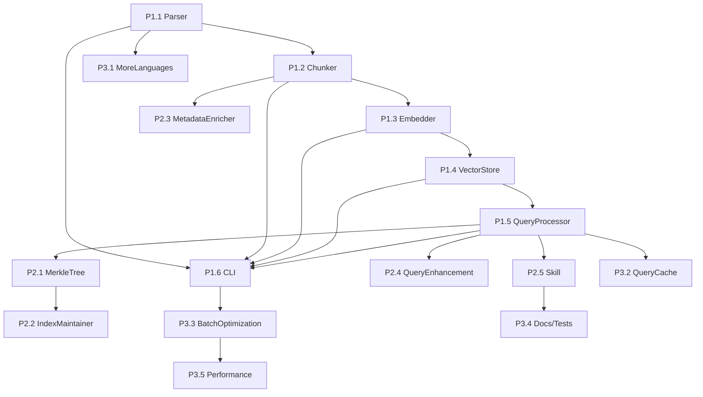

# Code Indexing Implementation Roadmap

**Version:** 1.0
**Status:** DRAFT
**Author:** Architect Agent (Task #35)
**Date:** 2026-01-31
**Parent Document:** CODE_INDEXING_DESIGN.md

---

## Overview

This document provides a phased implementation plan for the Code Indexing and Semantic Search System, with effort estimates, dependencies, and milestones.

**Total Estimated Effort:** 6-8 weeks (1 developer)
**Parallel Development Possible:** Yes (Foundation + Skill can parallelize)

---

## Phase 1: Foundation (Week 1-2)

### P1.1 Tree-Sitter Integration

**File:** `.claude/lib/code-indexing/code-parser.cjs`

**Effort:** 12 hours

**Tasks:**
| Task | Description | Hours | Dependencies |
|------|-------------|-------|--------------|
| P1.1.1 | Install tree-sitter and language grammars (node-tree-sitter, tree-sitter-javascript, tree-sitter-typescript, tree-sitter-python) | 2 | None |
| P1.1.2 | Create CodeParser class with lazy grammar loading | 4 | P1.1.1 |
| P1.1.3 | Implement language detection from file extension | 1 | P1.1.2 |
| P1.1.4 | Add error handling for parse failures | 2 | P1.1.2 |
| P1.1.5 | Write unit tests (15+ tests) | 3 | P1.1.2-4 |

**Acceptance Criteria:**

- [ ] Parse JS/TS/Python files successfully
- [ ] Handle malformed files gracefully
- [ ] 100% test coverage on parser class

**Risks:**

- tree-sitter Node bindings may have platform-specific issues (Windows)
- Mitigation: Test on Windows early, document any workarounds

---

### P1.2 Semantic Chunker

**File:** `.claude/lib/code-indexing/semantic-chunker.cjs`

**Effort:** 16 hours

**Tasks:**
| Task | Description | Hours | Dependencies |
|------|-------------|-------|--------------|
| P1.2.1 | Implement AST traversal for top-level nodes | 4 | P1.1 |
| P1.2.2 | Extract functions/methods as chunks | 3 | P1.2.1 |
| P1.2.3 | Extract classes (split if >2048 tokens) | 3 | P1.2.1 |
| P1.2.4 | Extract interfaces/types | 2 | P1.2.1 |
| P1.2.5 | Token counting (tiktoken or approximation) | 2 | None |
| P1.2.6 | Write unit tests (20+ tests) | 2 | P1.2.1-5 |

**Acceptance Criteria:**

- [ ] Correctly chunk functions, classes, methods
- [ ] Respect 2048 token limit per chunk
- [ ] Handle nested structures (class > method)
- [ ] 100% test coverage

---

### P1.3 Embedding Generator (Local)

**File:** `.claude/lib/code-indexing/embedding-generator.cjs`

**Effort:** 10 hours

**Tasks:**
| Task | Description | Hours | Dependencies |
|------|-------------|-------|--------------|
| P1.3.1 | Install @xenova/transformers (ONNX runtime for Node) | 2 | None |
| P1.3.2 | Implement EmbeddingGenerator class | 3 | P1.3.1 |
| P1.3.3 | Add batch embedding support | 2 | P1.3.2 |
| P1.3.4 | Add embedding cache (optional) | 2 | P1.3.2 |
| P1.3.5 | Write unit tests (10+ tests) | 1 | P1.3.2-4 |

**Model Choice:** `Xenova/all-MiniLM-L6-v2`

- 384 dimensions
- ~25MB model size
- Runs entirely in Node.js via ONNX

**Acceptance Criteria:**

- [ ] Generate 384-dim embeddings locally
- [ ] Batch 100 texts in <10 seconds
- [ ] Cache prevents redundant computation

---

### P1.4 Vector Store (ChromaDB)

**File:** `.claude/lib/code-indexing/vector-store.cjs`

**Effort:** 8 hours

**Tasks:**
| Task | Description | Hours | Dependencies |
|------|-------------|-------|--------------|
| P1.4.1 | Extend existing ChromaDB client for code collection | 2 | ADR-054 infrastructure |
| P1.4.2 | Implement addChunks with metadata | 2 | P1.4.1 |
| P1.4.3 | Implement search with filters | 2 | P1.4.1 |
| P1.4.4 | Implement deleteByPath for updates | 1 | P1.4.1 |
| P1.4.5 | Write integration tests (10+ tests) | 1 | P1.4.2-4 |

**Acceptance Criteria:**

- [ ] Store chunks with embeddings and metadata
- [ ] Query returns ranked results
- [ ] Filters work (language, type, path)

---

### P1.5 Basic Query Processor

**File:** `.claude/lib/code-indexing/query-processor.cjs`

**Effort:** 8 hours

**Tasks:**
| Task | Description | Hours | Dependencies |
|------|-------------|-------|--------------|
| P1.5.1 | Implement query embedding generation | 2 | P1.3 |
| P1.5.2 | Implement vector search call | 2 | P1.4 |
| P1.5.3 | Format results with code context | 2 | P1.5.2 |
| P1.5.4 | Add basic re-ranking (keyword boost) | 1 | P1.5.3 |
| P1.5.5 | Write integration tests (10+ tests) | 1 | P1.5.1-4 |

**Acceptance Criteria:**

- [ ] Natural language query returns relevant code
- [ ] Results include file path and line numbers
- [ ] Keyword matches boost relevance

---

### P1.6 CLI Indexing Tool

**File:** `.claude/tools/cli/index-codebase.cjs`

**Effort:** 6 hours

**Tasks:**
| Task | Description | Hours | Dependencies |
|------|-------------|-------|--------------|
| P1.6.1 | Implement file discovery (glob patterns) | 2 | None |
| P1.6.2 | Implement indexing pipeline orchestration | 2 | P1.1-5 |
| P1.6.3 | Add progress reporting | 1 | P1.6.2 |
| P1.6.4 | Add --dry-run and --force flags | 1 | P1.6.2 |

**CLI Interface:**

```bash
# Index current project
node .claude/tools/cli/index-codebase.cjs

# Index specific directory
node .claude/tools/cli/index-codebase.cjs --source ./src

# Dry run (preview only)
node .claude/tools/cli/index-codebase.cjs --dry-run

# Force full reindex
node .claude/tools/cli/index-codebase.cjs --force
```

**Acceptance Criteria:**

- [ ] Index 1000 files in <60 seconds
- [ ] Progress bar shows completion percentage
- [ ] Dry run shows what would be indexed

---

### Phase 1 Milestone

**Total Effort:** 60 hours (~1.5 weeks)

**Verification:**

```bash
# Run indexing
node .claude/tools/cli/index-codebase.cjs

# Verify index
node -e "
const { CodeVectorStore } = require('./.claude/lib/code-indexing/vector-store.cjs');
const store = new CodeVectorStore();
await store.initialize();
const stats = await store.getStats();
console.log(stats);
"

# Test query
node -e "
const { QueryProcessor } = require('./.claude/lib/code-indexing/query-processor.cjs');
const qp = new QueryProcessor();
await qp.initialize();
const results = await qp.query('authentication middleware');
console.log(results);
"
```

---

## Phase 2: Enhancement (Week 3-4)

### P2.1 Merkle Tree Change Detection

**File:** `.claude/lib/code-indexing/merkle-tree.cjs`

**Effort:** 10 hours

**Tasks:**
| Task | Description | Hours | Dependencies |
|------|-------------|-------|--------------|
| P2.1.1 | Implement MerkleTree class (hash-based tree) | 4 | None |
| P2.1.2 | Implement directory hashing | 2 | P2.1.1 |
| P2.1.3 | Implement diff algorithm (find changed paths) | 2 | P2.1.1-2 |
| P2.1.4 | Persist tree to JSON file | 1 | P2.1.1-3 |
| P2.1.5 | Write unit tests (15+ tests) | 1 | P2.1.1-4 |

**Algorithm:**

```
Node Hash = SHA256(
  children.map(c => c.hash).sort().join('') +
  (isFile ? fileContentHash : '')
)
```

**Acceptance Criteria:**

- [ ] Build Merkle tree for project in <5 seconds
- [ ] Detect file changes via tree diff
- [ ] Persist/restore tree state

---

### P2.2 Incremental Index Updates

**File:** `.claude/lib/code-indexing/index-maintainer.cjs`

**Effort:** 12 hours

**Tasks:**
| Task | Description | Hours | Dependencies |
|------|-------------|-------|--------------|
| P2.2.1 | Implement IndexMaintainer class | 3 | P2.1 |
| P2.2.2 | Implement incrementalUpdate (add/modify/delete) | 4 | P2.2.1, P1.4 |
| P2.2.3 | Implement fullIndex with progress callback | 2 | P2.2.1, P1.1-5 |
| P2.2.4 | Add file watcher integration (optional) | 2 | P2.2.1 |
| P2.2.5 | Write integration tests (10+ tests) | 1 | P2.2.1-4 |

**Acceptance Criteria:**

- [ ] Incremental update in <5 seconds for 10 changed files
- [ ] Correctly handle add/modify/delete
- [ ] File watcher triggers updates (optional)

---

### P2.3 Metadata Enrichment

**File:** `.claude/lib/code-indexing/metadata-enricher.cjs`

**Effort:** 8 hours

**Tasks:**
| Task | Description | Hours | Dependencies |
|------|-------------|-------|--------------|
| P2.3.1 | Implement MetadataEnricher class | 2 | P1.2 |
| P2.3.2 | Extract imports/exports from AST | 2 | P2.3.1 |
| P2.3.3 | Extract function signatures | 2 | P2.3.1 |
| P2.3.4 | Add complexity scoring (optional) | 1 | P2.3.1 |
| P2.3.5 | Write unit tests (10+ tests) | 1 | P2.3.1-4 |

**Acceptance Criteria:**

- [ ] Extract imports for dependency tracking
- [ ] Extract function signatures for display
- [ ] Complexity score (optional but nice to have)

---

### P2.4 Query Expansion and Re-ranking

**File:** `.claude/lib/code-indexing/query-processor.cjs` (extend)

**Effort:** 8 hours

**Tasks:**
| Task | Description | Hours | Dependencies |
|------|-------------|-------|--------------|
| P2.4.1 | Implement synonym expansion (code terms) | 2 | P1.5 |
| P2.4.2 | Add pattern-based expansion (e.g., "middleware" → "handler") | 2 | P2.4.1 |
| P2.4.3 | Implement diversity re-ranking (dedupe similar) | 2 | P2.4.2 |
| P2.4.4 | Add recency boost (newer files rank higher) | 1 | P2.4.3 |
| P2.4.5 | Write unit tests (10+ tests) | 1 | P2.4.1-4 |

**Synonym Map (examples):**

```javascript
const SYNONYMS = {
  auth: ['authentication', 'login', 'signin', 'authorize'],
  db: ['database', 'sql', 'query', 'repository'],
  api: ['endpoint', 'route', 'handler', 'controller'],
  error: ['exception', 'catch', 'throw', 'fault'],
  config: ['configuration', 'settings', 'options', 'env'],
};
```

**Acceptance Criteria:**

- [ ] "auth" query finds "authentication" code
- [ ] Results are diverse (not 5 similar functions)
- [ ] Recent code ranks higher

---

### P2.5 Skill Integration

**File:** `.claude/skills/code-semantic-search/SKILL.md` and `search-handler.cjs`

**Effort:** 8 hours

**Tasks:**
| Task | Description | Hours | Dependencies |
|------|-------------|-------|--------------|
| P2.5.1 | Create SKILL.md with documentation | 2 | P1.5 |
| P2.5.2 | Implement search-handler.cjs wrapper | 3 | P2.5.1, P1.5 |
| P2.5.3 | Add fallback to Grep if index unavailable | 1 | P2.5.2 |
| P2.5.4 | Register skill in skill-catalog | 1 | P2.5.1-3 |
| P2.5.5 | Write integration tests (5+ tests) | 1 | P2.5.2-4 |

**Skill Usage:**

```javascript
// Agent invokes skill
Skill({ skill: 'code-semantic-search' });

// Skill provides query interface
const results = await codeSearch.query('find JWT validation');
```

**Acceptance Criteria:**

- [ ] Skill appears in skill catalog
- [ ] Agents can invoke via Skill()
- [ ] Fallback to Grep works

---

### Phase 2 Milestone

**Total Effort:** 46 hours (~1 week)

**Verification:**

```bash
# Test incremental update
touch src/test-file.ts
node .claude/tools/cli/index-codebase.cjs --incremental

# Test skill
node -e "
const { Skill } = require('./.claude/lib/skill-loader.cjs');
await Skill({ skill: 'code-semantic-search' });
const results = await codeSearch.query('error handling');
console.log(results);
"
```

---

## Phase 3: Optimization (Week 5-6)

### P3.1 Additional Language Support

**Effort:** 12 hours

**Languages:**
| Language | Grammar Package | Priority | Hours |
|----------|-----------------|----------|-------|
| Go | tree-sitter-go | High | 2 |
| Rust | tree-sitter-rust | High | 2 |
| Java | tree-sitter-java | Medium | 2 |
| C# | tree-sitter-c-sharp | Medium | 2 |
| Ruby | tree-sitter-ruby | Low | 2 |
| PHP | tree-sitter-php | Low | 2 |

**Tasks:**
| Task | Description | Hours | Dependencies |
|------|-------------|-------|--------------|
| P3.1.1 | Add grammar packages | 2 | None |
| P3.1.2 | Update chunker for language-specific patterns | 6 | P3.1.1 |
| P3.1.3 | Write per-language tests | 4 | P3.1.2 |

**Acceptance Criteria:**

- [ ] All 6 additional languages parse correctly
- [ ] Chunking respects language-specific structures

---

### P3.2 Query Caching

**Effort:** 6 hours

**Tasks:**
| Task | Description | Hours | Dependencies |
|------|-------------|-------|--------------|
| P3.2.1 | Implement LRU cache for query results | 2 | P1.5 |
| P3.2.2 | Add cache invalidation on index update | 2 | P3.2.1, P2.2 |
| P3.2.3 | Add cache statistics (hit rate, size) | 1 | P3.2.1-2 |
| P3.2.4 | Write unit tests | 1 | P3.2.1-3 |

**Cache Configuration:**

```javascript
const CACHE_CONFIG = {
  maxSize: 100, // Max cached queries
  ttlMs: 5 * 60 * 1000, // 5 minute TTL
  invalidateOnUpdate: true,
};
```

**Acceptance Criteria:**

- [ ] Cache hit reduces query time to <50ms
- [ ] Cache invalidates on index update
- [ ] Hit rate >50% for typical usage

---

### P3.3 Batch Optimization

**Effort:** 6 hours

**Tasks:**
| Task | Description | Hours | Dependencies |
|------|-------------|-------|--------------|
| P3.3.1 | Profile indexing pipeline for bottlenecks | 2 | P1.6 |
| P3.3.2 | Implement parallel file processing | 2 | P3.3.1 |
| P3.3.3 | Optimize embedding batch size | 1 | P3.3.2 |
| P3.3.4 | Add progress streaming | 1 | P3.3.2 |

**Target Performance:**

- Index 1000 files: <30 seconds (2x improvement)
- Batch embedding: 500 chunks in <15 seconds

**Acceptance Criteria:**

- [ ] 2x improvement in indexing speed
- [ ] Memory usage stable under 500MB

---

### P3.4 Documentation and Tests

**Effort:** 12 hours

**Tasks:**
| Task | Description | Hours | Dependencies |
|------|-------------|-------|--------------|
| P3.4.1 | Write API documentation (JSDoc) | 3 | All P1-P2 |
| P3.4.2 | Write user guide | 2 | P3.4.1 |
| P3.4.3 | Add integration test suite | 4 | All |
| P3.4.4 | Add performance benchmark suite | 2 | P3.3 |
| P3.4.5 | Update CLAUDE.md with skill reference | 1 | P2.5 |

**Test Coverage Target:** 90%+

**Acceptance Criteria:**

- [ ] All public methods documented
- [ ] User guide covers common use cases
- [ ] 90%+ test coverage
- [ ] Benchmarks run in CI

---

### P3.5 Performance Tuning

**Effort:** 8 hours

**Tasks:**
| Task | Description | Hours | Dependencies |
|------|-------------|-------|--------------|
| P3.5.1 | Tune HNSW parameters for codebase size | 2 | P3.4.4 |
| P3.5.2 | Optimize chunk size for query accuracy | 2 | P3.4.4 |
| P3.5.3 | Profile and optimize hot paths | 2 | P3.5.1-2 |
| P3.5.4 | Write performance guide | 2 | P3.5.1-3 |

**HNSW Tuning Guide:**
| Codebase Size | efConstruction | efSearch | M |
|---------------|----------------|----------|---|
| <1K files | 50 | 20 | 8 |
| 1K-10K files | 100 | 50 | 16 |
| 10K-50K files | 150 | 75 | 24 |
| >50K files | 200 | 100 | 32 |

**Acceptance Criteria:**

- [ ] Query latency <200ms (P95)
- [ ] Index size <100MB per 10K files
- [ ] Performance guide published

---

### Phase 3 Milestone

**Total Effort:** 44 hours (~1 week)

**Final Verification:**

```bash
# Run full test suite
npm test -- tests/code-indexing/**/*.test.cjs

# Run benchmarks
node .claude/tools/cli/benchmark-code-index.cjs

# Verify all languages
for lang in js ts py go rs java cs; do
  echo "Testing $lang..."
  node -e "..." # Test parsing
done
```

---

## Summary

### Total Effort

| Phase                 | Weeks   | Hours   | Deliverables            |
| --------------------- | ------- | ------- | ----------------------- |
| Phase 1: Foundation   | 1.5     | 60      | Core pipeline, CLI      |
| Phase 2: Enhancement  | 1       | 46      | Change detection, Skill |
| Phase 3: Optimization | 1       | 44      | Languages, Performance  |
| **Total**             | **3.5** | **150** | **Full system**         |

### Dependencies



### Milestones

| Milestone            | Week | Criteria                               |
| -------------------- | ---- | -------------------------------------- |
| M1: MVP              | 1.5  | Index JS/TS/Python, basic queries      |
| M2: Production-Ready | 2.5  | Incremental updates, Skill integration |
| M3: Complete         | 3.5  | 6+ languages, optimized, documented    |

### Go/No-Go Checkpoints

| Week | Checkpoint           | No-Go Criteria                           |
| ---- | -------------------- | ---------------------------------------- |
| 1    | tree-sitter working? | Node bindings fail on Windows            |
| 2    | Query accuracy >60%? | Embeddings not capturing code semantics  |
| 3    | Incremental <5s?     | Merkle tree too slow for large codebases |
| 4    | Skill working?       | Integration issues with skill loader     |

### Risk Register

| Risk                       | Probability | Impact | Mitigation                       | Owner     |
| -------------------------- | ----------- | ------ | -------------------------------- | --------- |
| tree-sitter Windows issues | Medium      | High   | Test early, document workarounds | Developer |
| Embedding quality          | Low         | High   | Allow OpenAI fallback            | Architect |
| ChromaDB memory issues     | Low         | Medium | Tune HNSW, add persistence       | Developer |
| Large codebase performance | Medium      | Medium | Batch processing, streaming      | Developer |
