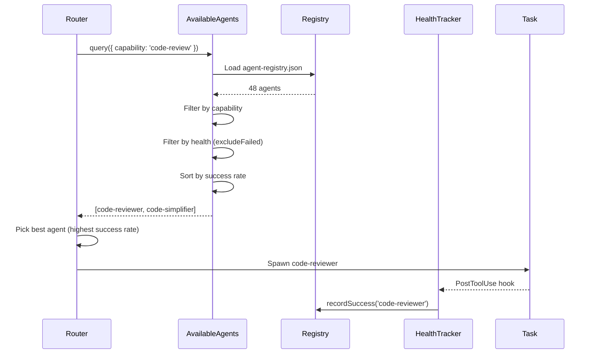
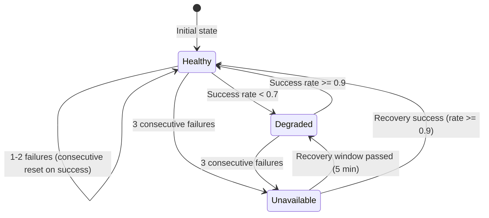

# Phase 3: Agent Capability Cards - Implementation Architecture

**Created**: 2026-01-31
**Author**: Architect Agent
**Status**: Implementation-Ready
**Predecessor**: Phase 2 (SkillCatalog Tool) - COMPLETED

---

## Executive Summary

Phase 3 introduces **Agent Capability Cards** - a structured way for the Router to discover agent capabilities, track agent health, and make intelligent routing decisions based on real-time availability and success rates.

**Key Deliverables**:

1. Agent Capability Card Schema (JSON Schema v7)
2. Agent Registry (auto-generated from agent definitions)
3. AvailableAgents Discovery Tool
4. Agent Health Tracker
5. Agent Health Hook (PostToolUse integration)
6. Router Integration (Gate 3 enhancement)

**Success Criteria**:

- 48 agent capability cards generated
- AvailableAgents() tool working with all filters
- Health tracking with failure isolation (3 consecutive failures)
- 35+ tests passing
- 0 regressions on Phase 1-2 tests

---

## 1. Agent Capability Card Schema

**File**: `.claude/schemas/agent-capability-card.schema.json`

This schema defines the structure for publishing agent capabilities, enabling dynamic discovery and health-aware routing.

```json
{
  "$schema": "http://json-schema.org/draft-07/schema#",
  "title": "Agent Capability Card",
  "description": "Schema for agent capability publication - enables dynamic discovery and health-aware routing",
  "type": "object",
  "required": ["id", "capabilities", "health"],
  "properties": {
    "id": {
      "type": "string",
      "description": "Agent ID (must match agent filename without .md extension)",
      "pattern": "^[a-z][a-z0-9-]*$",
      "examples": ["developer", "code-reviewer", "frontend-pro"]
    },
    "displayName": {
      "type": "string",
      "description": "Human-readable agent name",
      "examples": ["Developer Agent", "Code Reviewer", "Frontend Pro"]
    },
    "category": {
      "type": "string",
      "enum": ["core", "specialized", "domain", "orchestrator"],
      "description": "Agent category based on directory location"
    },
    "filePath": {
      "type": "string",
      "description": "Relative path to agent definition file",
      "pattern": "^\\.claude/agents/(core|specialized|domain|orchestrators)/[a-z0-9-]+\\.md$"
    },
    "capabilities": {
      "type": "array",
      "minItems": 1,
      "description": "List of capabilities this agent provides",
      "items": {
        "type": "object",
        "required": ["name", "domain", "description"],
        "properties": {
          "name": {
            "type": "string",
            "description": "Capability name (e.g., 'code-review', 'implementation', 'testing')",
            "pattern": "^[a-z][a-z0-9-]*$"
          },
          "domain": {
            "type": "string",
            "description": "Domain category for capability grouping",
            "enum": [
              "code",
              "testing",
              "security",
              "devops",
              "research",
              "documentation",
              "architecture",
              "database",
              "frontend",
              "backend",
              "mobile",
              "ai-ml",
              "blockchain",
              "orchestration",
              "planning"
            ]
          },
          "description": {
            "type": "string",
            "description": "What this capability does",
            "maxLength": 200
          },
          "triggerPhrases": {
            "type": "array",
            "items": { "type": "string" },
            "description": "Router keywords that trigger this capability",
            "examples": [["code review", "review PR", "analyze code"]]
          },
          "requiredTools": {
            "type": "array",
            "items": { "type": "string" },
            "description": "Tools needed for this capability",
            "examples": [["Read", "Write", "Edit", "Bash"]]
          },
          "skills": {
            "type": "array",
            "items": { "type": "string" },
            "description": "Skills used for this capability",
            "examples": [["tdd", "code-reviewer", "debugging"]]
          }
        }
      }
    },
    "constraints": {
      "type": "object",
      "description": "Resource and execution constraints",
      "properties": {
        "maxConcurrentTasks": {
          "type": "integer",
          "minimum": 1,
          "default": 5,
          "description": "Maximum simultaneous tasks this agent can handle"
        },
        "rateLimit": {
          "type": "string",
          "pattern": "^[0-9]+/(second|minute|hour)$",
          "description": "Rate limit for spawn requests (e.g., '10/minute')"
        },
        "maxTaskSize": {
          "type": "string",
          "pattern": "^[0-9]+(KB|MB)$",
          "description": "Maximum input size for tasks (e.g., '50KB')"
        },
        "preferredModel": {
          "type": "string",
          "enum": ["haiku", "sonnet", "opus"],
          "default": "sonnet",
          "description": "Preferred model for this agent"
        }
      }
    },
    "health": {
      "type": "object",
      "required": ["status"],
      "description": "Real-time health status for routing decisions",
      "properties": {
        "status": {
          "type": "string",
          "enum": ["healthy", "degraded", "unavailable"],
          "description": "Current health status"
        },
        "consecutiveFailures": {
          "type": "integer",
          "minimum": 0,
          "default": 0,
          "description": "Count of consecutive spawn/task failures"
        },
        "successCount": {
          "type": "integer",
          "minimum": 0,
          "default": 0,
          "description": "Total successful completions"
        },
        "failureCount": {
          "type": "integer",
          "minimum": 0,
          "default": 0,
          "description": "Total failures"
        },
        "successRate": {
          "type": "number",
          "minimum": 0,
          "maximum": 1,
          "default": 1.0,
          "description": "Success rate (successCount / total)"
        },
        "averageExecutionMs": {
          "type": "number",
          "minimum": 0,
          "description": "Average task execution time in milliseconds"
        },
        "lastUpdate": {
          "type": "string",
          "format": "date-time",
          "description": "Timestamp of last health update"
        },
        "isolatedAt": {
          "type": ["string", "null"],
          "format": "date-time",
          "description": "When agent was isolated (null if not isolated)"
        },
        "isolationReason": {
          "type": ["string", "null"],
          "description": "Why isolated (e.g., '3 consecutive failures: timeout')"
        },
        "lastSuccessAt": {
          "type": ["string", "null"],
          "format": "date-time",
          "description": "Timestamp of last successful completion"
        },
        "lastFailureAt": {
          "type": ["string", "null"],
          "format": "date-time",
          "description": "Timestamp of last failure"
        }
      }
    },
    "metadata": {
      "type": "object",
      "description": "Additional metadata for tracking and auditing",
      "properties": {
        "version": {
          "type": "string",
          "pattern": "^[0-9]+\\.[0-9]+\\.[0-9]+$",
          "description": "Agent definition version"
        },
        "createdAt": {
          "type": "string",
          "format": "date-time"
        },
        "updatedAt": {
          "type": "string",
          "format": "date-time"
        },
        "author": {
          "type": "string"
        },
        "references": {
          "type": "array",
          "items": { "type": "string" },
          "description": "Related documentation or ADRs"
        },
        "dependencies": {
          "type": "array",
          "items": { "type": "string" },
          "description": "Other agents this agent depends on"
        }
      }
    }
  }
}
```

### Schema Design Decisions

| Decision         | Choice                         | Rationale                                                |
| ---------------- | ------------------------------ | -------------------------------------------------------- |
| Required fields  | `id`, `capabilities`, `health` | Minimal required for routing; others can be inferred     |
| Domain enum      | 15 predefined domains          | Consistent categorization; extensible via schema update  |
| Health status    | 3 states                       | Simple state machine: healthy -> degraded -> unavailable |
| Success rate     | 0-1 float                      | Normalized for comparison across agents                  |
| Isolation fields | Nullable                       | Only populated when agent is isolated                    |

---

## 2. Agent Registry Structure

**File**: `.claude/context/agent-registry.json`

The registry is auto-generated from agent definitions and provides fast lookup for routing decisions.

```json
{
  "version": "1.0.0",
  "generatedAt": "2026-01-31T12:00:00.000Z",
  "metadata": {
    "totalAgents": 48,
    "healthyAgents": 48,
    "degradedAgents": 0,
    "unavailableAgents": 0,
    "lastHealthCheck": "2026-01-31T12:00:00.000Z",
    "lastFullScan": "2026-01-31T12:00:00.000Z"
  },
  "agents": {
    "developer": {
      "id": "developer",
      "displayName": "Developer Agent",
      "category": "core",
      "filePath": ".claude/agents/core/developer.md",
      "capabilities": [
        {
          "name": "implementation",
          "domain": "code",
          "description": "TDD-focused code implementation with Red-Green-Refactor",
          "triggerPhrases": ["implement", "code", "develop", "build", "create feature"],
          "requiredTools": ["Read", "Write", "Edit", "Bash", "Grep", "Glob"],
          "skills": ["tdd", "debugging", "git-expert"]
        },
        {
          "name": "bug-fix",
          "domain": "code",
          "description": "Fix bugs using systematic debugging and TDD",
          "triggerPhrases": ["fix bug", "debug", "resolve issue", "error"],
          "requiredTools": ["Read", "Write", "Edit", "Bash", "Grep"],
          "skills": ["debugging", "tdd"]
        }
      ],
      "constraints": {
        "maxConcurrentTasks": 5,
        "preferredModel": "sonnet"
      },
      "health": {
        "status": "healthy",
        "consecutiveFailures": 0,
        "successCount": 0,
        "failureCount": 0,
        "successRate": 1.0,
        "lastUpdate": "2026-01-31T12:00:00.000Z",
        "isolatedAt": null,
        "isolationReason": null
      },
      "metadata": {
        "version": "1.1.0",
        "createdAt": "2026-01-23T00:00:00.000Z",
        "updatedAt": "2026-01-31T12:00:00.000Z"
      }
    },
    "code-reviewer": {
      "id": "code-reviewer",
      "displayName": "Code Reviewer",
      "category": "specialized",
      "filePath": ".claude/agents/specialized/code-reviewer.md",
      "capabilities": [
        {
          "name": "code-review",
          "domain": "code",
          "description": "Read-only code analysis and review",
          "triggerPhrases": ["review code", "PR review", "code analysis", "audit code"],
          "requiredTools": ["Read", "Grep", "Glob"],
          "skills": ["code-reviewer", "code-analyzer"]
        }
      ],
      "constraints": {
        "maxConcurrentTasks": 10,
        "preferredModel": "sonnet"
      },
      "health": {
        "status": "healthy",
        "consecutiveFailures": 0,
        "successCount": 0,
        "failureCount": 0,
        "successRate": 1.0,
        "lastUpdate": "2026-01-31T12:00:00.000Z",
        "isolatedAt": null,
        "isolationReason": null
      },
      "metadata": {
        "version": "1.0.0"
      }
    }
  },
  "index": {
    "byCapability": {
      "implementation": [
        "developer",
        "java-pro",
        "python-pro",
        "typescript-pro",
        "nodejs-pro",
        "frontend-pro"
      ],
      "bug-fix": ["developer", "devops-troubleshooter"],
      "code-review": ["code-reviewer", "code-simplifier"],
      "testing": ["qa", "developer"],
      "security-review": ["security-architect"],
      "research": ["researcher", "scientific-research-expert"],
      "documentation": ["technical-writer"],
      "architecture": ["architect", "c4-context", "c4-container", "c4-component"],
      "orchestration": [
        "master-orchestrator",
        "swarm-coordinator",
        "evolution-orchestrator",
        "party-orchestrator"
      ]
    },
    "byDomain": {
      "code": [
        "developer",
        "code-reviewer",
        "code-simplifier",
        "java-pro",
        "python-pro",
        "typescript-pro"
      ],
      "testing": ["qa", "developer"],
      "security": ["security-architect"],
      "devops": ["devops", "devops-troubleshooter", "incident-responder"],
      "research": ["researcher", "scientific-research-expert"],
      "documentation": ["technical-writer"],
      "architecture": ["architect", "c4-context", "c4-container", "c4-component", "c4-code"],
      "database": ["database-architect", "data-engineer"],
      "frontend": ["frontend-pro", "nextjs-pro", "sveltekit-expert"],
      "backend": [
        "nodejs-pro",
        "java-pro",
        "python-pro",
        "fastapi-pro",
        "php-pro",
        "golang-pro",
        "rust-pro"
      ],
      "mobile": ["ios-pro", "android-pro", "expo-mobile-developer", "mobile-ux-reviewer"],
      "ai-ml": ["ai-ml-specialist"],
      "blockchain": ["web3-blockchain-expert"],
      "orchestration": [
        "master-orchestrator",
        "swarm-coordinator",
        "evolution-orchestrator",
        "party-orchestrator"
      ],
      "planning": ["planner", "pm"]
    },
    "byCategory": {
      "core": [
        "developer",
        "planner",
        "architect",
        "qa",
        "pm",
        "technical-writer",
        "context-compressor",
        "reflection-agent",
        "router"
      ],
      "specialized": [
        "code-reviewer",
        "code-simplifier",
        "security-architect",
        "devops",
        "devops-troubleshooter",
        "incident-responder",
        "researcher",
        "reverse-engineer",
        "conductor-validator",
        "database-architect",
        "c4-context",
        "c4-container",
        "c4-component",
        "c4-code"
      ],
      "domain": [
        "python-pro",
        "java-pro",
        "typescript-pro",
        "rust-pro",
        "golang-pro",
        "fastapi-pro",
        "nodejs-pro",
        "frontend-pro",
        "nextjs-pro",
        "sveltekit-expert",
        "php-pro",
        "ios-pro",
        "android-pro",
        "expo-mobile-developer",
        "tauri-desktop-developer",
        "graphql-pro",
        "data-engineer",
        "mobile-ux-reviewer",
        "scientific-research-expert",
        "ai-ml-specialist",
        "web3-blockchain-expert",
        "gamedev-pro"
      ],
      "orchestrator": [
        "master-orchestrator",
        "swarm-coordinator",
        "evolution-orchestrator",
        "party-orchestrator"
      ]
    }
  },
  "health": {
    "healthy": ["developer", "code-reviewer", "planner", "architect", "qa"],
    "degraded": [],
    "unavailable": []
  }
}
```

### Registry Design Decisions

| Decision        | Choice                                   | Rationale                                   |
| --------------- | ---------------------------------------- | ------------------------------------------- |
| Index structure | 3 indices (capability, domain, category) | O(1) lookup for common routing queries      |
| Health arrays   | Separate arrays by status                | Fast health-aware filtering                 |
| Agent embedding | Full capability card per agent           | Avoid N+1 lookups during routing            |
| File format     | JSON                                     | Native parsing, schema validation, readable |

---

## 3. Agent Capability Card Generator

**File**: `.claude/lib/tools/agent-registry-generator.cjs`

The generator scans all agent definitions and produces capability cards.

```javascript
/**
 * Agent Registry Generator
 *
 * Reads all agent definitions and generates capability cards.
 * Outputs: .claude/context/agent-registry.json
 *
 * Usage: npm run agents:registry
 *
 * @module agent-registry-generator
 * @see {@link file://.claude/schemas/agent-capability-card.schema.json} Schema
 */

'use strict';

const fs = require('fs');
const path = require('path');
const yaml = require('js-yaml');
const Ajv = require('ajv');
const addFormats = require('ajv-formats');

const { PROJECT_ROOT } = require('../utils/project-root.cjs');

/**
 * Domain mapping from skills/keywords to capability domains
 */
const DOMAIN_MAPPING = {
  // Code domains
  tdd: 'code',
  debugging: 'code',
  implementation: 'code',
  refactoring: 'code',
  'code-review': 'code',

  // Testing
  'qa-workflow': 'testing',
  testing: 'testing',
  test: 'testing',

  // Security
  'security-architect': 'security',
  owasp: 'security',
  'threat-modeling': 'security',

  // DevOps
  devops: 'devops',
  infrastructure: 'devops',
  'ci-cd': 'devops',
  deployment: 'devops',

  // Research
  research: 'research',
  'fact-finding': 'research',

  // Documentation
  documentation: 'documentation',
  'technical-writing': 'documentation',

  // Architecture
  architecture: 'architecture',
  'system-design': 'architecture',
  c4: 'architecture',

  // Database
  database: 'database',
  schema: 'database',
  sql: 'database',

  // Frontend
  react: 'frontend',
  vue: 'frontend',
  angular: 'frontend',
  frontend: 'frontend',
  nextjs: 'frontend',
  svelte: 'frontend',

  // Backend
  nodejs: 'backend',
  express: 'backend',
  fastapi: 'backend',
  django: 'backend',
  spring: 'backend',
  laravel: 'backend',

  // Mobile
  ios: 'mobile',
  android: 'mobile',
  'react-native': 'mobile',
  expo: 'mobile',
  mobile: 'mobile',

  // AI/ML
  ai: 'ai-ml',
  ml: 'ai-ml',
  'machine-learning': 'ai-ml',
  'deep-learning': 'ai-ml',

  // Blockchain
  web3: 'blockchain',
  blockchain: 'blockchain',
  defi: 'blockchain',
  'smart-contracts': 'blockchain',

  // Orchestration
  orchestration: 'orchestration',
  swarm: 'orchestration',
  'multi-agent': 'orchestration',

  // Planning
  planning: 'planning',
  roadmap: 'planning',
  'project-management': 'planning',
};

/**
 * Extract trigger phrases from agent description and name
 */
function extractTriggerPhrases(agentDef, agentId) {
  const phrases = [];

  // From agent name
  const namePhrases = agentId.split('-').filter(p => p.length > 2);
  phrases.push(...namePhrases);

  // From description
  if (agentDef.description) {
    // Extract key action words
    const actionWords =
      agentDef.description.match(
        /\b(implement|review|test|debug|design|analyze|fix|build|create|deploy|optimize|refactor)\w*/gi
      ) || [];
    phrases.push(...actionWords.map(w => w.toLowerCase()));
  }

  // From skills
  if (agentDef.skills && Array.isArray(agentDef.skills)) {
    phrases.push(...agentDef.skills.filter(s => s.length > 2));
  }

  // Dedupe and return
  return [...new Set(phrases)];
}

/**
 * Infer domain from agent definition
 */
function inferDomain(agentDef, agentId, category) {
  // Check skills first
  if (agentDef.skills && Array.isArray(agentDef.skills)) {
    for (const skill of agentDef.skills) {
      const domain = DOMAIN_MAPPING[skill.toLowerCase()];
      if (domain) return domain;
    }
  }

  // Check agent ID keywords
  for (const [keyword, domain] of Object.entries(DOMAIN_MAPPING)) {
    if (agentId.includes(keyword)) return domain;
  }

  // Fallback by category
  const categoryDomains = {
    core: 'code',
    specialized: 'code',
    domain: 'code',
    orchestrator: 'orchestration',
  };

  return categoryDomains[category] || 'code';
}

/**
 * Parse agent frontmatter from markdown file
 */
function parseAgentFrontmatter(content) {
  const frontmatterMatch = content.match(/^---\n([\s\S]*?)\n---/);
  if (!frontmatterMatch) return null;

  try {
    return yaml.load(frontmatterMatch[1]);
  } catch (error) {
    console.warn(`Failed to parse frontmatter: ${error.message}`);
    return null;
  }
}

/**
 * Generate capability card for a single agent
 */
function generateCapabilityCard(agentDef, agentId, category, filePath) {
  const domain = inferDomain(agentDef, agentId, category);
  const triggerPhrases = extractTriggerPhrases(agentDef, agentId);

  // Build capabilities from skills and description
  const capabilities = [];

  // Primary capability from agent role
  capabilities.push({
    name: agentId.replace(/-pro$/, '').replace(/-expert$/, ''),
    domain: domain,
    description: agentDef.description || `${agentId} capability`,
    triggerPhrases: triggerPhrases.slice(0, 10),
    requiredTools: agentDef.tools || ['Read', 'Write', 'Edit', 'Bash'],
    skills: agentDef.skills || [],
  });

  return {
    id: agentId,
    displayName:
      agentDef.name ||
      agentId
        .split('-')
        .map(w => w.charAt(0).toUpperCase() + w.slice(1))
        .join(' '),
    category: category,
    filePath: filePath.replace(PROJECT_ROOT, '.').replace(/\\/g, '/'),
    capabilities: capabilities,
    constraints: {
      maxConcurrentTasks: 5,
      preferredModel: agentDef.model || 'sonnet',
    },
    health: {
      status: 'healthy',
      consecutiveFailures: 0,
      successCount: 0,
      failureCount: 0,
      successRate: 1.0,
      lastUpdate: new Date().toISOString(),
      isolatedAt: null,
      isolationReason: null,
    },
    metadata: {
      version: agentDef.version || '1.0.0',
      createdAt: new Date().toISOString(),
      updatedAt: new Date().toISOString(),
    },
  };
}

/**
 * AgentRegistryGenerator class
 */
class AgentRegistryGenerator {
  constructor() {
    this.agents = new Map();
    this.registry = {
      version: '1.0.0',
      generatedAt: null,
      metadata: {},
      agents: {},
      index: {
        byCapability: {},
        byDomain: {},
        byCategory: {},
      },
      health: {
        healthy: [],
        degraded: [],
        unavailable: [],
      },
    };
  }

  /**
   * Scan all agent directories
   */
  async scanAgents(agentsDir) {
    const categories = ['core', 'specialized', 'domain', 'orchestrators'];
    const agents = new Map();

    for (const category of categories) {
      const categoryDir = path.join(agentsDir, category);

      if (!fs.existsSync(categoryDir)) continue;

      const files = fs.readdirSync(categoryDir).filter(f => f.endsWith('.md'));

      for (const file of files) {
        if (file === 'README.md') continue;

        const filePath = path.join(categoryDir, file);
        const content = fs.readFileSync(filePath, 'utf-8');
        const agentDef = parseAgentFrontmatter(content);

        if (!agentDef) {
          console.warn(`Skipping ${file}: no valid frontmatter`);
          continue;
        }

        const agentId = file.replace('.md', '');
        const normalizedCategory = category === 'orchestrators' ? 'orchestrator' : category;

        agents.set(agentId, {
          definition: agentDef,
          category: normalizedCategory,
          filePath: filePath,
        });
      }
    }

    return agents;
  }

  /**
   * Build indices for fast lookup
   */
  buildIndices(agentsMap) {
    for (const [agentId, card] of Object.entries(this.registry.agents)) {
      // Index by category
      if (!this.registry.index.byCategory[card.category]) {
        this.registry.index.byCategory[card.category] = [];
      }
      if (!this.registry.index.byCategory[card.category].includes(agentId)) {
        this.registry.index.byCategory[card.category].push(agentId);
      }

      // Index by capabilities
      for (const capability of card.capabilities) {
        if (!this.registry.index.byCapability[capability.name]) {
          this.registry.index.byCapability[capability.name] = [];
        }
        if (!this.registry.index.byCapability[capability.name].includes(agentId)) {
          this.registry.index.byCapability[capability.name].push(agentId);
        }

        // Index by domain
        if (!this.registry.index.byDomain[capability.domain]) {
          this.registry.index.byDomain[capability.domain] = [];
        }
        if (!this.registry.index.byDomain[capability.domain].includes(agentId)) {
          this.registry.index.byDomain[capability.domain].push(agentId);
        }
      }
    }
  }

  /**
   * Update health summary arrays
   */
  updateHealthSummary() {
    this.registry.health.healthy = [];
    this.registry.health.degraded = [];
    this.registry.health.unavailable = [];

    for (const [agentId, card] of Object.entries(this.registry.agents)) {
      switch (card.health.status) {
        case 'healthy':
          this.registry.health.healthy.push(agentId);
          break;
        case 'degraded':
          this.registry.health.degraded.push(agentId);
          break;
        case 'unavailable':
          this.registry.health.unavailable.push(agentId);
          break;
      }
    }
  }

  /**
   * Generate full registry
   */
  async generate(agentsDir) {
    const agents = await this.scanAgents(agentsDir);

    for (const [agentId, agentInfo] of agents) {
      const card = generateCapabilityCard(
        agentInfo.definition,
        agentId,
        agentInfo.category,
        agentInfo.filePath
      );
      this.registry.agents[agentId] = card;
    }

    this.buildIndices();
    this.updateHealthSummary();

    this.registry.generatedAt = new Date().toISOString();
    this.registry.metadata = {
      totalAgents: Object.keys(this.registry.agents).length,
      healthyAgents: this.registry.health.healthy.length,
      degradedAgents: this.registry.health.degraded.length,
      unavailableAgents: this.registry.health.unavailable.length,
      lastHealthCheck: new Date().toISOString(),
      lastFullScan: new Date().toISOString(),
    };

    return this.registry;
  }

  /**
   * Validate registry against schema
   */
  validate(registry) {
    const schemaPath = path.join(PROJECT_ROOT, '.claude/schemas/agent-capability-card.schema.json');

    if (!fs.existsSync(schemaPath)) {
      console.warn('Schema file not found, skipping validation');
      return { valid: true, errors: [] };
    }

    const schema = JSON.parse(fs.readFileSync(schemaPath, 'utf-8'));
    const ajv = new Ajv({ allErrors: true });
    addFormats(ajv);

    const validate = ajv.compile(schema);
    const errors = [];

    for (const [agentId, card] of Object.entries(registry.agents)) {
      if (!validate(card)) {
        errors.push({
          agentId,
          errors: validate.errors,
        });
      }
    }

    return {
      valid: errors.length === 0,
      errors,
    };
  }

  /**
   * Save registry to file
   */
  saveRegistry(registry, outputPath) {
    const dir = path.dirname(outputPath);
    if (!fs.existsSync(dir)) {
      fs.mkdirSync(dir, { recursive: true });
    }
    fs.writeFileSync(outputPath, JSON.stringify(registry, null, 2));
    console.log(`Registry saved to ${outputPath}`);
  }
}

/**
 * CLI entry point
 */
async function main() {
  const generator = new AgentRegistryGenerator();
  const agentsDir = path.join(PROJECT_ROOT, '.claude/agents');
  const outputPath = path.join(PROJECT_ROOT, '.claude/context/agent-registry.json');

  console.log('Scanning agents...');
  const registry = await generator.generate(agentsDir);

  console.log(`Found ${registry.metadata.totalAgents} agents`);

  const validation = generator.validate(registry);
  if (!validation.valid) {
    console.error('Validation errors:', JSON.stringify(validation.errors, null, 2));
    process.exit(1);
  }

  generator.saveRegistry(registry, outputPath);
  console.log('Registry generation complete');
}

// Run if called directly
if (require.main === module) {
  main().catch(console.error);
}

module.exports = {
  AgentRegistryGenerator,
  generateCapabilityCard,
  parseAgentFrontmatter,
  inferDomain,
  extractTriggerPhrases,
};
```

### Implementation Notes

| Component                      | Purpose                        | Lines      |
| ------------------------------ | ------------------------------ | ---------- |
| `DOMAIN_MAPPING`               | Map skills/keywords to domains | ~80 lines  |
| `extractTriggerPhrases()`      | Generate routing keywords      | ~20 lines  |
| `inferDomain()`                | Determine primary domain       | ~25 lines  |
| `parseAgentFrontmatter()`      | YAML frontmatter parsing       | ~15 lines  |
| `generateCapabilityCard()`     | Build capability card          | ~50 lines  |
| `AgentRegistryGenerator` class | Full registry generation       | ~150 lines |
| CLI entry                      | `npm run agents:registry`      | ~30 lines  |

**Total: ~400 lines**

---

## 4. AvailableAgents Discovery Tool

**File**: `.claude/lib/tools/available-agents.cjs`

Query interface for agents, similar to SkillCatalog for skills.

```javascript
/**
 * AvailableAgents Tool - Query available agents by capability, domain, or health
 *
 * Usage: AvailableAgents({ capability: 'code-review' })
 *
 * @module available-agents
 * @see {@link file://.claude/context/agent-registry.json} Data source
 */

'use strict';

const fs = require('fs');
const path = require('path');

const { PROJECT_ROOT } = require('../utils/project-root.cjs');

/**
 * AvailableAgentsQuery class
 */
class AvailableAgentsQuery {
  constructor(options = {}) {
    this.registryPath =
      options.registryPath || path.join(PROJECT_ROOT, '.claude/context/agent-registry.json');
    this.registry = null;
    this.cache = new Map();
    this.cacheTimeouts = new Map();
    this.CACHE_TTL = options.cacheTTL || 5 * 60 * 1000; // 5 minutes
    this.CACHE_MAX_SIZE = options.cacheMaxSize || 100;
  }

  /**
   * Load registry from file (lazy loading + caching)
   */
  getRegistry() {
    if (this.registry) return this.registry;

    try {
      const content = fs.readFileSync(this.registryPath, 'utf-8');
      this.registry = JSON.parse(content);
      return this.registry;
    } catch (error) {
      throw new Error(`Failed to load agent registry: ${error.message}`);
    }
  }

  /**
   * Main query function - find agents by criteria
   * @param {Object} options - Query options
   *   - capability: string (e.g., 'code-review')
   *   - domain: string (e.g., 'code')
   *   - category: string (e.g., 'core')
   *   - excludeFailed: boolean (default: true)
   *   - minSuccessRate: number (0-1, default: 0.7)
   *   - limit: number (default: 10, max: 50)
   * @returns {Object} Query result with matching agents
   */
  query(options = {}) {
    if (options === undefined || options === null) {
      options = {};
    }

    // Validate options
    const validationError = this.validateOptions(options);
    if (validationError) {
      return this.buildErrorResponse(validationError);
    }

    // Check cache
    const cacheKey = this.getCacheKey(options);
    const cached = this.getFromCache(cacheKey);
    if (cached) return cached;

    // Load registry
    let registry;
    try {
      registry = this.getRegistry();
    } catch (error) {
      return this.buildErrorResponse(error.message);
    }

    let agents = [];

    // Filter by capability
    if (options.capability) {
      const capAgentIds = registry.index.byCapability[options.capability] || [];
      agents = capAgentIds.map(id => registry.agents[id]).filter(Boolean);
    }
    // Filter by domain
    else if (options.domain) {
      const domainAgentIds = registry.index.byDomain[options.domain] || [];
      agents = domainAgentIds.map(id => registry.agents[id]).filter(Boolean);
    }
    // Filter by category
    else if (options.category) {
      const categoryAgentIds = registry.index.byCategory[options.category] || [];
      agents = categoryAgentIds.map(id => registry.agents[id]).filter(Boolean);
    }
    // Default: all agents
    else {
      agents = Object.values(registry.agents);
    }

    // Filter by health
    const excludeFailed = options.excludeFailed !== false; // default true
    if (excludeFailed) {
      agents = agents.filter(a => a.health.status !== 'unavailable');
    }

    // Filter by success rate
    const minRate = options.minSuccessRate ?? 0.7;
    agents = agents.filter(a => a.health.successRate >= minRate);

    // Sort by success rate (best first), then by execution time
    agents.sort((a, b) => {
      if (b.health.successRate !== a.health.successRate) {
        return b.health.successRate - a.health.successRate;
      }
      // Secondary: prefer faster agents
      const aTime = a.health.averageExecutionMs || Infinity;
      const bTime = b.health.averageExecutionMs || Infinity;
      return aTime - bTime;
    });

    // Apply limit
    const limit = Math.min(options.limit || 10, 50);
    agents = agents.slice(0, limit);

    // Build and cache response
    const response = {
      success: true,
      agents: agents,
      count: agents.length,
      query: options,
    };

    this.setCache(cacheKey, response);
    return response;
  }

  /**
   * Get single agent by ID
   */
  getAgent(agentId) {
    const registry = this.getRegistry();
    return registry.agents[agentId] || null;
  }

  /**
   * Check if agent is available for capability
   */
  isAvailable(agentId, capability) {
    const agent = this.getAgent(agentId);
    if (!agent) return false;
    if (agent.health.status === 'unavailable') return false;

    if (capability) {
      return agent.capabilities.some(c => c.name === capability);
    }

    return true;
  }

  /**
   * Get best agent for capability
   */
  getBestAgent(capability) {
    const result = this.query({
      capability,
      excludeFailed: true,
      minSuccessRate: 0.7,
      limit: 1,
    });

    return result.success && result.count > 0 ? result.agents[0] : null;
  }

  /**
   * Get available filters metadata
   */
  getAvailableFilters() {
    const registry = this.getRegistry();

    return {
      capabilities: Object.keys(registry.index.byCapability),
      domains: Object.keys(registry.index.byDomain),
      categories: Object.keys(registry.index.byCategory),
      totalAgents: registry.metadata.totalAgents,
      healthyAgents: registry.metadata.healthyAgents,
    };
  }

  /**
   * Validate query options
   */
  validateOptions(options) {
    if (typeof options !== 'object' || options === null) {
      return 'Options must be an object';
    }

    if (options.limit !== undefined) {
      if (!Number.isInteger(options.limit) || options.limit < 1 || options.limit > 50) {
        return 'limit must be an integer between 1 and 50';
      }
    }

    if (options.minSuccessRate !== undefined) {
      if (
        typeof options.minSuccessRate !== 'number' ||
        options.minSuccessRate < 0 ||
        options.minSuccessRate > 1
      ) {
        return 'minSuccessRate must be a number between 0 and 1';
      }
    }

    return null;
  }

  /**
   * Build error response
   */
  buildErrorResponse(error) {
    return {
      success: false,
      error: error,
      agents: [],
      count: 0,
    };
  }

  /**
   * Cache key generation
   */
  getCacheKey(options) {
    return JSON.stringify(options, Object.keys(options || {}).sort());
  }

  /**
   * Get from cache
   */
  getFromCache(key) {
    if (this.cache.has(key)) {
      const timeout = this.cacheTimeouts.get(key);
      if (timeout && Date.now() > timeout) {
        this.cache.delete(key);
        this.cacheTimeouts.delete(key);
        return null;
      }
      return this.cache.get(key);
    }
    return null;
  }

  /**
   * Store in cache
   */
  setCache(key, value) {
    if (this.cache.size >= this.CACHE_MAX_SIZE) {
      const firstKey = this.cache.keys().next().value;
      this.cache.delete(firstKey);
      this.cacheTimeouts.delete(firstKey);
    }

    this.cache.set(key, value);
    this.cacheTimeouts.set(key, Date.now() + this.CACHE_TTL);
  }

  /**
   * Clear cache
   */
  clearCache() {
    this.cache.clear();
    this.cacheTimeouts.clear();
    this.registry = null;
  }
}

// Singleton instance
const queryEngine = new AvailableAgentsQuery();

/**
 * Public API: AvailableAgents function
 */
function AvailableAgents(options) {
  return queryEngine.query(options);
}

module.exports = {
  AvailableAgents,
  AvailableAgentsQuery,
  getInstance: () => queryEngine,
};
```

### Query Examples

```javascript
// Example 1: Find agents for code review
AvailableAgents({ capability: 'code-review' });
// Returns: [code-reviewer, code-simplifier]

// Example 2: Find healthy frontend agents
AvailableAgents({ domain: 'frontend', excludeFailed: true });
// Returns: [frontend-pro, nextjs-pro, sveltekit-expert]

// Example 3: Find core agents with high success rate
AvailableAgents({ category: 'core', minSuccessRate: 0.9 });
// Returns: [developer, planner, architect, qa, ...]

// Example 4: Get best agent for security review
const best = AvailableAgents({ capability: 'security-review', limit: 1 });
// Returns: { agents: [security-architect], ... }

// Example 5: Get all orchestrators
AvailableAgents({ category: 'orchestrator' });
// Returns: [master-orchestrator, swarm-coordinator, evolution-orchestrator, party-orchestrator]
```

---

## 5. Agent Health Tracker

**File**: `.claude/lib/tools/agent-health-tracker.cjs`

Tracks agent spawn success/failure and manages health state transitions.

```javascript
/**
 * Agent Health Tracker
 *
 * Tracks agent spawn success/failure.
 * Isolates agents after 3 consecutive failures.
 * Periodically attempts recovery.
 *
 * @module agent-health-tracker
 */

'use strict';

const fs = require('fs');
const path = require('path');

const { PROJECT_ROOT } = require('../utils/project-root.cjs');
const { safeWriteJSON, safeReadJSON } = require('../utils/safe-json.cjs');

/**
 * Health state transitions:
 *
 * healthy --[1 failure]--> healthy (reset consecutive)
 * healthy --[success]--> healthy
 * healthy --[3 consecutive failures]--> unavailable (isolated)
 * healthy --[success rate < 0.7]--> degraded
 *
 * degraded --[success]--> healthy (if rate >= 0.9)
 * degraded --[3 consecutive failures]--> unavailable
 *
 * unavailable --[recovery window passed]--> degraded (retry)
 * unavailable --[recovery success]--> healthy
 */
const FAILURE_THRESHOLD = 3;
const DEGRADED_THRESHOLD = 0.7;
const RECOVERY_THRESHOLD = 0.9;
const RECOVERY_WINDOW_MS = 5 * 60 * 1000; // 5 minutes

class AgentHealthTracker {
  constructor(options = {}) {
    this.registryPath =
      options.registryPath || path.join(PROJECT_ROOT, '.claude/context/agent-registry.json');
    this.failureThreshold = options.failureThreshold || FAILURE_THRESHOLD;
    this.recoveryWindow = options.recoveryWindow || RECOVERY_WINDOW_MS;
  }

  /**
   * Load registry
   */
  loadRegistry() {
    return safeReadJSON(this.registryPath);
  }

  /**
   * Save registry
   */
  saveRegistry(registry) {
    safeWriteJSON(this.registryPath, registry);
  }

  /**
   * Record successful spawn/task completion
   */
  recordSuccess(agentId, executionMs = null) {
    const registry = this.loadRegistry();
    const agent = registry.agents[agentId];

    if (!agent) {
      console.warn(`Agent ${agentId} not found in registry`);
      return false;
    }

    // Update counters
    agent.health.successCount++;
    agent.health.consecutiveFailures = 0;
    agent.health.lastSuccessAt = new Date().toISOString();
    agent.health.lastUpdate = new Date().toISOString();

    // Update execution time
    if (executionMs !== null) {
      const total = agent.health.successCount + agent.health.failureCount;
      const currentAvg = agent.health.averageExecutionMs || 0;
      agent.health.averageExecutionMs = (currentAvg * (total - 1) + executionMs) / total;
    }

    // Update success rate
    this.updateSuccessRate(agent);

    // Check for recovery from degraded
    if (agent.health.status === 'degraded' && agent.health.successRate >= RECOVERY_THRESHOLD) {
      agent.health.status = 'healthy';
      agent.health.isolatedAt = null;
      agent.health.isolationReason = null;
    }

    // Update health arrays
    this.updateHealthArrays(registry);
    this.saveRegistry(registry);

    return true;
  }

  /**
   * Record spawn/task failure
   */
  recordFailure(agentId, reason = 'Unknown failure') {
    const registry = this.loadRegistry();
    const agent = registry.agents[agentId];

    if (!agent) {
      console.warn(`Agent ${agentId} not found in registry`);
      return false;
    }

    // Update counters
    agent.health.failureCount++;
    agent.health.consecutiveFailures++;
    agent.health.lastFailureAt = new Date().toISOString();
    agent.health.lastUpdate = new Date().toISOString();

    // Update success rate
    this.updateSuccessRate(agent);

    // Check for isolation (3 consecutive failures)
    if (agent.health.consecutiveFailures >= this.failureThreshold) {
      agent.health.status = 'unavailable';
      agent.health.isolatedAt = new Date().toISOString();
      agent.health.isolationReason = `${this.failureThreshold} consecutive failures: ${reason}`;
    }
    // Check for degradation (success rate < 0.7)
    else if (agent.health.successRate < DEGRADED_THRESHOLD) {
      agent.health.status = 'degraded';
    }

    // Update health arrays
    this.updateHealthArrays(registry);
    this.saveRegistry(registry);

    return true;
  }

  /**
   * Attempt recovery for isolated agents
   */
  attemptRecovery(agentId) {
    const registry = this.loadRegistry();
    const agent = registry.agents[agentId];

    if (!agent) return { success: false, reason: 'Agent not found' };
    if (agent.health.status !== 'unavailable') {
      return { success: false, reason: 'Agent not isolated' };
    }

    // Check recovery window
    const isolatedAt = new Date(agent.health.isolatedAt);
    const now = new Date();

    if (now - isolatedAt < this.recoveryWindow) {
      const remainingMs = this.recoveryWindow - (now - isolatedAt);
      return {
        success: false,
        reason: `Recovery cooldown active (${Math.ceil(remainingMs / 1000)}s remaining)`,
      };
    }

    // Reset for recovery attempt
    agent.health.consecutiveFailures = 0;
    agent.health.status = 'degraded';
    agent.health.lastUpdate = new Date().toISOString();

    // Keep isolation info for audit
    // agent.health.isolatedAt and isolationReason remain for history

    this.updateHealthArrays(registry);
    this.saveRegistry(registry);

    return { success: true, reason: 'Recovery attempted, status set to degraded' };
  }

  /**
   * Get health report for all agents
   */
  getHealthReport() {
    const registry = this.loadRegistry();

    return {
      summary: {
        totalAgents: registry.metadata.totalAgents,
        healthy: registry.health.healthy.length,
        degraded: registry.health.degraded.length,
        unavailable: registry.health.unavailable.length,
        lastCheck: new Date().toISOString(),
      },
      healthy: registry.health.healthy,
      degraded: registry.health.degraded.map(id => ({
        id,
        successRate: registry.agents[id]?.health.successRate,
        consecutiveFailures: registry.agents[id]?.health.consecutiveFailures,
      })),
      unavailable: registry.health.unavailable.map(id => ({
        id,
        isolatedAt: registry.agents[id]?.health.isolatedAt,
        reason: registry.agents[id]?.health.isolationReason,
      })),
    };
  }

  /**
   * Reset agent health to default
   */
  resetHealth(agentId) {
    const registry = this.loadRegistry();
    const agent = registry.agents[agentId];

    if (!agent) return false;

    agent.health = {
      status: 'healthy',
      consecutiveFailures: 0,
      successCount: 0,
      failureCount: 0,
      successRate: 1.0,
      averageExecutionMs: null,
      lastUpdate: new Date().toISOString(),
      isolatedAt: null,
      isolationReason: null,
      lastSuccessAt: null,
      lastFailureAt: null,
    };

    this.updateHealthArrays(registry);
    this.saveRegistry(registry);

    return true;
  }

  /**
   * Update success rate calculation
   */
  updateSuccessRate(agent) {
    const total = agent.health.successCount + agent.health.failureCount;
    if (total === 0) {
      agent.health.successRate = 1.0;
    } else {
      agent.health.successRate = agent.health.successCount / total;
    }
  }

  /**
   * Update health arrays in registry
   */
  updateHealthArrays(registry) {
    registry.health.healthy = [];
    registry.health.degraded = [];
    registry.health.unavailable = [];

    for (const [agentId, agent] of Object.entries(registry.agents)) {
      switch (agent.health.status) {
        case 'healthy':
          registry.health.healthy.push(agentId);
          break;
        case 'degraded':
          registry.health.degraded.push(agentId);
          break;
        case 'unavailable':
          registry.health.unavailable.push(agentId);
          break;
      }
    }

    // Update metadata
    registry.metadata.healthyAgents = registry.health.healthy.length;
    registry.metadata.degradedAgents = registry.health.degraded.length;
    registry.metadata.unavailableAgents = registry.health.unavailable.length;
    registry.metadata.lastHealthCheck = new Date().toISOString();
  }
}

// Singleton instance
let trackerInstance = null;

function getInstance(options = {}) {
  if (!trackerInstance) {
    trackerInstance = new AgentHealthTracker(options);
  }
  return trackerInstance;
}

module.exports = {
  AgentHealthTracker,
  getInstance,
  FAILURE_THRESHOLD,
  DEGRADED_THRESHOLD,
  RECOVERY_THRESHOLD,
  RECOVERY_WINDOW_MS,
};
```

### Health State Machine

```
                   ┌─────────────────────────────────────────────┐
                   │                                             │
                   ▼                                             │
              ┌─────────┐                                        │
     ┌───────▶│ HEALTHY │◀────────────────────────────────┐      │
     │        └────┬────┘                                 │      │
     │             │                                      │      │
     │     consecutive < 3                        success rate   │
     │     success rate >= 0.9                       >= 0.9      │
     │             │                                      │      │
     │             ▼                                      │      │
     │   ┌─────────────────┐                              │      │
     │   │   [1 failure]   │                              │      │
     │   │ consecutive = 1 │                              │      │
     │   └────────┬────────┘                              │      │
     │            │                                       │      │
     │   success rate < 0.7                               │      │
     │            │                                       │      │
     │            ▼                                       │      │
     │       ┌─────────┐                                  │      │
     └───────│DEGRADED │──────────────────────────────────┘      │
             └────┬────┘                                         │
                  │                                              │
         consecutive >= 3                                        │
                  │                                              │
                  ▼                                              │
          ┌─────────────┐        recovery window (5 min)         │
          │ UNAVAILABLE │────────────────────────────────────────┘
          │  (isolated) │
          └─────────────┘
```

---

## 6. Agent Health Hook

**File**: `.claude/hooks/routing/agent-health-hook.cjs`

Integrates health tracking with the Task tool lifecycle.

```javascript
/**
 * Agent Health Hook
 *
 * Tracks agent spawn success/failure after Task() calls.
 *
 * Hook type: PostToolUse (Task tool)
 *
 * @module agent-health-hook
 */

'use strict';

const path = require('path');
const { getInstance: getHealthTracker } = require('../../lib/tools/agent-health-tracker.cjs');
const { getInstance: getAgentQuery } = require('../../lib/tools/available-agents.cjs');

/**
 * Extract agent ID from spawn prompt
 */
function extractAgentId(prompt) {
  // Pattern 1: "You are DEVELOPER agent"
  const pattern1 = /You are (?:the )?([A-Z_-]+)(?: agent)?/i;
  const match1 = prompt.match(pattern1);
  if (match1) {
    return match1[1].toLowerCase().replace(/_/g, '-');
  }

  // Pattern 2: "Read: .claude/agents/core/developer.md"
  const pattern2 = /\.claude\/agents\/(?:core|specialized|domain|orchestrators)\/([a-z0-9-]+)\.md/i;
  const match2 = prompt.match(pattern2);
  if (match2) {
    return match2[1];
  }

  // Pattern 3: description field
  // This is fallback - description often contains agent name
  return null;
}

/**
 * Extract agent ID from Task tool input
 */
function extractAgentFromInput(toolInput) {
  // Check prompt
  if (toolInput.prompt) {
    const fromPrompt = extractAgentId(toolInput.prompt);
    if (fromPrompt) return fromPrompt;
  }

  // Check description
  if (toolInput.description) {
    const descLower = toolInput.description.toLowerCase();

    // Common patterns in description
    const agentPatterns = [
      /^(developer|planner|architect|qa|security-architect|devops|code-reviewer|frontend-pro|researcher)\b/,
      /(developer|planner|architect|qa|security|devops|reviewer|frontend)\s+(implementing|designing|reviewing|testing)/i,
    ];

    for (const pattern of agentPatterns) {
      const match = descLower.match(pattern);
      if (match) return match[1].toLowerCase().replace(/_/g, '-');
    }
  }

  return null;
}

/**
 * Hook configuration
 */
const hookConfig = {
  name: 'agent-health-hook',
  description: 'Track agent spawn success/failure for health-aware routing',
  triggers: ['Task'],
  phase: 'PostToolUse',
  mode: process.env.AGENT_HEALTH_HOOK || 'enabled',
};

/**
 * Main hook function
 */
async function agentHealthHook(context) {
  // Skip if disabled
  if (hookConfig.mode === 'off' || hookConfig.mode === 'disabled') {
    return { decision: 'allow' };
  }

  const { toolName, toolInput, toolResult } = context;

  // Only process Task tool
  if (toolName !== 'Task') {
    return { decision: 'allow' };
  }

  // Extract agent ID
  const agentId = extractAgentFromInput(toolInput);
  if (!agentId) {
    // Can't track if we don't know the agent
    return { decision: 'allow' };
  }

  const tracker = getHealthTracker();
  const startTime = context.startTime || Date.now();
  const executionMs = Date.now() - startTime;

  // Determine success/failure from result
  if (toolResult.error || toolResult.status === 'error') {
    tracker.recordFailure(agentId, toolResult.error?.message || 'Task spawn failed');
  } else {
    tracker.recordSuccess(agentId, executionMs);
  }

  return { decision: 'allow' };
}

/**
 * Pre-spawn health check (blocks unavailable agents)
 */
async function preSpawnHealthCheck(context) {
  const { toolInput } = context;

  const agentId = extractAgentFromInput(toolInput);
  if (!agentId) {
    return { decision: 'allow' };
  }

  const agentQuery = getAgentQuery();
  const agent = agentQuery.getAgent(agentId);

  if (!agent) {
    // Unknown agent - allow spawn (may be new agent)
    return { decision: 'allow' };
  }

  // Block unavailable agents
  if (agent.health.status === 'unavailable') {
    const tracker = getHealthTracker();
    const recovery = tracker.attemptRecovery(agentId);

    if (!recovery.success) {
      return {
        decision: 'block',
        message: `Agent ${agentId} is currently unavailable: ${agent.health.isolationReason}. ${recovery.reason}`,
        suggestion: `Try alternative agents: ${await suggestAlternatives(agentId)}`,
      };
    }
  }

  // Warn for degraded agents
  if (agent.health.status === 'degraded') {
    console.warn(
      `[agent-health] Agent ${agentId} is degraded (success rate: ${(agent.health.successRate * 100).toFixed(1)}%)`
    );
  }

  return { decision: 'allow' };
}

/**
 * Suggest alternative agents
 */
async function suggestAlternatives(agentId) {
  const agentQuery = getAgentQuery();
  const agent = agentQuery.getAgent(agentId);

  if (!agent || !agent.capabilities.length) {
    return 'No alternatives found';
  }

  // Find agents with similar capabilities
  const capability = agent.capabilities[0].name;
  const alternatives = agentQuery.query({
    capability,
    excludeFailed: true,
    limit: 3,
  });

  if (alternatives.count === 0) {
    return 'No healthy alternatives found';
  }

  return alternatives.agents
    .filter(a => a.id !== agentId)
    .map(a => a.id)
    .join(', ');
}

module.exports = {
  name: hookConfig.name,
  description: hookConfig.description,
  postToolUse: agentHealthHook,
  preToolUse: preSpawnHealthCheck,
  extractAgentId,
  extractAgentFromInput,
};
```

### Hook Registration

Add to `.claude/settings.json`:

```json
{
  "hooks": {
    "Task": [".claude/hooks/routing/agent-health-hook.cjs"]
  }
}
```

---

## 7. Router Integration

**File**: `.claude/agents/core/router.md` (UPDATED)

Add to Gate 3 (Tool Check):

````markdown
## Gate 3: Capability-Aware Agent Selection (Phase 3)

Before spawning an agent, check available capabilities:

### Step 1: Identify Required Capability

Analyze the request to determine needed capability:

- Code review -> `code-review` capability
- Bug fix -> `bug-fix` capability
- Architecture design -> `architecture` capability
- Security audit -> `security-review` capability

### Step 2: Query Available Agents

```javascript
const result = AvailableAgents({
  capability: 'code-review',
  excludeFailed: true,
  minSuccessRate: 0.7,
});

if (result.count === 0) {
  // Fallback: try by domain
  const fallback = AvailableAgents({
    domain: 'code',
    excludeFailed: true,
  });
}
```
````

### Step 3: Select Best Agent

Pick the agent with:

1. Highest success rate
2. Fastest average execution time
3. Capacity available (< maxConcurrentTasks)

### Step 4: Handle No Agents Available

If no agents are available for the capability:

1. **Check for recoverable agents**: Attempt recovery for isolated agents
2. **Suggest alternatives**: Query related capabilities
3. **Log as blocker**: Record in issues.md
4. **Return error with suggestions**: Provide actionable next steps

```javascript
// Example: No code-review agents available
{
  success: false,
  error: "No healthy agents available for code-review",
  suggestions: [
    "Try domain: 'code' for general code agents",
    "Retry in 5 minutes (recovery window for isolated agents)",
    "Spawn developer agent as fallback"
  ]
}
```

````

---

## 8. Files to Create/Modify

### New Files

| File | Lines | Purpose |
|------|-------|---------|
| `.claude/schemas/agent-capability-card.schema.json` | ~150 | JSON Schema for capability cards |
| `.claude/lib/tools/agent-registry-generator.cjs` | ~400 | Generate registry from agents |
| `.claude/lib/tools/available-agents.cjs` | ~300 | Query tool for agent discovery |
| `.claude/lib/tools/agent-health-tracker.cjs` | ~250 | Health tracking and isolation |
| `.claude/hooks/routing/agent-health-hook.cjs` | ~150 | Hook for Task tool lifecycle |
| `.claude/context/agent-registry.json` | ~2000 | Auto-generated registry |
| `tests/lib/tools/agent-registry-generator.test.cjs` | ~500 | Unit tests for generator |
| `tests/lib/tools/available-agents.test.cjs` | ~400 | Unit tests for query tool |
| `tests/lib/tools/agent-health-tracker.test.cjs` | ~350 | Unit tests for health tracker |
| `tests/hooks/agent-health-hook.test.cjs` | ~300 | Unit tests for hook |

### Modified Files

| File | Change |
|------|--------|
| `.claude/CLAUDE.md` | Add AvailableAgents to Section 1.4 Core Tools |
| `.claude/agents/core/router.md` | Add Gate 3 capability-aware selection |
| `package.json` | Add `agents:registry` script |
| `.claude/settings.json` | Register agent-health-hook |
| `.claude/context/memory/learnings.md` | Document Phase 3 completion |

---

## 9. Implementation Order

### Phase 3.1: Foundation (Day 1-2)

1. **Create schema** (`.claude/schemas/agent-capability-card.schema.json`)
   - Define all properties and constraints
   - Validate with JSON Schema draft-07
   - Test with sample capability cards

2. **Create generator** (`.claude/lib/tools/agent-registry-generator.cjs`)
   - Scan `.claude/agents/**/*.md`
   - Parse frontmatter with yaml
   - Build capability cards
   - Generate indices

### Phase 3.2: Query Tool (Day 3)

3. **Create AvailableAgents** (`.claude/lib/tools/available-agents.cjs`)
   - Load registry with caching
   - Filter by capability/domain/category
   - Filter by health status
   - Sort by success rate

### Phase 3.3: Health Tracking (Day 4-5)

4. **Create health tracker** (`.claude/lib/tools/agent-health-tracker.cjs`)
   - Record success/failure
   - State transitions
   - Isolation after 3 failures
   - Recovery mechanism

5. **Create health hook** (`.claude/hooks/routing/agent-health-hook.cjs`)
   - PostToolUse integration
   - Agent ID extraction
   - Pre-spawn health check

### Phase 3.4: Testing (Day 6-7)

6. **Create tests** (35+ tests total)
   - Generator tests (15 tests)
   - AvailableAgents tests (10 tests)
   - Health tracker tests (7 tests)
   - Hook tests (5 tests)

### Phase 3.5: Integration (Day 8)

7. **Update CLAUDE.md** (Section 1.4)
   - Add AvailableAgents to Core Tools table
   - Add to Standard Agent Toolset
   - Document usage

8. **Update router.md** (Gate 3)
   - Add capability-aware selection
   - Document query patterns
   - Add fallback handling

9. **Update memory** (learnings.md)
   - Document Phase 3 completion
   - Record patterns discovered

---

## 10. Success Criteria

### Functional Requirements

- [ ] Agent capability cards generated for all 48 agents
- [ ] Agent registry auto-generated from agent definitions
- [ ] AvailableAgents() tool working with all filters:
  - [ ] By capability
  - [ ] By domain
  - [ ] By category
  - [ ] Exclude unavailable
  - [ ] Minimum success rate
- [ ] Health tracking functional:
  - [ ] Success recording
  - [ ] Failure recording
  - [ ] Isolation after 3 consecutive failures
- [ ] Recovery mechanism works (5-min cooldown)
- [ ] Hook integrates with Task tool lifecycle

### Quality Requirements

- [ ] 35+ tests all passing
- [ ] 0 regressions (all Phase 1-2 tests still pass)
- [ ] Schema validation passing for all agents
- [ ] Query latency < 50ms (cached)
- [ ] Registry generation < 5s

### Integration Requirements

- [ ] Router uses AvailableAgents for capability discovery
- [ ] CLAUDE.md Section 1.4 updated
- [ ] router.md Gate 3 updated
- [ ] package.json script added
- [ ] settings.json hook registered

---

## Appendix A: npm Scripts

Add to `package.json`:

```json
{
  "scripts": {
    "agents:registry": "node .claude/lib/tools/agent-registry-generator.cjs",
    "agents:health": "node -e \"console.log(JSON.stringify(require('./.claude/lib/tools/agent-health-tracker.cjs').getInstance().getHealthReport(), null, 2))\"",
    "agents:query": "node -e \"console.log(JSON.stringify(require('./.claude/lib/tools/available-agents.cjs').AvailableAgents(JSON.parse(process.argv[1])), null, 2))\""
  }
}
````

---

## Appendix B: Mermaid Diagrams

### Agent Discovery Flow



### Health State Machine



---

## Document Control

- **Version**: 1.0.0
- **Created**: 2026-01-31
- **Author**: Architect Agent
- **Status**: Implementation-Ready
- **Predecessor**: Phase 2 (SkillCatalog) - COMPLETED
- **Next Review**: After Phase 3.1 completion

---

## Related Documents

- ADR-069: Tool Manifest and Pre-Spawn Validation Architecture
- ADR-070: SkillCatalog Tool Architecture
- `.claude/context/plans/agent-skills-integration-plan-20260130.md`
- `.claude/docs/SKILLCATALOG_USAGE.md`
- `.claude/lib/tools/skill-catalog.cjs` (Phase 2 reference implementation)
