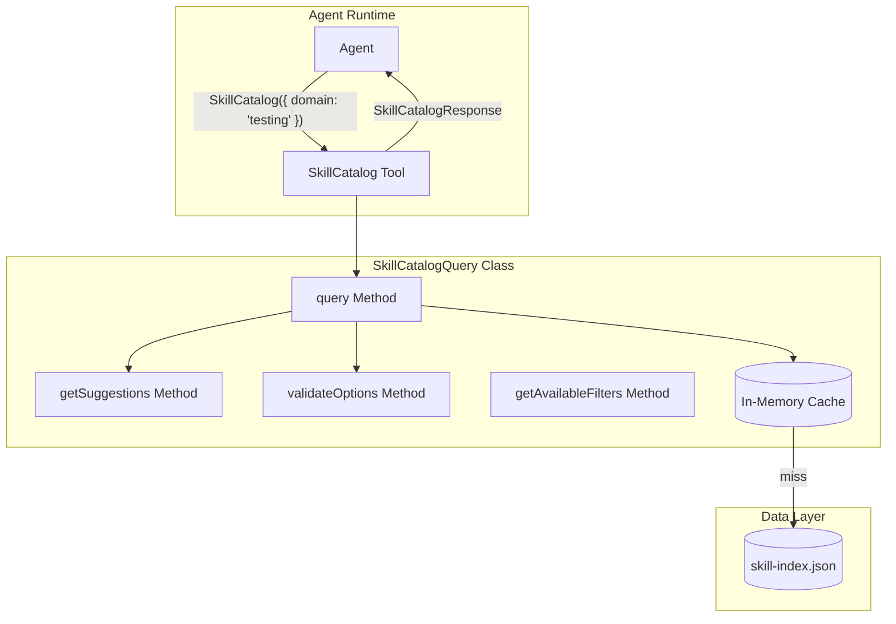
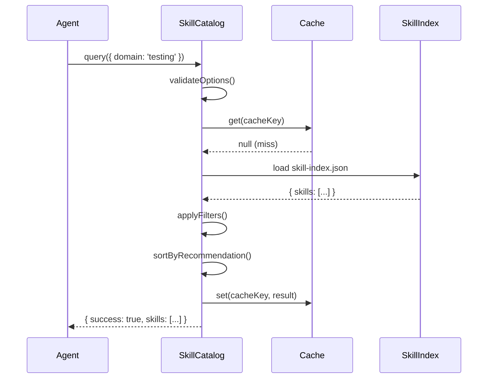
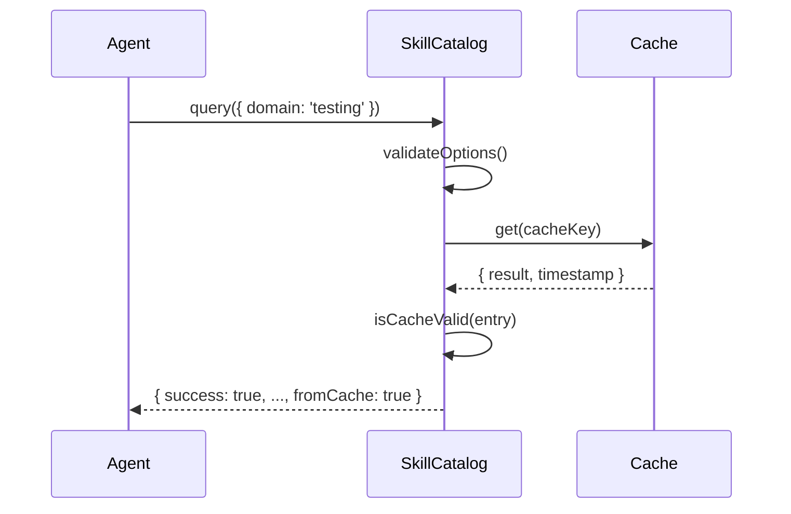
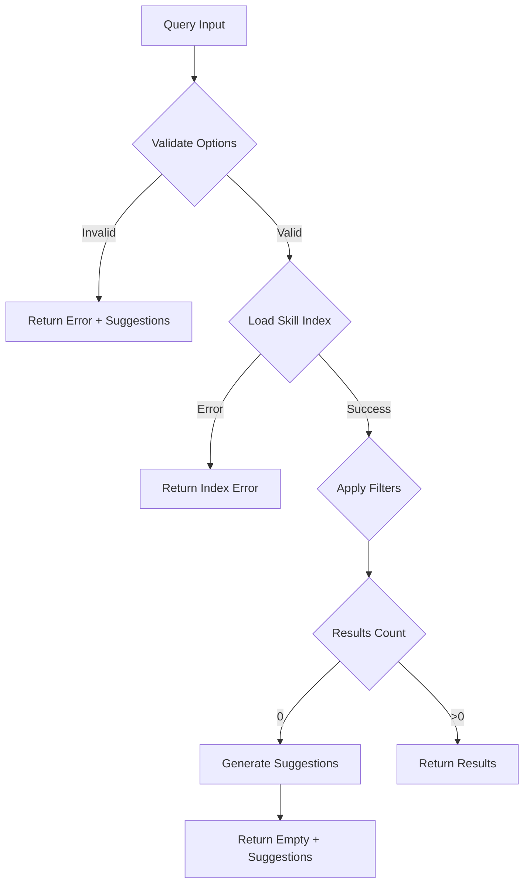

# SkillCatalog Tool Architecture

**Version**: 1.0.0
**Date**: 2026-01-30
**Author**: Architect Agent
**Status**: Implementation-Ready

---

## Table of Contents

1. [Overview](#1-overview)
2. [File Structure](#2-file-structure)
3. [Core Implementation: SkillCatalogQuery Class](#3-core-implementation-skillcatalogquery-class)
4. [API Specification](#4-api-specification)
5. [Data Flow](#5-data-flow)
6. [Error Handling Strategy](#6-error-handling-strategy)
7. [Performance Targets](#7-performance-targets)
8. [Integration with Phase 1](#8-integration-with-phase-1)
9. [Tests Required](#9-tests-required)
10. [Documentation Requirements](#10-documentation-requirements)
11. [Success Criteria](#11-success-criteria)
12. [Architecture Diagrams](#12-architecture-diagrams)

---

## 1. Overview

### 1.1 Purpose

The SkillCatalog tool provides agents with a programmatic interface to discover and query available skills based on domain, category, tags, and agent type. This complements the static AVAILABLE_SKILLS injection (Phase 1D) by enabling dynamic, contextual skill discovery at runtime.

### 1.2 Problem Statement

Currently, agents receive a pre-computed list of recommended skills at spawn time. However:

- Agents cannot discover skills outside their initial recommendations
- No filtering capability by domain, category, or tags
- No suggestions when queries return no results
- No caching for repeated queries

### 1.3 Solution

SkillCatalog provides:

- **Dynamic Querying**: Filter skills by domain, category, tags, agentType
- **Intelligent Suggestions**: Alternative queries when no matches found
- **In-Memory Caching**: Sub-100ms response times for repeated queries
- **Schema Validation**: Type-safe query and response formats

### 1.4 Design Principles

| Principle | Implementation |
|-----------|----------------|
| **Single Source of Truth** | Uses skill-index.json from Phase 1A |
| **Fail-Safe** | Returns empty results with suggestions, never throws |
| **Performance-First** | In-memory cache with <100ms target |
| **Type-Safe** | JSON Schema validation for queries and responses |
| **Agent-Friendly** | Clear error messages with actionable suggestions |

---

## 2. File Structure

### 2.1 New Files

```
.claude/lib/tools/
└── skill-catalog.cjs           # NEW - Core implementation (~400 lines)
    ├── SkillCatalogQuery class
    ├── Filter logic (domain, category, tags, agentType)
    ├── Error handling
    ├── Suggestions engine
    └── In-memory cache

tests/lib/tools/
└── skill-catalog.test.cjs      # NEW - Test suite (~600 lines)
    ├── Unit tests (40+)
    ├── Integration tests (10+)
    ├── Performance tests
    └── Schema validation tests

.claude/docs/
└── SKILLCATALOG_USAGE.md       # NEW - Agent guidance (~200 lines)
    ├── When to use SkillCatalog
    ├── Query examples
    ├── Best practices
    └── Common patterns

.claude/schemas/
├── skillcatalog-query.schema.json    # NEW - Query validation
└── skillcatalog-response.schema.json # NEW - Response validation
```

### 2.2 Modified Files

```
.claude/context/artifacts/skill-catalog.md   # UPDATE - Add SkillCatalog tool reference
.claude/CLAUDE.md                            # UPDATE - Add to Section 1.4 Tools Reference
```

### 2.3 Dependencies

```
.claude/context/artifacts/skill-index.json   # READ - Generated by Phase 1A
```

---

## 3. Core Implementation: SkillCatalogQuery Class

### 3.1 Class Overview

```javascript
/**
 * SkillCatalogQuery - Query interface for skill discovery
 *
 * Provides filtering, caching, and intelligent suggestions
 * for agent skill discovery.
 *
 * @example
 * const catalog = new SkillCatalogQuery();
 * const result = catalog.query({ domain: 'testing', limit: 5 });
 */
class SkillCatalogQuery {
  constructor(options = {}) {
    this.skillIndexPath = options.skillIndexPath ||
      '.claude/context/artifacts/skill-index.json';
    this.skillIndex = null;
    this.queryCache = new Map();
    this.cacheMaxSize = options.cacheMaxSize || 100;
    this.cacheTTL = options.cacheTTL || 300000; // 5 minutes
  }
}
```

### 3.2 Core Methods

#### 3.2.1 query() - Main Query Method

```javascript
/**
 * Query available skills by criteria
 *
 * @param {Object} options - Filter options
 * @param {string} [options.domain] - Filter by domain (e.g., 'testing', 'security')
 * @param {string} [options.category] - Filter by category (e.g., 'core-development')
 * @param {string} [options.agentType] - Filter by recommended agent (e.g., 'developer')
 * @param {string[]} [options.tags] - Filter by tags (AND logic)
 * @param {number} [options.limit=10] - Max results (1-50)
 * @param {boolean} [options.includeRecommended=true] - Sort recommended first
 * @returns {SkillCatalogResponse} Query results with metadata
 *
 * @example
 * const result = catalog.query({ domain: 'testing', limit: 5 });
 * // Returns: { success: true, skills: [...], count: 5, ... }
 */
query(options = {}) {
  // Implementation steps:
  // 1. Validate inputs via validateOptions()
  // 2. Build cache key from options
  // 3. Check cache (hit = return early)
  // 4. Load skill-index.json if not loaded
  // 5. Apply filters in order: domain -> category -> tags -> agentType
  // 6. Sort by recommendation priority
  // 7. Limit results
  // 8. Build response with metadata
  // 9. Cache and return
}
```

#### 3.2.2 getSuggestions() - Suggestion Engine

```javascript
/**
 * Get suggestions for no-match scenarios
 *
 * @param {Object} failedOptions - The query options that returned no results
 * @returns {Object} Suggestions with alternative queries
 *
 * @example
 * const suggestions = catalog.getSuggestions({ domain: 'invalid-domain' });
 * // Returns: {
 * //   message: "No skills found for domain: 'invalid-domain'",
 * //   alternatives: [
 * //     { domain: 'testing' },
 * //     { domain: 'security' },
 * //     { tags: ['quality'] }
 * //   ]
 * // }
 */
getSuggestions(failedOptions) {
  // Algorithm:
  // 1. Identify which filter(s) caused no matches
  // 2. For each failed filter, find closest valid values
  // 3. Broaden one filter at a time
  // 4. Return top 3 alternative queries
  // 5. Include helpful message explaining the failure
}
```

#### 3.2.3 validateOptions() - Input Validation

```javascript
/**
 * Validate query options against schema
 *
 * @param {Object} options - Query options to validate
 * @throws {Error} If options are invalid
 *
 * Validates:
 * - domain exists in skill-index (if provided)
 * - category exists in skill-index (if provided)
 * - limit is 1-50
 * - agentType is valid (developer, qa, researcher, architect, etc.)
 * - tags is an array of strings
 */
validateOptions(options) {
  // Implementation:
  // 1. Check limit bounds (1-50)
  // 2. Check agentType against VALID_AGENT_TYPES constant
  // 3. Check domain against loaded skill-index domains
  // 4. Check category against loaded skill-index categories
  // 5. Validate tags array format
  // 6. Throw descriptive error if validation fails
}
```

#### 3.2.4 getAvailableFilters() - Filter Discovery

```javascript
/**
 * List all available filter values
 *
 * @returns {Object} Metadata about available filters
 *
 * @example
 * const filters = catalog.getAvailableFilters();
 * // Returns: {
 * //   domains: ['testing', 'security', 'devops', ...],
 * //   categories: ['core-development', 'planning', ...],
 * //   agentTypes: ['developer', 'qa', 'architect', ...],
 * //   tags: ['async', 'performance', 'react', ...]
 * // }
 */
getAvailableFilters() {
  // Implementation:
  // 1. Ensure skill-index is loaded
  // 2. Extract unique domains from all skills
  // 3. Extract unique categories from all skills
  // 4. Return constant VALID_AGENT_TYPES
  // 5. Extract unique tags from all skills
  // 6. Cache result (filters don't change at runtime)
}
```

### 3.3 Private Methods

```javascript
/**
 * Load skill-index.json from disk
 * @private
 */
_loadSkillIndex() {
  // 1. Read file from skillIndexPath
  // 2. Parse JSON
  // 3. Validate structure
  // 4. Store in this.skillIndex
  // 5. Clear query cache (new data)
}

/**
 * Build cache key from query options
 * @private
 * @param {Object} options - Query options
 * @returns {string} Deterministic cache key
 */
_getCacheKey(options) {
  // JSON.stringify with sorted keys for determinism
  return JSON.stringify(options, Object.keys(options).sort());
}

/**
 * Check if cached result is still valid
 * @private
 * @param {Object} cacheEntry - Cached entry with timestamp
 * @returns {boolean} True if still valid
 */
_isCacheValid(cacheEntry) {
  return Date.now() - cacheEntry.timestamp < this.cacheTTL;
}

/**
 * Evict oldest cache entries if over limit
 * @private
 */
_evictOldestCache() {
  if (this.queryCache.size >= this.cacheMaxSize) {
    const oldestKey = this.queryCache.keys().next().value;
    this.queryCache.delete(oldestKey);
  }
}

/**
 * Apply domain filter to skills
 * @private
 * @param {Array} skills - Skills to filter
 * @param {string} domain - Domain to filter by
 * @returns {Array} Filtered skills
 */
_filterByDomain(skills, domain) {
  return skills.filter(s => s.domain === domain);
}

/**
 * Apply category filter to skills
 * @private
 * @param {Array} skills - Skills to filter
 * @param {string} category - Category to filter by
 * @returns {Array} Filtered skills
 */
_filterByCategory(skills, category) {
  return skills.filter(s => s.category === category);
}

/**
 * Apply tags filter to skills (AND logic)
 * @private
 * @param {Array} skills - Skills to filter
 * @param {string[]} tags - Tags to filter by
 * @returns {Array} Filtered skills (must have ALL tags)
 */
_filterByTags(skills, tags) {
  return skills.filter(s =>
    tags.every(tag => s.tags && s.tags.includes(tag))
  );
}

/**
 * Apply agentType filter to skills
 * @private
 * @param {Array} skills - Skills to filter
 * @param {string} agentType - Agent type to filter by
 * @returns {Array} Skills recommended for this agent type
 */
_filterByAgentType(skills, agentType) {
  return skills.filter(s =>
    s.recommendedFor && s.recommendedFor.includes(agentType)
  );
}

/**
 * Sort skills by recommendation priority
 * @private
 * @param {Array} skills - Skills to sort
 * @param {string} agentType - Agent type for prioritization
 * @returns {Array} Sorted skills (recommended first)
 */
_sortByRecommendation(skills, agentType) {
  return [...skills].sort((a, b) => {
    const aRec = a.recommendedFor?.includes(agentType) ? 1 : 0;
    const bRec = b.recommendedFor?.includes(agentType) ? 1 : 0;
    return bRec - aRec;
  });
}
```

### 3.4 Constants

```javascript
/**
 * Valid agent types for filtering
 */
const VALID_AGENT_TYPES = [
  'developer',
  'qa',
  'architect',
  'planner',
  'researcher',
  'technical-writer',
  'code-reviewer',
  'security-architect',
  'devops',
  'frontend-pro',
  'backend-pro',
  'python-pro',
  'typescript-pro',
  'nodejs-pro'
];

/**
 * Default query options
 */
const DEFAULT_OPTIONS = {
  limit: 10,
  includeRecommended: true
};

/**
 * Query validation limits
 */
const QUERY_LIMITS = {
  MIN_LIMIT: 1,
  MAX_LIMIT: 50
};
```

---

## 4. API Specification

### 4.1 TypeScript Type Definitions

```typescript
// Query interface
interface SkillCatalogQuery {
  domain?: string;        // Filter by domain
  category?: string;      // Filter by category
  agentType?: string;     // Filter by agent type
  tags?: string[];        // Filter by tags (AND logic)
  limit?: number;         // Max results (1-50, default: 10)
}

// Skill result interface
interface SkillCatalogResult {
  name: string;           // Skill name (e.g., 'tdd')
  domain: string;         // Skill domain (e.g., 'testing')
  category: string;       // Skill category (e.g., 'core-development')
  description: string;    // Brief description
  requiredTools: string[]; // Tools this skill needs
  tags: string[];         // Categorization tags
  recommended: boolean;   // Recommended for requesting agent?
  references: string[];   // Related skill references
}

// Response interface
interface SkillCatalogResponse {
  success: boolean;       // Query succeeded (even if 0 results)
  skills: SkillCatalogResult[];
  count: number;          // Number of results
  query: SkillCatalogQuery; // Echo of original query
  suggestions?: {         // Only if count === 0
    message: string;
    alternatives: SkillCatalogQuery[];
  };
  metadata?: {
    fromCache: boolean;   // Was result from cache?
    queryTimeMs: number;  // Query execution time
  };
}

// Error response interface
interface SkillCatalogError {
  success: false;
  error: string;          // Error message
  code: string;           // Error code (INVALID_DOMAIN, INVALID_LIMIT, etc.)
  suggestions?: {
    message: string;
    alternatives: SkillCatalogQuery[];
  };
}
```

### 4.2 Function Signature

```javascript
/**
 * Main entry point for skill catalog queries
 *
 * @param {SkillCatalogQuery} options - Query options
 * @returns {SkillCatalogResponse | SkillCatalogError}
 */
function SkillCatalog(options: SkillCatalogQuery): SkillCatalogResponse

// Usage example:
const response = SkillCatalog({ domain: 'testing', limit: 5 });

if (response.success) {
  console.log(`Found ${response.count} skills`);
  response.skills.forEach(skill => {
    console.log(`- ${skill.name}: ${skill.description}`);
  });
} else {
  console.error(response.error);
  if (response.suggestions) {
    console.log('Try:', response.suggestions.alternatives);
  }
}
```

### 4.3 JSON Schema Definitions

#### 4.3.1 Query Schema (skillcatalog-query.schema.json)

```json
{
  "$schema": "https://json-schema.org/draft-07/schema#",
  "$id": "https://claude-code.anthropic.com/schemas/skillcatalog-query",
  "title": "SkillCatalog Query",
  "description": "Schema for validating skill catalog query parameters",
  "type": "object",
  "properties": {
    "domain": {
      "type": "string",
      "description": "Filter by skill domain",
      "examples": ["testing", "security", "devops", "documentation"]
    },
    "category": {
      "type": "string",
      "description": "Filter by skill category",
      "examples": ["core-development", "planning-architecture", "creator-tools"]
    },
    "agentType": {
      "type": "string",
      "enum": [
        "developer", "qa", "architect", "planner", "researcher",
        "technical-writer", "code-reviewer", "security-architect",
        "devops", "frontend-pro", "backend-pro", "python-pro",
        "typescript-pro", "nodejs-pro"
      ],
      "description": "Filter by recommended agent type"
    },
    "tags": {
      "type": "array",
      "items": { "type": "string" },
      "description": "Filter by tags (AND logic - skill must have ALL tags)"
    },
    "limit": {
      "type": "integer",
      "minimum": 1,
      "maximum": 50,
      "default": 10,
      "description": "Maximum number of results to return"
    },
    "includeRecommended": {
      "type": "boolean",
      "default": true,
      "description": "Sort recommended skills first"
    }
  },
  "additionalProperties": false
}
```

#### 4.3.2 Response Schema (skillcatalog-response.schema.json)

```json
{
  "$schema": "https://json-schema.org/draft-07/schema#",
  "$id": "https://claude-code.anthropic.com/schemas/skillcatalog-response",
  "title": "SkillCatalog Response",
  "description": "Schema for validating skill catalog query responses",
  "type": "object",
  "required": ["success", "skills", "count", "query"],
  "properties": {
    "success": {
      "type": "boolean",
      "description": "Whether the query executed successfully"
    },
    "skills": {
      "type": "array",
      "items": {
        "type": "object",
        "required": ["name", "domain", "category", "description"],
        "properties": {
          "name": { "type": "string" },
          "domain": { "type": "string" },
          "category": { "type": "string" },
          "description": { "type": "string" },
          "requiredTools": {
            "type": "array",
            "items": { "type": "string" }
          },
          "tags": {
            "type": "array",
            "items": { "type": "string" }
          },
          "recommended": { "type": "boolean" },
          "references": {
            "type": "array",
            "items": { "type": "string" }
          }
        }
      }
    },
    "count": {
      "type": "integer",
      "minimum": 0
    },
    "query": {
      "$ref": "skillcatalog-query.schema.json"
    },
    "suggestions": {
      "type": "object",
      "properties": {
        "message": { "type": "string" },
        "alternatives": {
          "type": "array",
          "items": { "$ref": "skillcatalog-query.schema.json" }
        }
      }
    },
    "metadata": {
      "type": "object",
      "properties": {
        "fromCache": { "type": "boolean" },
        "queryTimeMs": { "type": "number" }
      }
    },
    "error": { "type": "string" },
    "code": { "type": "string" }
  },
  "additionalProperties": false
}
```

---

## 5. Data Flow

### 5.1 Query Execution Flow

```
Agent calls SkillCatalog({ domain: 'testing' })
  |
  v
+------------------------------------------+
| 1. VALIDATE                              |
|    - validateOptions() checks inputs      |
|    - Throw SkillCatalogError if invalid  |
+------------------------------------------+
  |
  v
+------------------------------------------+
| 2. CHECK CACHE                           |
|    - Build cache key from options        |
|    - Check queryCache Map                |
|    - If hit AND valid TTL: return cached |
+------------------------------------------+
  |
  v (cache miss)
+------------------------------------------+
| 3. LOAD SKILL INDEX                      |
|    - Read skill-index.json (once)        |
|    - Store in this.skillIndex            |
|    - Parse and validate structure        |
+------------------------------------------+
  |
  v
+------------------------------------------+
| 4. APPLY FILTERS (in order)              |
|    a. _filterByDomain(skills, domain)    |
|    b. _filterByCategory(skills, category)|
|    c. _filterByTags(skills, tags)        |
|    d. _filterByAgentType(skills, agent)  |
+------------------------------------------+
  |
  v
+------------------------------------------+
| 5. SORT                                  |
|    - _sortByRecommendation(skills, agent)|
|    - Recommended skills first            |
+------------------------------------------+
  |
  v
+------------------------------------------+
| 6. LIMIT                                 |
|    - Take first N results                |
|    - Respect options.limit (default: 10) |
+------------------------------------------+
  |
  v
+------------------------------------------+
| 7. BUILD RESPONSE                        |
|    - Create SkillCatalogResponse         |
|    - Add metadata (queryTimeMs, fromCache)|
|    - If count === 0: add suggestions     |
+------------------------------------------+
  |
  v
+------------------------------------------+
| 8. CACHE RESULT                          |
|    - Store in queryCache                 |
|    - Evict oldest if over cacheMaxSize   |
+------------------------------------------+
  |
  v
Return SkillCatalogResponse to agent
```

### 5.2 Suggestion Generation Flow

```
Query returns 0 results
  |
  v
+------------------------------------------+
| 1. ANALYZE FAILED FILTERS                |
|    - Which filter(s) caused 0 matches?   |
|    - domain? category? tags? agentType?  |
+------------------------------------------+
  |
  v
+------------------------------------------+
| 2. FIND SIMILAR VALUES                   |
|    - Levenshtein distance for typos      |
|    - Partial matching for prefixes       |
|    - Related domains/categories          |
+------------------------------------------+
  |
  v
+------------------------------------------+
| 3. BROADEN FILTERS                       |
|    - Try removing one filter at a time   |
|    - Find combinations that return > 0   |
+------------------------------------------+
  |
  v
+------------------------------------------+
| 4. RANK ALTERNATIVES                     |
|    - Most similar first                  |
|    - Most results second                 |
|    - Limit to 3 suggestions              |
+------------------------------------------+
  |
  v
Return suggestions object
```

### 5.3 Cache Architecture

```
+--------------------------------------------------+
|                   SkillCatalogQuery              |
+--------------------------------------------------+
|                                                  |
|  queryCache: Map<string, CacheEntry>             |
|  +-----------+---------------------------------+ |
|  | Key       | Value                           | |
|  +-----------+---------------------------------+ |
|  | hash(q1)  | { response, timestamp }         | |
|  | hash(q2)  | { response, timestamp }         | |
|  | hash(q3)  | { response, timestamp }         | |
|  | ...       | ...                             | |
|  +-----------+---------------------------------+ |
|                                                  |
|  skillIndex: Object (loaded once from JSON)      |
|  +---------------------------------------------+ |
|  | { skills: [...], domains: [...], ... }     | |
|  +---------------------------------------------+ |
|                                                  |
|  Eviction: LRU (oldest first when size > 100)   |
|  TTL: 5 minutes (300,000 ms)                     |
|                                                  |
+--------------------------------------------------+
```

---

## 6. Error Handling Strategy

### 6.1 Error Types

| Error Code | Scenario | Response |
|------------|----------|----------|
| `INVALID_DOMAIN` | Domain not in skill-index | Error + similar domains |
| `INVALID_CATEGORY` | Category not in skill-index | Error + valid categories |
| `INVALID_LIMIT` | Limit < 1 or > 50 | Error + valid range |
| `INVALID_AGENT_TYPE` | AgentType not in VALID_AGENT_TYPES | Error + valid types |
| `INVALID_TAGS` | Tags not an array | Error + expected format |
| `SKILL_INDEX_ERROR` | Failed to load skill-index.json | Error + recovery steps |

### 6.2 Error Response Examples

**Scenario 1: No skills match**

```javascript
{
  success: true,  // Query executed, just 0 results
  skills: [],
  count: 0,
  query: { domain: 'nonexistent' },
  suggestions: {
    message: "No skills found for domain: 'nonexistent'",
    alternatives: [
      { domain: 'testing' },    // Similar domain
      { domain: 'security' },   // Related domain
      { category: 'core-development' }  // Broader filter
    ]
  }
}
```

**Scenario 2: Invalid query parameter**

```javascript
{
  success: false,
  error: "Invalid option: limit must be between 1 and 50 (got 100)",
  code: "INVALID_LIMIT",
  suggestions: {
    message: "Adjust your query parameters",
    alternatives: [
      { limit: 50 }  // Maximum allowed
    ]
  }
}
```

**Scenario 3: Skill index unavailable**

```javascript
{
  success: false,
  error: "Failed to load skill-index.json: File not found",
  code: "SKILL_INDEX_ERROR",
  suggestions: {
    message: "Regenerate skill index by running: npm run skills:index",
    alternatives: []
  }
}
```

### 6.3 Error Recovery

```javascript
// Agent usage pattern with error handling
const response = SkillCatalog({ domain: 'testing', limit: 5 });

if (!response.success) {
  console.error(`[SkillCatalog] Error: ${response.error}`);

  // Try alternative query if suggested
  if (response.suggestions?.alternatives?.length > 0) {
    const altResponse = SkillCatalog(response.suggestions.alternatives[0]);
    if (altResponse.success) {
      return altResponse;
    }
  }

  // Fall back to getting all skills with limit
  return SkillCatalog({ limit: 10 });
}

// Use response.skills
const skill = response.skills[0];
Skill({ skill: skill.name });
```

---

## 7. Performance Targets

### 7.1 Target Metrics

| Operation | Target | Method |
|-----------|--------|--------|
| First query | <500ms | Load skill-index.json once |
| Subsequent queries | <50ms | In-memory cache |
| Cache lookup | <1ms | Map.get() |
| Max query time | <100ms | Timeout/abort if exceeded |
| Cache size | <10MB | JSON in memory (100 entries) |
| Cache TTL | 5 minutes | Stale data acceptable |

### 7.2 Optimization Strategies

```javascript
// 1. Lazy loading - don't load index until first query
class SkillCatalogQuery {
  constructor() {
    this.skillIndex = null; // Loaded on first query
  }

  _ensureIndexLoaded() {
    if (!this.skillIndex) {
      this.skillIndex = JSON.parse(
        fs.readFileSync(this.skillIndexPath, 'utf-8')
      );
    }
  }
}

// 2. Deterministic cache keys
_getCacheKey(options) {
  // Sort keys for consistent hashing
  return JSON.stringify(options, Object.keys(options).sort());
}

// 3. LRU eviction
_evictOldestCache() {
  if (this.queryCache.size >= this.cacheMaxSize) {
    // Map maintains insertion order - delete first key
    const oldestKey = this.queryCache.keys().next().value;
    this.queryCache.delete(oldestKey);
  }
}

// 4. TTL-based invalidation
_isCacheValid(entry) {
  return Date.now() - entry.timestamp < this.cacheTTL;
}

// 5. Query timeout
async queryWithTimeout(options, timeoutMs = 100) {
  const controller = new AbortController();
  const timeout = setTimeout(() => controller.abort(), timeoutMs);

  try {
    return await this.query(options);
  } finally {
    clearTimeout(timeout);
  }
}
```

### 7.3 Cache Invalidation

```javascript
// Cache is automatically invalidated when:
// 1. skillIndex is reloaded (new data)
// 2. TTL expires (5 minutes)
// 3. Cache size exceeds limit (LRU eviction)

// Manual invalidation (called by skill-index regeneration hook)
clearCache() {
  this.queryCache.clear();
  this.skillIndex = null;
}
```

---

## 8. Integration with Phase 1

### 8.1 Relationship to Phase 1 Components

```
+------------------------------------------------------------------+
|                        PHASE 1 (Foundation)                       |
+------------------------------------------------------------------+
|                                                                  |
|  Phase 1A: tool-manifest.json                                    |
|  +---------------------------------------------------------+    |
|  | Source of truth for tools                               |    |
|  | NOT used by SkillCatalog (tools =/= skills)            |    |
|  +---------------------------------------------------------+    |
|                                                                  |
|  Phase 1A: skill-index.json  <----+                             |
|  +---------------------------------------------------------+    |
|  | Source of truth for skills                              |    |
|  | USED BY SkillCatalog as primary data source            |    |
|  +---------------------------------------------------------+    |
|                                  |                               |
|  Phase 1B: pre-spawn-validator   |   Phase 1D: prompt-assembler |
|  +-----------------------+       |   +-----------------------+  |
|  | Validates spawn       |       |   | Injects AVAILABLE_   |  |
|  | requests              |       |   | SKILLS into prompt   |  |
|  +-----------------------+       |   +-----------------------+  |
|                                  |                |              |
+------------------------------------------------------------------+
                                   |                |
                                   v                v
+------------------------------------------------------------------+
|                       SKILLCATALOG (Phase 2)                      |
+------------------------------------------------------------------+
|                                                                  |
|  SkillCatalogQuery                                               |
|  +-------------------------------------------------------------+ |
|  | - Reads skill-index.json (Phase 1A output)                  | |
|  | - Provides runtime query interface                          | |
|  | - Complements AVAILABLE_SKILLS (Phase 1D)                   | |
|  | - Does NOT replace pre-spawn validation (Phase 1B)          | |
|  +-------------------------------------------------------------+ |
|                                                                  |
+------------------------------------------------------------------+
```

### 8.2 Complementary Behavior

**Phase 1D injects at spawn time:**

```javascript
// In spawn prompt (from prompt-assembler):
AVAILABLE_SKILLS:
- tdd (recommended for developer)
- debugging (recommended for developer)
- code-quality-expert (recommended for developer)
```

**SkillCatalog enables runtime discovery:**

```javascript
// Agent can dynamically discover more skills:
const result = SkillCatalog({ domain: 'architecture' });
// Returns: [architecture-review, c4-context, c4-container, ...]

// Agent picks best one and invokes:
Skill({ skill: result.skills[0].name });
```

### 8.3 Example Agent Flow

```
Agent spawns
  |
  v
+------------------------------------------+
| 1. Receives AVAILABLE_SKILLS (Phase 1D)  |
|    - tdd, debugging, code-quality-expert |
+------------------------------------------+
  |
  v
+------------------------------------------+
| 2. Agent reads suggestions               |
|    - Are these skills right for task?    |
+------------------------------------------+
  |
  v (need different skills)
+------------------------------------------+
| 3. Query SkillCatalog                    |
|    SkillCatalog({ domain: 'architecture'})|
+------------------------------------------+
  |
  v
+------------------------------------------+
| 4. Gets results                          |
|    - architecture-review                 |
|    - c4-context                          |
|    - c4-container                        |
+------------------------------------------+
  |
  v
+------------------------------------------+
| 5. Picks best and invokes                |
|    Skill({ skill: 'architecture-review'})|
+------------------------------------------+
```

---

## 9. Tests Required

### 9.1 Unit Tests (40+ required)

**Filter Tests (20 tests)**

| Test | Description |
|------|-------------|
| Filter by single domain | Returns only skills in domain |
| Filter by multiple domains | Returns union of domains |
| Filter by invalid domain | Returns error with suggestions |
| Filter by empty domain | Ignores filter, returns all |
| Filter by single category | Returns only skills in category |
| Filter by invalid category | Returns error with suggestions |
| Filter by single tag | Returns skills with tag |
| Filter by multiple tags (AND) | Returns skills with ALL tags |
| Filter by invalid tag | Returns empty with suggestions |
| Filter by agentType | Returns recommended skills |
| Filter by invalid agentType | Returns error |
| Combine domain + category | Returns intersection |
| Combine domain + tags | Returns intersection |
| Combine all filters | Returns intersection of all |
| Filter returns empty | Success=true, count=0, suggestions |
| Filter with includeRecommended=false | No sorting |
| Filter respects limit | Returns max N results |
| Limit = 1 | Returns exactly 1 |
| Limit = 50 | Returns up to 50 |
| Limit > 50 | Returns error |

**Cache Tests (8 tests)**

| Test | Description |
|------|-------------|
| First query loads index | skillIndex not null after query |
| Same query hits cache | Second call returns fromCache=true |
| Different query misses cache | New query executes fully |
| Cache expires after TTL | Old entries return fromCache=false |
| Cache eviction at max size | Oldest entry removed |
| Cache key is deterministic | Same options = same key |
| clearCache() works | All cache cleared |
| Cache survives invalid queries | Errors don't corrupt cache |

**Suggestions Tests (8 tests)**

| Test | Description |
|------|-------------|
| Suggests similar domains | Typo 'tesing' -> 'testing' |
| Suggests similar categories | Typo detection |
| Suggests broader filters | domain+category -> domain only |
| Returns max 3 alternatives | No more than 3 |
| Alternatives are valid queries | Can be passed back to query() |
| Message explains failure | Human-readable error |
| No suggestions for valid empty | Valid query, just no matches |
| Suggestions for unknown agentType | Lists valid types |

**Validation Tests (4 tests)**

| Test | Description |
|------|-------------|
| Validates limit bounds | Rejects <1 and >50 |
| Validates agentType enum | Rejects invalid types |
| Validates tags array | Rejects non-array |
| Validates options type | Rejects non-object |

### 9.2 Integration Tests (10+ required)

| Test | Description |
|------|-------------|
| Load real skill-index.json | Works with actual data |
| Query returns real skills | Results match skill-catalog.md |
| Agent workflow simulation | spawn -> query -> invoke |
| Skill index regeneration | Cache cleared after regen |
| Performance < 100ms | Measured query time |
| Performance with cache < 10ms | Cached query time |
| Large result set (limit=50) | Handles max results |
| Concurrent queries | Thread safety |
| Missing skill-index.json | Graceful error |
| Corrupt skill-index.json | Graceful error |

### 9.3 Schema Validation Tests (5+ required)

| Test | Description |
|------|-------------|
| Query schema validates | Valid queries pass |
| Query schema rejects invalid | Invalid queries fail |
| Response schema validates | Valid responses pass |
| Response schema rejects invalid | Invalid responses fail |
| Suggestions schema validates | Suggestion format correct |

### 9.4 Test File Structure

```javascript
// tests/lib/tools/skill-catalog.test.cjs

const { describe, it, beforeEach, afterEach } = require('node:test');
const assert = require('node:assert');
const { SkillCatalogQuery } = require('../../../.claude/lib/tools/skill-catalog.cjs');

describe('SkillCatalogQuery', () => {
  let catalog;

  beforeEach(() => {
    catalog = new SkillCatalogQuery({
      skillIndexPath: './fixtures/skill-index.json'
    });
  });

  describe('query()', () => {
    describe('filter by domain', () => {
      it('returns only skills in specified domain', async () => {
        const result = catalog.query({ domain: 'testing' });
        assert.strictEqual(result.success, true);
        result.skills.forEach(skill => {
          assert.strictEqual(skill.domain, 'testing');
        });
      });

      // ... more tests
    });
  });

  describe('getSuggestions()', () => {
    it('suggests similar domains for typos', () => {
      const suggestions = catalog.getSuggestions({ domain: 'tesing' });
      assert.ok(suggestions.alternatives.some(a => a.domain === 'testing'));
    });

    // ... more tests
  });

  describe('caching', () => {
    it('hits cache on repeated query', () => {
      const result1 = catalog.query({ domain: 'testing' });
      const result2 = catalog.query({ domain: 'testing' });

      assert.strictEqual(result2.metadata.fromCache, true);
    });

    // ... more tests
  });
});
```

---

## 10. Documentation Requirements

### 10.1 Agent Documentation (SKILLCATALOG_USAGE.md)

**Structure:**

```markdown
# SkillCatalog Usage Guide

## When to Use SkillCatalog

- When pre-injected AVAILABLE_SKILLS don't match your task
- When you need skills from a specific domain
- When you want to discover all skills with certain tags
- When you're unsure which skills are available

## When NOT to Use

- If AVAILABLE_SKILLS already contains what you need
- For tool discovery (use tool-manifest.json instead)
- During spawn (use pre-spawn skill injection)

## Query Examples

### Example 1: Find testing skills
```javascript
const result = SkillCatalog({ domain: 'testing' });
```

### Example 2: Find skills for security review
```javascript
const result = SkillCatalog({
  domain: 'security',
  agentType: 'security-architect'
});
```

### Example 3: Find async-related skills
```javascript
const result = SkillCatalog({ tags: ['async', 'performance'] });
```

### Example 4: Get architecture skills (limited)
```javascript
const result = SkillCatalog({
  category: 'planning-architecture',
  limit: 3
});
```

## Best Practices

1. **Start with AVAILABLE_SKILLS** - Only query if needed
2. **Use specific filters** - Domain + category better than just limit
3. **Handle suggestions** - If no results, try alternatives
4. **Cache awareness** - Repeated queries are fast

## Common Patterns

### Pattern: Fallback Discovery
```javascript
// Try specific first, then broaden
let result = SkillCatalog({ domain: 'testing', tags: ['async'] });
if (result.count === 0) {
  result = SkillCatalog({ domain: 'testing' });
}
```

### Pattern: Agent-Type Filtering
```javascript
// Get skills recommended for my type
const result = SkillCatalog({ agentType: 'developer' });
```
```

### 10.2 Developer Documentation (in skill-catalog.cjs)

```javascript
/**
 * SkillCatalog - Skill Discovery Tool
 *
 * @module skill-catalog
 * @description Provides programmatic skill discovery for agents.
 * Complements Phase 1D AVAILABLE_SKILLS injection with runtime queries.
 *
 * @example
 * const { SkillCatalogQuery, SkillCatalog } = require('./skill-catalog.cjs');
 *
 * // Class-based usage
 * const catalog = new SkillCatalogQuery();
 * const result = catalog.query({ domain: 'testing' });
 *
 * // Function-based usage
 * const result = SkillCatalog({ domain: 'testing' });
 *
 * @see {@link file://.claude/docs/SKILLCATALOG_USAGE.md} Agent usage guide
 * @see {@link file://.claude/docs/SKILLCATALOG_ARCHITECTURE.md} Architecture
 * @see {@link file://.claude/context/artifacts/skill-index.json} Data source
 */
```

### 10.3 Maintainer Documentation

**In skill-catalog.cjs header:**

```javascript
/**
 * MAINTAINER NOTES
 *
 * Architecture:
 * - skill-index.json is the single source of truth
 * - Cache invalidation happens via clearCache()
 * - Call clearCache() after skill-index regeneration
 *
 * Performance:
 * - First query: ~500ms (loads JSON)
 * - Cached queries: <50ms
 * - Cache TTL: 5 minutes
 * - Cache size: 100 entries (LRU eviction)
 *
 * Debugging:
 * - Set DEBUG=skill-catalog for verbose logging
 * - Check .claude/context/artifacts/skill-index.json exists
 * - Verify skill-index.json format with schema
 *
 * Common Issues:
 * - "Skill index not found" -> Run npm run skills:index
 * - "Invalid domain" -> Check skill-index.json for valid domains
 * - "Cache not working" -> Check TTL hasn't elapsed
 */
```

---

## 11. Success Criteria

### 11.1 Implementation Checklist

| Criterion | Description | Verified |
|-----------|-------------|----------|
| SkillCatalogQuery class | ~400 lines implementation | [ ] |
| query() method | All filters working | [ ] |
| getSuggestions() method | Returns actionable alternatives | [ ] |
| validateOptions() method | Rejects invalid inputs | [ ] |
| getAvailableFilters() method | Returns valid filter values | [ ] |
| In-memory cache | <50ms repeated queries | [ ] |
| Cache eviction | LRU at 100 entries | [ ] |
| Cache TTL | 5 minute expiration | [ ] |

### 11.2 Test Coverage

| Criterion | Target | Verified |
|-----------|--------|----------|
| Unit tests | 40+ passing | [ ] |
| Integration tests | 10+ passing | [ ] |
| Schema validation tests | 5+ passing | [ ] |
| Test coverage | >80% lines | [ ] |
| Performance tests | <100ms average | [ ] |

### 11.3 Documentation

| Criterion | Description | Verified |
|-----------|-------------|----------|
| Agent usage guide | SKILLCATALOG_USAGE.md complete | [ ] |
| API reference | JSDoc comments complete | [ ] |
| Architecture doc | This document reviewed | [ ] |
| Query schema | skillcatalog-query.schema.json valid | [ ] |
| Response schema | skillcatalog-response.schema.json valid | [ ] |

### 11.4 Integration

| Criterion | Description | Verified |
|-----------|-------------|----------|
| CLAUDE.md updated | Tool added to Section 1.4 | [ ] |
| skill-catalog.md updated | SkillCatalog referenced | [ ] |
| Works with skill-index.json | Real data tested | [ ] |
| Cache invalidation hook | Connected to skill regen | [ ] |

---

## 12. Architecture Diagrams

### 12.1 Component Diagram



### 12.2 Sequence Diagram (Cache Miss)



### 12.3 Sequence Diagram (Cache Hit)



### 12.4 Error Handling Diagram



---

## Appendix A: Related ADRs

- **ADR-069**: Tool Manifest and Pre-Spawn Validation Architecture
- **ADR-051**: Tool Availability Validation Hook

## Appendix B: Related Files

- `.claude/context/artifacts/skill-index.json` - Data source
- `.claude/context/artifacts/skill-catalog.md` - Skill catalog documentation
- `.claude/lib/tools/` - Implementation location
- `tests/lib/tools/` - Test location
- `.claude/schemas/` - Schema location

## Appendix C: Implementation Notes

1. **CommonJS Format**: Use `.cjs` extension for Node.js compatibility
2. **No External Dependencies**: Use only Node.js built-ins
3. **Error Recovery**: Always return a response object, never throw
4. **Cache Isolation**: Each SkillCatalogQuery instance has its own cache
5. **Thread Safety**: Map operations are synchronous, no race conditions

---

**Document Status**: Implementation-Ready
**Last Updated**: 2026-01-30
**Next Step**: Developer implements skill-catalog.cjs following this specification
