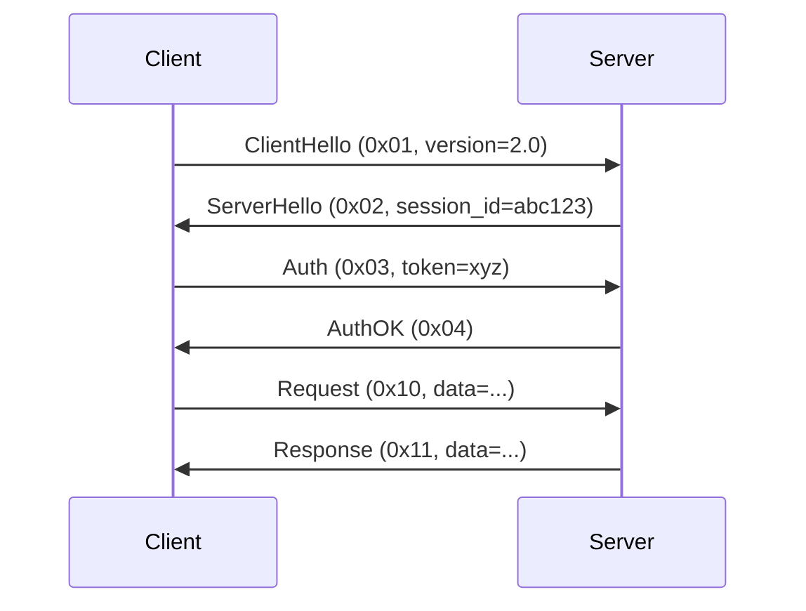

# Protocol Reverse Engineering Rules

## Core Principles

- Packet capture first: Work from real traffic, not assumptions
- State machine modeling: Protocols are state machines with transitions
- Layer-by-layer analysis: Start at transport layer, work up to application
- Pattern recognition: Look for repeating structures (length fields, checksums, magic bytes)
- Documentation as code: Capture findings in parseable formats (Kaitai Struct, Wireshark dissectors)

## Packet Capture Rules

### Capture Strategy

**Tools**:

- `tcpdump` / `tshark` - Command-line packet capture
- `Wireshark` - Interactive analysis
- `mitmproxy` - TLS interception for HTTPS
- `Burp Suite` - Web application protocols

**Capture filters** (reduce noise):

```bash
# Capture only traffic to/from specific host
tcpdump -i eth0 host 192.168.1.100

# Capture only specific port
tcpdump -i eth0 port 8080

# Capture only TCP SYN packets (connection establishment)
tcpdump -i eth0 'tcp[tcpflags] & tcp-syn != 0'
```

**Output format**: PCAP or PCAPNG for maximum tool compatibility.

### Traffic Isolation

**Best practice**: Capture target protocol in isolation (no background traffic).

**Technique**:

1. Set up controlled environment (VM, container)
2. Disable unrelated services
3. Generate minimal test cases (login, logout, single action)
4. Capture each test case separately

## Protocol State Machine Patterns

### State Machine Documentation Format

```markdown
## Protocol States

### State: INIT

- **Entry**: Connection established
- **Transitions**:
  - SEND ClientHello → WAIT_SERVER_HELLO
  - Timeout → ERROR

### State: WAIT_SERVER_HELLO

- **Entry**: ClientHello sent
- **Transitions**:
  - RECV ServerHello → AUTHENTICATED
  - RECV Error → ERROR
  - Timeout (30s) → ERROR

### State: AUTHENTICATED

- **Entry**: Handshake complete
- **Transitions**:
  - SEND Request → WAIT_RESPONSE
  - RECV ServerPing → SEND Pong, STAY
  - Connection closed → INIT
```

**Why state machines**: Protocols have implicit state. Explicit modeling prevents invalid message sequences.

### Message Sequence Diagrams

Use Mermaid sequence diagrams to document flows:



## Documentation Format

### Protocol Specification Template

```markdown
# [Protocol Name] Specification

**Version**: [X.Y.Z]
**Transport**: [TCP/UDP/HTTP/WebSocket]
**Port**: [default port]
**Encryption**: [None/TLS/Custom]

## Message Format

### Header (Common to all messages)

| Offset | Size | Type   | Name     | Description                 |
| ------ | ---- | ------ | -------- | --------------------------- |
| 0      | 1    | uint8  | magic    | Always 0xAB                 |
| 1      | 1    | uint8  | msg_type | Message type (see table)    |
| 2      | 2    | uint16 | length   | Payload length (big-endian) |
| 4      | N    | bytes  | payload  | Message-specific data       |

### Message Types

| Type | Hex  | Name        | Direction | Purpose           |
| ---- | ---- | ----------- | --------- | ----------------- |
| 1    | 0x01 | ClientHello | C→S       | Initiate session  |
| 2    | 0x02 | ServerHello | S→C       | Accept session    |
| 3    | 0x03 | Auth        | C→S       | Authenticate user |
| 4    | 0x04 | AuthOK      | S→C       | Auth successful   |

## Patterns

### Length Fields

- **Position**: Offset 2 (after magic + type)
- **Encoding**: Big-endian uint16
- **Semantics**: Payload bytes (excludes header)

### Checksums

- **Position**: Last 4 bytes of message
- **Algorithm**: CRC32
- **Coverage**: Entire message excluding checksum field
```

## Tool Integration

### Wireshark Dissector

When reverse engineering complete, create Wireshark dissector (Lua):

```lua
-- Custom protocol dissector
local myproto = Proto("myproto", "My Custom Protocol")

local f_magic = ProtoField.uint8("myproto.magic", "Magic", base.HEX)
local f_type = ProtoField.uint8("myproto.type", "Type", base.HEX)
local f_length = ProtoField.uint16("myproto.length", "Length", base.DEC)

myproto.fields = {f_magic, f_type, f_length}

function myproto.dissector(buffer, pinfo, tree)
  pinfo.cols.protocol = "MYPROTO"
  local subtree = tree:add(myproto, buffer(), "My Protocol")
  subtree:add(f_magic, buffer(0,1))
  subtree:add(f_type, buffer(1,1))
  subtree:add(f_length, buffer(2,2))
end
```

### Kaitai Struct

For binary protocol parsing:

```yaml
meta:
  id: my_protocol
  endian: be
seq:
  - id: magic
    contents: [0xab]
  - id: msg_type
    type: u1
  - id: length
    type: u2
  - id: payload
    size: length
```

## Anti-Patterns

| Anti-Pattern             | Problem                            | Fix                                     |
| ------------------------ | ---------------------------------- | --------------------------------------- |
| Analyzing single packet  | Miss context/session state         | Capture full session flows              |
| No state machine         | Can't validate message sequences   | Model protocol as state machine         |
| Guessing field semantics | Incorrect assumptions              | Test hypotheses with crafted packets    |
| Hardcoding offsets       | Breaks with variable-length fields | Use length fields dynamically           |
| No endianness awareness  | Misinterpret multi-byte values     | Document endianness (big vs little)     |
| Ignoring checksums       | Can't validate message integrity   | Identify and reverse checksum algorithm |
| Text instead of hex      | Loss of precision for binary       | Use hex dumps with ASCII side panel     |

## Integration Points

### Security Architect

- Uses protocol reverse engineering for vulnerability analysis
- Identifies insecure patterns (no encryption, weak auth)
- Assesses protocol security posture

### Penetration Tester

- Reverse engineers protocols to find attack surface
- Crafts malformed packets to test robustness
- Fuzzes protocol implementations

### Developer

- Implements client/server based on reverse-engineered spec
- Creates protocol adapters/translators
- Writes test harnesses

## Related References

- `.claude/skills/protocol-reverse-engineering/SKILL.md` - Complete implementation guide
- `.claude/skills/binary-analysis-patterns/SKILL.md` - Binary data analysis techniques
- `.claude/skills/variant-analysis/SKILL.md` - Finding similar protocol patterns
