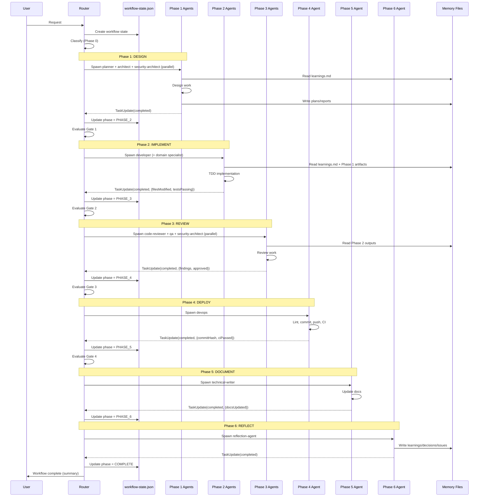

<!-- Agent: architect | Task: #37 | Session: 2026-02-06 -->

# Enterprise Orchestration Workflow -- State Machine

**Version:** 1.0.0
**Status:** AUTHORITATIVE -- This document defines the mandatory workflow all requests follow.
**Supersedes:** router-decision.md Step 7.3 Planning Orchestration Matrix (replaced by this state machine)
**ADR:** ADR-080

---

## Purpose

This workflow solves the "developer collapse" problem where 94% of agents are never spawned because:

1. No post-completion chain exists (developer finishes and nothing follows)
2. Enforcement hooks default to `warn` not `block`
3. No workflow state machine tracks multi-phase execution
4. The Router has no concept of workflow phases

This document defines a **deterministic state machine** that the Router MUST follow for every request. It replaces the ad-hoc "spawn developer and hope for the best" pattern with a phased, gate-enforced, multi-agent workflow.

---

## State Machine Overview

```
                         +------------------+
                         |   USER REQUEST   |
                         +--------+---------+
                                  |
                         +--------v---------+
                         |  PHASE 0: TRIAGE |
                         |  (Router only)   |
                         +--------+---------+
                                  |
                    +-------------+-------------+
                    |                           |
             capability gap?              no gap
                    |                           |
           +--------v---------+                 |
           | PHASE 0.5:       |                 |
           | DYNAMIC CREATION |                 |
           +--------+---------+                 |
                    |                           |
                    +-------------+-------------+
                                  |
                    complexity routing
                    |    |    |    |    |
              TRIVIAL LOW  MED  HIGH  EPIC
                |     |    |     |     |
                |     |    |     |     +---> All phases (orchestrated)
                |     |    |     +--------> Phases 1-6
                |     |    +-------------> Phases 1-5 (skip 6)
                |     +-----------------> Phases 1,2,3,4 (limited)
                +----------------------> Phases 2,4 only
                                  |
                         +--------v---------+
                         |  PHASE 1: DESIGN |
                         |  (parallel)      |
                         +--------+---------+
                                  |
                         [GATE 1: DESIGN APPROVED]
                                  |
                         +--------v---------+
                         | PHASE 2: IMPLEMENT|
                         |  (sequential)    |
                         +--------+---------+
                                  |
                         [GATE 2: TESTS PASS]
                                  |
                         +--------v---------+
                         | PHASE 3: REVIEW  |
                         |  (parallel)      |
                         +--------+---------+
                                  |
                         [GATE 3: REVIEWS PASS]
                                  |
                         +--------v---------+
                         | PHASE 4: DEPLOY  |
                         |  (sequential)    |
                         +--------+---------+
                                  |
                         [GATE 4: CI PASSES]
                                  |
                         +--------v---------+
                         | PHASE 5: DOCUMENT|
                         |  (sequential)    |
                         +--------+---------+
                                  |
                         [GATE 5: DOCS MATCH]
                                  |
                         +--------v---------+
                         | PHASE 6: REFLECT |
                         |  (sequential)    |
                         +--------+---------+
                                  |
                         [GATE 6: LEARNINGS RECORDED]
                                  |
                              COMPLETE
```

---

## Workflow State File

The Router persists workflow state in `.claude/context/runtime/workflow-state.json`.

```json
{
  "workflowId": "wf-2026-02-06-001",
  "requestSummary": "Add OAuth2 authentication",
  "complexity": "HIGH",
  "currentPhase": "PHASE_2_IMPLEMENT",
  "phases": {
    "PHASE_0_TRIAGE": { "status": "completed", "completedAt": "2026-02-06T10:00:00Z" },
    "PHASE_1_DESIGN": {
      "status": "completed",
      "completedAt": "2026-02-06T10:15:00Z",
      "agents": {
        "architect": { "taskId": "42", "status": "completed" },
        "security-architect": { "taskId": "43", "status": "completed" },
        "planner": { "taskId": "44", "status": "completed" }
      },
      "gate": { "passed": true, "checkedAt": "2026-02-06T10:16:00Z" }
    },
    "PHASE_2_IMPLEMENT": {
      "status": "in_progress",
      "agents": {
        "developer": { "taskId": "45", "status": "in_progress" }
      }
    },
    "PHASE_3_REVIEW": { "status": "pending" },
    "PHASE_4_DEPLOY": { "status": "pending" },
    "PHASE_5_DOCUMENT": { "status": "pending" },
    "PHASE_6_REFLECT": { "status": "pending" }
  },
  "artifacts": {
    "designDoc": ".claude/context/plans/oauth2-design-2026-02-06.md",
    "securityReview": ".claude/context/reports/security/oauth2-security-2026-02-06.md",
    "implementationPlan": ".claude/context/plans/oauth2-impl-plan-2026-02-06.md"
  },
  "skippedPhases": [],
  "createdAt": "2026-02-06T09:55:00Z",
  "updatedAt": "2026-02-06T10:20:00Z"
}
```

**Router reads this file at every prompt.** If a workflow is active (currentPhase is not null and not "COMPLETE"), the Router advances to the next phase rather than re-triaging.

---

## Phase 0: TRIAGE (Router Only)

**Purpose:** Classify the request and determine the workflow path.
**Actor:** Router (no subagent spawned)
**Duration:** Immediate (single Router turn)

### Entry Criteria

- User submits a request
- No active workflow in progress (or user explicitly starts new work)

### Actions

1. **Check reflections** (Step 0 from CLAUDE.md)
2. **TaskList()** -- check for pending/in-progress work
3. **Classify request** across 4 dimensions:

| Dimension  | Values                                                                                      | How to Determine                        |
| ---------- | ------------------------------------------------------------------------------------------- | --------------------------------------- |
| Intent     | bug-fix, feature, refactor, investigate, docs, test, deploy, architecture, security, review | Keyword matching from routing-table.cjs |
| Complexity | TRIVIAL, LOW, MEDIUM, HIGH, EPIC                                                            | See complexity rubric below             |
| Domain     | frontend, backend, mobile, data, infra, security, product, docs, architecture               | Framework/language detection            |
| Risk       | LOW, MEDIUM, HIGH, CRITICAL                                                                 | See risk rubric below                   |

4. **Check capability gaps** -- does the needed agent/skill exist?
   - If NOT: route to Phase 0.5 (Dynamic Creation)
   - If YES: proceed to phase routing

5. **Determine phase path** based on complexity:

### Complexity Rubric

| Complexity | Indicators                                                   | Phase Path                                                 |
| ---------- | ------------------------------------------------------------ | ---------------------------------------------------------- |
| TRIVIAL    | Single file, < 10 lines, no dependencies, obvious fix        | Phase 2 -> Phase 4                                         |
| LOW        | Single module, clear scope, < 3 files                        | Phase 1 (planner only) -> 2 -> 3 (code-reviewer only) -> 4 |
| MEDIUM     | Multiple modules, some unknowns, 3-10 files                  | Phase 1 (planner + architect) -> 2 -> 3 -> 4 -> 5          |
| HIGH       | Cross-cutting, many unknowns, 10+ files, architecture impact | All phases (1 through 6); add PM/TPM for product programs  |
| EPIC       | System-wide impact, new subsystem, breaking changes          | All phases with orchestrator coordination; include PM/TPM  |

### Risk Rubric

| Risk     | Indicators                                                     | Additional Agents Required          |
| -------- | -------------------------------------------------------------- | ----------------------------------- |
| LOW      | Read-only, docs, tests, non-critical paths                     | None                                |
| MEDIUM   | Code changes, refactoring, new features in non-critical paths  | architect (design review)           |
| HIGH     | Auth, payments, data migration, external integrations          | security-architect (mandatory)      |
| CRITICAL | Production deploy, security fixes, data deletion, breaking API | security-architect + QA (mandatory) |

6. **Create workflow state** and write to `workflow-state.json`
7. **Advance to appropriate phase**

### Exit Criteria

- Classification complete
- Workflow state file created
- Phase path determined

### Quality Gate: None (immediate routing)

---

## Phase 0.5: DYNAMIC CREATION (When Needed)

**Purpose:** Create missing agents, skills, or workflows before proceeding.
**Trigger:** Router detects no matching agent/skill for the request during Phase 0.
**Duration:** 1-3 Router turns

### Entry Criteria

- Phase 0 classification found a capability gap
- No existing agent/skill matches the request domain

### Actions

1. **Spawn researcher** to gather best practices:

   ```
   Agent: researcher
   Task: Research best practices for {capability}
   Skill: research-synthesis
   Output: .claude/context/artifacts/research-reports/{capability}-research-{date}.md
   ```

2. **Run feasibility preflight** before any creator:

   ```
   Agent: planner (or technical-program-manager for cross-team impact)
   Task: Validate capability creation feasibility
   Skills: creation-feasibility-gate + compliance-policy-check
   Output: PASS|WARN|BLOCK with blockers and mitigations
   ```

3. **Spawn planner** to define the creation tasks (only if preflight != BLOCK):

   ```
   Agent: planner
   Task: Plan creation of {agent|skill|workflow} for {capability}
   Output: .claude/context/plans/{capability}-creation-plan-{date}.md
   ```

4. **Spawn creator** (via appropriate creator skill):

   ```
   Agent: general-purpose
   Skills: research-synthesis -> {agent-creator|skill-creator|workflow-creator}
   Output: .claude/agents/{category}/{new-agent}.md (or equivalent)
   ```

5. **Resume Phase 0** with new capability available

### Exit Criteria

- New agent/skill/workflow created and registered
- CLAUDE.md updated with routing references
- Catalogs/registries updated
- Phase 0 re-entered with capability gap resolved

### Quality Gate: Creator Validation

- [ ] Feasibility preflight status is PASS or WARN
- [ ] Compliance policy check is PASS or CONDITIONAL with mitigations tracked
- [ ] Artifact passes schema validation
- [ ] CLAUDE.md routing references updated
- [ ] Catalog/registry entries added
- [ ] At least one agent assigned to new artifact

---

## Phase 1: DESIGN (Parallel Agents)

**Purpose:** Produce a comprehensive design before any code is written.
**Duration:** 1 Router turn (parallel agent spawns)

### Entry Criteria

- Phase 0 complete, complexity >= LOW
- Workflow state: `PHASE_1_DESIGN.status = "in_progress"`

### Agents Spawned (Varies by Complexity)

| Complexity | Agents Spawned                                                                                          | Execution |
| ---------- | ------------------------------------------------------------------------------------------------------- | --------- |
| LOW        | planner                                                                                                 | Single    |
| MEDIUM     | planner + architect                                                                                     | Parallel  |
| HIGH       | planner + architect + security-architect (+ pm + technical-program-manager for product/cross-team work) | Parallel  |
| EPIC       | planner + architect + security-architect + researcher + pm + technical-program-manager                  | Parallel  |

### Agent Responsibilities

**Planner** (always present):

- Break request into implementation tasks with acceptance criteria
- Define task dependencies and ordering
- Produce microtask DAG metadata for MEDIUM+ work (`owned_paths`, `forbidden_paths`, `depends_on`, `dependency_type`, `parallel_group`, `acceptance_checks`)
- Estimate effort per task
- Output: `.claude/context/plans/{feature}-impl-plan-{date}.md`

**PM** (product scope, HIGH/EPIC, or explicit roadmap/PRD requests):

- Own PRD quality and EPIC/story decomposition
- Define business outcomes and measurable acceptance outcomes
- Output: `.claude/context/artifacts/specs/{feature}-prd-{date}.md`

**Technical Program Manager** (cross-team dependencies, HIGH/EPIC):

- Maintain dependency map and milestone sequence
- Track RAID (risks, assumptions, issues, dependencies)
- Output: `.claude/context/artifacts/programs/{feature}-program-plan-{date}.md`

**Architect** (MEDIUM+):

- System design, component boundaries, API contracts
- Data model design, integration points
- Technology decisions with rationale
- Output: `.claude/context/plans/{feature}-design-{date}.md`

**Security-Architect** (HIGH+ or any auth/security request):

- Threat model (STRIDE analysis)
- Authentication/authorization design
- Data flow security review
- Output: `.claude/context/reports/security/{feature}-threat-model-{date}.md`

**Researcher** (EPIC or when domain is unfamiliar):

- Gather external best practices
- Find relevant patterns and prior art
- Check documentation for APIs/libraries
- Output: `.claude/context/artifacts/research-reports/{feature}-research-{date}.md`

### Agent Context Sharing

All Phase 1 agents receive:

```
## Shared Context
- Request: {original user request}
- Classification: Intent={intent}, Complexity={complexity}, Domain={domain}, Risk={risk}
- Workflow ID: {workflowId}
- Memory: Read .claude/context/memory/learnings.md before starting
```

All Phase 1 agents MUST write to:

```
## Mandatory Outputs
- Primary artifact (plan/design/report) to location specified above
- TaskUpdate({ taskId: X, status: "completed", metadata: { ... } })
- Learnings to .claude/context/memory/learnings.md
- Decisions to .claude/context/memory/decisions.md
```

### Exit Criteria

- ALL spawned agents have called TaskUpdate(completed)
- All required artifacts exist at specified paths
- No conflicting recommendations between agents

### Quality Gate 1: DESIGN APPROVED

| Check                                                               | Required For | Blocking? |
| ------------------------------------------------------------------- | ------------ | --------- |
| Implementation plan exists with tasks                               | ALL          | YES       |
| Each task has acceptance criteria                                   | LOW+         | YES       |
| MEDIUM+ plan includes microtask DAG ownership + dependency metadata | MEDIUM+      | YES       |
| Architecture document exists                                        | MEDIUM+      | YES       |
| No conflicting agent recommendations                                | MEDIUM+      | YES       |
| Threat model exists                                                 | HIGH+        | YES       |
| Research report with 3+ sources                                     | EPIC         | YES       |
| All Phase 1 agents completed                                        | ALL          | YES       |

**If gate fails:** Router identifies which check failed and re-spawns the appropriate agent with corrective instructions.

---

## Phase 2: IMPLEMENT (Sequential)

**Purpose:** Write code following the plan from Phase 1.
**Duration:** 1+ Router turns (may need multiple if plan has sequential tasks)

### Entry Criteria

- Gate 1 passed
- Workflow state: `PHASE_2_IMPLEMENT.status = "in_progress"`

### Agent Selection Precedence

**Phase 2 uses a 3-tier precedence for agent assignment:**

1. **Task-level Target Agent** (from Planner): If the implementation plan specifies `Target Agent: technical-writer` for a task, use that agent. This is the PREFERRED method.
2. **Domain detection** (existing logic): If no task-level assignment, detect from project files (package.json → frontend-pro, requirements.txt → python-pro, etc.)
3. **Fallback**: `developer` (ONLY when neither task-level nor domain detection yields a match)

**Rule:** `developer` is the LAST RESORT. Task-level agent assignment ALWAYS takes priority.

### Parallel Implementation Guardrails (Planner DAG)

For planner microtask DAG execution in Phase 2:

- Parallel shards are allowed only when `owned_paths` are disjoint
- `depends_on` must be satisfied before spawn
- `dependency_type=blocks` is required for hard prerequisite edges; other dependency types are informational
- Max parallel shard fan-out: 4
- Shared/high-risk files (routing, global config, shared schema) run sequentially
- After each shard group, run merge/review gate before next group

### Role-Level Execution Contract (Developer/QA/Code-Reviewer)

- `developer`: implement per shard with explicit ownership boundaries; do not cross-edit overlapping shards in the same wave.
- `qa`: verify each shard locally, then run cross-shard integration regression before phase completion.
- `code-reviewer`: issue findings per shard and at merge boundaries; block approval when ownership contracts are violated.
- File-size guidance: treat ~500 LOC as a soft maintainability threshold, not a hard microservice trigger.

### Hook Enforcement Points (Operational)

Parallel + task lifecycle safety is enforced by runtime hooks:

| Concern                      | Hook/Module                                             | Behavior                                                         |
| ---------------------------- | ------------------------------------------------------- | ---------------------------------------------------------------- |
| Parallel ownership required  | `.claude/hooks/routing/pre-task-unified-ownership.cjs`  | Blocks or warns on parallel work with missing ownership metadata |
| Ownership conflict detection | `.claude/hooks/routing/pre-task-unified-ownership.cjs`  | Blocks overlapping `owned_paths` claims                          |
| Task spawn orchestration     | `.claude/hooks/routing/pre-task-unified-core.cjs`       | Enforces spawn guardrails and registers lifecycle bootstrap      |
| TaskUpdate-first protocol    | `.claude/hooks/routing/pre-tool-unified.taskupdate.cjs` | Enforces first `TaskUpdate(in_progress)` before heavy tools      |
| Completion phase chaining    | `.claude/hooks/workflow/post-completion-chain.cjs`      | Advances workflow phase only after completion gate checks        |

### Agents Spawned

| Condition                             | Agent(s)                                         | Execution               |
| ------------------------------------- | ------------------------------------------------ | ----------------------- |
| Task with Target Agent specified      | (as specified in plan)                           | Per plan                |
| Documentation tasks                   | technical-writer                                 | Sequential              |
| Cleanup/refactoring tasks             | code-simplifier                                  | Sequential              |
| Database tasks                        | database-architect                               | Sequential              |
| Infrastructure tasks                  | devops                                           | Sequential              |
| Domain-specific language/framework    | domain specialist (e.g., python-pro, nextjs-pro) | Sequential              |
| Database schema changes               | developer + database-architect                   | Parallel                |
| Frontend + Backend                    | developer (backend) + developer (frontend)       | Parallel if independent |
| Default (no target, no domain signal) | developer                                        | Sequential              |

### Domain Specialist Routing

The Router selects domain specialists based on project detection:

| Detection Signal                       | Agent        |
| -------------------------------------- | ------------ |
| `package.json` with React/Vue/Angular  | frontend-pro |
| `next.config.js` or `app/` directory   | nextjs-pro   |
| `requirements.txt` or `pyproject.toml` | python-pro   |
| `Cargo.toml`                           | rust-pro     |
| `go.mod`                               | golang-pro   |
| `*.swift` or Xcode project             | ios-pro      |
| `build.gradle` or `pom.xml`            | java-pro     |
| `Dockerfile` or `docker-compose.yml`   | devops       |
| `.graphql` or GraphQL deps             | graphql-pro  |

**Fallback:** If no domain signal detected AND no task-level agent specified, use `developer`.

### Agent Context

```
## Implementation Context
- Plan: {path to implementation plan from Phase 1}
- Design: {path to architecture document from Phase 1}
- Security constraints: {path to threat model from Phase 1}
- Workflow ID: {workflowId}
- Task ID: {specific task from plan}

## Mandatory Skills
- Skill({ skill: "tdd" })  // Test-first development
- Skill({ skill: "verification-before-completion" })  // No false completion claims

## Mandatory Outputs
- Code changes (following the plan)
- Test files (written BEFORE implementation per TDD)
- TaskUpdate({ taskId: X, status: "completed", metadata: { filesModified: [...], testsAdded: true, testsPassing: true } })
```

### Exit Criteria

- All planned implementation tasks completed
- All agents called TaskUpdate(completed)
- Tests exist for new code
- Tests pass (verified by agent, not assumed)

### Quality Gate 2: TESTS PASS

| Check                                       | Required For | Blocking?    |
| ------------------------------------------- | ------------ | ------------ |
| All planned tasks have completed TaskUpdate | ALL          | YES          |
| Test files exist for new code               | ALL          | YES          |
| Tests pass (agent-verified, not assumed)    | ALL          | YES          |
| Implementation matches plan                 | MEDIUM+      | YES          |
| No TODO/FIXME/HACK markers in new code      | HIGH+        | NO (warning) |

**If gate fails:** Router re-spawns developer with the failing test output and instructions to fix.

---

## Phase 3: REVIEW (Parallel Agents)

**Purpose:** Independent quality review of the implementation.
**Duration:** 1 Router turn (parallel agent spawns)

### Entry Criteria

- Gate 2 passed
- Workflow state: `PHASE_3_REVIEW.status = "in_progress"`

### Agents Spawned (Varies by Complexity)

| Complexity | Agents Spawned                                      | Execution |
| ---------- | --------------------------------------------------- | --------- |
| LOW        | code-reviewer                                       | Single    |
| MEDIUM     | code-reviewer + qa                                  | Parallel  |
| HIGH       | code-reviewer + qa + security-architect             | Parallel  |
| EPIC       | code-reviewer + qa + security-architect + architect | Parallel  |

### Agent Responsibilities

**Code-Reviewer** (always present):

- Code quality, patterns, maintainability
- SOLID principles adherence
- DRY violations, dead code, complexity
- Skill: `Skill({ skill: "checklist-generator" })`
- Output: `.claude/context/reports/qa/{feature}-code-review-{date}.md`

**QA** (MEDIUM+):

- Test coverage analysis
- Edge case identification
- Regression test verification
- Missing test scenarios
- Skill: `Skill({ skill: "tdd" })`
- Output: `.claude/context/reports/qa/{feature}-qa-report-{date}.md`

**Security-Architect** (HIGH+ or any auth/security):

- Implementation matches threat model
- No new vulnerabilities introduced
- OWASP Top 10 verification
- Skill: `Skill({ skill: "security-architect" })`
- Output: `.claude/context/reports/security/{feature}-security-review-{date}.md`

**Architect** (EPIC):

- Implementation matches architecture design
- No architectural drift
- Component boundaries respected
- Skill: `Skill({ skill: "architecture-review" })`
- Output: `.claude/context/reports/architecture/{feature}-arch-review-{date}.md`

### Agent Context

```
## Review Context
- Original plan: {path to implementation plan}
- Design document: {path to architecture document}
- Files modified: {list from Phase 2 TaskUpdate metadata}
- Tests added: {list from Phase 2 TaskUpdate metadata}
- Workflow ID: {workflowId}

## Review Instructions
- Review ONLY the changes made in Phase 2
- Compare implementation against the plan
- Report findings as: CRITICAL (blocking), HIGH, MEDIUM, LOW
- CRITICAL findings BLOCK progression to Phase 4

## Mandatory Outputs
- Review report at specified path
- TaskUpdate({ taskId: X, status: "completed", metadata: { criticalFindings: N, highFindings: N, approved: true|false } })
```

### Exit Criteria

- ALL review agents have called TaskUpdate(completed)
- All review reports exist
- No CRITICAL findings remain unresolved

### Quality Gate 3: REVIEWS PASS

| Check                                      | Required For | Blocking? |
| ------------------------------------------ | ------------ | --------- |
| All review agents completed                | ALL          | YES       |
| Zero CRITICAL findings                     | ALL          | YES       |
| Code-reviewer approved                     | ALL          | YES       |
| QA test coverage >= 80%                    | MEDIUM+      | YES       |
| Security review passed (no critical vulns) | HIGH+        | YES       |
| Architecture review passed                 | EPIC         | YES       |

**If gate fails with CRITICAL findings:**

1. Router re-spawns developer with the review findings
2. Developer fixes issues
3. Router re-enters Phase 3 (review the fixes)
4. Maximum 3 review cycles before escalating to user

---

## Phase 4: DEPLOY (Sequential)

**Purpose:** Lint, format, commit, push, verify CI.
**Duration:** 1 Router turn

### Entry Criteria

- Gate 3 passed
- Workflow state: `PHASE_4_DEPLOY.status = "in_progress"`

### Agents Spawned

| Agent  | Responsibility                               |
| ------ | -------------------------------------------- |
| devops | Lint, format, commit, push, verify CI passes |

### Agent Context

```
## Deployment Context
- Files modified: {aggregate from Phase 2 + Phase 3 fix cycles}
- Tests verified: {from Gate 2}
- Reviews passed: {from Gate 3}
- Workflow ID: {workflowId}

## Instructions
1. Run linter on all modified files
2. Run formatter on all modified files
3. Verify all tests still pass after formatting
4. Create a focused, descriptive commit
5. Push to remote branch
6. Verify CI checks pass
7. If CI fails: fix and retry (max 3 attempts)

## Mandatory Outputs
- TaskUpdate({ taskId: X, status: "completed", metadata: { commitHash: "...", branch: "...", ciPassed: true } })
```

### Exit Criteria

- Code committed and pushed
- CI checks pass

### Quality Gate 4: CI PASSES

| Check                              | Required For | Blocking?    |
| ---------------------------------- | ------------ | ------------ |
| Lint passes                        | ALL          | YES          |
| All tests pass in CI               | ALL          | YES          |
| No merge conflicts                 | ALL          | YES          |
| Commit message follows conventions | ALL          | NO (warning) |

**If gate fails:** DevOps agent fixes lint/test issues and retries (max 3 attempts). If still failing, escalate to user.

---

## Phase 5: DOCUMENT (Sequential)

**Purpose:** Update documentation to match the implementation.
**Duration:** 1 Router turn

### Entry Criteria

- Gate 4 passed
- Workflow state: `PHASE_5_DOCUMENT.status = "in_progress"`

### Agents Spawned

| Agent            | Responsibility                           |
| ---------------- | ---------------------------------------- |
| technical-writer | Update docs, README, API docs, CHANGELOG |

### Agent Context

```
## Documentation Context
- Feature: {original request summary}
- Files modified: {from Phase 2/3}
- Architecture design: {from Phase 1}
- API changes: {from implementation}
- Workflow ID: {workflowId}

## Instructions
1. Update README.md if public API changed
2. Update CHANGELOG.md with feature entry
3. Update API documentation if endpoints changed
4. Update architecture diagrams if structure changed
5. Create/update user-facing documentation

## Mandatory Outputs
- TaskUpdate({ taskId: X, status: "completed", metadata: { docsUpdated: [...] } })
```

### Exit Criteria

- Documentation updated
- Agent called TaskUpdate(completed)

### Quality Gate 5: DOCS MATCH IMPLEMENTATION

| Check                                  | Required For | Blocking?    |
| -------------------------------------- | ------------ | ------------ |
| README updated (if public API changed) | MEDIUM+      | NO (warning) |
| CHANGELOG updated                      | MEDIUM+      | NO (warning) |
| API docs match implementation          | HIGH+        | YES          |
| Architecture diagrams current          | EPIC         | YES          |

**If gate fails:** Router re-spawns technical-writer with specific gaps to fill.

---

## Phase 6: REFLECT (Sequential)

**Purpose:** Extract learnings, update memory, identify improvements.
**Duration:** 1 Router turn

### Entry Criteria

- Gate 5 passed (or Phase 5 skipped)
- Workflow state: `PHASE_6_REFLECT.status = "in_progress"`

### Agents Spawned

| Agent            | Responsibility                         |
| ---------------- | -------------------------------------- |
| reflection-agent | Extract learnings, update memory files |

### Agent Context

```
## Reflection Context
- Workflow ID: {workflowId}
- Original request: {user request}
- Phases completed: {list of phases with agent summaries}
- Review findings: {from Phase 3}
- Total agents spawned: {count}
- Workflow duration: {time from start to now}

## Instructions
1. Review all phase outputs and agent reports
2. Extract patterns and learnings -> .claude/context/memory/learnings.md
3. Record architectural decisions -> .claude/context/memory/decisions.md
4. Record unresolved issues -> .claude/context/memory/issues.md
5. Identify process improvements for future workflows
6. Clear any pending reflection requests

## Mandatory Outputs
- TaskUpdate({ taskId: X, status: "completed", metadata: { learningsRecorded: N, decisionsRecorded: N, issuesRecorded: N } })
```

### Exit Criteria

- Memory files updated
- Agent called TaskUpdate(completed)

### Quality Gate 6: LEARNINGS RECORDED

| Check                                       | Required For | Blocking?    |
| ------------------------------------------- | ------------ | ------------ |
| At least 1 learning recorded                | HIGH+        | NO (warning) |
| Decisions recorded for architecture changes | HIGH+        | NO (warning) |
| Issues recorded for unresolved problems     | ALL          | NO (warning) |

**Gate 6 is non-blocking.** Reflection is valuable but should not prevent workflow completion.

### Workflow Completion

After Gate 6 (or after Phase 5 if Phase 6 is skipped):

1. Update workflow state: `currentPhase = "COMPLETE"`
2. Report completion to user with summary:
   - Phases executed
   - Agents spawned (count and types)
   - Key artifacts produced
   - Review findings summary
   - Learnings recorded

---

## Complexity-Based Phase Skipping Rules

### TRIVIAL (single file, obvious fix)

```
Phase 0 (Triage) -> Phase 2 (Implement: developer) -> Phase 4 (Deploy: devops)
```

Skipped: Phase 1 (no design needed), Phase 3 (no review needed), Phase 5 (no docs), Phase 6 (no reflection)

### LOW (single module, clear scope)

```
Phase 0 -> Phase 1 (planner only) -> Phase 2 (developer) -> Phase 3 (code-reviewer only) -> Phase 4 (devops)
```

Skipped: Phase 5 (docs usually not needed), Phase 6 (reflection optional)

### MEDIUM (multiple modules, moderate complexity)

```
Phase 0 -> Phase 1 (planner + architect) -> Phase 2 (developer) -> Phase 3 (code-reviewer + qa) -> Phase 4 (devops) -> Phase 5 (technical-writer)
```

Skipped: Phase 6 (reflection optional)

### HIGH (cross-cutting, architecture impact)

```
Phase 0 -> Phase 1 (planner + architect + security-architect) -> Phase 2 (developer + domain specialist) -> Phase 3 (code-reviewer + qa + security-architect) -> Phase 4 (devops) -> Phase 5 (technical-writer) -> Phase 6 (reflection-agent)
```

No phases skipped.

### EPIC (system-wide, breaking changes)

```
Phase 0 -> Phase 1 (planner + architect + security-architect + researcher) -> Phase 2 (developer + domain specialists) -> Phase 3 (code-reviewer + qa + security-architect + architect) -> Phase 4 (devops) -> Phase 5 (technical-writer) -> Phase 6 (reflection-agent)
```

No phases skipped. Master-orchestrator coordinates if multiple subsystems affected.

### FULL SWEEP (framework hardening / "run full enterprise pipeline")

Use this when user explicitly requests full-system improvement or "integrate/fix all findings":

```
reflection-agent -> (pm + technical-program-manager + researcher) -> (architect + security-architect + code-simplifier + researcher) -> (domain + specialized agents) -> (planner + context-compressor) -> (developer + chaos-engineer) -> code-reviewer -> qa -> devops -> technical-writer -> reflection-agent
```

Operational requirements for this profile:

- Search-first: use hybrid search (`pnpm search:code`, semantic/structural search skills, ripgrep skill). Use `Grep` only as fallback.
- Planner quality gate: planner must invoke `Skill({ skill: "tdd" })` and produce a detailed TDD plan before implementation phases.
- Uncertainty handling: if planner confidence is low, explicitly spawn `researcher` and/or `architect` before implementation continues.

---

## Agent Handoff Protocol

### Artifact Locations (Per Workspace Conventions)

| Artifact Type       | Location                                                                  | Producer           |
| ------------------- | ------------------------------------------------------------------------- | ------------------ |
| Implementation plan | `.claude/context/plans/{feature}-impl-plan-{date}.md`                     | planner            |
| Architecture design | `.claude/context/plans/{feature}-design-{date}.md`                        | architect          |
| Threat model        | `.claude/context/reports/security/{feature}-threat-model-{date}.md`       | security-architect |
| Research report     | `.claude/context/artifacts/research-reports/{feature}-research-{date}.md` | researcher         |
| Code review report  | `.claude/context/reports/qa/{feature}-code-review-{date}.md`              | code-reviewer      |
| QA report           | `.claude/context/reports/qa/{feature}-qa-report-{date}.md`                | qa                 |
| Security review     | `.claude/context/reports/security/{feature}-security-review-{date}.md`    | security-architect |
| Architecture review | `.claude/context/reports/architecture/{feature}-arch-review-{date}.md`    | architect          |
| Deployment log      | `.claude/context/reports/{feature}-deploy-log-{date}.md`                  | devops             |

### Handoff Metadata via TaskUpdate

Every agent MUST include structured metadata in TaskUpdate(completed):

```javascript
TaskUpdate({
  taskId: 'X',
  status: 'completed',
  metadata: {
    // Universal fields (all agents)
    summary: 'One-line description of what was done',
    phase: 'PHASE_1_DESIGN',
    workflowId: 'wf-2026-02-06-001',

    // Discovery fields
    filesModified: ['path/to/file1.ts', 'path/to/file2.ts'],
    filesCreated: ['path/to/new.ts'],
    outputArtifacts: ['.claude/context/plans/feature-plan.md'],

    // Review fields (Phase 3 agents)
    criticalFindings: 0,
    highFindings: 2,
    approved: true,

    // Implementation fields (Phase 2)
    testsAdded: true,
    testsPassing: true,
    testCount: 15,

    // Deploy fields (Phase 4)
    commitHash: 'abc123',
    branch: 'feature/oauth2',
    ciPassed: true,

    completedAt: new Date().toISOString(),
  },
});
```

### How the Router Reads Handoff Data

1. After spawning Phase N agents, Router waits for task completion
2. On next user prompt (or poll), Router calls `TaskList()`
3. For each completed task, Router reads metadata via `TaskGet(taskId)`
4. Router evaluates the quality gate for the current phase
5. If gate passes: advance `workflow-state.json` to next phase, spawn next agents
6. If gate fails: re-spawn corrective agents with failure context

### Memory Protocol (All Agents, All Phases)

**Before starting work:**

```
Read .claude/context/memory/learnings.md
```

**After completing work (in addition to TaskUpdate):**

```
Append to .claude/context/memory/learnings.md  (new patterns)
Append to .claude/context/memory/decisions.md  (ADRs for design choices)
Append to .claude/context/memory/issues.md     (blockers, workarounds)
```

---

## Enforcement Requirements

### Hook Changes (Block Mode by Default)

| Hook                        | Current Default | Required Default | Purpose                                        |
| --------------------------- | --------------- | ---------------- | ---------------------------------------------- |
| routing-guard.cjs           | warn            | **block**        | Enforce planner-first for complex tasks        |
| security-review enforcement | off             | **block**        | Enforce security-architect for auth/security   |
| unified-creator-guard.cjs   | block           | block            | Enforce creator workflow (keep as-is)          |
| spawn-prompt-validator.cjs  | warn            | **block**        | Validate spawn prompts contain required fields |

### New Hooks Required

| Hook                         | Type        | Purpose                                               |
| ---------------------------- | ----------- | ----------------------------------------------------- |
| post-completion-chain.cjs    | PostToolUse | On TaskUpdate(completed), trigger next phase          |
| workflow-state-validator.cjs | PreToolUse  | Validate Router follows workflow state machine        |
| intent-agent-match.cjs       | PreToolUse  | Prevent spawning developer when intent maps elsewhere |

### Post-Completion Chain Hook Logic

```
When: PostToolUse on TaskUpdate where status === "completed"
Then:
  1. Read workflow-state.json
  2. Check if all agents in current phase are completed
  3. If all completed: evaluate quality gate
  4. If gate passes: update workflow-state.json to next phase
  5. Signal Router to spawn next phase agents
```

---

## Error Recovery

### Agent Fails to Complete

If an agent does not call TaskUpdate(completed) within a reasonable time:

1. Router checks TaskList() for stuck tasks
2. Router re-spawns the agent with context from the previous attempt
3. Maximum 2 retries before escalating to user

### Quality Gate Fails

1. Router identifies which specific check failed
2. Router spawns the appropriate agent to fix the issue
3. Re-evaluate the gate after fix
4. Maximum 3 fix cycles per gate before escalating to user

### Workflow Interrupted (Context Reset)

1. Router reads `workflow-state.json` on every prompt
2. If an active workflow exists, Router resumes from `currentPhase`
3. Router re-reads all artifact paths from `workflow-state.json`
4. No work is lost because all state is in files, not in memory

### Conflicting Agent Recommendations (Phase 1)

If Phase 1 agents produce conflicting recommendations:

1. Spawn planner in "consolidation mode" to resolve conflicts
2. Planner reviews all Phase 1 artifacts and produces unified plan
3. If planner cannot resolve: escalate to user via AskUserQuestion

---

## Diagram: Agent Interaction Per Phase



---

## Integration with Existing Infrastructure

### Relationship to router-decision.md

This workflow **replaces** the ad-hoc Step 7.3 Planning Orchestration Matrix in router-decision.md. The Router should:

1. Follow Steps 0-6 of router-decision.md (classification, self-check, agent selection)
2. Then follow THIS workflow for phase execution (Step 7+)

### Relationship to feature-development-workflow.md

The existing feature-development-workflow.md is a more detailed, feature-specific version of this workflow. This enterprise workflow is the **general-purpose** state machine. For explicit feature development requests, the Router may reference feature-development-workflow.md for additional detail within each phase.

### Relationship to CLAUDE.md

CLAUDE.md Section 3.5 references this workflow. The Router reads CLAUDE.md, which directs it to router-decision.md, which directs it to this enterprise-workflow.md for phase execution.

### Task Tool Integration

- Phases use existing TaskCreate/TaskUpdate/TaskList tools
- Each phase's agents get task IDs linked to the workflow
- Workflow state is tracked in workflow-state.json, not in task metadata
- Task metadata carries per-agent results; workflow-state.json carries phase-level state

---

## Summary: Agents Activated Per Phase

| Phase               | Agents                                                                            | Always        | Conditional                                                                        |
| ------------------- | --------------------------------------------------------------------------------- | ------------- | ---------------------------------------------------------------------------------- |
| Phase 0 (Triage)    | Router                                                                            | Yes           | --                                                                                 |
| Phase 0.5 (Create)  | researcher, planner, creator                                                      | No            | Capability gap detected                                                            |
| Phase 1 (Design)    | planner, architect, security-architect, researcher, pm, technical-program-manager | planner       | architect (MED+), security (HIGH+), researcher (EPIC), pm/tpm (product/cross-team) |
| Phase 2 (Implement) | developer, domain specialist, database-architect                                  | developer     | domain (when detected), database (schema changes)                                  |
| Phase 3 (Review)    | code-reviewer, qa, security-architect, architect                                  | code-reviewer | qa (MED+), security (HIGH+), architect (EPIC)                                      |
| Phase 4 (Deploy)    | devops                                                                            | Yes           | --                                                                                 |
| Phase 5 (Document)  | technical-writer                                                                  | Yes           | --                                                                                 |
| Phase 6 (Reflect)   | reflection-agent                                                                  | Yes           | --                                                                                 |

**Total unique agents activated:** 14 (vs 1 today)

- Core: planner, pm, technical-program-manager, developer, qa, architect, technical-writer, reflection-agent (8)
- Specialized: code-reviewer, security-architect, devops, database-architect, researcher (5)
- Domain: context-dependent (23 available)

This represents a utilization increase from **2% to 24%+** of the agent pool, with domain agents activating for external projects.
