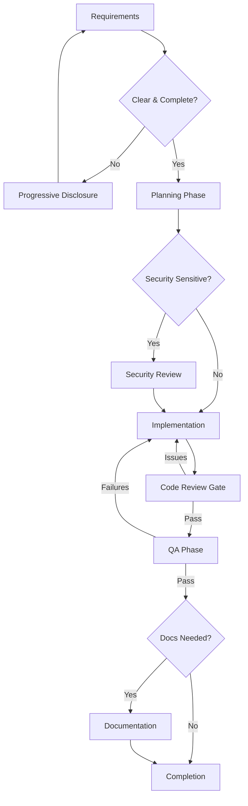

# Feature Development Workflow

**Comprehensive feature development lifecycle from requirements to deployment. Ensures quality gates, security review, and systematic testing at each phase.**

**Extended Thinking**: This workflow exists to prevent the common failure pattern of "code first, test later, document never." By enforcing a structured lifecycle with quality gates, we catch issues early, maintain security posture, and deliver features that are tested, reviewed, and documented. Each phase has clear entry/exit criteria to prevent skipping critical steps.

## Overview

This workflow guides development of new features through a multi-phase lifecycle:

1. **Requirements Gathering** - Clarify and document what needs to be built
2. **Planning** - Create implementation plan with research foundation
3. **Security Review Gate** - Assess security implications before implementation
4. **Implementation** - Build with TDD (Red-Green-Refactor)
5. **Code Review Gate** - Verify implementation quality and adherence
6. **QA Phase** - Validate tests and coverage
7. **Documentation** - Update user-facing and technical docs
8. **Completion** - Finalize and record learnings



## Phase 1: Requirements Gathering

**Purpose**: Clarify what needs to be built before planning begins.

**Responsible Agent**: Router (initial), then delegates to appropriate domain expert

**Entry Conditions**:
- User request received
- Request classified as "new feature"

**Skills to Invoke**:
```javascript
Skill({ skill: 'progressive-disclosure' }); // Clarify ambiguities
Skill({ skill: 'spec-gathering' }); // Gather requirements systematically
```

**Actions**:

1. **Analyze User Request**
   - Identify domain (frontend, backend, mobile, data, infrastructure)
   - Classify complexity (Trivial, Low, Medium, High, Epic)
   - Assess risk level (Low, Medium, High, Critical)
   - Detect security sensitivity (auth, payments, PII, external integrations)

2. **Clarify Ambiguities**
   - Use `AskUserQuestion()` for unclear requirements
   - Invoke `progressive-disclosure` skill to explore unknowns
   - Document assumptions explicitly

3. **Document Requirements**
   - Save to: `.claude/context/specs/<feature-name>-requirements.md`
   - Include: User story, acceptance criteria, edge cases, constraints
   - Mark `[NEEDS CLARIFICATION]` items for research phase

**Exit Criteria** (ALL required):
- [ ] Requirements documented in spec file
- [ ] All ambiguities resolved or marked for research
- [ ] Acceptance criteria are measurable
- [ ] Domain and complexity classified
- [ ] Security sensitivity assessed

**Failure Mode**:
- If requirements remain unclear after 2 clarification rounds: PAUSE and schedule requirements workshop with stakeholders

**Next Phase**: Planning

---

## Phase 2: Planning

**Purpose**: Create research-backed implementation plan with Phase 0 research.

**Responsible Agent**: `planner` (with `research-synthesis` skill)

**Entry Conditions**:
- Requirements documented and clear
- Complexity ≥ Medium (trivial/low can skip to Implementation)

**Skills to Invoke**:
```javascript
Skill({ skill: 'plan-generator' }); // Structured plan creation
Skill({ skill: 'research-synthesis' }); // Phase 0 research (MANDATORY)
Skill({ skill: 'sequential-thinking' }); // Step-by-step reasoning
```

**Actions**:

1. **Phase 0: Research & Planning (MANDATORY)**
   - Execute minimum 3 research queries (Exa/WebSearch)
   - Consult minimum 3 external sources
   - Analyze existing codebase patterns
   - Document technical decisions with rationale
   - Create research report: `.claude/context/artifacts/research-reports/<feature-name>-research.md`

2. **Constitution Checkpoint (4 Blocking Gates)**

   **Gate 1: Research Completeness**
   - [ ] Research report contains 3+ external sources with citations
   - [ ] All `[NEEDS CLARIFICATION]` items resolved
   - [ ] ADRs created for major decisions

   **Gate 2: Technical Feasibility**
   - [ ] Technical approach validated against research
   - [ ] Dependencies identified and available
   - [ ] No blocking technical issues discovered

   **Gate 3: Security Review**
   - [ ] Security implications assessed (STRIDE model)
   - [ ] Threat model documented if applicable
   - [ ] Mitigations identified for all risks

   **Gate 4: Specification Quality**
   - [ ] Acceptance criteria are measurable
   - [ ] Success criteria are clear and testable
   - [ ] Edge cases considered and documented

   **If ANY gate fails, return to Phase 0 research. DO NOT proceed to implementation planning.**

3. **Create Implementation Plan**
   - Break down into atomic tasks (1-2 hours each)
   - Identify dependencies between tasks
   - Define success criteria for each phase
   - Include commit checkpoint for 10+ file projects
   - Save to: `.claude/context/plans/<feature-name>-plan.md`

4. **Final Phase: Evolution & Reflection Check**
   - MANDATORY: Every plan MUST include this as the last phase
   - Spawns reflection-agent after implementation completes
   - Extracts learnings and checks for evolution opportunities

**Exit Criteria** (ALL required):
- [ ] Phase 0 research complete (3+ queries, 3+ sources)
- [ ] Constitution checkpoint passed (all 4 gates green)
- [ ] Implementation plan saved to correct location
- [ ] Plan includes mandatory Evolution & Reflection Check phase
- [ ] Each task has clear success criteria
- [ ] Dependencies mapped

**Failure Mode**:
- If constitution checkpoint fails: Return to Phase 0, complete missing research
- If technical feasibility fails: Escalate to architect for design review
- If security review fails: Escalate to security-architect for threat modeling

**Next Phase**: Security Review Gate (if security-sensitive) OR Implementation (if not)

---

## Phase 3: Security Review Gate

**Purpose**: Assess security implications before implementation begins.

**Responsible Agent**: `security-architect`

**Entry Conditions**:
- Plan created and constitution checkpoint passed
- Feature is security-sensitive (detected in Phase 1):
  - Involves authentication/authorization
  - Handles PII or sensitive data
  - Integrates with external systems
  - Modifies access control or permissions
  - Processes payments or financial data

**Skills to Invoke**:
```javascript
Skill({ skill: 'security-architect' }); // OWASP Top 10, STRIDE analysis
```

**Actions**:

1. **Threat Modeling (STRIDE)**
   - **S**poofing: Can users impersonate others?
   - **T**ampering: Can data be modified maliciously?
   - **R**epudiation: Can actions be denied?
   - **I**nformation Disclosure: Can data leak?
   - **D**enial of Service: Can resources be exhausted?
   - **E**levation of Privilege: Can access be escalated?

2. **OWASP Top 10 Analysis**
   - A01: Broken Access Control
   - A02: Cryptographic Failures
   - A03: Injection
   - A07: Authentication Failures
   - A08: Software/Data Integrity Failures
   - A10: SSRF
   - (Other categories as applicable)

3. **Security Assessment Report**
   - Document findings by severity (CRITICAL, HIGH, MEDIUM, LOW)
   - Identify mitigations for each risk
   - Provide secure implementation patterns
   - Save to: `.claude/context/reports/<feature-name>-security-review.md`

**Exit Criteria** (ALL required):
- [ ] STRIDE analysis completed
- [ ] OWASP Top 10 reviewed for applicable categories
- [ ] All CRITICAL/HIGH risks have mitigations documented
- [ ] Security assessment report saved
- [ ] Implementation plan updated with security requirements

**Failure Mode**:
- If CRITICAL risks without mitigations: BLOCK implementation until mitigations identified
- If design fundamentally insecure: Return to Planning phase with security-architect guidance

**Next Phase**: Implementation

---

## Phase 4: Implementation

**Purpose**: Build the feature following TDD principles.

**Responsible Agent**: `developer` (may spawn domain specialists: `typescript-pro`, `python-pro`, `react-expert`, etc.)

**Entry Conditions**:
- Plan approved (constitution checkpoint passed)
- Security review passed (if required)

**Skills to Invoke**:
```javascript
Skill({ skill: 'tdd' }); // Red-Green-Refactor cycle (MANDATORY)
Skill({ skill: 'debugging' }); // Systematic debugging if issues arise
Skill({ skill: 'git-expert' }); // Token-efficient Git workflow
```

**Actions**:

1. **Claim Task**
   ```javascript
   TaskUpdate({ taskId: "X", status: "in_progress", owner: "developer" });
   ```

2. **TDD Cycle for Each Task** (from `tdd` skill)

   **RED Phase**:
   - Write a failing test FIRST
   - Test describes desired behavior
   - Verify test fails for the right reason

   **GREEN Phase**:
   - Write minimal code to pass the test
   - Verify test passes
   - Verify no other tests break

   **REFACTOR Phase**:
   - Improve code quality
   - Remove duplication
   - Keep tests green

3. **Verification After Each Change**
   - Run test suite: `npm test` or `pytest`
   - Verify 0 failures
   - Check coverage if applicable

4. **Commit Checkpoint (for 10+ file projects)**
   - After Phase 1-2 foundational work: Commit changes
   - Provides recovery point before integration (Phase 3)
   - Pattern: `git add . && git commit -m "checkpoint: Phase 1-2 foundation complete"`

5. **Update Task Progress**
   ```javascript
   TaskUpdate({
     taskId: "X",
     metadata: {
       discoveries: ["Key insight found..."],
       keyFiles: ["src/auth/login.ts"],
       testsAdded: 5,
       testsPassing: true
     }
   });
   ```

**Exit Criteria** (ALL required):
- [ ] All planned tasks implemented
- [ ] TDD cycle followed for ALL code (no code without failing test first)
- [ ] All tests pass (0 failures)
- [ ] Code committed to version control
- [ ] Task metadata updated with summary

**Failure Mode**:
- If tests fail after multiple fix attempts (3+): Invoke `debugging` skill for systematic debugging
- If architecture issue discovered: Return to Planning phase with architect input
- If new security concern found: Escalate to security-architect

**Next Phase**: Code Review Gate

---

## Phase 5: Code Review Gate

**Purpose**: Verify implementation quality and adherence to standards.

**Responsible Agent**: `code-reviewer`

**Entry Conditions**:
- Implementation complete
- All tests passing

**Skills to Invoke**:
```javascript
Skill({ skill: 'code-analyzer' }); // Static analysis and metrics
Skill({ skill: 'code-quality-expert' }); // Best practices review
Skill({ skill: 'checklist-generator' }); // IEEE 1028 + contextual checklist
```

**Actions**:

1. **Stage 1: Spec Compliance** (BLOCKING)
   - Compare implementation against plan/requirements
   - Identify deviations (justified vs. problematic)
   - Verify all planned functionality implemented

   **If spec compliance fails: STOP. Report deviations. Do not proceed to Stage 2.**

2. **Stage 2: Code Quality** (only after Stage 1 passes)

   **Generate Quality Checklist** (Hybrid Validation):
   ```javascript
   Skill({ skill: 'checklist-generator' });
   ```

   Checklist contains:
   - **80-90% IEEE 1028 Base**: Universal standards
     - Code quality (style, duplication, complexity)
     - Testing (TDD, coverage, edge cases)
     - Security (input validation, OWASP)
     - Performance (bottlenecks, optimization)
     - Documentation (APIs, comments)
     - Error handling (graceful degradation)
   - **10-20% Contextual Items**: AI-generated (`[AI-GENERATED]` prefix)
     - Framework-specific (React memo, TypeScript types)
     - Domain-specific (API rate limiting, indexes)
     - Architecture-specific (resilience, caching)

   **Validate Systematically**:
   - Check each item against implementation
   - Use `ripgrep`, `code-semantic-search`, `code-structural-search` for pattern detection
   - Document findings by severity

3. **Issue Categorization**

   **Critical (Must Fix)**:
   - Bugs, security issues, data loss risks
   - Spec violations breaking requirements

   **Important (Should Fix)**:
   - Architecture problems, missing features
   - Poor error handling, test gaps

   **Minor (Nice to Have)**:
   - Code style, optimization opportunities
   - Documentation improvements

4. **Generate Review Report**
   - Save to: `.claude/context/reports/<feature-name>-code-review.md`
   - Include: Spec compliance result, strengths, issues by severity, recommendations
   - Verdict: Ready to merge? Yes/No/With fixes

**Exit Criteria** (ALL required):
- [ ] Stage 1: Spec compliance verified
- [ ] Stage 2: Quality checklist completed
- [ ] All CRITICAL issues resolved
- [ ] All IMPORTANT issues resolved or documented as accepted risk
- [ ] Code review report saved
- [ ] Verdict: Ready to merge (Yes or With fixes)

**Failure Mode**:
- If CRITICAL issues found: Return to Implementation with specific fix requirements
- If spec compliance fails: Return to Planning or Implementation depending on deviation severity
- If fundamental design issue: Escalate to architect

**Next Phase**: QA Phase

---

## Phase 6: QA Phase

**Purpose**: Validate test coverage, quality, and edge case handling.

**Responsible Agent**: `qa`

**Entry Conditions**:
- Code review passed
- All CRITICAL and IMPORTANT issues resolved

**Skills to Invoke**:
```javascript
Skill({ skill: 'checklist-generator' }); // Generate QA checklist
Skill({ skill: 'test-generator' }); // Generate additional test cases
Skill({ skill: 'tdd' }); // TDD principles for test quality
```

**Actions**:

1. **Generate QA Checklist**
   ```javascript
   Skill({ skill: 'checklist-generator' });
   ```

   Focus on testing dimensions:
   - Test coverage ≥ 80% for new code
   - Edge cases covered
   - Error conditions tested
   - Integration points tested
   - Regression tests present

2. **Test Execution**
   - Run full test suite
   - Verify 0 failures
   - Check test output for warnings
   - Run linters and static analysis

3. **Coverage Analysis**
   - Generate coverage report
   - Identify uncovered lines
   - Assess if gaps are acceptable (e.g., unreachable error paths)

4. **Edge Case Validation**
   - Review test cases for edge cases
   - Identify missing edge cases
   - Add tests for critical edge cases

5. **Generate QA Report**
   - Save to: `.claude/context/reports/<feature-name>-qa-report.md`
   - Include: Test results, coverage %, edge cases tested, recommendations

**Exit Criteria** (ALL required):
- [ ] All tests pass (0 failures)
- [ ] Test coverage ≥ 80% for new code (or justified exceptions)
- [ ] Edge cases covered
- [ ] Error handling tested
- [ ] QA report saved
- [ ] Quality gates passed

**Failure Mode**:
- If tests fail: Return to Implementation with failure details
- If coverage < 80% without justification: Add tests or document why gaps acceptable
- If critical edge case missing: Add test, return to Implementation if code changes needed

**Next Phase**: Documentation (if applicable)

---

## Phase 7: Documentation

**Purpose**: Update user-facing and technical documentation.

**Responsible Agent**: `technical-writer`

**Entry Conditions**:
- QA phase passed
- Feature requires documentation updates:
  - New public API
  - User-facing feature
  - Architecture change
  - Breaking change

**Skills to Invoke**:
```javascript
Skill({ skill: 'doc-generator' }); // Documentation templates
Skill({ skill: 'writing-skills' }); // Voice, tone, banned words
Skill({ skill: 'readme' }); // README best practices
```

**Actions**:

1. **Identify Documentation Needs**
   - API documentation (if public API changed)
   - User guide (if user-facing feature)
   - Architecture docs (if architecture changed)
   - Migration guide (if breaking change)
   - README updates (if setup/usage changed)

2. **Update Documentation**
   - Follow existing structure and tone
   - Apply writing guidelines (active voice, specific examples)
   - Remove banned words (leverage, utilize, seamless)
   - Include working code examples
   - Add troubleshooting section if applicable

3. **Validate Documentation Quality**
   - [ ] No banned words
   - [ ] Active voice used
   - [ ] Specific examples provided
   - [ ] Consistent formatting
   - [ ] Links validated
   - [ ] Code examples tested

**Exit Criteria** (ALL required):
- [ ] All necessary documentation updated
- [ ] Quality checklist passed
- [ ] Examples are accurate and working
- [ ] Documentation committed to version control

**Failure Mode**:
- If documentation unclear: Iterate with feedback from developer who implemented feature

**Next Phase**: Completion

---

## Phase 8: Completion

**Purpose**: Finalize feature, record learnings, and close tasks.

**Responsible Agent**: Original agent (usually `developer` or `planner`)

**Entry Conditions**:
- All previous phases complete
- All tests passing
- Code reviewed and approved
- QA validated
- Documentation updated (if required)

**Skills to Invoke**:
```javascript
Skill({ skill: 'verification-before-completion' }); // Evidence-based gates
```

**Actions**:

1. **Verification Before Completion** (MANDATORY)
   - Run verification command: `npm test` or `pytest`
   - Read FULL output (don't skip)
   - Verify: 0 failures (EXACT COUNT, not "looks good")
   - Evidence BEFORE claims

2. **Mark Tasks Complete**
   ```javascript
   TaskUpdate({
     taskId: "X",
     status: "completed",
     metadata: {
       summary: "Implemented user authentication with JWT",
       filesModified: ["src/auth/login.ts", "src/auth/middleware.ts"],
       testsAdded: 12,
       coverage: "85%",
       phasesCompleted: ["Requirements", "Planning", "Security", "Implementation", "Review", "QA", "Docs"]
     }
   });
   ```

3. **Record to Memory**
   - **Learnings**: New patterns discovered → `.claude/context/memory/learnings.md`
   - **Decisions**: ADRs for design choices → `.claude/context/memory/decisions.md`
   - **Issues**: Blockers encountered → `.claude/context/memory/issues.md`

4. **Spawn Reflection Agent** (MANDATORY - from plan's final phase)
   ```javascript
   Task({
     subagent_type: "reflection-agent",
     description: "Session reflection and learning extraction",
     prompt: "You are REFLECTION-AGENT. Read @.claude/agents/core/reflection-agent.md. Analyze the completed feature work, extract learnings to memory files, and check for evolution opportunities (patterns suggesting new agents or skills)."
   });
   ```

5. **Check for Next Work**
   ```javascript
   TaskList(); // Find next available task
   ```

**Exit Criteria** (ALL required):
- [ ] Verification run WITH EVIDENCE (test output showing 0 failures)
- [ ] All tasks marked complete
- [ ] Memory files updated
- [ ] Reflection agent spawned
- [ ] Next work identified via TaskList()

**Failure Mode**:
- If verification shows failures: Return to Implementation, do NOT claim completion
- If reflection agent reveals evolution opportunities: Document for future EVOLVE workflow

---

## Multi-Agent Coordination

### When to Spawn Parallel Agents

- **Planning + Security Review**: For security-sensitive features (parallel during planning)
- **Implementation + QA**: For large features, QA can prepare test strategy while implementation in progress
- **Code Review + Documentation**: Documentation can begin while code review in progress

### Sequential Dependencies

These phases MUST be sequential (cannot parallelize):

1. Requirements → Planning (can't plan without requirements)
2. Planning → Security Review (can't review non-existent plan)
3. Implementation → Code Review (can't review non-existent code)
4. Code Review → QA (don't test code with known critical issues)
5. QA → Documentation (document what's validated, not draft code)
6. Documentation → Completion (can't complete without docs)

### Handoff Pattern

When phase completes, spawning agent updates task metadata:

```javascript
TaskUpdate({
  taskId: "X",
  metadata: {
    phaseComplete: "Planning",
    nextPhase: "Security Review",
    artifacts: [".claude/context/plans/auth-feature-plan.md"],
    securitySensitive: true
  }
});
```

Next phase agent reads metadata to understand context.

---

## Quality Gates Summary

| Phase | Gate Type | Blocking? | Criteria |
|-------|-----------|-----------|----------|
| **Requirements** | Clarity Gate | Yes | All ambiguities resolved, acceptance criteria measurable |
| **Planning** | Constitution Checkpoint | Yes | 4 gates: Research complete, technical feasible, security reviewed, spec quality |
| **Security Review** | Threat Assessment | Yes (if security-sensitive) | CRITICAL/HIGH risks mitigated |
| **Implementation** | TDD Gate | Yes | All code has failing test first, 0 test failures |
| **Code Review** | Quality Gate | Yes | Stage 1 spec compliance passes, all CRITICAL issues resolved |
| **QA** | Test Coverage Gate | Yes | ≥80% coverage, edge cases tested, 0 failures |
| **Documentation** | Content Quality Gate | No (but recommended) | Quality checklist passes |
| **Completion** | Verification Gate | Yes | Evidence of 0 failures BEFORE claiming complete |

---

## Workflow Triggers

**When to use this workflow:**

- New feature request (Complexity ≥ Medium)
- Feature enhancement requiring multiple files
- Security-sensitive implementation
- Any work requiring architecture or design decisions

**When NOT to use this workflow:**

- Trivial bug fixes (single file, <10 lines)
- Documentation-only changes
- Configuration changes
- Hotfixes (use Incident Response Workflow instead)

---

## Integration with Other Workflows

| Workflow | Relationship |
|----------|--------------|
| **Router Decision** | Router triggers this workflow for "new feature" intent |
| **Evolution Workflow** | If reflection reveals capability gaps, trigger EVOLVE |
| **Incident Response** | If production issue during rollout, switch to incident workflow |
| **C4 Architecture** | For Epic complexity features, may spawn C4 workflow for architecture docs |

---

## Example: Full Workflow Execution

**User Request**: "Add user authentication with JWT"

```
[PHASE 1: Requirements]
- Router classifies: New feature, High complexity, Security-sensitive
- Router spawns: general-purpose agent with progressive-disclosure skill
- Result: Requirements doc with acceptance criteria, edge cases

[PHASE 2: Planning]
- Router spawns: planner agent (model: opus, extended_thinking: true)
- Planner invokes: research-synthesis skill (3 queries: JWT patterns, OAuth 2.1, refresh tokens)
- Constitution checkpoint: All 4 gates pass
- Result: Plan with Phase 0 research, implementation tasks, Evolution & Reflection final phase

[PHASE 3: Security Review]
- Router spawns: security-architect agent (parallel with planning)
- Security review: STRIDE analysis, OWASP A02 (Crypto) and A07 (Auth) reviewed
- Result: Security assessment with mitigations documented

[PHASE 4: Implementation]
- Router spawns: developer agent
- Developer invokes: tdd skill, git-expert skill
- TDD cycle: Write failing test → Write minimal code → Refactor
- All 12 tests pass
- Commit checkpoint: After Phase 1-2 foundation (8 files modified)
- Result: Working auth implementation with tests

[PHASE 5: Code Review]
- Router spawns: code-reviewer agent
- Stage 1: Spec compliance verified (matches plan)
- Stage 2: Checklist generated (IEEE 1028 + TypeScript/JWT contextual items)
- Result: 2 IMPORTANT issues (error message improvements), 3 MINOR issues (style)

[PHASE 6: QA]
- Router spawns: qa agent
- QA checklist: Coverage 85%, edge cases tested (expired tokens, invalid signatures)
- All tests pass (0 failures)
- Result: QA report with validation complete

[PHASE 7: Documentation]
- Router spawns: technical-writer agent
- Updates: API docs (POST /auth/login), README (auth setup)
- Quality checklist: No banned words, active voice, working examples
- Result: Documentation committed

[PHASE 8: Completion]
- Developer marks tasks complete with metadata
- Memory updated: Learnings (JWT patterns), Decisions (ADR-046), Issues (none)
- Reflection agent spawned: Extracts learnings, no evolution opportunities
- Result: Feature complete, learnings recorded

Total Duration: ~16-24 hours (Epic complexity, security-sensitive)
```

---

## Troubleshooting

### "Plan missing mandatory Evolution & Reflection Check phase"
**Solution**: Regenerate plan. Every plan MUST end with Evolution & Reflection Check phase (CANNOT be omitted).

### "Constitution checkpoint failed - research incomplete"
**Solution**: Return to Phase 0. Complete missing research queries/sources. Do NOT proceed to implementation.

### "Code review found CRITICAL spec violations"
**Solution**: Return to Implementation or Planning (depending on deviation severity). Do NOT proceed to QA.

### "Tests failing after implementation"
**Solution**: Invoke `debugging` skill (4-phase systematic debugging). Fix root cause, not symptoms.

### "Security review blocked - CRITICAL risks without mitigations"
**Solution**: Return to Planning with security-architect guidance. Redesign to eliminate risks.

---

## Memory Protocol (MANDATORY)

**Before starting any phase:**
```bash
cat .claude/context/memory/learnings.md
cat .claude/context/memory/decisions.md
```

Review past feature development patterns and decisions.

**After completing workflow:**
- Feature patterns → `.claude/context/memory/learnings.md`
- Architecture decisions → `.claude/context/memory/decisions.md`
- Blockers encountered → `.claude/context/memory/issues.md`

> ASSUME INTERRUPTION: Your context may reset. If it's not in memory, it didn't happen.

---

## Success Metrics

Track these metrics across feature development:

- **Cycle Time**: Requirements → Completion (target: <3 days for Medium, <1 week for High)
- **Quality Gates Passed**: % of features passing all gates on first attempt
- **Test Coverage**: Average coverage for new features (target: ≥80%)
- **Security Review Findings**: Average CRITICAL/HIGH findings per feature (target: <2)
- **Rework Rate**: % of features requiring return to earlier phase (target: <20%)

---

**WORKFLOW STATUS**: Active and Ready for Use
