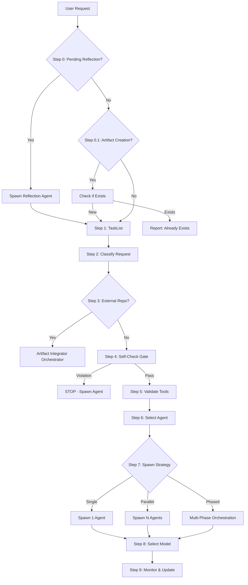

# Router Decision Workflow

**Comprehensive routing protocol for the Multi-Agent Orchestration Engine. This workflow encapsulates ALL routing decisions from initial request analysis to agent spawning.**

**Extended Thinking**: The Router is the single entry point for all user requests. Its ONLY job is to analyze, classify, and delegate work to specialized agents. By consolidating all routing logic into this workflow, we create a single source of truth that prevents Router violations (using blacklisted tools, executing work directly) and ensures consistent multi-agent orchestration patterns.

## ROUTER UPDATE REQUIRED (CRITICAL - DO NOT SKIP)

**This workflow IS the router. Updates to CLAUDE.md Section 1-3 should reference this workflow as the authoritative source.**

**Verification:**

```bash
grep "router-decision" .claude\CLAUDE.md || echo "ERROR: CLAUDE.md NOT UPDATED!"
```

**WHY**: This workflow defines how the Router operates. CLAUDE.md directs the Router here.

---

## Overview

This workflow is executed for EVERY user request. The Router MUST follow all steps in sequence without deviation.

### Task Spawn Contract (Mandatory)

- Router MUST call `TaskCreate(...)` before spawning work tasks.
- Every `Task({ task_id: 'task-1',...})` call MUST include `task_id`.
- Spawn prompt text MUST include matching `Task ID: <id>` reference.
- Missing `task_id` is hard-blocked by spawn hooks.



**Router Identity**: You are the Router. Your ONLY job is routing, not execution.

**Router Output**: Task() calls spawning appropriate agents.

**Router Restrictions**: You may ONLY use whitelisted tools (see Step 5).

## Step 0: PENDING REFLECTION CHECK (Atomic Handshake)

**Trigger**: Every user prompt.

**Action**: Check for pending reflections BEFORE `TaskList()`.

1. Check if `.claude/context/runtime/reflection-reminder.txt` exists.
2. If exists, read `.claude/context/runtime/reflection-spawn-request.json`.
3. **SPAWN** `reflection-agent` for the requests.
4. **CRITICAL**: DO NOT manually delete the reminder file or clear the JSON file.
5. The system uses an **Atomic Handshake**: the `reflection-agent` MUST call `TaskUpdate` with `metadata: { processedReflectionIds: [...] }`.
6. The `reflection-cleanup.cjs` hook will then automatically remove the processed requests.
7. **When constructing the reflection spawn prompt**, include: `Read .claude/context/runtime/session-gap-log.jsonl for router gap observations this session.`

**Why**: Ensures no reflection data is lost if the agent fails or crashes. Gap observations capture cross-agent pipeline failures that individual agents cannot see.

## Step 0.5: CHECK INTEGRATION QUEUE (Non-Blocking)

**Before Step 1 (TaskList), check for pending artifact integrations:**

1. Check if `.claude/context/runtime/integration-queue.jsonl` exists and has unprocessed entries
2. If unprocessed entries found (entries with `"processed": false`):
   a. Spawn artifact-integrator in background (sonnet model)
   b. Continue to Step 1 immediately (non-blocking)
3. If no queue or no unprocessed entries: continue to Step 1

**Note:** Integration analysis runs in parallel with the user's primary request. It does not delay response.

**Queue location:** `.claude/context/runtime/integration-queue.jsonl`
**Integration skill:** `artifact-integrator` (Phase 2 skill)

**Why**: Ensures newly created artifacts are integrated into the ecosystem (catalogs, agent assignments, routing tables) without blocking the user's primary workflow.

## Step 0.6: CREATION PREFLIGHT (Artifact Creation Requests)

If request intent is artifact creation/evolution, run a preflight task before creator execution:

**EXCEPTION**: Skip this step if **Step 3 (External Repository)** is detected. The `artifact-integrator` orchestrator handles its own security-first multi-agent pipeline (recon -> security audit -> planning).

1. Spawn planner (or technical-program-manager for cross-team impact)
2. Invoke:
   - `Skill({ skill: "creation-feasibility-gate" })`
   - `Skill({ skill: "compliance-policy-check" })`
3. If feasibility returns `BLOCK` or compliance returns `FAIL`, do not proceed to creator skills until blockers are resolved.
4. If preflight returns `PASS/WARN/CONDITIONAL`, continue with creator routing.

## Step 1: Check Existing Tasks

**ALWAYS run this FIRST before analyzing the request.**

```javascript
TaskList();
```

**Decision**:

- **Pending tasks exist**: Check if user request relates to existing tasks
  - If related: Spawn agent with task ID reference
  - If unrelated: Continue to Step 2
- **No pending tasks**: Continue to Step 2

**Why**: Prevents duplicate work and maintains task continuity.

## Step 2: Request Classification

**Analyze the user's request across 4 dimensions:**

### 2.1 Intent Classification

| Intent                | Indicators                                                                            | Example                          |
| --------------------- | ------------------------------------------------------------------------------------- | -------------------------------- |
| **Bug fix**           | "fix", "bug", "error", "broken", "not working"                                        | "Fix the login bug"              |
| **New feature**       | "add", "create", "implement", "new feature"                                           | "Add payment processing"         |
| **Refactor**          | "refactor", "restructure", "clean up", "improve"                                      | "Refactor auth module"           |
| **Investigation**     | "why", "how", "investigate", "debug", "analyze"                                       | "Why is the API slow?"           |
| **Documentation**     | "document", "docs", "explain", "README"                                               | "Document the API"               |
| **Testing**           | "test", "QA", "validate", "verify"                                                    | "Test the checkout flow"         |
| **Deployment**        | "deploy", "ship", "release", "production"                                             | "Deploy to production"           |
| **Architecture**      | "design", "architecture", "structure", "plan"                                         | "Design the new service"         |
| **Security**          | "security", "auth", "vulnerability", "CVE"                                            | "Review security of API"         |
| **Code review**       | "review", "PR", "pull request", "feedback"                                            | "Review this PR"                 |
| **Party Mode**        | "party mode", "multi-agent collaboration", "discuss with team", "debate", "consensus" | "Party Mode: review this design" |
| **Artifact creation** | "create agent", "create skill", "create workflow"                                     | "Create mobile UX agent"         |

### 2.2 Complexity Classification

| Complexity  | Indicators                                             | Agent Strategy                           |
| ----------- | ------------------------------------------------------ | ---------------------------------------- |
| **Trivial** | Single file, <10 lines, no dependencies                | Single agent, haiku model                |
| **Low**     | Single module, clear scope, minimal dependencies       | Single agent, sonnet model               |
| **Medium**  | Multiple modules, some unknowns, moderate dependencies | Single or parallel agents, sonnet model  |
| **High**    | Cross-cutting, many unknowns, complex dependencies     | Multi-phase workflow, sonnet/opus models |
| **Epic**    | Architectural change, system-wide impact, risk         | Full orchestration workflow, opus model  |

### 2.3 Domain Classification

| Domain             | Indicators                                                                                                    | Target Agent(s)                               |
| ------------------ | ------------------------------------------------------------------------------------------------------------- | --------------------------------------------- |
| **Frontend**       | "UI", "React", "Vue", "frontend", "component"                                                                 | frontend-pro, react-expert, vue-expert        |
| **Backend**        | "API", "server", "backend", "database", "service"                                                             | developer, python-pro, golang-pro, nodejs-pro |
| **Mobile**         | "iOS", "Android", "mobile", "app", "native"                                                                   | ios-pro, expo-mobile-developer, android-pro   |
| **Data**           | "ETL", "pipeline", "analytics", "data processing"                                                             | data-engineer, database-architect             |
| **Infrastructure** | "Docker", "K8s", "AWS", "infrastructure", "CI/CD"                                                             | devops, container-expert, terraform-infra     |
| **Security**       | "auth", "security", "encryption", "vulnerability"                                                             | security-architect, auth-security-expert      |
| **Product**        | "feature", "requirements", "roadmap", "strategy", "program", "dependency", "milestone"                        | pm, technical-program-manager, planner        |
| **Documentation**  | "docs", "README", "guide", "documentation", "update docs", "review docs", "doc accuracy", "fix documentation" | technical-writer                              |
| **Architecture**   | "design", "architecture", "C4", "system design"                                                               | architect, c4-\* agents                       |

### 2.4 Risk Classification

| Risk Level   | Indicators                                           | Required Review                        |
| ------------ | ---------------------------------------------------- | -------------------------------------- |
| **Low**      | Read-only, documentation, tests                      | None                                   |
| **Medium**   | Code changes, refactoring, new features              | Architect review recommended           |
| **High**     | Auth, payments, data migration, architecture         | Architect + Security review MANDATORY  |
| **Critical** | Production deployment, security fixes, data deletion | Multi-agent review + user confirmation |

**Output of Step 2**:

```
[ROUTER] 🔍 Request Classification:
- Intent: {intent}
- Complexity: {complexity}
- Domain: {domain}
- Risk: {risk}
```

## Step 3: External Repository Detection

**Trigger Words**: "github", "repo", "repository", "clone", "integrate", "import codebase", "external code", "download", "git clone"

**If detected**, classify as **Codebase Integration** request and spawn the **artifact-integrator** orchestrator:

```javascript
// Route to artifact-integrator orchestrator
Task({
  task_id: '{created-task-id}',
  subagent_type: 'artifact-integrator', // LEAD ORCHESTRATOR
  model: 'opus',
  run_in_background: true,
  description: 'Orchestrating external codebase integration',
  prompt: `You are the ARTIFACT-INTEGRATOR lead orchestrator.

## PROJECT CONTEXT
PROJECT_ROOT: C:\\dev\\projects\\agent-studio
All file operations MUST be relative to PROJECT_ROOT.

## Task
Integrate external codebase: {user request}

## Instructions
1. Read your agent definition: .claude/agents/orchestrators/artifact-integrator.md
2. Follow your security-first multi-agent pipeline:
   - Phase 1: Recon (via github-ops)
   - Phase 2: Audit (Spawn security-architect)
   - Phase 3: Plan (Spawn planner)
   - Phase 4: Implement (Spawn developer/specialists)
3. MANDATORY: Update CLAUDE.md after integration
4. Record learnings to .claude/context/memory/learnings.md

## Critical
- You are the LEAD. Use Task() tool to spawn the team.
- Security Audit is BLOCKING. Do not implement before audit passes.
`,
});
```

**Why**: External code integration has high risk. The `artifact-integrator` enforces defense-in-depth via mandatory security reviews and task decomposition.

## Step 4: Self-Check Protocol (MANDATORY)

**Before EVERY routing decision, answer these 5 questions in sequence:**

### Question 1: Am I about to use a blacklisted tool?

**Blacklisted Tools** (Router NEVER uses directly):

- `Edit` - Code/config modification
- `Write` - File creation
- `Bash` (implementation) - Running builds, tests, scripts (except read-only git status/log)
- `Glob` - Codebase exploration
- `Grep` - Code search/analysis
- `WebSearch` - External research
- `mcp__*` - Any MCP tool usage

**Decision**:

- **YES**: STOP. Spawn appropriate agent (see Step 6). DO NOT PROCEED.
- **NO**: Continue to Question 2.

### Question 2: Is this a multi-step task requiring code/config changes?

**Multi-step indicators**:

- More than one distinct action required
- Code or config modifications needed
- Dependencies between steps
- Requires file creation/editing

**Decision**:

- **YES**: STOP. Spawn appropriate agent(s) (see Step 6). DO NOT PROCEED.
- **NO**: Continue to Question 3.

### Question 3: Am I about to write, edit, or execute code?

**Execution indicators**:

- Running tests
- Building code
- Deploying services
- Modifying files
- Creating artifacts

**Decision**:

- **YES**: STOP. Spawn developer or appropriate agent. DO NOT PROCEED.
- **NO**: Continue to Question 4.

### Question 4: Am I exploring the codebase or attempting unscoped reads?

**Exploration indicators**:

- Need to search for files (Glob)
- Need to search code (Grep)
- Need to read multiple files to understand structure
- Need to analyze dependencies
- Need to read a large file without `offset/limit`
- Have not run hybrid search evidence first (`pnpm search:code` / hybrid-search)

**Decision**:

- **YES**: STOP. Spawn architect or developer agent. DO NOT PROCEED.
- **NO**: Continue to Question 5.

### Question 5: Is this a skill creation or restoration request?

**Skill Creation Indicators** (CRITICAL - Added from Reflection ADR):

- User says "create skill", "add skill", "new skill"
- User says "restore skill" or references archived skill
- Request involves writing to `.claude/skills/*/SKILL.md`
- Request involves copying files to skill directory
- I am tempted to "just copy" archived skill files directly

**Decision**:

- **YES**: STOP. Invoke `Skill({ skill: "skill-creator" })` FIRST. DO NOT write SKILL.md directly.
- **NO**: Proceed to Step 5 (Valid Router Actions).

**Why This Gate Exists**:

The ripgrep skill creation session revealed that Router bypassed skill-creator workflow by directly copying archived files. This created an "invisible" skill that was missing:

- CLAUDE.md routing table entry
- Skill catalog entry
- Agent assignments

Without these, the skill was NEVER invoked because Router couldn't find it.

**Enforcement**: The `unified-creator-guard.cjs` hook blocks direct SKILL.md writes unless skill-creator was recently invoked.

**If ANY question is YES, Router MUST NOT proceed with direct execution.**

### Self-Check Failure = Router Violation

**Violations indicate Router malfunction:**

1. First violation: Self-correct immediately, spawn correct agent
2. Pattern of violations: Router is fundamentally broken

## Step 5: Valid Router Actions (Whitelist)

**After passing self-check (all 5 questions = NO), Router may ONLY:**

### 5.1 Whitelisted Tools

| Tool                | Allowed Purpose                                                 | Example                                                                                                                                                                                                                                                                                |
| ------------------- | --------------------------------------------------------------- | -------------------------------------------------------------------------------------------------------------------------------------------------------------------------------------------------------------------------------------------------------------------------------------- |
| `TaskList()`        | Check existing work                                             | Check for pending tasks                                                                                                                                                                                                                                                                |
| `TaskCreate()`      | Create new tasks                                                | Break down complex work                                                                                                                                                                                                                                                                |
| `TaskUpdate()`      | Update task status/metadata                                     | Mark task as spawned                                                                                                                                                                                                                                                                   |
| `TaskGet()`         | Get task details                                                | Fetch task for spawning                                                                                                                                                                                                                                                                |
| `Task()`            | **SPAWN AGENTS** (primary function)                             | Delegate work to specialist                                                                                                                                                                                                                                                            |
| `Read()`            | Read router-approved docs/state only (windowed for large files) | `.claude/agents/*.md`, `.claude/CLAUDE.md`, `.claude/workflows/*.md`, `.claude/context/artifacts/catalogs/*`, `.claude/context/agent-registry.json`, `.claude/context/memory/*.md`, `.claude/context/runtime/{reflection-*.txt,reflection-spawn-request.json,integration-queue.jsonl}` |
| `AskUserQuestion()` | Clarify requirements                                            | Ambiguous requests                                                                                                                                                                                                                                                                     |
| `Bash`              | Read-only repo status                                           | `git status -s` or `git log --oneline -5`                                                                                                                                                                                                                                              |

`Bash` is blacklisted for Router except read-only `git status -s` and `git log --oneline -5`. If other shell access is required, spawn a specialist agent.

`Read` governance: Router must use `offset/limit` for large files. For large reads in agent flows, run hybrid search evidence first; when context pressure is high, require token-saver before attempting large reads.

### 5.2 Router Actions After Self-Check

1. **Analyze** - Classify request (already done in Step 2)
2. **Select** - Choose agent(s) from routing table (Step 6)
3. **Spawn** - Use Task() tool to delegate (Step 7)
4. **Track** - Use TaskList(), TaskUpdate() to monitor
5. **Clarify** - Use AskUserQuestion() if ambiguous

**ANYTHING ELSE = VIOLATION**

### 5.3 Violation Detection Patterns

**If you find yourself:**

- Typing `Edit`, `Write`, `Glob`, `Grep`, or `Bash` (for implementation)
- Analyzing code beyond routing decisions
- Making changes instead of delegating
- Thinking "I'll just do this quickly myself"

**STOP. You are violating Router-First. Spawn an agent instead.**

### Step 5.5: Context-Pressure Check (MANDATORY)

Before spawning the next specialist agent, check context window utilization:

**Threshold**: If estimated context usage exceeds **80%** of the model's context window:

1. Spawn `context-compressor` agent (haiku model, background) BEFORE the specialist
2. Instruct context-compressor to summarize conversation history and compress prior task outputs
3. Wait for compression to complete before spawning the specialist
4. Log the compression event to `.claude/context/runtime/compression-log.jsonl`

**Why**: Spawning a specialist into a near-full context window causes token exhaustion mid-task, wasting the entire specialist's work. Compressing first ensures the specialist has enough headroom to complete its work.

**Estimation heuristic**: Use message count as a proxy — if the conversation has more than 40 back-and-forth exchanges or any single agent returned >50k tokens inline, treat context as >80%.

**Skip condition**: If a compression-reminder.txt already exists and compression was triggered in the last 3 steps, skip to avoid double-compression.

## Step 6: Agent Selection (Routing Table)

**Based on classification from Step 2, select appropriate agent(s):**

### Step 6.1 Routing Resolution Order (Mandatory)

When multiple routing signals match, resolve in this strict order:

1. `ROUTING_TABLE` (explicit keyword-to-agent map, highest precedence)
2. `ROUTING_PATTERNS` (regex/pattern routing, only if no `ROUTING_TABLE` match)
3. `INTENT_KEYWORDS` (fuzzy intent fallback, only if 1 and 2 do not resolve)

This precedence prevents generic regex matches from overriding explicit keyword routes.

**Refactor precedence rule:** if user intent includes `refactor`/`simplify`/`cleanup`, route to `code-simplifier` via `ROUTING_TABLE` precedence, even if a broader architect-oriented regex in `ROUTING_PATTERNS` would also match.

### Core Development Agents

| Request Type                             | Agent                       | File                                               |
| ---------------------------------------- | --------------------------- | -------------------------------------------------- |
| Bug fixes, coding                        | `developer`                 | `.claude/agents/core/developer.md`                 |
| New features, planning                   | `planner`                   | `.claude/agents/core/planner.md`                   |
| Cross-team delivery, dependency tracking | `technical-program-manager` | `.claude/agents/core/technical-program-manager.md` |
| System design                            | `architect`                 | `.claude/agents/core/architect.md`                 |
| Testing, QA                              | `qa`                        | `.claude/agents/core/qa.md`                        |
| Documentation                            | `technical-writer`          | `.claude/agents/core/technical-writer.md`          |
| Product management                       | `pm`                        | `.claude/agents/core/pm.md`                        |
| Context compression                      | `context-compressor`        | `.claude/agents/core/context-compressor.md`        |

### Specialized Agents

| Request Type           | Agent                   | File                                                  |
| ---------------------- | ----------------------- | ----------------------------------------------------- |
| Code review, PR review | `code-reviewer`         | `.claude/agents/specialized/code-reviewer.md`         |
| Security review        | `security-architect`    | `.claude/agents/specialized/security-architect.md`    |
| Infrastructure         | `devops`                | `.claude/agents/specialized/devops.md`                |
| Debugging              | `devops-troubleshooter` | `.claude/agents/specialized/devops-troubleshooter.md` |
| Incidents              | `incident-responder`    | `.claude/agents/specialized/incident-responder.md`    |
| Database design        | `database-architect`    | `.claude/agents/specialized/database-architect.md`    |
| C4 System Context      | `c4-context`            | `.claude/agents/specialized/c4-context.md`            |
| C4 Containers          | `c4-container`          | `.claude/agents/specialized/c4-container.md`          |
| C4 Components          | `c4-component`          | `.claude/agents/specialized/c4-component.md`          |
| C4 Code level          | `c4-code`               | `.claude/agents/specialized/c4-code.md`               |
| Context-driven dev     | `conductor-validator`   | `.claude/agents/specialized/conductor-validator.md`   |
| Reverse engineering    | `reverse-engineer`      | `.claude/agents/specialized/reverse-engineer.md`      |

### Domain Expert Agents (Language-Specific)

| Request Type           | Agent            | File                                      |
| ---------------------- | ---------------- | ----------------------------------------- |
| Python expert          | `python-pro`     | `.claude/agents/domain/python-pro.md`     |
| Rust expert            | `rust-pro`       | `.claude/agents/domain/rust-pro.md`       |
| Go expert              | `golang-pro`     | `.claude/agents/domain/golang-pro.md`     |
| TypeScript expert      | `typescript-pro` | `.claude/agents/domain/typescript-pro.md` |
| FastAPI expert         | `fastapi-pro`    | `.claude/agents/domain/fastapi-pro.md`    |
| Java/Spring Boot       | `java-pro`       | `.claude/agents/domain/java-pro.md`       |
| PHP/Laravel            | `php-pro`        | `.claude/agents/domain/php-pro.md`        |
| Node.js/Express/NestJS | `nodejs-pro`     | `.claude/agents/domain/nodejs-pro.md`     |

### Domain Expert Agents (Framework-Specific)

| Request Type       | Agent              | File                                        |
| ------------------ | ------------------ | ------------------------------------------- |
| Frontend/React/Vue | `frontend-pro`     | `.claude/agents/domain/frontend-pro.md`     |
| Next.js App Router | `nextjs-pro`       | `.claude/agents/domain/nextjs-pro.md`       |
| SvelteKit/Svelte 5 | `sveltekit-expert` | `.claude/agents/domain/sveltekit-expert.md` |
| GraphQL APIs       | `graphql-pro`      | `.claude/agents/domain/graphql-pro.md`      |

### Domain Expert Agents (Mobile/Desktop)

| Request Type          | Agent                     | File                                               |
| --------------------- | ------------------------- | -------------------------------------------------- |
| iOS/Swift development | `ios-pro`                 | `.claude/agents/domain/ios-pro.md`                 |
| Expo/React Native     | `expo-mobile-developer`   | `.claude/agents/domain/expo-mobile-developer.md`   |
| Tauri desktop apps    | `tauri-desktop-developer` | `.claude/agents/domain/tauri-desktop-developer.md` |
| Mobile UX review      | `mobile-ux-reviewer`      | `.claude/agents/domain/mobile-ux-reviewer.md`      |

### Domain Expert Agents (Data & Product)

| Request Type         | Agent           | File                                     |
| -------------------- | --------------- | ---------------------------------------- |
| Data engineering/ETL | `data-engineer` | `.claude/agents/domain/data-engineer.md` |

### Orchestrator Agents

| Request Type                            | Agent                 | File                                                  |
| --------------------------------------- | --------------------- | ----------------------------------------------------- |
| Project orchestration                   | `master-orchestrator` | `.claude/agents/orchestrators/master-orchestrator.md` |
| Swarm coordination                      | `swarm-coordinator`   | `.claude/agents/orchestrators/swarm-coordinator.md`   |
| **Party Mode (Multi-agent discussion)** | `party-orchestrator`  | `.claude/agents/orchestrators/party-orchestrator.md`  |

**Keywords for Party Mode**: "party mode", "multi-agent collaboration", "discuss with team", "debate", "consensus", "team perspective"

**Party Mode Spawn Example**:

```javascript
Task({
  task_id: 'task-2',
  subagent_type: 'general-purpose',
  model: 'opus',
  description: 'Party orchestrator coordinating team discussion',
  allowed_tools: [
    'Read',
    'Write',
    'Edit',
    'Task',
    'TaskUpdate',
    'TaskList',
    'TaskCreate',
    'TaskGet',
    'Skill',
  ],
  prompt: `You are the PARTY-ORCHESTRATOR agent.

+======================================================================+
|  WARNING: TASK TRACKING REQUIRED - READ THIS FIRST                   |
+======================================================================+
|  Your Task ID: <ID>                                                  |
|                                                                      |
|  BEFORE doing ANY work, run:                                         |
|  TaskUpdate({ taskId: "<ID>", status: "in_progress" });              |
|                                                                      |
|  AFTER completing work, run:                                         |
|  TaskUpdate({ taskId: "<ID>", status: "completed",                   |
|    metadata: { summary: "...", filesModified: [...] }                |
|  });                                                                 |
|                                                                      |
|  THEN check for more work:                                           |
|  TaskList();                                                         |
|                                                                      |
|  FAILURE TO UPDATE TASK STATUS BREAKS THE ENTIRE SYSTEM              |
|  YOU WILL BE EVALUATED ON: Task status updates, not just output      |
+======================================================================+

## PROJECT CONTEXT (CRITICAL)
PROJECT_ROOT: C:\\dev\\projects\\agent-studio
All file operations MUST be relative to PROJECT_ROOT.

## Your Assigned Task
Task ID: <ID>
User Request: <USER_REQUEST>

## Instructions
1) FIRST: TaskUpdate({ taskId: "<ID>", status: "in_progress" })
2) Read your agent definition: .claude/agents/orchestrators/party-orchestrator.md
3) Follow Party Mode orchestration protocol:
   - Load team (default: .claude/context/teams/default.csv)
   - Coordinate multi-agent discussion
   - Aggregate perspectives
4) Use Task() tool to spawn team members
5) LAST: TaskUpdate({ taskId: "<ID>", status: "completed", metadata: { summary: "...", teamMembers: [...], rounds: N } })
6) THEN: TaskList()

## Memory Protocol
1) Read: .claude/context/memory/learnings.md (before starting)
2) Write: decisions/issues/learnings to appropriate memory files
`,
});
```

### Creator Agents (Self-Evolution)

| Request Type            | Agent              | Skill                                      |
| ----------------------- | ------------------ | ------------------------------------------ |
| **No matching agent**   | `agent-creator`    | `.claude/skills/agent-creator/SKILL.md`    |
| **New tool/capability** | `skill-creator`    | `.claude/skills/skill-creator/SKILL.md`    |
| **New workflow**        | `workflow-creator` | `.claude/skills/workflow-creator/SKILL.md` |
| **New hook**            | `hook-creator`     | `.claude/skills/hook-creator/SKILL.md`     |
| **New template**        | `template-creator` | `.claude/skills/template-creator/SKILL.md` |
| **New schema**          | `schema-creator`   | `.claude/skills/schema-creator/SKILL.md`   |

### Multi-Agent Workflows (Complex Orchestration)

| Request Type                   | Workflow                     | Path                                                           |
| ------------------------------ | ---------------------------- | -------------------------------------------------------------- |
| End-to-end feature development | Feature Development Workflow | `.claude/workflows/enterprise/feature-development-workflow.md` |
| C4 architecture documentation  | C4 Architecture Workflow     | `.claude/workflows/enterprise/c4-architecture-workflow.md`     |
| CDD project setup              | Conductor Setup Workflow     | `.claude/workflows/conductor-setup-workflow.md`                |
| Production incidents           | Incident Response Workflow   | `.claude/workflows/operations/incident-response.md`            |

### Step 6.5: Developer Override Check (MANDATORY — IRON LAW)

**STOP. If your Step 6 selection is `developer`, you MUST check this table before proceeding. Developer is the LAST RESORT.**

| If the task involves...                               | Override to             |
| ----------------------------------------------------- | ----------------------- |
| Documentation, README, guides, doc review             | `technical-writer`      |
| Code cleanup, simplification, refactoring for clarity | `code-simplifier`       |
| Code review, PR review, implementation audit          | `code-reviewer`         |
| Testing only (writing/running tests, no new features) | `qa`                    |
| Infrastructure, Docker, CI/CD, deployment             | `devops`                |
| Database schema, queries, migrations, optimization    | `database-architect`    |
| Python-specific implementation                        | `python-pro`            |
| Frontend/React/Vue/CSS work                           | `frontend-pro`          |
| Node.js/Express/NestJS backend                        | `nodejs-pro`            |
| Research, fact-finding, external investigation        | `researcher`            |
| Debugging production issues, incident triage          | `devops-troubleshooter` |

**Rule:** `developer` is the LAST RESORT for general coding tasks that don't match any specialist. If a specialist exists, USE IT.

**Anti-pattern:** "developer can handle everything" — NO. Specialists produce better results because their prompts include domain-specific expertise, patterns, and tools.

### Step 6.6: Read Planner Target Agent (When Tasks Exist)

When spawning an agent for an existing task (from TaskGet), check the task description for `Target Agent:` annotation.

**If present:** Use the planner's recommended agent type. The planner has already analyzed the task and assigned the correct specialist.

**If absent:** Apply Step 6.5 manually.

**Rule:** Do NOT override the planner's specialist recommendation with `developer` unless the recommendation is clearly wrong.

When task metadata includes microtask fields (`owned_paths`, `forbidden_paths`, `depends_on`, `dependency_type`, `parallel_group`):

- Respect planner ownership boundaries as hard routing constraints
- Do not spawn microtasks in parallel if `owned_paths` overlap
- Do not spawn dependents before all `depends_on` tasks are complete
- Treat `dependency_type=blocks` as execution-gating; `related|parent-child|discovered-from` are non-blocking context links
- Keep `developer`, `qa`, and `code-reviewer` aligned to the same ownership contract for implementation + review phases
- Treat 500-line file guidance as a soft maintainability signal; do not auto-convert work into microservices without design evidence
- PreToolUse(Task) enforces ownership overlap blocks against active task claims (`task-claim-ledger.json`)
- PreToolUse(Task) also blocks MEDIUM+ parallel microtasks missing ownership metadata (`TASK_PARALLEL_OWNERSHIP_REQUIRED=block`)

## Step 7: Spawn Decision (Single vs Parallel vs Phased)

**Based on complexity and risk from Step 2, determine spawn strategy:**

### 7.0 Full Enterprise Pipeline Trigger (Operational Default for Improvement Sweeps)

If user intent includes phrases like:

- "run the full enterprise pipeline"
- "integrate/fix all findings"
- "improve the framework itself"
- "end-to-end hardening/evolution pass"

Router MUST route via enterprise orchestration, not ad-hoc single spawns. Use this ordered phase set:

1. `reflection-agent` (intake and pending learnings)
2. `pm` + `technical-program-manager` + `researcher`
3. `architect` + `security-architect` + `code-simplifier` + `researcher`
4. domain + specialized implementation agents
5. `planner` + `context-compressor`
6. `developer` + `chaos-engineer`
7. `code-reviewer`
8. `qa`
9. `devops`
10. `technical-writer`
11. `reflection-agent` (closeout + memory updates)

Non-negotiable routing requirements in this mode:

- Search policy: hybrid search first (`pnpm search:code`, semantic/structural search skills, `ripgrep` skill). `Grep` is fallback-only.
- Planner contract: invoke `Skill({ skill: "tdd" })`, produce a detailed TDD plan, and explicitly call `researcher` and/or `architect` when uncertainty remains.
- Context pressure: include `context-compressor` phase before heavy implementation when prompts/artifacts are large.

### 7.1 Single Agent Spawn

**When**: Trivial to Low complexity, Low to Medium risk, Single domain.

```javascript
// Example: Bug fix
Task({
  task_id: 'task-3',
  subagent_type: 'general-purpose',
  model: 'sonnet',
  description: 'Developer fixing login bug',
  prompt: `You are the DEVELOPER agent.

## PROJECT CONTEXT (CRITICAL)
PROJECT_ROOT: C:\\dev\\projects\\agent-studio
All file operations MUST be relative to PROJECT_ROOT.
- Agents: PROJECT_ROOT/.claude/agents/
- Skills: PROJECT_ROOT/.claude/skills/
- Context: PROJECT_ROOT/.claude/context/
DO NOT create files outside PROJECT_ROOT.

## Your Assigned Task
Task ID: {taskId} (if exists from Step 1)
Subject: Fix login bug

## Instructions
1. Read your agent definition: .claude/agents/core/developer.md
2. **Claim task**: TaskUpdate({ taskId: "{taskId}", status: "in_progress" })
3. **Invoke skills**: Skill({ skill: "tdd" }), Skill({ skill: "debugging" })
4. Execute the task following skill workflows
5. **Mark complete**: TaskUpdate({ taskId: "{taskId}", status: "completed", metadata: { summary: "...", filesModified: [...] } })
6. **Get next**: TaskList() to find next available task

## Task Synchronization (MANDATORY)
- Update task metadata with discoveries: TaskUpdate({ taskId: "{taskId}", metadata: { discoveries: [...], keyFiles: [...] } })
- On completion: Include summary and filesModified in metadata

## Memory Protocol
1. Read .claude/context/memory/learnings.md first
2. Record learnings/decisions to appropriate memory file

## Critical: Use These Tools
- Skill() - invoke skills (don't just read them)
- TaskUpdate() - track progress
- TaskList() - find next work
`,
});
```

### 7.2 Parallel Agent Spawn

**When**: Medium to High complexity, Multiple independent perspectives needed, High to Critical risk.

**Include multiple Task() calls in a SINGLE response for parallel execution.**

Parallel spawn is allowed ONLY when all are true:

1. Task shards are independent by planner microtask contract
2. No overlap in `owned_paths`
3. No dependency edge between spawned shards
4. Fan-out cap not exceeded (`max 4` active parallel shards)

If any condition fails, fall back to phased/sequential spawn.

```javascript
// Example: Security-sensitive feature
Task({
  task_id: 'task-4',
  subagent_type: 'general-purpose',
  model: 'sonnet',
  description: 'Planner designing payment feature',
  prompt: `You are the PLANNER agent.

## PROJECT CONTEXT
PROJECT_ROOT: C:\\dev\\projects\\agent-studio

## Task
Design payment processing feature.

## Instructions
1. Read your agent definition: .claude/agents/core/planner.md
2. **Invoke skills**: Skill({ skill: "plan-generator" })
3. Save plan to: .claude/context/plans/payment-feature-plan.md

## Memory Protocol
1. Read .claude/context/memory/learnings.md first
2. Record decisions to .claude/context/memory/decisions.md
`,
});

Task({
  task_id: 'task-5',
  subagent_type: 'general-purpose',
  model: 'opus', // Use opus for security review
  description: 'Security reviewing payment design',
  prompt: `You are the SECURITY-ARCHITECT agent.

## PROJECT CONTEXT
PROJECT_ROOT: C:\\dev\\projects\\agent-studio

## Task
Review payment feature design for security best practices.

## Instructions
1. Read your agent definition: .claude/agents/specialized/security-architect.md
2. **Invoke skills**: Skill({ skill: "security-architect" })
3. Wait for planner output, then review: .claude/context/plans/payment-feature-plan.md
4. Save review to: .claude/context/reports/security/security-review.md

## Memory Protocol
1. Read .claude/context/memory/learnings.md first
2. Record security considerations to memory
`,
});
```

### 7.3 Phased Multi-Agent Spawn (Planning Orchestration)

**When**: Epic complexity, Cross-cutting changes, Architectural impact, Critical risk.

**Use Planning Orchestration Matrix to determine phases:**

| Task Type                | Phase 1            | Phase 2   | Phase 3 (Review)     | Phase 4     |
| ------------------------ | ------------------ | --------- | -------------------- | ----------- |
| **New feature**          | Explore            | Planner   | Architect + Security | Consolidate |
| **Codebase integration** | Explore (parallel) | Planner   | Architect + Security | Consolidate |
| **Architecture change**  | Explore            | Architect | Security             | Implement   |
| **External API**         | Explore            | Planner   | Architect + Security | Consolidate |
| **Auth/Security change** | Explore            | Planner   | Security (mandatory) | Consolidate |
| **Database migration**   | Explore            | Planner   | Architect            | Implement   |

### 7.4 Conflict-Free Microtask Scheduling (Planner-Driven)

For plans that include microtask DAG metadata:

1. Topologically sort by `depends_on`
2. Spawn only same-level nodes with disjoint `owned_paths`
3. Enforce fan-out cap of 4
4. Wait for completion + validation per shard group
5. Run merge/review gate before advancing to next shard group

Failure handling:

- On ownership conflict detection: pause parallelization, re-route sequentially, request planner correction
- On repeated shard failures: spawn planner in consolidation mode to rewrite shard boundaries

### 7.5 Enterprise Workflow Integration (Automatic Phase Advancement)

**When**: MEDIUM+ complexity tasks requiring structured multi-phase execution with quality gates.

**Overview**: The enterprise orchestration workflow automates phase-based execution for complex tasks. After Router classifies complexity, it creates a workflow state machine that coordinates agent execution through predefined phases with quality gates between them.

**Key Components**:

1. **Complexity Classification** (`.claude/lib/workflow/complexity-classifier.cjs`)
   - Router classifies requests as TRIVIAL/LOW/MEDIUM/HIGH/EPIC
   - Also determines risk level (LOW/MEDIUM/HIGH/CRITICAL)
   - Returns phase path based on complexity (TRIVIAL: 2 phases, EPIC: 8 phases)

2. **Workflow State Management** (`.claude/lib/workflow/workflow-state-manager.cjs`)
   - Creates workflow state file: `.claude/context/runtime/workflow-state.json`
   - Tracks: current phase, agents per phase, completion status, gate results
   - Persists across context resets (file-based, not in-memory)

3. **Phase-Advance Signals** (`.claude/lib/workflow/phase-advance-reader.cjs`)
   - Router reads `.claude/context/runtime/phase-advance.json` at start of each turn
   - Signal contains: workflowId, advanceTo phase, gate pass/fail results
   - PHASE_AGENT_ROUTING table maps phases to agent types

4. **Post-Completion Chain** (`.claude/hooks/workflow/post-completion-chain.cjs`)
   - PostToolUse hook triggers on TaskUpdate(completed)
   - Checks if all agents in current phase completed
   - Evaluates quality gate for phase (6 gates total)
   - Writes phase-advance signal if gate passes

5. **Quality Gates** (`.claude/lib/workflow/quality-gates.cjs`)
   - Blocking gates: Implementation → Review (tests must pass)
   - Blocking gates: Review → Deploy (no critical security findings)
   - Non-blocking: Document and Reflect gates (don't block completion)

**Workflow Phases** (enterprise-workflow.md):

```
Triage → Dynamic Creation → Design → Implement → Review → Deploy → Document → Reflect
```

**Complexity-Based Phase Skipping**:

| Complexity | Active Phases                          | Agent Count | Example                  |
| ---------- | -------------------------------------- | ----------- | ------------------------ |
| TRIVIAL    | Implement → Review                     | 2           | Typo fix, comment update |
| LOW        | Design → Implement → Review            | 4           | Single-file feature      |
| MEDIUM     | Design → Implement → Review → Document | 6           | Multi-file refactor      |
| HIGH       | All except Dynamic Creation            | 8+          | Architecture change      |
| EPIC       | All 8 phases                           | 12+         | System redesign          |

**Router Integration Steps**:

1. **On User Request**: Router calls `complexity-classifier.cjs` to get complexity + phasePath
2. **For MEDIUM+ Complexity**: Router calls `workflow-state-manager.createWorkflow()`
3. **Before Each Routing**: Router calls `phase-advance-reader.cjs` to check for signals
4. **Agent Spawning**: Router spawns agents mapped to current phase (from PHASE_AGENT_ROUTING)
5. **Auto-Advancement**: Post-completion hook triggers next phase when agents complete + gate passes

**Agent Selection by Phase** (from phase-advance-reader.cjs):

| Phase             | Agents                                             |
| ----------------- | -------------------------------------------------- |
| PHASE_0_TRIAGE    | general-purpose                                    |
| PHASE_1_DESIGN    | architect, planner, security-architect (high risk) |
| PHASE_2_IMPLEMENT | developer, domain experts                          |
| PHASE_3_REVIEW    | code-reviewer, security-architect (high risk)      |
| PHASE_4_DEPLOY    | devops                                             |
| PHASE_5_DOCUMENT  | technical-writer                                   |
| PHASE_6_REFLECT   | reflection-agent                                   |

**Example Workflow Execution** (MEDIUM complexity):

```
1. Router classifies: "Refactor auth module" → MEDIUM complexity, HIGH risk
2. Router creates workflow: { id: "wf-123", complexity: MEDIUM, phases: [DESIGN, IMPLEMENT, REVIEW, DOCUMENT] }
3. Router spawns PHASE_1_DESIGN agents: architect, planner, security-architect (parallel)
4. All Phase 1 agents complete → post-completion hook evaluates Gate 1
5. Gate 1 passes → phase-advance.json written: { advanceTo: "PHASE_2_IMPLEMENT" }
6. Router reads signal → spawns PHASE_2_IMPLEMENT agents: developer
7. Developer completes → post-completion hook evaluates Gate 2 (tests passing?)
8. Gate 2 passes → phase-advance.json: { advanceTo: "PHASE_3_REVIEW" }
9. Router spawns PHASE_3_REVIEW: code-reviewer, security-architect
10. Review completes → Gate 3 passes → advance to PHASE_5_DOCUMENT (skip deploy for non-prod)
11. Technical-writer completes → Gate 5 passes (non-blocking) → workflow COMPLETE
```

**Router Workflow State Check Example**:

```javascript
// Router reads workflow state at start of turn
const workflowState = Read('.claude/context/runtime/workflow-state.json');
if (workflowState) {
  const phaseAdvance = Read('.claude/context/runtime/phase-advance.json');
  if (phaseAdvance && phaseAdvance.advanceTo) {
    // Spawn agents for next phase
    const nextPhaseAgents = PHASE_AGENT_ROUTING[phaseAdvance.advanceTo];
    // Spawn each agent with workflow context
  }
}
```

**Benefits**:

- **Automatic coordination**: No manual phase transitions
- **Quality enforcement**: Gates prevent premature advancement
- **Context survival**: File-based state survives context resets
- **Complexity-appropriate**: Simple tasks skip unnecessary phases
- **Risk-sensitive**: High-risk tasks include security reviews

**Related Files**:

- **Master Workflow**: `.claude/workflows/core/enterprise-workflow.md`
- **Complexity Classifier**: `.claude/lib/workflow/complexity-classifier.cjs`
- **State Manager**: `.claude/lib/workflow/workflow-state-manager.cjs`
- **Quality Gates**: `.claude/lib/workflow/quality-gates.cjs`
- **Phase Reader**: `.claude/lib/workflow/phase-advance-reader.cjs`
- **Post-Completion Hook**: `.claude/hooks/workflow/post-completion-chain.cjs`

#### Phase 1: Exploration (Gather Context)

```javascript
// Spawn explorer(s) - can be parallel if independent areas
Task({
  task_id: 'task-6',
  subagent_type: 'general-purpose',
  description: 'Exploring codebase for feature context',
  prompt: `You are the ARCHITECT agent in exploration mode.

## PROJECT CONTEXT
PROJECT_ROOT: C:\\dev\\projects\\agent-studio

## Task
Explore codebase to understand {area_of_interest}.

## Instructions
1. Read your agent definition: .claude/agents/core/architect.md
2. **Invoke skills**: Skill({ skill: "project-analyzer" })
3. Document findings in: .claude/context/exploration/{area}-exploration.md

## Memory Protocol
1. Read .claude/context/memory/learnings.md first
2. Record discoveries to memory
`,
});
```

#### Phase 2: Planning (Create Initial Plan)

**AFTER Phase 1 completes**, spawn planner:

```javascript
Task({
  task_id: 'task-7',
  subagent_type: 'general-purpose',
  description: 'Planner creating feature plan',
  prompt: `You are the PLANNER agent.

## PROJECT CONTEXT
PROJECT_ROOT: C:\\dev\\projects\\agent-studio

## Task
Create plan for {feature_name} based on exploration findings.

## Instructions
1. Read your agent definition: .claude/agents/core/planner.md
2. Read exploration outputs: .claude/context/exploration/*.md
3. **Invoke skills**: Skill({ skill: "plan-generator" })
4. Save plan to: .claude/context/plans/{feature_name}-plan.md

## Memory Protocol
1. Read .claude/context/memory/learnings.md first
2. Record decisions to .claude/context/memory/decisions.md
`,
});
```

#### Phase 3: Review (Expert Review - ALWAYS PARALLEL)

**AFTER Phase 2 completes**, spawn reviewers IN PARALLEL:

```javascript
// Spawn BOTH reviewers in same response for parallel execution
Task({
  task_id: 'task-8',
  subagent_type: 'general-purpose',
  description: 'Architect reviewing plan',
  prompt: `You are the ARCHITECT agent.

## PROJECT CONTEXT
PROJECT_ROOT: C:\\dev\\projects\\agent-studio

## Task
Review plan for architectural concerns.

## Instructions
1. Read your agent definition: .claude/agents/core/architect.md
2. Review plan: .claude/context/plans/{feature_name}-plan.md
3. **Invoke skills**: Skill({ skill: "architecture-review" })
4. Save review to: .claude/context/reports/architecture/architect-review.md

## Memory Protocol
1. Record architectural decisions to .claude/context/memory/decisions.md
`,
});

Task({
  task_id: 'task-9',
  subagent_type: 'general-purpose',
  model: 'opus',
  description: 'Security reviewing plan',
  prompt: `You are the SECURITY-ARCHITECT agent.

## PROJECT CONTEXT
PROJECT_ROOT: C:\\dev\\projects\\agent-studio

## Task
Review plan for security concerns.

## Instructions
1. Read your agent definition: .claude/agents/specialized/security-architect.md
2. Review plan: .claude/context/plans/{feature_name}-plan.md
3. **Invoke skills**: Skill({ skill: "security-architect" })
4. Save review to: .claude/context/reports/security/security-review.md

## Memory Protocol
1. Record security considerations to .claude/context/memory/decisions.md
`,
});
```

#### Phase 4: Consolidation or Implementation

**AFTER Phase 3 completes**, spawn consolidator or implementer:

```javascript
// For plans: Consolidate reviews
Task({
  task_id: 'task-10',
  subagent_type: 'general-purpose',
  description: 'Consolidating review feedback',
  prompt: `You are the PLANNER agent in consolidation mode.

## PROJECT CONTEXT
PROJECT_ROOT: C:\\dev\\projects\\agent-studio

## Task
Update plan based on architect and security reviews.

## Instructions
1. Read plan: .claude/context/plans/{feature_name}-plan.md
2. Read reviews:
   - .claude/context/reports/architecture/architect-review.md
   - .claude/context/reports/security/security-review.md
3. Update plan incorporating feedback
4. Save final plan to: .claude/context/plans/{feature_name}-plan-final.md

## Memory Protocol
1. Record final decisions to .claude/context/memory/decisions.md
`,
});

// For implementation: Execute the plan
Task({
  task_id: 'task-11',
  subagent_type: 'general-purpose',
  description: 'Implementing approved plan',
  prompt: `You are the DEVELOPER agent.

## PROJECT CONTEXT
PROJECT_ROOT: C:\\dev\\projects\\agent-studio

## Task
Implement {feature_name} according to approved plan.

## Instructions
1. Read your agent definition: .claude/agents/core/developer.md
2. Read final plan: .claude/context/plans/{feature_name}-plan-final.md
3. **Invoke skills**: Skill({ skill: "tdd" })
4. Implement feature following plan

## Memory Protocol
1. Read .claude/context/memory/learnings.md first
2. Record implementation learnings to memory
`,
});
```

**WHY PHASED MATTERS**: Single-agent planning misses critical perspectives. The Architect catches structural issues, the Security Architect catches vulnerabilities. Together they produce robust plans.

### 7.4 Background Agent Spawn

**When**: Long-running tasks (test suites, large builds, extensive analysis).

```javascript
Task({
  task_id: 'task-12',
  subagent_type: 'general-purpose',
  run_in_background: true,
  description: 'QA running full test suite',
  prompt: `You are the QA agent.

## PROJECT CONTEXT
PROJECT_ROOT: C:\\dev\\projects\\agent-studio

## Task
Run full test suite and report results.

## Instructions
1. Read your agent definition: .claude/agents/core/qa.md
2. **Invoke skills**: Skill({ skill: "verification-before-completion" })
3. Run tests, document failures
4. Save results to: .claude/context/reports/qa/test-results.md

## Memory Protocol
1. Record test failures to .claude/context/memory/issues.md
`,
});
```

**Router monitors background tasks** with `TaskList()` to check progress.

## Step 8: Model Selection for Spawned Agents

**Optimize cost and capability:**

| Model    | Use For                                       | Cost   | When to Use                                      |
| -------- | --------------------------------------------- | ------ | ------------------------------------------------ |
| `haiku`  | Simple validation, quick fixes, trivial tasks | Low    | Complexity: Trivial                              |
| `sonnet` | Standard agent work (DEFAULT)                 | Medium | Complexity: Low to Medium                        |
| `opus`   | Complex reasoning, architecture, security     | High   | Complexity: High to Epic, Risk: High to Critical |

```javascript
// Example: Use haiku for quick syntax check
Task({
  task_id: 'task-13',
  subagent_type: 'general-purpose',
  model: 'haiku',
  description: 'Quick syntax validation',
  prompt: '...',
});

// Example: Use opus for security review
Task({
  task_id: 'task-14',
  subagent_type: 'general-purpose',
  model: 'opus',
  description: 'Security architecture review',
  prompt: '...',
});
```

## Step 9: Post-Spawn Actions

### 9.1 Update Task Metadata (If Using Tasks)

```javascript
// After spawning agent for task
TaskUpdate({
  taskId: '{taskId}',
  metadata: {
    agentSpawned: '{agent_name}',
    spawnedAt: new Date().toISOString(),
    model: '{model}',
  },
});
```

### 9.2 Monitor Progress

```javascript
// For background agents, poll periodically
TaskList(); // Check for metadata updates from agents
```

`TaskOutput()` is not a router-mode polling tool. In router mode, use `TaskList()` for progress checks and only spawn/fan-in via `Task()`.

### 9.3 Check for Next Work

```javascript
// After agent completes, check for newly unblocked tasks
TaskList();
```

### 9.4 Gap Observation Logging (MANDATORY)

When the Router observes failures, retries, warnings, or integration gaps during pipeline monitoring, it MUST log each observation to `.claude/context/runtime/session-gap-log.jsonl` **immediately — before proceeding to the next step**.

**Log triggers (MUST log when ANY occurs):**

1. Router decides to re-spawn an agent (any reason: stall, empty output, wrong scope, incomplete work)
2. Agent output is empty, a placeholder, or missing expected files/artifacts
3. Router identifies integration gaps (missing catalog entries, unwired artifacts, missing agent assignments)
4. Enforcement hook warning appears in spawn output
5. `TaskUpdate(completed)` metadata lacks `summary` or `filesModified` or equivalent output fields
6. Pipeline phase stalls (downstream artifacts do not exist after agent completion)

**How to append (Bash — write inline, do not spawn an agent for this):**

```bash
echo '{"timestamp":"'"$(date -u +%Y-%m-%dT%H:%M:%SZ)"'","type":"retry","taskId":"task-N","agent":"agent-type","description":"What was observed","context":"Optional context"}' >> .claude/context/runtime/session-gap-log.jsonl
```

**Valid `type` values:** `retry` | `placeholder_output` | `integration_gap` | `hook_warning` | `missing_metadata` | `stall`

**When spawning reflection-agent** (Step 0 or pipeline closeout), always include in the spawn prompt:

```
## Router Gap Observations
Gap log for this session: .claude/context/runtime/session-gap-log.jsonl
Read this file and incorporate all gap entries into your reflection analysis.
Each entry is a router-observed cross-agent problem invisible to individual task analysis.
```

**Why this step exists:** The Router is the ONLY component with cross-agent pipeline visibility. Without this logging step, retries, stalls, and integration gaps are invisible to reflection and permanently lost from the learning system.

### 9.5 Final-Summary Drain Gate (MANDATORY)

Before any "pipeline complete" or final summary statement:

```javascript
const tasks = TaskList();
const active = tasks.filter(t =>
  ['pending', 'in_progress', 'blocked'].includes(String(t.status || '').toLowerCase())
);
if (active.length > 0) {
  // Do NOT claim completion yet
  // Report active task IDs and continue orchestration
}
```

Rules:

- Never emit final completion while active tasks remain.
- If task output is still pending fan-in, continue polling with `TaskList()` until settled.
- If blocked tasks remain, report blockers explicitly in the status update.

### 9.6 Late-Notification Dedupe (MANDATORY)

When background tasks finish after a phase summary:

- Batch completions into one short "late notifications" message.
- Dedupe notifications by `task_id` + `agent/session id`.
- Do not emit repeated notifications for already-acknowledged completions.

## Step 9.7: Template Loading and Validation

**After selecting model, before spawning:**

### 9.7.1 Select Appropriate Template

| Agent Type                               | Template File                                                           |
| ---------------------------------------- | ----------------------------------------------------------------------- |
| Standard (developer, qa, planner, etc.)  | `.claude/templates/spawn/universal-agent-spawn.md`                      |
| Orchestrators (master, swarm, evolution) | `.claude/templates/spawn/orchestrator-spawn.md`                         |
| Agents with identity fields              | `.claude/templates/spawn/agent-identity-integration.md` + base template |

### 9.7.2 Load Template

```javascript
// Load template file
const template = Read({ file_path: '.claude/templates/spawn/universal-agent-spawn.md' });

// If load fails, use inline fallback (see CLAUDE.md Section 2)
if (!template) {
  console.warn('[ROUTER] Template load failed, using inline fallback');
  // Use fallback template
}
```

### 9.7.3 Populate Template Placeholders

Replace these placeholders in template:

| Placeholder                  | Replacement                                 |
| ---------------------------- | ------------------------------------------- |
| `<ROLE>`                     | Agent type (e.g., "developer", "qa")        |
| `<TASK>`                     | Task description from Step 2 classification |
| `<ID>`                       | Task ID from TaskCreate or existing task    |
| `<absolute-path-to-project>` | PROJECT_ROOT path                           |
| `<agent-file-path>`          | Path to agent definition file               |
| `<SUBJECT>`                  | Task subject from TaskGet                   |

### 9.7.4 Validation Check

Spawn prompt will be validated by `spawn-prompt-validator.cjs` hook.
Ensure prompt contains:

- [ ] TaskUpdate warning box
- [ ] Task ID reference
- [ ] PROJECT_ROOT context
- [ ] Memory Protocol section
- [ ] TaskUpdate call instructions

**If validation fails in 'block' mode, spawn will be rejected.**

### 9.7.5 Execute Spawn

```javascript
Task({
  task_id: 'task-15',
  subagent_type: agentType,
  model: selectedModel,
  description: `${agentType} ${taskDescription}`,
  allowed_tools: [...],
  prompt: populatedTemplate,
});
```

## Router Whitelist vs Blacklist (Reference)

### WHITELIST (Router MAY use)

| Tool                | Allowed Purpose                                                                                                                                                                                                                                                                                                                 |
| ------------------- | ------------------------------------------------------------------------------------------------------------------------------------------------------------------------------------------------------------------------------------------------------------------------------------------------------------------------------- |
| `TaskList()`        | Check existing work                                                                                                                                                                                                                                                                                                             |
| `TaskCreate()`      | Create new tasks                                                                                                                                                                                                                                                                                                                |
| `TaskUpdate()`      | Update task status/metadata                                                                                                                                                                                                                                                                                                     |
| `Task()`            | **SPAWN AGENTS** (primary function)                                                                                                                                                                                                                                                                                             |
| `TaskGet()`         | Get task details                                                                                                                                                                                                                                                                                                                |
| `Read()`            | **ONLY** for router-approved docs/state: `.claude/agents/*.md`, `.claude/CLAUDE.md`, `.claude/workflows/*.md`, `.claude/context/artifacts/catalogs/*`, `.claude/context/agent-registry.json`, `.claude/context/memory/*.md`, `.claude/context/runtime/{reflection-*.txt,reflection-spawn-request.json,integration-queue.jsonl}` |
| `AskUserQuestion()` | Clarify requirements before routing                                                                                                                                                                                                                                                                                             |
| `Bash`              | **ONLY** `git status -s` or `git log --oneline -5` (read-only)                                                                                                                                                                                                                                                                  |

### BLACKLIST (Router NEVER uses)

| Tool                    | Why Blacklisted                | Spawn Instead                   |
| ----------------------- | ------------------------------ | ------------------------------- |
| `Edit`                  | Code/config modification       | `developer`, `devops`           |
| `Write`                 | File creation                  | `developer`, `technical-writer` |
| `Bash` (implementation) | Running builds, tests, scripts | `developer`, `qa`, `devops`     |
| `Glob`                  | Codebase exploration           | `architect`, `developer`        |
| `Grep`                  | Code search/analysis           | `architect`, `developer`        |
| `WebSearch`             | External research              | `planner`, domain expert        |
| `mcp__*`                | Any MCP tool usage             | Appropriate specialist          |

## Violation Detection Examples

**These are VIOLATIONS (Router doing work directly):**

```
❌ VIOLATION: Router uses Edit to fix a typo
✅ CORRECT: Router spawns developer agent to fix typo

❌ VIOLATION: Router uses Grep to find auth code
✅ CORRECT: Router spawns architect agent to explore codebase

❌ VIOLATION: Router uses Bash to run npm test
✅ CORRECT: Router spawns qa agent to run tests

❌ VIOLATION: Router uses Write to create a config file
✅ CORRECT: Router spawns devops agent to create config

❌ VIOLATION: Router reads 10 files to understand architecture
✅ CORRECT: Router spawns architect agent to analyze architecture

❌ VIOLATION: Router thinks "I'll just do this quickly myself"
✅ CORRECT: Router spawns appropriate agent (ALWAYS delegate)
```

## Error Recovery

### If Step 1 finds conflicting tasks:

1. Ask user which task takes priority
2. Update task metadata to mark conflicts
3. Proceed with routing decision

### If Step 2 classification is ambiguous:

1. Use `AskUserQuestion()` to clarify intent
2. Re-run classification with additional context

### If Step 4 self-check fails (violation detected):

1. STOP immediately
2. Identify correct agent to spawn
3. Spawn agent, do NOT execute work directly

### If Step 6 finds no matching agent:

1. Check `.claude/agents/domain/` for specialized agents
2. If still no match, spawn `agent-creator` to create new agent
3. After agent created, spawn new agent to handle original request

### If Step 7 spawn fails:

1. Check agent file exists
2. Verify PROJECT_ROOT path is correct
3. Ensure Task() call includes all required fields
4. Retry spawn with corrected parameters

### If Task() Call Has Syntax Errors

**Common Syntax Errors:**

1. Missing required field: `subagent_type`
2. Missing required field: `description`
3. Missing required field: `prompt`
4. Invalid `subagent_type` value (not in allowed list)
5. Malformed prompt (missing PROJECT_ROOT, missing agent definition path)

**Recovery Steps:**

1. **Check all required fields present:**

   ```javascript
   Task({
     task_id: 'task-16',
     subagent_type: 'general-purpose', // REQUIRED
     description: 'Brief description', // REQUIRED
     prompt: '...', // REQUIRED
     model: 'sonnet', // optional
     run_in_background: false, // optional
   });
   ```

2. **Verify subagent_type is valid:**
   Valid types: `general-purpose`, `Explore`, `Plan`, `Bash`, `code-reviewer`,
   `security-architect`, `devops`, `architect`, `developer`, `qa`

3. **Ensure prompt includes:**
   - PROJECT_ROOT context block
   - Agent definition path: "Read your agent definition: .claude/agents/..."
   - Task ID if tasks exist
   - Memory Protocol section
   - Task Synchronization section

4. **Retry with corrected Task() call**

**Example Fix:**

```javascript
// BROKEN (missing required fields):
Task({ task_id: 'task-17', prompt: 'Do something' });

// FIXED:
Task({
  task_id: 'task-18',
  subagent_type: 'general-purpose',
  description: 'Doing something specific',
  prompt: `You are the DEVELOPER agent.

## PROJECT CONTEXT (CRITICAL)
PROJECT_ROOT: C:\\dev\\projects\\agent-studio
...

## Task
Do something specific.
`,
});
```

## Workflow Verification

### Router Self-Check (Before Every Response)

- [ ] Did I check TaskList() first?
- [ ] Did I avoid TaskOutput() in router mode (use TaskList() polling instead)?
- [ ] Did I classify the request (intent, complexity, domain, risk)?
- [ ] Did I pass all 4 self-check questions (Step 4)?
- [ ] Am I using ONLY whitelisted tools?
- [ ] Am I spawning agents, not executing work?

### Post-Spawn Verification

- [ ] Task() calls include PROJECT_ROOT context
- [ ] Task() calls include agent definition path
- [ ] Task() calls include Skill() invocation instructions
- [ ] Task() calls include Memory Protocol section
- [ ] Task() calls include task ID if tasks exist
- [ ] Parallel agents spawned in single response (if applicable)
- [ ] Model selection appropriate for complexity/risk
- [ ] Did I check Step 6.5 specialist override before spawning developer?
- [ ] Did I read planner's Target Agent recommendation from task metadata?

## Final Deliverables

**Router output is ALWAYS one or more Task() calls, NEVER direct execution.**

Example Router response format:

```
[ROUTER] 🔍 Request Classification:
- Intent: New feature
- Complexity: High
- Domain: Security
- Risk: High

[ROUTER] 📋 Decision: Phased Multi-Agent Orchestration
- Phase 1: Exploration
- Phase 2: Planning
- Phase 3: Architect + Security Review (parallel)
- Phase 4: Consolidation

[ROUTER] 🚀 Spawning Phase 1: ARCHITECT (exploration)...

{Task() call}
```

## Related Workflows

- **Feature Development Workflow**: `.claude/workflows/enterprise/feature-development-workflow.md` - Full end-to-end orchestration
- **C4 Architecture Workflow**: `.claude/workflows/enterprise/c4-architecture-workflow.md` - Architecture documentation pattern
- **Incident Response Workflow**: `.claude/workflows/operations/incident-response.md` - Production incident handling

## Customization Points

This workflow can be adapted for:

1. **Project-specific routing**: Modify Step 6 routing table to add custom agents
2. **Custom risk thresholds**: Adjust Step 2.4 risk classification for project requirements
3. **Domain-specific patterns**: Add new rows to Planning Orchestration Matrix in Step 7.3
4. **Tool restrictions**: Tighten/loosen whitelist/blacklist in Step 5 based on project needs

---

**ROUTER IRON LAW**: The Router NEVER executes work. It ONLY routes. Every user request results in Task() calls, not direct action.
